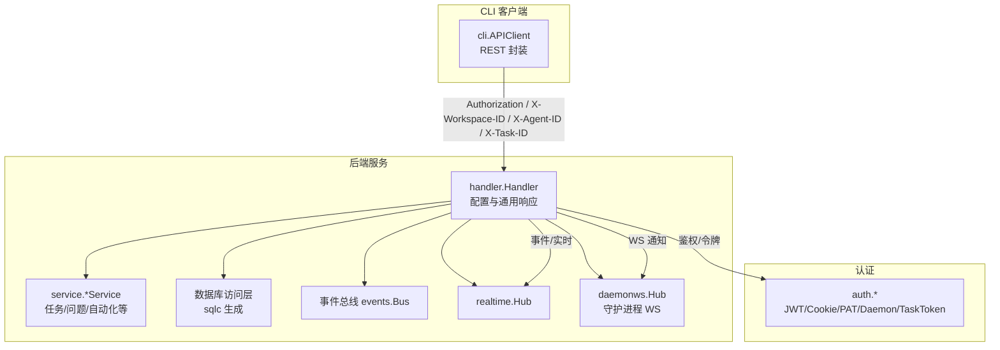
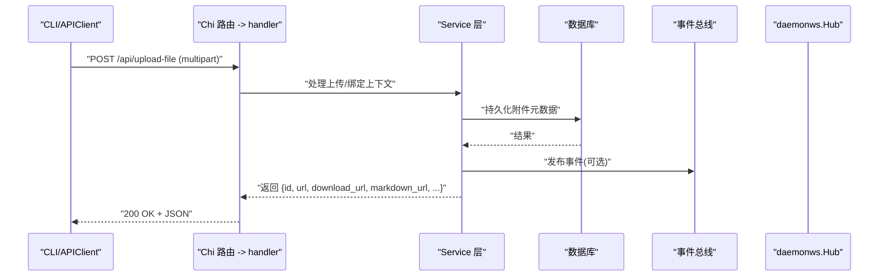
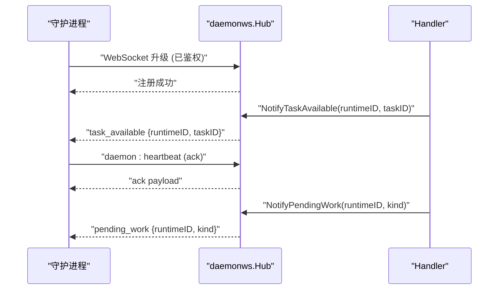
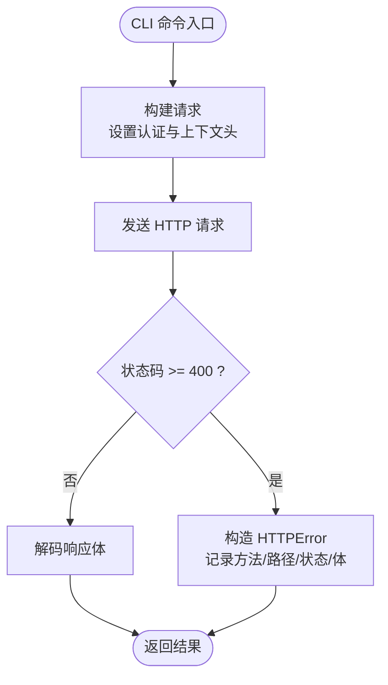
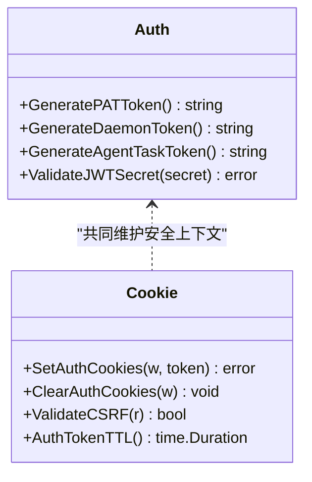
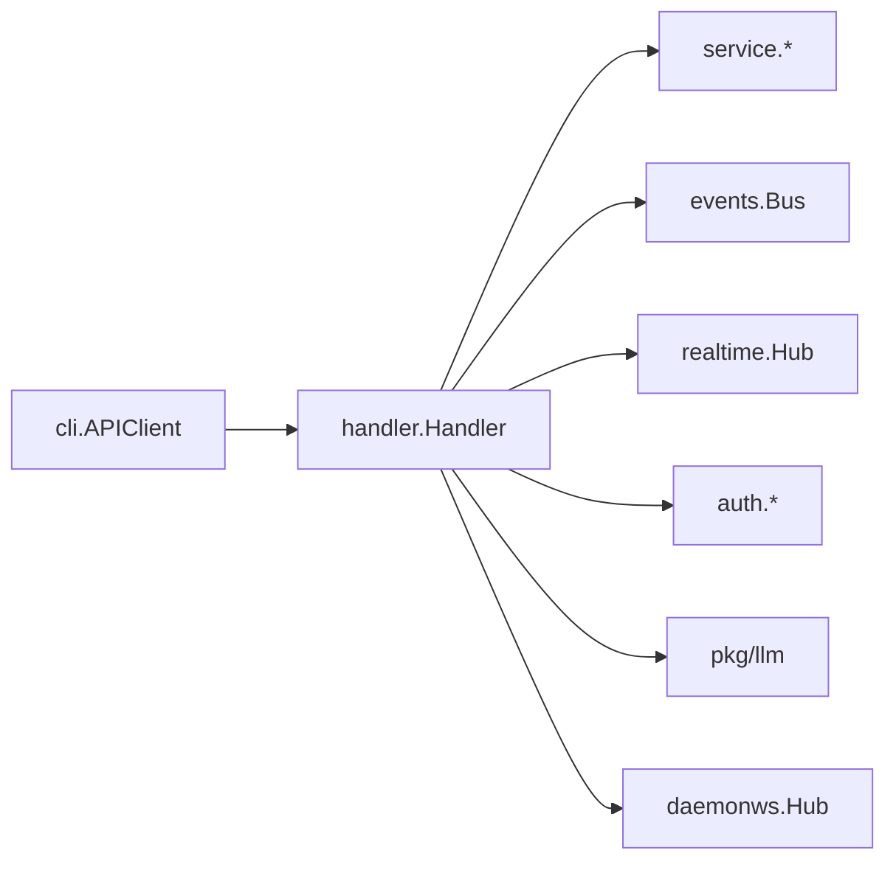

# API 参考

<cite>
**本文引用的文件**
- [server/internal/handler/handler.go](file://server/internal/handler/handler.go)
- [server/internal/daemonws/hub.go](file://server/internal/daemonws/hub.go)
- [server/internal/cli/client.go](file://server/internal/cli/client.go)
- [server/internal/auth/jwt.go](file://server/internal/auth/jwt.go)
- [server/internal/auth/cookie.go](file://server/internal/auth/cookie.go)
</cite>

## 目录
1. [简介](#简介)
2. [项目结构](#项目结构)
3. [核心组件](#核心组件)
4. [架构总览](#架构总览)
5. [详细组件分析](#详细组件分析)
6. [依赖关系分析](#依赖关系分析)
7. [性能考虑](#性能考虑)
8. [故障排查指南](#故障排查指南)
9. [结论](#结论)
10. [附录](#附录)

## 简介
本参考文档面向使用 Multica 后端 API 的开发者，覆盖以下方面：
- RESTful API 端点、HTTP 方法、URL 模式、请求/响应 Schema 与认证方式（基于代码中可见的客户端调用与错误格式）
- WebSocket API 的连接处理、消息格式与事件类型（守护进程侧）
- CLI 命令的完整语法与参数选项（通过内置 HTTP 客户端与标志解析）
- 认证令牌的使用方法与权限控制（PAT、Daemon Token、Agent Task Token、Cookie/CSRF）
- API 调用示例与错误处理策略（统一 JSON 错误体与结构化错误码）
- API 版本管理与向后兼容性（能力协商与稳定字段）
- 速率限制与安全考虑（Webhook 与邀请等限流、CSRF、可信代理、TTL 等）

说明：
- 本文档仅依据仓库内可验证的代码片段进行归纳；未直接出现的路由注册细节以“服务端路由由 Chi 注册”的方式描述。
- 所有示例均以“路径 + 方法 + 头部 + 请求体要点 + 响应要点”的形式给出，避免粘贴具体代码内容。

## 项目结构
- 后端服务采用 Go 语言，HTTP 路由基于 Chi，业务逻辑集中在 server/internal/handler 下的处理器；WebSocket 守护进程通信在 server/internal/daemonws。
- CLI 客户端位于 server/internal/cli，提供统一的 REST 调用封装与错误处理。
- 认证相关实现位于 server/internal/auth，包含 JWT、Cookie/CSRF、以及多种令牌生成器。

图表来源
- [server/internal/handler/handler.go:191-522](file://server/internal/handler/handler.go#L191-L522)
- [server/internal/daemonws/hub.go:310-443](file://server/internal/daemonws/hub.go#L310-L443)
- [server/internal/cli/client.go:46-247](file://server/internal/cli/client.go#L46-L247)
- [server/internal/auth/jwt.go:60-89](file://server/internal/auth/jwt.go#L60-L89)
- [server/internal/auth/cookie.go:148-185](file://server/internal/auth/cookie.go#L148-L185)

章节来源
- [server/internal/handler/handler.go:191-522](file://server/internal/handler/handler.go#L191-L522)
- [server/internal/daemonws/hub.go:310-443](file://server/internal/daemonws/hub.go#L310-L443)
- [server/internal/cli/client.go:46-247](file://server/internal/cli/client.go#L46-L247)
- [server/internal/auth/jwt.go:60-89](file://server/internal/auth/jwt.go#L60-L89)
- [server/internal/auth/cookie.go:148-185](file://server/internal/auth/cookie.go#L148-L185)

## 核心组件
- Handler 配置与响应工具
  - 集中式配置项：工作区创建开关、VCS 集成开关、公共 URL、应用 URL、可信代理、附件下载模式/TTL、插件表面源、LLM 配置、服务器版本等。
  - 统一 JSON 写入与错误输出：writeJSON/writeMeasuredJSON/writeError/writeErrorCode，确保 Content-Length 准确并返回稳定的错误结构。
  - UUID/时间戳/文本转换工具函数，保证数据一致性。
- 守护进程 WebSocket Hub
  - 连接升级、身份范围（RuntimeIDs/WorkspaceIDs/UserID）、心跳与 RPC 回调注册、按 Runtime/Workspace/User 广播、去重与慢连接驱逐。
- CLI APIClient
  - 自动注入认证与上下文头（Authorization、X-Workspace-ID、X-Agent-ID、X-Task-ID、X-Client-Capabilities、X-Client-Platform/Version/OS）。
  - 统一超时与上下文管理、上传/下载/导入技能/私有插件等便捷方法。
- 认证与令牌
  - PAT（mul_...）、Daemon Token（mdt_...）、Agent Task Token（mat_...），JWT Secret 校验，Cookie/CSRF 生命周期与安全属性。

章节来源
- [server/internal/handler/handler.go:68-152](file://server/internal/handler/handler.go#L68-L152)
- [server/internal/handler/handler.go:524-593](file://server/internal/handler/handler.go#L524-L593)
- [server/internal/daemonws/hub.go:22-42](file://server/internal/daemonws/hub.go#L22-L42)
- [server/internal/daemonws/hub.go:310-443](file://server/internal/daemonws/hub.go#L310-L443)
- [server/internal/cli/client.go:46-247](file://server/internal/cli/client.go#L46-L247)
- [server/internal/auth/jwt.go:60-89](file://server/internal/auth/jwt.go#L60-L89)
- [server/internal/auth/cookie.go:148-185](file://server/internal/auth/cookie.go#L148-L185)

## 架构总览
Multica 后端通过 Chi 路由将 HTTP 请求分发到 handler 包中的处理器；处理器组合 service 层完成业务逻辑，并通过事件总线与 realtime 层进行跨组件通信；守护进程通过 WebSocket 与 Hub 交互，接收任务可用、工作区变更、待处理工作等事件；CLI 作为外部客户端，通过 APIClient 发起 REST 调用，携带认证与上下文信息。

图表来源
- [server/internal/cli/client.go:466-518](file://server/internal/cli/client.go#L466-L518)
- [server/internal/handler/handler.go:524-573](file://server/internal/handler/handler.go#L524-L573)

## 详细组件分析

### RESTful API 概览
- 基础约定
  - 内容类型：application/json（除上传/导入等 multipart 接口）
  - 认证：Bearer Token（Authorization 头），或 Cookie（浏览器场景）
  - 上下文：X-Workspace-ID、X-Agent-ID、X-Task-ID（用于归属与任务级鉴权）
  - 能力协商：X-Client-Capabilities（例如 stable_attachment_urls）
  - 错误体：{"error":"...","code":"..."}（部分错误含 code）
- 典型端点（基于客户端调用推断）
  - 文件上传
    - POST /api/upload-file
      - 请求：multipart/form-data，字段 file，可选 issue_id 或 task_id
      - 响应：{ id, url, download_url, markdown_url, filename, content_type, size_bytes, created_at }
  - 技能导入
    - POST /api/skills/import
      - 请求：multipart/form-data，字段 file，可选 on_conflict
      - 响应：导入结果（结构化）
  - 私有插件上传
    - POST <path>（由调用方传入，通常为插件安装路径）
      - 请求：multipart/form-data，字段 artifact
      - 响应：安装结果（结构化）
  - 健康检查
    - GET /health
      - 响应：健康状态文本
- 版本与兼容
  - 通过 X-Client-Capabilities 协商能力（如稳定附件 URL），服务端据此调整响应形状，保持向后兼容。

章节来源
- [server/internal/cli/client.go:46-247](file://server/internal/cli/client.go#L46-L247)
- [server/internal/cli/client.go:466-518](file://server/internal/cli/client.go#L466-L518)
- [server/internal/cli/client.go:646-702](file://server/internal/cli/client.go#L646-L702)
- [server/internal/cli/client.go:704-740](file://server/internal/cli/client.go#L704-L740)
- [server/internal/cli/client.go:784-800](file://server/internal/cli/client.go#L784-L800)
- [server/internal/handler/handler.go:524-573](file://server/internal/handler/handler.go#L524-L573)

### WebSocket API（守护进程侧）
- 连接建立
  - 路径：/daemon/ws（由路由注册，此处不展示）
  - 认证：在升级前通过 Authorization 头完成鉴权；Hub 会拒绝无有效身份的升级
  - 身份范围：ClientIdentity 包含 DaemonID、UserID、WorkspaceID(s)、RuntimeIDs、Capabilities
- 消息类型与事件
  - 心跳：daemon:heartbeat（带 ack 负载）
  - RPC：daemon:rpc_request（method 驱动分发）
  - 事件（服务端推送给守护进程）：
    - 任务可用：EventDaemonTaskAvailable（payload: runtimeID, taskID）
    - 运行时配置变更：EventDaemonRuntimeProfilesChanged（payload: workspaceID, profileID）
    - 工作区集合变更：EventDaemonWorkspacesChanged（空 payload）
    - 待处理工作提示：EventDaemonPendingWork（payload: runtimeID, kind）
    - 运行时失效：EventDaemonHeartbeatAck（payload: runtimeGone=true 时触发失效流程）
- 连接管理
  - 写等待/心跳周期/读循环/并发 RPC 限制（每连接最多 8 个并发）
  - 慢连接驱逐与去重（eventID 去重、runtime gone 去重）

图表来源
- [server/internal/daemonws/hub.go:412-443](file://server/internal/daemonws/hub.go#L412-L443)
- [server/internal/daemonws/hub.go:445-546](file://server/internal/daemonws/hub.go#L445-L546)
- [server/internal/daemonws/hub.go:760-800](file://server/internal/daemonws/hub.go#L760-L800)

章节来源
- [server/internal/daemonws/hub.go:22-42](file://server/internal/daemonws/hub.go#L22-L42)
- [server/internal/daemonws/hub.go:310-443](file://server/internal/daemonws/hub.go#L310-L443)
- [server/internal/daemonws/hub.go:445-546](file://server/internal/daemonws/hub.go#L445-L546)
- [server/internal/daemonws/hub.go:760-800](file://server/internal/daemonws/hub.go#L760-L800)

### CLI 命令与参数
- 客户端行为
  - 自动设置：Authorization、X-Workspace-ID、X-Agent-ID、X-Task-ID、X-Client-Capabilities、X-Client-Platform/Version/OS
  - 超时：默认 30s，可通过 MULTICA_HTTP_TIMEOUT 覆盖；命令级上下文至少为 httpTimeout + 5s
  - 错误：统一包装为 HTTPError，支持 errors.As 判断状态码与是否使用了任务级 token
- 常用操作
  - 上传文件：UploadFile / UploadChatAttachment / UploadFileWithURL
  - 导入技能：ImportSkillFile（on_conflict 策略）
  - 上传私有插件：UploadPrivatePlugin
  - 下载文件：DownloadFile（相对/绝对 URL，最大 100MB）
  - 健康检查：HealthCheck
- 标志与环境变量
  - FlagOrEnv：优先命令行 flag，其次环境变量，最后回退值
  - 关键环境变量：MULTICA_HTTP_TIMEOUT、MULTICA_*（平台/版本/OS 由包级变量注入）

图表来源
- [server/internal/cli/client.go:211-247](file://server/internal/cli/client.go#L211-L247)
- [server/internal/cli/client.go:249-450](file://server/internal/cli/client.go#L249-L450)
- [server/internal/cli/client.go:742-782](file://server/internal/cli/client.go#L742-L782)
- [server/internal/cli/client.go:784-800](file://server/internal/cli/client.go#L784-L800)

章节来源
- [server/internal/cli/client.go:46-247](file://server/internal/cli/client.go#L46-L247)
- [server/internal/cli/client.go:249-450](file://server/internal/cli/client.go#L249-L450)
- [server/internal/cli/client.go:466-518](file://server/internal/cli/client.go#L466-L518)
- [server/internal/cli/client.go:646-702](file://server/internal/cli/client.go#L646-L702)
- [server/internal/cli/client.go:704-740](file://server/internal/cli/client.go#L704-L740)
- [server/internal/cli/client.go:742-782](file://server/internal/cli/client.go#L742-L782)
- [server/internal/cli/client.go:784-800](file://server/internal/cli/client.go#L784-L800)

### 认证与权限控制
- 令牌类型
  - 个人访问令牌（PAT）：mul_...，用于用户级 API 访问
  - 守护进程令牌（Daemon Token）：mdt_...，用于守护进程与服务端通信
  - Agent 任务令牌（Agent Task Token）：mat_...，单用途、绑定 (agent_id, task_id)，由守护进程注入到 agent 进程
- Cookie 与 CSRF
  - 登录成功后设置 HttpOnly 的认证 Cookie 与可读的 CSRF Cookie
  - CSRF 校验：对非安全方法要求 X-CSRF-Token，基于 HMAC(authToken, nonce) 验证
  - TTL：AUTH_TOKEN_TTL 控制 Cookie 有效期，默认 30 天；支持 duration 字符串或秒数
- JWT
  - JWT_SECRET 决定签名密钥；启动时会校验是否为不安全默认值
- 权限范围
  - 请求头：X-Workspace-ID（工作区范围）、X-Agent-ID（归属智能体）、X-Task-ID（任务级范围）
  - 守护进程连接：ClientIdentity.RuntimeIDs/WorkspaceIDs/UserID 限定作用域

图表来源
- [server/internal/auth/jwt.go:60-89](file://server/internal/auth/jwt.go#L60-L89)
- [server/internal/auth/cookie.go:148-185](file://server/internal/auth/cookie.go#L148-L185)
- [server/internal/auth/cookie.go:217-255](file://server/internal/auth/cookie.go#L217-L255)
- [server/internal/auth/cookie.go:70-89](file://server/internal/auth/cookie.go#L70-L89)

章节来源
- [server/internal/auth/jwt.go:60-89](file://server/internal/auth/jwt.go#L60-L89)
- [server/internal/auth/cookie.go:70-89](file://server/internal/auth/cookie.go#L70-L89)
- [server/internal/auth/cookie.go:148-185](file://server/internal/auth/cookie.go#L148-L185)
- [server/internal/auth/cookie.go:217-255](file://server/internal/auth/cookie.go#L217-L255)

### 错误处理策略
- 统一 JSON 错误体
  - writeError：{"error":"..."}
  - writeErrorCode：{"error":"...","code":"..."}（机器可读的错误码）
  - 冲突：revision_conflict（资源版本冲突）
- CLI 错误
  - HTTPError：包含 Method、Path、StatusCode、Body、TaskScoped（是否使用了 mat_ 令牌）
  - 传输层错误包装：wrapTransport/wrapBodyRead
- 建议
  - 客户端根据 status code 分类处理（4xx 客户端错误、5xx 服务端错误）
  - 对 revision_conflict 做重试或提示用户刷新
  - 对 mat_ 令牌 401 视为任务结束或令牌过期，不应引导重新登录

章节来源
- [server/internal/handler/handler.go:524-593](file://server/internal/handler/handler.go#L524-L593)
- [server/internal/cli/client.go:73-120](file://server/internal/cli/client.go#L73-L120)

### 速率限制与安全
- 速率限制
  - Webhook 限流：WebhookRateLimiter、WebhookIPRateLimiter、WebhookAbsoluteIPRateLimiter
  - 邀请限流：InvitationRateLimiters
  - 守护进程并发：每连接最多 8 个并发 RPC
- 安全
  - CSRF：HMAC 签名校验，禁止 IP 字面量作为 Cookie Domain
  - 可信代理：TrustedProxies 控制信任的 X-Forwarded-For/X-Real-IP 来源
  - 附件下载：TTL 与模式控制（auto/直链/签名链接）
  - LLM 配置：内部使用，禁用时优雅降级
  - VCS 集成：部署级开关，云环境默认关闭

章节来源
- [server/internal/handler/handler.go:68-152](file://server/internal/handler/handler.go#L68-L152)
- [server/internal/daemonws/hub.go:298-300](file://server/internal/daemonws/hub.go#L298-L300)
- [server/internal/auth/cookie.go:91-112](file://server/internal/auth/cookie.go#L91-L112)

## 依赖关系分析
- Handler 依赖 service、events、realtime、storage、auth、llm、cloudruntime、channel 等子系统，形成高内聚低耦合的服务边界。
- daemonws.Hub 通过 gorilla/websocket 实现长连接，按 Runtime/Workspace/User 维度广播事件，具备去重与慢连接保护。
- cli.APIClient 作为外部消费者，通过标准 HTTP 协议与服务器交互，屏蔽了认证与上下文注入细节。

图表来源
- [server/internal/handler/handler.go:191-522](file://server/internal/handler/handler.go#L191-L522)
- [server/internal/daemonws/hub.go:310-443](file://server/internal/daemonws/hub.go#L310-L443)
- [server/internal/cli/client.go:46-247](file://server/internal/cli/client.go#L46-L247)

章节来源
- [server/internal/handler/handler.go:191-522](file://server/internal/handler/handler.go#L191-L522)
- [server/internal/daemonws/hub.go:310-443](file://server/internal/daemonws/hub.go#L310-L443)
- [server/internal/cli/client.go:46-247](file://server/internal/cli/client.go#L46-L247)

## 性能考虑
- 响应体长度：writeJSON 预先编码并设置 Content-Length，避免分块传输导致的不确定性
- 守护进程连接：写等待与心跳周期控制，慢连接驱逐，事件去重降低重复开销
- CLI 超时：默认 30s，支持环境变量覆盖；大文件上传/下载动态延长超时
- 并发控制：守护进程每连接 RPC 并发上限，防止单连接耗尽资源

[本节为通用指导，无需特定文件引用]

## 故障排查指南
- 常见错误
  - 400：无效 UUID/参数（parseUUIDOrBadRequest）
  - 401：令牌无效或过期（PAT/Daemon/Task Token）
  - 409：资源版本冲突（revision_conflict）
  - 500：服务端内部错误（编码失败等）
- 定位步骤
  - 检查 Authorization 与上下文头是否正确（X-Workspace-ID、X-Agent-ID、X-Task-ID）
  - 查看响应体中的 error/code 字段
  - 对 mat_ 令牌 401，确认任务是否已结束或令牌是否被清理
  - 守护进程侧：检查 Hub 是否收到心跳/ack，是否存在慢连接驱逐

章节来源
- [server/internal/handler/handler.go:524-593](file://server/internal/handler/handler.go#L524-L593)
- [server/internal/cli/client.go:73-120](file://server/internal/cli/client.go#L73-L120)

## 结论
本参考文档基于代码实现了：
- RESTful API 的统一错误模型、认证与上下文注入、典型端点（上传/导入/插件/健康检查）
- 守护进程 WebSocket 的连接、消息与事件模型，以及并发与去重机制
- CLI 客户端的超时、错误与能力协商
- 认证体系（PAT/Daemon/Task Token、Cookie/CSRF、JWT）与权限范围
- 速率限制与安全配置要点
建议在集成时遵循上述约定，并结合实际路由注册与业务处理器进行扩展。

[本节为总结性内容，无需特定文件引用]

## 附录
- 能力协商
  - X-Client-Capabilities: stable_attachment_urls（使列表响应返回稳定下载路径）
- 环境变量
  - MULTICA_HTTP_TIMEOUT：CLI 请求超时
  - AUTH_TOKEN_TTL：Cookie 有效期
  - JWT_SECRET：JWT 签名密钥（生产环境必须替换）
  - MULTICA_TRUSTED_PROXIES：可信代理 CIDR
  - MULTICA_LLM_*：LLM 内部配置
  - MULTICA_VCS_INTEGRATION_ENABLED：VCS 集成开关
- 最佳实践
  - 始终设置 X-Workspace-ID 明确作用域
  - 对 mat_ 令牌 401 不做重试，直接终止任务
  - 使用 writeErrorCode 的 code 字段进行 UI 翻译与降级

[本节为补充信息，无需特定文件引用]