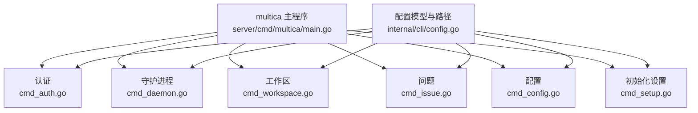
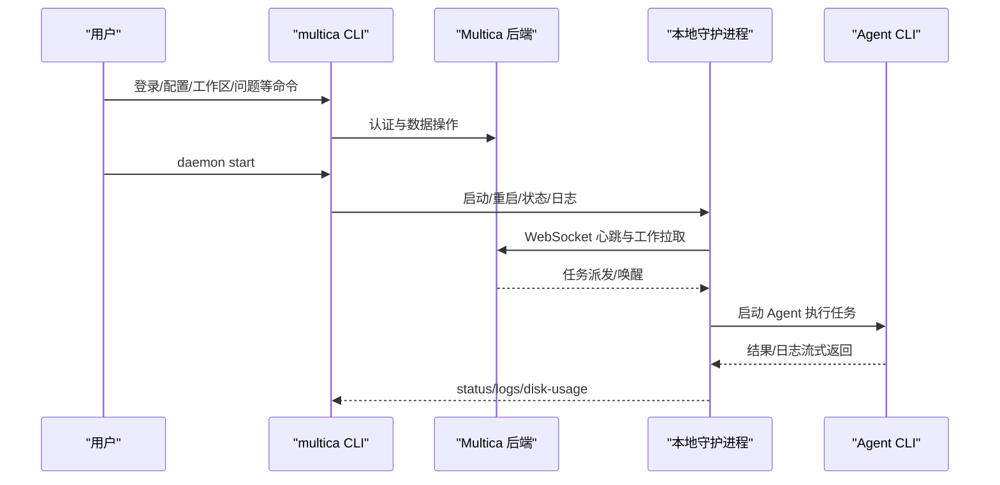
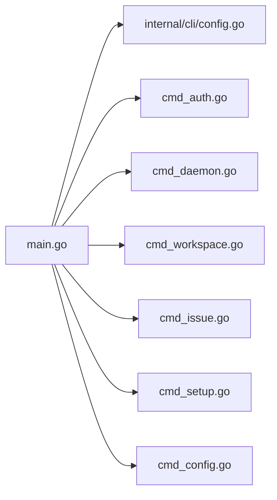

# CLI 命令

<cite>
**本文引用的文件**
- [CLI_AND_DAEMON.md](file://CLI_AND_DAEMON.md)
- [CLI_INSTALL.md](file://CLI_INSTALL.md)
- [main.go](file://server/cmd/multica/main.go)
- [cmd_auth.go](file://server/cmd/multica/cmd_auth.go)
- [cmd_daemon.go](file://server/cmd/multica/cmd_daemon.go)
- [cmd_workspace.go](file://server/cmd/multica/cmd_workspace.go)
- [cmd_issue.go](file://server/cmd/multica/cmd_issue.go)
- [cmd_config.go](file://server/cmd/multica/cmd_config.go)
- [cmd_setup.go](file://server/cmd/multica/cmd_setup.go)
- [config.go](file://server/internal/cli/config.go)
- [install.sh](file://scripts/install.sh)
</cite>

## 目录
1. [简介](#简介)
2. [项目结构](#项目结构)
3. [核心组件](#核心组件)
4. [架构总览](#架构总览)
5. [详细命令参考](#详细命令参考)
6. [依赖关系分析](#依赖关系分析)
7. [性能与运行特性](#性能与运行特性)
8. [故障排除指南](#故障排除指南)
9. [结论](#结论)
10. [附录](#附录)

## 简介
本参考文档面向使用 multica CLI 的用户与自动化脚本，覆盖安装、认证、配置、工作区/问题/项目/标签/技能/代理等管理命令，以及本地守护进程（daemon）的启动、日志、磁盘使用与垃圾回收策略。同时提供常见场景示例、输出格式说明、错误码含义、平台兼容性、脚本集成与调试选项。

## 项目结构
multica CLI 基于 Cobra 构建，入口在 server/cmd/multica/main.go；各子命令按功能拆分到独立文件：认证、守护进程、工作区、问题、配置、初始化设置等。配置文件由 server/internal/cli/config.go 统一读写，支持 profile 隔离与任务级临时配置根。

**图表来源**
- [main.go:26-96](file://server/cmd/multica/main.go#L26-L96)
- [config.go:22-166](file://server/internal/cli/config.go#L22-L166)

**章节来源**
- [main.go:26-96](file://server/cmd/multica/main.go#L26-L96)
- [config.go:22-166](file://server/internal/cli/config.go#L22-L166)

## 核心组件
- 全局标志与分组：--server-url、--workspace-id、--profile、--debug；命令按 core/runtime/additional 分组注册。
- 配置层：CLIConfig 持久化 server_url/app_url/workspace_id/token/device_name/runtime_name/workspaces_root 及多项 daemon 行为开关；支持 profile 隔离与任务级临时根。
- 认证：浏览器 OAuth 或 PAT 登录，保存 token 并自动发现工作区。
- 守护进程：后台/前台启动、健康检查、日志轮转、自动重载与自更新、GC 策略、多 agent 运行时探测。
- 资源管理：工作区、问题、项目、标签、属性、技能、代理、MCP 服务器库等 CRUD 与查询。

**章节来源**
- [main.go:26-96](file://server/cmd/multica/main.go#L26-L96)
- [config.go:22-166](file://server/internal/cli/config.go#L22-L166)
- [cmd_auth.go:44-71](file://server/cmd/multica/cmd_auth.go#L44-L71)
- [cmd_daemon.go:30-150](file://server/cmd/multica/cmd_daemon.go#L30-L150)

## 架构总览
CLI 通过 HTTP/WebSocket 与 Multica 后端交互；daemon 负责本地 agent 生命周期管理与任务执行。

**图表来源**
- [cmd_auth.go:238-360](file://server/cmd/multica/cmd_auth.go#L238-L360)
- [cmd_daemon.go:544-715](file://server/cmd/multica/cmd_daemon.go#L544-L715)
- [CLI_AND_DAEMON.md:235-241](file://CLI_AND_DAEMON.md#L235-L241)

## 详细命令参考

### 通用标志
- --server-url：后端地址（环境变量 MULTICA_SERVER_URL）
- --workspace-id：目标工作区（环境变量 MULTICA_WORKSPACE_ID）
- --profile：配置/状态隔离名
- --debug：失败时打印完整错误链

**章节来源**
- [main.go:42-45](file://server/cmd/multica/main.go#L42-L45)

### 安装与更新
- 一键安装（macOS/Linux）：Homebrew 或 GitHub Releases
- Windows：PowerShell 安装器
- 更新：multica update（自动检测安装方式）

常用命令示例
- brew install multica-ai/tap/multica
- curl ... | bash -s -- --with-server（可选安装自托管服务）
- multica update

**章节来源**
- [CLI_INSTALL.md:15-117](file://CLI_INSTALL.md#L15-L117)
- [CLI_AND_DAEMON.md:5-34](file://CLI_AND_DAEMON.md#L5-L34)
- [install.sh:120-191](file://scripts/install.sh#L120-L191)
- [install.sh:426-448](file://scripts/install.sh#L426-L448)

### 初始化与认证
- 快速初始化：multica setup / multica setup cloud / multica setup self-host
- 登录：multica login（浏览器 OAuth 或 --token）
- 查看认证状态：multica auth status
- 登出：multica auth logout

注意
- 自托管需正确设置 server_url/app_url，必要时使用 --callback-host
- SSH 环境建议使用 token 登录

**章节来源**
- [cmd_setup.go:19-84](file://server/cmd/multica/cmd_setup.go#L19-L84)
- [cmd_setup.go:141-181](file://server/cmd/multica/cmd_setup.go#L141-L181)
- [cmd_setup.go:183-262](file://server/cmd/multica/cmd_setup.go#L183-L262)
- [cmd_auth.go:124-140](file://server/cmd/multica/cmd_auth.go#L124-L140)
- [cmd_auth.go:413-463](file://server/cmd/multica/cmd_auth.go#L413-L463)
- [cmd_auth.go:466-507](file://server/cmd/multica/cmd_auth.go#L466-L507)
- [CLI_AND_DAEMON.md:60-92](file://CLI_AND_DAEMON.md#L60-L92)

### 配置管理
- 查看配置：multica config show
- 设置键值：multica config set <key> <value>
- 支持 key：server_url、app_url、workspace_id、device_name、runtime_name、workspaces_root、max_concurrent_tasks、poll_interval、ws_claim_poll_interval、heartbeat_interval、agent_timeout、codex_semantic_inactivity_timeout、codex_handshake_timeout、disable_auto_update、auto_update_check_interval、disable_auto_reload

优先级
- 命令行标志 > 环境变量 > 配置文件 > 内置默认

**章节来源**
- [cmd_config.go:16-81](file://server/cmd/multica/cmd_config.go#L16-L81)
- [cmd_config.go:117-143](file://server/cmd/multica/cmd_config.go#L117-L143)
- [cmd_config.go:145-261](file://server/cmd/multica/cmd_config.go#L145-L261)
- [config.go:22-166](file://server/internal/cli/config.go#L22-L166)

### 工作区
- 列出：multica workspace list [--full-id] [--output table|json]
- 切换默认：multica workspace switch <id|slug|prefix>
- 详情：multica workspace get [id|slug|prefix] [--output]
- 成员：multica workspace member list [id|slug|prefix]
- MCP 服务器库：multica workspace mcp {list|add|update|remove}

工作区解析优先级
- --workspace-id > MULTICA_WORKSPACE_ID > 当前 profile 默认

**章节来源**
- [cmd_workspace.go:17-100](file://server/cmd/multica/cmd_workspace.go#L17-L100)
- [cmd_workspace.go:240-280](file://server/cmd/multica/cmd_workspace.go#L240-L280)
- [cmd_workspace.go:432-456](file://server/cmd/multica/cmd_workspace.go#L432-L456)
- [cmd_workspace.go:605-742](file://server/cmd/multica/cmd_workspace.go#L605-L742)
- [CLI_AND_DAEMON.md:445-457](file://CLI_AND_DAEMON.md#L445-L457)

### 问题（Issue）
- 列表：multica issue list [--status|--priority|--assignee|--assignee-id|--project|--metadata|--property|--limit|--sort|--direction|--full-id|--output]
- 获取：multica issue get <id> [--output]
- 创建：multica issue create --title ... [--description|--priority|--assignee|--assignee-id|--parent|--project|--due-date]
- 更新：multica issue update <id> [--title|--priority|--position]
- 重排：multica issue reorder <id> --top|--bottom|--before|--after
- 指派：multica issue assign <id> --to/--to-id|--unassign
- 状态：multica issue status <id> <state>
- 评论：multica issue comment list/add/delete（支持 --thread、--recent、--tail、--before/--before-id、--since）
- 元数据：multica issue metadata list/get/set/delete
- 订阅者：multica issue subscriber list/add/remove
- 执行历史：multica issue runs/run-messages/usage

排序与过滤要点
- 默认按 board 顺序（position 升序）
- 支持按 title/created_at/start_date/due_date/priority/property:<name-or-id> 排序
- metadata 与 property 过滤支持多种类型与组合

**章节来源**
- [CLI_AND_DAEMON.md:493-746](file://CLI_AND_DAEMON.md#L493-L746)
- [cmd_issue.go:166-200](file://server/cmd/multica/cmd_issue.go#L166-L200)

### 项目（Project）
- 列表：multica project list [--status|--output]
- 获取：multica project get <id> [--output]
- 创建：multica project create --title ... [--description|--status|--icon|--lead|--start-date|--due-date]
- 更新：multica project update <id> [--title|--description|--status|--icon|--lead|--start-date|--due-date]
- 状态：multica project status <id> <state>
- 删除：multica project delete <id>

**章节来源**
- [CLI_AND_DAEMON.md:747-800](file://CLI_AND_DAEMON.md#L747-L800)

### 守护进程（Daemon）
- 启动：multica daemon start [--foreground|--daemon-id|--device-name|--runtime-name|--workspaces-root|--poll-interval|--ws-claim-poll-interval|--heartbeat-interval|--agent-timeout|--codex-semantic-inactivity-timeout|--codex-handshake-timeout|--max-concurrent-tasks|--no-auto-update|--auto-update-interval|--no-auto-reload]
- 停止：multica daemon stop
- 状态：multica daemon status [--output table|json]
- 日志：multica daemon logs [-f|-n|--profile]
- 重启：multica daemon restart
- 探测运行时：multica daemon probe-runtimes（隐藏命令）
- 磁盘使用：multica daemon disk-usage [--by-workspace|--by-task|--top|--output|--workspaces-root|--all-profiles]

重要行为
- 自动重载：当磁盘上的 multica 二进制版本变化时，daemon 会在空闲后重启到新二进制
- 自更新：可禁用 periodic 自更新检查
- GC：按策略清理任务目录、制品、仓库缓存、Hermes 会话/记忆、临时目录等

**章节来源**
- [cmd_daemon.go:30-150](file://server/cmd/multica/cmd_daemon.go#L30-L150)
- [cmd_daemon.go:515-715](file://server/cmd/multica/cmd_daemon.go#L515-L715)
- [CLI_AND_DAEMON.md:94-300](file://CLI_AND_DAEMON.md#L94-L300)

### 其他命令
- 版本：multica version
- 更新：multica update
- 附件：multica attachment ...
- 技能：multica skill ...
- 代理：multica agent ...
- 自动飞行：multica autopilot ...
- 仓库：multica repo ...
- 小队：multica squad ...
- 聊天：multica chat ...

**章节来源**
- [main.go:47-94](file://server/cmd/multica/main.go#L47-L94)

## 依赖关系分析
- CLI 入口将命令分组注册到 rootCmd，所有子命令共享全局标志与配置解析。
- 配置层集中管理 profile 路径、任务级临时根、权限与原子写入。
- 认证模块实现 OAuth 回调与 PAT 登录，并将 token 写入对应 profile。
- 守护进程模块负责进程管理、健康端口、日志轮转、自动重载与 GC。
- 工作区/问题/项目等模块通过统一的 API 客户端访问后端。

**图表来源**
- [main.go:26-96](file://server/cmd/multica/main.go#L26-L96)
- [config.go:223-397](file://server/internal/cli/config.go#L223-L397)

**章节来源**
- [main.go:26-96](file://server/cmd/multica/main.go#L26-L96)
- [config.go:223-397](file://server/internal/cli/config.go#L223-L397)

## 性能与运行特性
- 守护进程并发：--max-concurrent-tasks 控制并行任务数
- 轮询与心跳：--poll-interval、--heartbeat-interval、--ws-claim-poll-interval
- 超时控制：--agent-timeout、--codex-semantic-inactivity-timeout、--codex-handshake-timeout
- 自动重载与自更新：可通过标志或配置关闭
- GC 策略：按 TTL 清理任务目录、制品、仓库缓存、Hermes 会话/记忆、临时目录等

**章节来源**
- [cmd_daemon.go:95-142](file://server/cmd/multica/cmd_daemon.go#L95-L142)
- [CLI_AND_DAEMON.md:243-300](file://CLI_AND_DAEMON.md#L243-L300)

## 故障排除指南
常见问题与处理
- 无法打开浏览器：使用 --token 登录或在 SSH 中转发回调端口
- 守护进程启动失败：检查网络可达性与 token 有效性；查看 daemon.log 与 daemon.err.log
- 端口冲突：确认同名 profile 的健康端口是否被占用；避免不同 profile 名称哈希冲突
- 未检测到 Agent：确保至少一个受支持的 Agent CLI 已安装并在 PATH 中
- 配置不生效：setup/self-host 后需重启 daemon；或通过 daemon restart 应用新配置

调试选项
- --debug：打印完整错误链
- daemon logs -f/-n：实时跟踪或指定行数
- daemon status --output json：结构化输出便于脚本解析
- 环境变量：MULTICA_DEBUG、MULTICA_SERVER_URL、MULTICA_APP_URL、MULTICA_WORKSPACE_ID、MULTICA_TOKEN 等

错误码与退出码
- 成功：0
- 认证失败/令牌无效：非零（具体由 cli.ExitCodeFor 映射）
- 网络不可达/服务端拒绝：非零
- 参数校验失败：非零

**章节来源**
- [cmd_auth.go:238-360](file://server/cmd/multica/cmd_auth.go#L238-L360)
- [cmd_daemon.go:717-799](file://server/cmd/multica/cmd_daemon.go#L717-L799)
- [CLI_AND_DAEMON.md:148-199](file://CLI_AND_DAEMON.md#L148-L199)
- [main.go:99-115](file://server/cmd/multica/main.go#L99-L115)

## 结论
multica CLI 提供了从安装、认证、配置到工作区/问题/项目/技能/代理的全链路管理能力，并通过本地守护进程调度多种 AI Agent 执行任务。借助 profile 隔离、丰富的配置项与完善的日志/GC 机制，适合个人开发与团队自动化场景。建议在生产环境中合理设置并发、超时与 GC 策略，并结合 CI/CD 进行脚本化部署与监控。

## 附录

### 常用操作场景示例
- 项目初始化
  - multica setup
  - multica setup self-host --server-url https://api.example.com --app-url https://app.example.com
- 部署与运行
  - multica daemon start
  - multica daemon status
  - multica daemon logs -f
- 监控与运维
  - multica daemon disk-usage --by-workspace
  - multica issue usage <issue-id> --output json
  - multica workspace list --output json

**章节来源**
- [CLI_AND_DAEMON.md:36-58](file://CLI_AND_DAEMON.md#L36-L58)
- [CLI_AND_DAEMON.md:94-199](file://CLI_AND_DAEMON.md#L94-L199)
- [CLI_AND_DAEMON.md:705-746](file://CLI_AND_DAEMON.md#L705-L746)

### 平台兼容性与安装方法
- macOS/Linux：Homebrew 或 GitHub Releases
- Windows：PowerShell 安装器
- Docker Compose 自托管：install.sh --with-server

**章节来源**
- [CLI_INSTALL.md:15-117](file://CLI_INSTALL.md#L15-L117)
- [install.sh:120-191](file://scripts/install.sh#L120-L191)
- [install.sh:453-483](file://scripts/install.sh#L453-L483)

### 脚本集成与自动化
- 使用 --output json 输出结构化数据
- 通过 --workspace-id/MULTICA_WORKSPACE_ID 指定工作区
- 使用 --profile 隔离多环境
- 结合 multica issue runs/run-messages/usage 进行流水线状态同步与成本统计

**章节来源**
- [cmd_workspace.go:240-280](file://server/cmd/multica/cmd_workspace.go#L240-L280)
- [CLI_AND_DAEMON.md:705-746](file://CLI_AND_DAEMON.md#L705-L746)