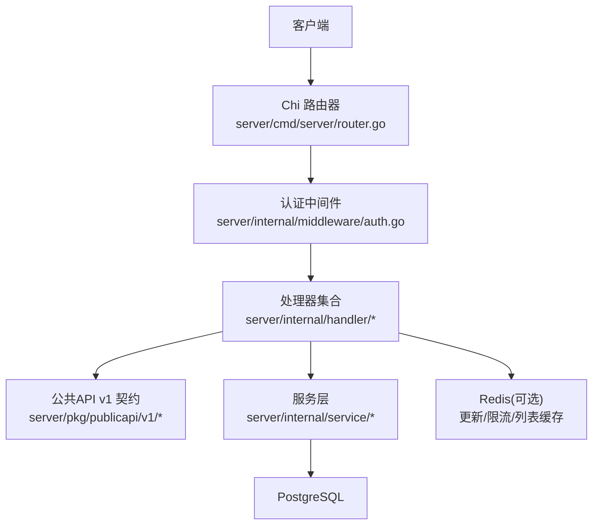
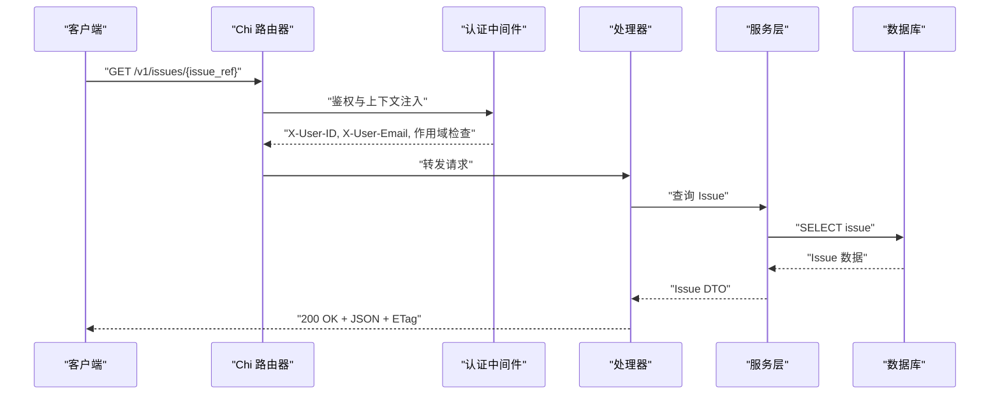
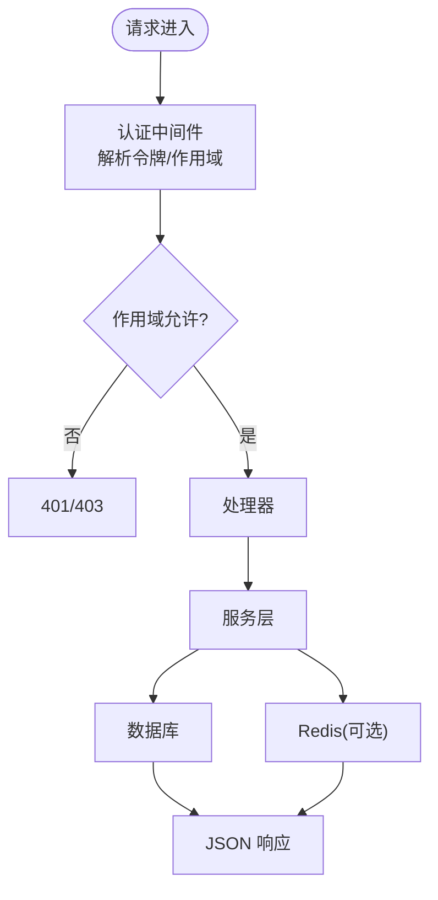

# REST API

<cite>
**本文引用的文件**
- [router.go](file://server/cmd/server/router.go)
- [handler.go](file://server/internal/handler/handler.go)
- [auth.go](file://server/internal/middleware/auth.go)
- [routes.go](file://server/pkg/publicapi/v1/routes.go)
- [types.go](file://server/pkg/publicapi/v1/types.go)
- [openapi.yaml](file://server/pkg/publicapi/v1/openapi.yaml)
</cite>

## 目录
1. [简介](#简介)
2. [项目结构](#项目结构)
3. [核心组件](#核心组件)
4. [架构总览](#架构总览)
5. [详细端点文档](#详细端点文档)
6. [依赖关系分析](#依赖关系分析)
7. [性能与缓存](#性能与缓存)
8. [故障排查指南](#故障排查指南)
9. [结论](#结论)
10. [附录：客户端集成与最佳实践](#附录客户端集成与最佳实践)

## 简介
本文件为 Multica 后端 RESTful API 的权威说明，聚焦于已版本化的公共 API v1（/v1），涵盖 URL 模式、请求方法、请求头、请求体 Schema、响应格式、认证与授权、速率限制、缓存策略、错误处理、版本管理与兼容性策略，以及客户端集成示例和最佳实践。该 API 当前主要面向插件安装与调用场景，同时提供共享资源（Issue、Comment）的稳定契约，便于未来扩展到用户/PAT 入口。

## 项目结构
后端采用 Go + Chi 路由，API 路由在启动时集中注册；公共 API v1 的契约定义在独立包中，确保不同信任面（插件、未来用户/PAT）复用同一组路径、DTO 和操作语义。认证通过中间件统一处理，支持多种令牌来源与校验。

**图示来源**
- [router.go:204-509](file://server/cmd/server/router.go#L204-L509)
- [auth.go:34-285](file://server/internal/middleware/auth.go#L34-L285)
- [routes.go:1-68](file://server/pkg/publicapi/v1/routes.go#L1-L68)

**章节来源**
- [router.go:204-509](file://server/cmd/server/router.go#L204-L509)
- [handler.go:407-522](file://server/internal/handler/handler.go#L407-L522)

## 核心组件
- 路由与中间件：Chi 路由器集中注册所有路由，CORS、工作区解析、认证等中间件串联执行。
- 认证中间件：统一解析 Bearer 令牌或 HttpOnly Cookie，支持任务令牌、云节点 PAT、个人访问令牌（PAT）、JWT，并设置 X-User-ID/X-User-Email 等上下文头。
- 公共 API v1：以 OpenAPI 描述稳定契约，包含插件扩展与共享资源操作，限定作用域与速率限制策略。
- 处理器与服务：按领域拆分，封装业务逻辑、事务、事件发布与缓存交互。

**章节来源**
- [auth.go:34-285](file://server/internal/middleware/auth.go#L34-L285)
- [routes.go:1-68](file://server/pkg/publicapi/v1/routes.go#L1-L68)
- [openapi.yaml:1-405](file://server/pkg/publicapi/v1/openapi.yaml#L1-L405)

## 架构总览
下图展示一次 /v1/issues/{issue_ref} GET 请求的典型流程：客户端携带令牌进入路由器，经过认证中间件解析身份与作用域，随后由处理器读取数据并返回 JSON，必要时附带 ETag 用于缓存。

**图示来源**
- [router.go:204-509](file://server/cmd/server/router.go#L204-L509)
- [auth.go:34-285](file://server/internal/middleware/auth.go#L34-L285)
- [openapi.yaml:29-73](file://server/pkg/publicapi/v1/openapi.yaml#L29-L73)

## 详细端点文档
以下列出公共 API v1 的所有端点，包括 URL、方法、认证、作用域、请求头、请求体、响应与错误。

### 获取插件上下文
- URL: /v1/context
- 方法: GET
- 认证: 插件安装令牌或插件调用令牌（Bearer）
- 作用域: 无需额外 scope（插件扩展）
- 请求头:
  - Authorization: Bearer <mpi_ 或 mpc_ 令牌>
  - Idempotency-Key: 可选（幂等键，预留）
- 响应体: Context（包含 workspace、user、issue、config、granted_net_domains、actor）
- 成功响应: 200 OK，application/json
- 错误响应: 401/403/404/429/5xx，application/problem+json

参考 Schema:
- [Context:5-12](file://server/pkg/publicapi/v1/types.go#L5-L12)
- [OpenAPI 定义:15-28](file://server/pkg/publicapi/v1/openapi.yaml#L15-L28)

**章节来源**
- [routes.go:57-58](file://server/pkg/publicapi/v1/routes.go#L57-L58)
- [openapi.yaml:15-28](file://server/pkg/publicapi/v1/openapi.yaml#L15-L28)
- [types.go:5-12](file://server/pkg/publicapi/v1/types.go#L5-L12)

### 获取问题（Issue）
- URL: /v1/issues/{issue_ref}
- 方法: GET
- 认证: 用户 OAuth、个人访问令牌（PAT）、插件安装令牌、插件调用令牌（Bearer）
- 作用域: issues:read
- 路径参数:
  - issue_ref: 问题 UUID 或工作区标识（如 MUL-123）
- 请求头:
  - Authorization: Bearer <令牌>
  - If-Match: 可选（弱/强 ETag，用于并发控制）
  - Idempotency-Key: 可选
- 响应体: Issue（包含 id、workspace_id、number、identifier、title、description、status、priority、assignee_type、assignee_id、creator_type、creator_id、parent_issue_id、project_id、position、stage、start_date、due_date、created_at、updated_at、revision、last_activity_at、metadata、properties）
- 成功响应: 200 OK，application/json，带 ETag 响应头
- 错误响应: 401/403/404/409/429/5xx，application/problem+json

参考 Schema:
- [Issue:34-60](file://server/pkg/publicapi/v1/types.go#L34-L60)
- [OpenAPI 定义:29-73](file://server/pkg/publicapi/v1/openapi.yaml#L29-L73)

**章节来源**
- [routes.go:59](file://server/pkg/publicapi/v1/routes.go#L59)
- [openapi.yaml:29-73](file://server/pkg/publicapi/v1/openapi.yaml#L29-L73)
- [types.go:34-60](file://server/pkg/publicapi/v1/types.go#L34-L60)

### 更新问题（Issue）
- URL: /v1/issues/{issue_ref}
- 方法: PATCH
- 认证: 同上（issues:write）
- 作用域: issues:write
- 路径参数: issue_ref
- 请求头:
  - Authorization: Bearer <令牌>
  - If-Match: 可选（期望 revision 的 ETag）
  - Idempotency-Key: 可选
- 请求体: PatchIssueRequest（至少包含 title 或 description，可选 expected_revision）
- 响应体: Issue（更新后的）
- 成功响应: 200 OK，application/json，带 ETag
- 错误响应: 400/401/403/404/409/429/5xx，application/problem+json

参考 Schema:
- [PatchIssueRequest:62-66](file://server/pkg/publicapi/v1/types.go#L62-L66)
- [OpenAPI 定义:49-73](file://server/pkg/publicapi/v1/openapi.yaml#L49-L73)

**章节来源**
- [routes.go:60](file://server/pkg/publicapi/v1/routes.go#L60)
- [openapi.yaml:49-73](file://server/pkg/publicapi/v1/openapi.yaml#L49-L73)
- [types.go:62-66](file://server/pkg/publicapi/v1/types.go#L62-L66)

### 列出评论（Comments）
- URL: /v1/issues/{issue_ref}/comments
- 方法: GET
- 认证: 同上（comments:read）
- 作用域: comments:read
- 路径参数: issue_ref
- 响应体: CommentListResponse（comments 数组）
- 成功响应: 200 OK，application/json
- 错误响应: 401/403/404/429/5xx，application/problem+json

参考 Schema:
- [CommentListResponse:78-80](file://server/pkg/publicapi/v1/types.go#L78-L80)
- [OpenAPI 定义:74-90](file://server/pkg/publicapi/v1/openapi.yaml#L74-L90)

**章节来源**
- [routes.go:61](file://server/pkg/publicapi/v1/routes.go#L61)
- [openapi.yaml:74-90](file://server/pkg/publicapi/v1/openapi.yaml#L74-L90)
- [types.go:78-80](file://server/pkg/publicapi/v1/types.go#L78-L80)

### 创建评论（Comment）
- URL: /v1/issues/{issue_ref}/comments
- 方法: POST
- 认证: 同上（comments:write）
- 作用域: comments:write
- 路径参数: issue_ref
- 请求体: CreateCommentRequest（content 必填，parent_id 可选）
- 响应体: Comment
- 成功响应: 201 Created，application/json
- 错误响应: 400/401/403/404/429/5xx，application/problem+json

参考 Schema:
- [CreateCommentRequest:82-85](file://server/pkg/publicapi/v1/types.go#L82-L85)
- [Comment:68-76](file://server/pkg/publicapi/v1/types.go#L68-L76)
- [OpenAPI 定义:91-110](file://server/pkg/publicapi/v1/openapi.yaml#L91-L110)

**章节来源**
- [routes.go:62](file://server/pkg/publicapi/v1/routes.go#L62)
- [openapi.yaml:91-110](file://server/pkg/publicapi/v1/openapi.yaml#L91-L110)
- [types.go:68-85](file://server/pkg/publicapi/v1/types.go#L68-L85)

### 列出插件存储键
- URL: /v1/storage/{scope}
- 方法: GET
- 认证: 插件安装令牌或插件调用令牌（Bearer）
- 作用域: 插件扩展
- 路径参数:
  - scope: user 或 workspace
- 响应体: StorageKeyListResponse（keys 数组）
- 成功响应: 200 OK，application/json
- 错误响应: 401/403/404/429/5xx，application/problem+json

参考 Schema:
- [StorageKeyListResponse:93-95](file://server/pkg/publicapi/v1/types.go#L93-L95)
- [OpenAPI 定义:111-126](file://server/pkg/publicapi/v1/openapi.yaml#L111-126)

**章节来源**
- [routes.go:63](file://server/pkg/publicapi/v1/routes.go#L63)
- [openapi.yaml:111-126](file://server/pkg/publicapi/v1/openapi.yaml#L111-L126)
- [types.go:93-95](file://server/pkg/publicapi/v1/types.go#L93-L95)

### 获取插件存储值
- URL: /v1/storage/{scope}/{key}
- 方法: GET
- 认证: 插件安装令牌或插件调用令牌（Bearer）
- 作用域: 插件扩展
- 路径参数:
  - scope: user 或 workspace
  - key: 字符串（最大长度 1024）
- 响应体: StorageValueResponse（value 字符串）
- 成功响应: 200 OK，application/json
- 错误响应: 401/403/404/429/5xx，application/problem+json

参考 Schema:
- [StorageValueResponse:97-99](file://server/pkg/publicapi/v1/types.go#L97-L99)
- [OpenAPI 定义:127-143](file://server/pkg/publicapi/v1/openapi.yaml#L127-143)

**章节来源**
- [routes.go:64](file://server/pkg/publicapi/v1/routes.go#L64)
- [openapi.yaml:127-143](file://server/pkg/publicapi/v1/openapi.yaml#L127-L143)
- [types.go:97-99](file://server/pkg/publicapi/v1/types.go#L97-L99)

### 写入插件存储值
- URL: /v1/storage/{scope}/{key}
- 方法: PUT
- 认证: 插件安装令牌或插件调用令牌（Bearer）
- 作用域: 插件扩展
- 路径参数:
  - scope: user 或 workspace
  - key: 字符串（最大长度 1024）
- 请求体: PutStorageValueRequest（value 必填，最大长度 102400）
- 响应体: 无内容（204 No Content）
- 成功响应: 204 No Content
- 错误响应: 400/401/403/404/429/5xx，application/problem+json

参考 Schema:
- [PutStorageValueRequest:101-103](file://server/pkg/publicapi/v1/types.go#L101-L103)
- [OpenAPI 定义:144-158](file://server/pkg/publicapi/v1/openapi.yaml#L144-158)

**章节来源**
- [routes.go:65](file://server/pkg/publicapi/v1/routes.go#L65)
- [openapi.yaml:144-158](file://server/pkg/publicapi/v1/openapi.yaml#L144-L158)
- [types.go:101-103](file://server/pkg/publicapi/v1/types.go#L101-L103)

### 删除插件存储值
- URL: /v1/storage/{scope}/{key}
- 方法: DELETE
- 认证: 插件安装令牌或插件调用令牌（Bearer）
- 作用域: 插件扩展
- 路径参数:
  - scope: user 或 workspace
  - key: 字符串（最大长度 1024）
- 响应体: 无内容（204 No Content）
- 成功响应: 204 No Content
- 错误响应: 401/403/404/429/5xx，application/problem+json

参考 Schema:
- [OpenAPI 定义:159-167](file://server/pkg/publicapi/v1/openapi.yaml#L159-167)

**章节来源**
- [routes.go:66](file://server/pkg/publicapi/v1/routes.go#L66)
- [openapi.yaml:159-167](file://server/pkg/publicapi/v1/openapi.yaml#L159-L167)

## 依赖关系分析
- 路由注册：Chi 路由器将 /v1/* 映射到处理器，并通过中间件链进行 CORS、认证、工作区解析等。
- 认证中间件：优先级顺序为 Authorization Bearer > multica_auth Cookie；支持 mat_（任务令牌）、mcn_（云节点 PAT）、mul_（个人访问令牌）、JWT；对状态变更请求启用 CSRF 校验。
- 公共 API v1：Operations 清单声明了每个操作的凭证类型、风险等级、审计要求与速率限制配置，确保契约与实现一致。
- 服务层：处理器调用服务层完成业务逻辑，服务层负责事务、事件发布与缓存交互。

**图示来源**
- [auth.go:34-285](file://server/internal/middleware/auth.go#L34-L285)
- [routes.go:57-67](file://server/pkg/publicapi/v1/routes.go#L57-L67)

**章节来源**
- [auth.go:34-285](file://server/internal/middleware/auth.go#L34-L285)
- [routes.go:57-67](file://server/pkg/publicapi/v1/routes.go#L57-L67)

## 性能与缓存
- ETag 与 If-Match：Issue 读取返回 ETag；PATCH 支持 If-Match 进行乐观锁冲突检测（revision 不匹配返回 409）。
- 幂等键：Idempotency-Key 头部预留用于写端点的幂等去重，避免重复提交导致的数据不一致。
- 速率限制：
  - 插件严格速率限制：针对插件扩展端点（context、storage）应用更严格的速率限制策略。
  - 共享资源速率限制：Issue/Comment 端点应用用户默认与插件严格两种策略。
  - 具体阈值由部署配置决定（例如邀请、Webhook 等使用 Redis 限流器）。
- 缓存策略：
  - 模型列表、本地技能列表、更新存储等可使用 Redis-backed 实现以提升多节点一致性。
  - 心跳调度与实时广播减少轮询开销。
- 建议：
  - 客户端应缓存 ETag 并在后续请求中携带 If-Match，降低带宽与服务器压力。
  - 合理设置重试退避与幂等键，避免风暴式重试。
  - 监控 429 与 5xx，结合指标定位瓶颈。

**章节来源**
- [openapi.yaml:196-210](file://server/pkg/publicapi/v1/openapi.yaml#L196-L210)
- [routes.go:54-67](file://server/pkg/publicapi/v1/routes.go#L54-L67)
- [router.go:498-509](file://server/cmd/server/router.go#L498-L509)

## 故障排查指南
- 认证失败：
  - 401 Unauthorized：缺少或无效令牌；检查 Authorization 头或 Cookie；确认令牌前缀（mat_/mcn_/mul_/JWT）与签名有效。
  - 403 Forbidden：CSRF 校验失败（Cookie 认证的状态变更请求需携带有效 CSRF Token）；或作用域不足。
- 并发冲突：
  - 409 Conflict：If-Match 不匹配（revision 冲突）；客户端应重新读取最新资源并再次尝试。
- 速率限制：
  - 429 Too Many Requests：触发速率限制；客户端应退避并重试。
- 服务端错误：
  - 5xx：检查日志中的 X-Request-Id 与错误码；关注 Cloud PAT 验证不可用（503）等临时故障。

**章节来源**
- [auth.go:70-75](file://server/internal/middleware/auth.go#L70-L75)
- [openapi.yaml:216-253](file://server/pkg/publicapi/v1/openapi.yaml#L216-L253)

## 结论
Multica 公共 API v1 提供了稳定的插件扩展与共享资源契约，具备完善的认证、作用域、速率限制与缓存机制。通过 ETag、幂等键与明确的错误模型，客户端可实现健壮的重试与并发控制。建议在集成时遵循最小权限原则，合理使用缓存与限流，并持续监控指标与错误率。

## 附录：客户端集成与最佳实践
- 认证方式：
  - 优先使用 Authorization: Bearer <令牌>；若使用 Cookie 认证，请确保状态变更请求携带有效的 CSRF Token。
  - 令牌类型：
    - 任务令牌（mat_）：仅用于代理任务，不能用于人类账户级操作。
    - 云节点 PAT（mcn_）：由云端验证，未配置时返回 503。
    - 个人访问令牌（mul_）：本地 PAT，支持缓存 last_used_at。
    - JWT：标准 JWT 校验，提取 sub 与 email。
- 作用域与权限：
  - 读操作需要 issues:read 或 comments:read；写操作需要 issues:write 或 comments:write。
  - 插件扩展端点使用插件安装/调用令牌，受插件严格速率限制保护。
- 请求头：
  - Authorization：Bearer 令牌
  - If-Match：用于并发控制的 ETag
  - Idempotency-Key：幂等键（写端点推荐）
  - X-Workspace-ID/X-Workspace-Slug：工作区上下文（由中间件注入）
- 响应处理：
  - 成功：200/201/204，JSON 或空体
  - 错误：application/problem+json，包含 type、title、status、code、detail、request_id、error/errors
- 重试与退避：
  - 对 429/5xx 实施指数退避与抖动
  - 使用幂等键避免重复提交
- 示例（概念性步骤，非代码片段）：
  - 获取 Issue：发送 GET /v1/issues/{issue_ref}，携带 Authorization 头；若返回 ETag，下次请求可携带 If-Match。
  - 更新 Issue：发送 PATCH /v1/issues/{issue_ref}，请求体包含 title 或 description，可选 expected_revision；若返回 409，重新读取后重试。
  - 创建 Comment：发送 POST /v1/issues/{issue_ref}/comments，请求体包含 content；若返回 201，记录新评论 ID。
  - 存储操作：GET/PUT/DELETE /v1/storage/{scope}/{key}，根据 scope 区分 user/workspace。

**章节来源**
- [auth.go:34-285](file://server/internal/middleware/auth.go#L34-L285)
- [openapi.yaml:168-210](file://server/pkg/publicapi/v1/openapi.yaml#L168-L210)
- [routes.go:57-67](file://server/pkg/publicapi/v1/routes.go#L57-L67)