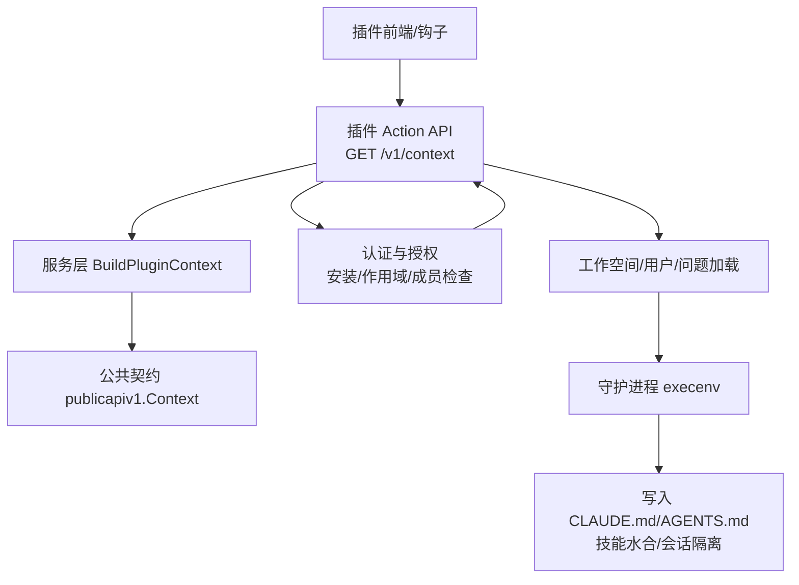
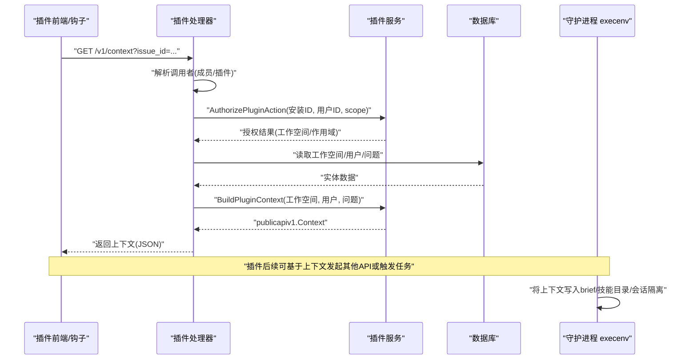
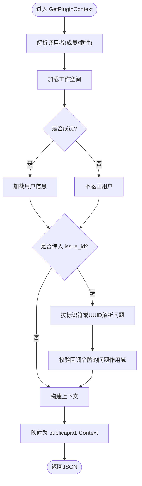
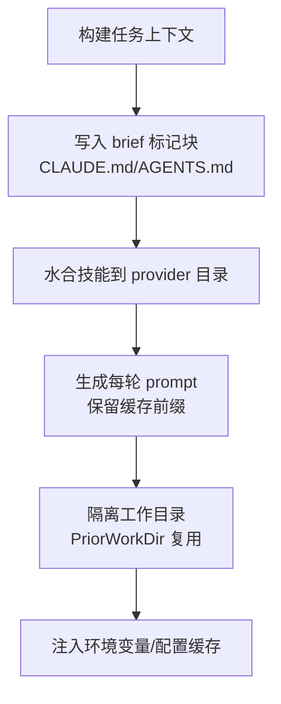
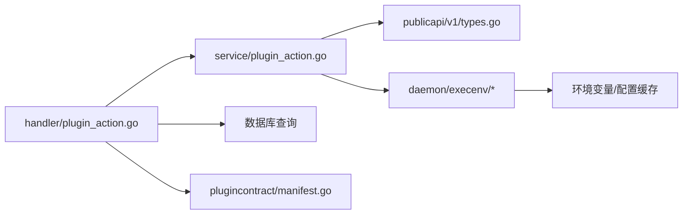

# 上下文 API

<cite>
**本文引用的文件**
- [server/internal/handler/plugin_action.go](file://server/internal/handler/plugin_action.go)
- [server/internal/service/plugin_action.go](file://server/internal/service/plugin_action.go)
- [server/pkg/publicapi/v1/types.go](file://server/pkg/publicapi/v1/types.go)
- [server/pkg/plugincontract/manifest.go](file://server/pkg/plugincontract/manifest.go)
- [server/pkg/remotemcp/devorigin.go](file://server/pkg/remotemcp/devorigin.go)
- [server/internal/daemon/execenv/execenv.go](file://server/internal/daemon/execenv/execenv.go)
- [server/internal/daemon/execenv/context_marker_test.go](file://server/internal/daemon/execenv/context_marker_test.go)
- [server/internal/daemon/execenv/codex_shell_env.go](file://server/internal/daemon/execenv/codex_shell_env.go)
- [server/internal/daemon/execenv/openclaw_config_cache.go](file://server/internal/daemon/execenv/openclaw_config_cache.go)
- [server/internal/daemon/execenv/isolation.go](file://server/internal/daemon/execenv/isolation.go)
- [server/internal/daemon/prompt.go](file://server/internal/daemon/prompt.go)
- [server/internal/daemon/claude_plugins.go](file://server/internal/daemon/claude_plugins.go)
</cite>

## 目录
1. [简介](#简介)
2. [项目结构](#项目结构)
3. [核心组件](#核心组件)
4. [架构总览](#架构总览)
5. [详细组件分析](#详细组件分析)
6. [依赖关系分析](#依赖关系分析)
7. [性能与缓存策略](#性能与缓存策略)
8. [故障排查指南](#故障排查指南)
9. [结论](#结论)
10. [附录：使用示例与最佳实践](#附录使用示例与最佳实践)

## 简介
本文件面向插件开发者，系统性说明插件运行时的“上下文”如何获取、校验与安全控制，覆盖工作空间信息、用户身份与权限范围、网络访问授权、上下文数据的缓存与更新机制、数据脱敏与安全检查，以及在不同执行环境（UI 面板、事件钩子、MCP 钩子、智能体任务）中的使用模式与最佳实践。

## 项目结构
围绕上下文 API 的关键代码分布在以下层次：
- 公共契约层：定义对外暴露的 Context 数据结构，确保版本化稳定。
- 服务层：组装上下文、解析安装与权限、构建最小必要字段。
- 处理层：实现 GET /v1/context 等接口，完成认证、鉴权与响应映射。
- 运行时层：在守护进程中将上下文注入到各智能体/CLI 的执行环境中（环境变量、标记文件、配置缓存）。
- 安全与网络约束：通过清单作用域与开发环境白名单限制外部网络访问。

图表来源
- [server/internal/handler/plugin_action.go:268-326](file://server/internal/handler/plugin_action.go#L268-L326)
- [server/internal/service/plugin_action.go:100-171](file://server/internal/service/plugin_action.go#L100-L171)
- [server/pkg/publicapi/v1/types.go:3-29](file://server/pkg/publicapi/v1/types.go#L3-L29)
- [server/internal/daemon/execenv/execenv.go](file://server/internal/daemon/execenv/execenv.go)

章节来源
- [server/internal/handler/plugin_action.go:268-326](file://server/internal/handler/plugin_action.go#L268-L326)
- [server/internal/service/plugin_action.go:100-171](file://server/internal/service/plugin_action.go#L100-L171)
- [server/pkg/publicapi/v1/types.go:3-29](file://server/pkg/publicapi/v1/types.go#L3-L29)

## 核心组件
- 公共上下文契约：定义 workspace、user、issue、config、granted_net_domains、actor 等字段，作为稳定的 wire 格式。
- 服务上下文装配：从安装、工作空间、用户、问题与授予的网络域名中构建最小可用上下文。
- 处理器路由：实现 GET /v1/context，按调用者类型（成员或插件自身）返回不同 actor，并可选携带 issue_id。
- 运行时注入：守护进程将上下文以标记块写入 brief 文件，并将技能水合到 provider 原生目录，每轮 prompt 由 daemon.BuildPrompt 生成。
- 安全与网络：通过清单 net: 作用域精确匹配主机名；开发环境可通过环境变量放宽 CA 信任但不跳过 HTTPS。

章节来源
- [server/pkg/publicapi/v1/types.go:3-29](file://server/pkg/publicapi/v1/types.go#L3-L29)
- [server/internal/service/plugin_action.go:100-171](file://server/internal/service/plugin_action.go#L100-L171)
- [server/internal/handler/plugin_action.go:268-326](file://server/internal/handler/plugin_action.go#L268-L326)
- [server/pkg/plugincontract/manifest.go:753-781](file://server/pkg/plugincontract/manifest.go#L753-L781)
- [server/pkg/remotemcp/devorigin.go:11-34](file://server/pkg/remotemcp/devorigin.go#L11-L34)

## 架构总览
上下文获取与使用的端到端流程如下：

图表来源
- [server/internal/handler/plugin_action.go:268-326](file://server/internal/handler/plugin_action.go#L268-L326)
- [server/internal/service/plugin_action.go:100-171](file://server/internal/service/plugin_action.go#L100-L171)
- [server/internal/daemon/execenv/execenv.go](file://server/internal/daemon/execenv/execenv.go)

## 详细组件分析

### 上下文数据结构与字段语义
- workspace：仅包含 id、name、slug，避免泄露敏感设置。
- user：仅在调用者为成员时存在；不包含邮箱等敏感字段，遵循最小披露原则。
- issue：可选，用于面板挂载在某个问题上的场景；包含 id、identifier、title。
- config：仅包含非机密的安装配置；机密值不在此路径暴露。
- granted_net_domains：由安装授予的 net: 作用域转换而来，限定插件可访问的外部主机。
- actor：区分“member”与“plugin”，便于下游逻辑分支。

章节来源
- [server/pkg/publicapi/v1/types.go:3-29](file://server/pkg/publicapi/v1/types.go#L3-L29)
- [server/internal/service/plugin_action.go:100-171](file://server/internal/service/plugin_action.go#L100-L171)

### 上下文获取接口 GET /v1/context
- 无需作用域：因为该接口只返回用户在当前页面已可见的信息。
- 支持可选 issue_id：若提供，则需通过插件作用域与成员权限双重校验。
- 返回映射：服务层构建的上下文被映射为公共契约类型，保证向后兼容。

图表来源
- [server/internal/handler/plugin_action.go:268-326](file://server/internal/handler/plugin_action.go#L268-L326)
- [server/internal/handler/plugin_action.go:214-244](file://server/internal/handler/plugin_action.go#L214-L244)

章节来源
- [server/internal/handler/plugin_action.go:268-326](file://server/internal/handler/plugin_action.go#L268-L326)
- [server/internal/handler/plugin_action.go:214-244](file://server/internal/handler/plugin_action.go#L214-L244)

### 认证与授权模型
- 三阶段检查：
  1) 安装存在且启用；
  2) 安装被授予所需作用域；
  3) 登录用户对目标资源具备普通权限（复用通用加载器），插件不能超越用户权限。
- 两种调用者：
  - 成员：来自浏览器会话，写操作归属成员，记录 via_plugin_id。
  - 插件自身：来自安装令牌或事件回调令牌，写操作归属插件。
- 回调令牌的作用域：针对单个问题的回调令牌只能访问该问题，防止跨问题越权。

章节来源
- [server/internal/handler/plugin_action.go:23-44](file://server/internal/handler/plugin_action.go#L23-L44)
- [server/internal/handler/plugin_action.go:111-212](file://server/internal/handler/plugin_action.go#L111-L212)
- [server/internal/service/plugin_action.go:14-81](file://server/internal/service/plugin_action.go#L14-L81)

### 网络访问授权与安全检查
- 清单作用域验证：hook 的传输 URL 主机必须被 net: 作用域精确覆盖，避免后缀匹配导致的安全歧义。
- 开发环境白名单：允许通过环境变量指定可信来源与额外 CA，但不会跳过 HTTPS 校验。
- 上下文中的 granted_net_domains：向插件明确展示其被允许访问的主机列表。

章节来源
- [server/pkg/plugincontract/manifest.go:753-781](file://server/pkg/plugincontract/manifest.go#L753-L781)
- [server/pkg/remotemcp/devorigin.go:11-34](file://server/pkg/remotemcp/devorigin.go#L11-L34)
- [server/internal/service/plugin_action.go:137-171](file://server/internal/service/plugin_action.go#L137-L171)

### 上下文在守护进程中的注入与缓存
- Brief 写入：上下文以标记块形式写入 CLAUDE.md/AGENTS.md，技能水合到各 provider 的 skills 目录。
- Prompt 缓存前缀：易变字段（如发起人、连接应用、续接提示）放在每轮消息而非 brief，以保护 prompt 缓存前缀。
- 会话隔离与工作目录：每个任务拥有独立 env root，git worktree 复用 PriorWorkDir 提升效率。
- 环境变量与配置缓存：shell 环境变量注入、OpenClaw 配置缓存等机制保障运行时一致性。

图表来源
- [server/internal/daemon/execenv/execenv.go](file://server/internal/daemon/execenv/execenv.go)
- [server/internal/daemon/execenv/context_marker_test.go](file://server/internal/daemon/execenv/context_marker_test.go)
- [server/internal/daemon/execenv/codex_shell_env.go](file://server/internal/daemon/execenv/codex_shell_env.go)
- [server/internal/daemon/execenv/openclaw_config_cache.go](file://server/internal/daemon/execenv/openclaw_config_cache.go)
- [server/internal/daemon/execenv/isolation.go](file://server/internal/daemon/execenv/isolation.go)
- [server/internal/daemon/prompt.go](file://server/internal/daemon/prompt.go)
- [server/internal/daemon/claude_plugins.go](file://server/internal/daemon/claude_plugins.go)

章节来源
- [server/internal/daemon/execenv/execenv.go](file://server/internal/daemon/execenv/execenv.go)
- [server/internal/daemon/execenv/context_marker_test.go](file://server/internal/daemon/execenv/context_marker_test.go)
- [server/internal/daemon/execenv/codex_shell_env.go](file://server/internal/daemon/execenv/codex_shell_env.go)
- [server/internal/daemon/execenv/openclaw_config_cache.go](file://server/internal/daemon/execenv/openclaw_config_cache.go)
- [server/internal/daemon/execenv/isolation.go](file://server/internal/daemon/execenv/isolation.go)
- [server/internal/daemon/prompt.go](file://server/internal/daemon/prompt.go)
- [server/internal/daemon/claude_plugins.go](file://server/internal/daemon/claude_plugins.go)

## 依赖关系分析
- 处理器依赖服务层进行安装与权限校验，再依赖数据库查询工作空间、用户与问题。
- 服务层依赖公共契约类型，确保对外 JSON 结构稳定。
- 守护进程依赖 execenv 模块将上下文注入到具体智能体/CLI 的运行环境。
- 安全约束依赖清单与作用域解析，确保网络访问受控。

图表来源
- [server/internal/handler/plugin_action.go:268-326](file://server/internal/handler/plugin_action.go#L268-L326)
- [server/internal/service/plugin_action.go:100-171](file://server/internal/service/plugin_action.go#L100-L171)
- [server/pkg/publicapi/v1/types.go:3-29](file://server/pkg/publicapi/v1/types.go#L3-L29)
- [server/pkg/plugincontract/manifest.go:753-781](file://server/pkg/plugincontract/manifest.go#L753-L781)
- [server/internal/daemon/execenv/execenv.go](file://server/internal/daemon/execenv/execenv.go)

章节来源
- [server/internal/handler/plugin_action.go:268-326](file://server/internal/handler/plugin_action.go#L268-L326)
- [server/internal/service/plugin_action.go:100-171](file://server/internal/service/plugin_action.go#L100-L171)
- [server/pkg/publicapi/v1/types.go:3-29](file://server/pkg/publicapi/v1/types.go#L3-L29)
- [server/pkg/plugincontract/manifest.go:753-781](file://server/pkg/plugincontract/manifest.go#L753-L781)

## 性能与缓存策略
- 上下文读取：GET /v1/context 无作用域要求，适合高频初始化；建议前端按需缓存并在会话内复用。
- 问题数据：通过 ETag/Revision 机制减少重复更新；插件应利用 If-Match 与 revision 冲突处理。
- 守护进程缓存：prompt 缓存前缀保持稳定，易变字段放入每轮消息；技能与配置缓存降低启动开销。
- 存储读写：插件存储按作用域隔离，键索引唯一，读多写少场景下注意批量与分页。

章节来源
- [server/internal/handler/plugin_action.go:328-443](file://server/internal/handler/plugin_action.go#L328-L443)
- [server/internal/daemon/execenv/openclaw_config_cache.go](file://server/internal/daemon/execenv/openclaw_config_cache.go)
- [server/internal/daemon/prompt.go](file://server/internal/daemon/prompt.go)

## 故障排查指南
- 未授权/未找到：检查安装是否存在、是否启用、是否授予所需作用域；确认 X-User-ID 与安装头正确传递。
- 回调令牌越权：确认回调令牌是否仅针对单一问题；访问其他问题会返回未找到。
- 网络访问失败：核对 granted_net_domains 与清单 net: 作用域；开发环境需设置正确的 DevOrigins 与 DevCA。
- 上下文缺失用户：当调用者为插件自身时，user 字段为空属正常；如需用户身份请使用 member 路径。
- 缓存不一致：更新问题内容后关注 ETag/Revision；客户端需处理冲突并重试。

章节来源
- [server/internal/handler/plugin_action.go:111-212](file://server/internal/handler/plugin_action.go#L111-L212)
- [server/internal/handler/plugin_action.go:214-244](file://server/internal/handler/plugin_action.go#L214-L244)
- [server/pkg/plugincontract/manifest.go:753-781](file://server/pkg/plugincontract/manifest.go#L753-L781)
- [server/pkg/remotemcp/devorigin.go:11-34](file://server/pkg/remotemcp/devorigin.go#L11-L34)

## 结论
上下文 API 提供了最小、稳定且安全的插件运行期信息入口。通过严格的安装与权限校验、细粒度的网络授权、以及守护进程中的上下文注入与缓存策略，插件可以在 UI 面板、事件钩子、MCP 钩子与智能体任务中一致地获取工作空间、用户与问题信息，并以安全可控的方式扩展平台能力。

## 附录：使用示例与最佳实践
- 初始化流程
  - 调用 GET /v1/context 获取 workspace、user（可选）、issue（可选）、config、granted_net_domains、actor。
  - 根据 actor 决定后续行为：member 路径可代表用户写操作；plugin 路径代表插件自身。
- 安全与隐私
  - 不要假设 user 一定存在；当 actor 为 plugin 时，user 为空。
  - 不要将敏感信息（如邮箱）放入自定义 config；仅使用非机密配置。
  - 仅访问 granted_net_domains 列出的主机；超出范围将被拒绝。
- 缓存与更新
  - 对问题数据使用 ETag/Revision；遇到冲突时重新拉取并合并。
  - 在守护进程中，保持 brief 稳定，易变字段放入每轮消息以保护缓存前缀。
- 典型模式
  - UI 面板：频繁读取上下文，缓存于本地状态；必要时带 issue_id 获取上下文问题。
  - 事件钩子：使用回调令牌，严格限制在单问题范围内；写操作归属插件。
  - MCP 钩子：遵守 net: 作用域与 HTTPS 要求；开发环境通过环境变量放宽 CA 信任。
- 错误处理
  - 统一处理未授权、未找到、冲突与上游不可用等错误码；对用户友好提示。
  - 对于网络访问失败，优先检查 granted_net_domains 与清单作用域。

章节来源
- [server/internal/handler/plugin_action.go:268-326](file://server/internal/handler/plugin_action.go#L268-L326)
- [server/internal/service/plugin_action.go:100-171](file://server/internal/service/plugin_action.go#L100-L171)
- [server/pkg/publicapi/v1/types.go:3-29](file://server/pkg/publicapi/v1/types.go#L3-L29)
- [server/pkg/plugincontract/manifest.go:753-781](file://server/pkg/plugincontract/manifest.go#L753-L781)
- [server/pkg/remotemcp/devorigin.go:11-34](file://server/pkg/remotemcp/devorigin.go#L11-L34)
- [server/internal/daemon/execenv/execenv.go](file://server/internal/daemon/execenv/execenv.go)
- [server/internal/daemon/prompt.go](file://server/internal/daemon/prompt.go)