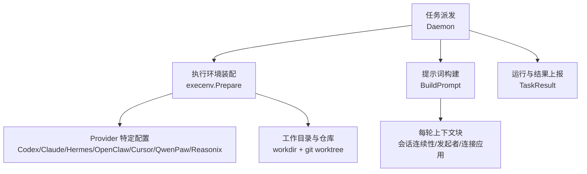
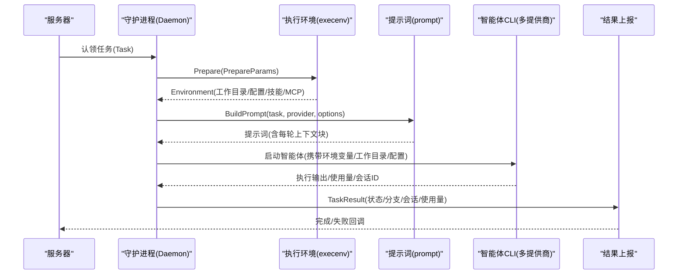
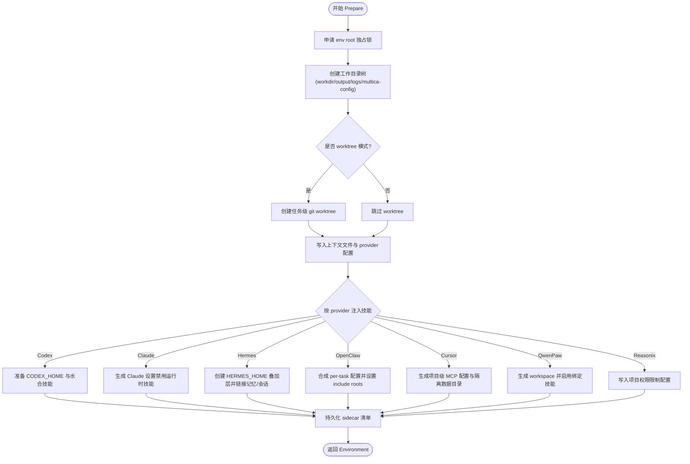
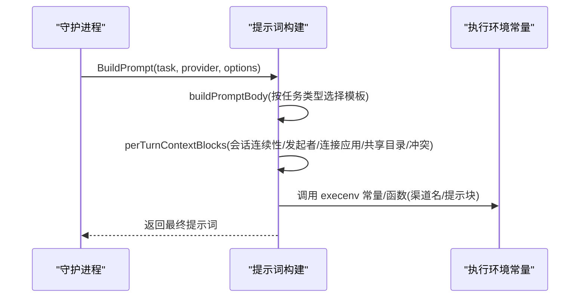
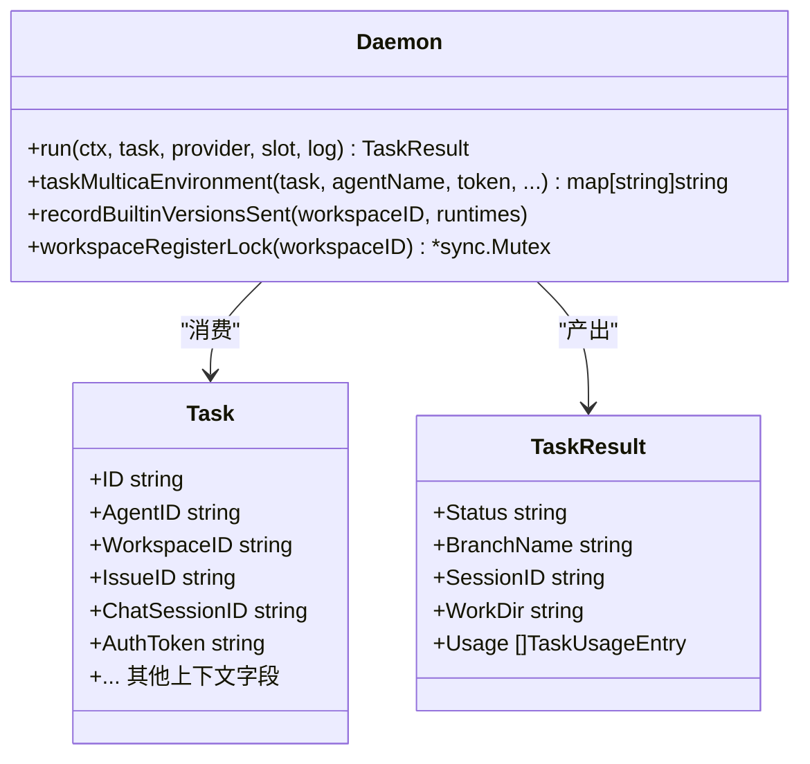
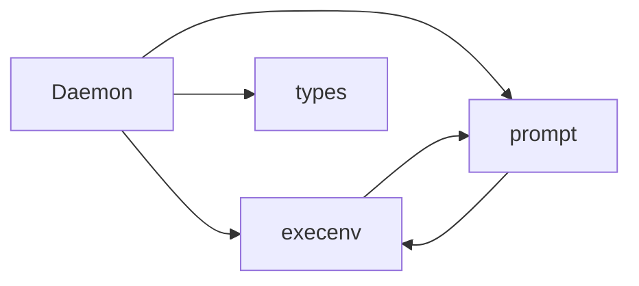

# AI 智能体集成

<cite>
**本文引用的文件**
- [execenv.go](file://server/internal/daemon/execenv/execenv.go)
- [prompt.go](file://server/internal/daemon/prompt.go)
- [types.go](file://server/internal/daemon/types.go)
- [daemon.go](file://server/internal/daemon/daemon.go)
- [binary.go](file://server/internal/skill/binary.go)
</cite>

## 目录
1. [简介](#简介)
2. [项目结构](#项目结构)
3. [核心组件](#核心组件)
4. [架构总览](#架构总览)
5. [详细组件分析](#详细组件分析)
6. [依赖关系分析](#依赖关系分析)
7. [性能与并发](#性能与并发)
8. [故障排查指南](#故障排查指南)
9. [结论](#结论)
10. [附录：配置与环境清单](#附录：配置与环境清单)

## 简介
本文件系统性说明 Multica 中“任务与 AI 智能体的集成机制”，覆盖以下方面：
- 任务如何分配给智能体，以及支持的多种智能体类型与提供商（provider）
- 智能体执行环境装配：环境变量、技能包注入、工具集（MCP）
- 任务参数传递、上下文注入与结果处理
- 状态监控、日志收集与错误处理
- 最佳实践与性能优化建议（并发控制、资源管理）

## 项目结构
围绕智能体执行的核心位于后端守护进程（daemon），关键路径如下：
- server/internal/daemon：守护进程主逻辑、任务调度、提示词构建、类型定义
- server/internal/daemon/execenv：每任务隔离的执行环境装配（工作目录、仓库 checkout、技能水合、provider 特定配置）
- server/internal/skill：技能包二进制文件识别等通用能力
- apps/web、apps/desktop、apps/mobile：前端与桌面端通过 API 与 daemon/server 交互（不在本文展开）

**图表来源**
- [daemon.go:635-686](file://server/internal/daemon/daemon.go#L635-L686)
- [execenv.go:409-744](file://server/internal/daemon/execenv/execenv.go#L409-L744)
- [prompt.go:176-199](file://server/internal/daemon/prompt.go#L176-L199)

**章节来源**
- [daemon.go:635-686](file://server/internal/daemon/daemon.go#L635-L686)
- [execenv.go:409-744](file://server/internal/daemon/execenv/execenv.go#L409-L744)
- [prompt.go:176-199](file://server/internal/daemon/prompt.go#L176-L199)

## 核心组件
- Daemon：本地守护进程，负责拉取任务、准备执行环境、启动智能体 CLI、收集结果并上报。
- execenv：为每个任务创建隔离的执行环境，写入 brief 与 provider 专属配置，挂载技能包与 MCP 配置。
- prompt：按任务类型（评论触发、聊天、自动计划、快速创建）生成提示词，并在每轮追加易变上下文以保持缓存命中。
- types：任务、智能体、技能、使用量等数据结构定义，贯穿服务端与守护进程的契约。

**章节来源**
- [daemon.go:373-626](file://server/internal/daemon/daemon.go#L373-L626)
- [execenv.go:19-127](file://server/internal/daemon/execenv/execenv.go#L19-L127)
- [prompt.go:176-199](file://server/internal/daemon/prompt.go#L176-L199)
- [types.go:68-176](file://server/internal/daemon/types.go#L68-L176)

## 架构总览
下图展示从任务认领到执行、结果回传的完整流程，以及执行环境与提示词的协作关系。

**图表来源**
- [daemon.go:163-179](file://server/internal/daemon/daemon.go#L163-L179)
- [execenv.go:409-744](file://server/internal/daemon/execenv/execenv.go#L409-L744)
- [prompt.go:176-199](file://server/internal/daemon/prompt.go#L176-L199)
- [types.go:286-310](file://server/internal/daemon/types.go#L286-L310)

## 详细组件分析

### 执行环境装配（execenv）
- 职责：为每个任务创建隔离的 env root，准备 workdir、输出与日志目录；按需创建 git worktree；将技能包水合到 provider 原生目录；生成 provider 专属配置文件（如 Codex HOME、OpenClaw 配置、Hermes overlay、Cursor MCP 数据目录、QwenPaw workspace、Reasonix 项目配置）。
- 关键输入：PrepareParams 包含工作区/任务标识、provider、MCP 配置、各 provider 专用参数（版本、自定义参数、网关地址等）、任务上下文（仓库、项目资源、聊天通道、工作区上下文、状态目录等）。
- 关键输出：Environment 提供 RootDir、WorkDir、各 provider 专属路径（如 CodexHome、OpenclawConfigPath、HermesHome、QwenpawWorkspace、CursorDataDir），以及是否复用 prior session 的标记。
- 安全与隔离：对 env root 加锁独占；在本地目录模式下记录 sidecar 变更以便回滚；为 managed env 写入可证明复用性的元信息。

**图表来源**
- [execenv.go:409-744](file://server/internal/daemon/execenv/execenv.go#L409-L744)

**章节来源**
- [execenv.go:19-127](file://server/internal/daemon/execenv/execenv.go#L19-L127)
- [execenv.go:409-744](file://server/internal/daemon/execenv/execenv.go#L409-L744)

### 提示词构建与上下文注入（prompt）
- 职责：根据任务类型（评论触发、聊天、自动计划、快速创建）组装提示词主体，并在每轮末尾追加“每轮上下文块”（会话连续性提示、任务发起者、连接应用、共享目录警告、未决合并冲突列表等），以尽量保持 prompt 缓存前缀稳定。
- 关键点：
  - 会话连续性：当无法恢复上一轮会话时，注入不可恢复/可恢复差异提示，避免误导。
  - 评论触发：嵌入触发评论与折叠评论详情，并提供精确的增量读取指令。
  - 聊天任务：区分 IM 渠道（Slack/飞书/企微/钉钉）与网页聊天，给出历史读取命令与附件上传策略。
  - 自动计划/快速创建：注入触发载荷、字段规则与默认指派策略。

**图表来源**
- [prompt.go:176-199](file://server/internal/daemon/prompt.go#L176-L199)
- [prompt.go:50-73](file://server/internal/daemon/prompt.go#L50-L73)
- [prompt.go:343-503](file://server/internal/daemon/prompt.go#L343-L503)
- [prompt.go:566-719](file://server/internal/daemon/prompt.go#L566-L719)

**章节来源**
- [prompt.go:176-199](file://server/internal/daemon/prompt.go#L176-L199)
- [prompt.go:50-73](file://server/internal/daemon/prompt.go#L50-L73)
- [prompt.go:343-503](file://server/internal/daemon/prompt.go#L343-L503)
- [prompt.go:566-719](file://server/internal/daemon/prompt.go#L566-L719)

### 任务类型与参数传递（types）
- Task：承载一次被认领的任务的全部上下文，包括：
  - 身份与工作区：AgentID、RuntimeID、WorkspaceID、IssueID、IssueIdentifier
  - 仓库与项目：Repos、ProjectID/Title/Description/Resources
  - 会话与渠道：ChatSessionID、ChatChannelType、ChatType、ChatInThread、ChatMessage、Attachments
  - 评论触发：TriggerCommentID、CoalescedComments、NewCommentCount/Since/DeltaKnown
  - 自动计划/快速创建：Autopilot*、QuickCreate*
  - 权限与会话复用：PriorSessionID、PriorWorkDir、PriorSessionResumeUnavailable
  - 认证：AuthToken（任务级令牌，注入子进程）
- AgentData：智能体名称、指令、技能、自定义环境变量/参数、MCP 配置、模型与服务等级等。
- SkillData/SkillFileData：结构化技能内容与附属文件。
- TaskUsageEntry/TaskResult：模型用量与任务结果（状态、评论、分支、会话 ID、工作目录、使用量等）。

**章节来源**
- [types.go:68-176](file://server/internal/daemon/types.go#L68-L176)
- [types.go:202-269](file://server/internal/daemon/types.go#L202-L269)
- [types.go:271-310](file://server/internal/daemon/types.go#L271-L310)

### 守护进程执行与结果上报（daemon）
- 环境变量注入：为智能体子进程注入任务级令牌、工作区/任务标识、临时目录、健康端口等。
- 任务准备超时：统一的 dispatched→running 硬时限，用于区分准备阶段与 provider 执行超时。
- 结果上报：统一封装 terminalTaskReport，支持完成/失败两类终态，携带会话 ID、工作目录、分支名、失败原因、使用量等。
- 资源与并发：维护活跃任务计数、工作区注册串行化、本地目录互斥锁、仓库 checkout 任务注册等。

**图表来源**
- [daemon.go:163-179](file://server/internal/daemon/daemon.go#L163-L179)
- [daemon.go:195-233](file://server/internal/daemon/daemon.go#L195-L233)
- [types.go:68-176](file://server/internal/daemon/types.go#L68-L176)
- [types.go:286-310](file://server/internal/daemon/types.go#L286-L310)

**章节来源**
- [daemon.go:163-179](file://server/internal/daemon/daemon.go#L163-L179)
- [daemon.go:195-233](file://server/internal/daemon/daemon.go#L195-L233)
- [daemon.go:373-626](file://server/internal/daemon/daemon.go#L373-L626)

### 技能包与二进制处理（skill）
- 二进制识别：对技能包中的二进制文件进行保守黑名单判断，避免将其作为文本传输导致损坏或入库失败。
- 作用：确保技能同步与运行时注入路径对二进制内容采取安全策略（跳过或特殊处理）。

**章节来源**
- [binary.go:8-41](file://server/internal/skill/binary.go#L8-L41)

## 依赖关系分析
- 守护进程依赖 execenv 完成环境装配，依赖 prompt 生成提示词，依赖 types 定义的数据结构进行序列化/反序列化。
- execenv 内部按 provider 分支注入不同配置（Codex/Claude/Hermes/OpenClaw/Cursor/QwenPaw/Reasonix），并通过 MCP 配置实现外部工具桥接。
- prompt 依赖 execenv 提供的渠道名称、会话连续性提示等常量/函数，保证前后端一致。

**图表来源**
- [daemon.go:373-626](file://server/internal/daemon/daemon.go#L373-L626)
- [execenv.go:409-744](file://server/internal/daemon/execenv/execenv.go#L409-L744)
- [prompt.go:176-199](file://server/internal/daemon/prompt.go#L176-L199)

**章节来源**
- [daemon.go:373-626](file://server/internal/daemon/daemon.go#L373-L626)
- [execenv.go:409-744](file://server/internal/daemon/execenv/execenv.go#L409-L744)
- [prompt.go:176-199](file://server/internal/daemon/prompt.go#L176-L199)

## 性能与并发
- 并发控制
  - 任务准备超时：统一限制从认领到 running 的准备时间，避免长时间阻塞。
  - 本地目录互斥：同一 on-disk 目录的多任务串行执行，避免写冲突。
  - 工作区注册串行：按 workspace 维度串行 Register，防止并发竞争导致状态不一致。
  - 活跃任务计数：守护进程维护 activeTasks/runningTasks/resourceWaitTasks，便于健康检查与限流。
- 资源管理
  - env root 独占锁：防止并发清理或误删。
  - 仓库 checkout 模式：针对 Codex 沙箱调整 git 元数据布局，避免只读导致的提交失败。
  - 会话/记忆存储保护：GC 期间对活动会话/记忆目录加引用计数，避免中途删除。
- 提示词缓存友好
  - 每轮上下文块追加在提示词尾部，保持缓存前缀稳定，减少因易变字段导致的缓存失效。
- 建议
  - 合理设置任务准备超时与心跳间隔，平衡响应性与鲁棒性。
  - 对大仓库优先使用 worktree 模式，提升并发与隔离性。
  - 谨慎开启本地目录共享模式，必要时配合提示词中的共享目录警告。

[本节为通用指导，不直接分析具体文件]

## 故障排查指南
- 常见错误分类
  - 任务准备超时：检查 skill bundle 下载、执行环境准备、StartTask 请求耗时。
  - 技能包不可用：当技能包下载失败时，使用专用错误标记以便平台侧重试策略生效。
  - 会话恢复不可用：当更高版本的 Codex 会话不可用时，会降级并注入连续性提示。
  - 本地目录冲突：等待互斥锁释放，或通过 UI 查看 waiting_local_directory 状态。
- 诊断要点
  - 查看 TaskResult 的状态、分支名、会话 ID、工作目录与使用量。
  - 检查 execenv 生成的 sidecar 清单与 provider 配置文件是否正确。
  - 核对提示词中的每轮上下文块是否包含必要的会话连续性提示与渠道信息。
- 定位步骤
  - 确认任务环境变量（MULTICA_TOKEN、工作区/任务标识、临时目录）已正确注入。
  - 验证 provider 专属配置（CODEX_HOME、OPENCLAW_CONFIG_PATH、HERMES_HOME、CURSOR_DATA_DIR 等）是否存在且有效。
  - 若涉及 MCP，检查 per-task 配置与授权源（如 Cursor mcp-auth.json）。

**章节来源**
- [daemon.go:55-67](file://server/internal/daemon/daemon.go#L55-L67)
- [daemon.go:195-233](file://server/internal/daemon/daemon.go#L195-L233)
- [execenv.go:409-744](file://server/internal/daemon/execenv/execenv.go#L409-L744)
- [prompt.go:10-48](file://server/internal/daemon/prompt.go#L10-L48)

## 结论
Multica 的智能体集成以守护进程为核心，通过 execenv 为每个任务构建隔离的执行环境，结合 prompt 的每轮上下文注入，实现对多种智能体提供商的统一编排。系统在保证安全与隔离的前提下，提供了灵活的配置项与丰富的上下文能力，并通过严格的并发控制与资源管理机制保障稳定性与可扩展性。

[本节为总结性内容，不直接分析具体文件]

## 附录：配置与环境清单
- 任务环境变量（注入智能体子进程）
  - MULTICA_TOKEN：任务级令牌
  - MULTICA_WORKSPACE_ID / MULTICA_AGENT_NAME / MULTICA_AGENT_ID / MULTICA_TASK_ID / MULTICA_TASK_SLOT
  - MULTICA_SERVER_URL / MULTICA_DAEMON_PORT
  - TMPDIR/TMP/TEMP：临时目录
- Provider 相关路径与环境
  - Codex：CODEX_HOME、可选自定义参数
  - OpenClaw：OPENCLAW_CONFIG_PATH、OPENCLAW_INCLUDE_ROOTS、Gateway 端点
  - Hermes：HERMES_HOME（overlay）、会话/记忆存储路径
  - Cursor：CURSOR_DATA_DIR、mcp-auth.json 来源
  - QwenPaw：workspace 目录
  - Reasonix：项目级权限配置
- 技能包与工具集
  - 技能包内容通过 execenv 水合至 provider 原生目录
  - MCP 配置通过 per-task 文件或环境变量注入，供外部工具发现与调用

**章节来源**
- [daemon.go:163-179](file://server/internal/daemon/daemon.go#L163-L179)
- [execenv.go:409-744](file://server/internal/daemon/execenv/execenv.go#L409-L744)
- [types.go:202-269](file://server/internal/daemon/types.go#L202-L269)