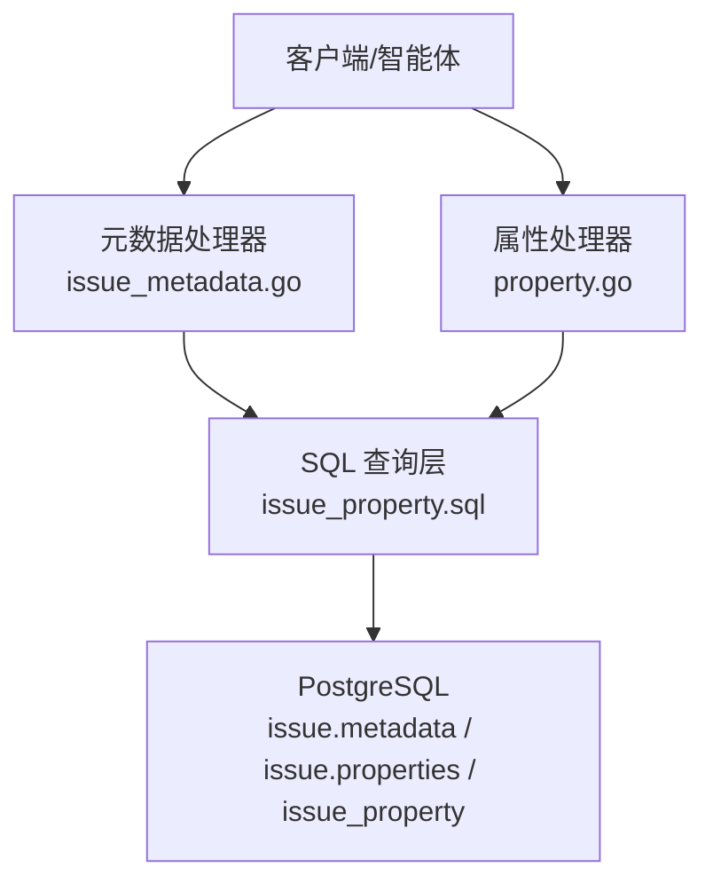
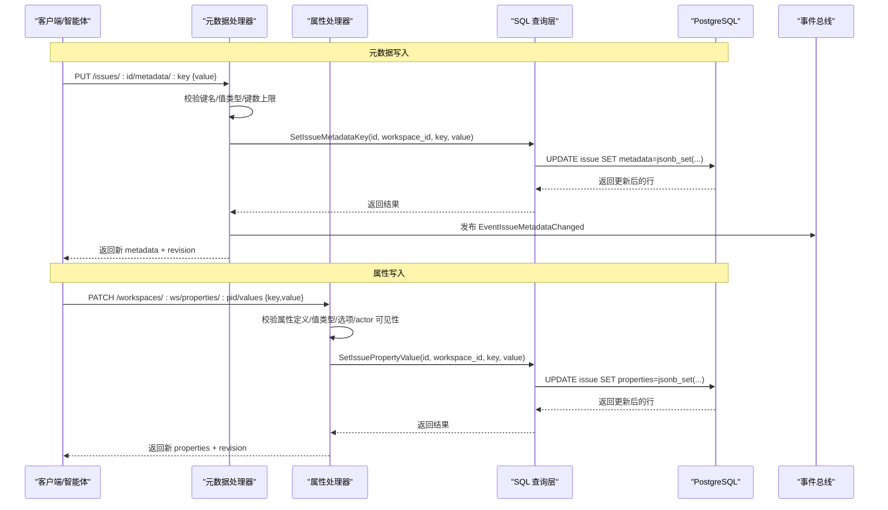
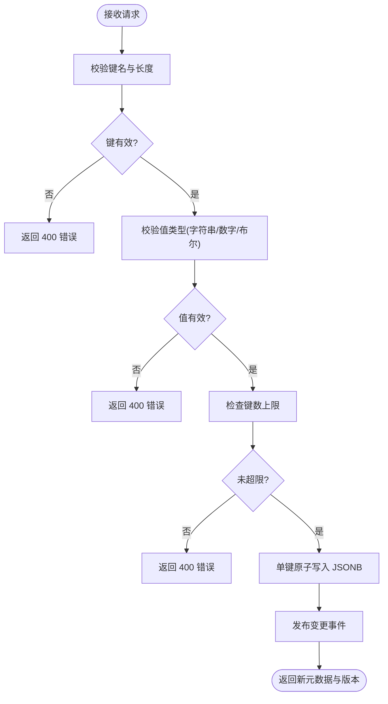
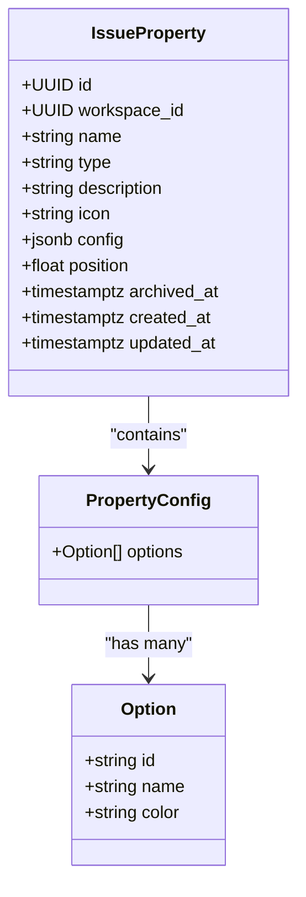
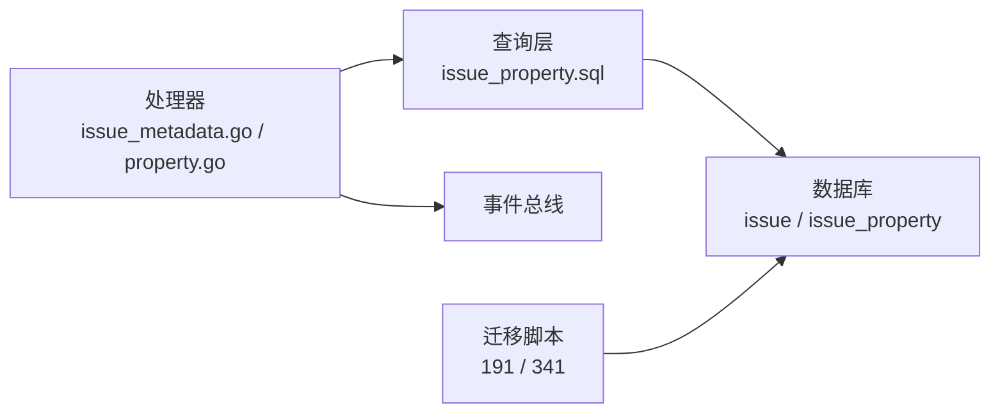

# 任务元数据和属性

<cite>
**本文引用的文件**
- [server/internal/handler/issue_metadata.go](file://server/internal/handler/issue_metadata.go)
- [server/internal/handler/property.go](file://server/internal/handler/property.go)
- [server/pkg/db/queries/issue_property.sql](file://server/pkg/db/queries/issue_property.sql)
- [server/migrations/191_issue_properties.up.sql](file://server/migrations/191_issue_properties.up.sql)
- [server/migrations/341_issue_property_actor_types.up.sql](file://server/migrations/341_issue_property_actor_types.up.sql)
- [server/cmd/migrate/main.go](file://server/cmd/migrate/main.go)
- [server/cmd/migrate/migrate_issue_properties_bigm_index_test.go](file://server/cmd/migrate/migrate_issue_properties_bigm_index_test.go)
</cite>

## 目录
1. [简介](#简介)
2. [项目结构](#项目结构)
3. [核心组件](#核心组件)
4. [架构总览](#架构总览)
5. [详细组件分析](#详细组件分析)
6. [依赖关系分析](#依赖关系分析)
7. [性能与索引优化](#性能与索引优化)
8. [故障排查指南](#故障排查指南)
9. [结论](#结论)
10. [附录：最佳实践与设计模式](#附录最佳实践与设计模式)

## 简介
本文件系统性说明任务（Issue）的元数据与自定义属性体系，覆盖键值对元数据的创建、更新、查询，以及自定义属性的定义、类型、验证规则与默认值；同时记录权限控制与安全考虑、索引优化与查询调优，并给出使用最佳实践与设计模式。该体系由两层组成：
- 任务元数据（metadata）：轻量级 JSONB 键值对，用于智能体流水线状态等场景，限制为基本类型（字符串、数字、布尔），单键原子写入，避免并发覆盖。
- 自定义属性（properties）：工作区级“属性目录”+ 每个任务的 JSONB 值袋，按属性定义进行强类型校验与约束，支持文本、数字、单选/多选、日期、复选框、URL、成员/多成员等类型，具备选项配置、图标、排序、归档等能力。

## 项目结构
围绕元数据与属性的后端实现主要位于以下位置：
- HTTP 处理器：负责请求解析、鉴权、参数校验、业务编排与事件广播
  - 元数据处理器：[server/internal/handler/issue_metadata.go](file://server/internal/handler/issue_metadata.go)
  - 属性处理器：[server/internal/handler/property.go](file://server/internal/handler/property.go)
- SQL 查询（sqlc 生成）：封装单键原子写入、删除、统计等
  - 属性相关查询：[server/pkg/db/queries/issue_property.sql](file://server/pkg/db/queries/issue_property.sql)
- 数据库迁移：定义表结构、约束、索引与扩展
  - 属性模型与列：[server/migrations/191_issue_properties.up.sql](file://server/migrations/191_issue_properties.up.sql)
  - actor 类型扩展：[server/migrations/341_issue_property_actor_types.up.sql](file://server/migrations/341_issue_property_actor_types.up.sql)
- 索引与迁移工具：GIN/表达式索引可用性检查、测试用例
  - 索引可用性判定：[server/cmd/migrate/main.go](file://server/cmd/migrate/main.go)
  - bigm 全文检索测试：[server/cmd/migrate/migrate_issue_properties_bigm_index_test.go](file://server/cmd/migrate/migrate_issue_properties_bigm_index_test.go)

**图表来源**
- [server/internal/handler/issue_metadata.go:126-239](file://server/internal/handler/issue_metadata.go#L126-L239)
- [server/internal/handler/property.go:646-800](file://server/internal/handler/property.go#L646-L800)
- [server/pkg/db/queries/issue_property.sql:1-89](file://server/pkg/db/queries/issue_property.sql#L1-L89)

**章节来源**
- [server/internal/handler/issue_metadata.go:19-35](file://server/internal/handler/issue_metadata.go#L19-L35)
- [server/internal/handler/property.go:28-55](file://server/internal/handler/property.go#L28-L55)
- [server/pkg/db/queries/issue_property.sql:1-89](file://server/pkg/db/queries/issue_property.sql#L1-L89)
- [server/migrations/191_issue_properties.up.sql:1-44](file://server/migrations/191_issue_properties.up.sql#L1-L44)
- [server/migrations/341_issue_property_actor_types.up.sql:1-21](file://server/migrations/341_issue_property_actor_types.up.sql#L1-L21)

## 核心组件
- 任务元数据（JSONB KV）
  - 键命名规范与长度限制，最多键数限制
  - 值类型限制为字符串、数字、布尔；禁止 null、数组、对象
  - 单键原子写入，避免并发覆盖；删除通过 DELETE 语义
  - 查询时支持以 JSONB 过滤条件匹配
- 自定义属性（Typed Properties）
  - 工作区级属性目录（issue_property），包含名称、类型、描述、图标、配置（如选项）、排序、归档时间
  - 每个任务在 properties 中以属性定义 UUID 为键存储值，值按定义严格校验
  - 支持类型：text、number、select、multi_select、date、checkbox、url、actor、multi_actor
  - 选项配置：唯一 ID、名称、颜色；去重与顺序规范化
  - actor 类型：以“kind:id”形式存储，当前仅 member，可扩展
  - 容量与大小限制：工作区活跃属性上限、值大小上限、选项数量上限等

**章节来源**
- [server/internal/handler/issue_metadata.go:19-35](file://server/internal/handler/issue_metadata.go#L19-L35)
- [server/internal/handler/issue_metadata.go:45-74](file://server/internal/handler/issue_metadata.go#L45-L74)
- [server/internal/handler/property.go:28-55](file://server/internal/handler/property.go#L28-L55)
- [server/internal/handler/property.go:90-114](file://server/internal/handler/property.go#L90-L114)
- [server/internal/handler/property.go:227-288](file://server/internal/handler/property.go#L227-L288)
- [server/internal/handler/property.go:310-430](file://server/internal/handler/property.go#L310-L430)
- [server/internal/handler/property.go:457-581](file://server/internal/handler/property.go#L457-L581)
- [server/migrations/191_issue_properties.up.sql:15-40](file://server/migrations/191_issue_properties.up.sql#L15-L40)
- [server/migrations/341_issue_property_actor_types.up.sql:1-21](file://server/migrations/341_issue_property_actor_types.up.sql#L1-L21)

## 架构总览
下图展示从客户端到数据库的端到端流程，涵盖元数据与属性的读写路径、并发安全与事件广播。

**图表来源**
- [server/internal/handler/issue_metadata.go:135-196](file://server/internal/handler/issue_metadata.go#L135-L196)
- [server/internal/handler/property.go:646-800](file://server/internal/handler/property.go#L646-L800)
- [server/pkg/db/queries/issue_property.sql:50-76](file://server/pkg/db/queries/issue_property.sql#L50-L76)

## 详细组件分析

### 任务元数据（JSONB KV）
- 键命名与长度：符合正则规则，最大键数限制，防止滥用
- 值类型：仅允许字符串、数字、布尔；null 不允许（删除用 DELETE）
- 并发安全：单键原子写入，避免并发覆盖；revision 递增用于乐观锁
- 查询过滤：支持以 JSONB 对象作为过滤条件，服务端校验键与值类型
- 事件广播：变更时广播事件，携带 issue_id、metadata、issue_revision

**图表来源**
- [server/internal/handler/issue_metadata.go:45-74](file://server/internal/handler/issue_metadata.go#L45-L74)
- [server/internal/handler/issue_metadata.go:135-196](file://server/internal/handler/issue_metadata.go#L135-L196)

**章节来源**
- [server/internal/handler/issue_metadata.go:19-35](file://server/internal/handler/issue_metadata.go#L19-L35)
- [server/internal/handler/issue_metadata.go:45-74](file://server/internal/handler/issue_metadata.go#L45-L74)
- [server/internal/handler/issue_metadata.go:126-239](file://server/internal/handler/issue_metadata.go#L126-L239)

### 自定义属性（Typed Properties）
- 属性目录（issue_property）
  - 字段：id、workspace_id、name、type、description、icon、config、position、archived_at、created_at、updated_at
  - 类型约束：text、number、select、multi_select、date、checkbox、url、actor、multi_actor
  - 配置：select/multi_select 需要 options（id、name、color），非 select 类型必须为空对象
  - 活动上限：工作区活跃属性数量上限，超出需归档旧属性
- 值写入与校验
  - 单键原子写入 properties，按定义类型校验
  - text/url/date/number/checkbox/select/multi_select/actor/multi_actor 分别有严格格式与范围校验
  - actor 类型值为“kind:id”，当前仅 member，可向后扩展
  - multi_select 与 multi_actor 会去重并按配置顺序规范化，保证稳定序列化与过滤
- 权限控制
  - 属性定义的管理（创建/更新/归档）仅限人类 owner/admin，拒绝 agent 直接管理
  - 值写入对所有成员与 agent 开放，但需通过类型与可见性校验
- 事件与一致性
  - 变更时广播事件，携带属性信息与版本号
  - 使用 advisory lock 保护定义与值的并发操作，避免 TOCTOU 问题

**图表来源**
- [server/migrations/191_issue_properties.up.sql:15-27](file://server/migrations/191_issue_properties.up.sql#L15-L27)
- [server/internal/handler/property.go:90-114](file://server/internal/handler/property.go#L90-L114)
- [server/internal/handler/property.go:227-288](file://server/internal/handler/property.go#L227-L288)

**章节来源**
- [server/internal/handler/property.go:28-55](file://server/internal/handler/property.go#L28-L55)
- [server/internal/handler/property.go:90-114](file://server/internal/handler/property.go#L90-L114)
- [server/internal/handler/property.go:185-288](file://server/internal/handler/property.go#L185-L288)
- [server/internal/handler/property.go:310-430](file://server/internal/handler/property.go#L310-L430)
- [server/internal/handler/property.go:457-581](file://server/internal/handler/property.go#L457-L581)
- [server/internal/handler/property.go:625-767](file://server/internal/handler/property.go#L625-L767)
- [server/pkg/db/queries/issue_property.sql:1-89](file://server/pkg/db/queries/issue_property.sql#L1-L89)
- [server/migrations/191_issue_properties.up.sql:15-40](file://server/migrations/191_issue_properties.up.sql#L15-L40)
- [server/migrations/341_issue_property_actor_types.up.sql:1-21](file://server/migrations/341_issue_property_actor_types.up.sql#L1-L21)

## 依赖关系分析
- 处理器依赖 sqlc 生成的查询函数，执行单键原子写入与删除
- 迁移脚本定义表结构与约束，确保数据完整性
- 索引与扩展（如 GIN、bigm）在独立迁移中创建，避免长事务阻塞
- 事件总线用于实时同步变更，提升前端响应性

**图表来源**
- [server/internal/handler/issue_metadata.go:126-239](file://server/internal/handler/issue_metadata.go#L126-L239)
- [server/internal/handler/property.go:646-800](file://server/internal/handler/property.go#L646-L800)
- [server/pkg/db/queries/issue_property.sql:1-89](file://server/pkg/db/queries/issue_property.sql#L1-L89)
- [server/migrations/191_issue_properties.up.sql:15-40](file://server/migrations/191_issue_properties.up.sql#L15-L40)
- [server/migrations/341_issue_property_actor_types.up.sql:1-21](file://server/migrations/341_issue_property_actor_types.up.sql#L1-L21)

**章节来源**
- [server/pkg/db/queries/issue_property.sql:1-89](file://server/pkg/db/queries/issue_property.sql#L1-L89)
- [server/migrations/191_issue_properties.up.sql:15-40](file://server/migrations/191_issue_properties.up.sql#L15-L40)
- [server/migrations/341_issue_property_actor_types.up.sql:1-21](file://server/migrations/341_issue_property_actor_types.up.sql#L1-L21)

## 性能与索引优化
- 单键原子写入
  - 使用 jsonb_set 进行单键更新，避免整行覆盖导致的并发冲突
  - 通过 revision 与 last_activity_at 增量更新，减少不必要的全量刷新
- 约束与大小限制
  - properties 列强制为 JSONB 对象，且限制列大小（例如 16KB），防止过大负载
  - metadata 列限制为 8KB，键数上限与值类型限制进一步降低风险
- 索引策略
  - 针对 properties 的 GIN 索引与表达式索引（如 jsonb_path_ops）加速 @> 包含查询
  - 对于全文检索场景（如 bigm），在独立迁移中创建索引，避免长事务阻塞
  - 索引可用性检查：迁移工具会校验索引是否满足查询需求，不满足则回退或告警
- 查询优化建议
  - 使用 JSONB 过滤条件时，尽量匹配已索引的键或表达式
  - 对高频过滤字段（如 workspace_id、type）建立合适索引
  - 避免在查询中对大对象进行全表扫描；必要时拆分查询或使用物化视图

**章节来源**
- [server/pkg/db/queries/issue_property.sql:50-76](file://server/pkg/db/queries/issue_property.sql#L50-L76)
- [server/migrations/191_issue_properties.up.sql:29-40](file://server/migrations/191_issue_properties.up.sql#L29-L40)
- [server/cmd/migrate/main.go:509-546](file://server/cmd/migrate/main.go#L509-L546)
- [server/cmd/migrate/migrate_issue_properties_bigm_index_test.go:132-160](file://server/cmd/migrate/migrate_issue_properties_bigm_index_test.go#L132-L160)

## 故障排查指南
- 常见错误与处理
  - 键名无效：检查是否符合命名规范与长度限制
  - 值类型不匹配：确认值类型与属性定义一致（如 text 必须为字符串）
  - 键数超限：清理无用键或调整业务逻辑以减少键数量
  - 大小限制：压缩值内容或拆分属性，避免超过列大小限制
  - 选项不存在：检查 select/multi_select 的选项配置是否正确
  - actor 引用无效：确认“kind:id”中的 kind 是否在允许列表，id 是否为有效 UUID
- 日志与调试
  - 处理器在失败时记录请求上下文与错误信息，便于定位问题
  - 事件广播失败不影响主流程，但应监控事件队列健康度
- 回滚与恢复
  - 属性定义采用归档而非删除，历史值仍可解析
  - 索引异常时，迁移工具会检测并提示回退或修复

**章节来源**
- [server/internal/handler/issue_metadata.go:45-74](file://server/internal/handler/issue_metadata.go#L45-L74)
- [server/internal/handler/property.go:227-288](file://server/internal/handler/property.go#L227-L288)
- [server/internal/handler/property.go:310-430](file://server/internal/handler/property.go#L310-L430)
- [server/internal/handler/property.go:457-581](file://server/internal/handler/property.go#L457-L581)
- [server/cmd/migrate/main.go:509-546](file://server/cmd/migrate/main.go#L509-L546)

## 结论
任务元数据与自定义属性体系通过严格的类型校验、单键原子写入、大小与数量限制、以及完善的索引策略，实现了高并发、高性能与高可靠的数据管理。权限控制确保敏感操作的安全，事件广播提升实时性。遵循本文的最佳实践与设计模式，可在复杂协作场景中稳定扩展与维护。

## 附录：最佳实践与设计模式
- 使用单键原子写入，避免整行覆盖导致的并发冲突
- 合理设计属性类型与选项，减少不必要的复杂嵌套
- 利用 JSONB 过滤与索引，优化查询性能
- 对敏感信息进行权限控制与最小权限原则
- 采用归档而非删除，保持历史数据可解析
- 通过事件驱动实现前后端实时同步
- 在迁移中谨慎创建索引，避免长事务阻塞