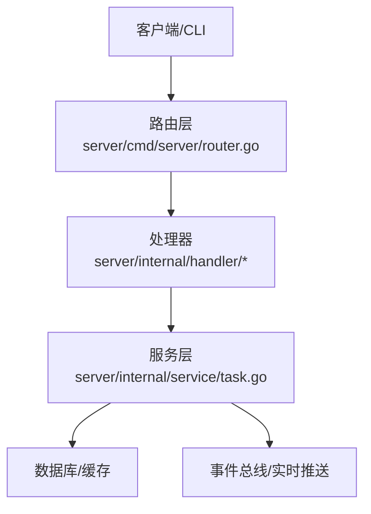
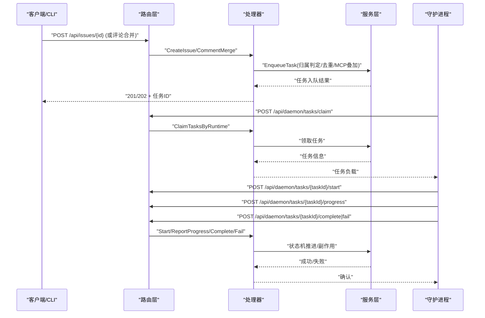
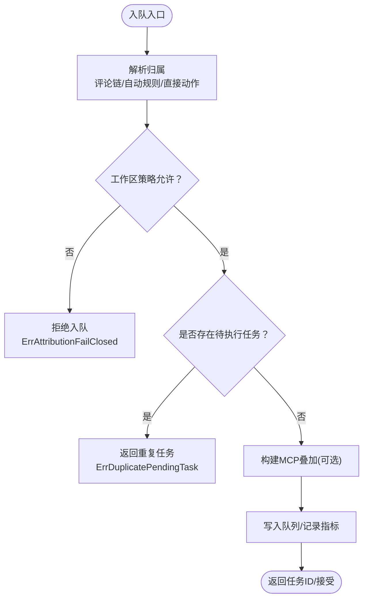
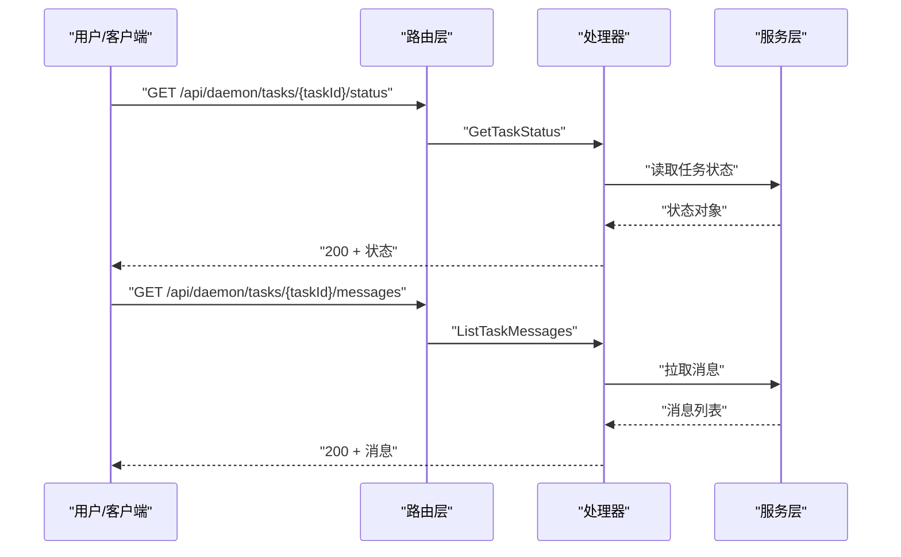
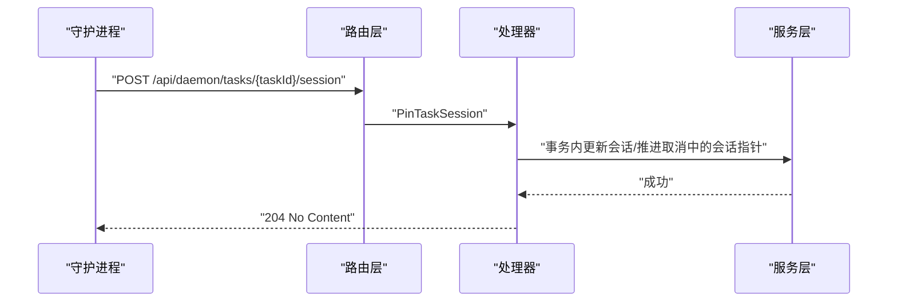
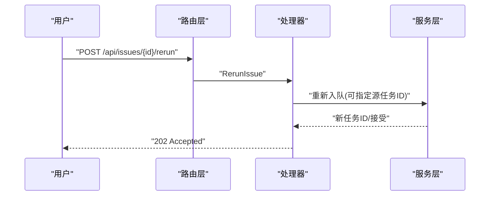
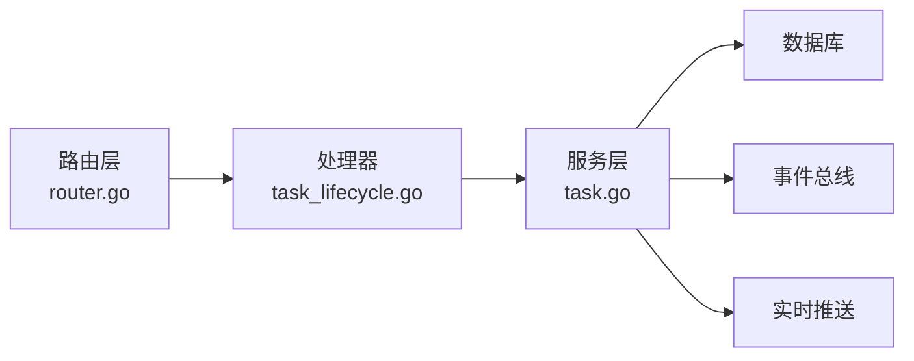

# 任务基本操作

<cite>
**本文引用的文件**
- [router.go](file://server/cmd/server/router.go)
- [task_lifecycle.go](file://server/internal/handler/task_lifecycle.go)
- [task.go](file://server/internal/service/task.go)
</cite>

## 目录
1. [简介](#简介)
2. [项目结构](#项目结构)
3. [核心组件](#核心组件)
4. [架构总览](#架构总览)
5. [详细组件分析](#详细组件分析)
6. [依赖关系分析](#依赖关系分析)
7. [性能考虑](#性能考虑)
8. [故障排查指南](#故障排查指南)
9. [结论](#结论)
10. [附录：API 参考与错误码](#附录api-参考与错误码)

## 简介
本章节面向“任务”这一核心实体，系统性地说明其基本 CRUD 能力与边界约束。结合后端路由、处理器与服务层实现，文档覆盖：
- 创建任务：触发方式（评论合并/指派/自动规则）、必填字段与可选参数、幂等与并发控制。
- 读取任务：按 ID 查询状态、会话消息列表、以及通过问题上下文间接获取任务详情。
- 更新任务：部分更新与批量更新的权限控制、数据验证与一致性保障。
- 删除任务：软删除机制与数据保留策略。
- 请求/响应示例与错误码：常见校验错误与业务约束错误的返回约定。

## 项目结构
任务相关能力由三层协作完成：
- 路由层：在服务器启动时注册任务生命周期与执行相关的 HTTP 端点，区分守护进程 API 与用户 API。
- 处理器层：负责鉴权、参数解析、调用服务层并统一写回响应。
- 服务层：封装任务创建、重试、归属判定、失败处理、MCP 叠加等复杂业务逻辑。

图表来源
- [router.go:1433-1486](file://server/cmd/server/router.go#L1433-L1486)
- [task_lifecycle.go:1-274](file://server/internal/handler/task_lifecycle.go#L1-L274)
- [task.go:39-91](file://server/internal/service/task.go#L39-L91)

章节来源
- [router.go:1433-1486](file://server/cmd/server/router.go#L1433-L1486)

## 核心组件
- 路由组 /api/daemon：守护进程专用接口，包含任务认领、开始、进度上报、完成、失败、消息上报、状态查询、孤儿任务恢复、会话钉住等。
- 处理器 task_lifecycle：提供孤儿任务恢复、会话钉住、问题重跑、源上下文快速创建重试等关键流程。
- 服务层 task：集中实现任务归属判定、重复任务去重、失败重试、MCP 叠加、指标埋点、配额限制等。

章节来源
- [router.go:1433-1486](file://server/cmd/server/router.go#L1433-L1486)
- [task_lifecycle.go:1-274](file://server/internal/handler/task_lifecycle.go#L1-L274)
- [task.go:39-91](file://server/internal/service/task.go#L39-L91)

## 架构总览
下图展示任务从“创建/触发”到“执行/完成”的关键路径，以及守护进程与服务器之间的交互。

图表来源
- [router.go:1453-1486](file://server/cmd/server/router.go#L1453-L1486)
- [task_lifecycle.go:143-224](file://server/internal/handler/task_lifecycle.go#L143-L224)
- [task.go:699-738](file://server/internal/service/task.go#L699-L738)

## 详细组件分析

### 创建任务（Enqueue）
- 触发入口
  - 通过问题创建或评论合并触发任务入队；也可通过自动规则（Autopilot）或手动重跑触发。
  - 路由层将用户态与守护进程态的端点分离，创建类操作通常走用户态路由（例如问题创建/评论合并），而守护进程仅负责执行阶段。
- 必填字段与可选参数
  - 典型必填：关联的问题 ID、触发来源（如评论 ID 或指派动作）。
  - 可选：是否强制新会话、是否携带 MCP 叠加、是否附带源上下文快照等。
- 幂等与并发
  - 同一问题+智能体的待执行任务具有唯一性约束，并发入队会去重，避免重复执行。
  - 若检测到重复，服务层返回特定错误，上层可将其视为“已存在”的友好结果。
- 归属与授权
  - 服务层根据评论链、自动规则触发者、直接成员动作等计算“可问责人类”，并在失败关闭策略下拒绝无明确责任人的运行。
  - 对私有智能体的调用需通过 invoke 权限门控。

图表来源
- [task.go:699-738](file://server/internal/service/task.go#L699-L738)
- [task.go:740-779](file://server/internal/service/task.go#L740-L779)
- [task.go:366-406](file://server/internal/service/task.go#L366-L406)

章节来源
- [task.go:699-738](file://server/internal/service/task.go#L699-L738)
- [task.go:740-779](file://server/internal/service/task.go#L740-L779)
- [task.go:366-406](file://server/internal/service/task.go#L366-L406)

### 读取任务
- 按 ID 查询状态
  - 守护进程可通过 /api/daemon/tasks/{taskId}/status 查询任务当前状态。
- 会话消息列表
  - 守护进程可通过 /api/daemon/tasks/{taskId}/messages 上报与拉取任务执行过程中的消息。
- 通过问题上下文获取任务详情
  - 用户态通常不直接暴露“列出所有任务”的通用接口；前端/客户端通过问题详情、执行日志、评论合并等上下文间接获取任务信息。
- 搜索
  - 代码库未提供通用的“按关键词搜索任务”的公开端点；任务检索多基于问题维度与执行日志聚合。

图表来源
- [router.go:1467-1475](file://server/cmd/server/router.go#L1467-L1475)

章节来源
- [router.go:1467-1475](file://server/cmd/server/router.go#L1467-L1475)

### 更新任务
- 部分更新
  - 典型场景：守护进程上报进度、完成/失败、会话钉住（session_id/work_dir）。
  - 会话钉住用于在崩溃后恢复对话指针，保证 UI 与聊天会话的一致性。
- 批量更新
  - 守护进程支持批量认领与批量结果上报；服务端在服务层对并发与幂等进行保护。
- 权限控制
  - 守护进程端点需要守护进程令牌或有效用户令牌；用户态更新需具备对应资源访问权限。
- 数据验证
  - 请求体字段校验（如 session_id 与 work_dir 至少其一）、UUID 格式校验、状态机合法性校验。

图表来源
- [router.go:1484-1486](file://server/cmd/server/router.go#L1484-L1486)
- [task_lifecycle.go:61-141](file://server/internal/handler/task_lifecycle.go#L61-L141)

章节来源
- [task_lifecycle.go:61-141](file://server/internal/handler/task_lifecycle.go#L61-L141)
- [router.go:1484-1486](file://server/cmd/server/router.go#L1484-L1486)

### 删除任务
- 软删除与保留
  - 代码库中未发现显式的“删除任务”端点；任务的生命周期以状态机推进为主（pending → dispatched → running → completed/failed/cancelled）。
  - 历史执行记录通常保留于执行日志/消息中，便于审计与回溯。
- 清理策略
  - 服务层包含针对终端快速创建的源上下文快照的 30 天清理通道（当存储可用时），体现“短期临时数据”的保留策略。
- 建议
  - 如需对外暴露“删除任务”，应遵循“禁止外键与级联、应用层事务清理”的数据库规则，并通过软标记或归档表实现。

章节来源
- [task.go:47-55](file://server/internal/service/task.go#L47-L55)

### 重跑与失败处理
- 手动重跑
  - 通过问题重跑端点可选择针对某条历史任务行进行重跑，强制新会话以避免继承污染状态。
- 失败恢复
  - 守护进程启动时会尝试恢复孤儿任务，将其置为失败并进入统一失败处理管线，触发事件、回滚、自动重试等。

图表来源
- [router.go:1467-1486](file://server/cmd/server/router.go#L1467-L1486)
- [task_lifecycle.go:143-224](file://server/internal/handler/task_lifecycle.go#L143-L224)

章节来源
- [task_lifecycle.go:143-224](file://server/internal/handler/task_lifecycle.go#L143-L224)

## 依赖关系分析
- 路由层依赖处理器：所有任务相关端点在路由层集中声明，处理器负责鉴权与参数解析。
- 处理器依赖服务层：复杂业务逻辑（归属判定、去重、失败处理、MCP 叠加）集中在服务层，保持处理器轻量。
- 服务层依赖外部组件：数据库查询、事件总线、实时推送、指标埋点、特性开关、配额提供者等。

图表来源
- [router.go:1433-1486](file://server/cmd/server/router.go#L1433-L1486)
- [task_lifecycle.go:1-274](file://server/internal/handler/task_lifecycle.go#L1-L274)
- [task.go:39-91](file://server/internal/service/task.go#L39-L91)

章节来源
- [router.go:1433-1486](file://server/cmd/server/router.go#L1433-L1486)
- [task_lifecycle.go:1-274](file://server/internal/handler/task_lifecycle.go#L1-L274)
- [task.go:39-91](file://server/internal/service/task.go#L39-L91)

## 性能考虑
- 并发安全
  - 待执行任务的唯一索引避免重复入队；服务层对重复任务进行识别与合并。
- 缓存与提示
  - 使用 Redis 提示最近可能存在的陈旧派发任务，减少不必要的数据库扫描。
- 摘要裁剪
  - 任务行上的触发摘要长度受限，降低响应体积与传输成本。
- 超时与恢复
  - 设置合理的认领响应恢复窗口与准备租约时长，提升崩溃恢复效率。

章节来源
- [task.go:180-196](file://server/internal/service/task.go#L180-L196)
- [task.go:123-178](file://server/internal/service/task.go#L123-L178)
- [task.go:699-738](file://server/internal/service/task.go#L699-L738)

## 故障排查指南
- 常见错误
  - 重复任务：当并发入队命中唯一索引时，返回“重复待执行任务”语义的错误，上层应视为成功合并。
  - 归属失败关闭：无法确定可问责人类且策略为失败关闭时，拒绝入队。
  - 会话钉住失败：事务锁或指针推进失败时返回内部错误，需检查并发竞争与事务顺序。
- 定位方法
  - 查看守护进程心跳与孤儿恢复日志，确认是否有长时间运行的任务被误判。
  - 检查任务状态机流转与消息上报，确认是否在 start/progress/complete/fail 任一环节异常。

章节来源
- [task.go:690-779](file://server/internal/service/task.go#L690-L779)
- [task_lifecycle.go:17-59](file://server/internal/handler/task_lifecycle.go#L17-L59)
- [task_lifecycle.go:108-141](file://server/internal/handler/task_lifecycle.go#L108-L141)

## 结论
- 任务创建以“问题/评论/自动规则”为核心触发点，强调归属判定与幂等去重。
- 读取主要通过守护进程的状态与消息接口，用户态通过问题上下文间接获取。
- 更新以部分更新为主，严格权限与数据验证，确保状态机一致性与会话连续性。
- 删除采用软删除/状态机推进模式，历史数据保留于执行日志，短期临时数据有清理策略。
- 错误处理结构化，常见错误包括重复任务、归属失败关闭、会话钉住失败等。

## 附录：API 参考与错误码

- 守护进程任务接口（节选）
  - POST /api/daemon/tasks/claim：批量认领任务
  - GET /api/daemon/tasks/{taskId}/status：查询任务状态
  - POST /api/daemon/tasks/{taskId}/start：开始执行
  - POST /api/daemon/tasks/{taskId}/progress：上报进度
  - POST /api/daemon/tasks/{taskId}/complete：完成任务
  - POST /api/daemon/tasks/{taskId}/fail：标记失败
  - POST /api/daemon/tasks/{taskId}/messages：上报/拉取消息
  - POST /api/daemon/runtimes/{runtimeId}/tasks/{taskId}/prepare-lease：延长准备租约
  - POST /api/daemon/runtimes/{runtimeId}/recover-orphans：恢复孤儿任务
  - POST /api/daemon/tasks/{taskId}/session：钉住会话

- 用户态任务相关
  - POST /api/issues/{id}/rerun：手动重跑问题（可指定源任务 ID）

- 常见错误码与含义
  - 400 Bad Request：请求体无效、字段缺失或格式错误（如 session_id 与 work_dir 同时为空）
  - 403 Forbidden：无权调用（如私有智能体调用门控失败）
  - 409 Conflict：重复任务（并发入队命中唯一索引）
  - 500 Internal Server Error：内部错误（事务失败、数据库错误等）

章节来源
- [router.go:1453-1486](file://server/cmd/server/router.go#L1453-L1486)
- [task_lifecycle.go:61-141](file://server/internal/handler/task_lifecycle.go#L61-L141)
- [task_lifecycle.go:143-224](file://server/internal/handler/task_lifecycle.go#L143-L224)
- [task.go:699-738](file://server/internal/service/task.go#L699-L738)