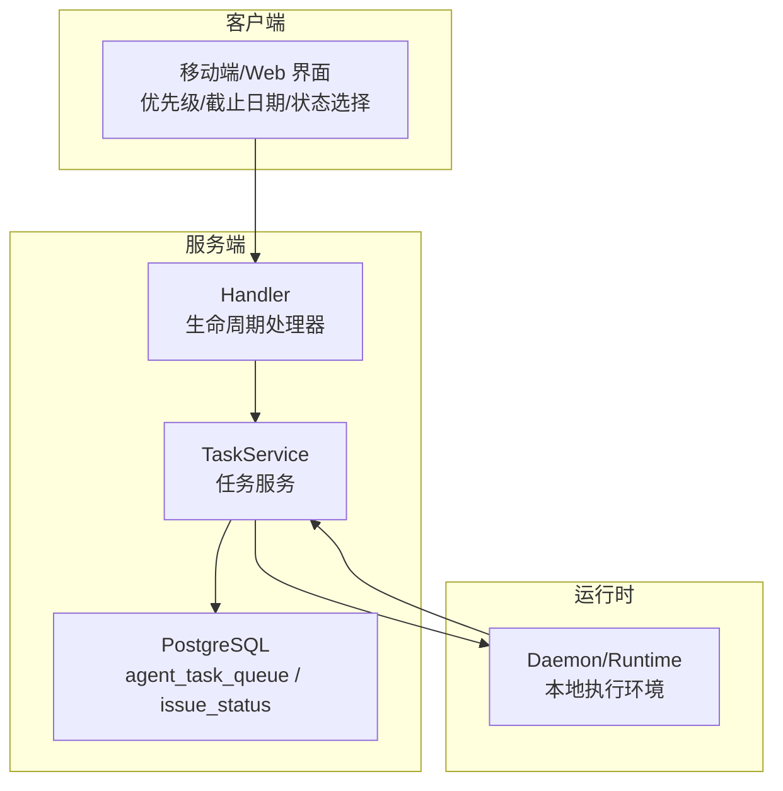
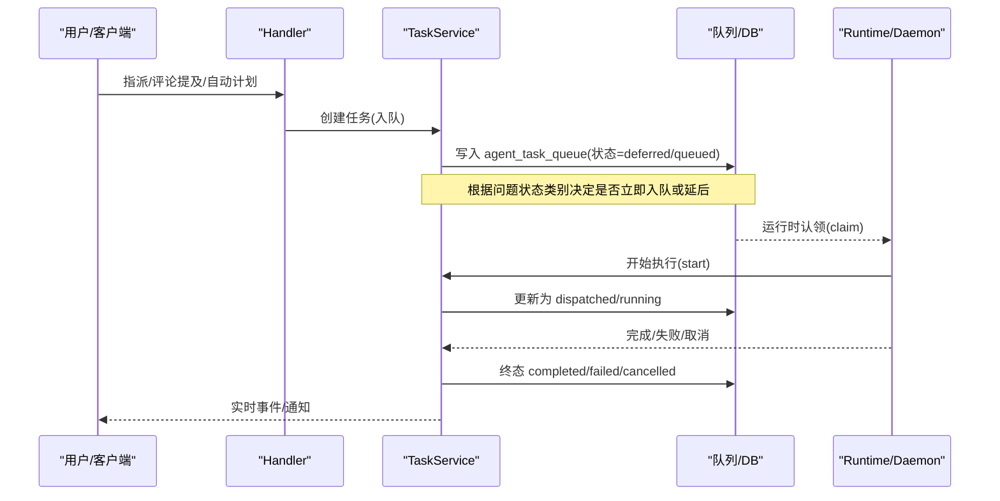
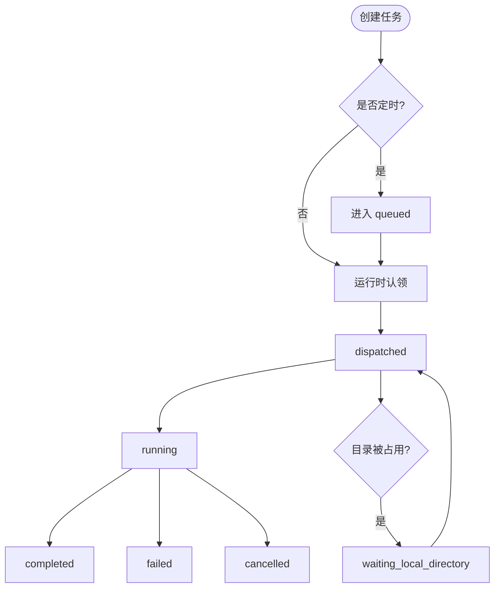
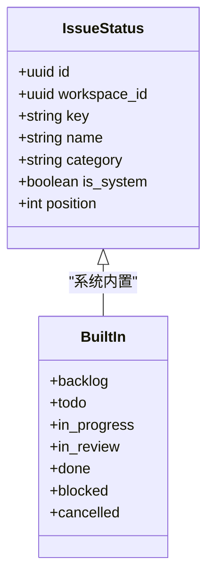
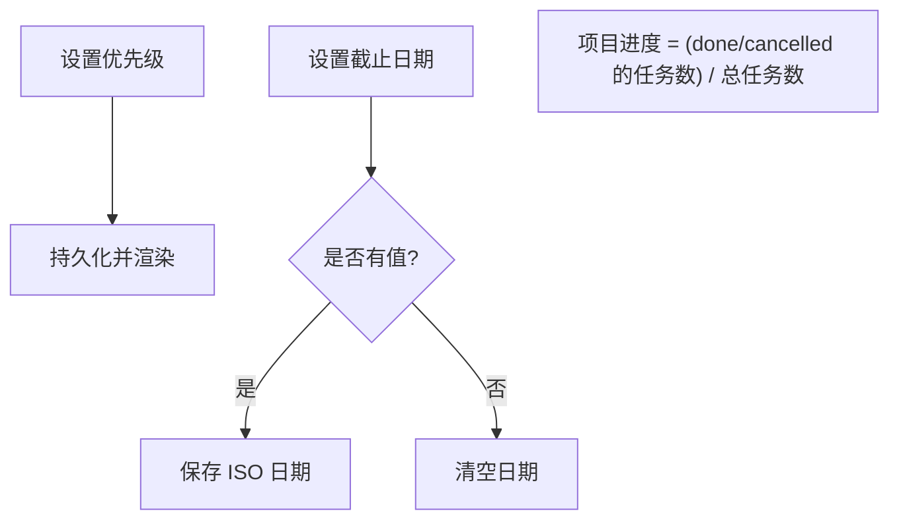
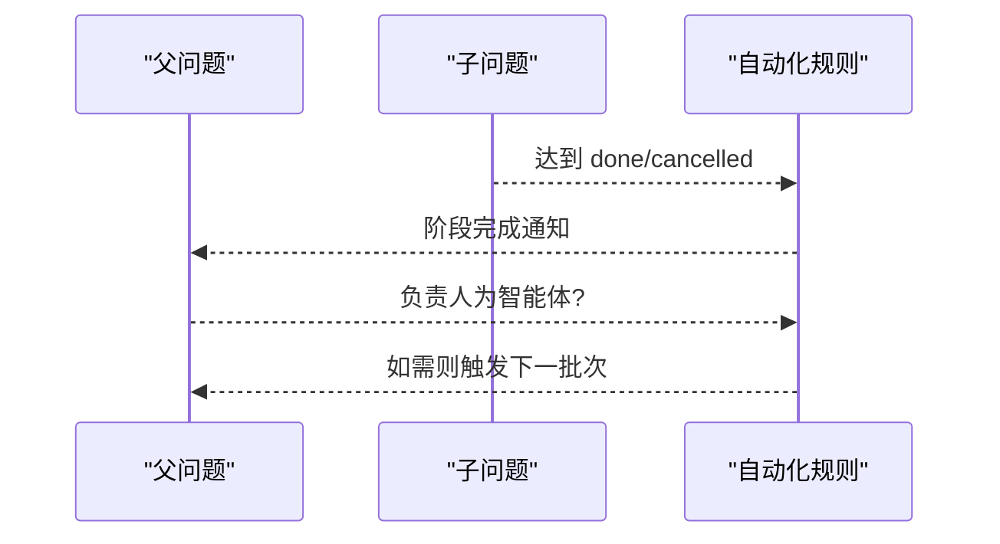
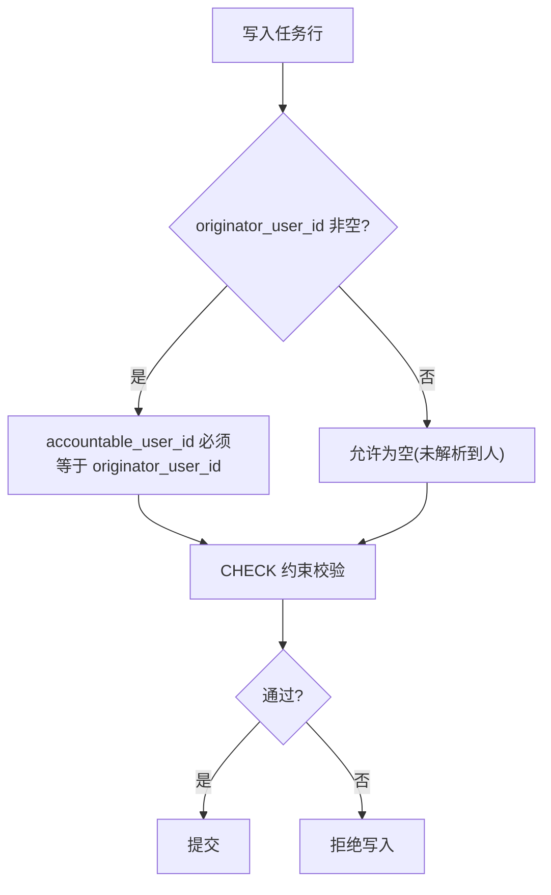
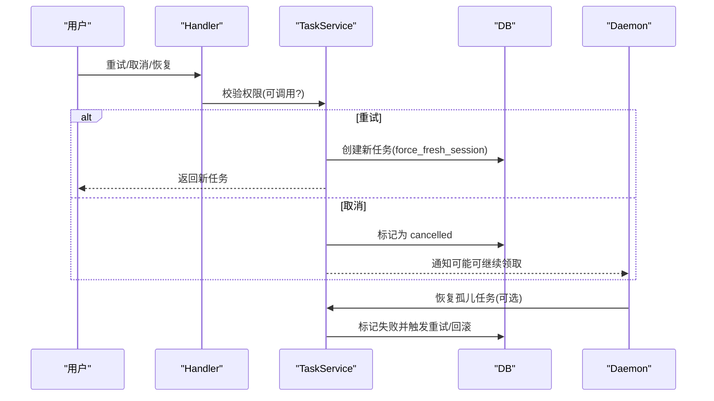
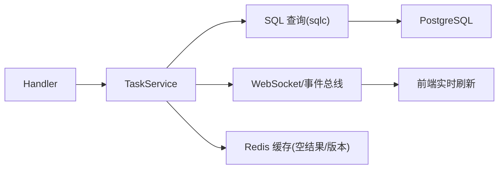

# 任务生命周期

<cite>
**本文引用的文件**
- [server/internal/service/task.go](file://server/internal/service/task.go)
- [server/internal/handler/task_lifecycle.go](file://server/internal/handler/task_lifecycle.go)
- [apps/docs/content/docs/tasks.mdx](file://apps/docs/content/docs/tasks.mdx)
- [apps/docs/content/docs/issues.mdx](file://apps/docs/content/docs/issues.mdx)
- [apps/docs/content/docs/assigning-issues.mdx](file://apps/docs/content/docs/assigning-issues.mdx)
- [server/migrations/332_issue_status.up.sql](file://server/migrations/332_issue_status.up.sql)
- [server/pkg/db/queries/issue_status.sql](file://server/pkg/db/queries/issue_status.sql)
- [server/migrations/185_agent_task_accountable_user.up.sql](file://server/migrations/185_agent_task_accountable_user.up.sql)
- [server/migrations/190_agent_task_attribution_invariant_check.up.sql](file://server/migrations/190_agent_task_attribution_invariant_check.up.sql)
- [server/migrations/251_agent_runtime_unbind.up.sql](file://server/migrations/251_agent_runtime_unbind.up.sql)
- [apps/mobile/lib/project-status.ts](file://apps/mobile/lib/project-status.ts)
- [apps/mobile/components/issue/pickers/priority-picker-body.tsx](file://apps/mobile/components/issue/pickers/priority-picker-body.tsx)
- [apps/mobile/app/(app)/[workspace]/issue/[id]/picker/due-date.tsx](file://apps/mobile/app/(app)/[workspace]/issue/[id]/picker/due-date.tsx)
</cite>

## 目录
1. [简介](#简介)
2. [项目结构](#项目结构)
3. [核心组件](#核心组件)
4. [架构总览](#架构总览)
5. [详细组件分析](#详细组件分析)
6. [依赖关系分析](#依赖关系分析)
7. [性能考量](#性能考量)
8. [故障排查指南](#故障排查指南)
9. [结论](#结论)
10. [附录](#附录)

## 简介
本文件系统性说明 Multica 中“任务（运行）”与“问题（Issue）”的生命周期管理，覆盖：
- 任务状态机、状态转换规则与实现要点
- 问题状态定义、内置/自定义状态及类别行为
- 优先级设置、截止日期管理与进度跟踪
- 依赖关系、父子任务与工作流自动化
- 状态变更历史与审计日志查询
- 重分配、延期与取消的业务逻辑、权限控制与并发安全

## 项目结构
围绕任务生命周期的关键代码分布在以下位置：
- 服务层：任务调度、重试、通知、归属与并发控制等核心逻辑
- 处理器层：守护进程恢复、手动重试、会话固定等接口
- 文档：任务执行生命周期、问题状态与类别、指派与权限
- 数据库迁移与查询：问题状态目录、审计列与不变量约束、运行时绑定约束
- 前端：优先级选择器、截止日期编辑等交互入口

图表来源
- [server/internal/service/task.go:39-91](file://server/internal/service/task.go#L39-L91)
- [server/internal/handler/task_lifecycle.go:17-59](file://server/internal/handler/task_lifecycle.go#L17-L59)
- [server/pkg/db/queries/issue_status.sql:1-20](file://server/pkg/db/queries/issue_status.sql#L1-L20)

章节来源
- [apps/docs/content/docs/tasks.mdx:33-48](file://apps/docs/content/docs/tasks.mdx#L33-L48)
- [apps/docs/content/docs/issues.mdx:59-84](file://apps/docs/content/docs/issues.mdx#L59-L84)

## 核心组件
- 任务服务 TaskService：负责任务的入队、派发、重试、取消、完成、失败处理、通知与并发控制。
- 生命周期处理器 Handler：暴露守护进程恢复、手动重试、会话固定等 HTTP 接口，并调用服务层。
- 问题状态目录 issue_status：维护内置与自定义状态及其类别，决定平台行为。
- 审计与归属：通过 accountable_user_id 与数据库 CHECK 保证可审计性与一致性。
- 前端交互：提供优先级、截止日期、状态等用户操作入口。

章节来源
- [server/internal/service/task.go:39-91](file://server/internal/service/task.go#L39-L91)
- [server/internal/handler/task_lifecycle.go:17-59](file://server/internal/handler/task_lifecycle.go#L17-L59)
- [server/pkg/db/queries/issue_status.sql:1-20](file://server/pkg/db/queries/issue_status.sql#L1-L20)
- [server/migrations/185_agent_task_accountable_user.up.sql:21-53](file://server/migrations/185_agent_task_accountable_user.up.sql#L21-L53)

## 架构总览
任务生命周期由“问题状态类别”驱动工作流触发，并由“任务（运行）状态机”驱动执行流程；两者解耦但协同工作。

图表来源
- [apps/docs/content/docs/tasks.mdx:33-48](file://apps/docs/content/docs/tasks.mdx#L33-L48)
- [server/internal/service/task.go:6923-6951](file://server/internal/service/task.go#L6923-L6951)
- [server/internal/handler/task_lifecycle.go:165-224](file://server/internal/handler/task_lifecycle.go#L165-L224)

## 详细组件分析

### 任务（运行）状态机与转换
- 状态集合：deferred、queued、dispatched、waiting_local_directory、running、completed、failed、cancelled。
- 典型转换：
  - 创建时进入 deferred（定时）或 queued（立即可用）。
  - 运行时认领后进入 dispatched，随后 running。
  - 目标目录被占用时进入 waiting_local_directory，释放后回到启动流程。
  - 正常结束为 completed；异常或中断为 failed；手动停止为 cancelled。
- 超时与重试：
  - queued 在运行时心跳存活期间不会过期；仅在同时满足“运行时失联超过重连宽限”且“任务排队时间也超过该宽限”时失败。
  - 自动重试仅覆盖特定瞬态错误（如运行时离线、daemon 重启恢复、平台判定执行超时、工具网络中断等），有尝试次数上限。
  - 非瞬态错误需人工修复后重试。

图表来源
- [apps/docs/content/docs/tasks.mdx:33-48](file://apps/docs/content/docs/tasks.mdx#L33-L48)
- [apps/docs/content/docs/tasks.mdx:78-169](file://apps/docs/content/docs/tasks.mdx#L78-L169)

章节来源
- [apps/docs/content/docs/tasks.mdx:33-48](file://apps/docs/content/docs/tasks.mdx#L33-L48)
- [apps/docs/content/docs/tasks.mdx:78-169](file://apps/docs/content/docs/tasks.mdx#L78-L169)

### 问题状态与类别（内置与自定义）
- 内置状态：backlog、todo、in_progress、in_review、done、blocked、cancelled。
- 类别即行为：每个状态属于一个类别，平台按类别执行动作（如从 backlog 移出到 todo 类会触发入队；in_progress 失败且无其他运行时会回滚到 todo）。
- 自定义状态：可在工作区新增，必须选择一个类别并继承其全部行为；平台自身写回时使用内置键而非自定义键。
- 看板列按类别划分，卡片显示具体状态名。

图表来源
- [server/pkg/db/queries/issue_status.sql:1-20](file://server/pkg/db/queries/issue_status.sql#L1-L20)
- [server/migrations/332_issue_status.up.sql:1-25](file://server/migrations/332_issue_status.up.sql#L1-L25)

章节来源
- [apps/docs/content/docs/issues.mdx:59-84](file://apps/docs/content/docs/issues.mdx#L59-L84)
- [apps/docs/content/docs/issues.mdx:80-123](file://apps/docs/content/docs/issues.mdx#L80-L123)
- [server/pkg/db/queries/issue_status.sql:1-20](file://server/pkg/db/queries/issue_status.sql#L1-L20)

### 优先级、截止日期与进度跟踪
- 优先级枚举：urgent、high、medium、low、none。前端以条形图可视化，等级越高填充越多。
- 截止日期：支持设置与清除，移动端提供日期选择与保存/清空入口。
- 进度跟踪：项目进度基于所属问题的完成比例计算；子问题分阶段推进，当最早未完成阶段全部完成时通知父问题。

图表来源
- [apps/mobile/lib/project-status.ts:26-48](file://apps/mobile/lib/project-status.ts#L26-L48)
- [apps/mobile/components/issue/pickers/priority-picker-body.tsx:14-21](file://apps/mobile/components/issue/pickers/priority-picker-body.tsx#L14-L21)
- [apps/mobile/app/(app)/[workspace]/issue/[id]/picker/due-date.tsx:31-84](file://apps/mobile/app/(app)/[workspace]/issue/[id]/picker/due-date.tsx#L31-L84)
- [apps/docs/content/docs/projects.ko.mdx:12-34](file://apps/docs/content/docs/projects.ko.mdx#L12-L34)

章节来源
- [apps/mobile/lib/project-status.ts:26-48](file://apps/mobile/lib/project-status.ts#L26-L48)
- [apps/mobile/components/issue/pickers/priority-picker-body.tsx:14-21](file://apps/mobile/components/issue/pickers/priority-picker-body.tsx#L14-L21)
- [apps/mobile/app/(app)/[workspace]/issue/[id]/picker/due-date.tsx:31-84](file://apps/mobile/app/(app)/[workspace]/issue/[id]/picker/due-date.tsx#L31-L84)
- [apps/docs/content/docs/projects.ko.mdx:12-34](file://apps/docs/content/docs/projects.ko.mdx#L12-L34)

### 依赖关系、父子任务与工作流自动化
- 依赖关系：问题之间可通过子问题拆分；父问题保持总体目标，子问题独立推进。
- 工作流自动化：
  - 将问题从 backlog 移出到 todo 类会触发入队。
  - in_progress 失败且无其他运行/重试时，回滚到 todo。
  - 子问题阶段全部完成后通知父问题；若父问题负责人是智能体，唤醒其决策下一批次。
  - PR 合并带关闭意图时自动将问题置为 done。

图表来源
- [apps/docs/content/docs/issues.mdx:97-104](file://apps/docs/content/docs/issues.mdx#L97-L104)
- [apps/docs/content/docs/issues.mdx:59-84](file://apps/docs/content/docs/issues.mdx#L59-L84)

章节来源
- [apps/docs/content/docs/issues.mdx:97-104](file://apps/docs/content/docs/issues.mdx#L97-L104)
- [apps/docs/content/docs/issues.mdx:59-84](file://apps/docs/content/docs/issues.mdx#L59-L84)

### 状态变更历史与审计日志查询
- 审计列：agent_task_queue.accountable_user_id 用于审计/可见性/成本统计，不用于授权判断。
- 不变量：当 originator_user_id 非空时，accountable_user_id 必须等于 originator_user_id；数据库层通过 CHECK 约束强制。
- 用途：结合来源与证据字段进行审计与 UI 展示；授权路径仍只读 originator_user_id。

图表来源
- [server/migrations/185_agent_task_accountable_user.up.sql:21-53](file://server/migrations/185_agent_task_accountable_user.up.sql#L21-L53)
- [server/migrations/190_agent_task_attribution_invariant_check.up.sql:1-20](file://server/migrations/190_agent_task_attribution_invariant_check.up.sql#L1-L20)

章节来源
- [server/migrations/185_agent_task_accountable_user.up.sql:21-53](file://server/migrations/185_agent_task_accountable_user.up.sql#L21-L53)
- [server/migrations/190_agent_task_attribution_invariant_check.up.sql:1-20](file://server/migrations/190_agent_task_attribution_invariant_check.up.sql#L1-L20)

### 重分配、延期与取消：业务逻辑、权限与并发安全
- 重分配：
  - 将问题从 backlog 移出到非 done/cancelled 类别会触发入队；若已有负责人，同样弹出确认对话框可选择“暂不开始”。
  - 手动重试（rerun）可针对原任务或当前负责人；权限校验在创建新任务前进行，防止越权。
- 延期：
  - 任务可设置为 deferred，到点再入队；也可因目录锁等待而延迟。
- 取消：
  - 可取消处于 deferred/queued/dispatched/waiting_local_directory/running 的任务；已完成的 run 不可取消。
  - 删除问题时，未完成运行会被取消。
- 权限控制：
  - 能否指派/运行智能体取决于智能体的 Access 策略（仅我/指定成员/全工作区）。
  - 手动重试前重新校验操作者对目标智能体的调用权限。
- 并发安全：
  - 运行时心跳与任务超时共同决定失败与回收；守护进程重启后可恢复孤儿任务。
  - 终止态转换批量通知，按运行时聚合以避免风暴。
  - 运行时绑定约束：活跃任务必须有 runtime_id，避免悬挂引用。

图表来源
- [server/internal/handler/task_lifecycle.go:165-224](file://server/internal/handler/task_lifecycle.go#L165-L224)
- [server/internal/service/task.go:6923-6951](file://server/internal/service/task.go#L6923-L6951)
- [server/migrations/251_agent_runtime_unbind.up.sql:24-45](file://server/migrations/251_agent_runtime_unbind.up.sql#L24-L45)

章节来源
- [apps/docs/content/docs/assigning-issues.mdx:43-61](file://apps/docs/content/docs/assigning-issues.mdx#L43-L61)
- [apps/docs/content/docs/tasks.mdx:74-86](file://apps/docs/content/docs/tasks.mdx#L74-L86)
- [server/internal/handler/task_lifecycle.go:17-59](file://server/internal/handler/task_lifecycle.go#L17-L59)
- [server/migrations/251_agent_runtime_unbind.up.sql:24-45](file://server/migrations/251_agent_runtime_unbind.up.sql#L24-L45)

## 依赖关系分析
- 服务与处理器：Handler 仅做请求解析、鉴权与调用 Service；Service 封装事务、并发与通知。
- 服务与数据库：通过 sqlc 生成的查询访问 agent_task_queue、issue_status 等表；迁移确保约束与索引。
- 服务与运行时：通过心跳、claim/start/finish 协议协作；空闲/空结果缓存减少 DB 压力。
- 前端与服务：通过 API 与实时通道更新状态；前端状态与服务器状态分离（TanStack Query/Zustand）。

图表来源
- [server/internal/service/task.go:39-91](file://server/internal/service/task.go#L39-L91)
- [server/internal/service/task.go:6923-6951](file://server/internal/service/task.go#L6923-L6951)

章节来源
- [server/internal/service/task.go:39-91](file://server/internal/service/task.go#L39-L91)

## 性能考量
- 空结果缓存：当运行时无可用任务时，使用缓存避免频繁扫描数据库。
- 批量通知：终止态转换按运行时聚合通知，降低 WebSocket 广播风暴。
- 心跳与超时：合理的心跳间隔与超时阈值平衡了长任务执行与故障检测速度。
- 目录锁：同一工作目录串行化，避免并发冲突；等待状态不设置硬性超时，释放后自动恢复。

## 故障排查指南
- 任务卡在 in_progress：
  - 检查是否存在孤儿任务；守护进程启动时可恢复并失败这些任务，触发重试或回滚。
  - 查看失败原因分类，区分平台侧与工具侧错误。
- 无法重试或重试无效：
  - 确认操作者具备调用目标智能体的权限。
  - 检查是否为非瞬态错误（认证、配额、配置、模型不可用等），需先修复再重试。
- 运行时离线：
  - 恢复运行时心跳；队列中的任务会在重连宽限内保留，之后失败并提示重试。
- 目录占用：
  - 等待目录锁释放；必要时清理占用进程或目录。

章节来源
- [server/internal/handler/task_lifecycle.go:17-59](file://server/internal/handler/task_lifecycle.go#L17-L59)
- [apps/docs/content/docs/tasks.mdx:78-169](file://apps/docs/content/docs/tasks.mdx#L78-L169)

## 结论
Multica 的任务生命周期通过“问题状态类别”与“运行状态机”的解耦设计，实现了灵活的工作流与可靠的执行保障。内置与自定义状态统一受类别行为约束；优先级、截止日期与进度跟踪贯穿项目与问题维度；审计列与数据库不变量确保可追溯与一致性；重分配、延期与取消在权限与并发保护下安全落地。

## 附录
- 术语对照：
  - 任务（Run）：一次智能体执行记录
  - 问题（Issue）：持续的工作项，承载目标、讨论与最终状态
  - 类别（Category）：决定平台行为的抽象分组
  - 运行时（Runtime/Daemon）：本地执行环境