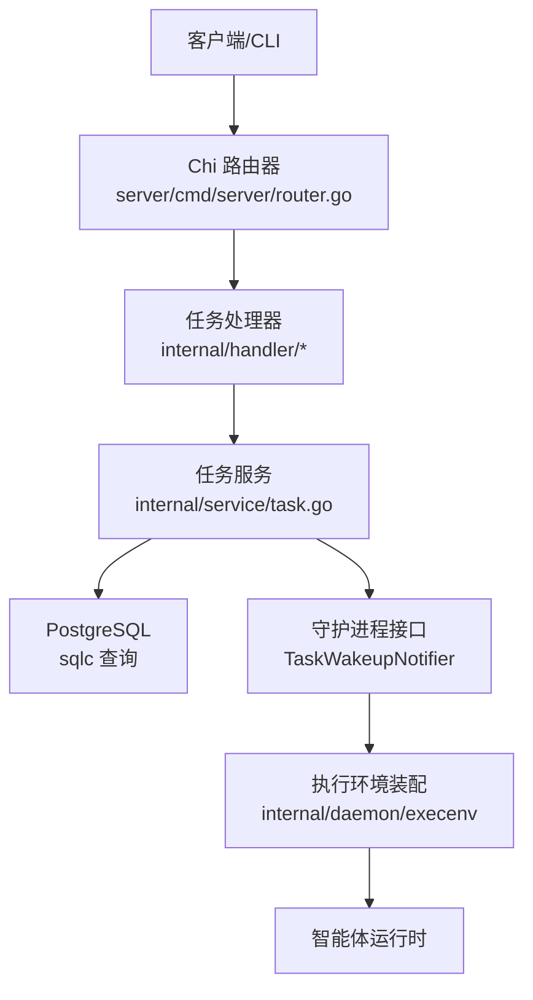
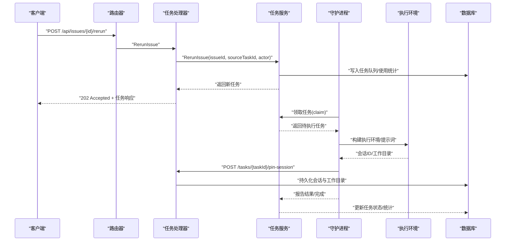
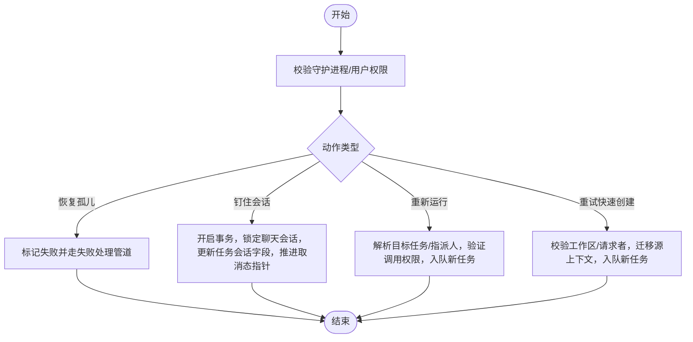
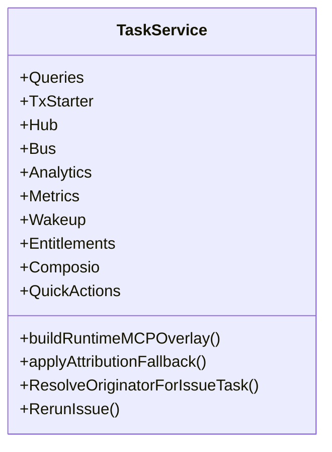
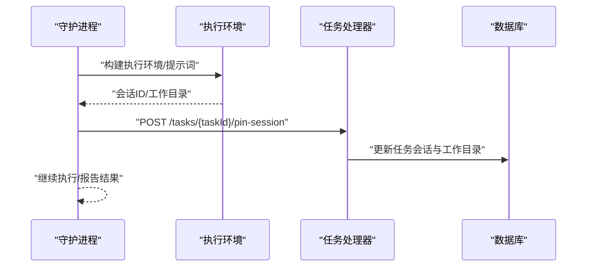
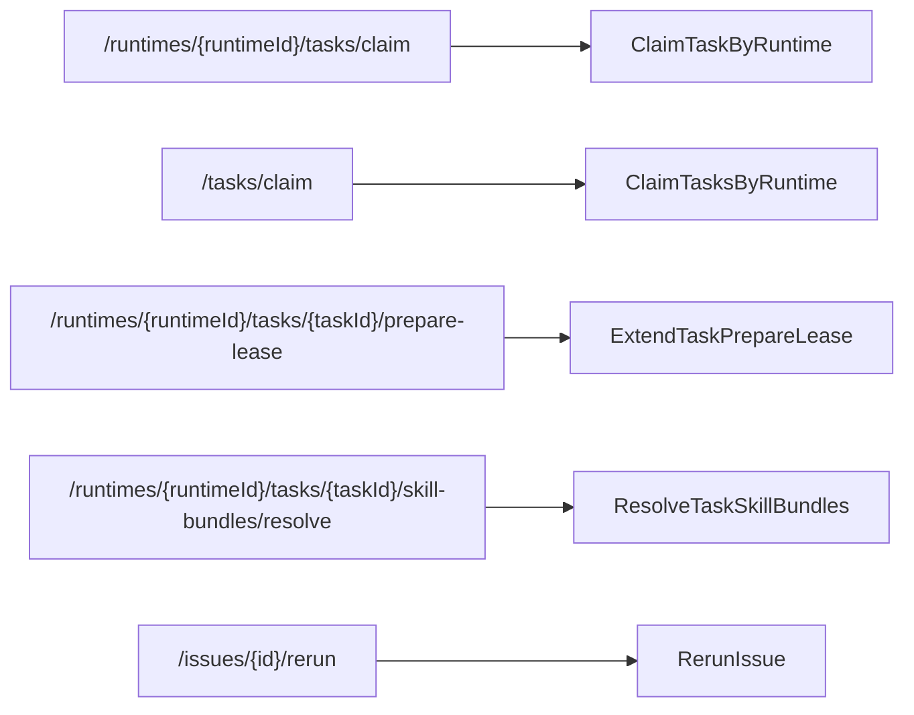
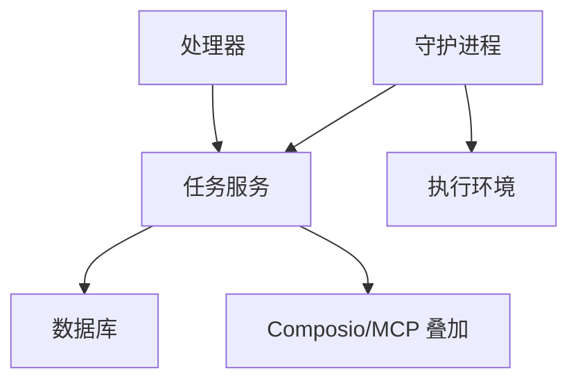

# 任务管理 API

<cite>
**本文引用的文件**
- [router.go](file://server/cmd/server/router.go)
- [task_lifecycle.go](file://server/internal/handler/task_lifecycle.go)
- [task.go](file://server/internal/service/task.go)
- [execenv.go](file://server/internal/daemon/execenv/execenv.go)
- [daemon.go](file://server/internal/daemon/daemon.go)
- [issue.sql](file://server/pkg/db/queries/issue.sql)
- [task_token.sql](file://server/pkg/db/queries/task_token.sql)
- [cmd_issue.go](file://server/cmd/multica/cmd_issue.go)
- [types.go](file://server/pkg/publicapi/v1/types.go)
</cite>

## 目录
1. [简介](#简介)
2. [项目结构](#项目结构)
3. [核心组件](#核心组件)
4. [架构总览](#架构总览)
5. [详细组件分析](#详细组件分析)
6. [依赖关系分析](#依赖关系分析)
7. [性能考虑](#性能考虑)
8. [故障排查指南](#故障排查指南)
9. [结论](#结论)
10. [附录](#附录)

## 简介
本文件面向“任务管理”API，覆盖任务的创建、读取、更新、删除（CRUD）与生命周期管理，以及任务关联的智能体配置、执行环境与参数传递。文档同时说明请求参数校验规则、业务约束与数据完整性检查；提供查询过滤、排序与分页示例；描述任务状态转换与权限控制要求；并给出批量操作与事务处理的最佳实践。

## 项目结构
后端采用 Go + Chi 路由，服务层位于 internal/service，处理器位于 internal/handler，数据库访问通过 sqlc 生成代码，任务执行由内部守护进程（daemon）负责。任务相关的关键路径包括：
- 路由注册：将任务相关的 HTTP 端点挂载到服务器
- 处理器：接收请求、鉴权、调用服务层
- 服务层：实现任务编排、重试、归属判定、MCP 叠加等核心逻辑
- 守护进程：负责任务领取、执行、会话钉住、结果上报与回收
- 数据库：任务队列、使用统计、令牌表等

图表来源
- [router.go:1448-1461](file://server/cmd/server/router.go#L1448-L1461)
- [task_lifecycle.go:27-141](file://server/internal/handler/task_lifecycle.go#L27-L141)
- [task.go:39-91](file://server/internal/service/task.go#L39-L91)
- [execenv.go:1165-1166](file://server/internal/daemon/execenv/execenv.go#L1165-L1166)

章节来源
- [router.go:1448-1461](file://server/cmd/server/router.go#L1448-L1461)

## 核心组件
- 任务处理器：负责任务生命周期事件（恢复孤儿任务、钉住会话、重新运行问题、重试快速创建上下文）
- 任务服务：封装任务入队、重试、归属判定、MCP 叠加、指标与实时通知
- 守护进程：负责任务领取、准备、执行、会话持久化、结果上报与 GC
- 数据库模型：任务队列、任务使用统计、任务令牌、问题实体等

章节来源
- [task_lifecycle.go:27-274](file://server/internal/handler/task_lifecycle.go#L27-L274)
- [task.go:39-91](file://server/internal/service/task.go#L39-L91)
- [daemon.go:6261-6262](file://server/internal/daemon/daemon.go#L6261-L6262)
- [task_token.sql:1-14](file://server/pkg/db/queries/task_token.sql#L1-L14)

## 架构总览
任务从用户或渠道触发，经路由进入处理器，再由服务层完成入队、归属判定与可选的 MCP 叠加，随后守护进程领取并执行，执行过程中可钉住会话与工作目录，完成后回写状态并广播事件。

图表来源
- [task_lifecycle.go:165-224](file://server/internal/handler/task_lifecycle.go#L165-L224)
- [task.go:366-406](file://server/internal/service/task.go#L366-L406)
- [execenv.go:1165-1166](file://server/internal/daemon/execenv/execenv.go#L1165-L1166)

## 详细组件分析

### 任务生命周期处理器
- 恢复孤儿任务：当守护进程重启时，将仍被服务端标记为已派发/运行的任务失败，并通过统一失败处理管道触发重试或回滚，避免 UI 停滞
- 钉住会话：在任务早期持久化会话 ID 与工作目录，确保崩溃后可恢复对话指针
- 重新运行问题：支持按当前指派人或指定历史任务重新入队，强制新会话以避免污染状态
- 重试快速创建上下文：原子移动不可变源上下文到新任务，并复用权限门控

图表来源
- [task_lifecycle.go:27-141](file://server/internal/handler/task_lifecycle.go#L27-L141)
- [task_lifecycle.go:165-274](file://server/internal/handler/task_lifecycle.go#L165-L274)

章节来源
- [task_lifecycle.go:27-274](file://server/internal/handler/task_lifecycle.go#L27-L274)

### 任务服务（核心业务）
- 任务入队与合并：去重并发保护，避免重复入队同一问题与智能体的任务
- 归属判定：基于评论链、自动计划触发器、直接成员行为等确定可问责人类，支持失败关闭策略
- MCP 叠加：为任务计算每任务的 MCP 叠加与连接应用元数据，失败不影响入队
- 指标与通知：记录入队指标，必要时唤醒守护进程

图表来源
- [task.go:39-91](file://server/internal/service/task.go#L39-L91)
- [task.go:366-406](file://server/internal/service/task.go#L366-L406)
- [task.go:756-779](file://server/internal/service/task.go#L756-L779)

章节来源
- [task.go:366-406](file://server/internal/service/task.go#L366-L406)
- [task.go:756-779](file://server/internal/service/task.go#L756-L779)

### 守护进程与执行环境
- 会话钉住与恢复：守护进程在任务早期保存会话与工作目录，以便崩溃后恢复
- 模型选择与能力检查：根据提供者与能力集选择模型，并在任务日志中记录
- 工作目录复用：同一 (agent, issue) 的多轮通过 PriorWorkDir 复用同一 workdir，不同任务并行隔离

图表来源
- [execenv.go:1165-1166](file://server/internal/daemon/execenv/execenv.go#L1165-L1166)
- [daemon.go:6261-6262](file://server/internal/daemon/daemon.go#L6261-L6262)
- [task_lifecycle.go:70-141](file://server/internal/handler/task_lifecycle.go#L70-L141)

章节来源
- [execenv.go:1165-1166](file://server/internal/daemon/execenv/execenv.go#L1165-L1166)
- [daemon.go:6261-6262](file://server/internal/daemon/daemon.go#L6261-L6262)

### 路由与端点
- 任务领取与批领取：供守护进程领取任务
- 任务准备租约扩展与技能包解析：保障任务准备阶段资源可用
- 插件钩子与 MCP 凭证：任务执行期间动态能力注入
- 问题重新运行：用户手动重试任务

图表来源
- [router.go:1448-1461](file://server/cmd/server/router.go#L1448-L1461)

章节来源
- [router.go:1448-1461](file://server/cmd/server/router.go#L1448-L1461)

## 依赖关系分析
- 处理器依赖服务层进行业务编排，服务层依赖数据库查询与外部能力（如 Composio）
- 守护进程与服务层通过任务队列与通知接口协作
- 数据库无外键与级联，关系清理在应用层以事务保证一致性

图表来源
- [task.go:39-91](file://server/internal/service/task.go#L39-L91)
- [task_lifecycle.go:27-141](file://server/internal/handler/task_lifecycle.go#L27-L141)

章节来源
- [task.go:39-91](file://server/internal/service/task.go#L39-L91)

## 性能考虑
- 并发安全：使用唯一索引防止重复入队，结合 Redis 缓存减少空取扫描
- 会话恢复窗口：合理设置心跳与租约时长，避免长时间悬挂任务
- 输出截断：对合成完成评论进行长度限制，避免大输出影响性能与安全性
- 指标与监控：记录任务入队与使用指标，便于容量规划与瓶颈定位

[本节为通用指导，不直接分析具体文件]

## 故障排查指南
- 任务卡住：检查守护进程是否成功恢复孤儿任务，确认失败处理管道是否触发重试
- 会话丢失：确认钉住会话接口是否成功，事务是否正确提交
- 权限拒绝：重新运行或触发任务时，确认调用者具备智能体调用权限
- 数据一致性：确保应用层事务正确清理关系，避免孤立行

章节来源
- [task_lifecycle.go:27-141](file://server/internal/handler/task_lifecycle.go#L27-L141)
- [task.go:690-779](file://server/internal/service/task.go#L690-L779)

## 结论
任务管理 API 围绕“处理器-服务-守护进程-数据库”的分层架构，实现了健壮的任务生命周期管理与执行环境装配。通过严格的归属判定、权限门控与事务一致性，保障了多智能体协作场景下的可靠性与可观测性。建议在生产环境中关注并发入队、会话恢复与输出大小控制，并结合指标与日志持续优化。

[本节为总结，不直接分析具体文件]

## 附录

### CRUD 端点与生命周期
- 创建任务：通过问题重新运行或渠道消息触发入队；CLI 也提供问题创建与指派命令
- 读取任务：通过 CLI 列出任务与查看执行日志
- 更新任务：通过 CLI 更新问题字段（状态、优先级、指派等），间接影响任务调度
- 删除任务：系统层面通过后台清理与 GC 机制维护任务与资源

章节来源
- [cmd_issue.go:2200-2443](file://server/cmd/multica/cmd_issue.go#L2200-L2443)

### 状态管理、优先级、标签与分类
- 状态：任务状态在服务层与守护进程中流转，最终由完成/失败路径更新
- 优先级：问题实体包含优先级字段，影响调度与展示
- 标签与分类：问题实体包含元数据与属性，可用于分类与过滤

章节来源
- [types.go:31-60](file://server/pkg/publicapi/v1/types.go#L31-L60)
- [issue.sql:144-153](file://server/pkg/db/queries/issue.sql#L144-L153)

### 智能体配置、执行环境与参数传递
- 智能体配置：任务入队前计算 MCP 叠加与连接应用元数据
- 执行环境：守护进程装配 brief、技能水合与逐轮提示词
- 参数传递：会话 ID 与工作目录钉住，保证崩溃恢复

章节来源
- [task.go:366-406](file://server/internal/service/task.go#L366-L406)
- [execenv.go:1165-1166](file://server/internal/daemon/execenv/execenv.go#L1165-L1166)

### 请求参数验证、业务约束与数据完整性
- 参数校验：处理器对 JSON 请求体进行解码与必填字段校验
- 业务约束：归属判定失败关闭策略，禁止无问责人类的运行
- 数据完整性：事务内锁定聊天会话与更新任务会话，避免竞态

章节来源
- [task_lifecycle.go:70-141](file://server/internal/handler/task_lifecycle.go#L70-L141)
- [task.go:756-779](file://server/internal/service/task.go#L756-L779)

### 查询过滤、排序与分页示例
- 过滤：按状态、优先级、指派者、项目、元数据、属性等过滤
- 排序：支持按属性名称或 ID 排序
- 分页：limit 与 offset 控制返回数量与偏移

章节来源
- [cmd_issue.go:225-237](file://server/cmd/multica/cmd_issue.go#L225-L237)

### 任务生命周期状态转换
- 入队 -> 派发 -> 运行 -> 完成/失败
- 守护进程重启时，未完成的派发/运行任务会被失败处理并尝试重试

章节来源
- [task_lifecycle.go:27-59](file://server/internal/handler/task_lifecycle.go#L27-L59)

### 权限控制要求
- 重新运行需验证调用者对目标智能体的调用权限
- 快速创建重试需工作区中间件与原始请求者身份校验

章节来源
- [task_lifecycle.go:191-224](file://server/internal/handler/task_lifecycle.go#L191-L224)
- [task_lifecycle.go:230-274](file://server/internal/handler/task_lifecycle.go#L230-L274)

### 批量操作与事务处理最佳实践
- 批量领取：守护进程支持批量 claim，减少网络往返
- 事务：钉住会话与推进取消态指针在同一事务中提交，确保一致性
- 幂等：唯一索引与去重逻辑避免重复入队

章节来源
- [task_lifecycle.go:108-141](file://server/internal/handler/task_lifecycle.go#L108-L141)
- [task.go:699-738](file://server/internal/service/task.go#L699-L738)