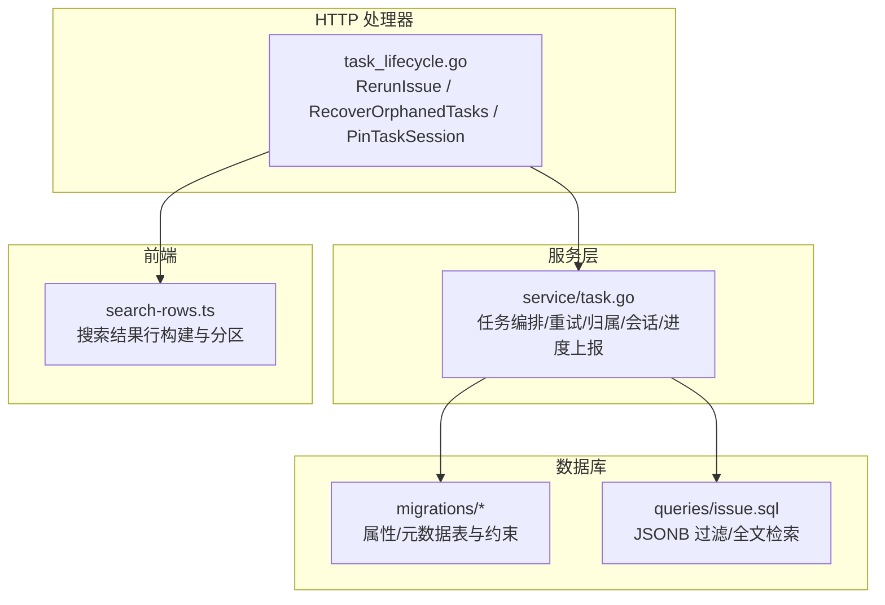
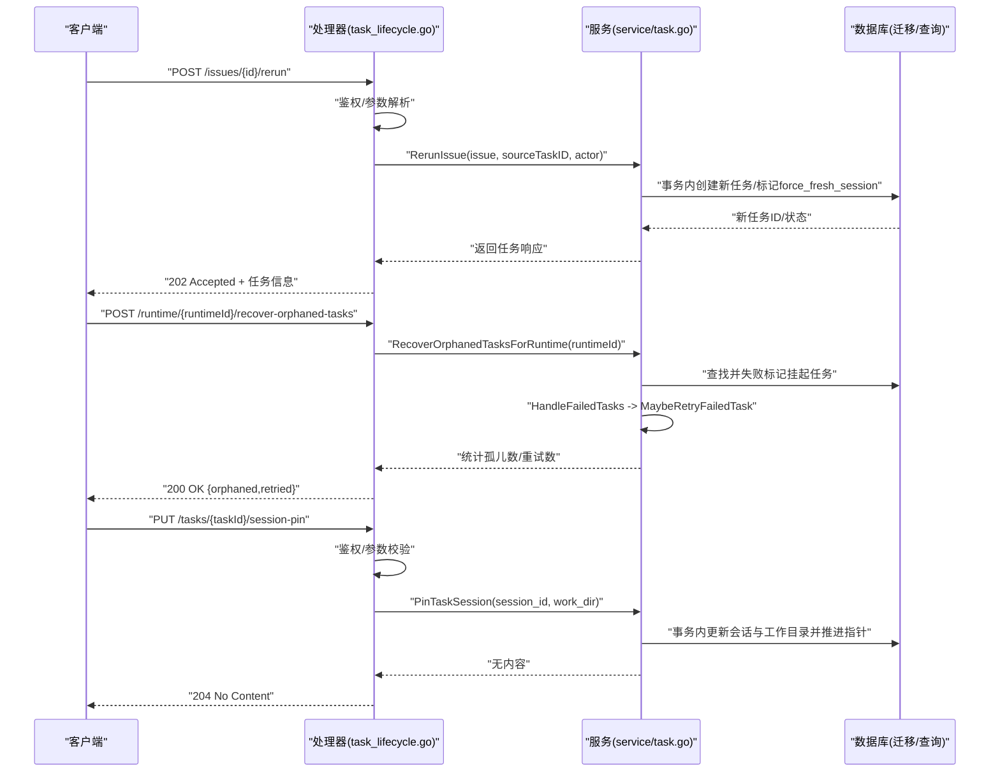
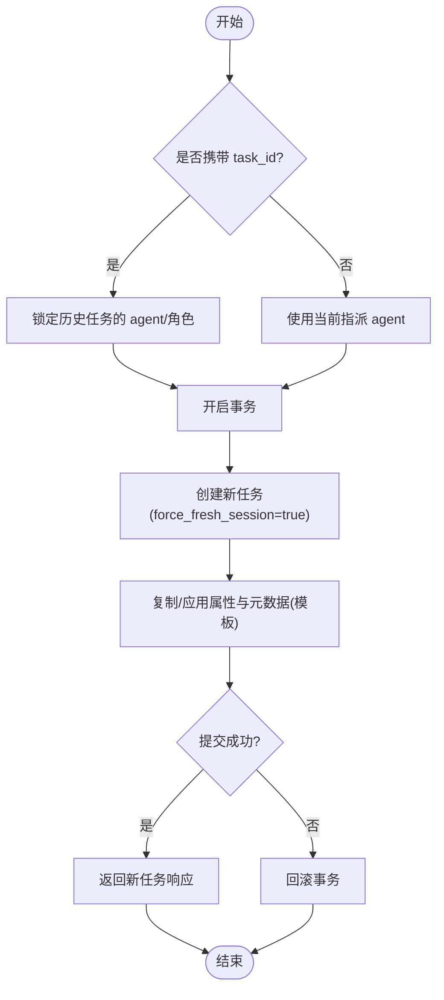
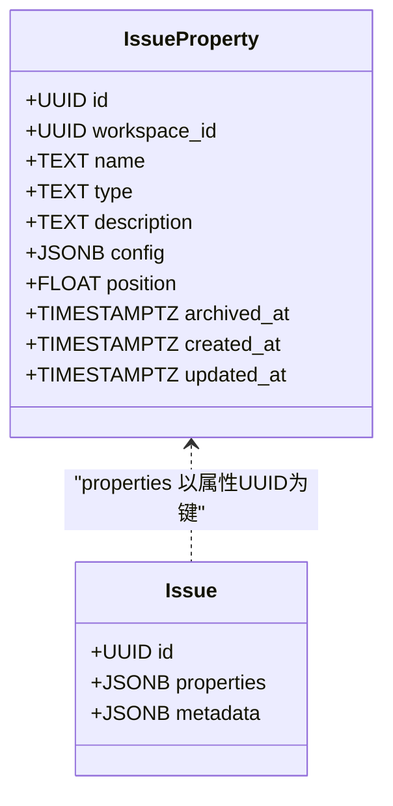
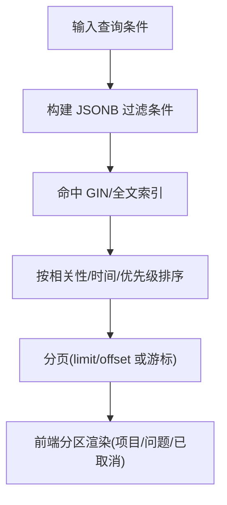
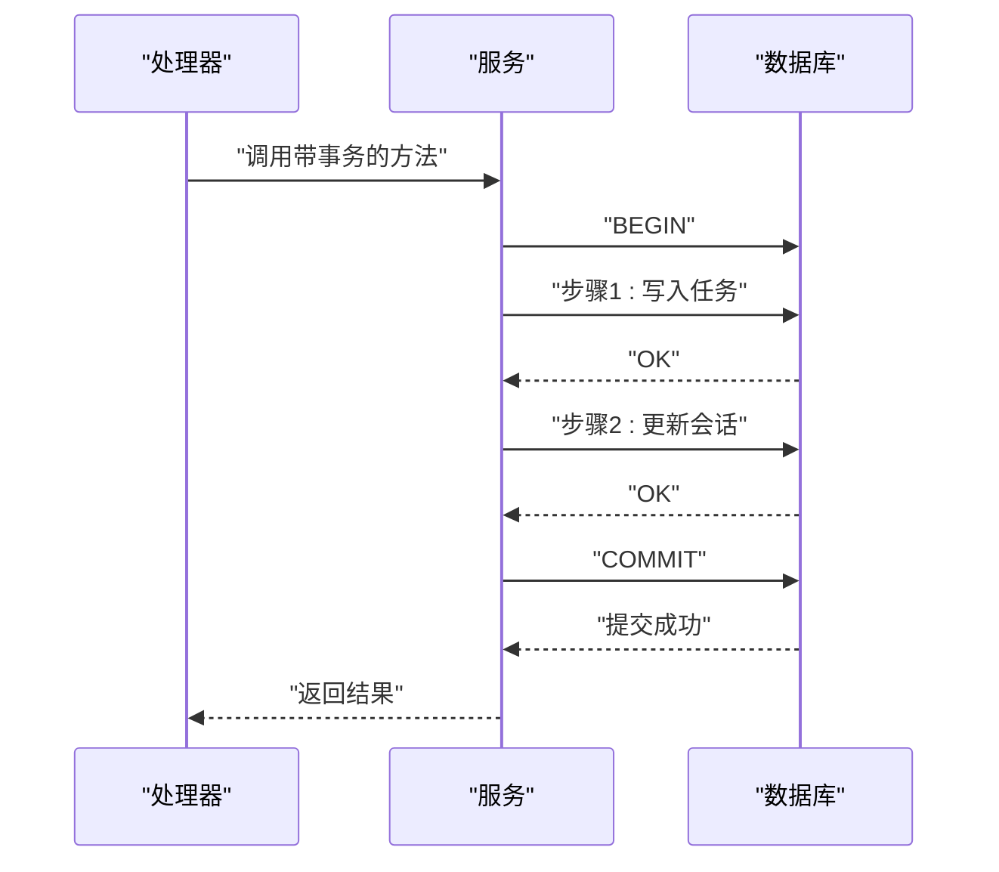
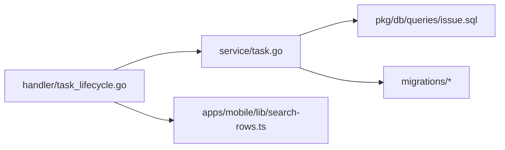

# 任务高级操作

<cite>
**本文引用的文件**
- [server/internal/service/task.go](file://server/internal/service/task.go)
- [server/internal/handler/task_lifecycle.go](file://server/internal/handler/task_lifecycle.go)
- [server/migrations/191_issue_properties.up.sql](file://server/migrations/191_issue_properties.up.sql)
- [server/migrations/105_issue_metadata.up.sql](file://server/migrations/105_issue_metadata.up.sql)
- [server/pkg/db/queries/issue.sql](file://server/pkg/db/queries/issue.sql)
- [apps/mobile/lib/search-rows.ts](file://apps/mobile/lib/search-rows.ts)
- [apps/docs/content/docs/self-host-quickstart.zh.mdx](file://apps/docs/content/docs/self-host-quickstart.zh.mdx)
- [apps/docs/content/docs/troubleshooting.mdx](file://apps/docs/content/docs/troubleshooting.mdx)
</cite>

## 目录
1. [简介](#简介)
2. [项目结构](#项目结构)
3. [核心组件](#核心组件)
4. [架构总览](#架构总览)
5. [详细组件分析](#详细组件分析)
6. [依赖关系分析](#依赖关系分析)
7. [性能考虑](#性能考虑)
8. [故障排查指南](#故障排查指南)
9. [结论](#结论)
10. [附录](#附录)

## 简介
本章节聚焦“任务”的高级操作能力，覆盖批量与复制、模板化、事务与回滚、搜索过滤排序分页、属性扩展与元数据管理、导入导出与迁移备份恢复，以及性能优化与最佳实践。内容基于后端服务层与处理器层的实现进行说明，并结合数据库迁移与查询定义，确保读者既能理解整体流程，也能定位到具体代码位置。

## 项目结构
围绕任务高级操作的关键代码主要分布在以下位置：
- 服务层：任务生命周期、重试、自动重试、会话固定、归属判定等核心逻辑集中在服务包的任务模块中。
- 处理器层：暴露 HTTP 接口，负责鉴权、参数解析、调用服务层并返回响应。
- 数据库迁移：自定义属性与元数据的表结构与约束定义。
- 查询与索引：针对 JSONB 属性的过滤与全文检索相关 SQL。
- 前端展示：搜索结果行构建与分区渲染（移动端示例）。
- 运维文档：备份恢复与升级注意事项。

图表来源
- [server/internal/handler/task_lifecycle.go:1-274](file://server/internal/handler/task_lifecycle.go#L1-L274)
- [server/internal/service/task.go:1-800](file://server/internal/service/task.go#L1-L800)
- [server/migrations/191_issue_properties.up.sql:1-27](file://server/migrations/191_issue_properties.up.sql#L1-L27)
- [server/migrations/105_issue_metadata.up.sql:1-19](file://server/migrations/105_issue_metadata.up.sql#L1-L19)
- [server/pkg/db/queries/issue.sql:383-403](file://server/pkg/db/queries/issue.sql#L383-L403)
- [apps/mobile/lib/search-rows.ts:21-88](file://apps/mobile/lib/search-rows.ts#L21-L88)

章节来源
- [server/internal/handler/task_lifecycle.go:1-274](file://server/internal/handler/task_lifecycle.go#L1-L274)
- [server/internal/service/task.go:1-800](file://server/internal/service/task.go#L1-L800)

## 核心组件
- 任务服务（TaskService）
  - 提供任务创建、重试、自动重试、失败处理、会话固定、进度上报、归属判定、MCP 叠加等能力。
  - 通过事务启动器封装 DB 事务，保证多步写入的原子性与一致性。
- 任务处理器（Handler）
  - 暴露重试、孤儿任务恢复、会话固定等 HTTP 端点，完成鉴权、参数校验与服务层调用。
- 属性与元数据
  - 通过迁移新增 issue_property 表与 issue.metadata JSONB 字段，配合 GIN 索引与 CHECK 约束保障类型与大小限制。
- 查询与索引
  - 使用 JSONB 条件表达式与操作符实现多条件组合过滤；GIN jsonb_path_ops 提升包含查询性能。
- 前端搜索
  - 将搜索结果按“项目/问题/已取消”分区组织，支持空查询显示最近项。

章节来源
- [server/internal/service/task.go:1-800](file://server/internal/service/task.go#L1-L800)
- [server/internal/handler/task_lifecycle.go:1-274](file://server/internal/handler/task_lifecycle.go#L1-L274)
- [server/migrations/191_issue_properties.up.sql:1-27](file://server/migrations/191_issue_properties.up.sql#L1-L27)
- [server/migrations/105_issue_metadata.up.sql:1-19](file://server/migrations/105_issue_metadata.up.sql#L1-L19)
- [server/pkg/db/queries/issue.sql:383-403](file://server/pkg/db/queries/issue.sql#L383-L403)
- [apps/mobile/lib/search-rows.ts:21-88](file://apps/mobile/lib/search-rows.ts#L21-L88)

## 架构总览
下图展示了从 HTTP 请求到服务层、再到数据库的完整链路，涵盖重试、孤儿任务恢复与会话固定等关键路径。

图表来源
- [server/internal/handler/task_lifecycle.go:17-141](file://server/internal/handler/task_lifecycle.go#L17-L141)
- [server/internal/handler/task_lifecycle.go:143-224](file://server/internal/handler/task_lifecycle.go#L143-L224)
- [server/internal/service/task.go:6535-6551](file://server/internal/service/task.go#L6535-L6551)

## 详细组件分析

### 批量任务操作与任务复制
- 批量重试与自动重试
  - 处理器暴露手动重试接口，服务层在事务中创建新任务并标记强制新会话，避免继承旧会话污染。
  - 失败后服务层可自动创建重试任务，并在必要时转移待处理的源上下文与渠道投递记录。
- 任务复制与模板
  - 通过“重试”语义实现任务复制：以原任务为蓝本创建新任务，可选择指定历史任务 ID 以复用其执行角色。
  - 模板化可通过“预置任务参数 + 属性/元数据”的组合实现：在创建或重试时注入统一的属性值与元数据，形成可复用的任务模板。

图表来源
- [server/internal/handler/task_lifecycle.go:143-224](file://server/internal/handler/task_lifecycle.go#L143-L224)
- [server/internal/service/task.go:6535-6551](file://server/internal/service/task.go#L6535-L6551)

章节来源
- [server/internal/handler/task_lifecycle.go:143-224](file://server/internal/handler/task_lifecycle.go#L143-L224)
- [server/internal/service/task.go:4920-4948](file://server/internal/service/task.go#L4920-L4948)
- [server/internal/service/task.go:5401-5440](file://server/internal/service/task.go#L5401-L5440)

### 模板功能与属性扩展
- 自定义属性
  - 通过 issue_property 表定义工作区级别的属性目录，支持文本、数字、选择、多选、日期、复选框、URL 等类型，配置项以 JSONB 存储。
  - 每个 Issue 的 properties 字段以 UUID 为键的 JSONB 值袋，值类型受定义约束，重命名不影响历史值。
- 元数据管理
  - issue.metadata 为每行的 JSONB KV 映射，用于记录管道状态等不适合结构化字段的临时信息。
  - 通过 CHECK 约束限制 metadata 必须为对象且大小不超过阈值，配合 GIN jsonb_path_ops 索引加速包含查询。
- 验证规则
  - 属性类型与选项由 handler 在服务层校验；DB 层提供防御性约束，防止绕过 API 的直接写入破坏一致性。

图表来源
- [server/migrations/191_issue_properties.up.sql:1-27](file://server/migrations/191_issue_properties.up.sql#L1-L27)
- [server/migrations/105_issue_metadata.up.sql:1-19](file://server/migrations/105_issue_metadata.up.sql#L1-L19)

章节来源
- [server/migrations/191_issue_properties.up.sql:1-27](file://server/migrations/191_issue_properties.up.sql#L1-L27)
- [server/migrations/105_issue_metadata.up.sql:1-19](file://server/migrations/105_issue_metadata.up.sql#L1-L19)

### 任务搜索、过滤、排序与分页
- 多条件组合查询
  - 利用 JSONB 的条件表达式与操作符（如 contains、gt、gte 等）对 properties 进行过滤，支持前缀预过滤以提升性能。
- 全文检索
  - 结合 GIN 索引与 text search 能力，可对标题、标识符、描述等字段进行全文匹配；前端根据匹配来源进行高亮与排序。
- 排序与分页
  - 服务端通常基于时间戳、优先级或评分字段排序；分页通过 limit/offset 或游标方式实现，避免大偏移量带来的性能退化。
- 前端展示
  - 搜索结果按“项目/问题/已取消”分区组织，空查询时展示最近访问项，提升用户体验。

图表来源
- [server/pkg/db/queries/issue.sql:383-403](file://server/pkg/db/queries/issue.sql#L383-L403)
- [apps/mobile/lib/search-rows.ts:21-88](file://apps/mobile/lib/search-rows.ts#L21-L88)

章节来源
- [server/pkg/db/queries/issue.sql:383-403](file://server/pkg/db/queries/issue.sql#L383-L403)
- [apps/mobile/lib/search-rows.ts:21-88](file://apps/mobile/lib/search-rows.ts#L21-L88)

### 事务处理与错误回滚
- 事务边界
  - 服务层通过统一的事务启动器封装事务，确保多步写入（创建任务、更新会话、推进指针）的原子性。
- 错误回滚
  - 任何步骤失败均触发回滚，避免部分提交导致的状态不一致。
- 并发控制
  - 通过锁与唯一索引（如 pending 任务唯一约束）避免重复创建与竞态条件。

图表来源
- [server/internal/service/task.go:6535-6551](file://server/internal/service/task.go#L6535-L6551)

章节来源
- [server/internal/service/task.go:6535-6551](file://server/internal/service/task.go#L6535-L6551)

### 任务导入导出、数据迁移与备份恢复
- 导入导出
  - 建议通过 API 批量创建/更新任务与属性，导出时可序列化 properties 与 metadata 为 CSV/JSON，便于跨环境迁移。
- 数据迁移
  - 使用迁移脚本逐步演进 schema，保持向后兼容；对 JSONB 字段变更需考虑默认值与约束。
- 备份恢复
  - 使用 pg_dump 对 Postgres 进行全量备份，升级前先备份；恢复时注意版本一致性与迁移顺序。

章节来源
- [apps/docs/content/docs/self-host-quickstart.zh.mdx:329-350](file://apps/docs/content/docs/self-host-quickstart.zh.mdx#L329-L350)

## 依赖关系分析
- 处理器依赖服务层：所有任务高级操作的 HTTP 入口最终委托给服务层，保证业务逻辑集中与可测试性。
- 服务层依赖数据库：通过 sqlc 生成的查询与迁移定义的表结构交互，确保类型安全与一致性。
- 前端依赖后端接口：搜索与展示逻辑基于后端返回的结构化数据，前端仅负责渲染与交互。

图表来源
- [server/internal/handler/task_lifecycle.go:1-274](file://server/internal/handler/task_lifecycle.go#L1-L274)
- [server/internal/service/task.go:1-800](file://server/internal/service/task.go#L1-L800)
- [server/pkg/db/queries/issue.sql:383-403](file://server/pkg/db/queries/issue.sql#L383-L403)
- [server/migrations/191_issue_properties.up.sql:1-27](file://server/migrations/191_issue_properties.up.sql#L1-L27)
- [apps/mobile/lib/search-rows.ts:21-88](file://apps/mobile/lib/search-rows.ts#L21-L88)

章节来源
- [server/internal/handler/task_lifecycle.go:1-274](file://server/internal/handler/task_lifecycle.go#L1-L274)
- [server/internal/service/task.go:1-800](file://server/internal/service/task.go#L1-L800)

## 性能考虑
- 索引优化
  - 对 JSONB 字段使用 GIN 索引（jsonb_path_ops）提升包含查询性能；对常用过滤字段建立合适索引。
  - 全文检索结合 tsvector/tsquery 或外部搜索引擎，避免全表扫描。
- 查询调优
  - 使用前缀预过滤减少候选集；分页采用游标或基于索引的 limit/offset。
  - 避免在热路径中进行网络 I/O（如 MCP 叠加计算），必要时异步或缓存。
- 事务与锁
  - 缩小事务范围，减少锁持有时间；合理使用唯一索引与行级锁避免冲突。
- 监控与度量
  - 记录任务创建、重试、失败等指标，结合慢查询日志定位瓶颈。

[本节为通用性能建议，不直接分析具体文件]

## 故障排查指南
- 孤儿任务恢复
  - 当守护进程重启时，可能遗留处于进行中状态的任务；通过恢复接口将其标记为失败并触发重试，确保 UI 与状态一致。
- 迁移阻塞
  - 若迁移过程中出现阻塞或失败，检查依赖的函数与调度是否正常；必要时手动执行回补命令后再重启后端。
- 备份与恢复
  - 升级前务必备份数据库；pg_dump 输出需单独保存并校验退出码，避免生成空压缩文件。

章节来源
- [server/internal/handler/task_lifecycle.go:17-59](file://server/internal/handler/task_lifecycle.go#L17-L59)
- [apps/docs/content/docs/troubleshooting.mdx:180-195](file://apps/docs/content/docs/troubleshooting.mdx#L180-L195)
- [apps/docs/content/docs/self-host-quickstart.zh.mdx:329-350](file://apps/docs/content/docs/self-host-quickstart.zh.mdx#L329-L350)

## 结论
本方案围绕任务的高级操作提供了完整的实现路径：通过服务层的事务化编排与处理器层的接口暴露，实现了批量重试、任务复制与模板化；借助 JSONB 属性与元数据模型，支持灵活的扩展与强约束；结合 GIN 索引与查询优化，满足多条件组合与全文检索需求；同时提供备份恢复与迁移指导，保障系统稳定性与可维护性。建议在大规模部署中持续监控性能指标，并根据实际负载调整索引与查询策略。

[本节为总结性内容，不直接分析具体文件]

## 附录
- 术语
  - 任务：指一次智能体执行单元，包含输入、输出、状态与归属信息。
  - 属性：工作区级别定义的字段，用于对任务/问题进行结构化标注。
  - 元数据：任务/问题的非结构化附加信息，以 JSONB 形式存储。
- 参考
  - 迁移文件定义了属性与元数据的表结构与约束。
  - 查询文件展示了 JSONB 过滤与全文检索的实现思路。
  - 前端文件展示了搜索结果的组织与渲染方式。

[本节为补充信息，不直接分析具体文件]