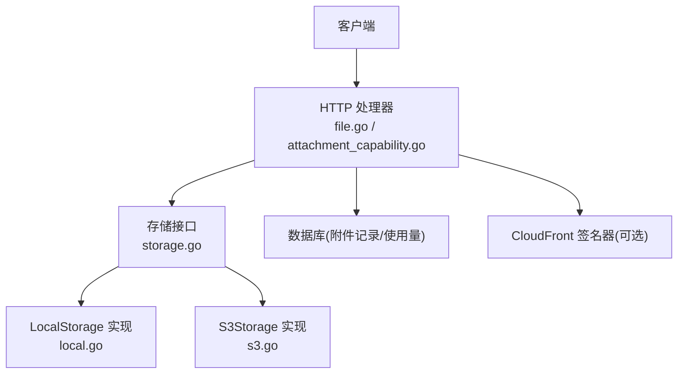
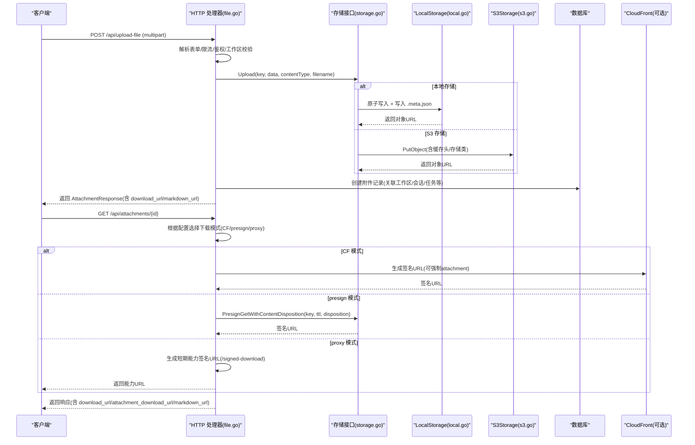
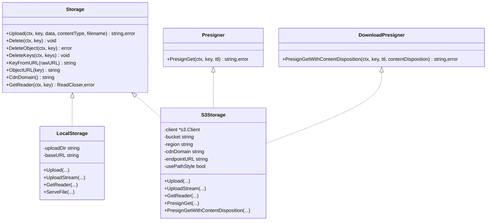
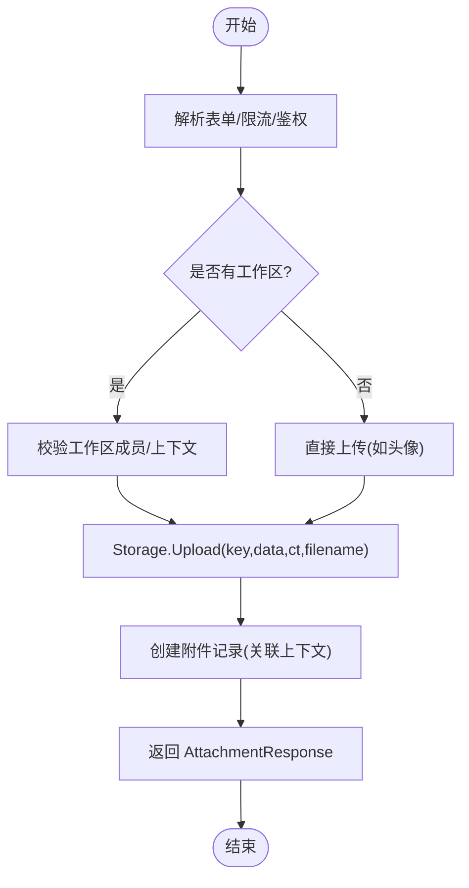
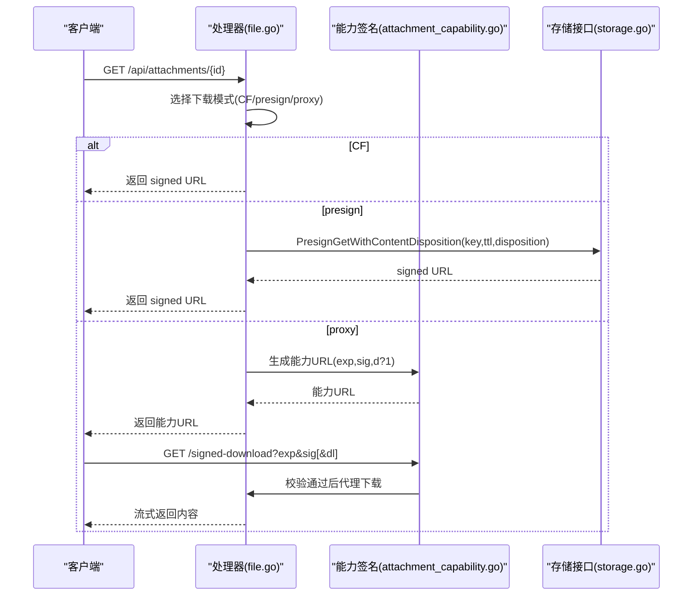
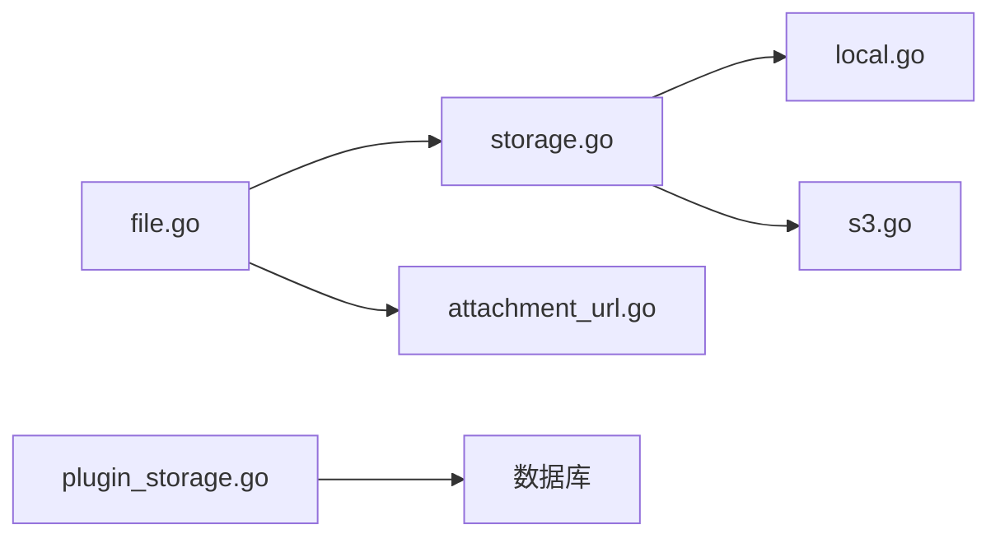

# 存储 API

<cite>
**本文引用的文件**
- [storage.go](file://server/internal/storage/storage.go)
- [local.go](file://server/internal/storage/local.go)
- [s3.go](file://server/internal/storage/s3.go)
- [file.go](file://server/internal/handler/file.go)
- [attachment_capability.go](file://server/internal/handler/attachment_capability.go)
- [attachment_url.go](file://server/internal/util/attachment_url.go)
- [plugin_storage.go](file://server/internal/service/plugin_storage.go)
</cite>

## 目录
1. [简介](#简介)
2. [项目结构](#项目结构)
3. [核心组件](#核心组件)
4. [架构总览](#架构总览)
5. [详细组件分析](#详细组件分析)
6. [依赖关系分析](#依赖关系分析)
7. [性能与并发优化](#性能与并发优化)
8. [故障排查指南](#故障排查指南)
9. [结论](#结论)
10. [附录：API 参考与示例](#附录api-参考与示例)

## 简介
本文件为 Multica 后端“存储 API”的完整技术文档，覆盖文件上传、下载与管理能力，包括存储空间作用域隔离、配额管理、访问控制、文件类型验证、大小限制、安全扫描（由上层集成负责）、元数据管理、版本控制策略、共享链接机制，以及大文件分片上传、断点续传与并发优化的实践建议。文档同时提供端到端调用序列图、流程图和错误处理方案，帮助开发者快速理解并正确集成。

## 项目结构
存储子系统由三层组成：
- 存储抽象接口层：定义统一的 Storage/Presigner/DownloadPresigner 接口，屏蔽底层实现差异。
- 存储实现层：本地文件系统（LocalStorage）与对象存储（S3Storage），分别适配不同部署形态。
- 业务处理层：HTTP 处理器将上传/下载请求路由到存储实现，并结合权限、工作区、附件表记录与签名/代理等能力完成完整流程。

**图示来源**
- [storage.go:9-35](file://server/internal/storage/storage.go#L9-L35)
- [local.go:17-63](file://server/internal/storage/local.go#L17-L63)
- [s3.go:22-99](file://server/internal/storage/s3.go#L22-L99)
- [file.go:377-614](file://server/internal/handler/file.go#L377-L614)
- [attachment_capability.go:183-237](file://server/internal/handler/attachment_capability.go#L183-L237)

**章节来源**
- [storage.go:9-35](file://server/internal/storage/storage.go#L9-L35)
- [local.go:17-63](file://server/internal/storage/local.go#L17-L63)
- [s3.go:22-99](file://server/internal/storage/s3.go#L22-L99)
- [file.go:377-614](file://server/internal/handler/file.go#L377-L614)
- [attachment_capability.go:183-237](file://server/internal/handler/attachment_capability.go#L183-L237)

## 核心组件
- 存储接口 Storage：统一 Upload/Delete/GetReader/ObjectURL/KeyFromURL/CdnDomain 等方法，供上层以一致方式读写对象。
- 预签名接口 Presigner/DownloadPresigner：用于生成带过期时间的下载链接，支持设置 Content-Disposition。
- 本地存储 LocalStorage：基于磁盘原子写入、侧边元数据文件（保存原始文件名与内容类型）、路径穿越防护、流式读取。
- S3 存储 S3Storage：支持 AWS S3 及兼容端点（MinIO/R2/B2/Wasabi 等），虚拟主机/路径样式 URL，CDN 域名优先，缓存头与存储类选择，流式上传无签名负载优化。
- 附件处理器：UploadFile、ListAttachments、GetAttachmentByID、下载能力签名与代理、Markdown 持久化 URL 策略。
- 插件 KV 存储与作用域：workspace/user 两种作用域，键/值/计数/总量配额校验与写前检查。

**章节来源**
- [storage.go:9-35](file://server/internal/storage/storage.go#L9-L35)
- [local.go:17-63](file://server/internal/storage/local.go#L17-L63)
- [s3.go:22-99](file://server/internal/storage/s3.go#L22-L99)
- [file.go:377-614](file://server/internal/handler/file.go#L377-L614)
- [plugin_storage.go:12-30](file://server/internal/service/plugin_storage.go#L12-L30)

## 架构总览
下图展示一次典型上传与下载的端到端流程，涵盖权限校验、存储写入、附件记录、下载模式选择与签名/代理。

**图示来源**
- [file.go:377-614](file://server/internal/handler/file.go#L377-L614)
- [file.go:649-726](file://server/internal/handler/file.go#L649-L726)
- [attachment_capability.go:183-237](file://server/internal/handler/attachment_capability.go#L183-L237)
- [s3.go:273-298](file://server/internal/storage/s3.go#L273-L298)
- [local.go:154-194](file://server/internal/storage/local.go#L154-L194)

## 详细组件分析

### 存储接口与实现
- Storage 接口定义了上传、删除、读取、URL 构造与 CDN 域名查询能力；Delete 与 DeleteObject 的区别在于是否暴露错误以便重试。
- LocalStorage 通过原子写入避免并发损坏，使用 .meta.json 保留原始文件名与内容类型，读取时严格限制路径在上传目录内，拒绝内部临时文件。
- S3Storage 支持多种 URL 风格与 CDN 域名优先策略，流式上传针对不可 seek 流禁用 payload 签名计算以提升兼容性，非 AWS 端点关闭 aws-chunked 校验以降低兼容问题。

**图示来源**
- [storage.go:9-35](file://server/internal/storage/storage.go#L9-L35)
- [local.go:17-63](file://server/internal/storage/local.go#L17-L63)
- [s3.go:22-99](file://server/internal/storage/s3.go#L22-L99)

**章节来源**
- [storage.go:9-35](file://server/internal/storage/storage.go#L9-L35)
- [local.go:91-111](file://server/internal/storage/local.go#L91-L111)
- [s3.go:254-298](file://server/internal/storage/s3.go#L254-L298)

### 上传流程与权限控制
- 入口：POST /api/upload-file，限制最大上传大小，解析 multipart，嗅探内容类型并按扩展名修正。
- 作用域隔离：若存在 workspace_id，则 key 形如 workspaces/{workspace_id}/{filename}；否则 users/{user_id}/{filename}。
- 权限校验：工作区成员校验、issue/comment/chat_session/task 上下文绑定校验（task_id 仅允许来自 agent task token）。
- 存储写入：调用 Storage.Upload 写入对象，返回对象 URL；随后创建附件记录，必要时广播事件。
- 响应：返回 AttachmentResponse，包含 id、url、download_url、markdown_url、content_type、size_bytes、created_at 等。

**图示来源**
- [file.go:377-614](file://server/internal/handler/file.go#L377-L614)

**章节来源**
- [file.go:377-614](file://server/internal/handler/file.go#L377-L614)

### 下载流程与共享链接
- 获取详情：GET /api/attachments/{id}，根据配置选择下载模式：
  - CloudFront 模式：使用 CloudFront 签名器生成带/不带 attachment 的签名 URL。
  - Presign 模式：调用 DownloadPresigner.PresignGetWithContentDisposition 生成签名 URL。
  - Proxy 模式：返回短期能力签名 URL（/signed-download），服务端代理下载。
- 能力签名：/api/attachments/{id}/signed-download 公开路由，校验 HMAC 签名与过期时间后代理下载，支持 dl=1 强制 attachment。
- Markdown 持久化 URL：buildMarkdownURL 仅在存储 URL 可被无认证直读时持久化 a.Url，否则使用稳定的 /api/attachments/{id}/download 或 PUBLIC_URL 前缀。

**图示来源**
- [file.go:649-726](file://server/internal/handler/file.go#L649-L726)
- [attachment_capability.go:183-237](file://server/internal/handler/attachment_capability.go#L183-L237)
- [s3.go:273-298](file://server/internal/storage/s3.go#L273-L298)

**章节来源**
- [file.go:649-726](file://server/internal/handler/file.go#L649-L726)
- [attachment_capability.go:183-237](file://server/internal/handler/attachment_capability.go#L183-L237)

### 元数据管理与内容类型
- 本地存储侧边元数据：.meta.json 保存原始文件名与内容类型，ServeFile 据此设置 Content-Disposition，保证下载文件名友好。
- 内容类型嗅探：上传时对文件前 512 字节嗅探，并根据扩展名覆盖常见误判（SVG/CSS/JS/JSON/WASM）。
- 插件 KV 存储：键/值/计数/总量配额，写前校验，作用域为 workspace/user，键长度、值长度、键数、总量均有上限。

**章节来源**
- [local.go:22-37](file://server/internal/storage/local.go#L22-L37)
- [local.go:266-302](file://server/internal/storage/local.go#L266-L302)
- [file.go:25-36](file://server/internal/handler/file.go#L25-L36)
- [plugin_storage.go:12-30](file://server/internal/service/plugin_storage.go#L12-L30)
- [plugin_storage.go:104-125](file://server/internal/service/plugin_storage.go#L104-L125)

### 版本控制与共享链接策略
- 版本控制：当前实现未提供显式版本字段；同一 key 覆盖写入。可通过外部命名策略（如追加版本号后缀）实现逻辑版本。
- 共享链接：
  - CloudFront 模式：使用签名 URL，支持 inline 与 attachment 两种意图。
  - Presign 模式：S3 预签名 URL，支持设置 Content-Disposition。
  - Proxy 模式：短期能力签名 URL，服务端代理下载，避免泄露签名到 Referer。
- Markdown 持久化 URL：优先使用可直读的绝对 URL，否则使用稳定 API 路径或 PUBLIC_URL 前缀，确保跨客户端可用。

**章节来源**
- [file.go:201-246](file://server/internal/handler/file.go#L201-L246)
- [file.go:649-726](file://server/internal/handler/file.go#L649-L726)
- [attachment_capability.go:183-237](file://server/internal/handler/attachment_capability.go#L183-L237)

### 作用域隔离与配额管理
- 文件存储作用域：workspaces/{workspace_id} 与 users/{user_id}，通过 key 前缀隔离。
- 插件 KV 存储作用域：workspace/user，ResolveStorageScope 映射 scopeType 到 scopeID。
- 配额：键长度、值长度、键数量、总量限制，写前 EnforceStorageQuota，超限返回明确错误。

**章节来源**
- [file.go:438-442](file://server/internal/handler/file.go#L438-L442)
- [plugin_storage.go:12-30](file://server/internal/service/plugin_storage.go#L12-L30)
- [plugin_storage.go:104-125](file://server/internal/service/plugin_storage.go#L104-L125)

### 安全与访问控制
- 上传鉴权：要求用户身份与工作区成员资格；task_id 上传仅限 agent task token，且需匹配 X-Task-ID。
- 下载鉴权：
  - CF/presign：通过签名 URL 授权。
  - proxy：通过短期能力签名 URL 授权，校验 exp/sig/dl 意图。
- 路径安全：LocalStorage 读取拒绝路径穿越与内部临时文件；S3 KeyFromURL 从多种 URL 格式提取 key。

**章节来源**
- [file.go:444-555](file://server/internal/handler/file.go#L444-L555)
- [attachment_capability.go:155-181](file://server/internal/handler/attachment_capability.go#L155-L181)
- [local.go:91-111](file://server/internal/storage/local.go#L91-L111)
- [s3.go:207-252](file://server/internal/storage/s3.go#L207-L252)

## 依赖关系分析
- 处理器依赖存储接口，不关心具体实现；存储实现依赖各自 SDK/文件系统。
- 插件存储服务依赖数据库查询，执行配额校验与 CRUD。
- 工具函数提供下载路径构造与解析。

**图示来源**
- [file.go:377-614](file://server/internal/handler/file.go#L377-L614)
- [storage.go:9-35](file://server/internal/storage/storage.go#L9-L35)
- [local.go:17-63](file://server/internal/storage/local.go#L17-L63)
- [s3.go:22-99](file://server/internal/storage/s3.go#L22-L99)
- [attachment_url.go:8-18](file://server/internal/util/attachment_url.go#L8-L18)
- [plugin_storage.go:62-176](file://server/internal/service/plugin_storage.go#L62-L176)

**章节来源**
- [file.go:377-614](file://server/internal/handler/file.go#L377-L614)
- [storage.go:9-35](file://server/internal/storage/storage.go#L9-L35)
- [plugin_storage.go:62-176](file://server/internal/service/plugin_storage.go#L62-L176)

## 性能与并发优化
- 原子写入：LocalStorage 通过临时文件+rename 原子落盘，避免并发写入破坏已有对象。
- 流式上传：S3Storage.UploadStream 对不可 seek 流禁用 payload 签名计算，减少重算开销；合理设置 ContentLength。
- 缓存头：S3 上传设置 Cache-Control 提升 CDN/浏览器缓存命中。
- 并发限制：上传请求体限制 maxUploadSize，防止内存膨胀；预览文本限制 maxPreviewTextSize。
- 分片与断点续传：当前代码未内置分片/断点续传；建议按如下策略实现：
  - 前端分片：将大文件切分为固定大小块，逐块上传至独立 key（如 {key}/part_{n}），完成后合并。
  - 断点续传：记录已上传块索引，失败重试仅重传缺失块；合并成功后清理临时块。
  - 并发优化：限制并发度（如 4-8），结合队列与退避重试；利用 CDN 缓存静态资源。
  - 一致性：合并操作应幂等，失败回滚；服务端校验完整性（如哈希）。
- 注意：上述分片/断点续传为通用建议，仓库中未提供现成分片 API 实现。

**章节来源**
- [local.go:196-229](file://server/internal/storage/local.go#L196-L229)
- [s3.go:350-376](file://server/internal/storage/s3.go#L350-L376)
- [file.go:36-53](file://server/internal/handler/file.go#L36-L53)

## 故障排查指南
- 上传失败：
  - 检查 Storage 是否配置（nil 时返回服务不可用）。
  - 检查表单字段与大小限制；确认内容类型嗅探结果是否符合预期。
  - 工作区/任务上下文校验失败会返回禁止或参数错误。
- 下载失败：
  - CF/presign：确认签名有效且未过期；proxy 模式确认能力签名 exp/sig/dl 正确。
  - 路径穿越/内部文件：LocalStorage 会拒绝非法 key；检查 KeyFromURL 解析是否正确。
- 插件 KV 存储：
  - 配额超限：键/值/计数/总量任一超限返回配额错误；检查 usage 查询与写入逻辑。
  - 作用域错误：scopeType 必须为 workspace/user；scopeID 需正确映射。

**章节来源**
- [file.go:377-614](file://server/internal/handler/file.go#L377-L614)
- [file.go:649-726](file://server/internal/handler/file.go#L649-L726)
- [attachment_capability.go:155-181](file://server/internal/handler/attachment_capability.go#L155-L181)
- [local.go:91-111](file://server/internal/storage/local.go#L91-L111)
- [plugin_storage.go:104-125](file://server/internal/service/plugin_storage.go#L104-L125)

## 结论
本存储 API 通过统一接口抽象了本地与对象存储的差异，提供了完善的上传、下载、元数据管理与访问控制能力。下载模式灵活适配 CDN、预签名与代理三种场景，保障在不同部署下的可用性与安全性。插件 KV 存储提供细粒度作用域与配额控制。对于大文件场景，建议在前端实现分片与断点续传，并在服务端进行幂等合并与完整性校验。整体设计兼顾性能、安全与可扩展性。

## 附录：API 参考与示例

### 上传
- 方法：POST /api/upload-file
- 请求：multipart/form-data，字段 file；可选 issue_id/comment_id/chat_session_id/task_id
- 响应：AttachmentResponse（id/url/download_url/markdown_url/content_type/size_bytes/created_at）
- 要点：
  - 自动嗅探内容类型并按扩展名修正。
  - 工作区/任务上下文校验严格，task_id 仅接受 agent task token。
  - 存储 key 按 workspaces/{workspace_id} 或 users/{user_id} 隔离。

**章节来源**
- [file.go:377-614](file://server/internal/handler/file.go#L377-L614)

### 列表与详情
- 列表：GET /api/issues/{id}/attachments
- 详情：GET /api/attachments/{id}
- 响应：AttachmentResponse；download_url 根据模式可能为签名 URL 或稳定路径；markdown_url 为可持久化的绝对或稳定路径。

**章节来源**
- [file.go:616-643](file://server/internal/handler/file.go#L616-L643)
- [file.go:649-726](file://server/internal/handler/file.go#L649-L726)

### 下载与共享链接
- 稳定下载路径：/api/attachments/{id}/download（服务端校验成员后代理或重定向）
- 能力签名下载：/api/attachments/{id}/signed-download?exp=&sig[&dl=1]（公开路由，短期有效）
- 模式选择：
  - CloudFront：SignedURL/SignedURLWithContentDisposition
  - Presign：PresignGetWithContentDisposition
  - Proxy：能力签名 + 代理

**章节来源**
- [attachment_capability.go:183-237](file://server/internal/handler/attachment_capability.go#L183-L237)
- [s3.go:273-298](file://server/internal/storage/s3.go#L273-L298)

### 插件 KV 存储
- 作用域：workspace/user
- 配额：键≤1024B，值≤100KB，键数≤1000，总量≤5MB
- 操作：Get/Set/List/Delete，写前 EnforceStorageQuota

**章节来源**
- [plugin_storage.go:12-30](file://server/internal/service/plugin_storage.go#L12-L30)
- [plugin_storage.go:62-176](file://server/internal/service/plugin_storage.go#L62-L176)

### 错误处理速查
- 上传：ServiceUnavailable（未配置存储）、BadRequest（表单/大小/读取失败）、Forbidden（权限/上下文校验失败）、InternalServerError（存储/DB 错误）
- 下载：NotFound（不存在或无权限）、Forbidden（能力签名无效/过期）、ServiceUnavailable（存储未配置）
- 插件 KV：Invalid/Quota/NotFound/Unavailable

**章节来源**
- [file.go:377-614](file://server/internal/handler/file.go#L377-L614)
- [file.go:649-726](file://server/internal/handler/file.go#L649-L726)
- [attachment_capability.go:155-181](file://server/internal/handler/attachment_capability.go#L155-L181)
- [plugin_storage.go:104-176](file://server/internal/service/plugin_storage.go#L104-L176)