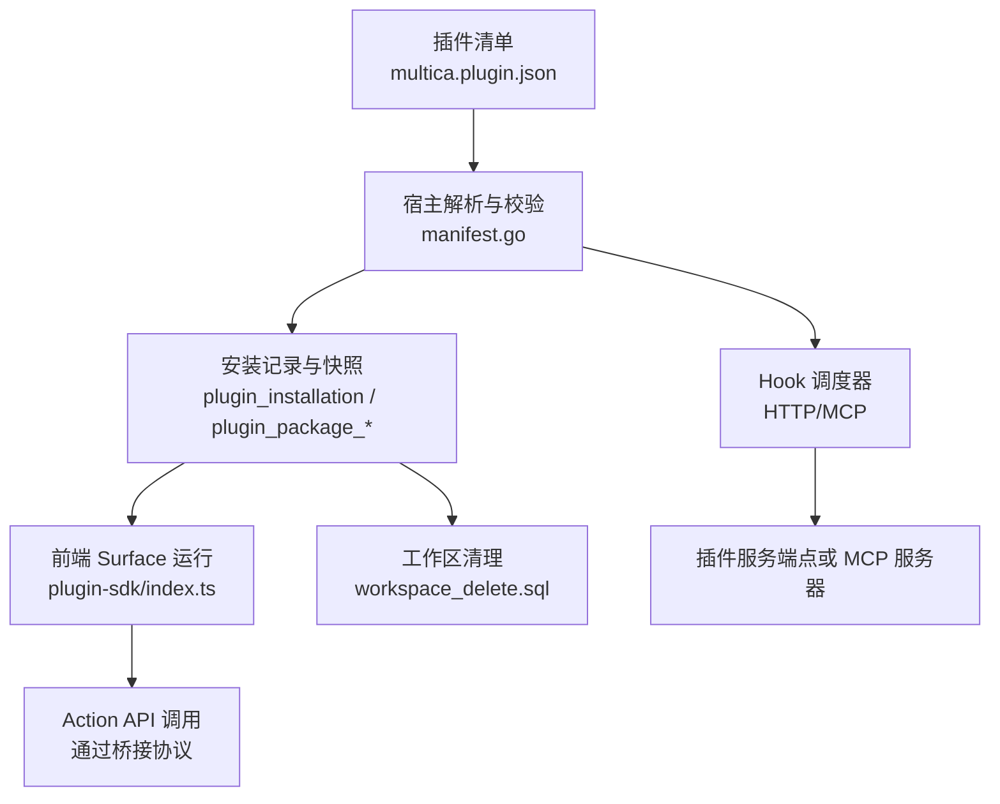
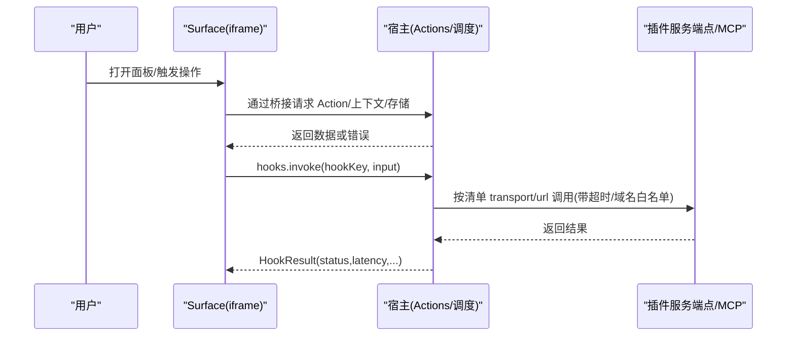
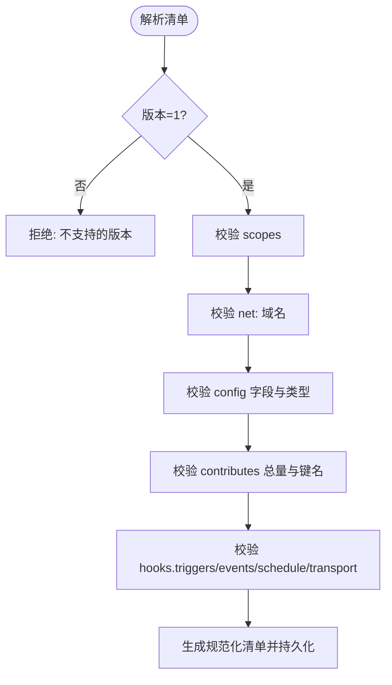
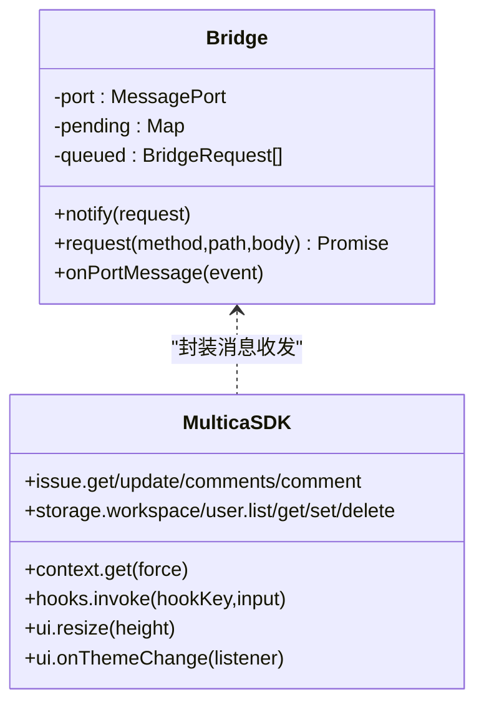
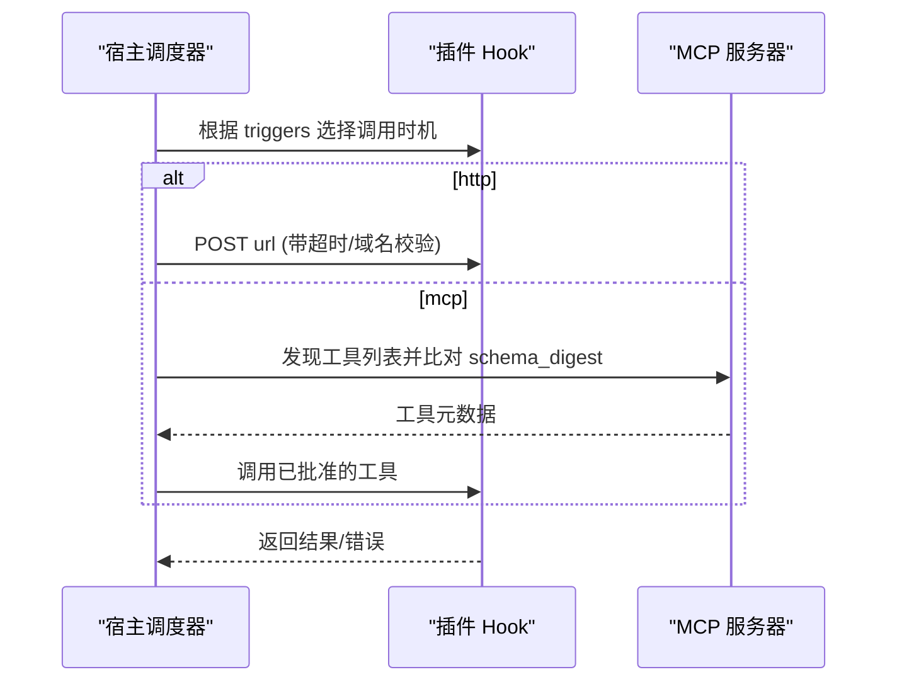
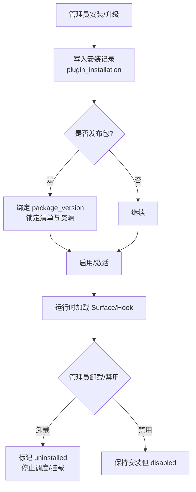
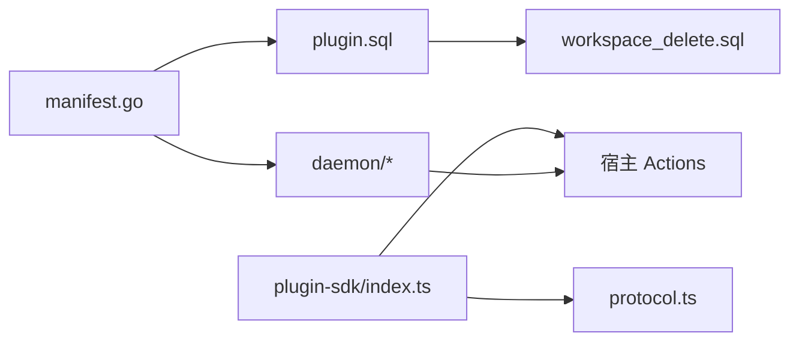

# 插件 API

<cite>
**本文引用的文件**
- [manifest.go](file://server/pkg/plugincontract/manifest.go)
- [index.ts](file://packages/plugin-sdk/index.ts)
- [protocol.ts](file://packages/plugin-sdk/protocol.ts)
- [multica.plugin.json（hello-panel）](file://examples/plugins/hello-panel/multica.plugin.json)
- [multica.plugin.json（deploy-sentinel）](file://examples/plugins/deploy-sentinel/multica.plugin.json)
- [285_plugin_lifecycle_v1.up.sql](file://server/migrations/285_plugin_lifecycle_v1.up.sql)
- [344_plugin_v2_reset.up.sql](file://server/migrations/344_plugin_v2_reset.up.sql)
- [392_plugin_package_publishing.up.sql](file://server/migrations/392_plugin_package_publishing.up.sql)
- [369_plugin_mcp_approvals.up.sql](file://server/migrations/369_plugin_mcp_approvals.up.sql)
- [plugin.sql](file://server/pkg/db/queries/plugin.sql)
- [workspace_delete.sql](file://server/pkg/db/queries/workspace_delete.sql)
- [execenv.go](file://server/internal/daemon/execenv/execenv.go)
- [plugin_hook_mcp.go](file://server/internal/daemon/plugin_hook_mcp.go)
- [remote_mcp_broker.go](file://server/internal/daemon/remote_mcp_broker.go)
</cite>

## 目录
1. [简介](#简介)
2. [项目结构](#项目结构)
3. [核心组件](#核心组件)
4. [架构总览](#架构总览)
5. [详细组件分析](#详细组件分析)
6. [依赖关系分析](#依赖关系分析)
7. [性能与资源限制](#性能与资源限制)
8. [故障排查指南](#故障排查指南)
9. [结论](#结论)
10. [附录：示例与最佳实践](#附录示例与最佳实践)

## 简介
本文件面向插件作者与平台管理员，系统性说明 Multica 插件的 API、安装配置、生命周期管理、沙箱与权限隔离、插件间通信与事件机制、部署更新卸载流程、安全模型与审计要点，以及开发调试建议。Multica 插件由三部分构成：
- 声明式清单 manifest：描述插件能力、权限、配置项、UI 面板、钩子与资源。
- 前端 Surface：在宿主提供的 iframe 中运行的脚本，通过桥接协议调用宿主能力。
- 后端 Hook：由宿主以 HTTP 或 MCP 方式调用的插件侧能力；事件与定时任务也通过此通道触发。

## 项目结构
- 插件契约与校验：server/pkg/plugincontract/manifest.go
- 插件 SDK（Surface 端）：packages/plugin-sdk/index.ts、protocol.ts
- 示例插件：examples/plugins/*（含清单与 UI/Hook 示例）
- 数据库迁移与存储：server/migrations/*.sql、server/pkg/db/queries/plugin.sql、workspace_delete.sql
- 守护进程与执行环境：server/internal/daemon/*（含 execenv、MCP 桥接等）

图表来源
- [manifest.go:176-243](file://server/pkg/plugincontract/manifest.go#L176-L243)
- [plugin.sql:74-111](file://server/pkg/db/queries/plugin.sql#L74-L111)
- [index.ts:150-258](file://packages/plugin-sdk/index.ts#L150-L258)
- [workspace_delete.sql:629-647](file://server/pkg/db/queries/workspace_delete.sql#L629-L647)

章节来源
- [manifest.go:176-243](file://server/pkg/plugincontract/manifest.go#L176-L243)
- [index.ts:1-282](file://packages/plugin-sdk/index.ts#L1-L282)
- [protocol.ts:1-76](file://packages/plugin-sdk/protocol.ts#L1-L76)
- [285_plugin_lifecycle_v1.up.sql:73-103](file://server/migrations/285_plugin_lifecycle_v1.up.sql#L73-L103)
- [392_plugin_package_publishing.up.sql:1-30](file://server/migrations/392_plugin_package_publishing.up.sql#L1-L30)

## 核心组件
- 插件清单 Manifest：定义 key、name、version、scopes、config、contributes（surfaces、hooks、resources），并严格校验字段、范围、传输地址与调度频率。
- 插件 SDK（Surface）：提供 multica.context、multica.issue、multica.storage、multica.hooks.invoke、multica.ui 等能力，所有调用经 MessagePort 桥接到宿主，不直接持有凭据。
- 钩子 Hook：支持 ui/manual/agent/event/schedule 触发；transport 支持 http 与 mcp；event 订阅需具备对应读取权限；schedule 有最小间隔限制。
- 资源 Resource：如 skill 文本，不参与调用，仅作为静态贡献。
- 安装与包：每个工作区可发布/安装插件包；安装记录保存已同意的清单快照、版本、授予范围与配置；升级时保留配置，按新清单裁剪。

章节来源
- [manifest.go:28-117](file://server/pkg/plugincontract/manifest.go#L28-L117)
- [manifest.go:176-243](file://server/pkg/plugincontract/manifest.go#L176-L243)
- [manifest.go:400-781](file://server/pkg/plugincontract/manifest.go#L400-L781)
- [index.ts:26-282](file://packages/plugin-sdk/index.ts#L26-L282)
- [plugin.sql:74-111](file://server/pkg/db/queries/plugin.sql#L74-L111)
- [392_plugin_package_publishing.up.sql:1-30](file://server/migrations/392_plugin_package_publishing.up.sql#L1-L30)

## 架构总览
插件系统围绕“清单即契约”的原则构建：宿主负责解析、校验、授权与调度；插件侧仅提供声明的能力与实现。Surface 在受控 iframe 中运行，通过桥接协议访问宿主能力；Hook 由宿主以受控网络策略与超时限制调用插件服务端点或 MCP 服务器。

图表来源
- [index.ts:150-258](file://packages/plugin-sdk/index.ts#L150-L258)
- [manifest.go:753-781](file://server/pkg/plugincontract/manifest.go#L753-L781)
- [plugin_hook_mcp.go](file://server/internal/daemon/plugin_hook_mcp.go)
- [remote_mcp_broker.go](file://server/internal/daemon/remote_mcp_broker.go)

## 详细组件分析

### 插件清单与权限模型
- 清单字段与约束：key 使用反向域名格式；version 为语义化版本；description/name 长度受限；icon 与 entry 路径受限；contributes 总量上限；未知字段拒绝解析。
- 权限 scopes：固定作用域列表 + net:<domain> 参数化网络范围；事件订阅会映射到所需读取 scope，安装时强制一致。
- 配置 config：host 渲染表单，类型限定 string/number/bool/enum/secret；secret 写后即焚，读接口不回显。
- 传输与调度：transport.url 必须 HTTPS；host 必须被 net: 覆盖；schedule.cron 必须合法且不低于最小间隔；timezone 独立字段。

图表来源
- [manifest.go:400-781](file://server/pkg/plugincontract/manifest.go#L400-L781)

章节来源
- [manifest.go:28-117](file://server/pkg/plugincontract/manifest.go#L28-L117)
- [manifest.go:400-781](file://server/pkg/plugincontract/manifest.go#L400-L781)

### 插件 SDK（Surface）与桥接协议
- 运行环境：Surface 在 sandboxed iframe 中运行，无同源信任，无凭据；通过全局 MessagePort 与宿主建立私有通道。
- 能力暴露：context.get、issue.*、storage.user/workspace.*、hooks.invoke、ui.resize/onThemeChange。
- 错误模型：MulticaPluginError 携带 HTTP 风格 status；缺失键返回 null 而非异常。
- 主题与样式：宿主推送设计令牌，Surface 可订阅变化并应用到 DOM。

图表来源
- [index.ts:90-168](file://packages/plugin-sdk/index.ts#L90-L168)
- [index.ts:172-282](file://packages/plugin-sdk/index.ts#L172-L282)
- [protocol.ts:20-76](file://packages/plugin-sdk/protocol.ts#L20-L76)

章节来源
- [index.ts:1-282](file://packages/plugin-sdk/index.ts#L1-L282)
- [protocol.ts:1-76](file://packages/plugin-sdk/protocol.ts#L1-L76)

### 钩子与事件机制
- 触发器：
  - ui：由 Surface 主动调用 hooks.invoke。
  - manual：管理员手动触发。
  - agent：智能体任务中调用。
  - event：产品事件驱动，需声明 events 并具备相应读取 scope。
  - schedule：基于 cron 的定时任务，最低间隔 5 分钟，仅支持 http。
- 传输：
  - http：HTTPS URL，host 必须在 net: 白名单内，支持 timeout_ms。
  - mcp：接入插件自托管的 MCP 服务器；工具列表变更需管理员审批（mcp_approvals）。
- 事件订阅：事件与读取 scope 一一对应，安装时强制校验，避免“通过事件绕过读取权限”。

图表来源
- [manifest.go:69-77](file://server/pkg/plugincontract/manifest.go#L69-L77)
- [manifest.go:210-235](file://server/pkg/plugincontract/manifest.go#L210-L235)
- [manifest.go:639-683](file://server/pkg/plugincontract/manifest.go#L639-L683)
- [369_plugin_mcp_approvals.up.sql:1-25](file://server/migrations/369_plugin_mcp_approvals.up.sql#L1-L25)
- [plugin_hook_mcp.go](file://server/internal/daemon/plugin_hook_mcp.go)
- [remote_mcp_broker.go](file://server/internal/daemon/remote_mcp_broker.go)

章节来源
- [manifest.go:49-77](file://server/pkg/plugincontract/manifest.go#L49-L77)
- [manifest.go:210-235](file://server/pkg/plugincontract/manifest.go#L210-L235)
- [manifest.go:639-683](file://server/pkg/plugincontract/manifest.go#L639-L683)
- [369_plugin_mcp_approvals.up.sql:1-25](file://server/migrations/369_plugin_mcp_approvals.up.sql#L1-L25)

### 插件安装、更新与卸载
- 安装：创建安装记录，保存已同意清单快照、版本、授予范围与配置；若包含包发布，则绑定到具体 package_version。
- 更新：重新指向新的 published version，采用新清单快照；配置值保留，新清单删除的字段会被裁剪。
- 卸载：进入 uninstalled 状态，停止调度与挂载；工作区删除时级联清理包与安装记录。

图表来源
- [plugin.sql:92-111](file://server/pkg/db/queries/plugin.sql#L92-L111)
- [285_plugin_lifecycle_v1.up.sql:73-103](file://server/migrations/285_plugin_lifecycle_v1.up.sql#L73-L103)
- [392_plugin_package_publishing.up.sql:1-30](file://server/migrations/392_plugin_package_publishing.up.sql#L1-L30)
- [workspace_delete.sql:629-647](file://server/pkg/db/queries/workspace_delete.sql#L629-L647)

章节来源
- [plugin.sql:74-111](file://server/pkg/db/queries/plugin.sql#L74-L111)
- [285_plugin_lifecycle_v1.up.sql:73-103](file://server/migrations/285_plugin_lifecycle_v1.up.sql#L73-L103)
- [392_plugin_package_publishing.up.sql:1-30](file://server/migrations/392_plugin_package_publishing.up.sql#L1-L30)
- [workspace_delete.sql:629-647](file://server/pkg/db/queries/workspace_delete.sql#L629-L647)

### 沙箱环境、权限隔离与资源限制
- 前端沙箱：Surface 运行在无 same-origin 的 iframe，无法直接访问宿主 API；所有调用经桥接并由宿主以当前用户会话执行。
- 网络隔离：hook.transport.url 必须 HTTPS 且 host 必须匹配 net: 范围；iframe CSP connect-src 同样基于 net: 控制。
- 存储配额：storage.user/workspace 提供 list/get/set/delete；服务层按安装+scope 维度统计字节数与键数，用于配额与审计。
- 调度限制：schedule 最小间隔 5 分钟，防止高频出站；hook 支持 timeout_ms 限制响应时间。
- 执行环境：守护进程装配智能体上下文与技能水合，插件相关资源（如 skill）通过资源清单注入。

章节来源
- [protocol.ts:1-76](file://packages/plugin-sdk/protocol.ts#L1-L76)
- [manifest.go:753-781](file://server/pkg/plugincontract/manifest.go#L753-L781)
- [plugin.sql:228-243](file://server/pkg/db/queries/plugin.sql#L228-L243)
- [manifest.go:60-67](file://server/pkg/plugincontract/manifest.go#L60-L67)
- [execenv.go](file://server/internal/daemon/execenv/execenv.go)

### 插件间通信、事件订阅与消息传递
- 插件间通信：通过宿主统一调度进行解耦；Surface 通过 hooks.invoke 调用自身 hook，再由宿主转发至插件服务端点或 MCP。
- 事件订阅：event 触发器允许插件订阅 issue/comment/task 等事件；事件内容需要对应的读取 scope，安装时强制校验。
- 消息传递：Surface 与宿主通过 MessagePort 双向通信；主题变化由宿主主动推送；Action 调用走 request/response 模式。

章节来源
- [index.ts:150-258](file://packages/plugin-sdk/index.ts#L150-L258)
- [manifest.go:108-166](file://server/pkg/plugincontract/manifest.go#L108-L166)
- [manifest.go:639-664](file://server/pkg/plugincontract/manifest.go#L639-L664)
- [protocol.ts:20-76](file://packages/plugin-sdk/protocol.ts#L20-L76)

### 安全模型、代码签名与审计日志
- 清单即契约：ParseManifest 拒绝未知字段，确保管理员批准的清单不被静默篡改。
- 网络白名单：net: 范围同时约束 iframe CSP 与 hook 出站目标，禁止后缀匹配，精确到主机。
- 事件权限映射：事件订阅等价于读取权限，安装时强制要求，避免越权。
- MCP 工具审批：mcp 传输的工具列表变更需管理员审批（mcp_approvals），防止动态能力漂移。
- 不可变发布：plugin_release 不可变，撤销是唯一变更路径；安装记录保存已同意快照。
- 审计线索：安装/更新/禁用/卸载均有时间与操作者字段；包文件与版本信息可追溯。

章节来源
- [manifest.go:356-387](file://server/pkg/plugincontract/manifest.go#L356-L387)
- [manifest.go:753-781](file://server/pkg/plugincontract/manifest.go#L753-L781)
- [manifest.go:639-664](file://server/pkg/plugincontract/manifest.go#L639-L664)
- [369_plugin_mcp_approvals.up.sql:1-25](file://server/migrations/369_plugin_mcp_approvals.up.sql#L1-L25)
- [285_plugin_lifecycle_v1.up.sql:130-164](file://server/migrations/285_plugin_lifecycle_v1.up.sql#L130-L164)
- [285_plugin_lifecycle_v1.up.sql:73-103](file://server/migrations/285_plugin_lifecycle_v1.up.sql#L73-L103)

## 依赖关系分析
- 契约层：manifest.go 定义并校验清单，是所有安装与调度的权威依据。
- 前端层：plugin-sdk/index.ts 暴露稳定 API，protocol.ts 定义桥接协议。
- 存储层：plugin.sql 提供安装、包、存储、密钥等查询与写入；workspace_delete.sql 处理工作区清理。
- 运行时层：daemon 内部模块负责 Hook 调度、MCP 桥接与执行环境装配。

图表来源
- [manifest.go:176-243](file://server/pkg/plugincontract/manifest.go#L176-L243)
- [plugin.sql:74-111](file://server/pkg/db/queries/plugin.sql#L74-L111)
- [index.ts:150-258](file://packages/plugin-sdk/index.ts#L150-L258)
- [protocol.ts:20-76](file://packages/plugin-sdk/protocol.ts#L20-L76)
- [workspace_delete.sql:629-647](file://server/pkg/db/queries/workspace_delete.sql#L629-L647)

章节来源
- [manifest.go:176-243](file://server/pkg/plugincontract/manifest.go#L176-L243)
- [plugin.sql:74-111](file://server/pkg/db/queries/plugin.sql#L74-L111)
- [index.ts:150-258](file://packages/plugin-sdk/index.ts#L150-L258)
- [protocol.ts:20-76](file://packages/plugin-sdk/protocol.ts#L20-L76)
- [workspace_delete.sql:629-647](file://server/pkg/db/queries/workspace_delete.sql#L629-L647)

## 性能与资源限制
- 清单大小与条目：清单最大 1MB；contributes 总量不超过 64；scopes 最多 64。
- 调度频率：schedule 最小间隔 5 分钟，避免高频出站与重复计算。
- 超时控制：hook.timeout_ms 范围 100-30000ms，防止长尾阻塞。
- 存储配额：按安装+scope 维度统计键数与字节数，便于配额与回收。
- 网络限制：仅允许 net: 白名单中的主机，HTTPS 强制，减少攻击面。

章节来源
- [manifest.go:35-40](file://server/pkg/plugincontract/manifest.go#L35-L40)
- [manifest.go:448-465](file://server/pkg/plugincontract/manifest.go#L448-L465)
- [manifest.go:547-554](file://server/pkg/plugincontract/manifest.go#L547-L554)
- [manifest.go:60-67](file://server/pkg/plugincontract/manifest.go#L60-L67)
- [manifest.go:681-683](file://server/pkg/plugincontract/manifest.go#L681-L683)
- [plugin.sql:228-243](file://server/pkg/db/queries/plugin.sql#L228-L243)

## 故障排查指南
- 清单解析失败：检查 manifest_version、key 格式、version 语义化版本、unknown fields 与长度限制。
- 网络调用被拒：确认 transport.url 为 HTTPS，且 host 在 net: 范围内；注意精确匹配，非后缀匹配。
- 事件未触发：确认已声明 event 触发器并具备对应读取 scope；检查事件是否在已知列表中。
- 定时任务不生效：校验 cron 表达式与时区；确认间隔不小于 5 分钟；仅支持 http 传输。
- MCP 工具未生效：检查 mcp_approvals 是否已批准该工具及其 schema_digest；工具列表变更后需重新审批。
- 存储读写异常：区分 404（键不存在）与业务错误；关注配额与字节计数。

章节来源
- [manifest.go:400-781](file://server/pkg/plugincontract/manifest.go#L400-L781)
- [manifest.go:639-683](file://server/pkg/plugincontract/manifest.go#L639-L683)
- [369_plugin_mcp_approvals.up.sql:1-25](file://server/migrations/369_plugin_mcp_approvals.up.sql#L1-L25)
- [index.ts:172-195](file://packages/plugin-sdk/index.ts#L172-L195)

## 结论
Multica 插件体系以“清单即契约”为核心，通过严格的解析与校验、细粒度的权限与作用域、安全的沙箱与网络白名单、可控的调度与超时、以及可审计的安装与发布流程，构建了可扩展且安全的插件生态。Surface 与宿主之间的桥接协议确保了零凭据泄露与最小权限原则；Hook 的 HTTP/MCP 双通道兼顾灵活性与安全性。遵循本文档的规范与最佳实践，可高效开发与运维高质量插件。

## 附录：示例与最佳实践
- 参考示例：
  - hello-panel：展示基础面板、读取问题、评论与用户存储。
  - deploy-sentinel：展示复杂配置、多触发器、事件订阅、HTTP 与 MCP 混合传输。
- 开发建议：
  - 清单尽量精简，只声明必要 scopes 与 contributes。
  - 使用 config 的 secret 类型管理敏感信息，避免明文。
  - 合理设置 timeout_ms 与 schedule 间隔，避免资源浪费。
  - 对事件订阅务必申请对应读取 scope，确保权限一致。
  - 使用 MCP 时维护工具列表稳定性，变更需管理员审批。
- 调试技巧：
  - 通过 Surface 的 onThemeChange 与 resize 验证桥接连通性。
  - 利用 HookResult 的 status/latency/error 定位超时与错误。
  - 在工作区清理前备份安装与包数据，避免误删。

章节来源
- [multica.plugin.json（hello-panel）:1-21](file://examples/plugins/hello-panel/multica.plugin.json#L1-L21)
- [multica.plugin.json（deploy-sentinel）:1-119](file://examples/plugins/deploy-sentinel/multica.plugin.json#L1-L119)
- [index.ts:143-168](file://packages/plugin-sdk/index.ts#L143-L168)
- [index.ts:238-258](file://packages/plugin-sdk/index.ts#L238-L258)
- [manifest.go:681-683](file://server/pkg/plugincontract/manifest.go#L681-L683)
- [369_plugin_mcp_approvals.up.sql:1-25](file://server/migrations/369_plugin_mcp_approvals.up.sql#L1-L25)