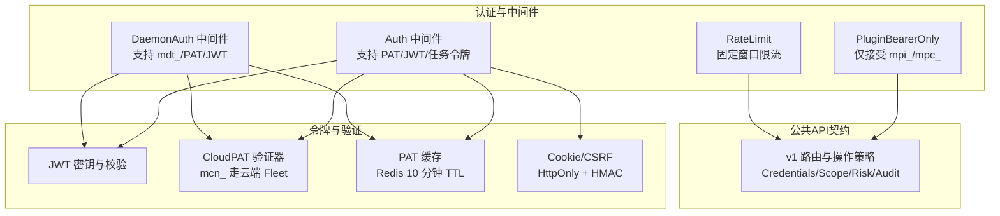
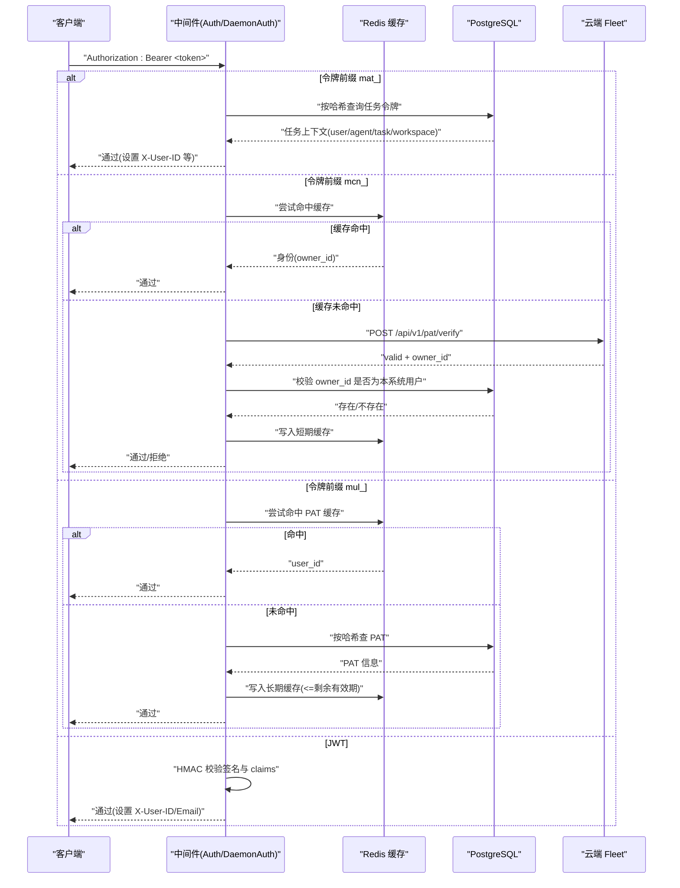
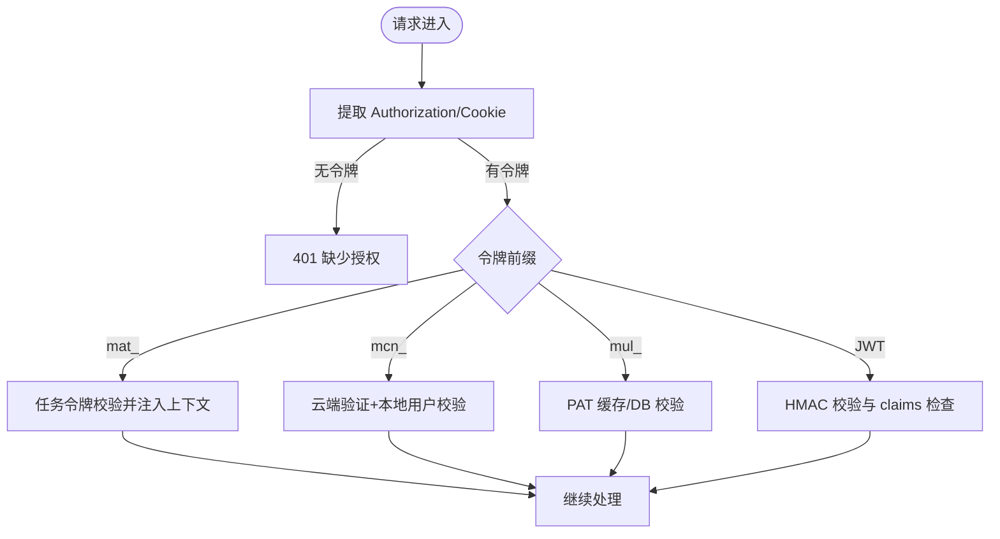
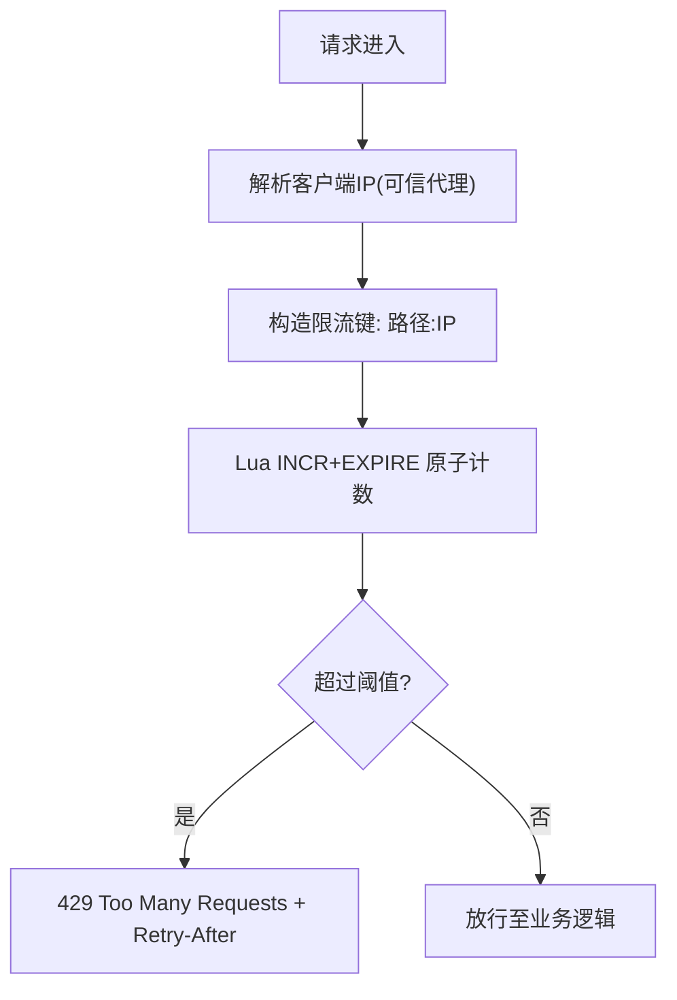
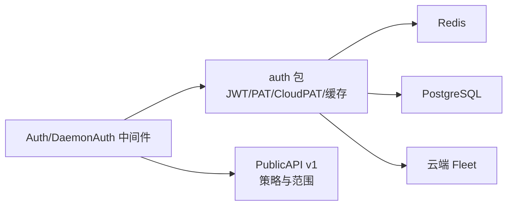

# 认证与授权

<cite>
**本文引用的文件**
- [jwt.go](file://server/internal/auth/jwt.go)
- [cloud_pat.go](file://server/internal/auth/cloud_pat.go)
- [cookie.go](file://server/internal/auth/cookie.go)
- [pat_cache.go](file://server/internal/auth/pat_cache.go)
- [auth.go](file://server/internal/middleware/auth.go)
- [daemon_auth.go](file://server/internal/middleware/daemon_auth.go)
- [plugin_auth.go](file://server/internal/middleware/plugin_auth.go)
- [ratelimit.go](file://server/internal/middleware/ratelimit.go)
- [owner_lookup.go](file://server/internal/middleware/owner_lookup.go)
- [routes.go](file://server/pkg/publicapi/v1/routes.go)
- [foundation.go](file://server/pkg/publicapi/v1/foundation.go)
</cite>

## 目录
1. [简介](#简介)
2. [项目结构](#项目结构)
3. [核心组件](#核心组件)
4. [架构总览](#架构总览)
5. [详细组件分析](#详细组件分析)
6. [依赖关系分析](#依赖关系分析)
7. [性能考虑](#性能考虑)
8. [故障排查指南](#故障排查指南)
9. [结论](#结论)
10. [附录](#附录)

## 简介
本文件面向 Multica 后端的认证与授权体系，覆盖以下主题：
- 支持的认证方式：OAuth（通过 JWT）、个人访问令牌（PAT）、插件安装令牌、插件调用令牌、守护进程令牌、任务级代理令牌。
- 每种方式的获取方法、令牌格式、生命周期管理策略。
- 权限模型、作用域（scope）机制与基于角色的访问控制要点。
- 认证中间件工作原理与安全最佳实践。
- 完整认证流程示例（含错误处理与重试）。
- 速率限制策略与防暴力破解措施。

## 项目结构
后端采用 Go + Chi 路由，认证能力集中在 internal/auth 与 internal/middleware 两个包中；公共 API v1 在 server/pkg/publicapi/v1 中定义统一契约与作用域策略。

图表来源
- [auth.go:34-267](file://server/internal/middleware/auth.go#L34-L267)
- [daemon_auth.go:62-271](file://server/internal/middleware/daemon_auth.go#L62-L271)
- [plugin_auth.go:10-47](file://server/internal/middleware/plugin_auth.go#L10-L47)
- [ratelimit.go:15-135](file://server/internal/middleware/ratelimit.go#L15-L135)
- [jwt.go:21-96](file://server/internal/auth/jwt.go#L21-L96)
- [cloud_pat.go:18-441](file://server/internal/auth/cloud_pat.go#L18-L441)
- [pat_cache.go:12-109](file://server/internal/auth/pat_cache.go#L12-L109)
- [cookie.go:20-256](file://server/internal/auth/cookie.go#L20-L256)
- [routes.go:1-55](file://server/pkg/publicapi/v1/routes.go#L1-L55)

章节来源
- [auth.go:34-267](file://server/internal/middleware/auth.go#L34-L267)
- [daemon_auth.go:62-271](file://server/internal/middleware/daemon_auth.go#L62-L271)
- [plugin_auth.go:10-47](file://server/internal/middleware/plugin_auth.go#L10-L47)
- [ratelimit.go:15-135](file://server/internal/middleware/ratelimit.go#L15-L135)
- [jwt.go:21-96](file://server/internal/auth/jwt.go#L21-L96)
- [cloud_pat.go:18-441](file://server/internal/auth/cloud_pat.go#L18-L441)
- [pat_cache.go:12-109](file://server/internal/auth/pat_cache.go#L12-L109)
- [cookie.go:20-256](file://server/internal/auth/cookie.go#L20-L256)
- [routes.go:1-55](file://server/pkg/publicapi/v1/routes.go#L1-L55)

## 核心组件
- 令牌生成与哈希
  - 个人访问令牌（PAT）：前缀 mul_，长度由随机字节派生。
  - 守护进程令牌：前缀 mdt_，用于守护进程间鉴权。
  - 任务级代理令牌：前缀 mat_，单用途绑定 (agent_id, task_id)。
  - 令牌哈希：SHA-256 十六进制，用于缓存键与数据库查找。
- Cloud PAT 验证器
  - 前缀 mcn_，通过 HTTP POST 到云端 Fleet /api/v1/pat/verify 验证，结果短期缓存于 Redis（TTL 约 60 秒），并二次校验本地用户存在性。
- Cookie 与 CSRF
  - HttpOnly 的 multica_auth 会话 Cookie，配合可读取的 CSRF Cookie；变更方法需携带 X-CSRF-Token，使用 HMAC-SHA256 以会话令牌为密钥签名。
- 缓存
  - PAT 缓存：Redis，TTL 默认 10 分钟，按令牌哈希命名空间隔离；撤销时主动失效。
  - Cloud PAT 缓存：Redis，TTL 约 60 秒，避免频繁请求云端。
- 中间件
  - Auth：统一入口，支持 mat_/mcn_/mul_/JWT，设置 X-User-ID/X-Actor-Source。
  - DaemonAuth：守护进程专用，优先 mdt_，回退 PAT/JWT，并支持 mcn_。
  - PluginBearerOnly：公共 Action API 仅接受 mpi_/mpc_。
  - RateLimit：基于 Redis 的固定窗口限流，支持可信代理 IP 解析。

章节来源
- [jwt.go:60-96](file://server/internal/auth/jwt.go#L60-L96)
- [cloud_pat.go:18-441](file://server/internal/auth/cloud_pat.go#L18-L441)
- [cookie.go:130-256](file://server/internal/auth/cookie.go#L130-L256)
- [pat_cache.go:12-109](file://server/internal/auth/pat_cache.go#L12-L109)
- [auth.go:34-267](file://server/internal/middleware/auth.go#L34-L267)
- [daemon_auth.go:62-271](file://server/internal/middleware/daemon_auth.go#L62-L271)
- [plugin_auth.go:10-47](file://server/internal/middleware/plugin_auth.go#L10-L47)
- [ratelimit.go:15-135](file://server/internal/middleware/ratelimit.go#L15-L135)

## 架构总览
下图展示请求从进入服务器到完成鉴权的整体路径，包括不同令牌前缀的分发与验证。

图表来源
- [auth.go:77-267](file://server/internal/middleware/auth.go#L77-L267)
- [daemon_auth.go:106-271](file://server/internal/middleware/daemon_auth.go#L106-L271)
- [cloud_pat.go:222-294](file://server/internal/auth/cloud_pat.go#L222-L294)
- [pat_cache.go:43-109](file://server/internal/auth/pat_cache.go#L43-L109)

## 详细组件分析

### 令牌类型与生命周期
- 个人访问令牌（PAT, mul_）
  - 用途：人类或脚本通过 API 访问资源。
  - 生成：服务端生成随机串并加前缀。
  - 生命周期：可配置过期时间；缓存 TTL 不超过剩余有效期；撤销时主动失效缓存。
  - 安全：哈希存储与查找；支持临时禁用用户拦截。
- 守护进程令牌（mdt_）
  - 用途：守护进程与后端通信。
  - 生命周期：有明确过期时间；缓存 TTL 遵循相同规则。
- 任务级代理令牌（mat_）
  - 用途：Agent 执行任务时使用，单用途且绑定 (agent_id, task_id)。
  - 生命周期：一次性；注入到 Agent 进程，下游通过 X-Actor-Source 识别。
- 云端节点 PAT（mcn_）
  - 用途：云端节点代表用户发起请求。
  - 生命周期：由云端权威管理；本地短期缓存（~60s）；失败返回 503 便于重试。
- JWT（OAuth 会话）
  - 用途：浏览器会话或 OAuth 回调后的用户身份。
  - 生命周期：受 JWT 签发与过期控制；Cookie 模式附带 CSRF 保护。

章节来源
- [jwt.go:60-96](file://server/internal/auth/jwt.go#L60-L96)
- [cloud_pat.go:18-441](file://server/internal/auth/cloud_pat.go#L18-L441)
- [auth.go:77-267](file://server/internal/middleware/auth.go#L77-L267)
- [daemon_auth.go:106-271](file://server/internal/middleware/daemon_auth.go#L106-L271)
- [pat_cache.go:12-109](file://server/internal/auth/pat_cache.go#L12-L109)

### 权限模型与作用域（scope）
- 公共 API v1 将每个操作声明为 OperationPolicy，包含：
  - Credentials：允许的凭证类型（用户 OAuth、个人访问令牌、插件安装令牌、插件调用令牌）。
  - Scope：资源作用域（如 storage/{scope}）。
  - Risk：风险等级。
  - Audit：审计状态。
  - RateLimits：适用的速率限制策略。
- 表面化授权：同一资源可通过不同信任面暴露（例如插件 API 与通用 API），各自中间件负责凭证校验与速率限制，资源层再按 workspace/scope 做细粒度控制。

章节来源
- [routes.go:1-55](file://server/pkg/publicapi/v1/routes.go#L1-L55)
- [foundation.go:48-79](file://server/pkg/publicapi/v1/foundation.go#L48-L79)

### 基于角色的访问控制要点
- 角色边界通过 X-Actor-Source 标记区分“人类”、“任务令牌”、“云端节点”等来源，防止机器凭证被误认为人类审批。
- 任务令牌强制覆盖下游相关标识头，确保下游无法伪造 agent/task/workspace 上下文。
- 云端 PAT 通过后仍需确认 owner_id 对应本地真实用户，避免幽灵用户。

章节来源
- [auth.go:54-113](file://server/internal/middleware/auth.go#L54-L113)
- [auth.go:137-173](file://server/internal/middleware/auth.go#L137-L173)
- [owner_lookup.go:13-60](file://server/internal/middleware/owner_lookup.go#L13-L60)

### 认证中间件工作原理
- Auth 中间件
  - 优先级：Authorization Bearer > multica_auth Cookie（带 CSRF 校验）。
  - 分支：mat_ → mcn_ → mul_ → JWT。
  - 输出：X-User-ID、X-User-Email（可选）、X-Actor-Source。
- DaemonAuth 中间件
  - 优先 mdt_，其次 mcn_，再回退 mul_ 与 JWT。
  - 将工作区与守护进程 ID 注入上下文，供后续处理。
- PluginBearerOnly
  - 仅放行 mpi_/mpc_ 前缀的 Bearer 令牌，其他一律拒绝。

图表来源
- [auth.go:52-267](file://server/internal/middleware/auth.go#L52-L267)
- [daemon_auth.go:80-271](file://server/internal/middleware/daemon_auth.go#L80-L271)
- [plugin_auth.go:16-47](file://server/internal/middleware/plugin_auth.go#L16-L47)

章节来源
- [auth.go:52-267](file://server/internal/middleware/auth.go#L52-L267)
- [daemon_auth.go:80-271](file://server/internal/middleware/daemon_auth.go#L80-L271)
- [plugin_auth.go:16-47](file://server/internal/middleware/plugin_auth.go#L16-L47)

### 速率限制与防暴力破解
- 固定窗口限流
  - 基于 Redis Lua 脚本原子计数与过期，避免竞态。
  - 超限返回 429 并附带 Retry-After。
  - 支持可信代理白名单，从 X-Forwarded-For 解析真实客户端 IP。
- 防暴力破解
  - Cookie 登录路径强制 CSRF 校验，防止跨站请求伪造。
  - 云端 PAT 不可用时返回 503，促使客户端重试而非丢弃有效令牌。
  - 对无效/过期令牌统一返回 401，不泄露具体原因。

图表来源
- [ratelimit.go:15-135](file://server/internal/middleware/ratelimit.go#L15-L135)

章节来源
- [ratelimit.go:15-135](file://server/internal/middleware/ratelimit.go#L15-L135)
- [cookie.go:217-256](file://server/internal/auth/cookie.go#L217-L256)
- [cloud_pat.go:222-294](file://server/internal/auth/cloud_pat.go#L222-L294)

### 完整认证流程示例（含错误与重试）
- 场景：CLI 使用 PAT 访问 API
  - 步骤：
    1) 客户端发送 Authorization: Bearer mul_xxx。
    2) Auth 中间件先查 PAT 缓存；命中则直接通过。
    3) 未命中则查数据库，更新 last_used_at 并写缓存（TTL <= 剩余有效期）。
    4) 若 PAT 已撤销或过期，返回 401；客户端应刷新或重新申请。
- 场景：云端节点使用 mcn_
  - 步骤：
    1) 中间件调用云端 Fleet 验证；成功则缓存 ~60s。
    2) 同时校验 owner_id 是否为本系统用户。
    3) 若云端不可用，返回 503；客户端应指数退避重试。
- 场景：浏览器登录（JWT + Cookie）
  - 步骤：
    1) 登录成功后设置 HttpOnly 的 multica_auth Cookie 与 CSRF Cookie。
    2) 变更方法需携带 X-CSRF-Token，服务端以 HMAC 校验。
    3) 后续请求自动带上 Cookie，中间件解析并设置 X-User-ID。

章节来源
- [auth.go:177-267](file://server/internal/middleware/auth.go#L177-L267)
- [cloud_pat.go:222-294](file://server/internal/auth/cloud_pat.go#L222-L294)
- [cookie.go:148-256](file://server/internal/auth/cookie.go#L148-L256)

## 依赖关系分析
- 中间件与认证库
  - Auth/DaemonAuth 依赖 auth 包的令牌生成、哈希、缓存与 CloudPAT 验证器。
  - OwnerLookupFunc 将云端返回的 owner_id 映射到本地用户表，保证一致性。
- 缓存与外部服务
  - Redis 用于 PAT 缓存、CloudPAT 缓存与限流计数。
  - PostgreSQL 用于 PAT、守护进程令牌、任务令牌与用户信息查询。
  - 云端 Fleet 作为 mcn_ 令牌的权威验证源。

图表来源
- [auth.go:34-267](file://server/internal/middleware/auth.go#L34-L267)
- [daemon_auth.go:62-271](file://server/internal/middleware/daemon_auth.go#L62-L271)
- [cloud_pat.go:18-441](file://server/internal/auth/cloud_pat.go#L18-L441)
- [pat_cache.go:12-109](file://server/internal/auth/pat_cache.go#L12-L109)
- [routes.go:1-55](file://server/pkg/publicapi/v1/routes.go#L1-L55)

章节来源
- [auth.go:34-267](file://server/internal/middleware/auth.go#L34-L267)
- [daemon_auth.go:62-271](file://server/internal/middleware/daemon_auth.go#L62-L271)
- [cloud_pat.go:18-441](file://server/internal/auth/cloud_pat.go#L18-L441)
- [pat_cache.go:12-109](file://server/internal/auth/pat_cache.go#L12-L109)
- [routes.go:1-55](file://server/pkg/publicapi/v1/routes.go#L1-L55)

## 性能考虑
- 缓存分层
  - PAT 缓存 10 分钟，减少 DB 压力；CloudPAT 缓存 60 秒，降低云端调用。
  - 缓存 TTL 不超过令牌剩余有效期，避免过期令牌仍通过。
- 网络超时与降级
  - 云端验证默认短超时（秒级），失败返回 503 允许客户端重试。
  - Redis 不可用时，PAT 缓存降级为直连 DB；限流降级为放行（fail-open）。
- 头部与上下文
  - 通过 X-Actor-Source 快速区分来源，避免重复查询。
  - 任务令牌强制覆盖下游标识头，减少额外校验成本。

[本节提供一般性指导，无需特定文件引用]

## 故障排查指南
- 常见问题
  - 401 缺少授权：检查 Authorization 头或 Cookie 是否存在。
  - 401 无效令牌：PAT/JWT 校验失败或 mcn_ 被云端拒绝；查看日志中的错误分类。
  - 503 云端不可用：Fleet 不可达或响应异常；客户端应重试。
  - 429 请求过多：触发限流；等待 Retry-After 后再试。
- 调试建议
  - 关注中间件日志中的认证路径标签（task_token、cloud_pat、pat、jwt）。
  - 检查 Redis 连接与配额；确认可信代理配置正确。
  - 核对 JWT_SECRET 与 AUTH_TOKEN_TTL 环境变量是否符合生产要求。

章节来源
- [auth.go:52-267](file://server/internal/middleware/auth.go#L52-L267)
- [daemon_auth.go:80-271](file://server/internal/middleware/daemon_auth.go#L80-L271)
- [ratelimit.go:60-87](file://server/internal/middleware/ratelimit.go#L60-L87)
- [jwt.go:21-58](file://server/internal/auth/jwt.go#L21-L58)

## 结论
Multica 的认证与授权体系通过多前缀令牌、分层缓存与云端协同，兼顾了安全性与性能。中间件统一入口、严格来源标记与最小化信息泄露策略，结合作用域与速率限制，形成完整的访问控制闭环。部署时应重点关注 JWT_SECRET、AUTH_TOKEN_TTL、REDIS_URL 与可信代理配置，确保在生产环境具备强韧性与可观测性。

[本节总结内容，无需特定文件引用]

## 附录
- 令牌前缀速查
  - mul_：个人访问令牌（PAT）
  - mdt_：守护进程令牌
  - mat_：任务级代理令牌
  - mcn_：云端节点 PAT
  - mpi_/mpc_：插件安装/调用令牌
- 关键环境变量
  - JWT_SECRET：JWT 签名密钥（禁止使用默认值）
  - AUTH_TOKEN_TTL：会话 Cookie 有效期
  - REDIS_URL：缓存与限流后端
  - MULTICA_CLOUD_URL：云端 Fleet 地址（启用 mcn_）
  - COOKIE_DOMAIN：Cookie 域名（不得为 IP）
  - FRONTEND_ORIGIN：决定 Cookie Secure 标志

章节来源
- [jwt.go:21-58](file://server/internal/auth/jwt.go#L21-L58)
- [cookie.go:70-128](file://server/internal/auth/cookie.go#L70-L128)
- [cloud_pat.go:18-71](file://server/internal/auth/cloud_pat.go#L18-L71)