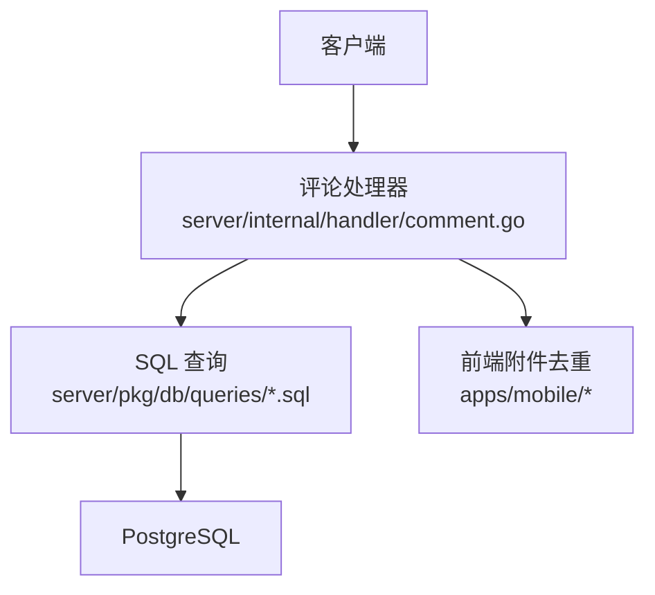
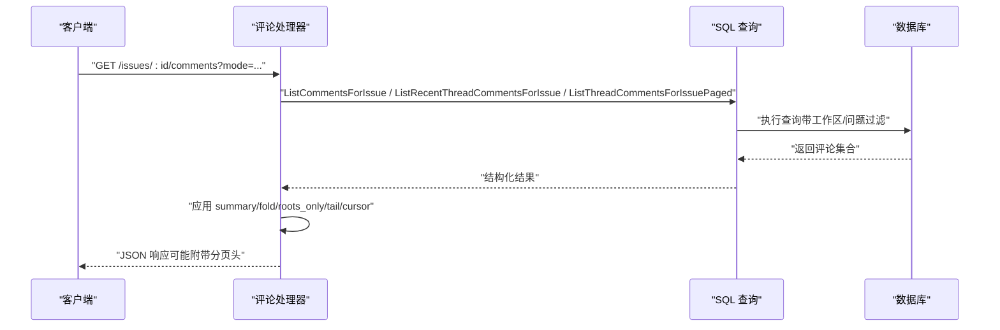
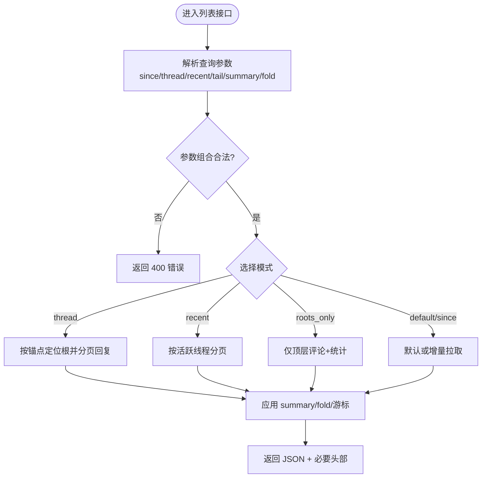
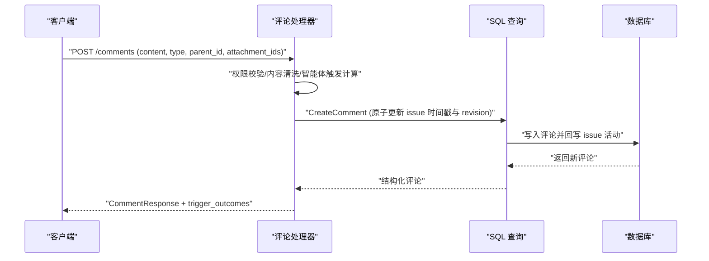
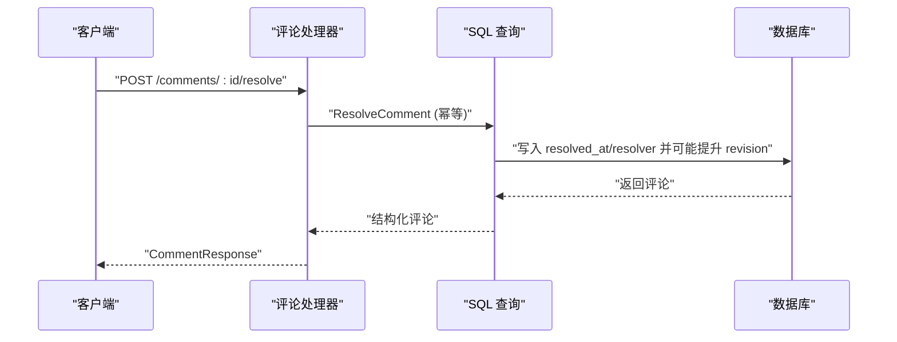
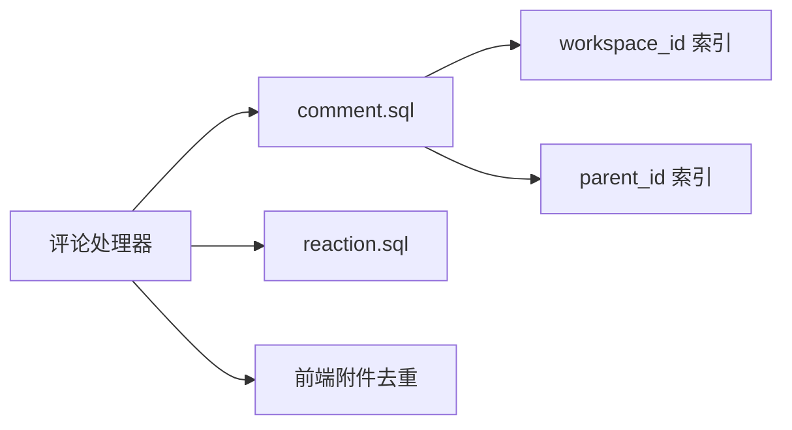

# 评论系统 API

<cite>
**本文引用的文件**
- [server/internal/handler/comment.go](file://server/internal/handler/comment.go)
- [server/pkg/db/queries/comment.sql](file://server/pkg/db/queries/comment.sql)
- [server/pkg/db/queries/reaction.sql](file://server/pkg/db/queries/reaction.sql)
- [server/migrations/135_comment_workspace_index.up.sql](file://server/migrations/135_comment_workspace_index.up.sql)
- [server/migrations/247_comment_parent_index.down.sql](file://server/migrations/247_comment_parent_index.down.sql)
- [server/migrations/351_issue_comment_revision.up.sql](file://server/migrations/351_issue_comment_revision.up.sql)
- [apps/mobile/components/issue/comment-attachment-list.tsx](file://apps/mobile/components/issue/comment-attachment-list.tsx)
- [apps/mobile/lib/attachment-dedup.ts](file://apps/mobile/lib/attachment-dedup.ts)
</cite>

## 目录
1. [简介](#简介)
2. [项目结构](#项目结构)
3. [核心组件](#核心组件)
4. [架构总览](#架构总览)
5. [详细组件分析](#详细组件分析)
6. [依赖分析](#依赖分析)
7. [性能考虑](#性能考虑)
8. [故障排查指南](#故障排查指南)
9. [结论](#结论)
10. [附录](#附录)

## 简介
本文件为 Multica 评论系统的完整 API 文档，覆盖评论的创建、读取、更新与删除（含线程与回复）、附件与富文本渲染、权限控制、编辑历史与版本管理、搜索过滤与通知触发、审核与防垃圾信息机制。后端基于 Go + Chi 路由，使用 sqlc 生成查询，数据库为 PostgreSQL；前端在移动端与 Web 端对附件去重与 Markdown 渲染保持一致行为。

## 项目结构
- 处理器层：负责 HTTP 请求解析、参数校验、权限检查、业务编排与响应组装。
- 数据访问层：sqlc 生成的 SQL 查询，包含评论 CRUD、线程根查找、修订号递增、表情反应等。
- 迁移层：索引与字段变更，如 workspace_id 索引、parent_id 索引、revision 字段。
- 前端：移动端对附件列表进行去重与内联引用识别，避免重复渲染。

**图表来源**
- [server/internal/handler/comment.go:394-684](file://server/internal/handler/comment.go#L394-L684)
- [server/pkg/db/queries/comment.sql:398-422](file://server/pkg/db/queries/comment.sql#L398-L422)
- [apps/mobile/lib/attachment-dedup.ts:1-32](file://apps/mobile/lib/attachment-dedup.ts#L1-L32)

**章节来源**
- [server/internal/handler/comment.go:394-684](file://server/internal/handler/comment.go#L394-L684)
- [server/pkg/db/queries/comment.sql:398-422](file://server/pkg/db/queries/comment.sql#L398-L422)
- [apps/mobile/lib/attachment-dedup.ts:1-32](file://apps/mobile/lib/attachment-dedup.ts#L1-L32)

## 核心组件
- 评论响应模型：包含 ID、所属问题、作者、内容、类型、父级、时间戳、修订号、解决状态、来源任务、快捷动作标记、表情、附件、线程统计、折叠信息等。
- 列表接口：支持多种模式（默认最新、roots_only、thread、recent、since、tail、cursor），并支持 summary 与 fold 投影。
- 线程与回复：通过 parent_id 形成树形结构；提供 GetThreadRoot 递归查找根评论。
- 表情反应：增删表情并同步提升评论 revision。
- 附件：评论可携带附件列表；前端根据正文中的 URL 引用进行去重，避免重复渲染。
- 版本与审计：comment 与 issue 均维护 revision；创建/解决等操作会原子性更新相关时间戳与修订号。

**章节来源**
- [server/internal/handler/comment.go:28-81](file://server/internal/handler/comment.go#L28-L81)
- [server/pkg/db/queries/comment.sql:398-422](file://server/pkg/db/queries/comment.sql#L398-L422)
- [server/pkg/db/queries/reaction.sql:1-42](file://server/pkg/db/queries/reaction.sql#L1-L42)
- [apps/mobile/components/issue/comment-attachment-list.tsx:26-58](file://apps/mobile/components/issue/comment-attachment-list.tsx#L26-L58)
- [apps/mobile/lib/attachment-dedup.ts:1-32](file://apps/mobile/lib/attachment-dedup.ts#L1-L32)

## 架构总览
评论系统以处理器为中心，组合多种查询模式与投影能力，保证在大体量评论场景下的可扩展性与一致性。

**图表来源**
- [server/internal/handler/comment.go:394-684](file://server/internal/handler/comment.go#L394-L684)
- [server/pkg/db/queries/comment.sql:268-301](file://server/pkg/db/queries/comment.sql#L268-L301)

## 详细组件分析

### 评论列表与线程浏览（读取）
- 支持的模式与组合规则：
  - 默认：返回最近 N 条评论（受硬上限保护）。
  - roots_only：仅顶层评论，附带 reply_count 与 last_activity_at 用于线程选择。
  - thread=<uuid>：获取指定评论所在线程的根及后代；支持 tail 限制回复数量。
  - recent=<N>：返回最近活跃的 N 个线程（按子树最大 created_at 排序）。
  - since=<RFC3339>：增量拉取某时间之后的评论。
  - before/before_id：游标翻页（recent 模式下为线程游标；thread+tail 下为回复游标）。
  - summary=true：裁剪每条评论内容到固定字符预算，并标记 content_truncated。
  - fold=true：折叠已解决的线程至“根+结论”或仅“根”，并标注 thread_resolved 与 folded_count。
- 组合约束：fold 与 since/tail/roots_only 互斥；roots_only 与 thread/recent/tail/before 互斥；thread 与 recent 互斥；tail 必须配合 thread；before 需成对出现且依赖特定模式。
- 响应头部：X-Multica-Next-Before、X-Multica-Next-Before-Id 提供下一页游标；X-Comments-Truncated 指示是否因硬上限截断。

**图表来源**
- [server/internal/handler/comment.go:394-684](file://server/internal/handler/comment.go#L394-L684)
- [server/internal/handler/comment.go:743-1128](file://server/internal/handler/comment.go#L743-L1128)

**章节来源**
- [server/internal/handler/comment.go:394-684](file://server/internal/handler/comment.go#L394-L684)
- [server/internal/handler/comment.go:743-1128](file://server/internal/handler/comment.go#L743-L1128)

### 评论创建与回复（创建）
- 请求体关键字段：content、type、parent_id（可选，表示回复）、attachment_ids、suppress_agent_ids（抑制某些智能体触发）。
- 事务性保证：创建评论时原子更新父问题的 updated_at、last_activity_at 与 revision，确保活动时间与租户完整性。
- 智能体触发预览：提供 PreviewCommentTriggers 接口，返回将触发的智能体/团队及其原因，以及可能被阻止的提及。
- 结果字段：除基础评论外，还包含 trigger_outcomes 记录每次显式 @agent/@squad 的调度结果（排队、合并、延迟、阻塞）。

**图表来源**
- [server/internal/handler/comment.go:1461-1500](file://server/internal/handler/comment.go#L1461-L1500)
- [server/pkg/db/queries/comment.sql:424-449](file://server/pkg/db/queries/comment.sql#L424-L449)

**章节来源**
- [server/internal/handler/comment.go:1461-1500](file://server/internal/handler/comment.go#L1461-L1500)
- [server/pkg/db/queries/comment.sql:424-449](file://server/pkg/db/queries/comment.sql#L424-L449)

### 评论更新与删除（更新/删除）
- 更新：通过更新接口修改评论内容与类型，同时提升 comment.revision 与 updated_at；若涉及问题关联，也会更新问题修订。
- 删除：删除操作会移除评论行并提升相关修订号；具体实现由服务层与查询封装，确保无外键级联清理。
- 版本管理：所有写操作通过 revision 字段提供乐观锁语义，便于客户端检测变更与冲突处理。

**章节来源**
- [server/pkg/db/queries/comment.sql:538-557](file://server/pkg/db/queries/comment.sql#L538-L557)
- [server/migrations/351_issue_comment_revision.up.sql:1-5](file://server/migrations/351_issue_comment_revision.up.sql#L1-L5)

### 评论解决与线程折叠（审核/结论）
- 解决：ResolveComment 将评论标记为已解决，记录 resolved_at、resolved_by_type、resolved_by_id，并仅在首次解决时提升 revision。
- 折叠：fold=true 时，服务端将已解决线程折叠为“根+结论”或仅“根”，并在根评论上标注 thread_resolved 与 folded_count；未解决线程保持原样。
- 用途：减少上下文开销，使代理或人类读者聚焦于关键讨论。

**图表来源**
- [server/pkg/db/queries/comment.sql:609-619](file://server/pkg/db/queries/comment.sql#L609-L619)
- [server/internal/handler/comment.go:154-186](file://server/internal/handler/comment.go#L154-L186)

**章节来源**
- [server/pkg/db/queries/comment.sql:609-619](file://server/pkg/db/queries/comment.sql#L609-L619)
- [server/internal/handler/comment.go:154-186](file://server/internal/handler/comment.go#L154-L186)

### 表情反应（互动）
- 添加/移除表情：AddReaction/RemoveReaction 会插入或删除 comment_reaction，并提升对应评论的 revision。
- 批量查询：ListReactionsByCommentIDs 支持按多个评论 ID 批量获取表情。

**章节来源**
- [server/pkg/db/queries/reaction.sql:1-42](file://server/pkg/db/queries/reaction.sql#L1-L42)

### 附件与富文本渲染（附件/Markdown）
- 附件列表：评论可携带附件数组；移动端根据正文中引用的 URL（包括稳定路径、原始存储 url、签名下载链接、markdown_url）进行去重，避免重复渲染。
- 富文本：正文支持 Markdown；前端在渲染图片与链接时识别附件引用，统一走附件资源路径。

**章节来源**
- [apps/mobile/components/issue/comment-attachment-list.tsx:26-58](file://apps/mobile/components/issue/comment-attachment-list.tsx#L26-L58)
- [apps/mobile/lib/attachment-dedup.ts:1-32](file://apps/mobile/lib/attachment-dedup.ts#L1-L32)

### 权限控制与智能体触发（权限/通知）
- 权限：所有评论操作均需通过 loadIssueForUser 与 requireUserID 等中间件校验用户与工作区权限。
- 智能体触发：评论可显式 @agent 或 @squad，服务端计算将被触发的目标与原因，并返回 trigger_outcomes；支持抑制部分智能体触发。
- 预览：PreviewCommentTriggers 允许在发送前预览哪些智能体会被触发或被阻止。

**章节来源**
- [server/internal/handler/comment.go:1573-1599](file://server/internal/handler/comment.go#L1573-L1599)
- [server/internal/handler/comment.go:83-93](file://server/internal/handler/comment.go#L83-L93)

### 搜索、过滤与通知（搜索/过滤/通知）
- 搜索：通过 workspace_id 索引与 bigm/trgm GIN 索引优化全文检索；迁移文件说明了索引构建策略与性能收益。
- 过滤：列表接口支持 since、roots_only、thread、recent、tail、cursor 等多维过滤与分页。
- 通知：评论创建/更新/解决会触发订阅者与通知监听器，结合 trigger_outcomes 告知调用方实际调度结果。

**章节来源**
- [server/migrations/135_comment_workspace_index.up.sql:1-23](file://server/migrations/135_comment_workspace_index.up.sql#L1-L23)
- [server/internal/handler/comment.go:394-684](file://server/internal/handler/comment.go#L394-L684)

### 垃圾信息防护与审核（安全/审核）
- 内容清洗：处理器层对评论内容进行清洗与校验，防止恶意输入。
- 速率与配额：通过硬上限（commentHardCap）与上下文预算（commentThreadContextBudget）限制响应大小，防止滥用。
- 审核流程：通过 ResolveComment 标记线程结论；结合折叠功能，使已解决的讨论不再占用上下文。

**章节来源**
- [server/internal/handler/comment.go:123-145](file://server/internal/handler/comment.go#L123-L145)
- [server/internal/handler/comment.go:277-310](file://server/internal/handler/comment.go#L277-L310)
- [server/pkg/db/queries/comment.sql:609-619](file://server/pkg/db/queries/comment.sql#L609-L619)

## 依赖分析
- 处理器依赖 sqlc 生成的查询函数，封装了复杂的事务与递归 CTE。
- 数据库层通过索引优化搜索与层级遍历（workspace_id、parent_id）。
- 前端依赖统一的附件去重逻辑，确保与服务器发出的 URL 形式一致。

**图表来源**
- [server/internal/handler/comment.go:394-684](file://server/internal/handler/comment.go#L394-L684)
- [server/pkg/db/queries/comment.sql:268-301](file://server/pkg/db/queries/comment.sql#L268-L301)
- [server/migrations/135_comment_workspace_index.up.sql:1-23](file://server/migrations/135_comment_workspace_index.up.sql#L1-L23)
- [server/migrations/247_comment_parent_index.down.sql:1-1](file://server/migrations/247_comment_parent_index.down.sql#L1-L1)
- [apps/mobile/lib/attachment-dedup.ts:1-32](file://apps/mobile/lib/attachment-dedup.ts#L1-L32)

**章节来源**
- [server/internal/handler/comment.go:394-684](file://server/internal/handler/comment.go#L394-L684)
- [server/pkg/db/queries/comment.sql:268-301](file://server/pkg/db/queries/comment.sql#L268-L301)
- [server/migrations/135_comment_workspace_index.up.sql:1-23](file://server/migrations/135_comment_workspace_index.up.sql#L1-L23)
- [server/migrations/247_comment_parent_index.down.sql:1-1](file://server/migrations/247_comment_parent_index.down.sql#L1-L1)
- [apps/mobile/lib/attachment-dedup.ts:1-32](file://apps/mobile/lib/attachment-dedup.ts#L1-L32)

## 性能考虑
- 硬上限与上下文预算：commentHardCap 与 commentThreadContextBudget 共同限制响应规模，防止大线程拖垮带宽与上下文。
- 索引优化：workspace_id 与 parent_id 索引显著提升搜索与层级遍历性能；bigm/trgm GIN 索引用于全文检索。
- 游标分页：通过 before/before_id 实现稳定翻页，避免深分页带来的性能退化。
- 折叠与摘要：fold 与 summary 降低传输与处理成本，适合代理与长线程场景。

[本节为通用指导，不直接分析具体文件]

## 故障排查指南
- 参数错误：当组合参数非法（如 fold 与 since 同时使用）时，返回 400 并提示原因。
- 线程不存在：thread 锚点不在当前问题下时，返回 404。
- 游标无效：before/before_id 缺失或不匹配预期模式时，返回 400。
- 数据库异常：查询失败时返回 500，建议检查索引与连接池。

**章节来源**
- [server/internal/handler/comment.go:484-532](file://server/internal/handler/comment.go#L484-L532)
- [server/internal/handler/comment.go:601-613](file://server/internal/handler/comment.go#L601-L613)

## 结论
该评论系统通过灵活的列表模式、严格的组合校验、完善的线程与版本管理、高效的索引与预算控制，提供了高可用、可扩展的评论能力。前端附件去重与富文本渲染保证了用户体验的一致性。智能体触发与通知机制使得自动化协作成为可能。

[本节为总结，不直接分析具体文件]

## 附录
- 常用查询参数示例：
  - 获取最近活跃线程：GET /issues/:id/comments?recent=10
  - 获取指定线程并限制回复数：GET /issues/:id/comments?thread=<uuid>&tail=20
  - 增量拉取：GET /issues/:id/comments?since=2024-01-01T00:00:00Z
  - 仅顶层评论：GET /issues/:id/comments?roots_only=true
  - 内容摘要：GET /issues/:id/comments?summary=true
  - 折叠已解决线程：GET /issues/:id/comments?fold=true
- 响应头：
  - X-Multica-Next-Before、X-Multica-Next-Before-Id：下一页游标
  - X-Comments-Truncated：是否因硬上限截断

[本节为补充说明，不直接分析具体文件]