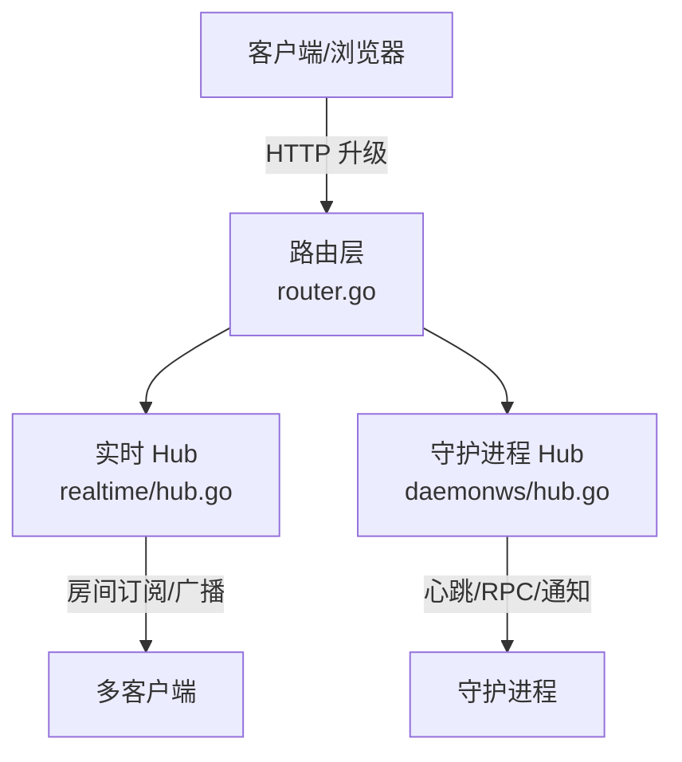
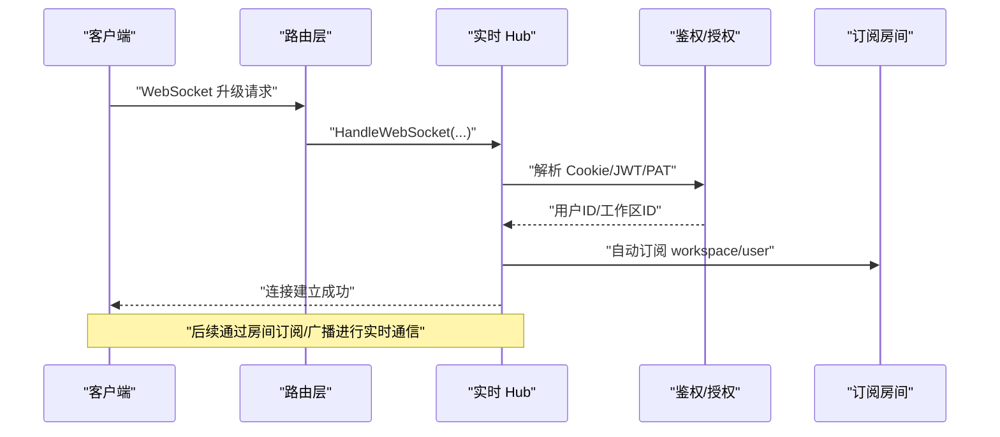
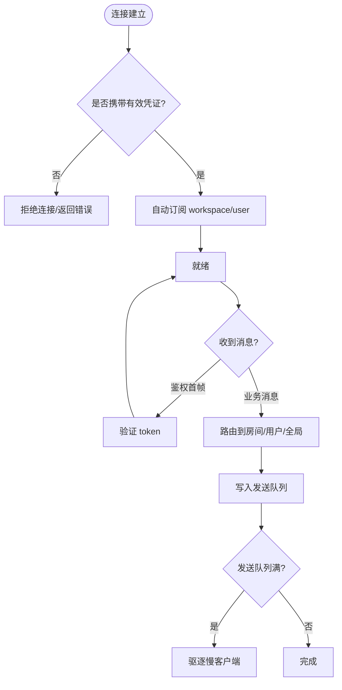
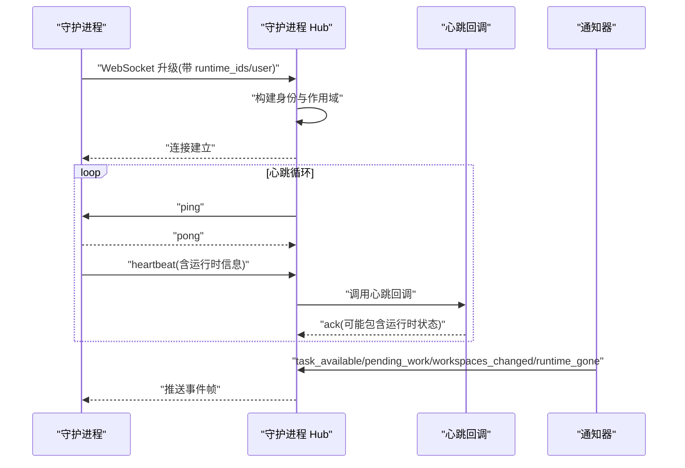
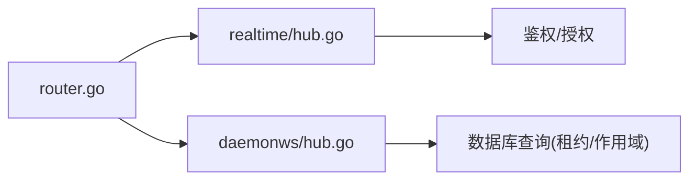

# WebSocket API

<cite>
**本文引用的文件**
- [server/internal/realtime/hub.go](file://server/internal/realtime/hub.go)
- [server/internal/daemonws/hub.go](file://server/internal/daemonws/hub.go)
- [server/internal/handler/daemon_ws.go](file://server/internal/handler/daemon_ws.go)
- [server/pkg/protocol/events.go](file://server/pkg/protocol/events.go)
- [server/pkg/protocol/messages.go](file://server/pkg/protocol/messages.go)
- [server/cmd/server/router.go](file://server/cmd/server/router.go)
</cite>

## 目录
1. [简介](#简介)
2. [项目结构](#项目结构)
3. [核心组件](#核心组件)
4. [架构总览](#架构总览)
5. [详细组件分析](#详细组件分析)
6. [依赖关系分析](#依赖关系分析)
7. [性能考虑](#性能考虑)
8. [故障排查指南](#故障排查指南)
9. [结论](#结论)
10. [附录](#附录)

## 简介
本文件面向使用与实现 Multica 实时通信能力的开发者，系统化说明两类 WebSocket 接口：
- 面向前端/客户端的实时通道（房间订阅、广播、鉴权、跨域与安全）
- 面向守护进程（Daemon）的长连接通道（心跳、任务唤醒、RPC、运行时失效通知）

文档覆盖连接建立、握手协议、消息格式、事件类型、生命周期管理、重连与错误处理、安全策略、性能优化与调试方法，并提供可落地的客户端接入模式。

## 项目结构
后端基于 Go 实现，使用 gorilla/websocket 提供两个独立的 WebSocket Hub：
- realtime.Hub：面向浏览器/移动端等客户端，按“作用域”组织房间（用户、工作区、资源），支持 JWT/PAT 认证与跨域白名单校验。
- daemonws.Hub：面向守护进程，维护运行时范围的心跳、任务可用通知、工作区变更、待处理工作提示与 RPC 请求。

路由入口将 HTTP 请求升级到 WebSocket，并交由对应 Hub 处理。

图表来源
- [server/cmd/server/router.go:1339](file://server/cmd/server/router.go#L1339)
- [server/internal/realtime/hub.go:773-800](file://server/internal/realtime/hub.go#L773-L800)
- [server/internal/daemonws/hub.go:412-443](file://server/internal/daemonws/hub.go#L412-L443)

章节来源
- [server/cmd/server/router.go:1339](file://server/cmd/server/router.go#L1339)
- [server/internal/realtime/hub.go:1-120](file://server/internal/realtime/hub.go#L1-L120)
- [server/internal/daemonws/hub.go:1-80](file://server/internal/daemonws/hub.go#L1-L80)

## 核心组件
- 实时 Hub（realtime）
  - 房间模型：以 scopeType+scopeID 为键的房间集合，支持用户级与工作区级自动订阅。
  - 鉴权：Cookie/JWT/PAT 三种方式；首帧鉴权或会话 Cookie 鉴权。
  - 广播：按房间、用户、全局广播；慢客户端驱逐与去重。
  - 安全：Origin 白名单、可信代理、读限制防 OOM。
- 守护进程 Hub（daemonws）
  - 身份：基于 DaemonID、RuntimeIDs、UserID 构建连接作用域。
  - 心跳：定时 ping/pong，超时关闭；心跳回调更新运行时状态。
  - 通知：任务可用、工作区变更、待处理工作、运行时已删除。
  - RPC：daemon:rpc_request 分发与限流。
- 协议定义（pkg/protocol）
  - 统一消息体 Message{type, payload}，事件类型常量集中管理。

章节来源
- [server/internal/realtime/hub.go:221-300](file://server/internal/realtime/hub.go#L221-L300)
- [server/internal/daemonws/hub.go:22-150](file://server/internal/daemonws/hub.go#L22-L150)
- [server/pkg/protocol/events.go](file://server/pkg/protocol/events.go)
- [server/pkg/protocol/messages.go](file://server/pkg/protocol/messages.go)

## 架构总览
两类 WebSocket 共享“鉴权 + 房间/作用域 + 广播/通知 + 心跳/健康检查”的通用模式，但关注点不同：
- 实时 Hub 强调多租户房间、细粒度授权、跨域安全与大规模并发。
- 守护进程 Hub 强调高可靠心跳、批量写回、幂等去重与快速失败。

图表来源
- [server/internal/realtime/hub.go:773-800](file://server/internal/realtime/hub.go#L773-L800)
- [server/internal/realtime/hub.go:321-345](file://server/internal/realtime/hub.go#L321-L345)

## 详细组件分析

### 实时 WebSocket（客户端）
- 连接建立与鉴权
  - 支持 Cookie 会话或首帧发送鉴权消息（token）。
  - 工作区可通过 workspace_id 或 workspace_slug 指定。
  - Origin 校验遵循白名单与可信代理规则。
- 房间与订阅
  - 连接建立后自动订阅 workspace 与 user 作用域。
  - 业务层可按资源维度扩展订阅（如聊天室、任务详情）。
- 广播与去重
  - 支持按房间、用户、全局广播。
  - 通过 eventID 做本地去重，避免 Redis 回放重复投递。
- 心跳与健康
  - 服务端周期性 ping，客户端需回复 pong；未响应则关闭连接。
- 安全
  - 读限制防止恶意大消息导致 OOM。
  - 仅信任配置的可信代理转发 X-Forwarded-Host。

图表来源
- [server/internal/realtime/hub.go:720-753](file://server/internal/realtime/hub.go#L720-L753)
- [server/internal/realtime/hub.go:321-345](file://server/internal/realtime/hub.go#L321-L345)
- [server/internal/realtime/hub.go:489-527](file://server/internal/realtime/hub.go#L489-L527)
- [server/internal/realtime/hub.go:616-662](file://server/internal/realtime/hub.go#L616-L662)

章节来源
- [server/internal/realtime/hub.go:159-211](file://server/internal/realtime/hub.go#L159-L211)
- [server/internal/realtime/hub.go:678-753](file://server/internal/realtime/hub.go#L678-L753)
- [server/internal/realtime/hub.go:773-800](file://server/internal/realtime/hub.go#L773-L800)

### 守护进程 WebSocket（Daemon）
- 连接建立与作用域
  - 通过 URL 参数 runtime_ids 或 userID 声明连接作用域。
  - 服务侧一次性加载运行时租约（WorkspaceID、状态、最近心跳时间），作为连接期不可变范围。
- 心跳机制
  - 固定周期 ping，等待 pong；超时关闭。
  - 心跳回调用于更新运行时在线状态与批量写水位。
- 通知与失效
  - 任务可用、工作区变更、待处理工作提示、运行时已删除。
  - 运行时失效时从连接的作用域中移除该运行时，并触发客户端清理。
- RPC 与限流
  - daemon:rpc_request 分发至处理器，单连接并发上限保护。
- 去重与可靠性
  - 事件级去重（eventID），慢客户端驱逐，最终依赖心跳回执保证正确性。

图表来源
- [server/internal/daemonws/hub.go:412-443](file://server/internal/daemonws/hub.go#L412-L443)
- [server/internal/daemonws/hub.go:284-300](file://server/internal/daemonws/hub.go#L284-L300)
- [server/internal/daemonws/hub.go:445-546](file://server/internal/daemonws/hub.go#L445-L546)
- [server/internal/daemonws/hub.go:594-674](file://server/internal/daemonws/hub.go#L594-L674)

章节来源
- [server/internal/handler/daemon_ws.go:12-102](file://server/internal/handler/daemon_ws.go#L12-L102)
- [server/internal/daemonws/hub.go:16-20](file://server/internal/daemonws/hub.go#L16-L20)
- [server/internal/daemonws/hub.go:310-351](file://server/internal/daemonws/hub.go#L310-L351)
- [server/internal/daemonws/hub.go:548-592](file://server/internal/daemonws/hub.go#L548-L592)

### 消息格式与事件类型
- 统一消息体
  - type：事件类型字符串（如 task_available、runtime_profiles_changed、workspaces_changed、pending_work、heartbeat_ack 等）
  - payload：JSON 对象，字段随事件类型变化
- 常见事件
  - 任务可用：payload 包含 runtime_id、task_id
  - 运行时配置变更：payload 包含 workspace_id、runtime_profile_id
  - 工作区变更：空 payload
  - 待处理工作：payload 包含 runtime_id、kind
  - 心跳回执：payload 包含 runtime_id、status、runtime_gone 标志
- 客户端鉴权首帧（实时 Hub）
  - type: "auth"
  - payload.token: JWT 或 PAT

章节来源
- [server/pkg/protocol/events.go](file://server/pkg/protocol/events.go)
- [server/pkg/protocol/messages.go](file://server/pkg/protocol/messages.go)
- [server/internal/realtime/hub.go:720-753](file://server/internal/realtime/hub.go#L720-L753)
- [server/internal/daemonws/hub.go:760-800](file://server/internal/daemonws/hub.go#L760-L800)

### 实时通信场景
- 聊天消息
  - 客户端加入聊天室房间（由业务层决定 scopeType/scopeID），发送消息经服务端广播至房间内所有成员。
- 通知推送
  - 服务端通过用户级或工作区级广播推送系统通知。
- 状态同步
  - 运行时状态变更、工作区权限变更通过专用事件下发，客户端据此刷新 UI。

章节来源
- [server/internal/realtime/hub.go:321-345](file://server/internal/realtime/hub.go#L321-L345)
- [server/internal/realtime/hub.go:489-527](file://server/internal/realtime/hub.go#L489-L527)
- [server/internal/daemonws/hub.go:445-546](file://server/internal/daemonws/hub.go#L445-L546)

### 连接重连、错误处理与心跳检测
- 心跳检测
  - 固定周期 ping，等待 pong；超时关闭连接。
- 重连机制
  - 客户端应在连接断开（包括被服务端驱逐）后指数退避重试。
  - 对实时 Hub，重新鉴权并恢复订阅；对守护进程 Hub，重新声明作用域并恢复心跳。
- 错误处理
  - 鉴权失败：返回明确错误帧或 HTTP 错误。
  - 过大消息：触发读限制并关闭连接。
  - 慢客户端：写入阻塞时驱逐，释放资源。

章节来源
- [server/internal/realtime/hub.go:194-211](file://server/internal/realtime/hub.go#L194-L211)
- [server/internal/realtime/hub.go:616-662](file://server/internal/realtime/hub.go#L616-L662)
- [server/internal/daemonws/hub.go:16-20](file://server/internal/daemonws/hub.go#L16-L20)
- [server/internal/daemonws/hub.go:676-702](file://server/internal/daemonws/hub.go#L676-L702)

### 安全考虑
- 跨域与代理
  - Origin 白名单校验，支持可信代理下的 X-Forwarded-Host 匹配。
- 鉴权
  - 实时 Hub：Cookie/JWT/PAT；守护进程 Hub：基于 DaemonID 与运行时租约。
- 权限控制
  - 实时 Hub：ScopeAuthorizer 可针对具体资源做授权判断。
  - 守护进程 Hub：连接作用域限定可操作的运行时与工作区。

章节来源
- [server/internal/realtime/hub.go:159-211](file://server/internal/realtime/hub.go#L159-L211)
- [server/internal/realtime/hub.go:678-718](file://server/internal/realtime/hub.go#L678-L718)
- [server/internal/handler/daemon_ws.go:32-102](file://server/internal/handler/daemon_ws.go#L32-L102)

### 客户端连接示例与事件处理模式
- 实时 Hub（浏览器/移动端）
  - 建立连接：ws://host/ws?workspace_id=...
  - 首帧鉴权：发送 {type:"auth", payload:{token:"..."}}
  - 订阅房间：根据业务需要订阅特定 scopeType/scopeID
  - 接收消息：根据 type 分派处理
- 守护进程 Hub
  - 建立连接：ws://host/daemon/ws?runtime_ids=...
  - 心跳循环：定期发送 heartbeat，处理 ack
  - 事件处理：task_available、pending_work、workspaces_changed、runtime_gone

章节来源
- [server/internal/realtime/hub.go:720-753](file://server/internal/realtime/hub.go#L720-L753)
- [server/internal/daemonws/hub.go:412-443](file://server/internal/daemonws/hub.go#L412-L443)
- [server/internal/daemonws/hub.go:445-546](file://server/internal/daemonws/hub.go#L445-L546)

## 依赖关系分析
- 路由层将 WebSocket 请求分发到对应 Hub。
- 实时 Hub 依赖鉴权与授权能力（JWT/PAT、MembershipChecker、ScopeAuthorizer）。
- 守护进程 Hub 依赖数据库查询以构建连接作用域与租约。

图表来源
- [server/cmd/server/router.go:1339](file://server/cmd/server/router.go#L1339)
- [server/internal/realtime/hub.go:773-800](file://server/internal/realtime/hub.go#L773-L800)
- [server/internal/handler/daemon_ws.go:32-102](file://server/internal/handler/daemon_ws.go#L32-L102)

章节来源
- [server/cmd/server/router.go:1339](file://server/cmd/server/router.go#L1339)
- [server/internal/realtime/hub.go:23-43](file://server/internal/realtime/hub.go#L23-L43)
- [server/internal/handler/daemon_ws.go:32-102](file://server/internal/handler/daemon_ws.go#L32-L102)

## 性能考虑
- 读限制与内存保护：限制单条入站消息大小，防止 OOM。
- 慢客户端驱逐：写入阻塞时主动断开，释放资源。
- 事件去重：基于 eventID 的去重缓存，减少重复投递。
- 并发限制：守护进程单连接 RPC 并发上限，避免资源滥用。
- 批量写回：心跳回调标记批量写水位，降低数据库压力。

章节来源
- [server/internal/realtime/hub.go:194-211](file://server/internal/realtime/hub.go#L194-L211)
- [server/internal/realtime/hub.go:616-662](file://server/internal/realtime/hub.go#L616-L662)
- [server/internal/daemonws/hub.go:298-300](file://server/internal/daemonws/hub.go#L298-L300)
- [server/internal/daemonws/hub.go:87-98](file://server/internal/daemonws/hub.go#L87-L98)

## 故障排查指南
- 连接被拒绝
  - 检查 Origin 是否在白名单内，或是否来自可信代理。
  - 确认 workspace_id/workspace_slug 是否正确。
- 鉴权失败
  - 检查 Cookie/JWT/PAT 是否有效，账户是否被禁用。
- 频繁断线
  - 检查客户端是否及时响应 pong；是否存在慢客户端被驱逐。
- 消息丢失
  - 检查 eventID 去重逻辑；确认 Redis 回放与本地快路径一致性。
- 守护进程无任务
  - 检查 task_available/pending_work 事件是否到达；确认心跳回执是否正常。

章节来源
- [server/internal/realtime/hub.go:159-211](file://server/internal/realtime/hub.go#L159-L211)
- [server/internal/realtime/hub.go:678-753](file://server/internal/realtime/hub.go#L678-L753)
- [server/internal/daemonws/hub.go:548-592](file://server/internal/daemonws/hub.go#L548-L592)

## 结论
Multica 的 WebSocket 体系通过清晰的鉴权、房间/作用域模型、健壮的心跳与去重机制，同时满足前端实时交互与守护进程高可靠通信的需求。建议客户端严格遵循鉴权流程、正确处理心跳与重连，并在业务层按需实现房间订阅与事件分发，以获得稳定高效的实时体验。

## 附录
- 调试工具
  - 使用浏览器开发者工具的 Network 面板查看 WebSocket 帧。
  - 在服务端启用日志观察连接、订阅、广播与驱逐行为。
- 最佳实践
  - 客户端实现指数退避重连与幂等事件处理。
  - 合理设置房间粒度，避免过粗导致不必要广播。
  - 对守护进程保持心跳与 ACK 的一致性，确保状态最终一致。