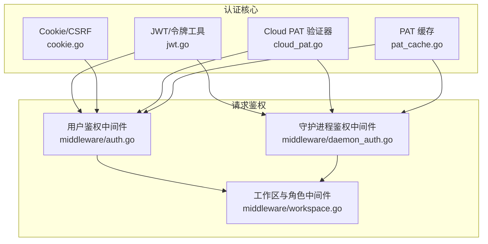
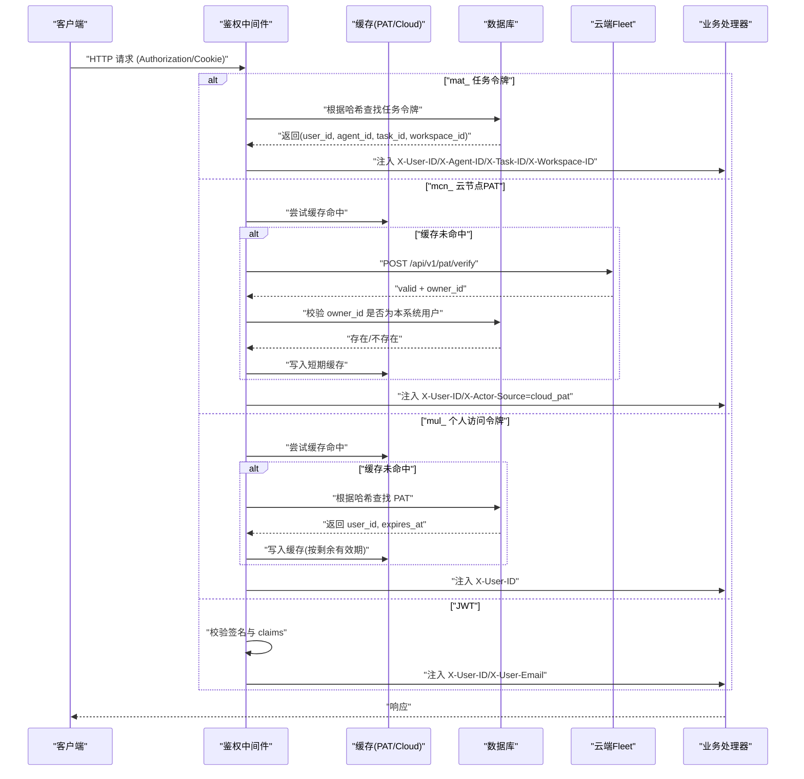
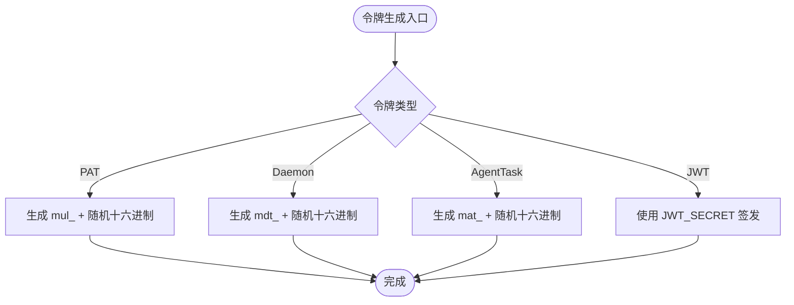
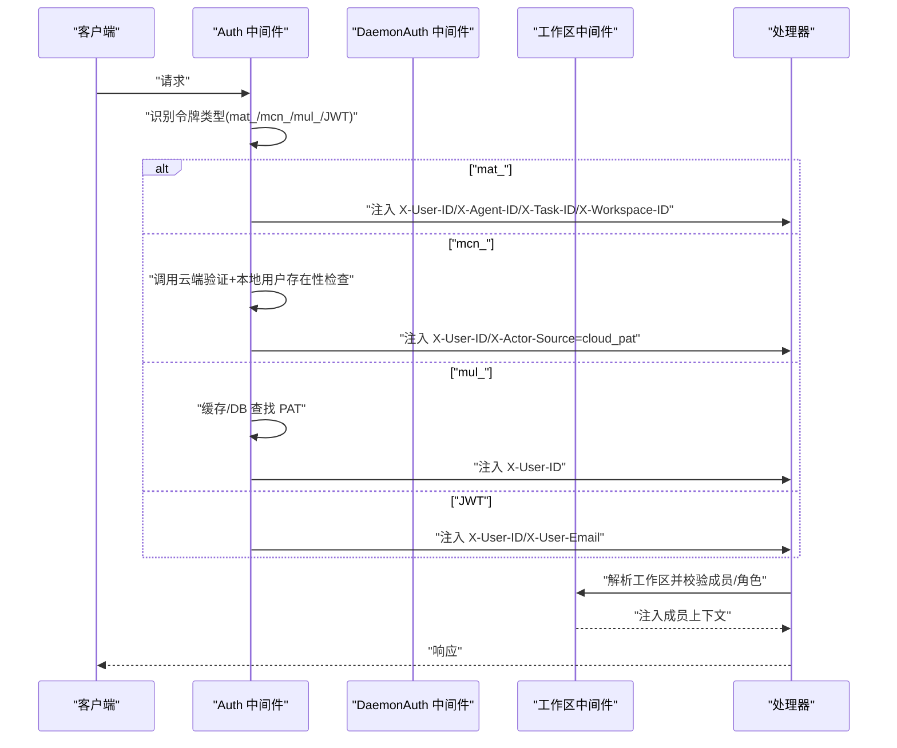
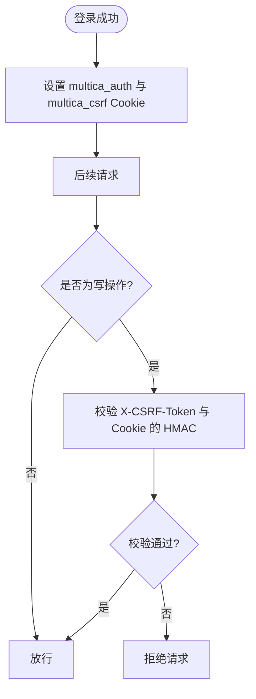
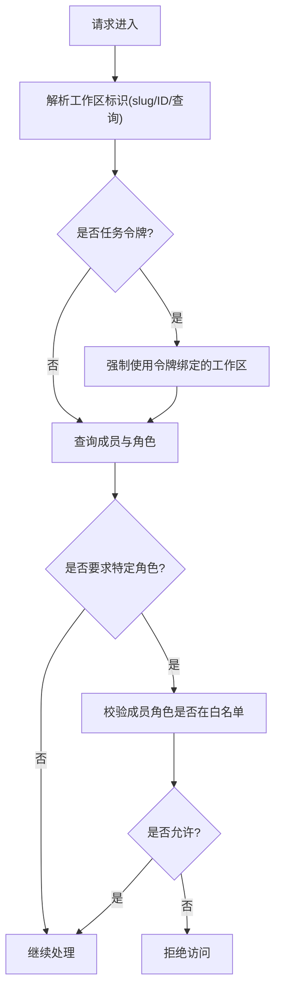
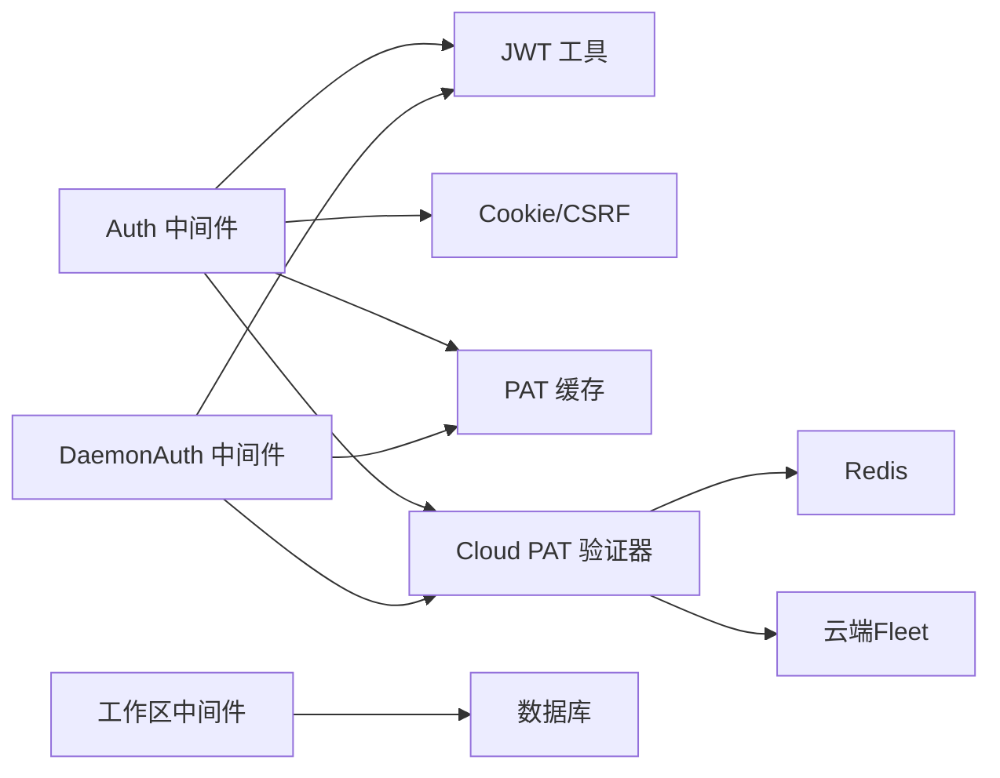

# 认证授权

<cite>
**本文引用的文件**
- [server/internal/auth/jwt.go](file://server/internal/auth/jwt.go)
- [server/internal/auth/cookie.go](file://server/internal/auth/cookie.go)
- [server/internal/auth/cloud_pat.go](file://server/internal/auth/cloud_pat.go)
- [server/internal/auth/pat_cache.go](file://server/internal/auth/pat_cache.go)
- [server/internal/middleware/auth.go](file://server/internal/middleware/auth.go)
- [server/internal/middleware/daemon_auth.go](file://server/internal/middleware/daemon_auth.go)
- [server/internal/middleware/workspace.go](file://server/internal/middleware/workspace.go)
</cite>

## 目录
1. [简介](#简介)
2. [项目结构](#项目结构)
3. [核心组件](#核心组件)
4. [架构总览](#架构总览)
5. [详细组件分析](#详细组件分析)
6. [依赖关系分析](#依赖关系分析)
7. [性能考量](#性能考量)
8. [故障排除指南](#故障排除指南)
9. [结论](#结论)
10. [附录](#附录)

## 简介
本文件面向 Multica 后端的认证与授权体系，覆盖以下主题：
- 支持的认证方式：JWT、个人访问令牌（PAT）、云节点 PAT（Cloud PAT）、守护进程令牌（Daemon Token）、任务级代理令牌（Agent Task Token）
- 令牌的生成、验证与刷新机制
- 权限模型：工作区成员与角色校验
- 会话管理：Cookie、CSRF、安全标志
- 多租户隔离策略：基于工作区的上下文注入与强制绑定
- 调试与排错：常见错误码、日志定位、缓存失效行为
- 安全最佳实践：密钥管理、最小权限、超时与限流建议

## 项目结构
后端采用 Go + Chi 路由，认证逻辑集中在 server/internal/auth 与 server/internal/middleware 两个包：
- auth：负责令牌生成、哈希、Cookie/CSRF、JWT 密钥、PAT/Cloud PAT 验证与缓存
- middleware：提供请求级鉴权中间件（用户态、守护进程态），以及工作区上下文注入与角色校验

**图表来源**
- [server/internal/auth/jwt.go:21-58](file://server/internal/auth/jwt.go#L21-L58)
- [server/internal/auth/cookie.go:130-185](file://server/internal/auth/cookie.go#L130-L185)
- [server/internal/auth/cloud_pat.go:159-213](file://server/internal/auth/cloud_pat.go#L159-L213)
- [server/internal/auth/pat_cache.go:25-39](file://server/internal/auth/pat_cache.go#L25-L39)
- [server/internal/middleware/auth.go:34-51](file://server/internal/middleware/auth.go#L34-L51)
- [server/internal/middleware/daemon_auth.go:62-79](file://server/internal/middleware/daemon_auth.go#L62-L79)
- [server/internal/middleware/workspace.go:158-169](file://server/internal/middleware/workspace.go#L158-L169)

**章节来源**
- [server/internal/auth/jwt.go:21-58](file://server/internal/auth/jwt.go#L21-L58)
- [server/internal/auth/cookie.go:130-185](file://server/internal/auth/cookie.go#L130-L185)
- [server/internal/auth/cloud_pat.go:159-213](file://server/internal/auth/cloud_pat.go#L159-L213)
- [server/internal/auth/pat_cache.go:25-39](file://server/internal/auth/pat_cache.go#L25-L39)
- [server/internal/middleware/auth.go:34-51](file://server/internal/middleware/auth.go#L34-L51)
- [server/internal/middleware/daemon_auth.go:62-79](file://server/internal/middleware/daemon_auth.go#L62-L79)
- [server/internal/middleware/workspace.go:158-169](file://server/internal/middleware/workspace.go#L158-L169)

## 核心组件
- JWT 密钥与令牌工具
  - 从环境变量读取或回退到默认值；生产环境需校验密钥强度
  - 提供令牌哈希函数，用于安全存储与缓存键
- Cookie 与会话
  - 设置 HttpOnly、Secure、SameSite 的认证 Cookie
  - 生成并校验 CSRF Token，防止跨站请求伪造
- Cloud PAT 验证器
  - 对 mcn_ 前缀令牌调用云端 Fleet 服务进行验证
  - 使用 Redis 缓存短期结果，TTL 短以控制撤销延迟
- PAT 缓存
  - 对 mul_ 前缀令牌做本地/Redis 缓存，减少数据库压力
  - 支持按令牌过期时间动态计算 TTL，并在撤销时立即失效
- 鉴权中间件
  - 用户态：优先 Authorization Bearer，其次 multica_auth Cookie（带 CSRF）
  - 守护进程态：优先 mdt_ 守护进程令牌，兼容 PAT/JWT
  - 统一将 X-User-ID、X-Actor-Source 等头部写入请求上下文
- 工作区与角色
  - 解析工作区标识（slug/ID/查询参数），注入成员信息
  - 可选的角色白名单校验，确保最小权限

**章节来源**
- [server/internal/auth/jwt.go:21-58](file://server/internal/auth/jwt.go#L21-L58)
- [server/internal/auth/cookie.go:130-185](file://server/internal/auth/cookie.go#L130-L185)
- [server/internal/auth/cloud_pat.go:159-213](file://server/internal/auth/cloud_pat.go#L159-L213)
- [server/internal/auth/pat_cache.go:25-39](file://server/internal/auth/pat_cache.go#L25-L39)
- [server/internal/middleware/auth.go:34-51](file://server/internal/middleware/auth.go#L34-L51)
- [server/internal/middleware/daemon_auth.go:62-79](file://server/internal/middleware/daemon_auth.go#L62-L79)
- [server/internal/middleware/workspace.go:158-169](file://server/internal/middleware/workspace.go#L158-L169)

## 架构总览
下图展示了请求进入后的认证与授权流程，包括令牌类型分支、缓存与外部服务交互、工作区上下文注入。

**图表来源**
- [server/internal/middleware/auth.go:77-264](file://server/internal/middleware/auth.go#L77-L264)
- [server/internal/auth/cloud_pat.go:222-294](file://server/internal/auth/cloud_pat.go#L222-L294)
- [server/internal/auth/pat_cache.go:43-73](file://server/internal/auth/pat_cache.go#L43-L73)

**章节来源**
- [server/internal/middleware/auth.go:77-264](file://server/internal/middleware/auth.go#L77-L264)
- [server/internal/auth/cloud_pat.go:222-294](file://server/internal/auth/cloud_pat.go#L222-L294)
- [server/internal/auth/pat_cache.go:43-73](file://server/internal/auth/pat_cache.go#L43-L73)

## 详细组件分析

### 令牌类型与生成
- 个人访问令牌（PAT）
  - 前缀 mul_，由服务端生成随机令牌，哈希后入库
  - 支持可选过期时间；缓存 TTL 不超过剩余有效期
- 守护进程令牌（Daemon Token）
  - 前缀 mdt_，用于守护进程与服务端通信
  - 缓存命中直接注入工作区与守护进程 ID
- 任务级代理令牌（Agent Task Token）
  - 前缀 mat_，单用途，绑定 (agent_id, task_id)，注入 X-Agent-ID/X-Task-ID/X-Workspace-ID
- 云节点 PAT（Cloud PAT）
  - 前缀 mcn_，由云端 Fleet 权威验证；本地仅缓存短期结果
- JWT
  - HMAC 签名，claims 包含 sub/email；通过环境变量配置的密钥校验

**图表来源**
- [server/internal/auth/jwt.go:60-89](file://server/internal/auth/jwt.go#L60-L89)
- [server/internal/auth/jwt.go:21-58](file://server/internal/auth/jwt.go#L21-L58)

**章节来源**
- [server/internal/auth/jwt.go:60-89](file://server/internal/auth/jwt.go#L60-L89)
- [server/internal/auth/jwt.go:21-58](file://server/internal/auth/jwt.go#L21-L58)

### 验证流程与缓存
- 用户态鉴权中间件
  - 优先级：Authorization Bearer > multica_auth Cookie（需要 CSRF）
  - 分支顺序：mat_ → mcn_ → mul_ → JWT
  - 对 mul_/mdt_ 使用缓存减少 DB 压力；对 mcn_ 使用云端验证+短期缓存
- 守护进程态鉴权中间件
  - 优先 mdt_，其次兼容 mul_/JWT；同样支持 mcn_ 路径
  - 注入工作区与守护进程 ID 到上下文
- 工作区与角色
  - 解析工作区标识（slug/ID/查询参数），注入成员信息
  - 可选角色白名单校验，拒绝无权限访问

**图表来源**
- [server/internal/middleware/auth.go:77-264](file://server/internal/middleware/auth.go#L77-L264)
- [server/internal/middleware/daemon_auth.go:106-267](file://server/internal/middleware/daemon_auth.go#L106-L267)
- [server/internal/middleware/workspace.go:158-169](file://server/internal/middleware/workspace.go#L158-L169)

**章节来源**
- [server/internal/middleware/auth.go:77-264](file://server/internal/middleware/auth.go#L77-L264)
- [server/internal/middleware/daemon_auth.go:106-267](file://server/internal/middleware/daemon_auth.go#L106-L267)
- [server/internal/middleware/workspace.go:158-169](file://server/internal/middleware/workspace.go#L158-L169)

### 会话管理与 CSRF
- 认证 Cookie
  - HttpOnly、Secure（依据前端协议）、SameSiteStrictMode
  - 可配置 TTL（默认 30 天），支持自定义时长
- CSRF 保护
  - 为每个认证 Cookie 生成 HMAC-SHA256 签名的 CSRF Token
  - 写操作必须携带 X-CSRF-Token 头并通过校验
- 清理会话
  - 提供清除认证与 CSRF Cookie 的方法

**图表来源**
- [server/internal/auth/cookie.go:130-185](file://server/internal/auth/cookie.go#L130-L185)
- [server/internal/auth/cookie.go:217-255](file://server/internal/auth/cookie.go#L217-L255)

**章节来源**
- [server/internal/auth/cookie.go:130-185](file://server/internal/auth/cookie.go#L130-L185)
- [server/internal/auth/cookie.go:217-255](file://server/internal/auth/cookie.go#L217-L255)

### 权限模型与工作区隔离
- 工作区解析优先级
  - 任务令牌绑定的工作区不可被客户端篡改
  - 支持 slug/ID/查询参数多种解析方式
- 成员与角色
  - 注入成员信息到上下文，供处理器使用
  - 可选角色白名单校验，确保最小权限
- 多租户隔离
  - 所有工作区相关操作均通过中间件强制校验
  - 任务令牌严格限制在绑定工作区内

**图表来源**
- [server/internal/middleware/workspace.go:68-95](file://server/internal/middleware/workspace.go#L68-L95)
- [server/internal/middleware/workspace.go:113-150](file://server/internal/middleware/workspace.go#L113-L150)
- [server/internal/middleware/workspace.go:195-265](file://server/internal/middleware/workspace.go#L195-L265)

**章节来源**
- [server/internal/middleware/workspace.go:68-95](file://server/internal/middleware/workspace.go#L68-L95)
- [server/internal/middleware/workspace.go:113-150](file://server/internal/middleware/workspace.go#L113-L150)
- [server/internal/middleware/workspace.go:195-265](file://server/internal/middleware/workspace.go#L195-L265)

### 集成示例与最佳实践
- 客户端集成要点
  - 使用 Authorization: Bearer <token> 发送 PAT/JWT/守护进程令牌
  - 浏览器场景下使用 multica_auth Cookie，并在写操作附带 X-CSRF-Token
  - 多租户接口传递 workspace_slug 或 workspace_id，遵循中间件解析优先级
- 服务端集成要点
  - 在路由链中先挂载 Auth/DaemonAuth，再挂载 RequireWorkspaceMember/RequireWorkspaceRole
  - 处理器通过上下文获取 X-User-ID、工作区与成员信息
- 安全最佳实践
  - 生产环境务必设置强 JWT_SECRET，避免默认值
  - 合理配置 AUTH_TOKEN_TTL、COOKIE_DOMAIN、FRONTEND_ORIGIN
  - 启用 Redis 缓存以降低 DB 压力，并确保缓存失效策略正确
  - 对 mcn_ 令牌保持短 TTL 缓存，控制撤销延迟

[本节为概念性指导，不直接分析具体文件]

## 依赖关系分析
- 中间件依赖
  - Auth 中间件依赖 auth 包的令牌工具、Cookie/CSRF、Cloud PAT 验证器与 PAT 缓存
  - DaemonAuth 中间件依赖相同能力，并额外注入守护进程上下文
  - Workspace 中间件依赖数据库查询以解析工作区与成员
- 外部依赖
  - Redis：PAT 缓存与 Cloud PAT 短期缓存
  - 云端 Fleet：Cloud PAT 验证
  - PostgreSQL：PAT/守护进程令牌、成员与工作区数据

**图表来源**
- [server/internal/middleware/auth.go:34-51](file://server/internal/middleware/auth.go#L34-L51)
- [server/internal/middleware/daemon_auth.go:62-79](file://server/internal/middleware/daemon_auth.go#L62-L79)
- [server/internal/middleware/workspace.go:158-169](file://server/internal/middleware/workspace.go#L158-L169)
- [server/internal/auth/cloud_pat.go:159-213](file://server/internal/auth/cloud_pat.go#L159-L213)
- [server/internal/auth/pat_cache.go:25-39](file://server/internal/auth/pat_cache.go#L25-L39)

**章节来源**
- [server/internal/middleware/auth.go:34-51](file://server/internal/middleware/auth.go#L34-L51)
- [server/internal/middleware/daemon_auth.go:62-79](file://server/internal/middleware/daemon_auth.go#L62-L79)
- [server/internal/middleware/workspace.go:158-169](file://server/internal/middleware/workspace.go#L158-L169)
- [server/internal/auth/cloud_pat.go:159-213](file://server/internal/auth/cloud_pat.go#L159-L213)
- [server/internal/auth/pat_cache.go:25-39](file://server/internal/auth/pat_cache.go#L25-L39)

## 性能考量
- 缓存策略
  - PAT 缓存与守护进程令牌缓存共享 TTL 策略，降低高频请求的 DB 压力
  - Cloud PAT 缓存 TTL 较短（约 60 秒），平衡撤销延迟与性能
- 网络超时与限流
  - 云端验证设置合理的 HTTP 超时，避免阻塞请求链路
  - 建议在网关层对认证相关接口实施速率限制
- 数据库优化
  - 利用索引与事务保证成员与工作区查询效率
  - 迁移中使用并发创建索引，避免锁表

[本节为通用性能指导，不直接分析具体文件]

## 故障排除指南
- 常见错误与状态码
  - 401 未授权：缺少令牌、令牌无效、Cloud PAT 无效、JWT 签名无效
  - 403 禁止：CSRF 校验失败、临时禁用用户、工作区角色不足
  - 503 服务不可用：Cloud PAT 验证器不可达、Redis/DB 异常
- 日志定位
  - 关注“auth”、“daemon_auth”、“cloud_pat”、“pat_cache”等日志关键字
  - 检查缓存命中/未命中、云端验证响应、数据库查询错误
- 缓存问题
  - 若出现令牌撤销延迟过长，确认 Cloud PAT 缓存 TTL 与 PAT 缓存失效策略
  - 缓存写入失败不影响认证，但会降级为 DB 查询
- 会话问题
  - 确认 Cookie 的 Secure/SameSite 设置与前端协议一致
  - 写操作必须携带正确的 X-CSRF-Token

**章节来源**
- [server/internal/middleware/auth.go:20-32](file://server/internal/middleware/auth.go#L20-L32)
- [server/internal/middleware/auth.go:137-175](file://server/internal/middleware/auth.go#L137-L175)
- [server/internal/middleware/auth.go:177-227](file://server/internal/middleware/auth.go#L177-L227)
- [server/internal/middleware/auth.go:229-264](file://server/internal/middleware/auth.go#L229-L264)
- [server/internal/auth/cloud_pat.go:222-294](file://server/internal/auth/cloud_pat.go#L222-L294)
- [server/internal/auth/pat_cache.go:43-73](file://server/internal/auth/pat_cache.go#L43-L73)

## 结论
Multica 的认证授权体系通过多层中间件与缓存策略，实现了高可用、高性能且安全的身份与权限控制。其特点包括：
- 多令牌类型支持，覆盖人类用户、机器服务与代理任务
- 严格的会话与 CSRF 保护，保障浏览器场景安全
- 工作区级别的权限隔离与角色校验，满足多租户需求
- 云端协同验证与短期缓存，兼顾安全性与性能
建议在生产环境中强化密钥管理、合理配置缓存与超时，并结合网关层限流与监控，持续提升系统的安全性与稳定性。

[本节为总结性内容，不直接分析具体文件]

## 附录
- 环境变量参考
  - JWT_SECRET：JWT 签名密钥（生产环境必须设置为强随机值）
  - AUTH_TOKEN_TTL：认证 Cookie 的 TTL（支持 Go duration 或秒数）
  - COOKIE_DOMAIN：Cookie 域名（避免 IP 地址）
  - FRONTEND_ORIGIN：前端协议（决定 Secure Cookie 标志）
  - MULTICA_CLOUD_URL：云端 Fleet 地址（启用 mcn_ 令牌验证）
- 集成步骤概览
  - 服务端：挂载 Auth/DaemonAuth 与 RequireWorkspaceMember/RequireWorkspaceRole
  - 客户端：使用 Bearer 或 Cookie 认证，写操作携带 CSRF Token
  - 多租户：传递 workspace_slug 或 workspace_id，遵循解析优先级

[本节为概念性指导，不直接分析具体文件]