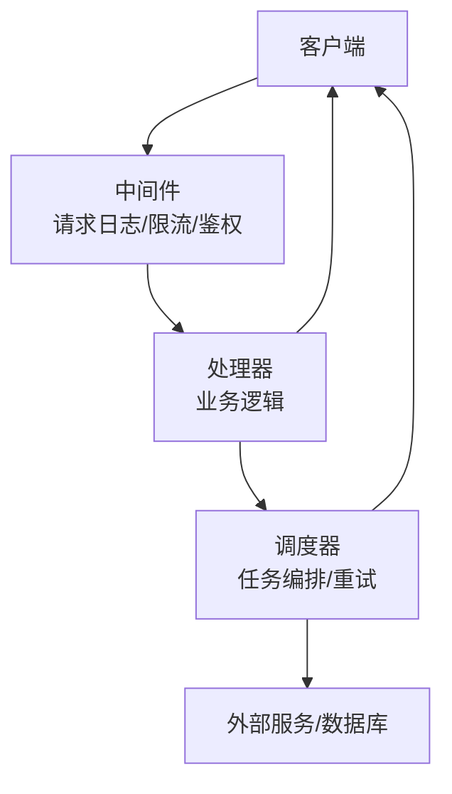
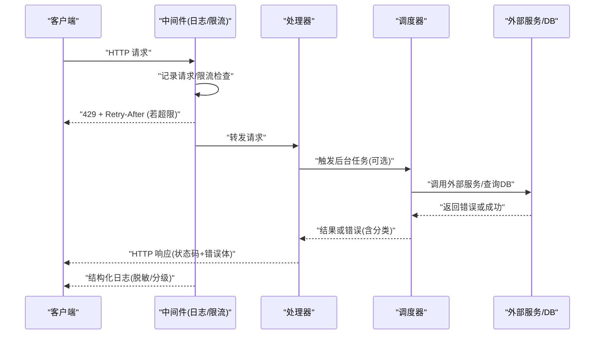
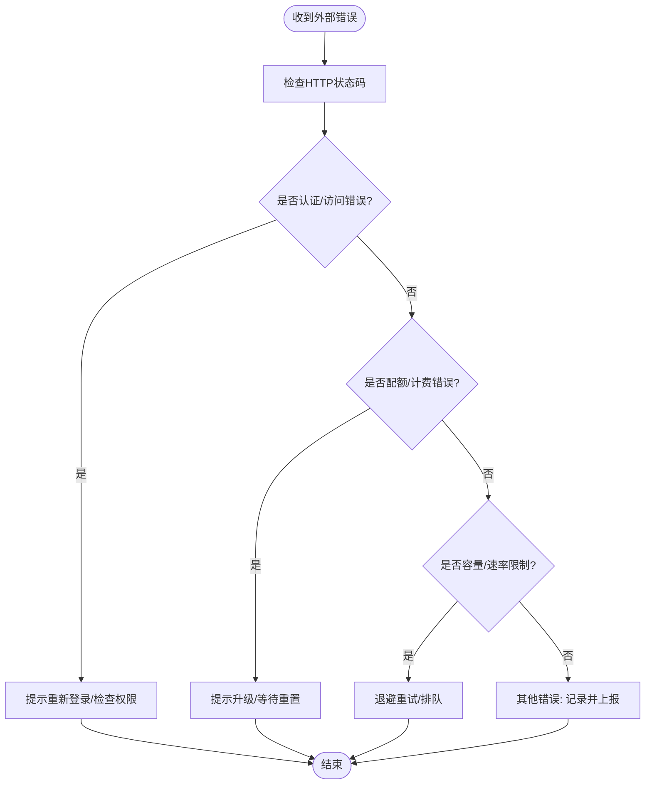
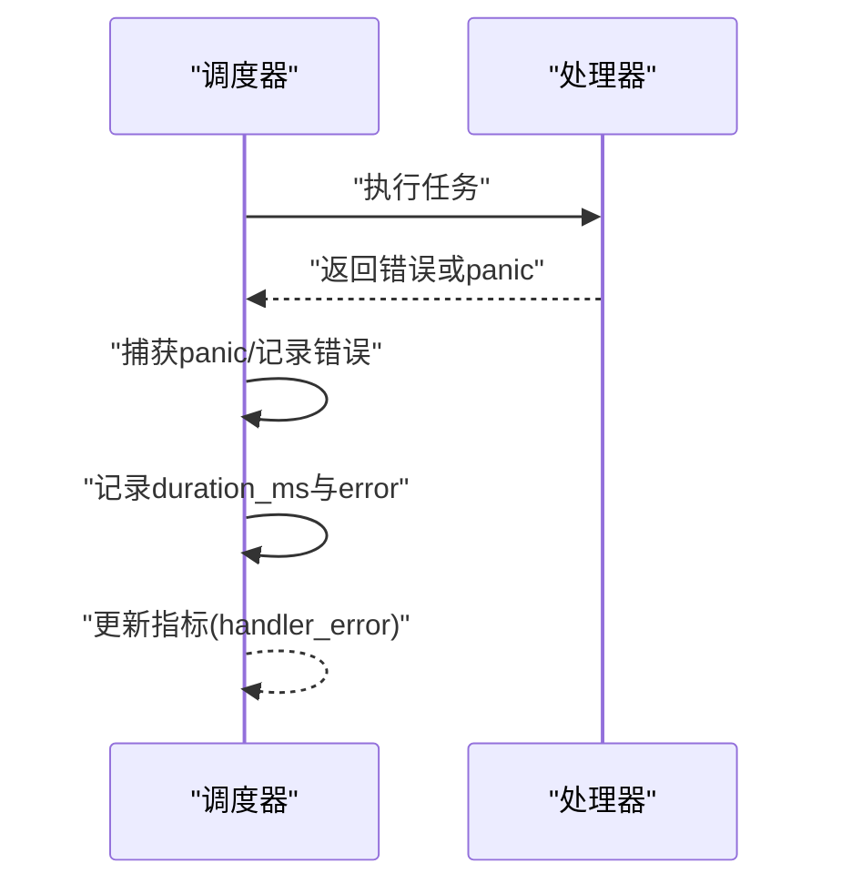
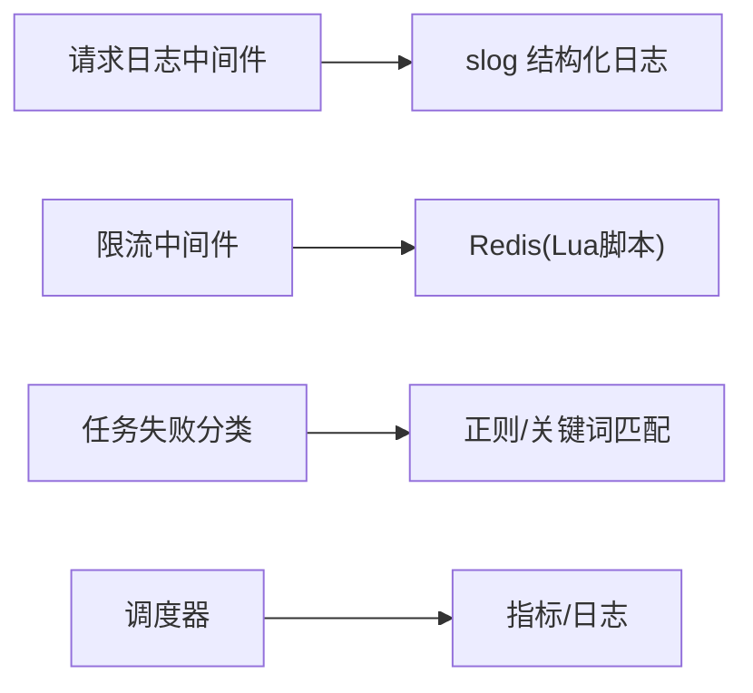

# 错误处理

<cite>
**本文引用的文件**
- [server/internal/middleware/request_logger.go](file://server/internal/middleware/request_logger.go)
- [server/internal/middleware/ratelimit.go](file://server/internal/middleware/ratelimit.go)
- [server/pkg/taskfailure/classify.go](file://server/pkg/taskfailure/classify.go)
- [server/pkg/taskfailure/classify_test.go](file://server/pkg/taskfailure/classify_test.go)
- [server/pkg/composio/client_test.go](file://server/pkg/composio/client_test.go)
- [server/internal/scheduler/manager.go](file://server/internal/scheduler/manager.go)
- [server/internal/handler/issue_status.go](file://server/internal/handler/issue_status.go)
</cite>

## 目录
1. [简介](#简介)
2. [项目结构](#项目结构)
3. [核心组件](#核心组件)
4. [架构总览](#架构总览)
5. [详细组件分析](#详细组件分析)
6. [依赖关系分析](#依赖关系分析)
7. [性能考虑](#性能考虑)
8. [故障排查指南](#故障排查指南)
9. [结论](#结论)
10. [附录](#附录)

## 简介
本参考文档面向后端与前端开发者，系统化说明 Multica 的错误处理规范与实践。内容涵盖：
- 统一的错误响应格式、HTTP 状态码与错误代码约定
- 错误分类与处理策略（客户端错误、服务端错误、第三方限制）
- 客户端最佳实践与重试机制
- 错误日志记录与监控集成
- 国际化错误消息与本地化支持思路
- 调试工具与错误追踪系统集成指南
- 常见错误场景的解决方案与预防措施

## 项目结构
错误处理贯穿请求链路：中间件负责统一日志、限流与鉴权；处理器将业务错误映射为 HTTP 状态码；调度器对任务执行失败进行分类与重试；外部集成返回结构化错误供上层判断。

**图示来源**
- [server/internal/middleware/request_logger.go:115-179](file://server/internal/middleware/request_logger.go#L115-L179)
- [server/internal/middleware/ratelimit.go:60-87](file://server/internal/middleware/ratelimit.go#L60-L87)
- [server/internal/scheduler/manager.go:362-405](file://server/internal/scheduler/manager.go#L362-L405)

**章节来源**
- [server/internal/middleware/request_logger.go:115-179](file://server/internal/middleware/request_logger.go#L115-L179)
- [server/internal/middleware/ratelimit.go:60-87](file://server/internal/middleware/ratelimit.go#L60-L87)
- [server/internal/scheduler/manager.go:362-405](file://server/internal/scheduler/manager.go#L362-L405)

## 核心组件
- 请求日志中间件：统一结构化日志，脱敏敏感路径，按状态码分级输出，识别“软 404”避免噪音。
- 速率限制中间件：基于 Redis 的固定窗口限流，超限返回 429 并附带 Retry-After。
- 任务失败分类：根据 HTTP 状态码与错误文本模式，将第三方错误归类为认证/配额/容量等，指导重试策略。
- 调度器错误封装：捕获 panic 与 handler 错误，记录耗时与错误信息，支撑可观测性。
- 处理器契约：部分处理器通过返回值约定区分调用方错误与服务端错误，便于统一映射到 400/500。

**章节来源**
- [server/internal/middleware/request_logger.go:115-179](file://server/internal/middleware/request_logger.go#L115-L179)
- [server/internal/middleware/ratelimit.go:60-87](file://server/internal/middleware/ratelimit.go#L60-L87)
- [server/pkg/taskfailure/classify.go:104-148](file://server/pkg/taskfailure/classify.go#L104-L148)
- [server/internal/scheduler/manager.go:362-405](file://server/internal/scheduler/manager.go#L362-L405)
- [server/internal/handler/issue_status.go:224-224](file://server/internal/handler/issue_status.go#L224-L224)

## 架构总览
下图展示一次典型请求的错误处理流程：中间件记录日志与限流，处理器执行业务逻辑，遇到错误时按约定返回；调度器在后台任务中分类错误并决定重试；最终由中间件或处理器写出标准错误响应。

**图示来源**
- [server/internal/middleware/request_logger.go:115-179](file://server/internal/middleware/request_logger.go#L115-L179)
- [server/internal/middleware/ratelimit.go:60-87](file://server/internal/middleware/ratelimit.go#L60-L87)
- [server/internal/scheduler/manager.go:362-405](file://server/internal/scheduler/manager.go#L362-L405)

## 详细组件分析

### 统一错误响应与 HTTP 状态码
- 限流错误：当超过速率限制时，返回 429 Too Many Requests，并在响应头中包含 Retry-After 秒数，响应体包含错误字段。
- 软 404：对于生命周期导致的“资源已删除”类 404，日志降级为 Info，避免告警风暴。
- 通用约定：
  - 4xx：客户端参数、权限或资源不存在等问题。
  - 5xx：服务器内部错误、上游不可用、未捕获异常。
  - 建议响应体包含错误类型与可读消息，便于前端展示与追踪。

**章节来源**
- [server/internal/middleware/ratelimit.go:60-87](file://server/internal/middleware/ratelimit.go#L60-L87)
- [server/internal/middleware/request_logger.go:164-177](file://server/internal/middleware/request_logger.go#L164-L177)

### 错误分类与处理策略
- 认证/访问错误：匹配 401/403 或相关文本模式，提示重新登录或检查权限。
- 配额/计费错误：匹配 402 或余额不足、月度限额等文本，提示升级或等待周期重置。
- 容量/速率限制：匹配 429/529 或过载、无可用容量等文本，采用退避重试。
- 分类依据来自对外部错误的文本与状态码模式匹配，用于驱动重试与用户提示。

**图示来源**
- [server/pkg/taskfailure/classify.go:104-148](file://server/pkg/taskfailure/classify.go#L104-L148)
- [server/pkg/taskfailure/classify_test.go:70-86](file://server/pkg/taskfailure/classify_test.go#L70-L86)

**章节来源**
- [server/pkg/taskfailure/classify.go:104-148](file://server/pkg/taskfailure/classify.go#L104-L148)
- [server/pkg/taskfailure/classify_test.go:70-86](file://server/pkg/taskfailure/classify_test.go#L70-L86)

### 调度器错误封装与可观测性
- 捕获处理器 panic 并包装为错误，记录堆栈上下文。
- 记录每次调用的耗时与错误信息，便于性能分析与问题定位。
- 将 handler_error 等错误码写入指标，支撑监控告警。

**图示来源**
- [server/internal/scheduler/manager.go:362-405](file://server/internal/scheduler/manager.go#L362-L405)

**章节来源**
- [server/internal/scheduler/manager.go:362-405](file://server/internal/scheduler/manager.go#L362-L405)

### 处理器错误契约
- 某些处理器通过返回值约定区分“调用方错误”和“服务端错误”，以便统一映射到 400 或 500。
- 建议在新增处理器时遵循该约定，保持错误语义一致。

**章节来源**
- [server/internal/handler/issue_status.go:224-224](file://server/internal/handler/issue_status.go#L224-L224)

### 外部集成错误解析
- 外部 API 错误可能为非 JSON 响应，需保留原始响应体以便诊断。
- 提供 IsNotFound/IsUnauthorized/IsRateLimited 等便捷方法，便于上层快速判断。

**章节来源**
- [server/pkg/composio/client_test.go:571-609](file://server/pkg/composio/client_test.go#L571-L609)

## 依赖关系分析
- 中间件依赖 Chi 的响应包装器进行状态码捕获与 Tee 输出，实现最小体量的响应体采样。
- 限流中间件依赖 Redis Lua 脚本保证原子性与 TTL 设置，避免键残留导致永久封禁。
- 任务失败分类依赖正则与关键词匹配，覆盖多语言与变体错误文本。
- 调度器依赖 slog 结构化日志与指标系统，记录错误与耗时。

**图示来源**
- [server/internal/middleware/request_logger.go:115-179](file://server/internal/middleware/request_logger.go#L115-L179)
- [server/internal/middleware/ratelimit.go:15-25](file://server/internal/middleware/ratelimit.go#L15-L25)
- [server/pkg/taskfailure/classify.go:104-148](file://server/pkg/taskfailure/classify.go#L104-L148)
- [server/internal/scheduler/manager.go:362-405](file://server/internal/scheduler/manager.go#L362-L405)

**章节来源**
- [server/internal/middleware/request_logger.go:115-179](file://server/internal/middleware/request_logger.go#L115-L179)
- [server/internal/middleware/ratelimit.go:15-25](file://server/internal/middleware/ratelimit.go#L15-L25)
- [server/pkg/taskfailure/classify.go:104-148](file://server/pkg/taskfailure/classify.go#L104-L148)
- [server/internal/scheduler/manager.go:362-405](file://server/internal/scheduler/manager.go#L362-L405)

## 性能考虑
- 响应体采样：仅捕获前若干字节用于分类，避免大响应体导致内存膨胀。
- 限流原子性：使用 Redis Lua 脚本确保 INCR 与 EXPIRE 的原子性，防止键泄漏。
- 日志级别控制：对“软 404”降级为 Info，降低生产环境噪音。
- 超时与重试：对 429/529 等临时错误采用指数退避，避免雪崩。

[本节为通用指导，不直接分析具体文件]

## 故障排查指南
- 查看结构化日志：关注 method、path、status、duration、request_id、user_id 等字段，快速定位问题。
- 识别软 404：若日志中出现“runtime not found”“task not found”等标记，属于预期生命周期事件，无需告警。
- 限流排查：检查 429 响应与 Retry-After 头，确认客户端是否实施退避重试。
- 任务失败分类：根据分类结果（认证/配额/容量）采取对应措施，如刷新令牌、升级套餐或等待恢复。
- 外部错误诊断：保留非 JSON 响应体，结合上游服务日志定位根因。

**章节来源**
- [server/internal/middleware/request_logger.go:164-177](file://server/internal/middleware/request_logger.go#L164-L177)
- [server/internal/middleware/ratelimit.go:60-87](file://server/internal/middleware/ratelimit.go#L60-L87)
- [server/pkg/taskfailure/classify.go:104-148](file://server/pkg/taskfailure/classify.go#L104-L148)
- [server/pkg/composio/client_test.go:571-609](file://server/pkg/composio/client_test.go#L571-L609)

## 结论
Multica 的错误处理以中间件为核心，统一日志与限流；处理器遵循错误契约；调度器对任务失败进行分类与重试；外部集成错误被妥善解析与保留。通过结构化日志、指标与分类规则，形成端到端的可观测性与可维护性。

[本节为总结，不直接分析具体文件]

## 附录

### 统一错误响应格式建议
- 状态码：严格遵循 HTTP 语义（4xx 客户端错误，5xx 服务端错误）。
- 响应体：包含错误类型、可读消息与可选的详情字段，便于前端展示与追踪。
- 头部：限流时携带 Retry-After；鉴权失败时可携带 WWW-Authenticate 等标准头。

[本节为通用指导，不直接分析具体文件]

### 客户端错误处理最佳实践与重试机制
- 幂等请求：对 GET/HEAD/PUT/DELETE 等幂等方法，可在 429/529 时实施指数退避重试。
- 非幂等请求：谨慎重试，优先提示用户或走补偿流程。
- 错误提示：将分类后的错误映射为用户友好的本地化消息。
- 监控：上报错误率、延迟与重试次数，设置阈值告警。

[本节为通用指导，不直接分析具体文件]

### 错误日志记录与监控集成
- 结构化日志：使用 slog 输出关键字段，便于集中采集与分析。
- 指标：记录 handler_error、rate_limit 等计数与延迟分布。
- 追踪：利用 request_id 串联跨服务调用链。

**章节来源**
- [server/internal/middleware/request_logger.go:115-179](file://server/internal/middleware/request_logger.go#L115-L179)
- [server/internal/scheduler/manager.go:362-405](file://server/internal/scheduler/manager.go#L362-L405)

### 国际化错误消息与本地化支持
- 服务端：返回标准化错误码与消息模板，由客户端根据语言环境渲染。
- 客户端：根据错误类型选择本地化文案，避免泄露技术细节。
- 审计：日志中不包含敏感信息，必要时脱敏。

[本节为通用指导，不直接分析具体文件]

### 调试工具与错误追踪系统集成
- 调试：启用详细日志与 request_id，结合上游服务日志定位问题。
- 追踪：接入分布式追踪系统，记录关键节点耗时与错误。
- 告警：基于错误率与延迟阈值配置告警规则。

[本节为通用指导，不直接分析具体文件]

### 常见错误场景与预防
- 429 限流：客户端实施退避重试，服务端合理配置限流阈值。
- 401/403 鉴权：刷新令牌或检查权限，避免重复失败。
- 404 软缺失：识别生命周期事件，避免误报。
- 5xx 上游错误：熔断与降级，减少级联故障。

[本节为通用指导，不直接分析具体文件]