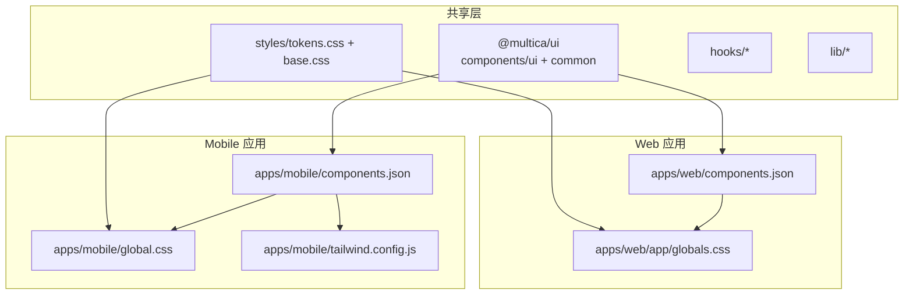
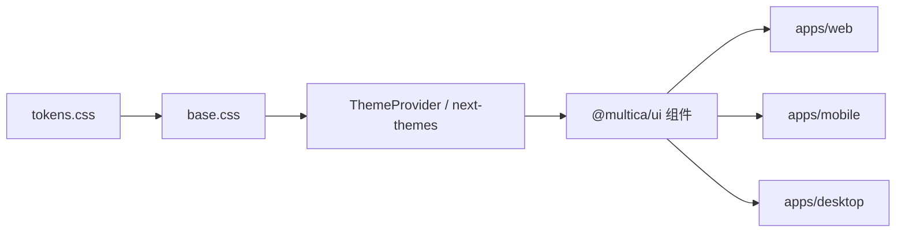
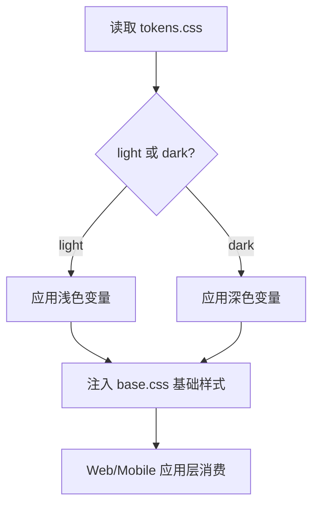
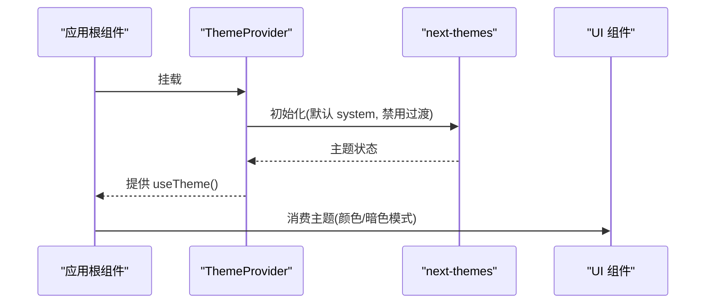
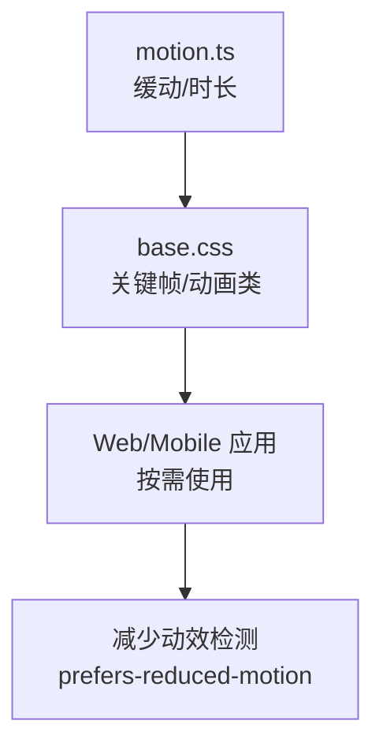

# UI 组件库

<cite>
**本文引用的文件**
- [packages/ui/package.json](file://packages/ui/package.json)
- [packages/ui/components.json](file://packages/ui/components.json)
- [apps/web/components.json](file://apps/web/components.json)
- [apps/mobile/components.json](file://apps/mobile/components.json)
- [packages/ui/styles/tokens.css](file://packages/ui/styles/tokens.css)
- [packages/ui/styles/base.css](file://packages/ui/styles/base.css)
- [apps/web/app/globals.css](file://apps/web/app/globals.css)
- [apps/mobile/global.css](file://apps/mobile/global.css)
- [apps/mobile/tailwind.config.js](file://apps/mobile/tailwind.config.js)
- [packages/ui/lib/motion.ts](file://packages/ui/lib/motion.ts)
- [packages/ui/components/common/theme-provider.tsx](file://packages/ui/components/common/theme-provider.tsx)
- [apps/docs/components/mermaid.tsx](file://apps/docs/components/mermaid.tsx)
- [apps/web/app/text-contrast.test.ts](file://apps/web/app/text-contrast.test.ts)
</cite>

## 目录
1. [简介](#简介)
2. [项目结构](#项目结构)
3. [核心组件](#核心组件)
4. [架构总览](#架构总览)
5. [详细组件分析](#详细组件分析)
6. [依赖关系分析](#依赖关系分析)
7. [性能考虑](#性能考虑)
8. [故障排查指南](#故障排查指南)
9. [结论](#结论)
10. [附录](#附录)

## 简介
本仓库的 UI 组件体系基于 Tailwind CSS 与 Shadcn/UI，并通过 @multica/ui 包统一对外暴露。Web、Desktop、Mobile 三端共享同一套设计令牌与基础样式，同时在各平台通过各自的配置进行主题与适配。组件遵循可复用、可定制、无障碍优先的原则，提供统一的图标系统（Lucide）、动画系统与主题切换能力，并配合严格的对比度测试保障可读性。

## 项目结构
- 组件与工具集中在 packages/ui：
  - components/ui：基础 UI 原子组件（按钮、输入、对话框等）
  - components/common：跨业务复用的通用组件（主题提供者、头像、错误边界等）
  - hooks：跨平台通用的 React Hooks
  - lib：工具函数与动画常量
  - markdown：Markdown 渲染与增强
  - styles：全局令牌与基础样式
- 各应用通过 shadcn 配置将 @multica/ui 作为“本地注册表”使用，从而在 apps/web、apps/mobile、apps/desktop 中按需引入组件别名。



图表来源
- [packages/ui/components.json:1-30](file://packages/ui/components.json#L1-L30)
- [apps/web/components.json:1-26](file://apps/web/components.json#L1-L26)
- [apps/mobile/components.json:1-20](file://apps/mobile/components.json#L1-L20)
- [apps/web/app/globals.css:1-30](file://apps/web/app/globals.css#L1-L30)
- [apps/mobile/global.css:1-77](file://apps/mobile/global.css#L1-L77)
- [apps/mobile/tailwind.config.js:53-99](file://apps/mobile/tailwind.config.js#L53-L99)

章节来源
- [packages/ui/package.json:1-74](file://packages/ui/package.json#L1-L74)
- [packages/ui/components.json:1-30](file://packages/ui/components.json#L1-L30)
- [apps/web/components.json:1-26](file://apps/web/components.json#L1-L26)
- [apps/mobile/components.json:1-20](file://apps/mobile/components.json#L1-L20)

## 核心组件
- 基础 UI 组件：位于 packages/ui/components/ui，覆盖表单、反馈、导航、数据展示等常见场景，均基于 Base UI 与 Shadcn 风格实现，并通过 Tailwind 类名组合完成样式。
- 通用组件：位于 packages/ui/components/common，如 ThemeProvider、Avatar、ErrorBoundary、Unicode Spinner 等，封装跨页面复用的交互与视觉模式。
- Markdown 渲染：packages/ui/markdown 提供代码高亮、链接识别、提及、安全清洗等能力，适配流式内容展示。
- 工具与 Hook：lib/utils、lib/motion、hooks/use-mobile 等提供跨平台能力与一致性行为。

章节来源
- [packages/ui/package.json:10-27](file://packages/ui/package.json#L10-L27)
- [packages/ui/components.json:14-20](file://packages/ui/components.json#L14-L20)

## 架构总览
UI 架构分层清晰：
- 设计令牌层：tokens.css 定义颜色、圆角、阴影、字体、品牌色、图表色板等；base.css 提供基础排版、滚动条、动画、无障碍与浏览器兼容样式。
- 主题层：next-themes 提供 Web 主题切换；移动端通过 global.css 与 tailwind.config.js 映射到自定义 token。
- 组件层：@multica/ui 暴露稳定 API，应用通过 shadcn 别名引用，保证多端一致。
- 平台适配层：Web 使用 Next.js 全局样式入口；Mobile 使用 Tailwind 配置扩展；Desktop 复用 Web 样式与令牌。



图表来源
- [packages/ui/styles/tokens.css:1-290](file://packages/ui/styles/tokens.css#L1-L290)
- [packages/ui/styles/base.css:1-382](file://packages/ui/styles/base.css#L1-L382)
- [packages/ui/components/common/theme-provider.tsx:1-24](file://packages/ui/components/common/theme-provider.tsx#L1-L24)

## 详细组件分析

### 主题与令牌系统
- 令牌定义：tokens.css 集中管理 light/dark 两套变量，包含背景、前景、表面层级、边框、阴影、圆角、品牌色、成功/警告/信息色、图表色阶、滚动条、查找高亮等。
- 类型刻度：通过 @theme 声明文本层级（micro/caption/label/body/title/display），确保全产品一致的字号与行高。
- 基础样式：base.css 提供聊天悬浮窗避让、Shiki 双主题、多种入场/提示动画、侧边栏拖拽、减少动效支持、Sonner Toast 对齐、滚动条、CJK 排版优化、输入框最小字号防缩放、查找高亮等。
- Web 集成：apps/web/app/globals.css 导入 Tailwind、tw-animate-css、shadcn 样式以及 tokens 与 base 样式，并声明 dark 变体与 @source 扫描范围。
- Mobile 集成：apps/mobile/global.css 与 tailwind.config.js 扩展品牌、表面层级、圆角、动画等，并与主题逻辑保持同步。



图表来源
- [packages/ui/styles/tokens.css:120-290](file://packages/ui/styles/tokens.css#L120-L290)
- [packages/ui/styles/base.css:1-382](file://packages/ui/styles/base.css#L1-L382)
- [apps/web/app/globals.css:1-30](file://apps/web/app/globals.css#L1-L30)
- [apps/mobile/global.css:1-77](file://apps/mobile/global.css#L1-L77)
- [apps/mobile/tailwind.config.js:53-99](file://apps/mobile/tailwind.config.js#L53-L99)

章节来源
- [packages/ui/styles/tokens.css:1-290](file://packages/ui/styles/tokens.css#L1-L290)
- [packages/ui/styles/base.css:1-382](file://packages/ui/styles/base.css#L1-L382)
- [apps/web/app/globals.css:1-30](file://apps/web/app/globals.css#L1-L30)
- [apps/mobile/global.css:1-77](file://apps/mobile/global.css#L1-L77)
- [apps/mobile/tailwind.config.js:53-99](file://apps/mobile/tailwind.config.js#L53-L99)

### 主题切换与 Provider
- Web 使用 next-themes 包裹 TooltipProvider，默认跟随系统，关闭切换过渡以避免闪烁。
- Mobile 通过全局样式与配置维护主题变量，并在运行时持久化用户偏好。



图表来源
- [packages/ui/components/common/theme-provider.tsx:1-24](file://packages/ui/components/common/theme-provider.tsx#L1-L24)

章节来源
- [packages/ui/components/common/theme-provider.tsx:1-24](file://packages/ui/components/common/theme-provider.tsx#L1-L24)

### 图标系统
- 图标库：Shadcn 配置指定 lucide 作为图标库，所有组件与页面通过统一图标集保持一致视觉语言。
- 文档渲染：Mermaid 图表在文档中动态读取 CSS 变量并转换为可解析的颜色值，确保与主题一致。

章节来源
- [packages/ui/components.json:13-19](file://packages/ui/components.json#L13-L19)
- [apps/web/components.json:13-20](file://apps/web/components.json#L13-L20)
- [apps/mobile/components.json:12-18](file://apps/mobile/components.json#L12-L18)
- [apps/docs/components/mermaid.tsx:22-58](file://apps/docs/components/mermaid.tsx#L22-L58)

### 动画系统
- 统一缓动与时长：lib/motion.ts 提供 UI_EASE_OUT 与标准时长档位（micro/fast/standard）。
- 关键帧与实用类：base.css 定义了多种动画（入场旋转、欢迎弹跳、完成徽章、思考 shimmer、导航进度条、边框光束等），并提供 prefers-reduced-motion 降级。
- 平台差异：Mobile 通过 tailwind.config.js 扩展 accordion 动画等，保持与 Web 一致的动效体验。



图表来源
- [packages/ui/lib/motion.ts:1-8](file://packages/ui/lib/motion.ts#L1-L8)
- [packages/ui/styles/base.css:45-308](file://packages/ui/styles/base.css#L45-L308)
- [apps/mobile/tailwind.config.js:79-93](file://apps/mobile/tailwind.config.js#L79-L93)

章节来源
- [packages/ui/lib/motion.ts:1-8](file://packages/ui/lib/motion.ts#L1-L8)
- [packages/ui/styles/base.css:45-308](file://packages/ui/styles/base.css#L45-L308)
- [apps/mobile/tailwind.config.js:79-93](file://apps/mobile/tailwind.config.js#L79-L93)

### 无障碍访问（a11y）
- 对比度保障：通过 text-contrast.test.ts 对令牌计算对比度，强制使用实心色调而非透明度表达层级，确保 WCAG AA 合规。
- 键盘与焦点：Base UI 与 Shadcn 组件默认提供可访问的键盘交互与焦点管理；focus ring 使用统一 ring 令牌。
- 减少动效：base.css 针对 prefers-reduced-motion 禁用不必要动画，提升敏感用户友好度。
- 移动端：为交互元素添加 accessibilityRole/accessibilityLabel 等属性，确保屏幕阅读器正确播报。

章节来源
- [apps/web/app/text-contrast.test.ts:1-519](file://apps/web/app/text-contrast.test.ts#L1-L519)
- [packages/ui/styles/base.css:229-308](file://packages/ui/styles/base.css#L229-L308)

### 版本管理与 API 规范
- 包导出：@multica/ui 通过 package.json 的 exports 字段明确暴露子路径（components/ui/*、components/common/*、markdown/*、hooks/*、lib/*、styles/*），形成稳定的公共 API 边界。
- 组件注册：Shadcn 配置将 @multica/ui 作为本地组件源，应用通过别名引用，便于升级与维护。
- 依赖约束：peerDependencies 限定 React/i18next 等宿主环境依赖，避免重复打包与版本冲突。

章节来源
- [packages/ui/package.json:10-27](file://packages/ui/package.json#L10-L27)
- [packages/ui/package.json:59-64](file://packages/ui/package.json#L59-L64)
- [packages/ui/components.json:14-20](file://packages/ui/components.json#L14-L20)
- [apps/web/components.json:15-20](file://apps/web/components.json#L15-L20)
- [apps/mobile/components.json:12-18](file://apps/mobile/components.json#L12-L18)

### 样式系统与主题定制
- Web：globals.css 导入 Tailwind、动画库、Shadcn 样式与 tokens/base 样式，并开启 dark 变体与源码扫描，便于生成最小样式集。
- Mobile：global.css 与 tailwind.config.js 扩展品牌、表面层级、圆角、动画等，与主题逻辑保持同步。
- 令牌驱动：所有颜色、尺寸、阴影、圆角均来自 tokens.css，确保跨端一致性与可替换性。

章节来源
- [apps/web/app/globals.css:1-30](file://apps/web/app/globals.css#L1-L30)
- [apps/mobile/global.css:1-77](file://apps/mobile/global.css#L1-L77)
- [apps/mobile/tailwind.config.js:53-99](file://apps/mobile/tailwind.config.js#L53-L99)
- [packages/ui/styles/tokens.css:1-290](file://packages/ui/styles/tokens.css#L1-L290)

### 跨平台适配策略
- Web/Desktop：共享 tokens 与 base 样式，通过 next-themes 控制主题；桌面端可复用 Web 样式与组件。
- Mobile：通过 Tailwind 配置与全局样式扩展，保持与 Web 一致的视觉语言；同时处理移动端特有行为（如输入框最小字号、键盘高度等）。
- 组件抽象：@multica/ui 不依赖具体框架特性，仅通过 React 与 Tailwind 类名输出，便于在不同平台复用。

章节来源
- [apps/mobile/tailwind.config.js:53-99](file://apps/mobile/tailwind.config.js#L53-L99)
- [apps/mobile/global.css:1-77](file://apps/mobile/global.css#L1-L77)
- [packages/ui/styles/base.css:319-367](file://packages/ui/styles/base.css#L319-L367)

## 依赖关系分析
- 运行时依赖：React、i18next、react-i18next 作为 peerDependencies，由宿主应用提供。
- 功能依赖：Base UI、cmdk、recharts、sonner、rehype/shiki 等用于构建可访问的 UI、命令面板、图表、通知与代码高亮。
- 样式依赖：Tailwind、tw-animate-css、shadcn 样式、lucide 图标。

```mermaid
graph TB
P["@multica/ui") --> D1["Base UI"]
P --> D2["cmdk"]
P --> D3["recharts"]
P --> D4["sonner"]
P --> D5["rehype/shiki"]
P --> D6["lucide-react"]
P --> D7["tailwind-merge/clsx"]
P --> D8["next-themes"]
```

图表来源
- [packages/ui/package.json:29-57](file://packages/ui/package.json#L29-L57)
- [packages/ui/package.json:59-64](file://packages/ui/package.json#L59-L64)

章节来源
- [packages/ui/package.json:29-64](file://packages/ui/package.json#L29-L64)

## 性能考虑
- 样式最小化：通过 @source 扫描与 Tailwind 按需生成，减少无用样式体积。
- 动画优化：使用 GPU 友好的 transform/opacity 动画，并提供 prefers-reduced-motion 降级。
- 渲染优化：Markdown 渲染采用流式与懒加载策略；表格与列表使用虚拟化（TanStack Virtual/Table）。
- 主题切换：禁用切换过渡以减少重排与闪烁。

[本节为通用指导，无需特定文件来源]

## 故障排查指南
- 主题不一致：检查 Web 的 globals.css 是否正确导入 tokens/base；确认 next-themes 已包裹且 attribute="class"。
- 颜色对比度失败：运行 text-contrast.test.ts，定位违反 WCAG 的用色或透明度用法，改用 tokens 中的实心色调。
- 动画异常：确认 base.css 是否被正确引入；检查 prefers-reduced-motion 下是否按预期禁用动画。
- 移动端样式缺失：核对 mobile/global.css 与 tailwind.config.js 是否同步更新品牌与表面层级。

章节来源
- [apps/web/app/globals.css:1-30](file://apps/web/app/globals.css#L1-L30)
- [packages/ui/components/common/theme-provider.tsx:1-24](file://packages/ui/components/common/theme-provider.tsx#L1-L24)
- [apps/web/app/text-contrast.test.ts:1-519](file://apps/web/app/text-contrast.test.ts#L1-L519)
- [packages/ui/styles/base.css:229-308](file://packages/ui/styles/base.css#L229-L308)
- [apps/mobile/global.css:1-77](file://apps/mobile/global.css#L1-L77)
- [apps/mobile/tailwind.config.js:53-99](file://apps/mobile/tailwind.config.js#L53-L99)

## 结论
本 UI 组件库以 tokens 为核心，结合 Shadcn/UI 与 Tailwind，构建了跨 Web、Mobile、Desktop 的一致设计体系。通过稳定的包导出与别名机制，实现了组件的可复用与易维护；通过 next-themes 与平台配置，实现了灵活的主题定制；通过严格的对比度测试与减少动效支持，保障了无障碍访问。建议后续继续完善组件文档与示例，持续优化性能与可访问性。

[本节为总结，无需特定文件来源]

## 附录
- 使用指南
  - 在应用中安装并配置 Shadcn，将 @multica/ui 作为本地注册表引用。
  - 在 Web 中导入 globals.css，确保 tokens/base 生效；在 Mobile 中同步更新 global.css 与 tailwind.config.js。
  - 使用 ThemeProvider 包裹应用根节点，调用 useTheme 获取当前主题。
- 自定义主题
  - 修改 tokens.css 中的变量以调整颜色、圆角、阴影等；保持 light/dark 对称。
  - 在 Mobile 的 tailwind.config.js 中扩展品牌与表面层级，确保与 Web 一致。
- 性能优化建议
  - 启用 Tailwind 的 @source 扫描，减少样式体积。
  - 合理使用动画，避免过度绘制；利用 motion.ts 的统一缓动与时长。
  - 对大数据列表使用虚拟化；对 Markdown 内容采用流式渲染。
- 跨平台适配
  - Web/Desktop 共享样式与组件；Mobile 通过配置扩展保持视觉一致。
  - 注意移动端输入框最小字号与键盘高度等细节。

[本节为补充说明，无需特定文件来源]