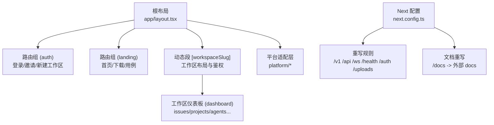
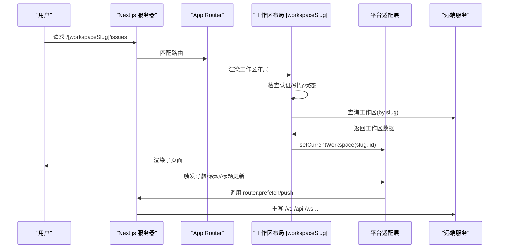
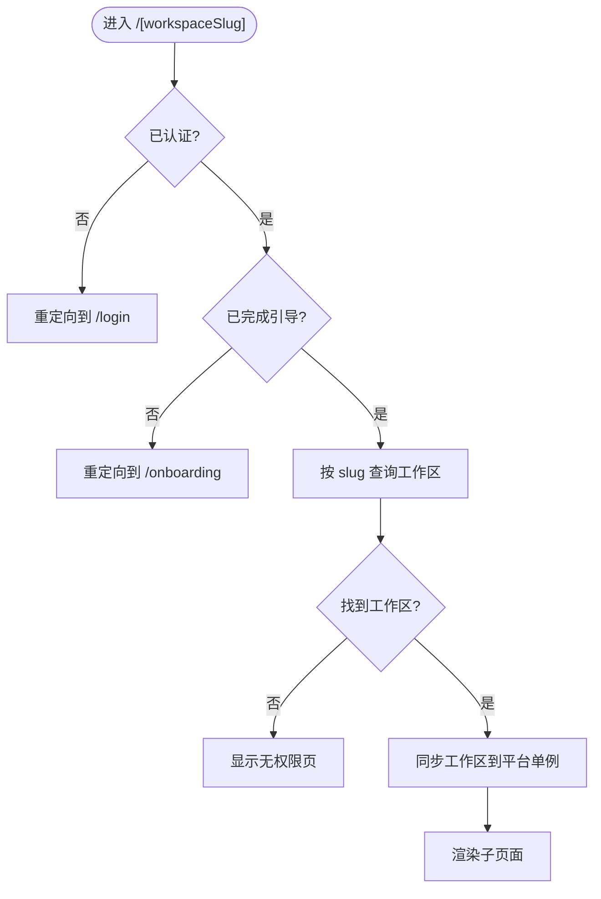
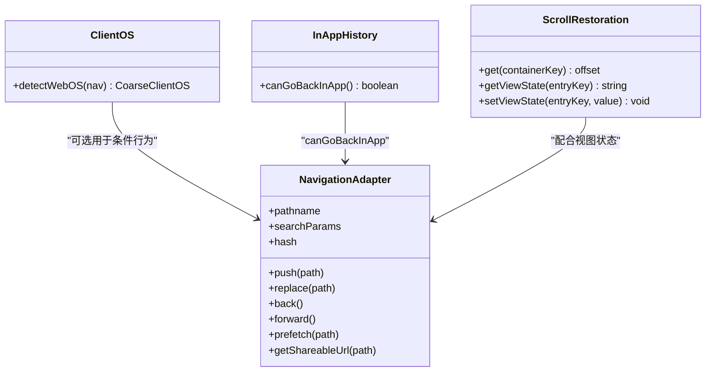
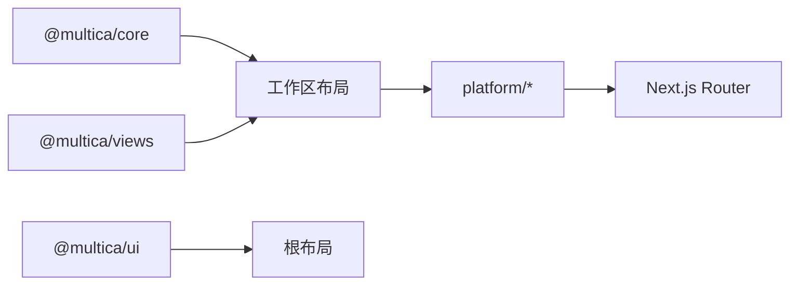

# Web 应用架构

<cite>
**本文引用的文件**
- [apps/web/next.config.ts](file://apps/web/next.config.ts)
- [apps/web/package.json](file://apps/web/package.json)
- [apps/web/app/layout.tsx](file://apps/web/app/layout.tsx)
- [apps/web/app/[workspaceSlug]/layout.tsx](file://apps/web/app/[workspaceSlug]/layout.tsx)
- [apps/web/platform/client-os.ts](file://apps/web/platform/client-os.ts)
- [apps/web/platform/in-app-history.ts](file://apps/web/platform/in-app-history.ts)
- [apps/web/platform/navigation.tsx](file://apps/web/platform/navigation.tsx)
- [apps/web/platform/scroll-restoration.tsx](file://apps/web/platform/scroll-restoration.tsx)
- [apps/web/platform/document-title.ts](file://apps/web/platform/document-title.ts)
</cite>

## 目录
1. [简介](#简介)
2. [项目结构](#项目结构)
3. [核心组件](#核心组件)
4. [架构总览](#架构总览)
5. [详细组件分析](#详细组件分析)
6. [依赖关系分析](#依赖关系分析)
7. [性能考量](#性能考量)
8. [故障排查指南](#故障排查指南)
9. [结论](#结论)
10. [附录：开发与最佳实践](#附录开发与最佳实践)

## 简介
本文件面向 Multica 的 Next.js Web 应用（位于 apps/web），系统性说明 App Router 路由组织、页面分组与布局系统；工作空间路由模式 [workspaceSlug] 的实现机制；平台适配层 platform/ 的设计（客户端操作系统检测、应用内历史管理、滚动恢复等）；国际化支持、主题系统、错误边界处理；以及构建配置、代理设置、SEO 优化等关键特性，并给出开发指南与最佳实践。

## 项目结构
- 入口与全局布局
  - 根布局负责字体注入、视口与 SEO metadata、主题提供者、Web 运行时提供者（包含 API Base URL、WebSocket URL、国际化资源）。
- 路由与分组
  - (auth)、(landing) 为路由组，用于共享布局与权限控制。
  - [workspaceSlug] 为动态段，承载多工作区隔离与鉴权前置逻辑。
  - 各业务模块在 [workspaceSlug]/(dashboard) 下按功能划分。
- 平台适配层
  - platform/ 提供跨平台能力：OS 检测、导航适配器、滚动恢复、文档标题格式化等。
- 构建与代理
  - next.config.ts 定义 rewrites、图片格式、开发允许来源、MDX 集成等。
  - package.json 提供 dev/build/start 脚本与依赖声明。

**图示来源**
- [apps/web/app/layout.tsx:1-172](file://apps/web/app/layout.tsx#L1-L172)
- [apps/web/next.config.ts:41-98](file://apps/web/next.config.ts#L41-L98)

**章节来源**
- [apps/web/app/layout.tsx:1-172](file://apps/web/app/layout.tsx#L1-L172)
- [apps/web/next.config.ts:1-107](file://apps/web/next.config.ts#L1-L107)
- [apps/web/package.json:1-48](file://apps/web/package.json#L1-L48)

## 核心组件
- 根布局与 SEO
  - 通过 Metadata 设置站点标题模板、描述、图标、Open Graph/Twitter 卡片、robots 策略与 canonical。
  - 注入字体变量与 CSS 类名，统一字体栈与抗锯齿。
  - 注入 WebProviders，传入 locale、resources、API Base URL、WS URL。
- 工作区布局
  - 校验认证状态与 onboarding 状态，未登录重定向到登录页；未完成引导重定向到引导流程。
  - 基于 slug 查询工作区信息，渲染前同步当前工作区到平台单例，确保后续请求头正确。
  - 写入 last_workspace_slug Cookie，便于下次访问快速定位。
  - 根据工作区存在性显示加载态或无权限提示。
- 平台适配层
  - OS 检测：将 navigator.platform/userAgent 归并为粗粒度 OS 类型。
  - 应用内历史：基于 Navigation API 判断“能否返回且仍在应用内”。
  - 导航适配器：封装 router.push/replace/back/forward/prefetch，暴露 pathname/searchParams/hash 与可分享 URL。
  - 滚动恢复：捕获带 data-tab-scroll-root 的容器滚动位置，按 pathname::containerKey 持久化并在挂载时恢复。
  - 文档标题：集中管理站点标题、后缀与模板，裁剪超长标题避免书签/历史过长。

**章节来源**
- [apps/web/app/layout.tsx:66-120](file://apps/web/app/layout.tsx#L66-L120)
- [apps/web/app/layout.tsx:122-172](file://apps/web/app/layout.tsx#L122-L172)
- [apps/web/app/[workspaceSlug]/layout.tsx:16-134](file://apps/web/app/[workspaceSlug]/layout.tsx#L16-L134)
- [apps/web/platform/client-os.ts:1-25](file://apps/web/platform/client-os.ts#L1-L25)
- [apps/web/platform/in-app-history.ts:1-40](file://apps/web/platform/in-app-history.ts#L1-L40)
- [apps/web/platform/navigation.tsx:1-111](file://apps/web/platform/navigation.tsx#L1-L111)
- [apps/web/platform/scroll-restoration.tsx:1-123](file://apps/web/platform/scroll-restoration.tsx#L1-L123)
- [apps/web/platform/document-title.ts:1-61](file://apps/web/platform/document-title.ts#L1-L61)

## 架构总览
下图展示从浏览器到 Next.js Server/Client 的关键路径：静态路由与动态路由由 App Router 解析；/docs 被重写至外部文档站；/v1、/api、/ws、/health、/auth、/uploads 被重写至远端 API；工作区路由在进入后立即进行鉴权与工作区解析，再进入具体页面。

**图示来源**
- [apps/web/next.config.ts:51-96](file://apps/web/next.config.ts#L51-L96)
- [apps/web/app/[workspaceSlug]/layout.tsx:29-81](file://apps/web/app/[workspaceSlug]/layout.tsx#L29-L81)
- [apps/web/platform/navigation.tsx:78-95](file://apps/web/platform/navigation.tsx#L78-L95)

## 详细组件分析

### App Router 路由组织与布局系统
- 路由组
  - (auth)：登录、邀请、引导、新建工作区等受保护或流程型页面。
  - (landing)：营销与公共内容页，如首页、下载、用例详情。
- 动态段
  - [workspaceSlug]：所有工作区相关页面的父级布局，承担鉴权、工作区解析、Cookie 写入与平台上下文同步。
- 嵌套布局
  - [workspaceSlug]/(dashboard)/layout.tsx：仪表板级布局，承载侧边栏、头部等。
  - 各业务页面在 dashboard 下以功能维度组织。

**图示来源**
- [apps/web/app/[workspaceSlug]/layout.tsx:29-121](file://apps/web/app/[workspaceSlug]/layout.tsx#L29-L121)

**章节来源**
- [apps/web/app/[workspaceSlug]/layout.tsx:16-134](file://apps/web/app/[workspaceSlug]/layout.tsx#L16-L134)

### 工作空间路由模式 [workspaceSlug] 实现机制
- 认证与引导门控：未登录直接跳转登录；未完成引导跳转引导流程。
- 工作区解析：使用 TanStack Query 按 slug 获取工作区，仅在身份确认后启用查询。
- 平台上下文同步：在渲染阶段将 slug 与 id 同步到平台单例，保证后续请求头与实时连接正确绑定。
- Cookie 持久化：写入 last_workspace_slug，便于下次访问快速定位。
- 容错与体验：在列表尚未就绪时显示加载指示；若工作区不存在则显示无权限页；对已见过的 slug 在删除/离开过程中短暂渲染 null 避免闪烁。

**章节来源**
- [apps/web/app/[workspaceSlug]/layout.tsx:29-121](file://apps/web/app/[workspaceSlug]/layout.tsx#L29-L121)

### 平台适配层 platform/ 设计
- 客户端操作系统检测
  - 将 navigator.platform 与 userAgent 合并后匹配，输出 macos/windows/linux/ios/android/chromeos/unknown 之一，不保留原始 UA。
- 应用内历史管理
  - 基于 Navigation API 的 entries() 判断“返回是否仍在应用内”，避免从外部链接进入时误退到浏览器历史。
- 滚动恢复
  - 捕获标记为 data-tab-scroll-root 的容器滚动位置，按 pathname::containerKey 保存 top/height；挂载时读取并恢复，同时维护视图状态键值对。
  - 恢复期间抑制滚动事件，防止覆盖刚恢复的位置。
- 导航适配器
  - 封装 Next router 的 push/replace/back/forward/prefetch，暴露 pathname/searchParams/hash 与 getShareableUrl。
  - 监听 multica:navigate 自定义事件，支持背景/前台标签打开。
- 文档标题
  - 集中管理站点标题、后缀与模板；提供裁剪函数避免超长标题影响书签/历史记录可读性。

**图示来源**
- [apps/web/platform/client-os.ts:1-25](file://apps/web/platform/client-os.ts#L1-L25)
- [apps/web/platform/in-app-history.ts:25-39](file://apps/web/platform/in-app-history.ts#L25-L39)
- [apps/web/platform/scroll-restoration.tsx:56-123](file://apps/web/platform/scroll-restoration.tsx#L56-L123)
- [apps/web/platform/navigation.tsx:78-95](file://apps/web/platform/navigation.tsx#L78-L95)

**章节来源**
- [apps/web/platform/client-os.ts:1-25](file://apps/web/platform/client-os.ts#L1-L25)
- [apps/web/platform/in-app-history.ts:1-40](file://apps/web/platform/in-app-history.ts#L1-L40)
- [apps/web/platform/scroll-restoration.tsx:1-123](file://apps/web/platform/scroll-restoration.tsx#L1-L123)
- [apps/web/platform/navigation.tsx:1-111](file://apps/web/platform/navigation.tsx#L1-L111)
- [apps/web/platform/document-title.ts:1-61](file://apps/web/platform/document-title.ts#L1-L61)

### 国际化、主题系统与错误边界
- 国际化
  - 根布局通过 getRequestLocale 决定语言，并将对应资源注入 WebProviders，供 views 层使用。
  - HTML lang 与字体族根据语言选择，确保 CJK 回退链正确。
- 主题系统
  - 通过 ThemeProvider 包裹应用，结合 Tailwind 与 CSS 变量实现明暗主题切换。
- 错误边界
  - global-error.tsx 提供全局错误边界（文件存在于 app 目录），用于捕获未处理的 React 错误。
  - not-found.tsx 提供 404 页面。

**章节来源**
- [apps/web/app/layout.tsx:122-172](file://apps/web/app/layout.tsx#L122-L172)
- [apps/web/app/global-error.tsx](file://apps/web/app/global-error.tsx)
- [apps/web/app/not-found.tsx](file://apps/web/app/not-found.tsx)

### 构建配置、代理设置与 SEO 优化
- 构建与运行
  - package.json 中 scripts 使用 next dev --webpack、next build --webpack，兼容 MDX 与 Turbopack 限制。
  - transpilePackages 将 @multica/core、@multica/ui、@multica/views 纳入转译。
- 重写与代理
  - beforeFiles：将 /docs 与 /docs/:path* 重写至外部文档站。
  - afterFiles：将 /v1/:path*、/api/:path*、/ws、/health、/auth/:path*、/uploads/:path* 重写至远端 API。
  - 开发环境允许 CORS_ALLOWED_ORIGINS 中的主机用于 HMR/Webpack 跨域。
- 图片与性能
  - images.formats 启用 AVIF/WebP，qualities 设定压缩等级。
- SEO
  - metadataBase、title.template、description、icons、appleWebApp、openGraph、twitter、alternates.canonical、robots 均已在根布局设置。
  - document-title.ts 统一管理标题后缀与长度裁剪，避免长标题污染书签/历史。

**章节来源**
- [apps/web/package.json:6-15](file://apps/web/package.json#L6-L15)
- [apps/web/next.config.ts:17-49](file://apps/web/next.config.ts#L17-L49)
- [apps/web/next.config.ts:51-96](file://apps/web/next.config.ts#L51-L96)
- [apps/web/app/layout.tsx:66-120](file://apps/web/app/layout.tsx#L66-L120)
- [apps/web/platform/document-title.ts:15-61](file://apps/web/platform/document-title.ts#L15-L61)

## 依赖关系分析
- 运行时依赖
  - Next.js 作为框架，React/ReactDOM 作为 UI 运行时。
  - @tanstack/react-query 用于服务端状态缓存与请求。
  - fumadocs-mdx 用于文档 MDX 集成。
- 包边界约束
  - packages/core 禁用 react-dom/localStorage/process.env；packages/ui 不得 import @multica/core；apps/web/platform 是唯一可用 Next.js API 之处。
- 组件耦合
  - 工作区布局依赖 core 的路径与查询选项，views 的无权限页与欢迎弹窗。
  - 平台适配层依赖 views 的 NavigationProvider/ScrollRestorationProvider 抽象。

**图示来源**
- [apps/web/app/[workspaceSlug]/layout.tsx:1-15](file://apps/web/app/[workspaceSlug]/layout.tsx#L1-L15)
- [apps/web/platform/navigation.tsx:1-10](file://apps/web/platform/navigation.tsx#L1-L10)

**章节来源**
- [apps/web/package.json:16-31](file://apps/web/package.json#L16-L31)

## 性能考量
- 预取与路由优化
  - 导航适配器调用 router.prefetch，生产环境下预热 RSC 与路由 chunk，减少二次跳转延迟。
- 图片优化
  - 启用 AVIF/WebP 与多级质量，降低首屏与富媒体体积。
- 字体与布局抖动
  - next/font 注入变量与合成回退字体，避免 FOUT；CJK 回退链在 CSS 中维护，保持 CSP 安全与桌面端一致。
- 滚动恢复抑制
  - 恢复期间短时抑制滚动事件，避免覆盖恢复位置导致的闪烁。

[本节为通用指导，无需特定文件引用]

## 故障排查指南
- 工作区空白或白屏
  - 检查认证状态与 onboarding 状态；确认工作区查询是否成功；查看 last_workspace_slug Cookie 是否正确写入。
- 无法返回或误退出应用
  - 确认 Navigation API 可用性；在不支持的环境下会降级为 false，调用方应走 fallback 路径。
- 返回列表回到顶部
  - 确认容器带有 data-tab-scroll-root；检查滚动恢复 provider 是否挂载；查看 suppressedUntil 是否导致事件被抑制过久。
- 标题异常或过长
  - 使用 formatDocumentTitle 生成标题；确认 TITLE_TEMPLATE 与 TITLE_SUFFIX 未被覆盖；检查超长标题是否被正确裁剪。

**章节来源**
- [apps/web/app/[workspaceSlug]/layout.tsx:29-121](file://apps/web/app/[workspaceSlug]/layout.tsx#L29-L121)
- [apps/web/platform/in-app-history.ts:25-39](file://apps/web/platform/in-app-history.ts#L25-L39)
- [apps/web/platform/scroll-restoration.tsx:56-123](file://apps/web/platform/scroll-restoration.tsx#L56-L123)
- [apps/web/platform/document-title.ts:15-61](file://apps/web/platform/document-title.ts#L15-L61)

## 结论
该 Web 应用基于 Next.js App Router，采用路由组与动态段组织页面，工作区路由在布局层完成鉴权、解析与平台上下文同步；platform/ 提供跨平台能力，统一导航、滚动恢复与标题管理；构建与重写规则将文档与 API 透明转发；SEO 与字体策略保障可发现性与视觉一致性。遵循包边界与状态分层约定，可在多端保持一致的用户体验。

## 附录：开发与最佳实践
- 开发启动
  - 使用 package.json 的 dev/build/start 脚本；开发模式通过 --webpack 规避 Turbopack 与 MDX 的不兼容。
- 环境变量与代理
  - 通过 next.config.ts 的 rewrites 将 /v1、/api、/ws、/health、/auth、/uploads 指向远端；/docs 指向外部文档站。
  - 开发时可通过 CORS_ALLOWED_ORIGINS 允许跨源 HMR。
- 路由与布局
  - 新增页面优先放入合适的路由组；工作区相关页面放在 [workspaceSlug] 下，避免破坏鉴权与上下文。
- 平台适配
  - 需要跨平台能力时，优先在 platform/ 中实现，并通过 views 提供的 Provider 接入。
- 国际化与主题
  - 通过根布局注入 locale 与 resources；使用 ThemeProvider 管理主题；避免在业务组件中直接操作 document.title。
- 性能
  - 合理使用 router.prefetch；利用 images 优化；谨慎引入大字体与复杂动画。

**章节来源**
- [apps/web/package.json:6-15](file://apps/web/package.json#L6-L15)
- [apps/web/next.config.ts:17-49](file://apps/web/next.config.ts#L17-L49)
- [apps/web/next.config.ts:51-96](file://apps/web/next.config.ts#L51-L96)
- [apps/web/app/layout.tsx:122-172](file://apps/web/app/layout.tsx#L122-L172)