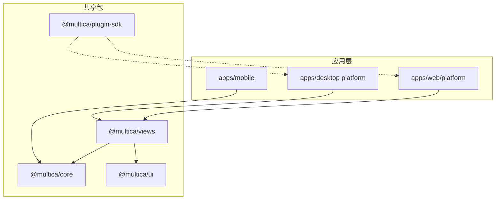
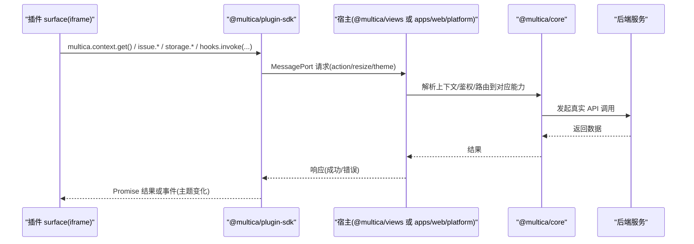
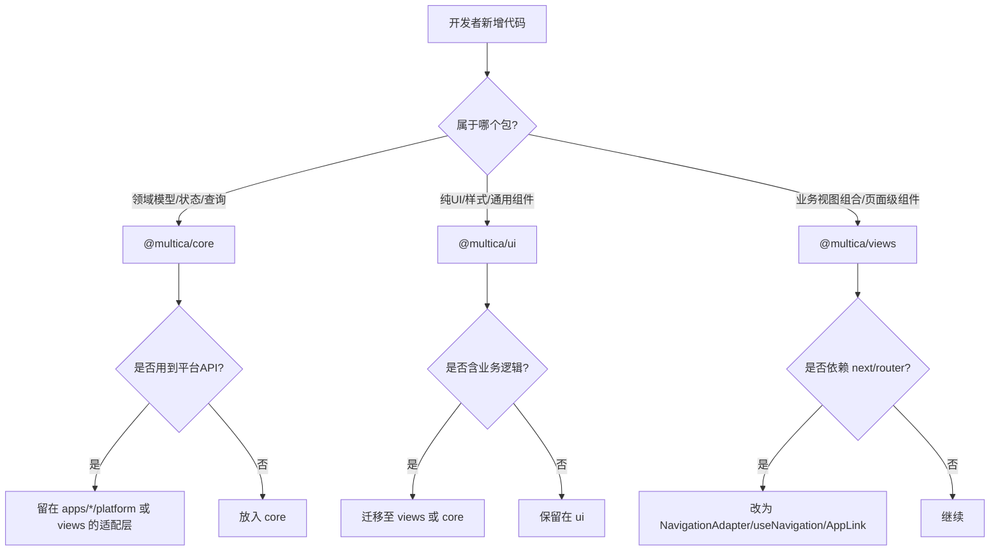
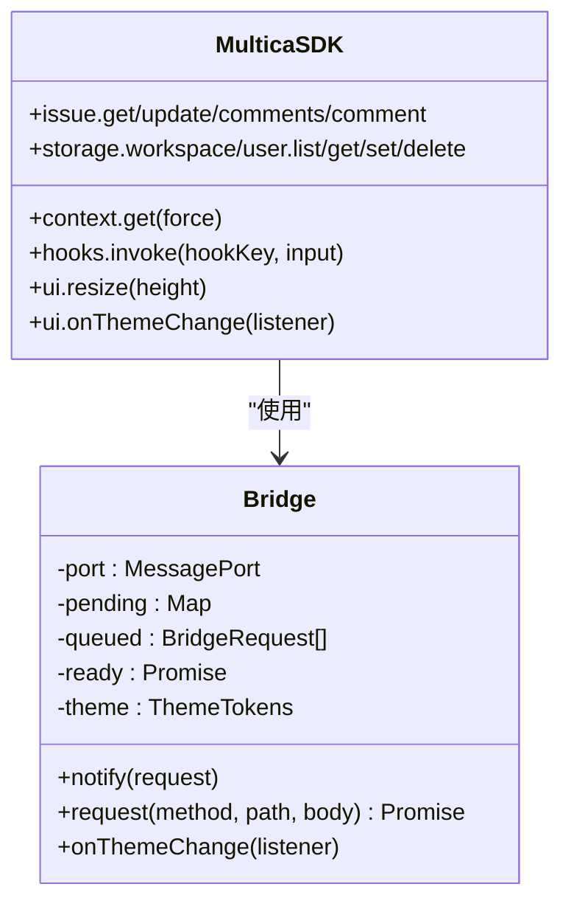
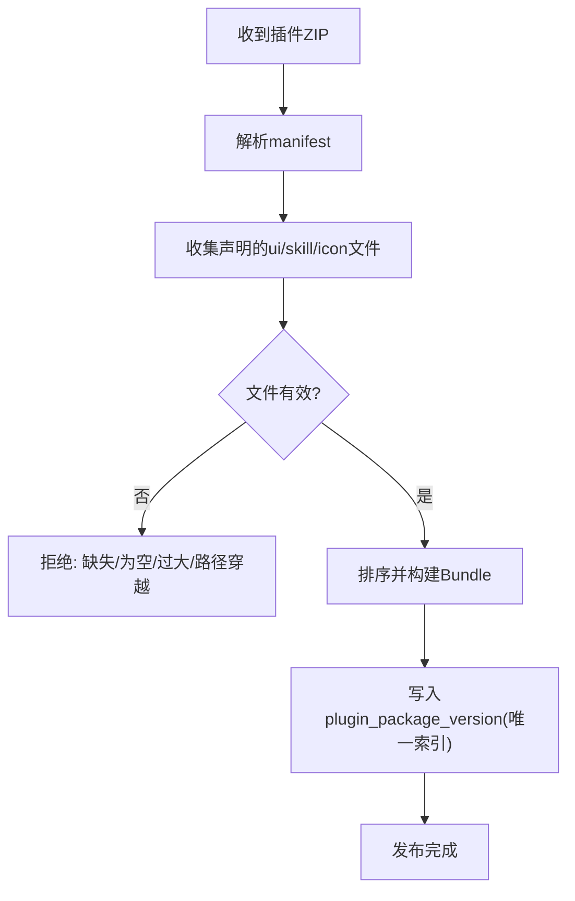
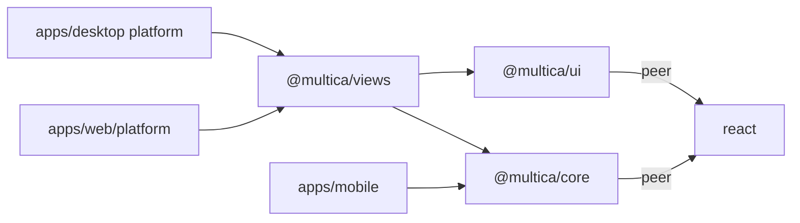

# 共享包设计

<cite>
**本文引用的文件**
- [packages/core/package.json](file://packages/core/package.json)
- [packages/ui/package.json](file://packages/ui/package.json)
- [packages/views/package.json](file://packages/views/package.json)
- [packages/plugin-sdk/index.ts](file://packages/plugin-sdk/index.ts)
- [packages/plugin-sdk/protocol.ts](file://packages/plugin-sdk/protocol.ts)
- [apps/docs/content/docs/developers/conventions.mdx](file://apps/docs/content/docs/developers/conventions.mdx)
- [CLAUDE.md](file://CLAUDE.md)
- [server/pkg/plugincontract/bundle.go](file://server/pkg/plugincontract/bundle.go)
- [server/pkg/plugincontract/bundle_test.go](file://server/pkg/plugincontract/bundle_test.go)
- [server/migrations/392_plugin_package_publishing.up.sql](file://server/migrations/392_plugin_package_publishing.up.sql)
- [server/migrations/394_plugin_package_version_unique_index.up.sql](file://server/migrations/394_plugin_package_version_unique_index.up.sql)
- [server/migrations/397_plugin_installation_package_version_index.up.sql](file://server/migrations/397_plugin_installation_package_version_index.up.sql)
</cite>

## 目录
1. [简介](#简介)
2. [项目结构](#项目结构)
3. [核心组件](#核心组件)
4. [架构总览](#架构总览)
5. [详细组件分析](#详细组件分析)
6. [依赖关系分析](#依赖关系分析)
7. [性能与可维护性](#性能与可维护性)
8. [故障排查指南](#故障排查指南)
9. [结论](#结论)
10. [附录：版本管理与兼容性策略](#附录：版本管理与兼容性策略)

## 简介
本文件面向 Multica 前端共享包体系，系统性说明包边界约束、职责划分、插件 SDK 的设计模式与扩展点，并给出包版本管理、API 稳定性保证与向后兼容策略，以及包开发规范与最佳实践。目标是让读者在不深入源码的情况下也能正确理解并遵守“硬约束”的包边界，安全地扩展系统能力。

## 项目结构
Multica 采用 pnpm workspace + Turborepo 单体仓库组织，关键共享包位于 packages 目录：
- @multica/core：无 UI、无平台 API 的核心领域模型、查询/变更、状态与工具；禁止引入 react-dom、localStorage、process.env 与 UI 库。
- @multica/ui：纯 UI 原子组件与样式工具，不依赖 @multica/core，不包含业务逻辑。
- @multica/views：基于 core 与 ui 的业务视图组合层，禁止直接依赖 next/* 与 react-router-dom，通过 NavigationAdapter 等抽象进行导航。
- @multica/plugin-sdk：插件表面（surface）运行在沙箱 iframe 中的零依赖 SDK，通过 MessagePort 桥接宿主执行受控操作。

**图表来源**
- [packages/core/package.json:11-163](file://packages/core/package.json#L11-L163)
- [packages/ui/package.json:10-28](file://packages/ui/package.json#L10-L28)
- [packages/views/package.json:11-58](file://packages/views/package.json#L11-L58)
- [packages/plugin-sdk/index.ts:1-13](file://packages/plugin-sdk/index.ts#L1-L13)

**章节来源**
- [apps/docs/content/docs/developers/conventions.mdx:27-40](file://apps/docs/content/docs/developers/conventions.mdx#L27-L40)
- [CLAUDE.md:49-72](file://CLAUDE.md#L49-L72)

## 核心组件
- @multica/core
  - 职责：领域模型、数据访问（TanStack Query）、客户端状态（Zustand store 仅位于 core）、国际化、特性开关、平台抽象（StorageAdapter、NavigationAdapter 等）。
  - 约束：不得依赖 react-dom、localStorage、process.env、UI 库；对外暴露稳定的导出入口（见 package.json exports）。
- @multica/ui
  - 职责：跨端一致的 UI 原子组件、Markdown 渲染工具、表格/虚拟滚动等通用能力。
  - 约束：不得 import @multica/core，不得包含业务逻辑；仅依赖 React 生态与样式工具。
- @multica/views
  - 职责：将 core 的能力组合为业务视图（问题、项目、聊天、仪表盘、工作区等），并通过 NavigationAdapter 统一导航。
  - 约束：不得直接依赖 next/* 与 react-router-dom；stores 不在该层。
- @multica/plugin-sdk
  - 职责：插件 surface 的唯一入口，提供 context、issue、storage、hooks.invoke、ui.resize/onThemeChange 等能力。
  - 约束：零运行时依赖，不 import @multica/core/@multica/ui；通过协议与宿主通信，所有调用由宿主以当前用户会话执行。

**章节来源**
- [packages/core/package.json:11-163](file://packages/core/package.json#L11-L163)
- [packages/ui/package.json:10-28](file://packages/ui/package.json#L10-L28)
- [packages/views/package.json:11-58](file://packages/views/package.json#L11-L58)
- [packages/plugin-sdk/index.ts:1-13](file://packages/plugin-sdk/index.ts#L1-L13)

## 架构总览
下图展示插件 surface 与宿主之间的安全通信路径，以及各包在其中的角色。

**图表来源**
- [packages/plugin-sdk/index.ts:155-167](file://packages/plugin-sdk/index.ts#L155-L167)
- [packages/plugin-sdk/index.ts:199-271](file://packages/plugin-sdk/index.ts#L199-L271)
- [packages/plugin-sdk/protocol.ts:20-56](file://packages/plugin-sdk/protocol.ts#L20-L56)

## 详细组件分析

### 包边界与职责约束
- @multica/core
  - 禁止：react-dom、localStorage、process.env、UI 库。
  - 允许：React peer、TanStack Query、Zustand、i18next、工具库等。
  - 导出面：按功能域拆分（issues、inbox、chat、agents、runtimes、billing、realtime、navigation、modals、onboarding、platform、i18n、skills 等）。
- @multica/ui
  - 禁止：import @multica/core、业务逻辑。
  - 允许：React 生态、样式与可视化库（peerDependencies）。
- @multica/views
  - 禁止：next/*、react-router-dom、stores。
  - 允许：依赖 @multica/core 与 @multica/ui，使用 NavigationAdapter 进行导航。

**图表来源**
- [packages/core/package.json:164-176](file://packages/core/package.json#L164-L176)
- [packages/ui/package.json:29-64](file://packages/ui/package.json#L29-L64)
- [packages/views/package.json:59-123](file://packages/views/package.json#L59-L123)
- [apps/docs/content/docs/developers/conventions.mdx:27-40](file://apps/docs/content/docs/developers/conventions.mdx#L27-L40)
- [CLAUDE.md:49-72](file://CLAUDE.md#L49-L72)

**章节来源**
- [apps/docs/content/docs/developers/conventions.mdx:27-40](file://apps/docs/content/docs/developers/conventions.mdx#L27-L40)
- [CLAUDE.md:49-72](file://CLAUDE.md#L49-L72)

### 插件 SDK 设计与扩展点
- 安全模型
  - surface 运行在沙箱 iframe，无凭据，不能直连后端；所有操作经 MessagePort 交由宿主以当前用户会话执行。
  - 协议版本化（BRIDGE_PROTOCOL_VERSION=2），通道绑定 MessagePort，非 origin。
- 能力面
  - context：获取 workspace/user/issue/config/granted_net_domains。
  - issue：读取/更新问题、评论列表与创建评论。
  - storage：workspace/user 两级键值存储（list/get/set/delete）。
  - hooks.invoke：调用本插件声明的 ui 触发钩子，经宿主签名、限流、域名授权与短效回调令牌保护。
  - ui：resize 高度、订阅主题 token 变化。
- 扩展点
  - 通过 manifest 声明 surfaces 与 resources（技能），宿主校验并加载。
  - 通过 granted_net_domains 限制外部网络访问范围。
  - 通过 hooks 机制实现前后端联动。

**图表来源**
- [packages/plugin-sdk/index.ts:90-168](file://packages/plugin-sdk/index.ts#L90-L168)
- [packages/plugin-sdk/index.ts:199-271](file://packages/plugin-sdk/index.ts#L199-L271)
- [packages/plugin-sdk/protocol.ts:20-56](file://packages/plugin-sdk/protocol.ts#L20-L56)

**章节来源**
- [packages/plugin-sdk/index.ts:1-13](file://packages/plugin-sdk/index.ts#L1-L13)
- [packages/plugin-sdk/index.ts:155-167](file://packages/plugin-sdk/index.ts#L155-L167)
- [packages/plugin-sdk/index.ts:199-271](file://packages/plugin-sdk/index.ts#L199-L271)
- [packages/plugin-sdk/protocol.ts:20-56](file://packages/plugin-sdk/protocol.ts#L20-L56)

### 插件打包与发布校验
- 宿主侧对插件 bundle 进行严格校验：
  - 必须存在 manifest，且只允许清单中声明的文件被加载。
  - 拒绝路径穿越、超大文件、空入口、顶层 import 等不安全行为。
  - 资源（技能）与图标也需满足大小与内容约束。
- 数据库层通过唯一索引确保“已发布版本不可变”，保障“管理员审批的版本”与“浏览器运行的字节”一致。

**图表来源**
- [server/pkg/plugincontract/bundle.go:199-238](file://server/pkg/plugincontract/bundle.go#L199-L238)
- [server/pkg/plugincontract/bundle_test.go:44-205](file://server/pkg/plugincontract/bundle_test.go#L44-L205)
- [server/migrations/392_plugin_package_publishing.up.sql:32-52](file://server/migrations/392_plugin_package_publishing.up.sql#L32-L52)
- [server/migrations/394_plugin_package_version_unique_index.up.sql:1-4](file://server/migrations/394_plugin_package_version_unique_index.up.sql#L1-L4)

**章节来源**
- [server/pkg/plugincontract/bundle.go:199-238](file://server/pkg/plugincontract/bundle.go#L199-L238)
- [server/pkg/plugincontract/bundle_test.go:44-205](file://server/pkg/plugincontract/bundle_test.go#L44-L205)
- [server/migrations/392_plugin_package_publishing.up.sql:32-52](file://server/migrations/392_plugin_package_publishing.up.sql#L32-L52)
- [server/migrations/394_plugin_package_version_unique_index.up.sql:1-4](file://server/migrations/394_plugin_package_version_unique_index.up.sql#L1-L4)

## 依赖关系分析
- 包间依赖
  - @multica/views 依赖 @multica/core 与 @multica/ui。
  - @multica/ui 不依赖 @multica/core。
  - @multica/core 不依赖任何 app-specific 包。
- 应用层依赖
  - apps/web/platform 是唯一可使用 Next.js 平台 API 的位置。
  - apps/desktop 的 renderer platform 是唯一使用 react-router-dom 的位置。
  - apps/mobile 仅从 @multica/core 导入类型与纯函数。

**图表来源**
- [packages/core/package.json:164-176](file://packages/core/package.json#L164-L176)
- [packages/ui/package.json:29-64](file://packages/ui/package.json#L29-L64)
- [packages/views/package.json:59-123](file://packages/views/package.json#L59-L123)
- [apps/docs/content/docs/developers/conventions.mdx:27-40](file://apps/docs/content/docs/developers/conventions.mdx#L27-L40)

**章节来源**
- [packages/core/package.json:164-176](file://packages/core/package.json#L164-L176)
- [packages/ui/package.json:29-64](file://packages/ui/package.json#L29-L64)
- [packages/views/package.json:59-123](file://packages/views/package.json#L59-L123)
- [apps/docs/content/docs/developers/conventions.mdx:27-40](file://apps/docs/content/docs/developers/conventions.mdx#L27-L40)

## 性能与可维护性
- 包边界即契约：通过 ESLint 规则与约定强制，避免隐式耦合与运行时污染。
- 零依赖 SDK：@multica/plugin-sdk 无运行时依赖，减少第三方升级风险与体积。
- 稳定导出面：core 通过 exports 字段精细控制模块粒度，便于按需加载与 Tree-shaking。
- 可观测与诊断：core 暴露 diagnostics、analytics、client-usage 等能力，便于定位问题。
- 状态分层清晰：服务端状态由 TanStack Query 管理，客户端/视图状态由 Zustand 管理，避免重复缓存与不一致。

[本节为通用指导，无需具体文件引用]

## 故障排查指南
- 插件无法加载或报错
  - 检查 manifest 是否完整、入口文件是否存在且非空。
  - 确认未出现顶层 import 或路径穿越；文件大小是否在限制内。
  - 参考宿主侧 bundle 校验失败用例。
- 主题不生效或尺寸异常
  - 确认 surface 已通过 onThemeChange 订阅主题变化。
  - 使用 ui.resize 调整 iframe 高度，避免溢出或留白。
- 包边界违规导致构建失败
  - 在 views 中误用 next/* 或 react-router-dom：改用 NavigationAdapter/useNavigation/AppLink。
  - 在 core 中误用 localStorage/process.env/react-dom：抽取到平台适配层或替换为 StorageAdapter。
  - 在 ui 中引入 @multica/core 或业务逻辑：迁移到 views 或 core。

**章节来源**
- [server/pkg/plugincontract/bundle_test.go:90-205](file://server/pkg/plugincontract/bundle_test.go#L90-L205)
- [packages/plugin-sdk/index.ts:143-167](file://packages/plugin-sdk/index.ts#L143-L167)
- [packages/plugin-sdk/index.ts:261-271](file://packages/plugin-sdk/index.ts#L261-L271)
- [apps/docs/content/docs/developers/conventions.mdx:27-40](file://apps/docs/content/docs/developers/conventions.mdx#L27-L40)
- [CLAUDE.md:49-72](file://CLAUDE.md#L49-L72)

## 结论
Multica 的共享包体系通过严格的包边界、清晰的职责划分与安全可控的插件 SDK，实现了跨端复用、可扩展与高可维护性。遵循本文的约束与实践，可在不破坏现有架构的前提下安全地扩展能力、演进 API 并降低长期维护成本。

[本节为总结，无需具体文件引用]

## 附录：版本管理与兼容性策略
- 包版本管理
  - 共享包使用 workspace:* 引用，统一由 workspace 管理；公共依赖通过 catalog 集中声明，避免版本漂移。
  - 插件包版本在数据库中通过唯一索引保证“一次发布即不可变”，确保线上运行与审批版本一致。
- API 稳定性与向后兼容
  - 插件 SDK 通过协议版本（BRIDGE_PROTOCOL_VERSION）与消息类型守卫（isBridgeResponse/isBridgeEvent/isBridgeRequest）保证向前/向后兼容。
  - 对缺失键/不存在资源返回明确状态码（如 404），调用方可区分“业务空结果”与“错误”。
  - 对超时与拒绝场景抛出结构化错误（MulticaPluginError.status），便于上层统一处理。
- 推荐实践
  - 新增能力优先以可选参数或新字段形式扩展，旧字段保持兼容。
  - 对破坏性变更提升主版本号，并提供迁移指引。
  - 在 views 层通过适配器封装平台差异，避免向上游传播不稳定依赖。

**章节来源**
- [packages/plugin-sdk/protocol.ts:20-56](file://packages/plugin-sdk/protocol.ts#L20-L56)
- [packages/plugin-sdk/index.ts:72-81](file://packages/plugin-sdk/index.ts#L72-L81)
- [packages/plugin-sdk/index.ts:155-167](file://packages/plugin-sdk/index.ts#L155-L167)
- [server/migrations/394_plugin_package_version_unique_index.up.sql:1-4](file://server/migrations/394_plugin_package_version_unique_index.up.sql#L1-L4)
- [server/migrations/397_plugin_installation_package_version_index.up.sql:1-4](file://server/migrations/397_plugin_installation_package_version_index.up.sql#L1-L4)