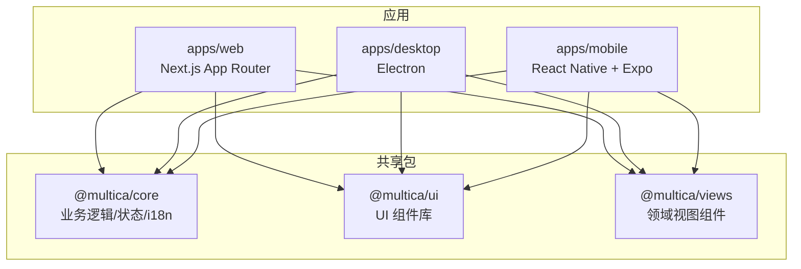
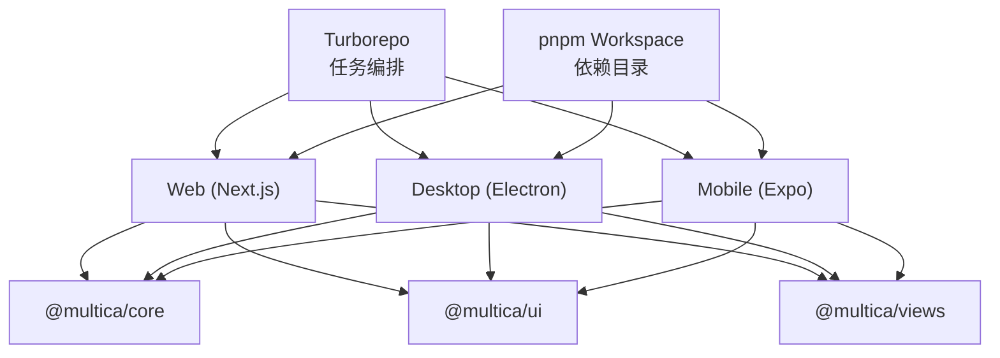
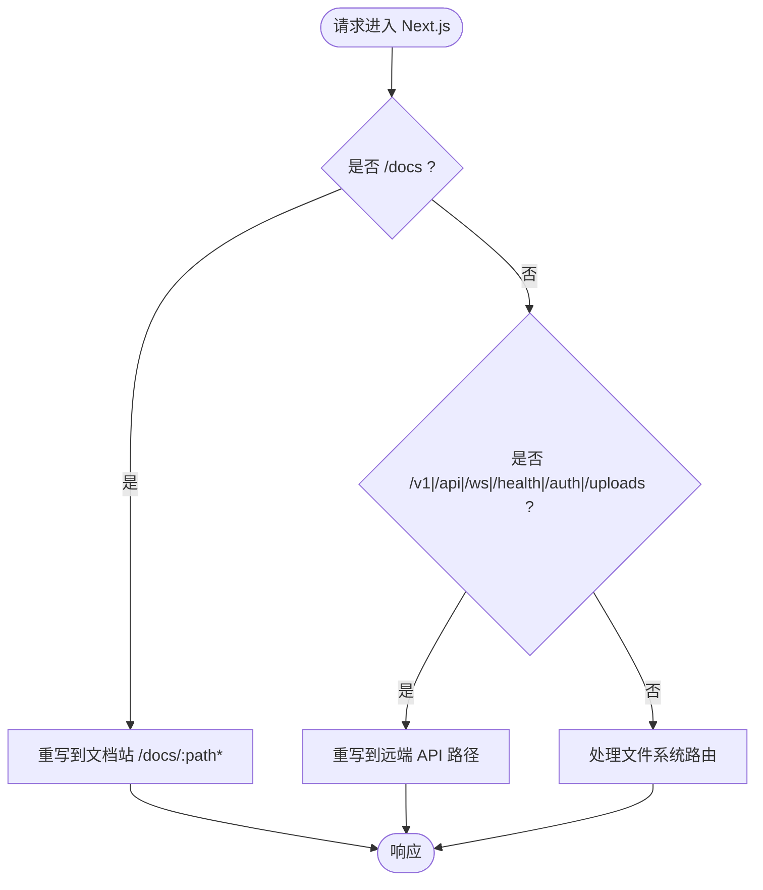
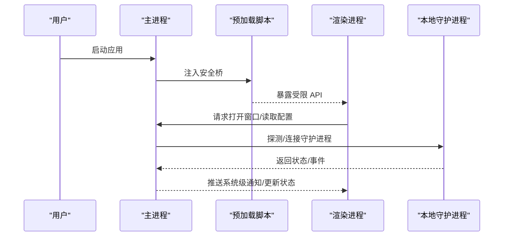
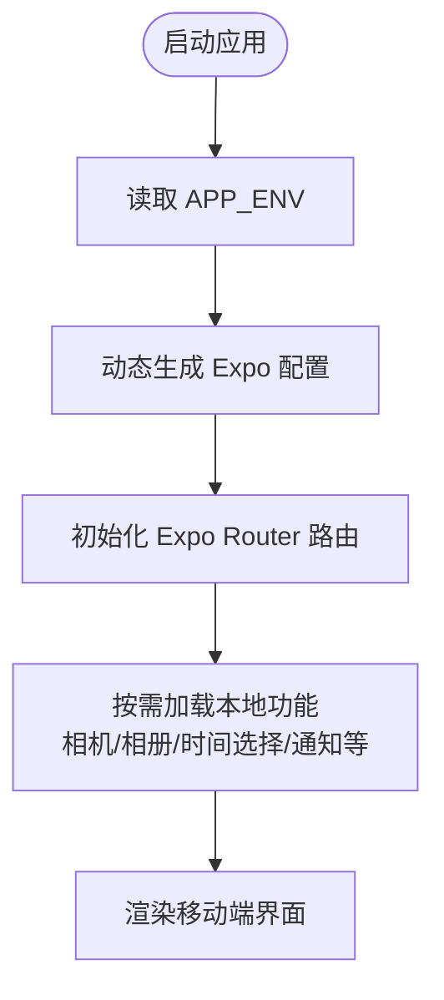
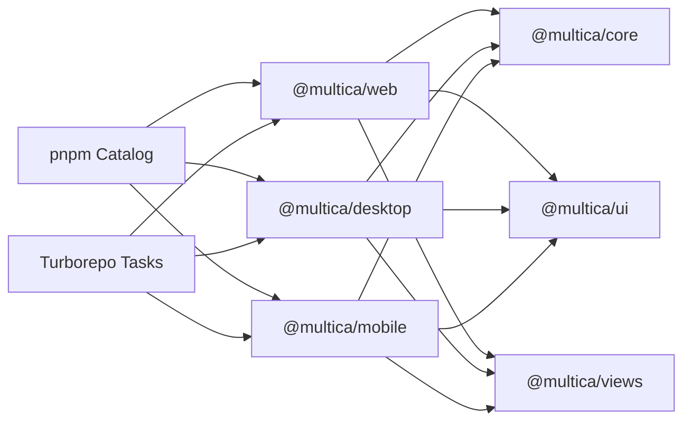

# 前端应用

<cite>
**本文引用的文件**
- [package.json](file://package.json)
- [pnpm-workspace.yaml](file://pnpm-workspace.yaml)
- [turbo.json](file://turbo.json)
- [apps/web/package.json](file://apps/web/package.json)
- [apps/web/next.config.ts](file://apps/web/next.config.ts)
- [apps/desktop/package.json](file://apps/desktop/package.json)
- [apps/desktop/electron.vite.config.ts](file://apps/desktop/electron.vite.config.ts)
- [apps/mobile/package.json](file://apps/mobile/package.json)
- [apps/mobile/app.config.ts](file://apps/mobile/app.config.ts)
- [packages/core/package.json](file://packages/core/package.json)
- [packages/ui/package.json](file://packages/ui/package.json)
- [packages/views/package.json](file://packages/views/package.json)
</cite>

## 目录
1. [简介](#简介)
2. [项目结构](#项目结构)
3. [核心组件](#核心组件)
4. [架构总览](#架构总览)
5. [详细组件分析](#详细组件分析)
6. [依赖关系分析](#依赖关系分析)
7. [性能考量](#性能考量)
8. [故障排查指南](#故障排查指南)
9. [结论](#结论)
10. [附录](#附录)

## 简介
本仓库是一个多平台前端工程，采用 pnpm workspace + Turborepo 管理。包含：
- Next.js Web 应用（App Router）
- Electron 桌面应用（主进程 + 渲染进程）
- React Native 移动应用（Expo + Expo Router）
- 共享包：@multica/core（业务逻辑与状态）、@multica/ui（UI 组件库）、@multica/views（领域视图组件）

关键特性：
- 状态管理分层：TanStack Query 负责服务端状态，Zustand 负责客户端/视图状态；所有共享 Zustand store 位于 @multica/core
- 国际化：i18next + react-i18next，统一在 core 暴露 i18n 能力
- 主题系统：基于 Tailwind 与 next-themes 等工具实现跨端主题
- 构建与开发：Turborepo 任务编排、Vite/Electron-Vite/Next/Expo 多栈并行开发

## 项目结构
顶层通过 pnpm workspace 聚合 apps/* 与 packages/*，并通过 turbo 统一编排 build/dev/test/typecheck/lint 等任务。各子应用职责清晰：
- apps/web：Next.js App Router 站点，提供路由、页面、平台适配层（platform/）与 API 代理
- apps/desktop：Electron 应用，main/preload/renderer 三进程，集成本地守护进程与系统集成
- apps/mobile：React Native 应用，基于 Expo Router 的声明式路由，使用 NativeWind 进行样式适配
- packages/core：业务逻辑、API 客户端、WebSocket、查询与变更、状态存储、导航、权限、国际化等
- packages/ui：无业务逻辑的 UI 组件与工具，遵循“不得 import @multica/core”的边界约束
- packages/views：面向领域的视图组件集合，复用 core 与 ui，不直接依赖 next/* 或 react-router-dom

图表来源
- [pnpm-workspace.yaml:1-4](file://pnpm-workspace.yaml#L1-L4)
- [turbo.json:23-81](file://turbo.json#L23-L81)
- [apps/web/package.json:16-20](file://apps/web/package.json#L16-L20)
- [apps/desktop/package.json:35-59](file://apps/desktop/package.json#L35-L59)
- [apps/mobile/package.json:22-82](file://apps/mobile/package.json#L22-L82)

章节来源
- [package.json:6-30](file://package.json#L6-L30)
- [pnpm-workspace.yaml:1-4](file://pnpm-workspace.yaml#L1-L4)
- [turbo.json:23-81](file://turbo.json#L23-L81)

## 核心组件
- @multica/core
  - 职责：业务模型、API 客户端、WebSocket、查询与变更、Zustand 状态、导航、权限、国际化、技能、实时通信等
  - 导出：按功能域划分（issues、chat、inbox、agents、runtimes、billing、plugins、labels、properties、quick-actions、autopilots、pins、issue-views、github、lark、slack、dingtalk、wecom、telegram、feedback、realtime、navigation、modals、onboarding、paths、hooks、query-client、provider、logger、utils、constants、feature-flags、platform、drafts、shortcuts、analytics、diagnostics、client-usage、i18n、skills 等）
  - 依赖：@tanstack/react-query、i18next、react-i18next、zustand、zod、yaml、posthog-js、@formatjs/intl-localematcher
- @multica/ui
  - 职责：通用 UI 组件、Markdown 渲染、数据表格、动画、图标、日期选择、代码高亮、剪贴板、头像工具、样式 tokens/base
  - 依赖：Base UI、cmdk、emoji-mart、recharts、rehype/remark 生态、shiki、sonner、tailwind-merge、unicode-animations、next-themes 等
- @multica/views
  - 职责：领域视图组件（issues、projects、dashboard、inbox、chat、settings、auth、search、workspace、modals、skills、agents、members、squads、billing、runtimes、autopilots、platform、i18n、locales、attachments 等）
  - 依赖：@multica/core、@multica/ui、TipTap 编辑器、Mermaid、motion、react-virtuoso、dnd-kit、react-day-picker 等

章节来源
- [packages/core/package.json:11-162](file://packages/core/package.json#L11-L162)
- [packages/ui/package.json:10-28](file://packages/ui/package.json#L10-L28)
- [packages/views/package.json:11-58](file://packages/views/package.json#L11-L58)

## 架构总览
- 运行时与构建
  - Turborepo 统一任务：build/dev/typecheck/test/lint/mdx，缓存与依赖图由 turbo.json 定义
  - pnpm catalog 统一管理依赖版本（如 react、react-dom、@tanstack/react-query、zustand、i18next、tailwindcss 等）
- 应用层
  - Web：Next.js App Router，重写 /v1、/api、/ws、/health、/auth、/uploads 到远端后端；支持 docs 代理；图片优化与独立输出模式
  - Desktop：electron-vite 配置 main/preload/renderer，preload 必须打包进单 CJS 以兼容 sandbox；renderer 端口可配置；dedupe react/react-dom/@tanstack/react-query
  - Mobile：Expo 动态配置，按 APP_ENV 切换 bundleIdentifier 与显示名；启用 expo-router、secure-store、image-picker、datetimepicker 等插件
- 共享层
  - core 提供跨端一致的业务能力与状态；ui 提供跨端一致的 UI；views 将业务与 UI 组合为可复用的视图模块

图表来源
- [turbo.json:23-81](file://turbo.json#L23-L81)
- [pnpm-workspace.yaml:1-44](file://pnpm-workspace.yaml#L1-L44)
- [apps/web/next.config.ts:41-97](file://apps/web/next.config.ts#L41-L97)
- [apps/desktop/electron.vite.config.ts:6-35](file://apps/desktop/electron.vite.config.ts#L6-L35)
- [apps/mobile/app.config.ts:12-91](file://apps/mobile/app.config.ts#L12-L91)

## 详细组件分析

### Next.js Web 应用（App Router）
- 路由与页面组织
  - 使用 App Router 目录约定：(auth)、(landing)、[workspaceSlug] 等分组路由，工作区下包含 dashboard、issues、chat、projects、runtimes、settings、skills、squads、billing、my-issues 等功能页
- 代理与重写
  - next.config.ts 中通过 rewrites 将 /v1、/api、/ws、/health、/auth、/uploads 转发至远端 API；/docs 转发至文档站；支持 dev 与 prod 不同解析策略
- 构建与优化
  - transpilePackages 包含三个共享包；images 启用 avif/webp 与质量档位；可选 standalone 输出；禁用 Turbopack 以兼容 fumadocs-mdx

图表来源
- [apps/web/next.config.ts:51-97](file://apps/web/next.config.ts#L51-L97)

章节来源
- [apps/web/package.json:6-15](file://apps/web/package.json#L6-L15)
- [apps/web/next.config.ts:1-107](file://apps/web/next.config.ts#L1-L107)

### Electron 桌面应用（进程管理与系统集成）
- 进程模型
  - main：应用生命周期、窗口管理、上下文菜单、键盘快捷键、导航手势、通知门控、更新器、运行时配置加载、版本决策、崩溃恢复、渲染器恢复、外部链接、认证会话协调、守护进程探测与恢复等
  - preload：桥接安全上下文，向渲染进程暴露受限 API（需打包进单 CJS 以兼容 sandbox）
  - renderer：基于 Vite + React + Tailwind 的渲染层，复用 @multica/views 与 @multica/ui
- 构建与开发
  - electron-vite 配置 main/preload/renderer；renderer 端口可通过环境变量覆盖；dedupe 关键依赖避免重复实例化
- 系统集成
  - 通过主进程与本地守护进程交互，承载智能体执行环境；提供更新、通知、窗口状态持久化、快捷方式等原生能力

图表来源
- [apps/desktop/electron.vite.config.ts:6-35](file://apps/desktop/electron.vite.config.ts#L6-L35)
- [apps/desktop/package.json:18-33](file://apps/desktop/package.json#L18-L33)

章节来源
- [apps/desktop/package.json:18-82](file://apps/desktop/package.json#L18-L82)
- [apps/desktop/electron.vite.config.ts:1-36](file://apps/desktop/electron.vite.config.ts#L1-L36)

### React Native 移动应用（跨平台适配与本地功能）
- 路由与页面
  - 基于 Expo Router 的声明式路由，按工作区维度组织页面（聊天、收件箱、我的问题、更多、设置等），支持问题详情、评论、编辑、运行记录等
- 跨平台适配
  - 使用 NativeWind 进行样式适配；通过 app.config.ts 动态生成 iOS 配置（bundleIdentifier、显示名、签名团队、插件参数）
- 本地功能集成
  - 启用 secure-store、image-picker、datetimepicker、system-ui、status-bar、haptics、clipboard、linking 等能力；支持设备与模拟器运行、生产/预发环境切换

图表来源
- [apps/mobile/app.config.ts:12-91](file://apps/mobile/app.config.ts#L12-L91)
- [apps/mobile/package.json:6-21](file://apps/mobile/package.json#L6-L21)

章节来源
- [apps/mobile/package.json:1-94](file://apps/mobile/package.json#L1-L94)
- [apps/mobile/app.config.ts:1-93](file://apps/mobile/app.config.ts#L1-L93)

### 共享包设计原则与职责边界
- @multica/core
  - 业务逻辑、API/WS 客户端、查询与变更、Zustand 状态、导航、权限、国际化、技能、实时通信等
  - 禁止引入 react-dom/localStorage/process.env（保持跨端一致性）
- @multica/ui
  - 纯 UI 组件与工具，不得 import @multica/core，不包含业务逻辑
- @multica/views
  - 领域视图组件，复用 core 与 ui，不直接依赖 next/* 与 react-router-dom，走 NavigationAdapter

章节来源
- [packages/core/package.json:164-176](file://packages/core/package.json#L164-L176)
- [packages/ui/package.json:29-64](file://packages/ui/package.json#L29-L64)
- [packages/views/package.json:59-123](file://packages/views/package.json#L59-L123)

### 状态管理策略（TanStack Query + Zustand）
- 分层原则
  - TanStack Query 独占服务端状态（缓存、同步、重试、失效）
  - Zustand 独占客户端/视图状态（仅当需要跨组件共享时）
  - 所有共享 Zustand store 必须位于 @multica/core
- 实践建议
  - 不在 store 中镜像服务端数据；优先使用 Query 结果
  - 将易变 UI 状态（如展开/折叠、选中项）放在视图层 store
  - 通过 core 提供的 hooks 与 provider 统一接入

章节来源
- [packages/core/package.json:164-176](file://packages/core/package.json#L164-L176)
- [pnpm-workspace.yaml:6-44](file://pnpm-workspace.yaml#L6-L44)

### 国际化支持
- 技术栈：i18next + react-i18next，core 暴露 i18n 能力与浏览器适配
- 多语言资源：views 提供 locales 与 i18n 入口，便于在各应用中挂载
- 最佳实践：文案集中管理，键名稳定；按模块拆分翻译文件；避免硬编码字符串

章节来源
- [packages/core/package.json:155-157](file://packages/core/package.json#L155-L157)
- [packages/views/package.json:54-57](file://packages/views/package.json#L54-L57)
- [pnpm-workspace.yaml:21-31](file://pnpm-workspace.yaml#L21-L31)

### 主题系统
- Web：Tailwind + next-themes，tokens/base 样式在 ui 包中提供
- Desktop/Mobile：通过 Tailwind 与平台适配实现暗色/亮色切换
- 建议：主题变量集中管理，组件通过 token 消费，避免内联颜色

章节来源
- [packages/ui/package.json:25-27](file://packages/ui/package.json#L25-L27)
- [pnpm-workspace.yaml:26-37](file://pnpm-workspace.yaml#L26-L37)

## 依赖关系分析
- 顶层依赖管理
  - pnpm catalog 统一锁定 react、react-dom、@tanstack/react-query、zustand、i18next、tailwindcss、vitest、typescript 等版本
  - turbo 任务依赖图确保 mdx、build、typecheck、test、lint 的正确顺序与缓存
- 应用依赖
  - web 依赖 @multica/core、@multica/ui、@multica/views、@tanstack/react-query、next、fumadocs 等
  - desktop 依赖 @multica/core、@multica/ui、@multica/views、electron、electron-builder、electron-vite、zustand 等
  - mobile 依赖 @multica/core、expo 生态、react-native、nativewind、@tanstack/react-query、zustand 等

图表来源
- [pnpm-workspace.yaml:5-44](file://pnpm-workspace.yaml#L5-L44)
- [turbo.json:23-81](file://turbo.json#L23-L81)
- [apps/web/package.json:16-30](file://apps/web/package.json#L16-L30)
- [apps/desktop/package.json:35-59](file://apps/desktop/package.json#L35-L59)
- [apps/mobile/package.json:22-82](file://apps/mobile/package.json#L22-L82)

章节来源
- [pnpm-workspace.yaml:5-44](file://pnpm-workspace.yaml#L5-L44)
- [turbo.json:23-81](file://turbo.json#L23-L81)

## 性能考量
- 构建与缓存
  - 使用 Turborepo 的任务缓存与输入哈希，避免无效重建；mdx 生成单独任务避免并发冲突
- 网络与渲染
  - Web：启用图片格式与质量优化；合理重写减少跨域与直连成本
  - Desktop：dedupe 关键依赖，避免重复实例化导致内存占用
  - Mobile：合理使用 flash-list/virtuoso 等虚拟列表，减少长列表渲染压力
- 状态与数据
  - 优先使用 TanStack Query 缓存与失效策略；避免在 Zustand 中冗余复制服务端数据
  - 对高频更新（如 WebSocket）做节流/合并，降低重渲染

## 故障排查指南
- 常见问题定位
  - Web 代理失败：检查 next.config.ts 中的 rewrites 目标地址与环境变量
  - 桌面渲染端口冲突：调整 DESKTOP_RENDERER_PORT 环境变量
  - 移动端签名问题：确认 EXPO_APPLE_TEAM_ID 与 bundleIdentifier 配置
- 日志与调试
  - 桌面：利用主进程的 dev-log、崩溃恢复、渲染器恢复等模块定位问题
  - Web：通过浏览器控制台与网络面板观察重写与请求
  - Mobile：使用 Expo DevTools 与设备日志

章节来源
- [apps/web/next.config.ts:51-97](file://apps/web/next.config.ts#L51-L97)
- [apps/desktop/electron.vite.config.ts:20-26](file://apps/desktop/electron.vite.config.ts#L20-L26)
- [apps/mobile/app.config.ts:33-62](file://apps/mobile/app.config.ts#L33-L62)

## 结论
本项目通过清晰的包边界与分层架构，实现了 Web、桌面、移动三端的统一业务与体验。核心优势包括：
- 统一的共享包（core/ui/views）保障跨端一致性与可维护性
- 明确的状态管理分层（TanStack Query + Zustand）提升数据流清晰度
- 完善的构建与任务编排（Turborepo + pnpm catalog）提高开发与交付效率
- 丰富的平台能力集成（Next.js 重写、Electron 原生能力、Expo 插件生态）满足多端场景

## 附录
- 开发命令参考
  - Web：dev/build/start/typecheck/lint/test
  - Desktop：dev/dev:staging/build/preview/package/package:all
  - Mobile：dev/dev:staging/dev:prod/ios/ios:device/ios:device:prod 等
- 环境变量与配置
  - Web：FRONTEND_PORT、NEXT_PUBLIC_API_URL、NEXT_PUBLIC_WS_URL、CORS_ALLOWED_ORIGINS、STANDALONE
  - Desktop：DESKTOP_RENDERER_PORT、APP_ENV（通过脚本传入）
  - Mobile：APP_ENV、EXPO_APPLE_TEAM_ID、EXPO_BUNDLE_IDENTIFIER_*

章节来源
- [package.json:6-30](file://package.json#L6-L30)
- [apps/web/package.json:6-15](file://apps/web/package.json#L6-L15)
- [apps/desktop/package.json:19-33](file://apps/desktop/package.json#L19-L33)
- [apps/mobile/package.json:6-21](file://apps/mobile/package.json#L6-L21)
- [turbo.json:8-22](file://turbo.json#L8-L22)