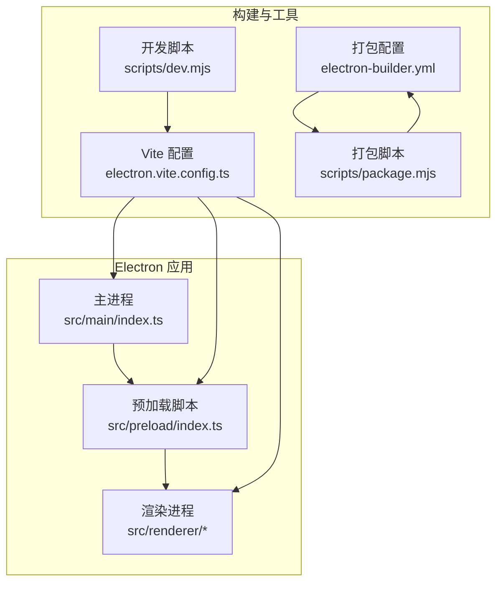
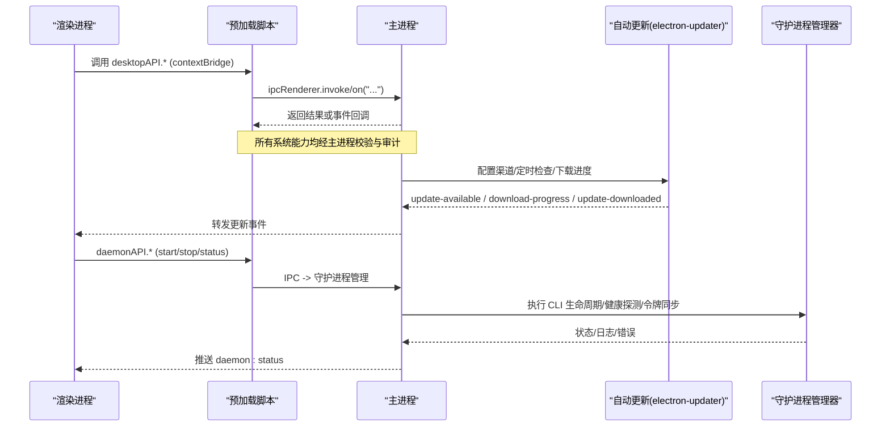
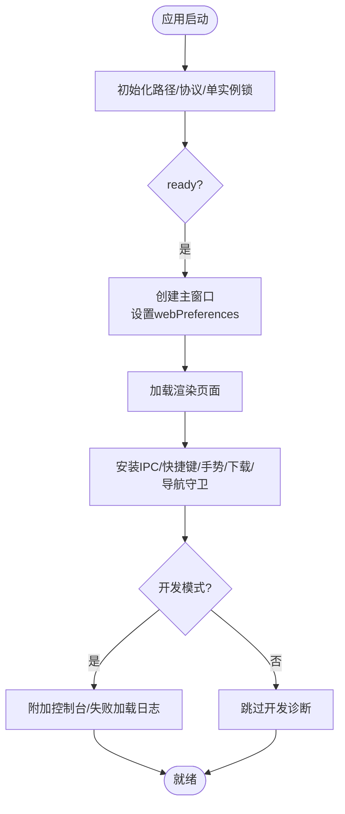
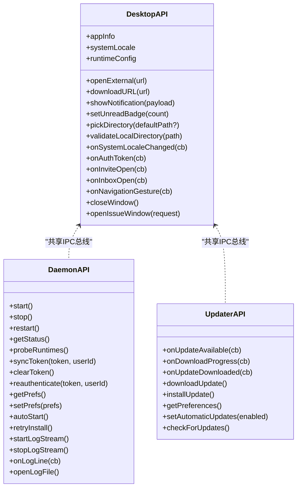
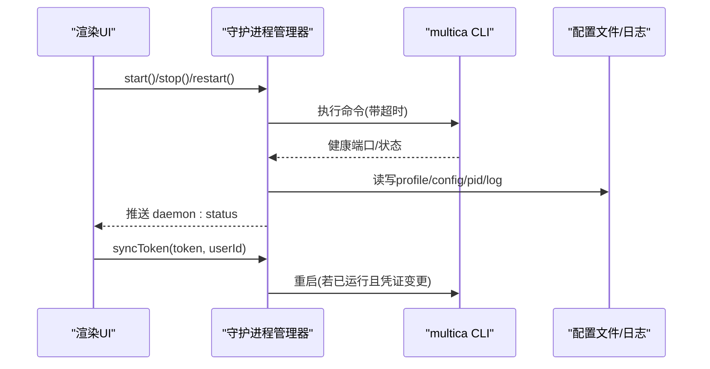
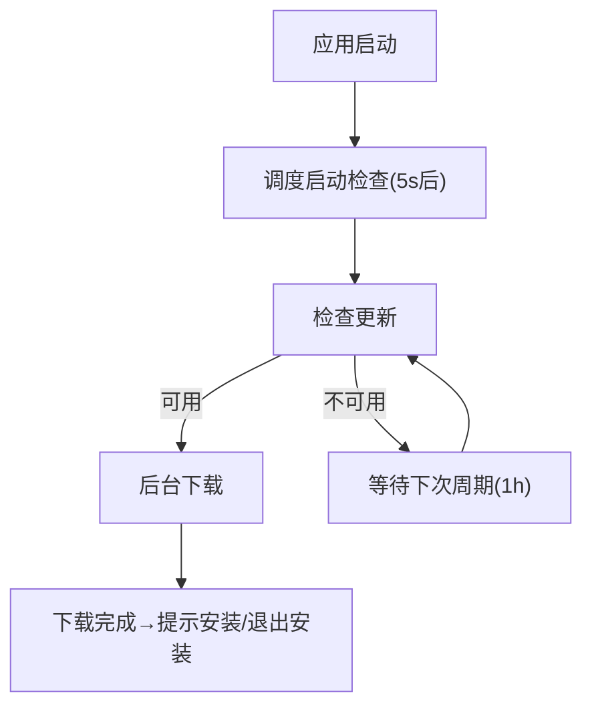
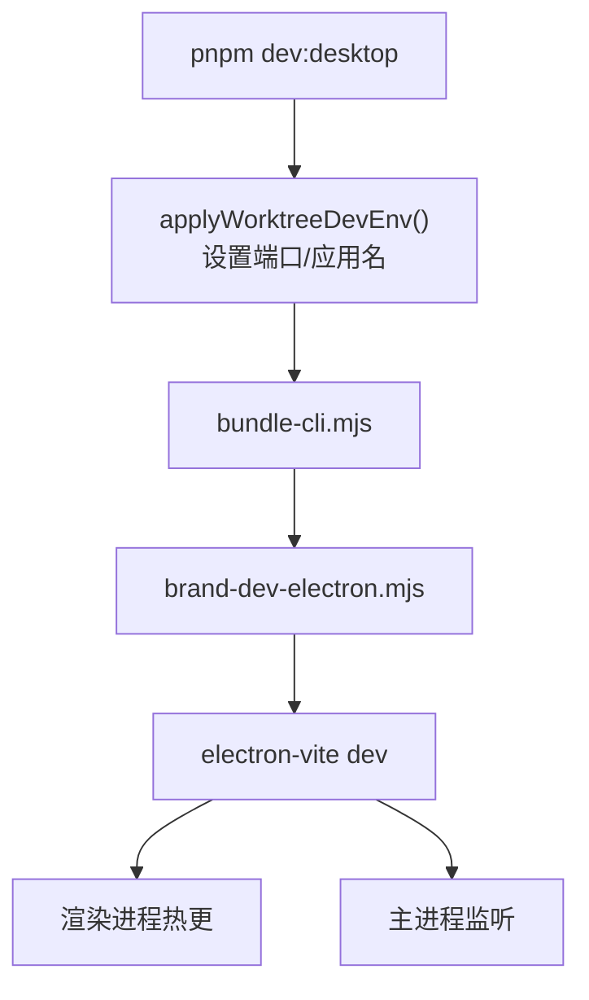
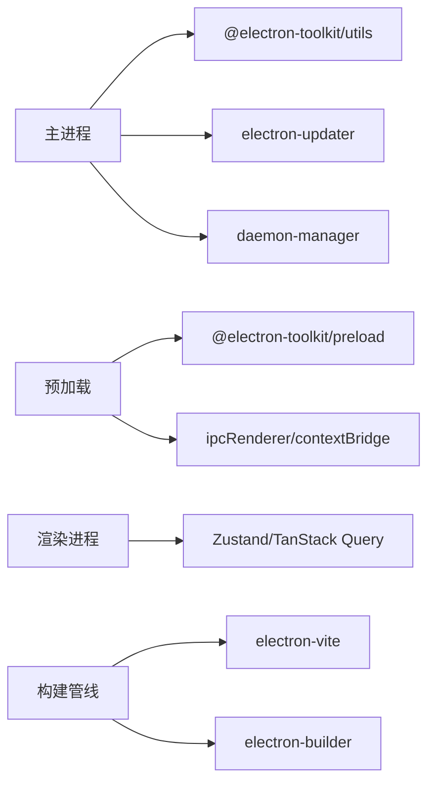

# 桌面应用开发

<cite>
**本文引用的文件**
- [apps/desktop/package.json](file://apps/desktop/package.json)
- [apps/desktop/electron.vite.config.ts](file://apps/desktop/electron.vite.config.ts)
- [apps/desktop/electron-builder.yml](file://apps/desktop/electron-builder.yml)
- [apps/desktop/src/main/index.ts](file://apps/desktop/src/main/index.ts)
- [apps/desktop/src/preload/index.ts](file://apps/desktop/src/preload/index.ts)
- [apps/desktop/src/preload/index.d.ts](file://apps/desktop/src/preload/index.d.ts)
- [apps/desktop/scripts/dev.mjs](file://apps/desktop/scripts/dev.mjs)
- [apps/desktop/scripts/package.mjs](file://apps/desktop/scripts/package.mjs)
- [apps/desktop/src/main/updater.ts](file://apps/desktop/src/main/updater.ts)
- [apps/desktop/src/main/daemon-manager.ts](file://apps/desktop/src/main/daemon-manager.ts)
- [apps/desktop/src/main/renderer-web-preferences.ts](file://apps/desktop/src/main/renderer-web-preferences.ts)
</cite>

## 目录
1. [简介](#简介)
2. [项目结构](#项目结构)
3. [核心组件](#核心组件)
4. [架构总览](#架构总览)
5. [详细组件分析](#详细组件分析)
6. [依赖关系分析](#依赖关系分析)
7. [性能与内存管理](#性能与内存管理)
8. [故障排查指南](#故障排查指南)
9. [结论](#结论)
10. [附录：开发与发布清单](#附录开发与发布清单)

## 简介
本文件面向使用 Vite + Electron 构建 Multica 桌面客户端的开发者，系统阐述主进程与渲染进程的架构设计、预加载脚本的安全隔离机制、Vite 集成与开发工作流、系统集成能力（文件系统访问、原生对话框、通知等）、打包发布流程（多平台构建、代码签名、自动更新），以及性能优化、内存管理与调试技巧。文档同时提供桌面端特有功能的实现指引，帮助团队在安全、可维护的前提下高效迭代。

## 项目结构
桌面端位于 apps/desktop，采用 electron-vite 将 main、preload、renderer 分别构建；electron-builder 负责产物打包与分发；scripts 提供开发启动与跨平台打包编排。

**图示来源**
- [apps/desktop/src/main/index.ts:283-327](file://apps/desktop/src/main/index.ts#L283-L327)
- [apps/desktop/src/preload/index.ts:103-246](file://apps/desktop/src/preload/index.ts#L103-L246)
- [apps/desktop/electron.vite.config.ts:6-35](file://apps/desktop/electron.vite.config.ts#L6-L35)
- [apps/desktop/electron-builder.yml:1-128](file://apps/desktop/electron-builder.yml#L1-L128)
- [apps/desktop/scripts/dev.mjs:1-54](file://apps/desktop/scripts/dev.mjs#L1-L54)
- [apps/desktop/scripts/package.mjs:361-476](file://apps/desktop/scripts/package.mjs#L361-L476)

**章节来源**
- [apps/desktop/package.json:1-82](file://apps/desktop/package.json#L1-L82)
- [apps/desktop/electron.vite.config.ts:6-35](file://apps/desktop/electron.vite.config.ts#L6-L35)
- [apps/desktop/electron-builder.yml:1-128](file://apps/desktop/electron-builder.yml#L1-L128)

## 核心组件
- 主进程入口与窗口管理：负责单实例锁、协议注册、窗口创建与恢复、深链处理、全局快捷键、下载拦截、通知门控、IPC 路由、崩溃面包屑持久化等。
- 预加载脚本：通过 contextBridge 暴露最小 API（desktopAPI、daemonAPI、updater），仅允许 sandbox 安全的 IPC 调用，屏蔽 Node 直接暴露。
- 渲染进程：基于 React/Vite 的前端应用，通过预加载 API 与主进程交互，使用 Zustand/TanStack Query 管理状态。
- 守护进程管理器：封装本地 CLI 生命周期、健康检查、令牌同步、版本匹配重启、日志采集、偏好设置等。
- 自动更新：基于 electron-updater，支持后台静默下载、定时检查、渠道隔离（Windows ARM64、macOS x64）。
- 构建与打包：electron-vite 负责开发/构建，electron-builder 负责多平台产物与签名/公证，scripts 统一编排。

**章节来源**
- [apps/desktop/src/main/index.ts:1-147](file://apps/desktop/src/main/index.ts#L1-L147)
- [apps/desktop/src/preload/index.ts:1-347](file://apps/desktop/src/preload/index.ts#L1-L347)
- [apps/desktop/src/main/daemon-manager.ts:1-123](file://apps/desktop/src/main/daemon-manager.ts#L1-L123)
- [apps/desktop/src/main/updater.ts:1-53](file://apps/desktop/src/main/updater.ts#L1-L53)
- [apps/desktop/scripts/package.mjs:361-476](file://apps/desktop/scripts/package.mjs#L361-L476)

## 架构总览
下图展示主进程、预加载、渲染进程之间的通信边界与安全策略，以及与守护进程和自动更新的集成点。

**图示来源**
- [apps/desktop/src/preload/index.ts:103-330](file://apps/desktop/src/preload/index.ts#L103-L330)
- [apps/desktop/src/main/index.ts:617-799](file://apps/desktop/src/main/index.ts#L617-L799)
- [apps/desktop/src/main/updater.ts:112-274](file://apps/desktop/src/main/updater.ts#L112-L274)
- [apps/desktop/src/main/daemon-manager.ts:166-169](file://apps/desktop/src/main/daemon-manager.ts#L166-L169)

## 详细组件分析

### 主进程与窗口管理
- 单实例与协议：注册 multica:// 协议，处理冷启动与二次实例深链，聚焦到主窗口并派发消息。
- 窗口创建与恢复：读取上次尺寸/位置/最大化/全屏状态，设置 webPreferences（含 preload、sandbox、webSecurity、plugins），安装导航守卫、下载保存对话框、外部链接白名单打开、快捷键、手势、崩溃面包屑持久化。
- IPC 路由：集中处理 shell:openExternal、window:open-issue、file:download-url、app:get-info、runtime-config:get、notification:show、badge:set 等。
- 国际化与语言切换：通过 additionalArguments 注入系统语言，监听 OS 语言变化并广播给所有窗口。

**图示来源**
- [apps/desktop/src/main/index.ts:101-147](file://apps/desktop/src/main/index.ts#L101-L147)
- [apps/desktop/src/main/index.ts:283-459](file://apps/desktop/src/main/index.ts#L283-L459)
- [apps/desktop/src/main/index.ts:544-616](file://apps/desktop/src/main/index.ts#L544-L616)
- [apps/desktop/src/main/index.ts:617-799](file://apps/desktop/src/main/index.ts#L617-L799)

**章节来源**
- [apps/desktop/src/main/index.ts:1-800](file://apps/desktop/src/main/index.ts#L1-L800)
- [apps/desktop/src/main/renderer-web-preferences.ts:16-65](file://apps/desktop/src/main/renderer-web-preferences.ts#L16-L65)

### 预加载脚本与安全隔离
- 安全基线：启用 contextIsolation 与 sandbox，仅暴露最小 API（desktopAPI、daemonAPI、updater），禁止直接暴露 Node 模块。
- 同步信息获取：在 preload 阶段同步获取 appInfo、runtimeConfig、systemLocale，确保首次请求携带正确的客户端标识与端点配置。
- 通道订阅：对主进程事件进行类型化订阅与取消订阅，避免泄漏与重复监听。
- 能力边界：所有系统能力（打开外部链接、下载文件、通知、徽章、文件夹选择、验证目录）均通过 IPC 由主进程执行，保证审计与白名单控制。

**图示来源**
- [apps/desktop/src/preload/index.ts:103-330](file://apps/desktop/src/preload/index.ts#L103-L330)
- [apps/desktop/src/preload/index.d.ts:21-167](file://apps/desktop/src/preload/index.d.ts#L21-L167)

**章节来源**
- [apps/desktop/src/preload/index.ts:1-347](file://apps/desktop/src/preload/index.ts#L1-L347)
- [apps/desktop/src/preload/index.d.ts:1-179](file://apps/desktop/src/preload/index.d.ts#L1-L179)

### 守护进程管理器（Daemon Manager）
- 生命周期：按优先级解析 CLI 二进制（内置 > 用户态 managed > PATH），启动/停止/重启，健康探测，异常恢复策略。
- 令牌同步：将渲染端的 JWT 兑换为长期 PAT 写入 profile，避免频繁刷新；用户切换时自动重启以生效新凭证。
- 版本匹配：对比运行中 daemon 的 cli_version 与当前 CLI 版本，必要时延迟至无任务再重启。
- 日志与偏好：支持日志流式输出、偏好存储（自动启动/停止）、主机名探测等。

**图示来源**
- [apps/desktop/src/main/daemon-manager.ts:420-564](file://apps/desktop/src/main/daemon-manager.ts#L420-L564)
- [apps/desktop/src/main/daemon-manager.ts:648-737](file://apps/desktop/src/main/daemon-manager.ts#L648-L737)
- [apps/desktop/src/main/daemon-manager.ts:765-794](file://apps/desktop/src/main/daemon-manager.ts#L765-L794)

**章节来源**
- [apps/desktop/src/main/daemon-manager.ts:1-800](file://apps/desktop/src/main/daemon-manager.ts#L1-L800)

### 自动更新（Auto Updater）
- 渠道隔离：Windows ARM64 使用 latest-arm64；macOS x64 使用 latest-x64，避免元数据冲突。
- 后台静默：开启 autoDownload 与 quitAndInstall，减少用户干扰；定时检查与手动检查并存。
- 事件转发：将 update-available/download-progress/update-downloaded 转发到渲染进程，用于 UI 展示。

**图示来源**
- [apps/desktop/src/main/updater.ts:14-53](file://apps/desktop/src/main/updater.ts#L14-L53)
- [apps/desktop/src/main/updater.ts:112-192](file://apps/desktop/src/main/updater.ts#L112-L192)
- [apps/desktop/src/main/updater.ts:208-274](file://apps/desktop/src/main/updater.ts#L208-L274)

**章节来源**
- [apps/desktop/src/main/updater.ts:1-275](file://apps/desktop/src/main/updater.ts#L1-L275)

### Vite + Electron 集成与开发工作流
- 构建配置：main 与 renderer 启用 externalizeDepsPlugin；preload 必须内联 @electron-toolkit/preload 以满足沙箱 require 限制；renderer 端口可通过环境变量覆盖，支持并行 worktree 开发。
- 开发脚本：scripts/dev.mjs 统一注入 per-worktree 环境（端口、应用名），依次执行 bundle-cli、brand-dev-electron，最后启动 electron-vite dev。
- 生产构建：scripts/package.mjs 先执行 electron-vite build，再按目标矩阵编译对应 CLI 资源并调用 electron-builder 生成多平台产物。

**图示来源**
- [apps/desktop/electron.vite.config.ts:6-35](file://apps/desktop/electron.vite.config.ts#L6-L35)
- [apps/desktop/scripts/dev.mjs:1-54](file://apps/desktop/scripts/dev.mjs#L1-L54)
- [apps/desktop/scripts/package.mjs:361-476](file://apps/desktop/scripts/package.mjs#L361-L476)

**章节来源**
- [apps/desktop/electron.vite.config.ts:6-35](file://apps/desktop/electron.vite.config.ts#L6-L35)
- [apps/desktop/scripts/dev.mjs:1-54](file://apps/desktop/scripts/dev.mjs#L1-L54)
- [apps/desktop/scripts/package.mjs:361-476](file://apps/desktop/scripts/package.mjs#L361-L476)

### 系统集成能力
- 文件系统访问：通过 desktopAPI.pickDirectory 与 validateLocalDirectory 调用系统文件夹选择器与权限校验，避免直接暴露 fs 到渲染进程。
- 原生对话框与下载：下载 URL 通过 file:download-url 触发系统保存对话框；外部链接通过 shell:openExternal 白名单放行。
- 通知系统：渲染进程发送 notification:show，主进程进行门控（会话有效性、去重、焦点判断）后创建系统通知，点击回传 inbox:open。
- 窗口与手势：支持 macOS 原生前后滑动手势、沉浸式模式（隐藏交通灯）、独立 issue 窗口与主窗口协同。

**章节来源**
- [apps/desktop/src/preload/index.ts:150-246](file://apps/desktop/src/preload/index.ts#L150-L246)
- [apps/desktop/src/main/index.ts:657-799](file://apps/desktop/src/main/index.ts#L657-L799)

### 打包发布流程
- 多平台构建：支持 mac/win/linux，可指定架构；macOS 支持 notarize；Linux 固定 executableName 与 WM_CLASS；artifactName 包含版本/平台/架构。
- 资源与许可证：extraResources 将 LICENSE/NOTICE 打入包内；asarUnpack 保留 resources/** 以便运行时访问。
- 版本与渠道：从 git describe 推导版本；Windows ARM64 与 macOS x64 使用独立更新渠道；publish 指向通用静态源。
- 安全与合规：macOS 启用 notarytool；Linux 禁用 RPM build-id 以避免与其他 Electron 包冲突。

**章节来源**
- [apps/desktop/electron-builder.yml:1-128](file://apps/desktop/electron-builder.yml#L1-L128)
- [apps/desktop/scripts/package.mjs:39-75](file://apps/desktop/scripts/package.mjs#L39-L75)
- [apps/desktop/scripts/package.mjs:309-358](file://apps/desktop/scripts/package.mjs#L309-L358)

## 依赖关系分析
- 主进程依赖：@electron-toolkit/utils、fix-path、electron-updater、自定义模块（daemon-manager、updater、external-url、window-state 等）。
- 预加载依赖：@electron-toolkit/preload、ipcRenderer、contextBridge，类型声明来自 shared 类型定义。
- 渲染进程依赖：React、TanStack Query、Zustand、Tailwind、路由等；通过预加载 API 与主进程解耦。
- 构建依赖：electron-vite、@vitejs/plugin-react、@tailwindcss/vite、electron-builder。

**图示来源**
- [apps/desktop/package.json:35-79](file://apps/desktop/package.json#L35-L79)
- [apps/desktop/electron.vite.config.ts:1-35](file://apps/desktop/electron.vite.config.ts#L1-L35)
- [apps/desktop/src/main/index.ts:1-18](file://apps/desktop/src/main/index.ts#L1-L18)
- [apps/desktop/src/preload/index.ts:1-34](file://apps/desktop/src/preload/index.ts#L1-L34)

**章节来源**
- [apps/desktop/package.json:1-82](file://apps/desktop/package.json#L1-L82)
- [apps/desktop/electron.vite.config.ts:1-35](file://apps/desktop/electron.vite.config.ts#L1-L35)

## 性能与内存管理
- 渲染进程沙箱：启用 sandbox，降低渲染进程攻击面；webSecurity 关闭需配合严格的外部链接白名单与 iframe 插件策略。
- 窗口状态持久化：使用防抖保存窗口尺寸/位置/最大化/全屏，减少磁盘写入频率。
- 更新检查节流：合并并发 checkForUpdates 调用，避免重复下载与竞态。
- 守护进程健康探测：短超时轮询，避免阻塞；长时间未就绪时进行令牌有效性探测，快速定位认证问题。
- 日志与诊断：开发模式下转发 console 与 did-fail-load 事件；生产模式记录冻结面包屑并在下次启动上报。

**章节来源**
- [apps/desktop/src/main/index.ts:330-459](file://apps/desktop/src/main/index.ts#L330-L459)
- [apps/desktop/src/main/updater.ts:83-110](file://apps/desktop/src/main/updater.ts#L83-L110)
- [apps/desktop/src/main/daemon-manager.ts:186-203](file://apps/desktop/src/main/daemon-manager.ts#L186-L203)

## 故障排查指南
- 渲染崩溃恢复：主进程安装崩溃恢复处理器，支持开发模式弹出重载提示；生产模式持久化面包屑并在下次启动上报。
- 网络与加载失败：开发模式捕获 did-fail-load 并记录错误码与 URL；确认 vite dev 服务是否启动与端口占用。
- 守护进程无法启动：检查 CLI 二进制是否存在与版本合法性；查看 profile config 中的 server_url 与 token；关注 auth_expired 状态。
- 自动更新不生效：确认渠道配置（Windows ARM64/macOS x64）与 publish 地址可达；检查自动更新偏好开关。
- 图标与关联：Linux 下确认 executableName 与 StartupWMClass 一致；macOS Dock 图标需在 dev 分支显式设置。

**章节来源**
- [apps/desktop/src/main/index.ts:389-459](file://apps/desktop/src/main/index.ts#L389-L459)
- [apps/desktop/src/main/daemon-manager.ts:318-418](file://apps/desktop/src/main/daemon-manager.ts#L318-L418)
- [apps/desktop/src/main/updater.ts:172-196](file://apps/desktop/src/main/updater.ts#L172-L196)
- [apps/desktop/electron-builder.yml:55-111](file://apps/desktop/electron-builder.yml#L55-L111)

## 结论
本项目通过严格的预加载隔离、集中的主进程 IPC 路由、健壮的守护进程管理与自动更新机制，构建了安全、可维护、跨平台的 Electron 桌面客户端。结合 Vite 的高效开发与 electron-builder 的多平台打包能力，团队可在保障安全与体验的同时持续交付新功能。建议在生产环境中保持 webSecurity 关闭的审慎评估，逐步向自定义协议迁移以实现更强的安全基线；同时持续完善崩溃遥测与性能监控，提升稳定性与可观测性。

## 附录：开发与发布清单
- 开发
  - 运行：pnpm dev:desktop（scripts/dev.mjs 自动处理 per-worktree 环境与依赖）
  - 预览：pnpm preview（electron-vite preview）
  - 类型检查：pnpm typecheck
- 构建与发布
  - 构建：pnpm build（electron-vite build）
  - 打包：pnpm package（scripts/package.mjs 驱动 electron-builder）
  - 全平台：pnpm package:all（macOS 主机支持多架构）
  - 签名/公证：macOS 需要 APPLE_ID/APPLE_APP_SPECIFIC_PASSWORD/APPLE_TEAM_ID；CSC_IDENTITY_AUTO_DISCOVERY=false 可跳过强制签名用于本地测试
- 常用配置
  - 渲染端口：DESKTOP_RENDERER_PORT
  - 环境变量：VITE_API_URL/VITE_WS_URL/VITE_APP_URL（影响主/渲染端点解析）

**章节来源**
- [apps/desktop/package.json:19-33](file://apps/desktop/package.json#L19-L33)
- [apps/desktop/scripts/dev.mjs:1-54](file://apps/desktop/scripts/dev.mjs#L1-L54)
- [apps/desktop/scripts/package.mjs:361-476](file://apps/desktop/scripts/package.mjs#L361-L476)
- [apps/desktop/electron-builder.yml:48-52](file://apps/desktop/electron-builder.yml#L48-L52)