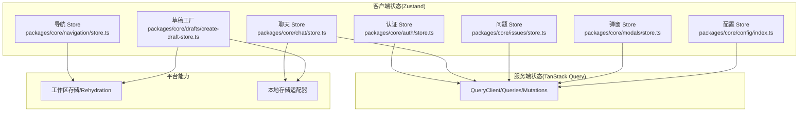
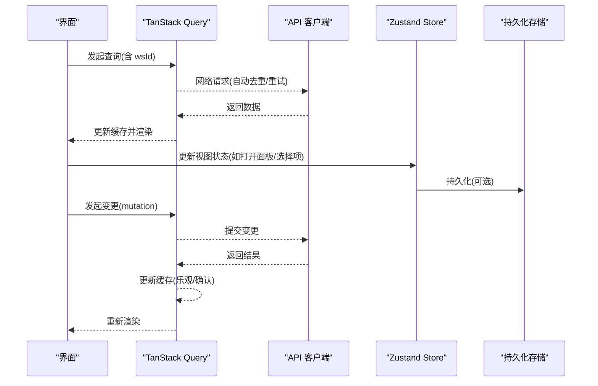
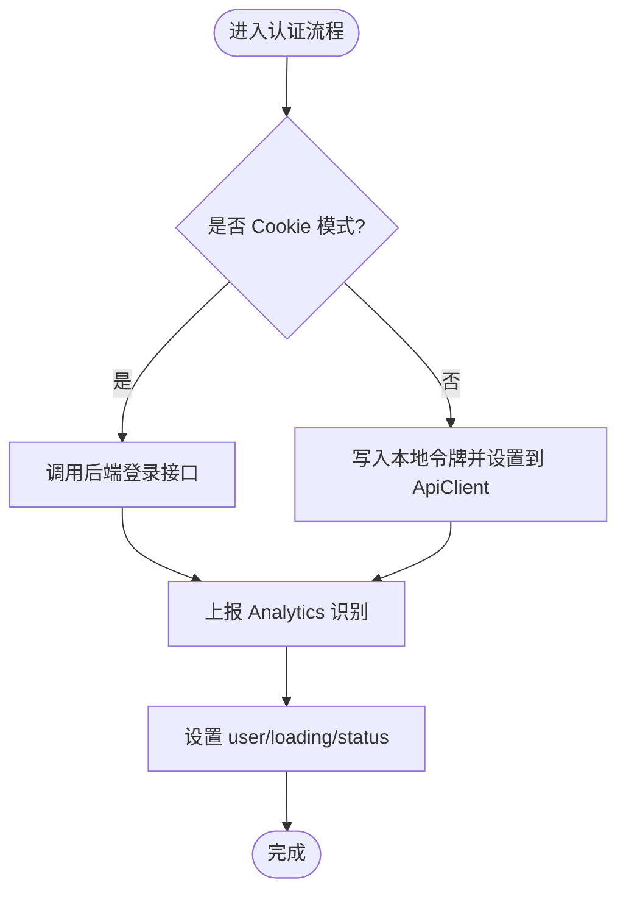
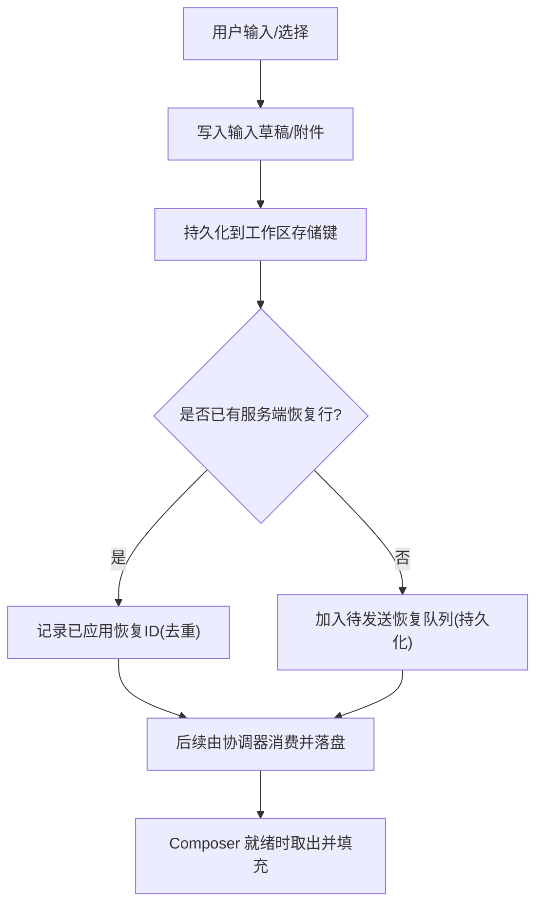
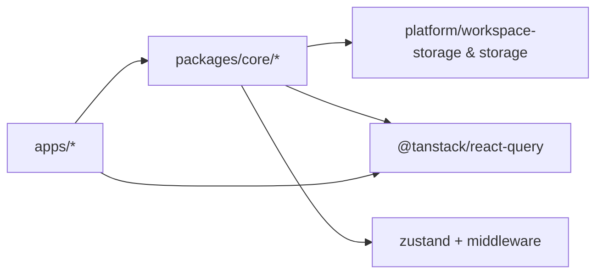

# 状态管理策略

<cite>
**本文引用的文件**
- [packages/core/config/index.ts](file://packages/core/config/index.ts)
- [packages/core/auth/store.ts](file://packages/core/auth/store.ts)
- [packages/core/chat/store.ts](file://packages/core/chat/store.ts)
- [packages/core/issues/store.ts](file://packages/core/issues/store.ts)
- [packages/core/modals/store.ts](file://packages/core/modals/store.ts)
- [packages/core/navigation/store.ts](file://packages/core/navigation/store.ts)
- [packages/core/drafts/create-draft-store.ts](file://packages/core/drafts/create-draft-store.ts)
- [CLAUDE.md](file://CLAUDE.md)
- [apps/mobile/CLAUDE.md](file://apps/mobile/CLAUDE.md)
- [apps/mobile/app/_layout.tsx](file://apps/mobile/app/_layout.tsx)
</cite>

## 目录
1. [简介](#简介)
2. [项目结构](#项目结构)
3. [核心组件](#核心组件)
4. [架构总览](#架构总览)
5. [详细组件分析](#详细组件分析)
6. [依赖关系分析](#依赖关系分析)
7. [性能考量](#性能考量)
8. [故障排查指南](#故障排查指南)
9. [结论](#结论)
10. [附录](#附录)

## 简介
本文件阐述 Multica 前端的“服务端状态与客户端状态分层”策略：TanStack Query 独占服务端状态，Zustand 独占客户端/视图状态。所有共享 Zustand store 必须位于 packages/core；服务端数据不得镜像进 store，客户端状态保持轻量。文档覆盖缓存策略、请求去重、乐观更新、状态同步、持久化、调试工具与常见模式示例，并给出基于仓库实际代码的图示与来源。

## 项目结构
- 服务端状态由 TanStack Query 管理（查询、缓存、失效、去重、重试等），在应用层通过 hooks/mutations 使用。
- 客户端/视图状态由多个 Zustand store 管理，集中在 packages/core：
  - 配置：config store（功能开关、CDN、Daemon 地址等）
  - 认证：auth store（登录态、会话过期处理、用户信息）
  - 聊天：chat store（草稿、附件上传、活跃会话、面板尺寸与展开偏好）
  - 问题：issues store（当前激活的问题 ID）
  - 弹窗：modals store（全局模态框控制）
  - 导航：navigation store（最近访问路径，跨工作区持久化）
  - 草稿工厂：create-draft-store（可复用的带持久化的草稿 store 模板）
- 平台能力（存储、工作区标识、Rehydration）通过 packages/core/platform 暴露，供上述 store 复用。

**图表来源**
- [packages/core/config/index.ts:56-84](file://packages/core/config/index.ts#L56-L84)
- [packages/core/auth/store.ts:52-188](file://packages/core/auth/store.ts#L52-L188)
- [packages/core/chat/store.ts:364-684](file://packages/core/chat/store.ts#L364-L684)
- [packages/core/issues/store.ts:10-13](file://packages/core/issues/store.ts#L10-L13)
- [packages/core/modals/store.ts:33-50](file://packages/core/modals/store.ts#L33-L50)
- [packages/core/navigation/store.ts:30-49](file://packages/core/navigation/store.ts#L30-L49)
- [packages/core/drafts/create-draft-store.ts:54-103](file://packages/core/drafts/create-draft-store.ts#L54-L103)

**章节来源**
- [CLAUDE.md:31-47](file://CLAUDE.md#L31-L47)

## 核心组件
- 配置 Store：集中管理 CDN、鉴权、Daemon、特性开关、服务器版本等运行时配置，并提供 useConfigStore/useFeatureEnabled 选择器。
- 认证 Store：封装登录、验证码、Google 登录、令牌设置、登出、会话过期恢复、用户刷新等流程；支持 Cookie 模式与本地 Token 模式；与 Analytics 集成。
- 聊天 Store：维护面板开关、浮动窗口偏好、活跃会话、选中 Agent/Project、输入草稿、附件上传生命周期、已应用的恢复记录、待发送恢复队列、面板尺寸与展开状态；全面持久化到工作区隔离的存储键。
- 问题 Store：轻量地保存当前激活 Issue ID。
- 弹窗 Store：统一控制全局模态框类型与数据。
- 导航 Store：记录最近访问路径，按工作区持久化，排除敏感路由前缀。
- 草稿工厂：提供统一的“草稿 + 持久化 + 清理 + Rehydration”模板，避免重复实现。

**章节来源**
- [packages/core/config/index.ts:4-105](file://packages/core/config/index.ts#L4-L105)
- [packages/core/auth/store.ts:7-188](file://packages/core/auth/store.ts#L7-L188)
- [packages/core/chat/store.ts:16-684](file://packages/core/chat/store.ts#L16-L684)
- [packages/core/issues/store.ts:5-13](file://packages/core/issues/store.ts#L5-L13)
- [packages/core/modals/store.ts:5-50](file://packages/core/modals/store.ts#L5-L50)
- [packages/core/navigation/store.ts:11-49](file://packages/core/navigation/store.ts#L11-L49)
- [packages/core/drafts/create-draft-store.ts:10-114](file://packages/core/drafts/create-draft-store.ts#L10-L114)

## 架构总览
- 分层原则
  - TanStack Query 负责服务端状态：缓存、去重、失效、重试、增量更新。
  - Zustand 负责客户端/视图状态：过滤、草稿、模态、布局、导航历史等。
  - 禁止将服务端数据镜像进 store；仅允许指针/ID 或 UI 相关状态。
- 共享边界
  - 所有共享 Zustand store 必须位于 packages/core。
  - React Context 仅用于平台级装配（如工作区 ID、导航）。
- 数据流
  - 读取：hooks 通过 TanStack Query 获取数据，UI 订阅。
  - 写入：mutations 调用 API，成功后通过 invalidate/queryData 更新缓存；必要时触发 WebSocket 事件以实时同步。
  - 客户端状态：Zustand store 仅承载 UI/交互所需的最小状态，必要时持久化。

[此图为概念性流程图，不直接映射具体源码文件]

## 详细组件分析

### 认证 Store（Auth Store）
- 职责：登录态管理、令牌设置/清除、会话过期处理、用户信息刷新、Analytics 识别。
- 关键行为
  - 登录成功：设置 token（Cookie 或 localStorage）、调用 onLogin、识别用户、置为 authenticated。
  - 登出：清理 token、工作区单例、Analytics，重置状态。
  - 会话过期：清理凭证与工作区（非 Cookie 模式），标记 expired，触发 onSessionExpired/onLogout。
  - 刷新用户：调用 getMe 并更新状态。
- 与平台集成：通过 storage 适配器与 setCurrentWorkspace 协同。

**图表来源**
- [packages/core/auth/store.ts:71-108](file://packages/core/auth/store.ts#L71-L108)
- [packages/core/auth/store.ts:110-186](file://packages/core/auth/store.ts#L110-L186)

**章节来源**
- [packages/core/auth/store.ts:7-188](file://packages/core/auth/store.ts#L7-L188)

### 聊天 Store（Chat Store）
- 职责：聊天面板开关、浮动窗口偏好、活跃会话、选中 Agent/Project、输入草稿、附件上传生命周期、已应用恢复记录、待发送恢复队列、面板尺寸与展开状态。
- 持久化策略
  - 工作区隔离的存储键（wsKey），包括草稿文本、草稿附件、已应用恢复记录、待发送恢复队列、会话/Agent/Project 选择、面板尺寸与展开标志。
  - 迁移逻辑：合并旧版 per-agent 的新建草稿槽至统一槽位，保证文本与附件一致。
- 可靠性
  - 无服务端副本的恢复请求会排队持久化，确保崩溃/刷新后仍可投递。
  - 已应用恢复记录作为“至少一次”消费的去重账本，直到服务端行确认为止。
- 与 Query 的关系：消息/时间线等数据由 TanStack Query 缓存，store 仅保留 UI/草稿相关状态。

**图表来源**
- [packages/core/chat/store.ts:78-268](file://packages/core/chat/store.ts#L78-L268)
- [packages/core/chat/store.ts:443-495](file://packages/core/chat/store.ts#L443-L495)
- [packages/core/chat/store.ts:622-682](file://packages/core/chat/store.ts#L622-L682)

**章节来源**
- [packages/core/chat/store.ts:16-684](file://packages/core/chat/store.ts#L16-L684)

### 配置 Store（Config Store）
- 职责：集中管理 CDN、鉴权、Daemon、特性开关、服务器版本、执行模式支持等运行时配置。
- 使用方式：通过 useConfigStore 选择器订阅字段；useFeatureEnabled 便捷判断特性开关。
- 典型场景：根据 serverVersion/localWorktreeSupported 等字段动态启用/隐藏功能入口。

**章节来源**
- [packages/core/config/index.ts:4-105](file://packages/core/config/index.ts#L4-L105)

### 导航 Store（Navigation Store）
- 职责：记录最近访问路径，排除敏感路由前缀（登录、注册、邀请等）。
- 持久化：使用工作区感知的存储，切换工作区时重新水合 lastPath。
- 用途：提供“返回上次页面”的能力，提升导航体验。

**章节来源**
- [packages/core/navigation/store.ts:11-49](file://packages/core/navigation/store.ts#L11-L49)

### 问题 Store（Issues Store）
- 职责：轻量保存当前激活的 Issue ID，便于局部 UI 快速读取。
- 设计原则：不包含列表或详情数据，避免与服务端状态重复。

**章节来源**
- [packages/core/issues/store.ts:5-13](file://packages/core/issues/store.ts#L5-L13)

### 弹窗 Store（Modals Store）
- 职责：统一管理全局模态框类型与数据，支持限制恢复提示等场景。
- 使用方式：open/close/showIssueLimitRecovery/dismissIssueLimitRecovery。

**章节来源**
- [packages/core/modals/store.ts:5-50](file://packages/core/modals/store.ts#L5-L50)

### 草稿工厂（Draft Store Factory）
- 职责：提供统一的“草稿 + 持久化 + 清理 + Rehydration”模板，减少重复实现。
- 能力
  - 工作区隔离的持久化键。
  - 自定义 emptyData、hasMeaningful、migrateData。
  - 自动注册清理回调，确保登出/删除工作区时清空持久化与内存。
  - 工作区切换时重新水合。

**章节来源**
- [packages/core/drafts/create-draft-store.ts:10-114](file://packages/core/drafts/create-draft-store.ts#L10-L114)

## 依赖关系分析
- 包边界约束
  - 共享 Zustand store 必须位于 packages/core。
  - packages/ui 不得 import @multica/core 且无业务逻辑。
  - apps/web/platform 是唯一可用 Next.js API 之处。
- 外部依赖
  - TanStack Query：服务端状态缓存、去重、失效、重试。
  - Zustand：客户端状态容器，配合 persist 中间件进行持久化。
  - 平台存储：工作区隔离的存储键与 Rehydration 机制。

**图表来源**
- [packages/core/config/index.ts:1-2](file://packages/core/config/index.ts#L1-L2)
- [packages/core/navigation/store.ts:3-9](file://packages/core/navigation/store.ts#L3-L9)
- [packages/core/drafts/create-draft-store.ts:1-8](file://packages/core/drafts/create-draft-store.ts#L1-L8)

**章节来源**
- [CLAUDE.md:31-47](file://CLAUDE.md#L31-L47)

## 性能考量
- 服务端状态（TanStack Query）
  - 缓存与去重：相同 key 的请求会被合并，避免重复网络开销。
  - 失效策略：优先 patch（setQueryData/setQueriesData），仅在无法预测形状或跨 key 范围时使用 invalidate。
  - 信号取消：queryFn 必须解构 signal，以便在 stale/离开时主动取消悬挂请求。
  - 移动端优化：蜂窝网络下尽量减少 refetch，优先使用 patch 与本地缓存。
- 客户端状态（Zustand）
  - 选择器稳定引用：避免每次返回新对象/数组导致不必要重渲染。
  - 最小持久化：仅持久化持久化偏好/草稿/布局，不持久化服务端数据或临时 UI 状态。
  - 工作区隔离：使用工作区感知存储键，避免跨工作区污染。

**章节来源**
- [apps/mobile/CLAUDE.md:210-246](file://apps/mobile/CLAUDE.md#L210-L246)
- [apps/mobile/CLAUDE.md:389-399](file://apps/mobile/CLAUDE.md#L389-L399)
- [packages/core/navigation/store.ts:30-49](file://packages/core/navigation/store.ts#L30-L49)
- [packages/core/drafts/create-draft-store.ts:54-103](file://packages/core/drafts/create-draft-store.ts#L54-L103)

## 故障排查指南
- 401 未授权处理
  - 在移动端初始化中绑定 api.setOptions.onUnauthorized，触发登出、清空工作区、清空 QueryClient 并跳转登录页。
  - 认证 store 的 sessionExpired 方法会清理凭证与工作区，并标记 expired，避免多次重复登出。
- 草稿丢失/重复恢复
  - 检查已应用恢复记录与待发送恢复队列是否正确持久化与清理。
  - 确认工作区切换时的 Rehydration 是否被正确触发。
- 导航历史异常
  - 检查 onPathChange 是否排除了敏感前缀；确认工作区切换后 rehydrate 是否生效。

**章节来源**
- [apps/mobile/app/_layout.tsx:26-58](file://apps/mobile/app/_layout.tsx#L26-L58)
- [packages/core/auth/store.ts:128-177](file://packages/core/auth/store.ts#L128-L177)
- [packages/core/chat/store.ts:622-682](file://packages/core/chat/store.ts#L622-L682)
- [packages/core/navigation/store.ts:30-49](file://packages/core/navigation/store.ts#L30-L49)

## 结论
- 明确分层：TanStack Query 管服务端状态，Zustand 管客户端/视图状态。
- 严格边界：共享 store 仅限 packages/core；禁止在服务端数据上镜像到 store。
- 可靠持久化：草稿、偏好、布局等持久化需工作区隔离，并在登出/删除工作区时清理。
- 高效同步：优先 patch 缓存，结合 WebSocket 事件与 reconnect 策略，保障实时性与性能。
- 可维护性：通过草稿工厂与平台抽象，降低重复实现与维护成本。

## 附录
- 常见模式示例（基于仓库实践）
  - 乐观更新：在 mutation 的 onMutate 中先 setQueryData 更新缓存，再 await cancelQueries，最后根据响应回滚或确认。
  - 失败重试与挂起取消：queryFn 解构 signal，配合超时与 focusManager 避免卡死请求。
  - 工作区隔离：所有工作区相关 key 包含 wsId；持久化键使用 createWorkspaceAwareStorage。
  - 实时同步：WebSocket 事件只更新 Query 缓存，不镜像到 Zustand；必要时仅清理客户端指针（如 active session）。

**章节来源**
- [apps/mobile/CLAUDE.md:210-246](file://apps/mobile/CLAUDE.md#L210-L246)
- [apps/mobile/CLAUDE.md:389-399](file://apps/mobile/CLAUDE.md#L389-L399)
- [CLAUDE.md:31-47](file://CLAUDE.md#L31-L47)