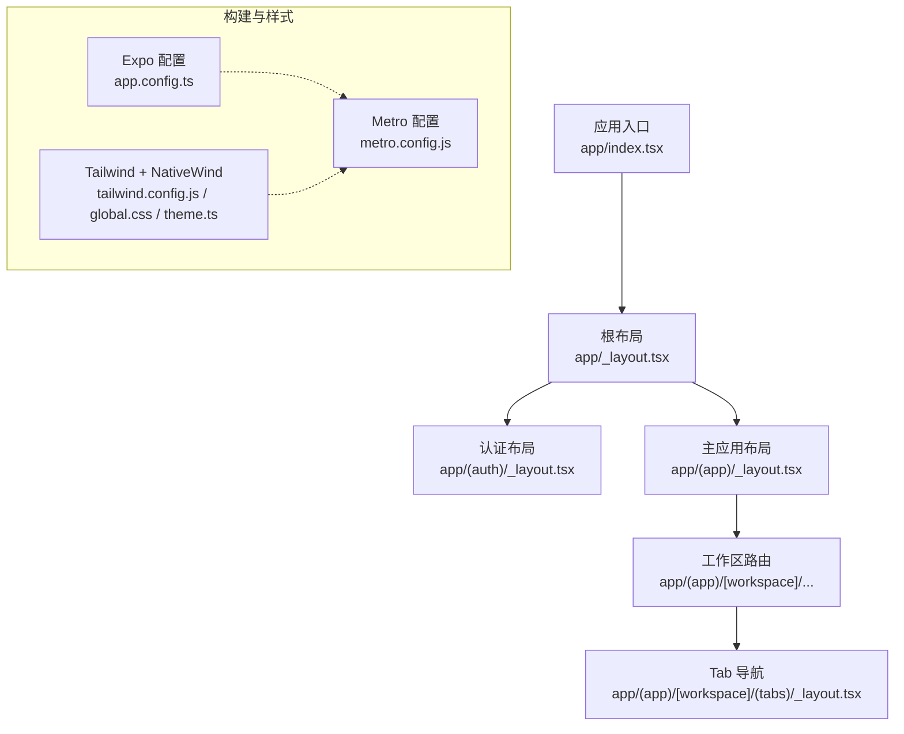
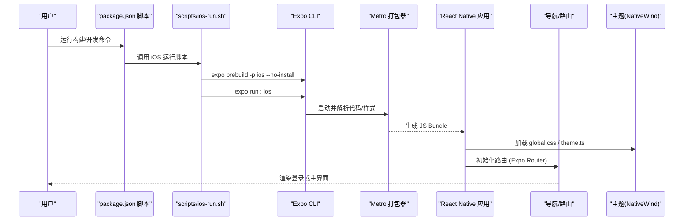
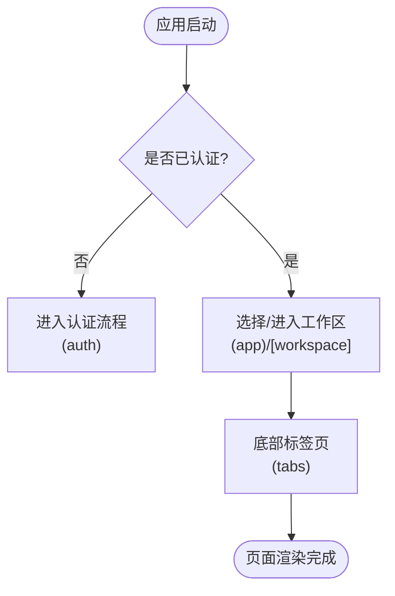
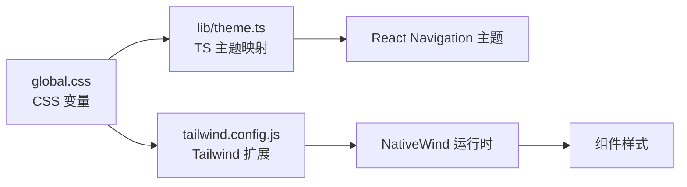
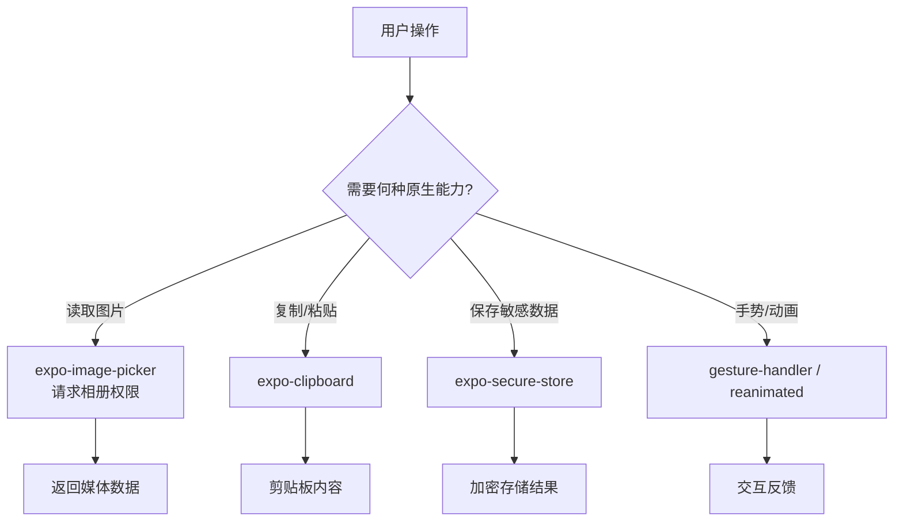
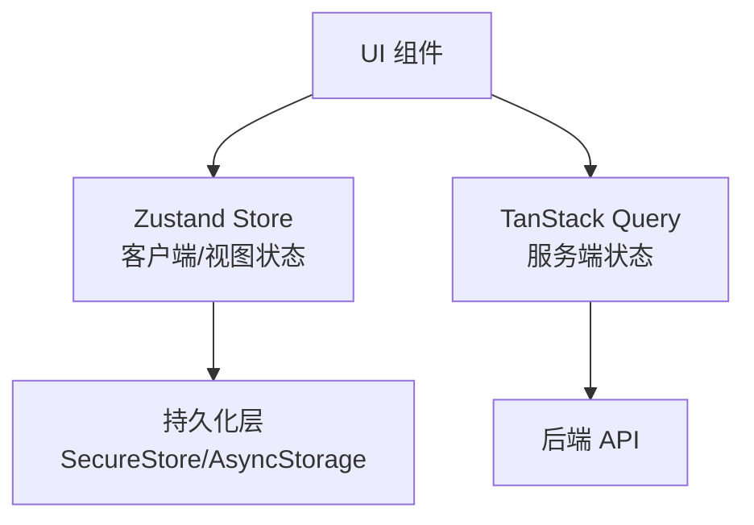
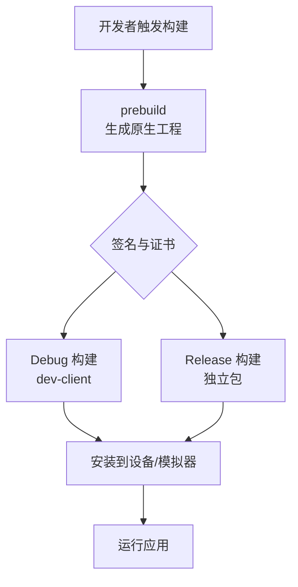
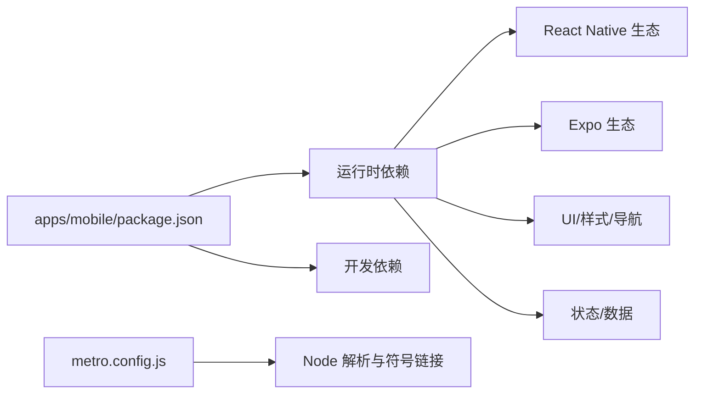

# 移动应用开发

<cite>
**本文引用的文件**
- [apps/mobile/package.json](file://apps/mobile/package.json)
- [apps/mobile/app.config.ts](file://apps/mobile/app.config.ts)
- [apps/mobile/README.md](file://apps/mobile/README.md)
- [apps/mobile/metro.config.js](file://apps/mobile/metro.config.js)
- [apps/mobile/tailwind.config.js](file://apps/mobile/tailwind.config.js)
- [apps/mobile/global.css](file://apps/mobile/global.css)
- [apps/mobile/lib/theme.ts](file://apps/mobile/lib/theme.ts)
- [apps/mobile/scripts/ios-run.sh](file://apps/mobile/scripts/ios-run.sh)
- [apps/mobile/app/_layout.tsx](file://apps/mobile/app/_layout.tsx)
- [apps/mobile/app/index.tsx](file://apps/mobile/app/index.tsx)
- [apps/mobile/app/(app)/_layout.tsx](file://apps/mobile/app/(app)/_layout.tsx)
- [apps/mobile/app/(app)/[workspace]/(tabs)/_layout.tsx](file://apps/mobile/app/(app)/[workspace]/(tabs)/_layout.tsx)
- [apps/mobile/app/(auth)/_layout.tsx](file://apps/mobile/app/(auth)/_layout.tsx)
</cite>

## 目录
1. [简介](#简介)
2. [项目结构](#项目结构)
3. [核心组件](#核心组件)
4. [架构总览](#架构总览)
5. [详细组件分析](#详细组件分析)
6. [依赖分析](#依赖分析)
7. [性能考虑](#性能考虑)
8. [故障排查指南](#故障排查指南)
9. [结论](#结论)
10. [附录](#附录)

## 简介
本文件面向使用 Expo + React Native 构建 Multica 移动端的开发者，聚焦以下目标：
- 说明 Expo 框架在项目中的使用方式与工程化配置
- 解释跨平台组件设计与响应式布局策略（基于 Tailwind/NativeWind）
- 阐述原生能力集成方案（相机、图片库、剪贴板、安全存储等）
- 说明状态管理与数据持久化方案（Zustand + TanStack Query）
- 提供移动端体验优化建议（手势、动画、性能、电池）
- 给出 iOS 与 Android 的差异化处理与发布流程要点

本项目采用 pnpm monorepo，移动端位于 apps/mobile，通过 Expo Router 进行路由组织，使用 Tailwind + NativeWind 实现样式系统，并通过 Expo 插件体系接入原生能力。

## 项目结构
- 入口与路由
  - app/_layout.tsx：应用根布局，负责全局主题、导航容器与安全区域
  - app/index.tsx：启动页/重定向逻辑
  - app/(app)/_layout.tsx：登录后主应用布局（包含工作区上下文）
  - app/(app)/[workspace]/(tabs)/_layout.tsx：底部 Tab 导航布局
  - app/(auth)/_layout.tsx：认证相关页面布局
- 配置与构建
  - app.config.ts：动态 Expo 配置（名称、Bundle ID、Scheme、插件）
  - metro.config.js：Metro 打包器配置（monorepo 支持、NativeWind 注入）
  - tailwind.config.js + global.css + lib/theme.ts：主题与样式系统
  - scripts/ios-run.sh：iOS 构建脚本（每次 prebuild 以同步配置）
- 业务与 UI
  - components/*：按功能域组织的可复用组件（聊天、问题、收件箱、编辑器等）
  - lib/*：工具函数、主题、网络与订阅、格式化等
  - assets/*：静态资源（图标、图片等）

图表来源
- [apps/mobile/app/index.tsx:1-200](file://apps/mobile/app/index.tsx#L1-L200)
- [apps/mobile/app/_layout.tsx:1-200](file://apps/mobile/app/_layout.tsx#L1-L200)
- [apps/mobile/app/(app)/_layout.tsx:1-200](file://apps/mobile/app/(app)/_layout.tsx#L1-L200)
- [apps/mobile/app/(app)/[workspace]/(tabs)/_layout.tsx:1-200](file://apps/mobile/app/(app)/[workspace]/(tabs)/_layout.tsx#L1-L200)
- [apps/mobile/app.config.ts:1-93](file://apps/mobile/app.config.ts#L1-L93)
- [apps/mobile/metro.config.js:1-24](file://apps/mobile/metro.config.js#L1-L24)
- [apps/mobile/tailwind.config.js:1-100](file://apps/mobile/tailwind.config.js#L1-L100)
- [apps/mobile/global.css:1-143](file://apps/mobile/global.css#L1-L143)
- [apps/mobile/lib/theme.ts:1-121](file://apps/mobile/lib/theme.ts#L1-L121)

章节来源
- [apps/mobile/README.md:1-114](file://apps/mobile/README.md#L1-L114)
- [apps/mobile/app.config.ts:1-93](file://apps/mobile/app.config.ts#L1-L93)
- [apps/mobile/metro.config.js:1-24](file://apps/mobile/metro.config.js#L1-L24)
- [apps/mobile/tailwind.config.js:1-100](file://apps/mobile/tailwind.config.js#L1-L100)
- [apps/mobile/global.css:1-143](file://apps/mobile/global.css#L1-L143)
- [apps/mobile/lib/theme.ts:1-121](file://apps/mobile/lib/theme.ts#L1-L121)

## 核心组件
- 路由与导航
  - 使用 Expo Router 的分组路由：(auth) 用于登录/验证，(app) 为主应用，[workspace] 为动态工作区路由，(tabs) 为底部标签页
  - 根布局负责引入主题提供者、安全区域与全局样式
- 主题与样式
  - 通过 Tailwind + NativeWind 在 RN 中使用类名驱动样式
  - global.css 定义 CSS 变量，lib/theme.ts 提供 TS 类型映射并注入到 React Navigation 主题
  - tailwind.config.js 扩展品牌色、层级表面色、圆角与动画
- 构建与运行
  - app.config.ts 根据 APP_ENV 切换显示名、Bundle ID、Scheme 与权限描述
  - scripts/ios-run.sh 每次运行前执行 prebuild，确保 ios/ 与配置一致
  - metro.config.js 启用 monorepo 解析与 symlinks，并注入 NativeWind

章节来源
- [apps/mobile/app/_layout.tsx:1-200](file://apps/mobile/app/_layout.tsx#L1-L200)
- [apps/mobile/app/(app)/_layout.tsx:1-200](file://apps/mobile/app/(app)/_layout.tsx#L1-L200)
- [apps/mobile/app/(app)/[workspace]/(tabs)/_layout.tsx:1-200](file://apps/mobile/app/(app)/[workspace]/(tabs)/_layout.tsx#L1-L200)
- [apps/mobile/app.config.ts:1-93](file://apps/mobile/app.config.ts#L1-L93)
- [apps/mobile/scripts/ios-run.sh:1-24](file://apps/mobile/scripts/ios-run.sh#L1-L24)
- [apps/mobile/metro.config.js:1-24](file://apps/mobile/metro.config.js#L1-L24)
- [apps/mobile/tailwind.config.js:1-100](file://apps/mobile/tailwind.config.js#L1-L100)
- [apps/mobile/global.css:1-143](file://apps/mobile/global.css#L1-L143)
- [apps/mobile/lib/theme.ts:1-121](file://apps/mobile/lib/theme.ts#L1-L121)

## 架构总览
下图展示移动端从启动到渲染的核心流程，以及关键配置文件的作用点。

图表来源
- [apps/mobile/scripts/ios-run.sh:1-24](file://apps/mobile/scripts/ios-run.sh#L1-L24)
- [apps/mobile/metro.config.js:1-24](file://apps/mobile/metro.config.js#L1-L24)
- [apps/mobile/app.config.ts:1-93](file://apps/mobile/app.config.ts#L1-L93)
- [apps/mobile/global.css:1-143](file://apps/mobile/global.css#L1-L143)
- [apps/mobile/lib/theme.ts:1-121](file://apps/mobile/lib/theme.ts#L1-L121)

## 详细组件分析

### 路由与导航（Expo Router）
- 分组路由
  - (auth)：登录与验证码页面，独立于主应用
  - (app)：登录后主应用，包含工作区选择与多模块页面
  - [workspace]：动态路由，承载当前工作区的子路由
  - (tabs)：底部标签页，如聊天、收件箱、我的问题、更多
- 布局职责
  - 根布局：统一主题、导航容器、安全区域
  - 工作区布局：注入工作区上下文，供子页面读取
- 导航模式
  - 使用 Expo Router 声明式路由，结合 React Navigation 提供一致的导航体验

图表来源
- [apps/mobile/app/_layout.tsx:1-200](file://apps/mobile/app/_layout.tsx#L1-L200)
- [apps/mobile/app/(auth)/_layout.tsx:1-200](file://apps/mobile/app/(auth)/_layout.tsx#L1-L200)
- [apps/mobile/app/(app)/_layout.tsx:1-200](file://apps/mobile/app/(app)/_layout.tsx#L1-L200)
- [apps/mobile/app/(app)/[workspace]/(tabs)/_layout.tsx:1-200](file://apps/mobile/app/(app)/[workspace]/(tabs)/_layout.tsx#L1-L200)

章节来源
- [apps/mobile/app/_layout.tsx:1-200](file://apps/mobile/app/_layout.tsx#L1-L200)
- [apps/mobile/app/(auth)/_layout.tsx:1-200](file://apps/mobile/app/(auth)/_layout.tsx#L1-L200)
- [apps/mobile/app/(app)/_layout.tsx:1-200](file://apps/mobile/app/(app)/_layout.tsx#L1-L200)
- [apps/mobile/app/(app)/[workspace]/(tabs)/_layout.tsx:1-200](file://apps/mobile/app/(app)/[workspace]/(tabs)/_layout.tsx#L1-L200)

### 主题与响应式布局（Tailwind + NativeWind）
- 设计令牌
  - global.css 定义 CSS 变量（背景、前景、卡片、边框、品牌色、层级表面色等）
  - lib/theme.ts 将变量映射为 TS 对象，并注入 React Navigation 主题
  - tailwind.config.js 扩展颜色、圆角、动画，并启用 darkMode
- 响应式策略
  - 使用 Tailwind 断点与 NativeWind 适配不同屏幕尺寸
  - 通过 surface-1/surface-2 建立层级深度，保证可读性与对比度
- 暗色模式
  - .dark:root 中反转明暗关系，保持层级感知

图表来源
- [apps/mobile/global.css:1-143](file://apps/mobile/global.css#L1-L143)
- [apps/mobile/tailwind.config.js:1-100](file://apps/mobile/tailwind.config.js#L1-L100)
- [apps/mobile/lib/theme.ts:1-121](file://apps/mobile/lib/theme.ts#L1-L121)

章节来源
- [apps/mobile/global.css:1-143](file://apps/mobile/global.css#L1-L143)
- [apps/mobile/tailwind.config.js:1-100](file://apps/mobile/tailwind.config.js#L1-L100)
- [apps/mobile/lib/theme.ts:1-121](file://apps/mobile/lib/theme.ts#L1-L121)

### 原生能力集成（相机、图片库、剪贴板、安全存储）
- 图片与相机
  - 使用 expo-image-picker 访问相册；在 app.config.ts 中配置权限描述，默认禁用相机与麦克风
- 剪贴板
  - 使用 expo-clipboard 提供复制粘贴能力
- 安全存储
  - 使用 expo-secure-store 保存敏感信息（如 token）
- 其他
  - @react-native-community/netinfo：网络状态检测
  - react-native-gesture-handler：手势交互
  - react-native-reanimated：高性能动画
  - react-native-screens：原生屏幕栈
  - react-native-safe-area-context：安全区域适配

图表来源
- [apps/mobile/app.config.ts:63-88](file://apps/mobile/app.config.ts#L63-L88)
- [apps/mobile/package.json:22-82](file://apps/mobile/package.json#L22-L82)

章节来源
- [apps/mobile/app.config.ts:63-88](file://apps/mobile/app.config.ts#L63-L88)
- [apps/mobile/package.json:22-82](file://apps/mobile/package.json#L22-L82)

### 状态管理与数据持久化
- 服务端状态
  - 使用 TanStack Query 管理 API 数据、缓存与同步
- 客户端/视图状态
  - 使用 Zustand 管理 UI 状态（如表单、选中项、本地缓存）
- 共享 Store 边界
  - 遵循仓库规则：所有共享 Zustand store 仅位于 packages/core，避免在移动端直接镜像服务端数据
- 持久化
  - 对必要的本地状态使用持久化中间件（如 createJSONStorage/persist），并结合 expo-secure-store 保护敏感数据

图表来源
- [apps/mobile/package.json:43-82](file://apps/mobile/package.json#L43-L82)
- [apps/mobile/app.config.ts:63-88](file://apps/mobile/app.config.ts#L63-L88)

章节来源
- [apps/mobile/package.json:22-82](file://apps/mobile/package.json#L22-L82)

### 构建与发布流程（iOS 与 Android）
- iOS
  - 使用 scripts/ios-run.sh 每次 prebuild 以同步 app.config.ts 变更
  - 通过 EXPO_BUNDLE_IDENTIFIER_* 与 EXPO_APPLE_TEAM_ID 控制签名与变体
  - Debug 构建嵌入 dev-client 支持热重载；Release 构建为独立包
- Android
  - 可通过 Expo CLI 的 android 命令进行构建与运行（参考 package.json 脚本约定）
  - 如需自定义原生配置，可在 app.config.ts 的 plugins 中添加对应插件
- 环境变量
  - 通过 .env.* 与 APP_ENV 区分开发、预发、生产环境，影响 Bundle ID、显示名与后端地址

图表来源
- [apps/mobile/scripts/ios-run.sh:1-24](file://apps/mobile/scripts/ios-run.sh#L1-L24)
- [apps/mobile/app.config.ts:1-93](file://apps/mobile/app.config.ts#L1-L93)
- [apps/mobile/package.json:6-20](file://apps/mobile/package.json#L6-L20)
- [apps/mobile/README.md:37-114](file://apps/mobile/README.md#L37-L114)

章节来源
- [apps/mobile/scripts/ios-run.sh:1-24](file://apps/mobile/scripts/ios-run.sh#L1-L24)
- [apps/mobile/app.config.ts:1-93](file://apps/mobile/app.config.ts#L1-L93)
- [apps/mobile/package.json:6-20](file://apps/mobile/package.json#L6-L20)
- [apps/mobile/README.md:37-114](file://apps/mobile/README.md#L37-L114)

## 依赖分析
- 运行时依赖
  - expo、expo-router、react-native、react-navigation、nativewind、tailwindcss、@tanstack/react-query、zustand、expo-* 系列原生插件
- 开发依赖
  - typescript、eslint、vitest、babel、cross-env、dotenv-cli
- Monorepo 支持
  - metro.config.js 配置 watchFolders、nodeModulesPaths 与 symlinks，以支持 pnpm 链接与跨包类型引用

图表来源
- [apps/mobile/package.json:22-92](file://apps/mobile/package.json#L22-L92)
- [apps/mobile/metro.config.js:1-24](file://apps/mobile/metro.config.js#L1-L24)

章节来源
- [apps/mobile/package.json:22-92](file://apps/mobile/package.json#L22-L92)
- [apps/mobile/metro.config.js:1-24](file://apps/mobile/metro.config.js#L1-L24)

## 性能考虑
- 列表与滚动
  - 使用 @shopify/flash-list 提升长列表性能
- 动画与手势
  - 使用 react-native-reanimated 与 react-native-gesture-handler 实现流畅交互
- 图片与媒体
  - 使用 expo-image 与 expo-image-picker 优化图片加载与选择
- 网络与缓存
  - 使用 TanStack Query 的缓存与重试机制减少重复请求
- 电池优化
  - 合理调度后台任务，避免频繁唤醒；利用系统提供的通知与后台刷新策略
- 构建与调试
  - 使用 Debug 构建进行快速迭代；Release 构建用于性能基准测试

[本节为通用指导，不直接分析具体文件]

## 故障排查指南
- 签名与证书问题
  - 若出现“未找到匹配的配置文件”，请设置 EXPO_BUNDLE_IDENTIFIER_PROD 并使用自有反向域名
  - 若 Apple ID 属于多个团队，设置 EXPO_APPLE_TEAM_ID 指定签名团队
- 7 天签名限制（免费 Apple ID）
  - 每 7 天需重新连接 Mac 并重新签名；可使用付费开发者账号延长至一年
- 后端地址配置
  - 修改 .env.* 中的 EXPO_PUBLIC_API_URL；Debug 构建重启 Metro，Release 构建需重新编译
- 本地后端测试
  - 使用 Mac 局域网 IP 而非 localhost；确保防火墙允许端口访问

章节来源
- [apps/mobile/README.md:19-34](file://apps/mobile/README.md#L19-L34)
- [apps/mobile/README.md:102-114](file://apps/mobile/README.md#L102-L114)

## 结论
本项目以 Expo 为核心，结合 Expo Router、Tailwind/NativeWind、Zustand 与 TanStack Query，构建了可扩展、可维护的移动端架构。通过 app.config.ts 与脚本体系实现多环境、多变体的灵活构建与发布。遵循仓库的状态分层与包边界约束，确保代码质量与团队协作效率。建议在后续迭代中持续优化列表与动画性能，完善错误监控与日志采集，并逐步补齐 Android 平台的差异化能力。

## 附录
- 常用命令
  - 开发：pnpm dev:mobile（仅 Metro）
  - iOS 模拟器：pnpm ios:mobile:staging
  - iOS 真机 Debug：pnpm ios:mobile:device:staging
  - iOS 真机 Release：pnpm ios:mobile:device:staging:release
- 环境变量
  - APP_ENV：development/staging/production
  - EXPO_BUNDLE_IDENTIFIER_DEV/PROD：覆盖 Bundle ID
  - EXPO_APPLE_TEAM_ID：指定签名团队
  - EXPO_PUBLIC_API_URL：后端地址

章节来源
- [apps/mobile/package.json:6-20](file://apps/mobile/package.json#L6-L20)
- [apps/mobile/README.md:37-114](file://apps/mobile/README.md#L37-L114)