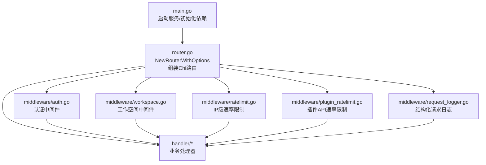
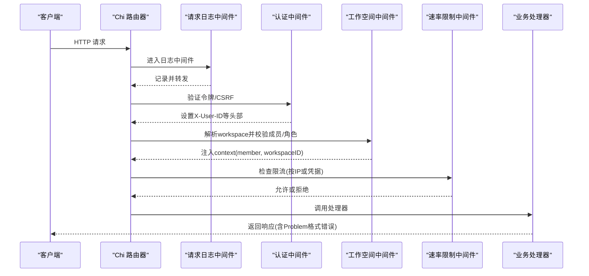
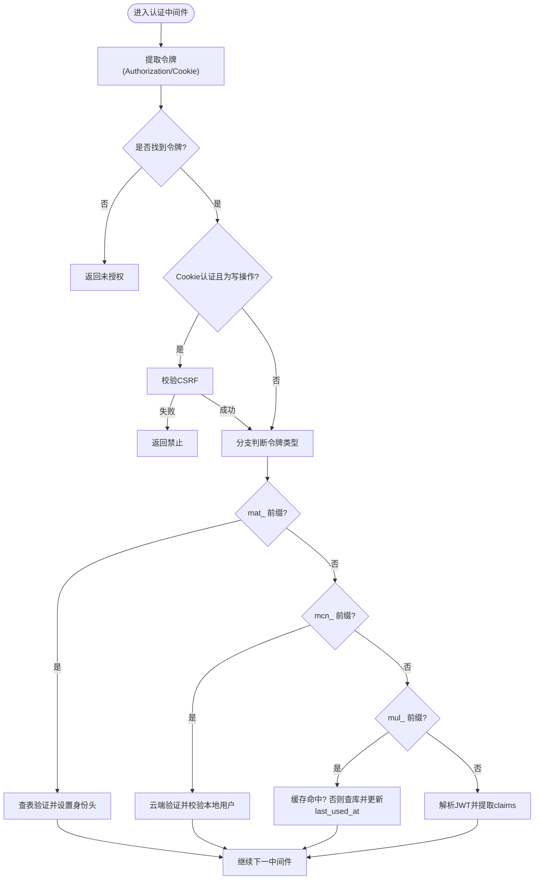
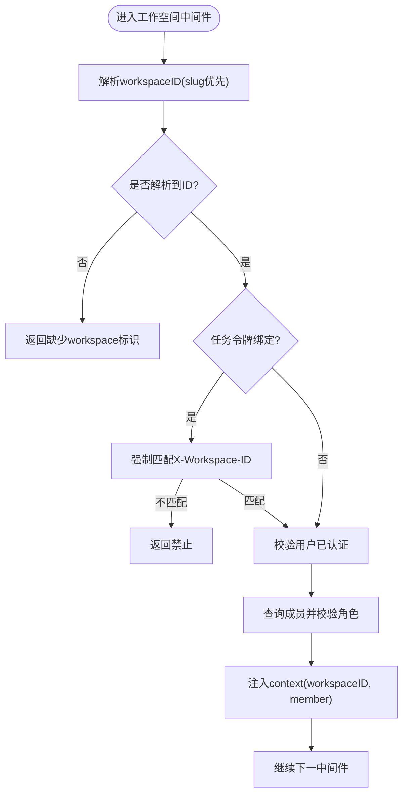
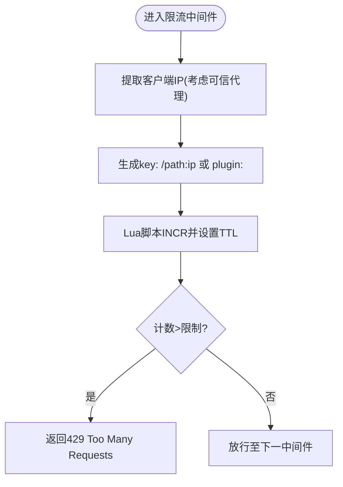
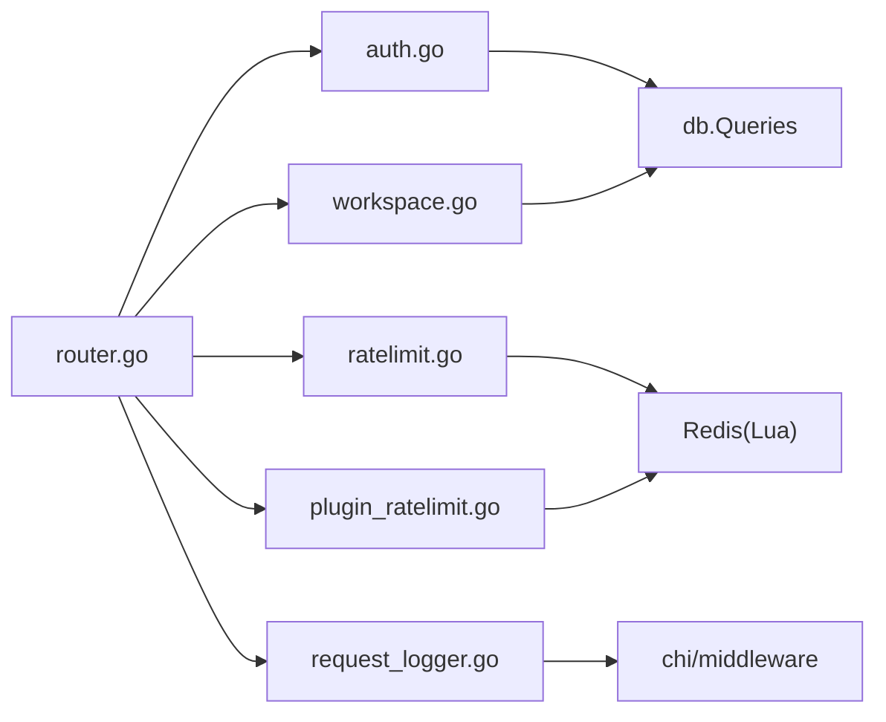

# API 路由与中间件

<cite>
**本文引用的文件**
- [server/cmd/server/main.go](file://server/cmd/server/main.go)
- [server/cmd/server/router.go](file://server/cmd/server/router.go)
- [server/internal/middleware/auth.go](file://server/internal/middleware/auth.go)
- [server/internal/middleware/workspace.go](file://server/internal/middleware/workspace.go)
- [server/internal/middleware/ratelimit.go](file://server/internal/middleware/ratelimit.go)
- [server/internal/middleware/plugin_ratelimit.go](file://server/internal/middleware/plugin_ratelimit.go)
- [server/internal/middleware/request_logger.go](file://server/internal/middleware/request_logger.go)
- [server/pkg/publicapi/v1/problem.go](file://server/pkg/publicapi/v1/problem.go)
</cite>

## 目录
1. [简介](#简介)
2. [项目结构](#项目结构)
3. [核心组件](#核心组件)
4. [架构总览](#架构总览)
5. [详细组件分析](#详细组件分析)
6. [依赖关系分析](#依赖关系分析)
7. [性能考量](#性能考量)
8. [故障排查指南](#故障排查指南)
9. [结论](#结论)
10. [附录](#附录)

## 简介
本文件面向后端 API 路由与中间件系统，聚焦以下目标：
- Chi 路由器的配置与路由注册机制，RESTful 端点组织方式
- 中间件链的设计原理与执行顺序（认证、工作空间、速率限制等）
- 请求上下文管理与数据传递机制
- 路由定义示例、中间件编写指南与最佳实践
- 调试与测试路由的方法

## 项目结构
后端采用 Go + Chi 路由。服务器启动入口负责初始化数据库、Redis、实时消息通道、指标与后台任务，并构建路由器；路由器集中装配 CORS、日志、鉴权、工作空间校验、速率限制等中间件，再挂载业务处理器。

图表来源
- [server/cmd/server/main.go:292-340](file://server/cmd/server/main.go#L292-L340)
- [server/cmd/server/router.go:390-441](file://server/cmd/server/router.go#L390-L441)

章节来源
- [server/cmd/server/main.go:292-340](file://server/cmd/server/main.go#L292-L340)
- [server/cmd/server/router.go:390-441](file://server/cmd/server/router.go#L390-L441)

## 核心组件
- 路由器与选项：通过 NewRouterWithOptions 统一装配 Handler、存储、CORS、特征开关、指标、后台调度器等，并返回 chi.Router 与 handler.Handler。
- 认证中间件：支持 Bearer Token（JWT）、Personal Access Token（PAT）、云节点 PAT、Agent Task Token，设置 X-User-ID/X-Agent-ID/X-Task-ID/X-Workspace-ID 等请求头，供下游使用。
- 工作空间中间件：从多种来源解析 workspace（slug 优先），校验成员与角色，注入 context 以便后续处理器快速访问。
- 速率限制中间件：基于 Redis Lua 脚本实现固定窗口限流，支持可信代理 IP 解析；插件 API 单独按凭据哈希限流。
- 请求日志：结构化记录方法、路径、状态码、耗时、用户 ID、Webhook 触发器 ID、客户端元信息，并对敏感路径脱敏。

章节来源
- [server/cmd/server/router.go:390-441](file://server/cmd/server/router.go#L390-L441)
- [server/internal/middleware/auth.go:34-267](file://server/internal/middleware/auth.go#L34-L267)
- [server/internal/middleware/workspace.go:13-169](file://server/internal/middleware/workspace.go#L13-L169)
- [server/internal/middleware/ratelimit.go:15-87](file://server/internal/middleware/ratelimit.go#L15-L87)
- [server/internal/middleware/plugin_ratelimit.go:14-40](file://server/internal/middleware/plugin_ratelimit.go#L14-L40)
- [server/internal/middleware/request_logger.go:113-179](file://server/internal/middleware/request_logger.go#L113-L179)

## 架构总览
请求进入 HTTP Server 后，依次经过 CORS、请求日志、认证、工作空间校验、速率限制等中间件，最终到达具体处理器。关键特性：
- 认证中间件在头部注入身份与工作空间标识，供工作空间中间件与处理器使用。
- 工作空间中间件提供“slug 优先”的解析策略，并将成员信息写入 context。
- 速率限制对公共 API 按 IP+路径限流，对插件 API 按凭据哈希限流。
- 错误响应统一遵循 RFC 9457 Problem Details 风格，便于前端一致处理。

图表来源
- [server/internal/middleware/request_logger.go:113-179](file://server/internal/middleware/request_logger.go#L113-L179)
- [server/internal/middleware/auth.go:34-267](file://server/internal/middleware/auth.go#L34-L267)
- [server/internal/middleware/workspace.go:158-266](file://server/internal/middleware/workspace.go#L158-L266)
- [server/internal/middleware/ratelimit.go:51-87](file://server/internal/middleware/ratelimit.go#L51-L87)
- [server/pkg/publicapi/v1/problem.go:77-103](file://server/pkg/publicapi/v1/problem.go#L77-L103)

## 详细组件分析

### 认证中间件（Auth）
- 支持的令牌类型与优先级：
  - Agent Task Token（mat_ 前缀）：由服务端签发，绑定 user_id、agent_id、task_id、workspace_id，强制覆盖下游可能伪造的身份头。
  - 云节点 PAT（mcn_ 前缀）：通过云端验证器校验，并确认本地用户存在。
  - 个人访问令牌（mul_ 前缀）：带缓存（TTL），命中缓存时跳过 DB 查询与 last_used_at 更新。
  - JWT：解析签名与 claims，提取 sub/email。
- 安全要点：
  - 删除不可信头 X-Actor-Source，仅允许内部设置特定值（如 task_token、cloud_pat）。
  - Cookie 认证需 CSRF 校验。
  - 临时禁用用户拦截。
- 输出：设置 X-User-ID、X-Agent-ID、X-Task-ID、X-Workspace-ID、X-User-Email 等头部，供后续中间件与处理器使用。

图表来源
- [server/internal/middleware/auth.go:34-267](file://server/internal/middleware/auth.go#L34-L267)

章节来源
- [server/internal/middleware/auth.go:34-267](file://server/internal/middleware/auth.go#L34-L267)

### 工作空间中间件（Workspace）
- 解析优先级（用于受保护路由）：
  1) 任务令牌绑定的 workspace（X-Actor-Source == "task_token" 时强制使用）
  2) 中间件注入的 context（fast path）
  3) X-Workspace-Slug 头 → 查询 slug→UUID
  4) ?workspace_slug 查询参数 → 查询 slug→UUID
  5) X-Workspace-ID 头（CLI/daemon 兼容）
  6) ?workspace_id 查询（CLI/daemon 兼容）
- 校验与注入：
  - 校验用户已认证（X-User-ID）
  - 校验成员与可选角色
  - 将 workspaceID 与 member 注入 context，供处理器读取
- 辅助函数：
  - ResolveWorkspaceIDFromRequest：供无中间件的路径复用解析逻辑
  - SetMemberContext/MemberFromContext/WorkspaceIDFromContext：上下文存取

图表来源
- [server/internal/middleware/workspace.go:47-169](file://server/internal/middleware/workspace.go#L47-L169)
- [server/internal/middleware/workspace.go:195-266](file://server/internal/middleware/workspace.go#L195-L266)

章节来源
- [server/internal/middleware/workspace.go:47-169](file://server/internal/middleware/workspace.go#L47-L169)
- [server/internal/middleware/workspace.go:195-266](file://server/internal/middleware/workspace.go#L195-L266)

### 速率限制中间件（RateLimit）
- 通用 API 限流：
  - 基于 Redis Lua 脚本原子 INCR+EXPIRE，避免网络抖动导致 key 永久存活
  - 按 IP + 路径生成 key，支持可信代理（X-Forwarded-For）解析
  - 超限返回 429 并附带 Retry-After
- 插件 API 限流：
  - 按 Bearer Token 的 SHA256 作为 key，避免明文密钥进入日志或键名
  - 超限返回 429 并使用统一的 Problem 格式

图表来源
- [server/internal/middleware/ratelimit.go:15-87](file://server/internal/middleware/ratelimit.go#L15-L87)
- [server/internal/middleware/plugin_ratelimit.go:14-40](file://server/internal/middleware/plugin_ratelimit.go#L14-L40)

章节来源
- [server/internal/middleware/ratelimit.go:15-87](file://server/internal/middleware/ratelimit.go#L15-L87)
- [server/internal/middleware/plugin_ratelimit.go:14-40](file://server/internal/middleware/plugin_ratelimit.go#L14-L40)

### 请求日志（RequestLogger）
- 记录字段：方法、路径（对 webhook 路径进行脱敏）、状态码、耗时、请求 ID、用户 ID、Webhook 触发器 ID、客户端平台/版本/OS
- 特殊处理：
  - 健康检查路径跳过记录
  - 404 中识别“软不存在”（运行时/任务被删除）以降低告警噪音
  - 捕获响应体前缀以分类 404

章节来源
- [server/internal/middleware/request_logger.go:113-179](file://server/internal/middleware/request_logger.go#L113-L179)

### 路由注册与 RESTful 组织
- 路由器构造：
  - NewRouterWithOptions 创建 Handler、存储、CORS、指标、后台调度器、频道引擎等，并返回 chi.Router
  - main 中根据环境变量启用/禁用各集成（Lark、Slack、DingTalk、WeCom、Telegram、Composio、VCS、Plugin Secrets）
- 插件桥接 API：
  - 注册一组公开 v1 接口（获取上下文、Issue CRUD、存储范围与值等），供插件调用
- CORS 配置：
  - 允许的 Origin 来自环境变量或默认开发地址
  - 暴露必要响应头（ETag、X-Request-ID、截断提示头等）

章节来源
- [server/cmd/server/router.go:390-441](file://server/cmd/server/router.go#L390-L441)
- [server/cmd/server/router.go:102-112](file://server/cmd/server/router.go#L102-L112)
- [server/cmd/server/router.go:114-135](file://server/cmd/server/router.go#L114-L135)
- [server/cmd/server/router.go:52-100](file://server/cmd/server/router.go#L52-L100)

## 依赖关系分析
- 路由器依赖：
  - 数据库连接池（pgxpool）
  - Redis 客户端（用于限流、会话/模型缓存、实时中继、工作区租约等）
  - 实时消息 Hub（in-memory 或 Redis 中继）
  - 事件总线（Bus）
  - 指标与监控（HTTP/Business/Metrics）
  - 特征开关（FeatureFlags）
- 中间件依赖：
  - 认证：auth、db.Queries、JWT 库、CloudPAT 验证器
  - 工作空间：db.Queries、chi URLParam
  - 限流：Redis Lua 脚本、net/netip
  - 日志：chi middleware、slog

图表来源
- [server/cmd/server/router.go:390-441](file://server/cmd/server/router.go#L390-L441)
- [server/internal/middleware/auth.go:34-267](file://server/internal/middleware/auth.go#L34-L267)
- [server/internal/middleware/workspace.go:13-169](file://server/internal/middleware/workspace.go#L13-L169)
- [server/internal/middleware/ratelimit.go:15-87](file://server/internal/middleware/ratelimit.go#L15-L87)
- [server/internal/middleware/plugin_ratelimit.go:14-40](file://server/internal/middleware/plugin_ratelimit.go#L14-L40)
- [server/internal/middleware/request_logger.go:113-179](file://server/internal/middleware/request_logger.go#L113-L179)

章节来源
- [server/cmd/server/router.go:390-441](file://server/cmd/server/router.go#L390-L441)
- [server/internal/middleware/auth.go:34-267](file://server/internal/middleware/auth.go#L34-L267)
- [server/internal/middleware/workspace.go:13-169](file://server/internal/middleware/workspace.go#L13-L169)
- [server/internal/middleware/ratelimit.go:15-87](file://server/internal/middleware/ratelimit.go#L15-L87)
- [server/internal/middleware/plugin_ratelimit.go:14-40](file://server/internal/middleware/plugin_ratelimit.go#L14-L40)
- [server/internal/middleware/request_logger.go:113-179](file://server/internal/middleware/request_logger.go#L113-L179)

## 性能考量
- 认证缓存：PAT 命中缓存可跳过 DB 查询与 last_used_at 更新，降低热点路径开销
- 限流原子性：Redis Lua 脚本保证 INCR 与 EXPIRE 原子执行，避免 key 泄漏
- 日志裁剪：响应体仅捕获有限字节，防止大响应体污染日志内存
- 工作空间解析：slug 优先且可 fast path（context 注入），减少重复查询
- 多副本扩展：Redis 中继与分布式租约支撑多实例部署，避免单点瓶颈

[本节为通用指导，不直接分析具体文件]

## 故障排查指南
- 认证失败：
  - 检查 Authorization 头或 Cookie 是否存在，以及 CSRF 是否有效
  - 对于 mat_ 令牌，确认任务令牌表项有效且未被撤销
  - 对于 mcn_ 令牌，确认云端验证器可达且本地用户存在
- 工作空间错误：
  - 确认提供了有效的 workspace_slug 或 workspace_id
  - 若使用任务令牌，确保请求未尝试绕过绑定的 workspace
- 限流触发：
  - 检查 Redis 连通性与 Lua 脚本执行结果
  - 确认可信代理配置正确，避免误用 X-Forwarded-For
- 日志定位：
  - 通过 RequestID 关联请求链路
  - 关注 Webhook 路径脱敏后的日志，避免泄露凭证

章节来源
- [server/internal/middleware/auth.go:34-267](file://server/internal/middleware/auth.go#L34-L267)
- [server/internal/middleware/workspace.go:158-266](file://server/internal/middleware/workspace.go#L158-L266)
- [server/internal/middleware/ratelimit.go:51-87](file://server/internal/middleware/ratelimit.go#L51-L87)
- [server/internal/middleware/request_logger.go:113-179](file://server/internal/middleware/request_logger.go#L113-L179)

## 结论
该 API 路由与中间件系统以 Chi 为核心，围绕认证、工作空间、限流与日志构建了清晰的分层与职责边界。通过上下文注入与统一的错误格式，既保证了安全性与可观测性，也提升了可扩展性与可维护性。建议在实际使用中遵循 slug 优先的工作空间解析、严格的任务令牌绑定、合理的限流策略与一致的 Problem 错误响应。

[本节为总结，不直接分析具体文件]

## 附录

### 路由定义示例（参考）
- 插件桥接 API（v1）：
  - GET /api/plugin-bridge/v1/context
  - GET /api/plugin-bridge/v1/issues/:id
  - PATCH /api/plugin-bridge/v1/issues/:id
  - GET /api/plugin-bridge/v1/issues/:id/comments
  - POST /api/plugin-bridge/v1/issues/:id/comments
  - GET /api/plugin-bridge/v1/storage/scope
  - GET /api/plugin-bridge/v1/storage/values/:key
  - PUT /api/plugin-bridge/v1/storage/values/:key
  - DELETE /api/plugin-bridge/v1/storage/values/:key

章节来源
- [server/cmd/server/router.go:102-112](file://server/cmd/server/router.go#L102-L112)

### 中间件编写指南与最佳实践
- 认证中间件：
  - 始终清理不可信头（如 X-Actor-Source），仅允许内部设置可信值
  - 区分不同令牌类型的权限与作用域，必要时标记来源（task_token、cloud_pat）
  - 对 Cookie 认证实施 CSRF 校验
- 工作空间中间件：
  - 优先使用 slug 解析，并提供 context 注入以提升性能
  - 对任务令牌进行强制绑定校验，防止越权
- 速率限制中间件：
  - 使用 Redis Lua 脚本保证原子性
  - 谨慎信任 X-Forwarded-For，仅在可信代理范围内启用
  - 对插件 API 使用凭据哈希作为 key，避免泄露
- 日志中间件：
  - 对包含凭证的路径进行脱敏
  - 合理分级日志级别，降低噪音

章节来源
- [server/internal/middleware/auth.go:34-267](file://server/internal/middleware/auth.go#L34-L267)
- [server/internal/middleware/workspace.go:47-169](file://server/internal/middleware/workspace.go#L47-L169)
- [server/internal/middleware/ratelimit.go:15-87](file://server/internal/middleware/ratelimit.go#L15-L87)
- [server/internal/middleware/plugin_ratelimit.go:14-40](file://server/internal/middleware/plugin_ratelimit.go#L14-L40)
- [server/internal/middleware/request_logger.go:113-179](file://server/internal/middleware/request_logger.go#L113-L179)

### 调试与测试路由的方法
- 使用独立端口或测试环境启动服务，配合 curl 或 Postman 发送请求
- 通过 RequestID 追踪请求链路，结合结构化日志定位问题
- 针对认证与限流场景，构造无效令牌、超限请求进行验证
- 利用环境变量控制功能开关（如 Redis、CORS、特征标志），隔离测试条件

[本节为通用指导，不直接分析具体文件]