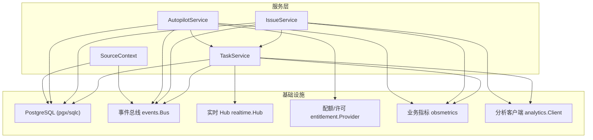
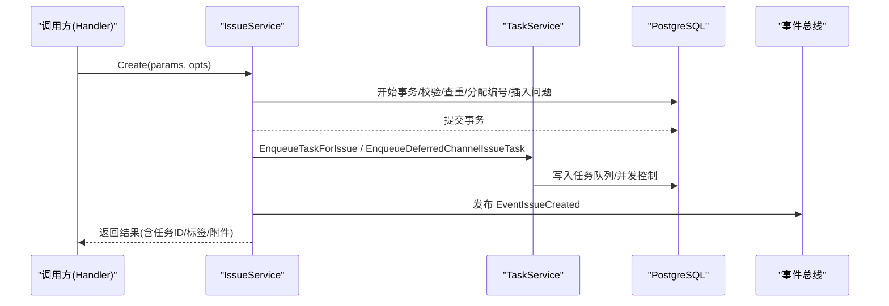
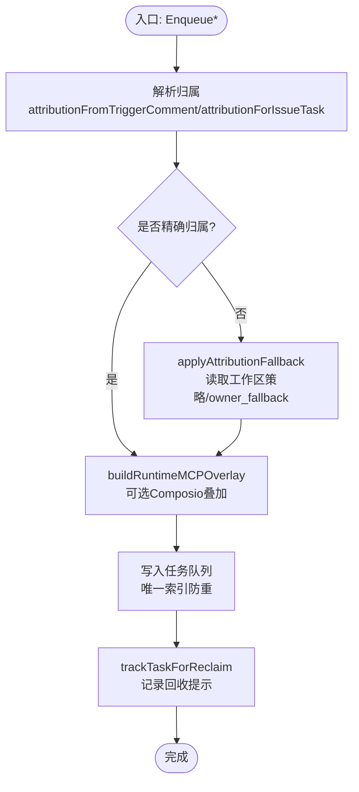
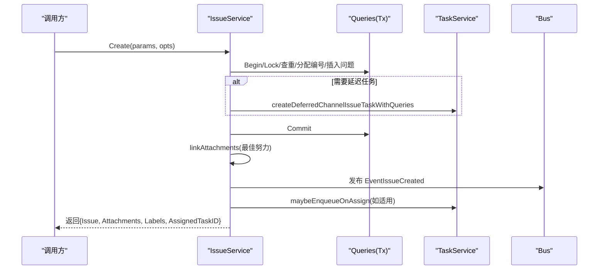
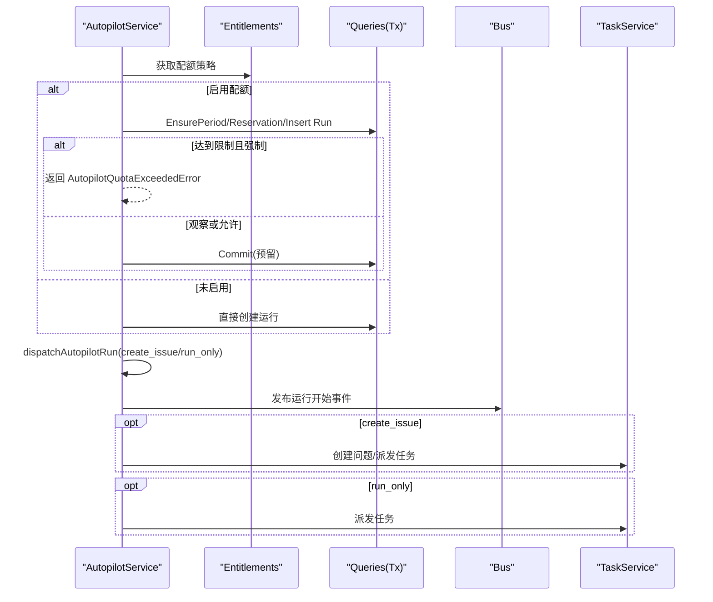
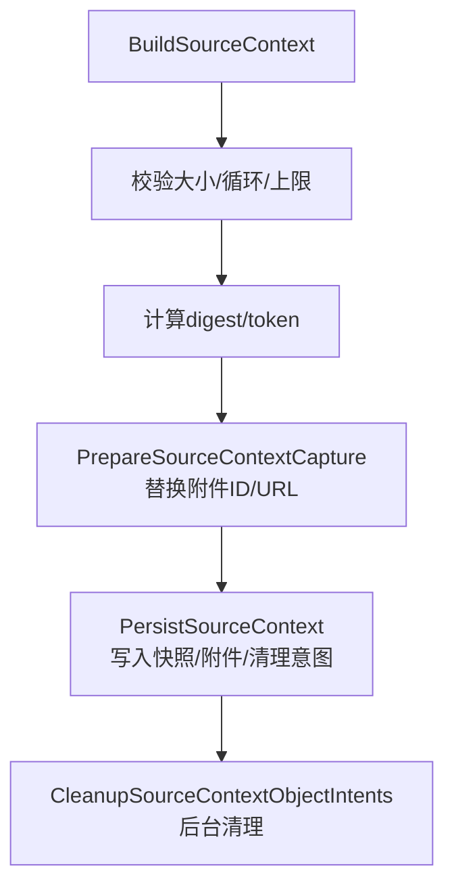
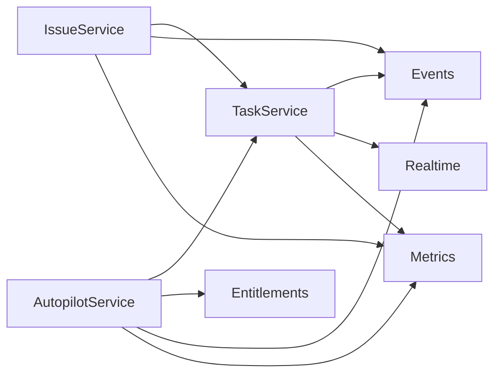

# 业务服务层

<cite>
**本文引用的文件**
- [task.go](file://server/internal/service/task.go)
- [issue.go](file://server/internal/service/issue.go)
- [autopilot.go](file://server/internal/service/autopilot.go)
- [autopilot_quota.go](file://server/internal/service/autopilot_quota.go)
- [source_context.go](file://server/internal/service/source_context.go)
- [go.mod](file://server/go.mod)
</cite>

## 目录
1. [简介](#简介)
2. [项目结构](#项目结构)
3. [核心组件](#核心组件)
4. [架构总览](#架构总览)
5. [详细组件分析](#详细组件分析)
6. [依赖关系分析](#依赖关系分析)
7. [性能考量](#性能考量)
8. [故障排查指南](#故障排查指南)
9. [结论](#结论)
10. [附录](#附录)

## 简介
本文件面向 Multica 后端（Go + Chi + sqlc + gorilla/websocket）的业务服务层，聚焦任务管理、问题（Issue）管理、自动化（Autopilot）与工作区相关能力的服务组织与职责边界。服务层封装复杂业务逻辑，对外暴露简洁接口；在事务处理、数据一致性与并发控制方面采用数据库锁、唯一索引、幂等键与事件总线等机制；并通过指标、遥测与错误码提升可观测性与可维护性。

## 项目结构
服务层位于 server/internal/service，按业务能力划分文件：
- 任务服务：task.go
- 问题服务：issue.go
- 自动化服务：autopilot.go、autopilot_quota.go
- 来源上下文（快速创建/快照）：source_context.go
- 外部依赖声明：server/go.mod

图表来源
- [task.go:39-91](file://server/internal/service/task.go#L39-L91)
- [issue.go:27-47](file://server/internal/service/issue.go#L27-L47)
- [autopilot.go:31-55](file://server/internal/service/autopilot.go#L31-L55)
- [autopilot_quota.go:17-52](file://server/internal/service/autopilot_quota.go#L17-L52)
- [source_context.go:22-62](file://server/internal/service/source_context.go#L22-L62)

章节来源
- [task.go:39-91](file://server/internal/service/task.go#L39-L91)
- [issue.go:27-47](file://server/internal/service/issue.go#L27-L47)
- [autopilot.go:31-55](file://server/internal/service/autopilot.go#L31-L55)
- [autopilot_quota.go:17-52](file://server/internal/service/autopilot_quota.go#L17-L52)
- [source_context.go:22-62](file://server/internal/service/source_context.go#L22-L62)
- [go.mod:1-84](file://server/go.mod#L1-L84)

## 核心组件
- TaskService：负责任务的入队、认领、完成、失败、去重、归属判定、MCP 叠加、快速建议等全生命周期管理。
- IssueService：负责问题创建、标签关联、附件链接、自动派发智能体任务、广播与指标采集。
- AutopilotService：负责自动化触发、运行记录、执行模式（创建问题/仅运行）、配额与限流、恢复与修复。
- SourceContext：负责“来源上下文”的构建、校验、持久化与清理，支撑快速创建与智能体输入预算控制。

章节来源
- [task.go:39-91](file://server/internal/service/task.go#L39-L91)
- [issue.go:27-47](file://server/internal/service/issue.go#L27-L47)
- [autopilot.go:31-55](file://server/internal/service/autopilot.go#L31-L55)
- [source_context.go:22-62](file://server/internal/service/source_context.go#L22-L62)

## 架构总览
服务层通过 TxStarter 开启事务，使用 sqlc 生成的 Queries 访问 PostgreSQL；通过 Bus 发布领域事件；通过 Hub 推送实时消息；通过 Entitlements 获取工作区级配额策略；通过 Analytics/Metrics 上报指标与分析事件。

图表来源
- [issue.go:214-512](file://server/internal/service/issue.go#L214-L512)
- [task.go:326-332](file://server/internal/service/task.go#L326-L332)

章节来源
- [issue.go:214-512](file://server/internal/service/issue.go#L214-L512)
- [task.go:326-332](file://server/internal/service/task.go#L326-L332)

## 详细组件分析

### 任务服务（TaskService）
- 职责边界
  - 任务入队：支持评论触发、直接指派、提及、Squad 领导等路径；计算归属（originator/accountable），必要时应用 owner_fallback。
  - 并发控制：利用唯一索引防止重复待执行任务；使用 ReclaimCheck/EmptyClaimCache 优化空闲轮询与回收。
  - 运行时集成：可选 Composio MCP Overlay 注入；QuickActions 生成聊天后续建议。
  - 指标与事件：记录入队、度量、实时通知。
- 关键流程（入队与归属判定）

图表来源
- [task.go:408-584](file://server/internal/service/task.go#L408-L584)
- [task.go:740-779](file://server/internal/service/task.go#L740-L779)
- [task.go:366-406](file://server/internal/service/task.go#L366-L406)
- [task.go:198-242](file://server/internal/service/task.go#L198-L242)

- 使用示例（概念）
  - 评论触发任务：传入 workspaceID 与 commentID，服务会解析链式归属并决定是否允许入队。
  - 直接指派任务：传入 issue 与 assignee，若状态非 backlog 且运行时可用则入队。
- 错误处理模式
  - ErrAttributionFailClosed：无法确定精确责任人且策略拒绝降级时拒绝入队。
  - ErrDuplicatePendingTask：并发入队冲突，视为“已有兄弟任务”，上层应返回成功形态或 409。
- 性能优化建议
  - 使用 EmptyClaimCache 减少空任务时的 DB 扫描。
  - 使用 ReclaimCheck 降低无意义 reclaim 更新。
  - 摘要截断与输出裁剪避免大对象传输。

章节来源
- [task.go:39-91](file://server/internal/service/task.go#L39-L91)
- [task.go:198-242](file://server/internal/service/task.go#L198-L242)
- [task.go:366-406](file://server/internal/service/task.go#L366-L406)
- [task.go:408-584](file://server/internal/service/task.go#L408-L584)
- [task.go:740-779](file://server/internal/service/task.go#L740-L779)

### 问题服务（IssueService）
- 职责边界
  - 原子创建：在事务内完成父/项目校验、查重、编号分配、插入问题、标签绑定、可选延迟任务写入。
  - 后置动作：附件链接（最佳努力）、广播事件、指标采集、根据指派自动派发任务或 Squad 领导任务。
- 关键流程（创建问题）

图表来源
- [issue.go:214-512](file://server/internal/service/issue.go#L214-L512)
- [issue.go:590-610](file://server/internal/service/issue.go#L590-L610)
- [issue.go:727-766](file://server/internal/service/issue.go#L727-L766)

- 使用示例（概念）
  - 手动创建：携带标题、描述、状态、优先级、指派、标签、附件等参数。
  - 渠道媒体创建：先持久化延迟任务，再在媒体就绪后提升为正式任务。
- 错误处理模式
  - ErrActiveDuplicate：存在活跃重复问题。
  - ErrParentIssueNotFound/ErrProjectNotFound：跨工作区或不存在。
  - ErrIssueLabelNotFound：标签不在工作区或非问题标签。
  - ErrIssueStatusUnavailable：自定义状态在事务期间被归档。
- 性能优化建议
  - 标签预校验与去重，避免多次无效写入。
  - 位置分配 NextTopPosition 在事务中保证并发安全。
  - 附件链接失败不阻断主流程（最佳努力）。

章节来源
- [issue.go:27-47](file://server/internal/service/issue.go#L27-L47)
- [issue.go:214-512](file://server/internal/service/issue.go#L214-L512)
- [issue.go:590-610](file://server/internal/service/issue.go#L590-L610)
- [issue.go:727-766](file://server/internal/service/issue.go#L727-L766)

### 自动化服务（AutopilotService）
- 职责边界
  - 触发入口：计划调度、Webhook、API、手动触发；统一进入 dispatchAutopilot。
  - 执行模式：create_issue（创建问题并派发任务）与 run_only（直接派发任务）。
  - 配额与限流：基于 Entitlements 的策略，支持观察/强制执行、预留与消费、阻塞计数与通知。
  - 恢复与修复：处理部分状态运行、任务链接修复、Webhook 投递幂等。
- 关键流程（调度与配额）

图表来源
- [autopilot.go:119-170](file://server/internal/service/autopilot.go#L119-L170)
- [autopilot.go:519-622](file://server/internal/service/autopilot.go#L519-L622)
- [autopilot_quota.go:111-224](file://server/internal/service/autopilot_quota.go#L111-L224)

- 使用示例（概念）
  - 计划触发：传入 triggerID、plannedAt，确保同一计划时间幂等。
  - Webhook 投递：AdmitAutopilotWebhookDelivery 幂等创建运行，随后由 worker 推进。
  - 手动触发：DispatchAutopilotManualWithKey 支持请求级幂等键。
- 错误处理模式
  - AutopilotQuotaExceededError：配额超限，包含 Used/Reserved/Limit/ResetAt。
  - 部分状态恢复：recoverPartialAutopilotRun 将卡住的运行标记失败并释放槽位。
- 性能优化建议
  - 配额表 CAS 操作与预留/消费分离，减少热点竞争。
  - 计划时间唯一索引避免重复运行。
  - 失败/跳过路径快速落库，便于监控与重试。

章节来源
- [autopilot.go:119-170](file://server/internal/service/autopilot.go#L119-L170)
- [autopilot.go:519-622](file://server/internal/service/autopilot.go#L519-L622)
- [autopilot_quota.go:111-224](file://server/internal/service/autopilot_quota.go#L111-L224)

### 来源上下文（SourceContext）
- 职责边界
  - 构建快照：从问题与评论线程构建不可变快照，计算 digest 与 token，限制大小与附件数量。
  - 持久化：克隆附件、重写 URL、写入快照与附件行，清理意图。
  - 清理：回收未使用的对象意图，清理过期/废弃的上下文与附件。
- 关键流程（构建与持久化）

图表来源
- [source_context.go:400-507](file://server/internal/service/source_context.go#L400-L507)
- [source_context.go:524-637](file://server/internal/service/source_context.go#L524-L637)
- [source_context.go:639-714](file://server/internal/service/source_context.go#L639-L714)

- 使用示例（概念）
  - 快速创建：先构建并校验快照，再克隆附件并持久化，最后关联到问题或任务。
  - 智能体输入预算：ValidateSourceContextAgentInput 确保快照+提示不超过预算。
- 错误处理模式
  - ErrAnchorCommentDeleted/ErrSourceIssueDeleted/ErrSourceContextTooLarge 等明确语义错误。
  - 清理过程带超时与回退，避免阻塞主流程。
- 性能优化建议
  - 限制注释数与字节数，避免过大上下文。
  - 批量查询附件并按 ID 排序，稳定快照。
  - 清理任务分片与租约，避免长事务。

章节来源
- [source_context.go:22-62](file://server/internal/service/source_context.go#L22-L62)
- [source_context.go:400-507](file://server/internal/service/source_context.go#L400-L507)
- [source_context.go:524-637](file://server/internal/service/source_context.go#L524-L637)
- [source_context.go:639-714](file://server/internal/service/source_context.go#L639-L714)

## 依赖关系分析
- 服务间依赖
  - IssueService 依赖 TaskService 进行自动派发。
  - AutopilotService 依赖 TaskService 派发任务，依赖 Entitlements 做配额决策。
  - TaskService 可选依赖 Composio（MCP 叠加）与 QuickActions（LLM 建议）。
- 外部依赖
  - PostgreSQL：通过 pgx 与 sqlc 生成的 Queries 访问。
  - 事件总线：用于跨服务/模块的事件传播。
  - 实时 Hub：推送任务/问题变更。
  - 指标与分析：业务指标与分析事件上报。

图表来源
- [issue.go:27-47](file://server/internal/service/issue.go#L27-L47)
- [autopilot.go:31-55](file://server/internal/service/autopilot.go#L31-L55)
- [task.go:39-91](file://server/internal/service/task.go#L39-L91)

章节来源
- [issue.go:27-47](file://server/internal/service/issue.go#L27-L47)
- [autopilot.go:31-55](file://server/internal/service/autopilot.go#L31-L55)
- [task.go:39-91](file://server/internal/service/task.go#L39-L91)

## 性能考量
- 事务与锁
  - 使用 TxStarter 统一管理事务；在事务内加共享锁/独占锁保护关键资源（如状态目录、位置分配）。
  - 通过唯一索引与 CAS 操作实现幂等与并发安全（如任务去重、配额预留）。
- 缓存与提示
  - EmptyClaimCache 减少空任务场景下的 DB 扫描。
  - ReclaimCheck 降低无意义的 reclaim 更新频率。
- 数据裁剪
  - 摘要与合成评论长度限制，避免大对象在网络中传输。
  - 来源上下文大小限制，保障智能体 prompt 预算。
- 异步与最佳努力
  - 附件链接、指标上报、通知发送等作为最佳努力，不阻塞主事务。
- 批处理与限额
  - 清理任务以 limit 分批执行，避免长时间占用资源。

[本节为通用指导，无需具体文件引用]

## 故障排查指南
- 常见问题定位
  - 任务重复入队：检查是否命中唯一索引冲突；参考 ErrDuplicatePendingTask。
  - 归属失败：当工作区策略为 fail-closed 或无法读取策略时，会拒绝入队；参考 ErrAttributionFailClosed。
  - 配额超限：AutopilotQuotaExceededError 包含已用/预留/限额/重置时间，用于前端展示与告警。
  - 来源上下文过大：ErrSourceContextTooLarge；需调整捕获范围或附件大小。
- 恢复与修复
  - 自动化部分状态恢复：recoverPartialAutopilotRun 将卡住运行标记失败并释放槽位。
  - Webhook 幂等：AdmitAutopilotWebhookDelivery 复用已有运行，避免重复副作用。
  - 来源上下文清理：CleanupSourceContextObjectIntents/CleanupAbandonedSourceContexts 定期回收。
- 可观测性
  - 通过 Bus 发布的事件与 Metrics/Analytics 事件追踪关键路径。
  - 日志中记录关键决策点（如归属判定、配额决策、覆盖物构建失败）。

章节来源
- [task.go:690-779](file://server/internal/service/task.go#L690-L779)
- [autopilot_quota.go:23-52](file://server/internal/service/autopilot_quota.go#L23-L52)
- [autopilot.go:245-307](file://server/internal/service/autopilot.go#L245-L307)
- [source_context.go:56-62](file://server/internal/service/source_context.go#L56-L62)
- [source_context.go:639-714](file://server/internal/service/source_context.go#L639-L714)

## 结论
Multica 的服务层以清晰的分层与职责边界组织业务逻辑：TaskService 专注任务生命周期与并发控制，IssueService 负责问题创建的原子性与一致性，AutopilotService 提供自动化能力与配额治理，SourceContext 保障快速创建与智能体输入预算。通过事务、锁、唯一索引、幂等键与事件总线，系统在一致性、可靠性与可扩展性之间取得平衡；同时借助指标、分析与错误码提升可观测性与可维护性。

[本节为总结，无需具体文件引用]

## 附录
- 技术栈要点
  - Go 1.26.6，Chi 路由，sqlc 生成查询，gorilla/websocket 实时通信。
  - PostgreSQL 17，pgx/v5 驱动。
  - Redis（可选）用于缓存与协调。
  - AWS SDK（S3/Secrets Manager）用于存储与密钥管理。
  - Prometheus 指标与 OpenAI SDK（可选）用于分析/建议。

章节来源
- [go.mod:1-84](file://server/go.mod#L1-L84)