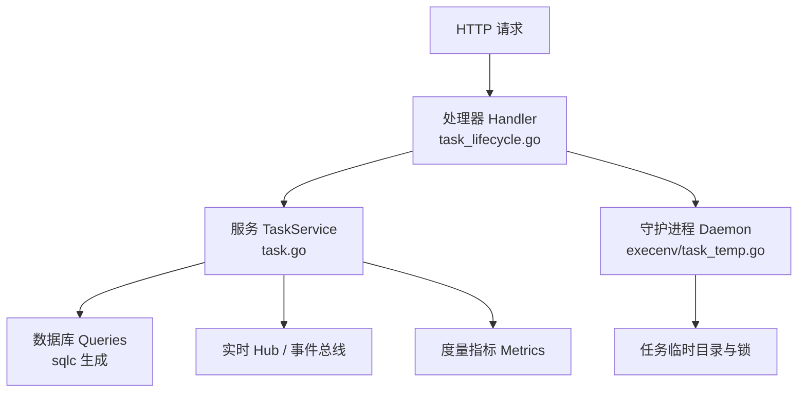
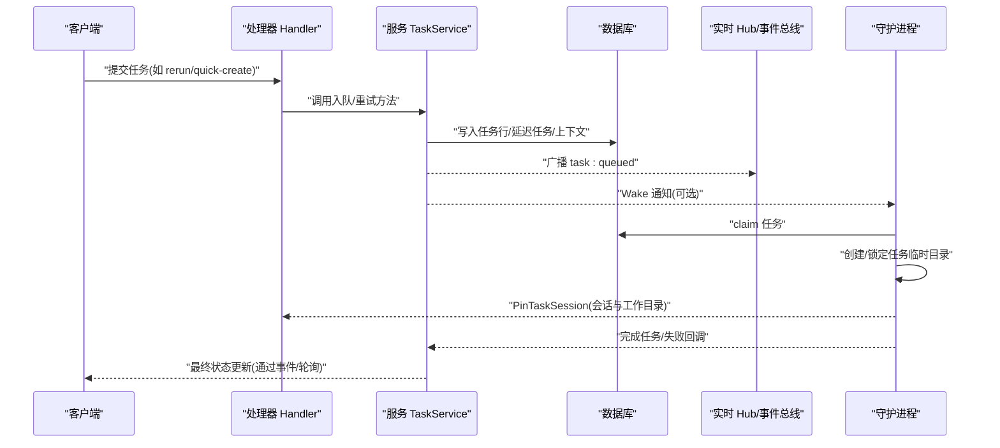
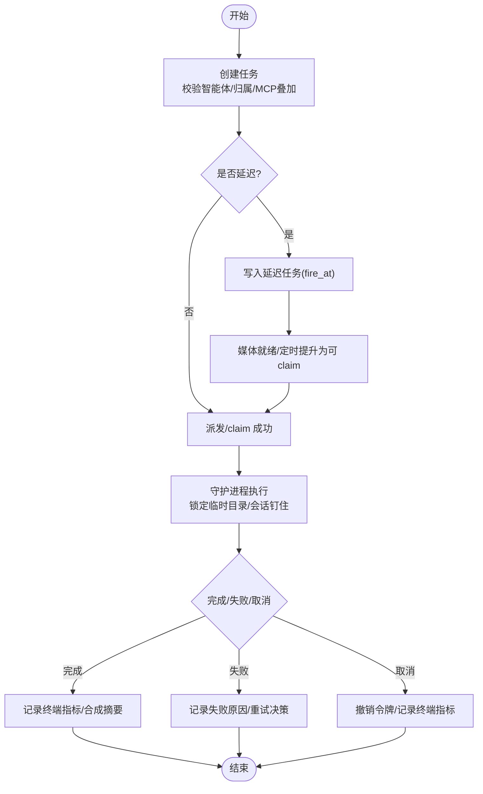
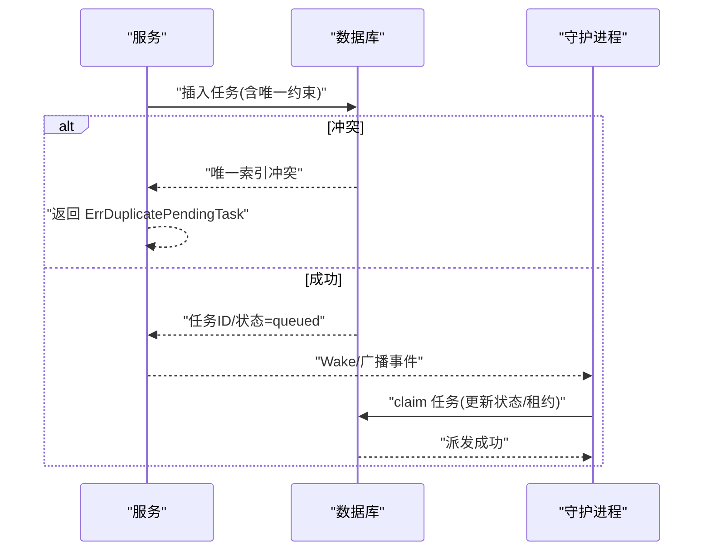
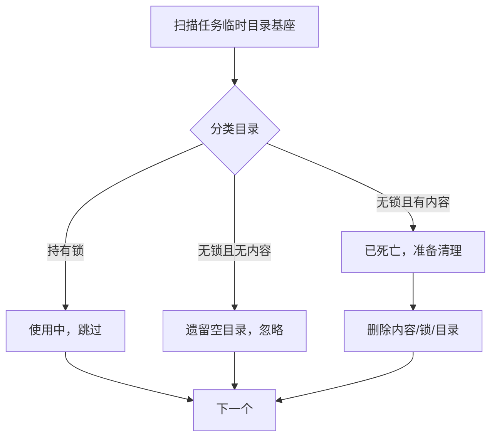
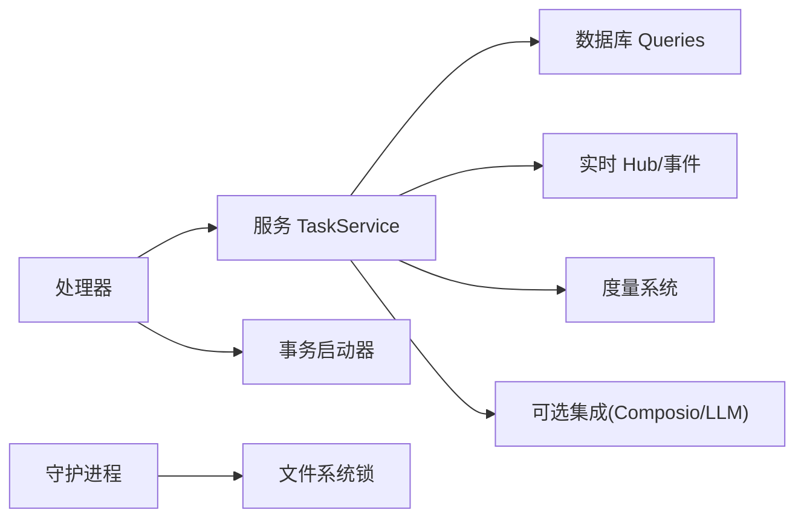

# 任务管理服务

<cite>
**本文引用的文件**
- [server/internal/service/task.go](file://server/internal/service/task.go)
- [server/internal/handler/task_lifecycle.go](file://server/internal/handler/task_lifecycle.go)
- [server/internal/daemon/execenv/task_temp.go](file://server/internal/daemon/execenv/task_temp.go)
</cite>

## 目录
1. [简介](#简介)
2. [项目结构](#项目结构)
3. [核心组件](#核心组件)
4. [架构总览](#架构总览)
5. [详细组件分析](#详细组件分析)
6. [依赖关系分析](#依赖关系分析)
7. [性能考量](#性能考量)
8. [故障排查指南](#故障排查指南)
9. [结论](#结论)
10. [附录：API 使用示例与最佳实践](#附录api-使用示例与最佳实践)

## 简介
本文件面向“任务管理服务”，系统化阐述任务从创建、分配、执行到完成/取消的全生命周期，覆盖任务队列机制、并发控制策略、状态转换规则；说明任务与智能体的绑定关系、工作目录管理与资源隔离；并给出批处理、重试、失败处理与性能优化策略。最后提供 API 使用示例与最佳实践，帮助读者在生产环境中稳定高效地使用任务管理。

## 项目结构
围绕任务管理的代码主要分布在三层：
- 服务层（Service）：封装任务创建、分发、重试、指标采集等核心业务逻辑，负责归属判定、MCP 叠加、事件广播与唤醒。
- 处理器层（Handler）：暴露 HTTP 接口，处理守护进程上报的异常恢复、会话钉住、手动重跑等流程。
- 执行环境（ExecEnv）：在守护进程中管理每个任务的临时目录、锁与清理，确保多进程安全与资源回收。

图表来源
- [server/internal/handler/task_lifecycle.go:17-141](file://server/internal/handler/task_lifecycle.go#L17-L141)
- [server/internal/service/task.go:1100-1349](file://server/internal/service/task.go#L1100-L1349)
- [server/internal/daemon/execenv/task_temp.go:13-141](file://server/internal/daemon/execenv/task_temp.go#L13-L141)

章节来源
- [server/internal/handler/task_lifecycle.go:17-141](file://server/internal/handler/task_lifecycle.go#L17-L141)
- [server/internal/service/task.go:1100-1349](file://server/internal/service/task.go#L1100-L1349)
- [server/internal/daemon/execenv/task_temp.go:13-141](file://server/internal/daemon/execenv/task_temp.go#L13-L141)

## 核心组件
- 任务服务 TaskService
  - 负责各类任务的入队（问题指派、提及、小队队长、快速创建、聊天任务）、延迟任务提升、重试、失败处理、指标与事件广播、归属判定与 MCP 叠加。
  - 关键能力：
    - 任务入队：EnqueueTaskForIssue、EnqueueTaskForMention、EnqueueTaskForSquadLeader、EnqueueQuickCreateTask、EnqueueChatTask 等。
    - 延迟任务：EnqueueDeferredChannelIssueTask、PromoteDeferredChannelIssueTask、PromoteChannelChatTasksIfMediaReady。
    - 重试与恢复：RecoverOrphanedTasksForRuntime（由处理器调用）、HandleFailedTasks、RetrySourceContextQuickCreate。
    - 指标与事件：RecordTaskEnqueued/Dispatched/Started/Terminal/Failed、EventTaskQueued、Wakeup 通知。
    - 归属与权限：attributionFromTriggerComment/attributionForIssueTask、applyAttributionFallback、ResolveAutopilotTriggerPrincipal。
    - MCP 叠加：buildRuntimeMCPOverlay、BuildRuntimeMCPOverlayForMerge。
- 处理器 Handler
  - RecoverOrphanedTasks：守护进程启动时恢复孤儿任务，统一走失败处理管线。
  - PinTaskSession：持久化 session_id 与工作目录，避免崩溃丢失续接指针。
  - RerunIssue / RetrySourceContextQuickCreate：用户触发的手动重试。
- 执行环境 ExecEnv
  - LockTaskTempDir / ReleaseTaskTempLock：基于文件锁的任务临时目录独占。
  - RemoveTaskTempDir / PruneTaskTempDirs：按锁与内容判断是否可安全清理，避免误删运行中目录。

章节来源
- [server/internal/service/task.go:39-91](file://server/internal/service/task.go#L39-L91)
- [server/internal/service/task.go:1100-1349](file://server/internal/service/task.go#L1100-L1349)
- [server/internal/service/task.go:1393-1473](file://server/internal/service/task.go#L1393-L1473)
- [server/internal/service/task.go:1605-1753](file://server/internal/service/task.go#L1605-L1753)
- [server/internal/service/task.go:1918-2190](file://server/internal/service/task.go#L1918-L2190)
- [server/internal/handler/task_lifecycle.go:17-141](file://server/internal/handler/task_lifecycle.go#L17-L141)
- [server/internal/daemon/execenv/task_temp.go:24-141](file://server/internal/daemon/execenv/task_temp.go#L24-L141)

## 架构总览
任务管理采用“服务 + 处理器 + 守护进程”的分层协作：
- 服务层通过 sqlc 生成的 Queries 访问 PostgreSQL，维护任务队列与元数据，并通过 Hub/Bus 广播事件与唤醒守护进程。
- 处理器层暴露 HTTP 端点，将守护进程的恢复、会话钉住、用户重试等操作转化为服务调用。
- 守护进程负责实际执行智能体任务，并在本地维护任务临时目录与锁，保证并发安全与资源回收。

图表来源
- [server/internal/handler/task_lifecycle.go:17-141](file://server/internal/handler/task_lifecycle.go#L17-L141)
- [server/internal/service/task.go:1100-1349](file://server/internal/service/task.go#L1100-L1349)
- [server/internal/daemon/execenv/task_temp.go:24-141](file://server/internal/daemon/execenv/task_temp.go#L24-L141)

## 详细组件分析

### 任务生命周期与状态转换
- 创建（Enqueue）
  - 入口：EnqueueTaskForIssue、EnqueueTaskForMention、EnqueueTaskForSquadLeader、EnqueueQuickCreateTask、EnqueueChatTask 等。
  - 关键步骤：
    - 校验智能体可用性（未归档、有 runtime）。
    - 计算归属（originator/accountable），必要时应用 fail-closed 策略或 owner_fallback。
    - 构建 MCP 叠加（Composio）与连接应用元数据。
    - 写入任务行（立即或延迟 fire_at），广播 queued 事件，唤醒守护进程。
- 分配与派发（Claim/Dispatch）
  - 守护进程 claim 任务后，服务端记录 dispatched 指标；任务进入可执行阶段。
- 执行（Start/Run）
  - 守护进程创建任务临时目录并加锁，持久化 session_id 与工作目录（PinTaskSession）。
  - 执行期间可能产生 LLM 用量，服务层捕获指标。
- 完成（Complete）
  - 服务层记录 terminal 指标，必要时合成摘要评论（受长度限制），发布完成事件。
- 取消（Cancel）
  - 终止任务，撤销该任务令牌，记录 terminal 指标。

图表来源
- [server/internal/service/task.go:1100-1349](file://server/internal/service/task.go#L1100-L1349)
- [server/internal/service/task.go:1918-2190](file://server/internal/service/task.go#L1918-L2190)
- [server/internal/handler/task_lifecycle.go:17-141](file://server/internal/handler/task_lifecycle.go#L17-L141)

章节来源
- [server/internal/service/task.go:1100-1349](file://server/internal/service/task.go#L1100-L1349)
- [server/internal/service/task.go:1918-2190](file://server/internal/service/task.go#L1918-L2190)
- [server/internal/handler/task_lifecycle.go:17-141](file://server/internal/handler/task_lifecycle.go#L17-L141)

### 任务队列机制与并发控制
- 唯一性去重
  - 针对同一 (issue, agent) 的待执行任务存在唯一索引，重复入队会返回 ErrDuplicatePendingTask，上层可合并为“已有并行任务”的友好结果。
- 延迟任务
  - 支持 fire_at 延迟入队（如媒体依赖），后续由提升器在条件满足时转为可 claim。
- 抢占与租约
  - 守护进程 claim 任务后设置租约时间窗口，结合心跳与 reclaim 检查，防止僵尸任务长期占用。
- 会话与输入串行化
  - 聊天任务对 chat_session 加锁，确保同一会话内消息顺序与一致性；通道任务在上下文生成与路由变更时进行版本匹配与锁定。

图表来源
- [server/internal/service/task.go:1100-1349](file://server/internal/service/task.go#L1100-L1349)
- [server/internal/service/task.go:1393-1473](file://server/internal/service/task.go#L1393-L1473)

章节来源
- [server/internal/service/task.go:1100-1349](file://server/internal/service/task.go#L1100-L1349)
- [server/internal/service/task.go:1393-1473](file://server/internal/service/task.go#L1393-L1473)

### 任务与智能体的绑定关系
- 绑定方式
  - 问题指派任务绑定至 issue.assignee.agent。
  - 提及/线程父任务/小队队长任务显式指定 agentID 或 squad leader。
  - 快速创建任务绑定到目标 agent（或 squad leader），上下文携带 squad/project/parent_issue 等提示。
  - 聊天任务绑定到 chat_session.agent。
- 运行时选择
  - 任务行存储 runtime_id，指向具体守护进程实例；若 agent.runtime_id 为空则拒绝入队。
- 授权与归属
  - 通过 attribution 计算 originator/accountable，必要时应用 owner_fallback 或 fail-closed 策略。
  - 自动调度（autopilot）通过 ResolveAutopilotTriggerPrincipal 确定代理身份。

章节来源
- [server/internal/service/task.go:1100-1349](file://server/internal/service/task.go#L1100-L1349)
- [server/internal/service/task.go:1393-1473](file://server/internal/service/task.go#L1393-L1473)
- [server/internal/service/task.go:1605-1753](file://server/internal/service/task.go#L1605-L1753)
- [server/internal/service/task.go:1918-2190](file://server/internal/service/task.go#L1918-L2190)

### 工作目录管理与资源隔离
- 临时目录
  - 每个任务拥有独立临时目录，命名前缀固定，便于 GC 识别。
- 文件锁
  - 通过 .task_lock 实现跨进程独占；先以 .claiming 原子 rename 发布，避免竞态。
- 清理策略
  - 扫描 base 目录，尝试获取锁判断存活；无锁且无内容视为遗留，可按 TTL 清理；有锁则跳过。
  - 删除顺序：先内容再锁再目录，失败时保留锁标记以便下次重试。

图表来源
- [server/internal/daemon/execenv/task_temp.go:160-276](file://server/internal/daemon/execenv/task_temp.go#L160-L276)

章节来源
- [server/internal/daemon/execenv/task_temp.go:13-141](file://server/internal/daemon/execenv/task_temp.go#L13-L141)
- [server/internal/daemon/execenv/task_temp.go:160-276](file://server/internal/daemon/execenv/task_temp.go#L160-L276)

### 批处理、重试与失败处理
- 批处理
  - 批量 claim：守护进程可批量拉取任务，减少网络往返。
  - 批量指标：CaptureQueuedExpiredTasks/CaptureLeaseExpiredTasks 批量记录过期指标。
- 重试机制
  - 守护进程重启后通过 RecoverOrphanedTasks 恢复孤儿任务，统一走 HandleFailedTasks，触发自动重试或回滚。
  - 快速创建的源上下文重试：RetrySourceContextQuickCreate 在事务中转移上下文并创建新任务。
- 失败处理
  - 记录失败原因与类型，区分运行时/超时/输出/取消等类别。
  - 对于无法归因的任务，遵循 fail-closed 策略拒绝入队，避免无主任务。

章节来源
- [server/internal/service/task.go:828-882](file://server/internal/service/task.go#L828-L882)
- [server/internal/handler/task_lifecycle.go:17-59](file://server/internal/handler/task_lifecycle.go#L17-L59)
- [server/internal/service/task.go:1756-1825](file://server/internal/service/task.go#L1756-L1825)

### 性能优化策略
- 指标与缓存
  - 任务分析上下文缓存（LRU 风格），降低高频查询成本。
  - 摘要截断与合成评论长度限制，避免大输出影响响应体积。
- 事件与唤醒
  - 入队后立即广播 queued 事件并 Wake 守护进程，缩短排队等待。
- 并发控制
  - 会话级锁与绑定版本匹配，避免并发写冲突。
  - 唯一索引去重，避免重复任务竞争。
- 资源回收
  - 基于文件锁的 GC，及时释放僵尸任务临时目录，避免磁盘泄漏。

章节来源
- [server/internal/service/task.go:884-920](file://server/internal/service/task.go#L884-L920)
- [server/internal/service/task.go:1230-1349](file://server/internal/service/task.go#L1230-L1349)
- [server/internal/daemon/execenv/task_temp.go:160-276](file://server/internal/daemon/execenv/task_temp.go#L160-L276)

## 依赖关系分析
- 服务层依赖
  - sqlc 生成的 Queries：读写任务、会话、问题、自动调度等实体。
  - 实时 Hub/事件总线：广播任务事件，驱动前端与守护进程。
  - 度量系统：记录任务生命周期与 LLM 用量。
  - 外部集成（可选）：Composio MCP 叠加、快速建议 LLM。
- 处理器层依赖
  - 事务启动器 TxStarter：用于需要事务的操作（如 PinTaskSession）。
  - 认证与授权：校验操作者身份与权限。
- 执行环境依赖
  - 文件系统锁：跨进程互斥与存活检测。
  - 日志与配置：GC 行为与阈值。

图表来源
- [server/internal/handler/task_lifecycle.go:17-141](file://server/internal/handler/task_lifecycle.go#L17-L141)
- [server/internal/service/task.go:39-91](file://server/internal/service/task.go#L39-L91)
- [server/internal/daemon/execenv/task_temp.go:24-141](file://server/internal/daemon/execenv/task_temp.go#L24-L141)

章节来源
- [server/internal/handler/task_lifecycle.go:17-141](file://server/internal/handler/task_lifecycle.go#L17-L141)
- [server/internal/service/task.go:39-91](file://server/internal/service/task.go#L39-L91)
- [server/internal/daemon/execenv/task_temp.go:24-141](file://server/internal/daemon/execenv/task_temp.go#L24-L141)

## 性能考量
- 减少不必要 I/O
  - 入队前预检智能体状态与容量，避免无效任务入队。
  - MCP 叠加与归属判定尽量前置，避免在事务中做网络调用。
- 提高吞吐
  - 批量 claim 与批量指标记录，降低数据库与网络开销。
  - 会话/绑定锁粒度合理，避免过度串行化。
- 资源管理
  - 严格临时目录锁与 GC，防止磁盘泄漏。
  - 控制合成评论长度，避免大响应拖慢链路。

[本节为通用指导，不直接分析具体文件]

## 故障排查指南
- 守护进程重启导致任务卡住
  - 使用 RecoverOrphanedTasks 恢复孤儿任务，统一走失败处理管线，触发自动重试或回滚。
- 会话续接丢失
  - 确认 PinTaskSession 是否正确持久化 session_id 与工作目录；注意与取消路径的锁顺序，避免旧会话指针覆盖新会话。
- 重复入队
  - 遇到 ErrDuplicatePendingTask 属正常去重，上层应合并为“已有并行任务”。
- 临时目录未清理
  - 检查 .task_lock 是否存在且被正确释放；确认 GC 是否启用 legacyTTL；查看 PruneTaskTempDirs 日志。

章节来源
- [server/internal/handler/task_lifecycle.go:17-141](file://server/internal/handler/task_lifecycle.go#L17-L141)
- [server/internal/service/task.go:1100-1349](file://server/internal/service/task.go#L1100-L1349)
- [server/internal/daemon/execenv/task_temp.go:160-276](file://server/internal/daemon/execenv/task_temp.go#L160-L276)

## 结论
任务管理服务通过清晰的分层与严格的并发控制，实现了高可靠的任务生命周期管理。服务层负责业务编排与一致性保障，处理器层提供稳定的外部接口，守护进程负责执行与资源隔离。配合延迟任务、批处理、重试与失败处理机制，以及完善的指标与事件体系，能够在复杂场景下保持高性能与稳定性。

[本节为总结，不直接分析具体文件]

## 附录：API 使用示例与最佳实践
- 常见问题指派任务
  - 调用 EnqueueTaskForIssue，传入 issue 与可选 trigger_comment_id；服务将计算归属、构建 MCP 叠加并写入任务行，随后广播 queued 事件。
  - 参考路径：[server/internal/service/task.go:1100-1349](file://server/internal/service/task.go#L1100-L1349)
- 提及/线程父任务/小队队长任务
  - 分别调用 EnqueueTaskForMention、EnqueueTaskForThreadParent、EnqueueTaskForSquadLeader；后者会标记 is_leader_task 并注入小队简报。
  - 参考路径：[server/internal/service/task.go:1351-1473](file://server/internal/service/task.go#L1351-L1473)
- 快速创建任务
  - 调用 EnqueueQuickCreateTask 或带源上下文的 EnqueueQuickCreateTaskWithSourceContext；上下文包含 prompt、priority、due_date、project/squad/parent_issue 等。
  - 参考路径：[server/internal/service/task.go:1605-1753](file://server/internal/service/task.go#L1605-L1753)
- 聊天任务
  - 调用 EnqueueChatTask 或 EnqueueChannelChatTask；通道任务需携带 context_revision 与 binding/route 版本，确保上下文一致。
  - 参考路径：[server/internal/service/task.go:1918-2190](file://server/internal/service/task.go#L1918-L2190)
- 守护进程恢复与会话钉住
  - 守护进程启动调用 RecoverOrphanedTasks；执行初期调用 PinTaskSession 持久化 session_id 与工作目录。
  - 参考路径：[server/internal/handler/task_lifecycle.go:17-141](file://server/internal/handler/task_lifecycle.go#L17-L141)
- 手动重试
  - 调用 RerunIssue 或 RetrySourceContextQuickCreate；前者针对问题任务，后者针对快速创建的源上下文重试。
  - 参考路径：[server/internal/handler/task_lifecycle.go:143-274](file://server/internal/handler/task_lifecycle.go#L143-L274)、[server/internal/service/task.go:1756-1825](file://server/internal/service/task.go#L1756-L1825)

最佳实践
- 入队前预检智能体状态与容量，避免无效任务。
- 使用延迟任务处理媒体依赖，确保上下文完整后再派发。
- 利用唯一索引去重，上层合并重复入队为友好提示。
- 会话相关操作务必加锁，避免并发写冲突。
- 关注临时目录锁与 GC，防止磁盘泄漏。
- 合理使用 MCP 叠加与归属判定，确保授权与审计一致。

[本节为使用指导，不直接分析具体文件]