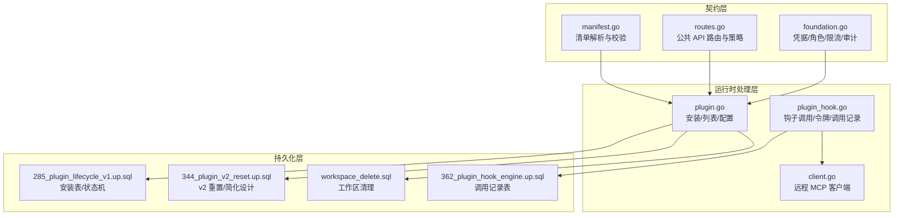
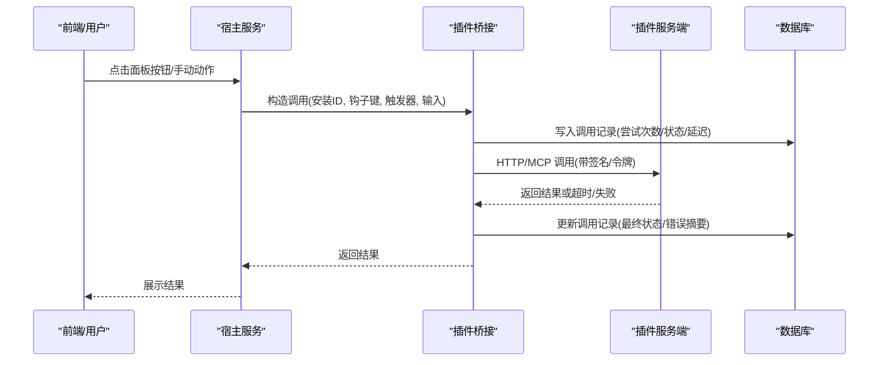
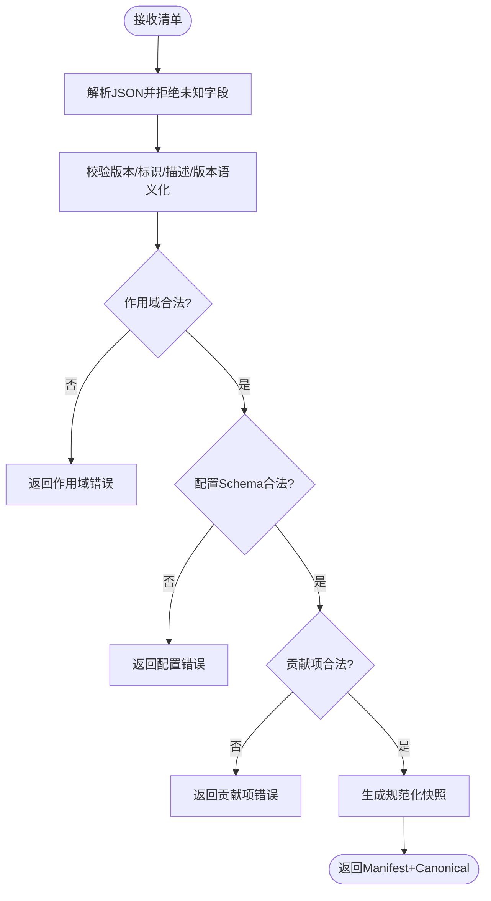
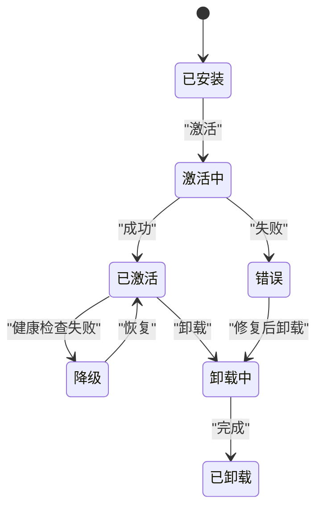
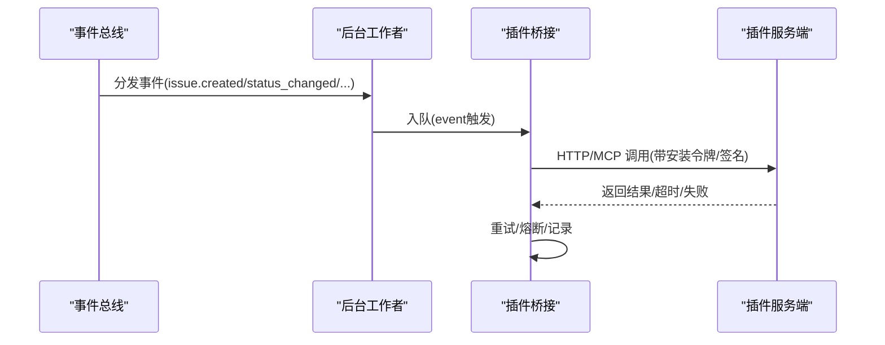
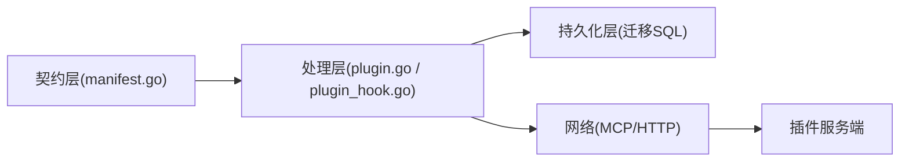

# 插件服务

<cite>
**本文引用的文件**
- [manifest.go](file://server/pkg/plugincontract/manifest.go)
- [routes.go](file://server/pkg/publicapi/v1/routes.go)
- [foundation.go](file://server/pkg/publicapi/v1/foundation.go)
- [plugin.go](file://server/internal/handler/plugin.go)
- [plugin_hook.go](file://server/internal/handler/plugin_hook.go)
- [362_plugin_hook_engine.up.sql](file://server/migrations/362_plugin_hook_engine.up.sql)
- [285_plugin_lifecycle_v1.up.sql](file://server/migrations/285_plugin_lifecycle_v1.up.sql)
- [344_plugin_v2_reset.up.sql](file://server/migrations/344_plugin_v2_reset.up.sql)
- [workspace_delete.sql](file://server/pkg/db/queries/workspace_delete.sql)
- [client.go](file://server/pkg/remotemcp/client.go)
- [security-model.zh.mdx](file://apps/docs/content/docs/security-model.zh.mdx)
- [multica.plugin.json（hello-panel）](file://examples/plugins/hello-panel/multica.plugin.json)
- [multica.plugin.json（deploy-sentinel）](file://examples/plugins/deploy-sentinel/multica.plugin.json)
</cite>

## 目录
1. [简介](#简介)
2. [项目结构](#项目结构)
3. [核心组件](#核心组件)
4. [架构总览](#架构总览)
5. [详细组件分析](#详细组件分析)
6. [依赖关系分析](#依赖关系分析)
7. [性能考虑](#性能考虑)
8. [故障排查指南](#故障排查指南)
9. [结论](#结论)
10. [附录：开发指南、API 参考与部署配置](#附录开发指南api-参考与部署配置)

## 简介
本文件面向插件开发者与平台运维人员，系统性说明 Multica 插件服务的加载、验证、执行机制；插件生命周期（安装、更新、卸载、依赖解析）；插件间通信协议、事件桥接与消息传递；安全沙箱、权限控制与资源限制；并提供插件开发指南、API 参考与部署配置说明。

## 项目结构
插件系统由“契约层 + 运行时处理层 + 持久化层”组成：
- 契约层：定义插件清单 manifest、能力声明（Surface/Hook/Resource）、作用域（scopes）、配置 schema 等。
- 运行时处理层：负责插件安装、启用/禁用、钩子调用、回调令牌管理、调度与重试、MCP 客户端等。
- 持久化层：通过迁移脚本维护插件安装、发布版本、调用记录、调度计划等数据模型。



图表来源
- [manifest.go:176-235](file://server/pkg/plugincontract/manifest.go#L176-L235)
- [routes.go:1-67](file://server/pkg/publicapi/v1/routes.go#L1-L67)
- [foundation.go:11-73](file://server/pkg/publicapi/v1/foundation.go#L11-L73)
- [plugin.go:16-200](file://server/internal/handler/plugin.go#L16-L200)
- [plugin_hook.go:1-200](file://server/internal/handler/plugin_hook.go#L1-L200)
- [client.go:263-307](file://server/pkg/remotemcp/client.go#L263-L307)
- [285_plugin_lifecycle_v1.up.sql:73-103](file://server/migrations/285_plugin_lifecycle_v1.up.sql#L73-L103)
- [362_plugin_hook_engine.up.sql:1-30](file://server/migrations/362_plugin_hook_engine.up.sql#L1-L30)
- [344_plugin_v2_reset.up.sql:1-15](file://server/migrations/344_plugin_v2_reset.up.sql#L1-L15)
- [workspace_delete.sql:629-647](file://server/pkg/db/queries/workspace_delete.sql#L629-L647)

章节来源
- [manifest.go:176-235](file://server/pkg/plugincontract/manifest.go#L176-L235)
- [routes.go:1-67](file://server/pkg/publicapi/v1/routes.go#L1-L67)
- [foundation.go:11-73](file://server/pkg/publicapi/v1/foundation.go#L11-L73)
- [plugin.go:16-200](file://server/internal/handler/plugin.go#L16-L200)
- [plugin_hook.go:1-200](file://server/internal/handler/plugin_hook.go#L1-L200)
- [client.go:263-307](file://server/pkg/remotemcp/client.go#L263-L307)
- [285_plugin_lifecycle_v1.up.sql:73-103](file://server/migrations/285_plugin_lifecycle_v1.up.sql#L73-L103)
- [362_plugin_hook_engine.up.sql:1-30](file://server/migrations/362_plugin_hook_engine.up.sql#L1-L30)
- [344_plugin_v2_reset.up.sql:1-15](file://server/migrations/344_plugin_v2_reset.up.sql#L1-L15)
- [workspace_delete.sql:629-647](file://server/pkg/db/queries/workspace_delete.sql#L629-L647)

## 核心组件
- 插件清单与校验：严格解析 v1 清单，拒绝未知字段，生成规范化的“已同意快照”，并校验作用域、配置 schema、贡献项（界面、钩子、资源）。
- 公共 API 与策略：统一暴露共享资源与插件扩展能力，基于凭据类型（用户 OAuth、个人访问令牌、插件安装令牌、插件调用令牌）与风险等级进行鉴权与限流。
- 插件安装与生命周期：以工作区为粒度管理安装，支持激活/停用/卸载，使用状态机与并发保护保证一致性。
- 钩子引擎与调用记录：主机向插件服务端发起 HTTP/MCP 调用，记录每次调用的触发器、状态、延迟、重试次数与错误摘要，用于排障与熔断。
- 远程 MCP 客户端：对远端 MCP 服务发起请求，限制响应大小，携带会话标识，确保可观测性与可控性。

章节来源
- [manifest.go:356-446](file://server/pkg/plugincontract/manifest.go#L356-L446)
- [routes.go:11-67](file://server/pkg/publicapi/v1/routes.go#L11-L67)
- [foundation.go:11-73](file://server/pkg/publicapi/v1/foundation.go#L11-L73)
- [285_plugin_lifecycle_v1.up.sql:73-103](file://server/migrations/285_plugin_lifecycle_v1.up.sql#L73-L103)
- [362_plugin_hook_engine.up.sql:1-30](file://server/migrations/362_plugin_hook_engine.up.sql#L1-L30)
- [client.go:263-307](file://server/pkg/remotemcp/client.go#L263-L307)

## 架构总览
插件系统与宿主之间的交互分为三类：
- Action（插件 → 宿主）：插件通过受控 API（如上下文读取、存储读写）访问宿主能力，受作用域与凭据约束。
- Hook（宿主 → 插件）：宿主按清单声明的触发器（ui/manual/event/schedule/agent）调用插件提供的能力，传输协议为 HTTP 或 MCP。
- Resource（静态贡献）：技能文本等资源不参与调用，仅作为静态内容被宿主挂载。



图表来源
- [plugin_hook.go:31-94](file://server/internal/handler/plugin_hook.go#L31-L94)
- [362_plugin_hook_engine.up.sql:18-30](file://server/migrations/362_plugin_hook_engine.up.sql#L18-L30)
- [client.go:272-307](file://server/pkg/remotemcp/client.go#L272-L307)

## 详细组件分析

### 清单解析与作用域校验
- 清单必须为 v1，禁止未知字段，解析后生成规范化 JSON 作为“管理员同意的快照”。
- 作用域为闭集，包含固定作用域与 net: 域名前缀；网络出口必须与 net: 作用域精确匹配。
- 配置 schema 仅允许有限类型，枚举/多行/占位符等元数据用于渲染表单。
- 贡献项总量受限，且每个 surface/hook/resource 需满足路径、URL、触发器等约束。



图表来源
- [manifest.go:356-446](file://server/pkg/plugincontract/manifest.go#L356-L446)
- [manifest.go:448-480](file://server/pkg/plugincontract/manifest.go#L448-L480)
- [manifest.go:753-781](file://server/pkg/plugincontract/manifest.go#L753-L781)

章节来源
- [manifest.go:356-446](file://server/pkg/plugincontract/manifest.go#L356-L446)
- [manifest.go:448-480](file://server/pkg/plugincontract/manifest.go#L448-L480)
- [manifest.go:753-781](file://server/pkg/plugincontract/manifest.go#L753-L781)

### 插件安装与生命周期
- 安装表包含工作区、插件 ID、来源种类、期望/活跃版本、启用标志、生命周期状态、时间戳等。
- 生命周期状态机：installed → activating → active → degraded/error → uninstalling → uninstalled。
- 发布版本不可变，撤销/隔离是唯一变更方式；索引与工作区唯一性约束保障并发安全。
- 工作区删除时级联清理包、版本、文件与安装记录。



图表来源
- [285_plugin_lifecycle_v1.up.sql:73-103](file://server/migrations/285_plugin_lifecycle_v1.up.sql#L73-L103)
- [workspace_delete.sql:629-647](file://server/pkg/db/queries/workspace_delete.sql#L629-L647)

章节来源
- [285_plugin_lifecycle_v1.up.sql:73-103](file://server/migrations/285_plugin_lifecycle_v1.up.sql#L73-L103)
- [workspace_delete.sql:629-647](file://server/pkg/db/queries/workspace_delete.sql#L629-L647)

### 钩子调用与事件桥接
- 触发器：ui、manual、event、schedule、agent。其中 event/schedule 异步，不阻塞用户请求。
- 调用记录表记录安装 ID、工作区 ID、钩子键、触发器、状态、事件类型、尝试次数、延迟、错误摘要、计划时间等。
- 事件订阅需与已知事件白名单一致，读权限映射到对应作用域。



图表来源
- [plugin_hook.go:13-21](file://server/internal/handler/plugin_hook.go#L13-L21)
- [362_plugin_hook_engine.up.sql:1-30](file://server/migrations/362_plugin_hook_engine.up.sql#L1-L30)
- [manifest.go:108-166](file://server/pkg/plugincontract/manifest.go#L108-L166)

章节来源
- [plugin_hook.go:13-21](file://server/internal/handler/plugin_hook.go#L13-L21)
- [362_plugin_hook_engine.up.sql:1-30](file://server/migrations/362_plugin_hook_engine.up.sql#L1-L30)
- [manifest.go:108-166](file://server/pkg/plugincontract/manifest.go#L108-L166)

### 插件间通信协议与消息传递
- 传输协议：HTTP 与 MCP。HTTP 要求 HTTPS 且主机必须在 net: 作用域内；MCP 客户端限制响应大小并携带会话头。
- 令牌与签名：安装令牌与签名密钥用于插件回调鉴权与消息完整性校验。
- 作用域驱动的安全边界：iframe CSP connect-src 与 hook transport host 校验均来源于作用域集合。

```mermaid
classDiagram
class Manifest {
+Scopes[]
+Contributes{Surfaces[], Hooks[], Resources[]}
}
class Hook {
+Key
+Triggers[]
+Transport{Type, URL}
+TimeoutMs
}
class RemoteMCPClient {
+notify(ctx, endpoint, headers, sessionID, payload) error
}
Manifest --> Hook : "声明"
Hook --> RemoteMCPClient : "HTTP/MCP 调用"
```

图表来源
- [manifest.go:200-235](file://server/pkg/plugincontract/manifest.go#L200-L235)
- [manifest.go:753-781](file://server/pkg/plugincontract/manifest.go#L753-L781)
- [client.go:263-307](file://server/pkg/remotemcp/client.go#L263-L307)

章节来源
- [manifest.go:200-235](file://server/pkg/plugincontract/manifest.go#L200-L235)
- [manifest.go:753-781](file://server/pkg/plugincontract/manifest.go#L753-L781)
- [client.go:263-307](file://server/pkg/remotemcp/client.go#L263-L307)

### 安全沙箱、权限控制与资源限制
- 进程级安全边界：智能体运行以守护进程用户的完整权限执行，默认无文件系统沙箱；隔离应置于守护进程之外。
- 插件侧权限：通过作用域与凭据类型（插件安装/调用）限制能力范围；公共 API 策略将风险等级、审计级别与限流配置绑定到路由。
- 资源限制：清单大小、版本长度、贡献项数量、作用域数量、hook 超时、MCP 响应大小上限等。

章节来源
- [security-model.zh.mdx:1-18](file://apps/docs/content/docs/security-model.zh.mdx#L1-L18)
- [routes.go:11-67](file://server/pkg/publicapi/v1/routes.go#L11-L67)
- [foundation.go:11-73](file://server/pkg/publicapi/v1/foundation.go#L11-L73)
- [manifest.go:356-446](file://server/pkg/plugincontract/manifest.go#L356-L446)
- [client.go:263-307](file://server/pkg/remotemcp/client.go#L263-L307)

## 依赖关系分析
- 契约层独立于私有处理器与服务实现，确保插件作者与宿主间的稳定接口。
- 运行时处理层依赖契约层进行清单解析与能力检查，依赖持久化层进行安装、调用记录与调度管理。
- 外部依赖：PostgreSQL（迁移脚本）、HTTP/MCP 网络栈、Cron 解析器。



图表来源
- [manifest.go:1-13](file://server/pkg/plugincontract/manifest.go#L1-L13)
- [plugin.go:16-200](file://server/internal/handler/plugin.go#L16-L200)
- [plugin_hook.go:1-200](file://server/internal/handler/plugin_hook.go#L1-L200)
- [client.go:263-307](file://server/pkg/remotemcp/client.go#L263-L307)

章节来源
- [manifest.go:1-13](file://server/pkg/plugincontract/manifest.go#L1-L13)
- [plugin.go:16-200](file://server/internal/handler/plugin.go#L16-L200)
- [plugin_hook.go:1-200](file://server/internal/handler/plugin_hook.go#L1-L200)
- [client.go:263-307](file://server/pkg/remotemcp/client.go#L263-L307)

## 性能考虑
- 清单解析与校验在加载阶段完成，避免运行时动态扩展带来的不确定性。
- 钩子调用采用异步事件与调度，避免阻塞用户请求；调用记录仅保留必要元数据，降低存储压力。
- MCP 客户端限制响应大小，防止大响应导致内存与带宽压力。
- 工作区删除时批量清理插件相关数据，减少孤儿记录。

[本节提供通用指导，无需特定文件引用]

## 故障排查指南
- 清单解析失败：检查 manifest_version、key 格式、version 语义化、作用域是否受支持、transport.url 是否为 HTTPS 且主机在 net: 作用域内。
- 钩子调用失败：查看调用记录的状态、尝试次数、延迟与错误摘要；确认插件服务端可达、令牌有效、签名正确。
- 生命周期异常：检查工作区安装状态、版本激活情况、是否存在冲突或配额问题；必要时重新激活或卸载重装。
- 工作区清理：确认删除流程是否按预期清理包、版本、文件与安装记录。

章节来源
- [manifest.go:356-446](file://server/pkg/plugincontract/manifest.go#L356-L446)
- [manifest.go:753-781](file://server/pkg/plugincontract/manifest.go#L753-L781)
- [plugin_hook.go:121-168](file://server/internal/handler/plugin_hook.go#L121-L168)
- [285_plugin_lifecycle_v1.up.sql:73-103](file://server/migrations/285_plugin_lifecycle_v1.up.sql#L73-L103)
- [workspace_delete.sql:629-647](file://server/pkg/db/queries/workspace_delete.sql#L629-L647)

## 结论
Multica 插件系统通过严格的清单契约、明确的作用域与凭据体系、以及健壮的钩子引擎与调用记录，实现了可扩展、可观测、可治理的插件生态。安全边界以守护进程用户为根，结合作用域与网络白名单，形成纵深防御。建议插件作者遵循最小权限原则，合理声明作用域与传输目标，并利用配置 schema 与资源贡献提升用户体验。

[本节为总结，无需特定文件引用]

## 附录：开发指南、API 参考与部署配置

### 插件开发指南
- 清单文件：在插件根目录放置 multica.plugin.json，声明 manifest_version、key、name、version、author、scopes、config、contributes（surfaces/hooks/resources）。
- 作用域：仅申请所需的最小作用域；如需出站网络，使用 net: 域名形式并在安装时获得管理员授权。
- 配置：使用 config.schema 声明字段类型、标签、占位符、是否必填；敏感信息使用 secret 类型。
- 界面：通过 surfaces 声明 iframe 入口，entry 指向相对路径的 JS 模块，限定平台（web/desktop）。
- 钩子：声明 hooks 的 key、名称、描述、输入 schema、触发器、事件、传输协议与超时；确保 transport.url 的主机在 net: 作用域内。
- 资源：通过 resources 声明 skill 等静态资源，便于智能体水合。

章节来源
- [multica.plugin.json（hello-panel）:1-21](file://examples/plugins/hello-panel/multica.plugin.json#L1-L21)
- [multica.plugin.json（deploy-sentinel）:1-119](file://examples/plugins/deploy-sentinel/multica.plugin.json#L1-L119)
- [manifest.go:176-235](file://server/pkg/plugincontract/manifest.go#L176-L235)
- [manifest.go:448-480](file://server/pkg/plugincontract/manifest.go#L448-L480)
- [manifest.go:753-781](file://server/pkg/plugincontract/manifest.go#L753-L781)

### API 参考
- 公共 API v1：
  - 路径前缀：/v1
  - 共享资源：issues、comments、storage（插件扩展）
  - 凭据类型：user_oauth、personal_access_token、plugin_installation、plugin_invocation
  - 风险等级：read、content_write、high
  - 限流配置：user_default、plugin_strict
  - 审计状态：not_required、planned、enforced
- 插件管理 API：
  - 列出/查看安装：GET /api/workspaces/{id}/plugins
  - 钩子调用：POST /api/plugin-bridge/v1/hooks/{key}
  - 调用记录：GET /api/workspaces/{id}/plugins/{installationId}/invocations
  - 令牌管理：POST/DELETE /api/workspaces/{id}/plugins/{installationId}/token

章节来源
- [routes.go:11-67](file://server/pkg/publicapi/v1/routes.go#L11-L67)
- [foundation.go:11-73](file://server/pkg/publicapi/v1/foundation.go#L11-L73)
- [plugin.go:180-200](file://server/internal/handler/plugin.go#L180-L200)
- [plugin_hook.go:31-94](file://server/internal/handler/plugin_hook.go#L31-L94)
- [plugin_hook.go:121-168](file://server/internal/handler/plugin_hook.go#L121-L168)
- [plugin_hook.go:170-200](file://server/internal/handler/plugin_hook.go#L170-L200)

### 部署配置说明
- 启用插件功能：通过特性开关控制插件 v1 功能可用性。
- 数据库迁移：确保执行插件生命周期与钩子引擎相关迁移，建立安装表、调用记录表与索引。
- 网络与安全：
  - 所有钩子传输必须为 HTTPS，且主机需在 net: 作用域内。
  - MCP 客户端限制响应大小，避免资源耗尽。
  - 进程级安全边界由守护进程用户决定，建议在容器或受限用户下运行。
- 工作区清理：删除工作区时会级联清理插件包、版本、文件与安装记录，确保无孤儿数据。

章节来源
- [plugin.go:16-26](file://server/internal/handler/plugin.go#L16-L26)
- [285_plugin_lifecycle_v1.up.sql:73-103](file://server/migrations/285_plugin_lifecycle_v1.up.sql#L73-L103)
- [362_plugin_hook_engine.up.sql:1-30](file://server/migrations/362_plugin_hook_engine.up.sql#L1-L30)
- [client.go:263-307](file://server/pkg/remotemcp/client.go#L263-L307)
- [workspace_delete.sql:629-647](file://server/pkg/db/queries/workspace_delete.sql#L629-L647)