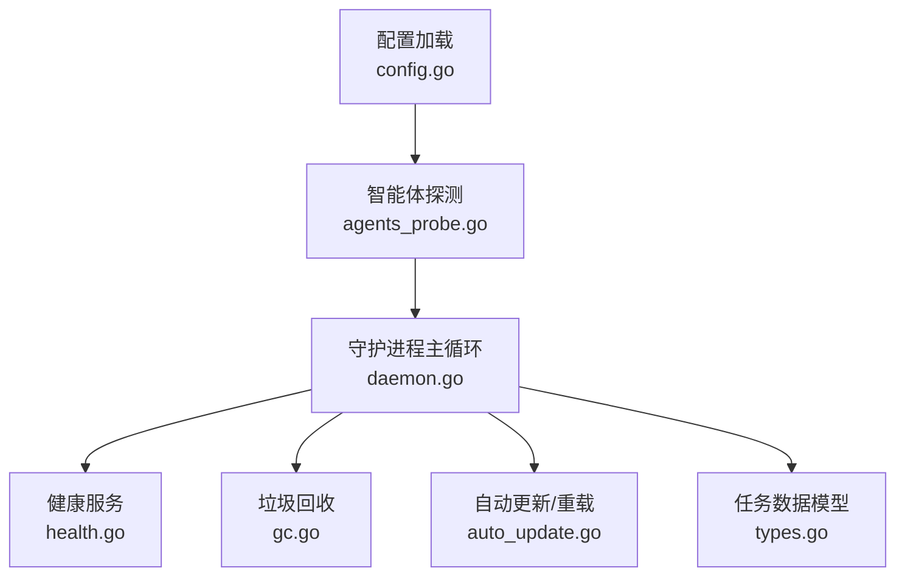
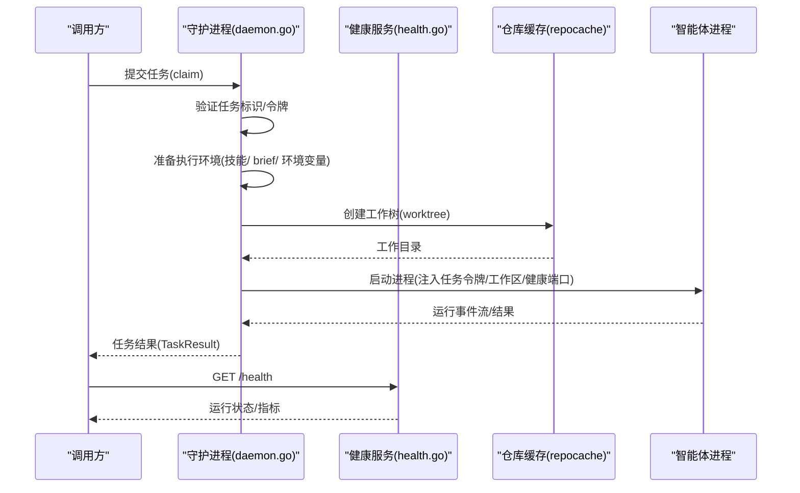
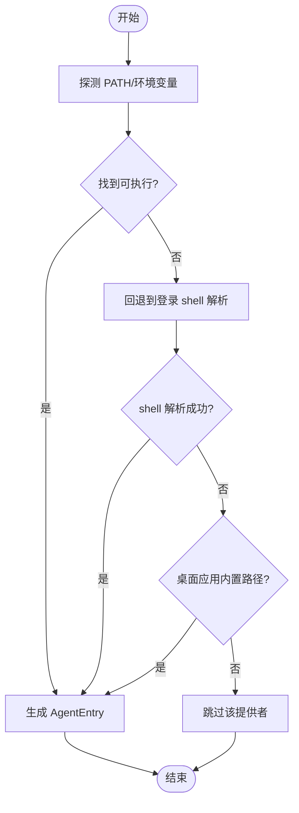
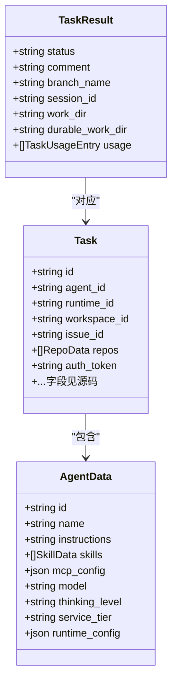
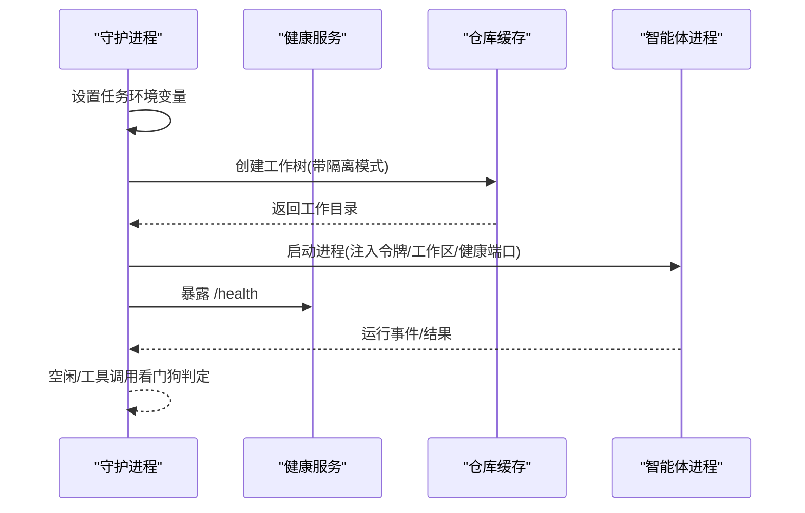
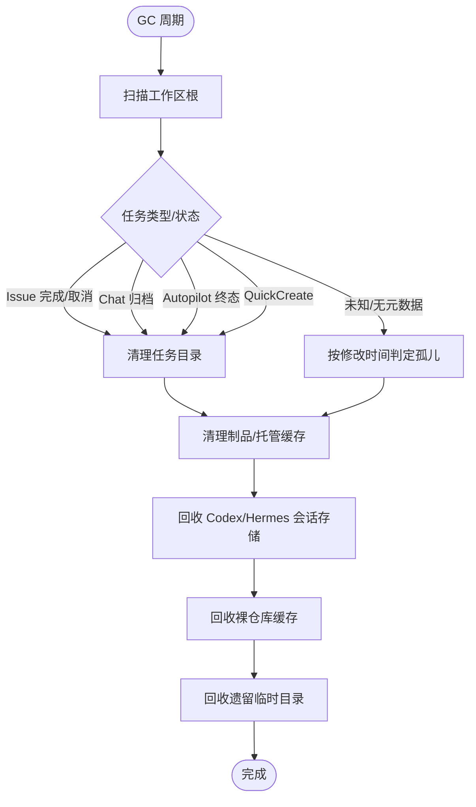
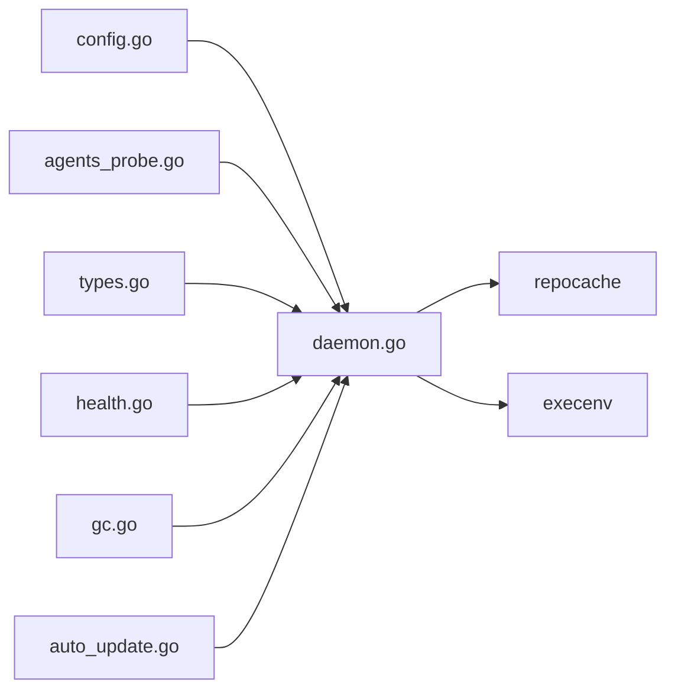

# 智能体服务

<cite>
**本文引用的文件**
- [server/internal/daemon/types.go](file://server/internal/daemon/types.go)
- [server/internal/daemon/daemon.go](file://server/internal/daemon/daemon.go)
- [server/internal/daemon/agents_probe.go](file://server/internal/daemon/agents_probe.go)
- [server/internal/daemon/config.go](file://server/internal/daemon/config.go)
- [server/internal/daemon/health.go](file://server/internal/daemon/health.go)
- [server/internal/daemon/gc.go](file://server/internal/daemon/gc.go)
- [server/internal/daemon/auto_update.go](file://server/internal/daemon/auto_update.go)
</cite>

## 目录
1. [简介](#简介)
2. [项目结构](#项目结构)
3. [核心组件](#核心组件)
4. [架构总览](#架构总览)
5. [详细组件分析](#详细组件分析)
6. [依赖关系分析](#依赖关系分析)
7. [性能考量](#性能考量)
8. [故障排查指南](#故障排查指南)
9. [结论](#结论)
10. [附录：配置与使用指南](#附录配置与使用指南)

## 简介
本文件面向“智能体服务”的注册、发现、生命周期管理、运行时环境管理（进程监控、资源分配、健康检查）、能力发现与版本/兼容性检查、故障恢复与自动重启、以及资源清理策略，提供系统化说明。该服务由本地守护进程（daemon）实现，负责探测并启动多种智能体 CLI，按任务调度执行，并通过健康端点暴露运行状态。

## 项目结构
围绕智能体服务的核心代码集中在 server/internal/daemon 包中，关键文件职责如下：
- types.go：定义 AgentEntry、Task、AgentData、TaskResult 等核心数据结构，贯穿任务声明、能力描述与结果上报。
- agents_probe.go：周期性探测本机已安装智能体 CLI，生成可用代理清单。
- config.go：加载配置（环境变量/CLI 覆盖），解析超时、并发度、GC 策略、自动更新/重载开关等。
- daemon.go：守护进程主流程、任务准备与执行边界、工作区与仓库 checkout 模式选择、错误分类与重试语义。
- health.go：本地 HTTP 健康端点（/health、/shutdown、/repo/checkout），用于存活检测、关闭与仓库检出鉴权。
- gc.go：工作区与缓存的定期回收（任务目录、制品、会话存储、裸仓库缓存、临时目录）。
- auto_update.go：自动更新与自重启循环，检测新版本或磁盘二进制变更并安全重启。

**图示来源**
- [server/internal/daemon/config.go:100-160](file://server/internal/daemon/config.go#L100-L160)
- [server/internal/daemon/agents_probe.go:77-115](file://server/internal/daemon/agents_probe.go#L77-L115)
- [server/internal/daemon/daemon.go:163-186](file://server/internal/daemon/daemon.go#L163-L186)
- [server/internal/daemon/health.go:296-355](file://server/internal/daemon/health.go#L296-L355)
- [server/internal/daemon/gc.go:25-61](file://server/internal/daemon/gc.go#L25-L61)
- [server/internal/daemon/auto_update.go:93-189](file://server/internal/daemon/auto_update.go#L93-L189)
- [server/internal/daemon/types.go:10-22](file://server/internal/daemon/types.go#L10-L22)

**章节来源**
- [server/internal/daemon/config.go:100-160](file://server/internal/daemon/config.go#L100-L160)
- [server/internal/daemon/agents_probe.go:77-115](file://server/internal/daemon/agents_probe.go#L77-L115)
- [server/internal/daemon/daemon.go:163-186](file://server/internal/daemon/daemon.go#L163-L186)
- [server/internal/daemon/health.go:296-355](file://server/internal/daemon/health.go#L296-L355)
- [server/internal/daemon/gc.go:25-61](file://server/internal/daemon/gc.go#L25-L61)
- [server/internal/daemon/auto_update.go:93-189](file://server/internal/daemon/auto_update.go#L93-L189)
- [server/internal/daemon/types.go:10-22](file://server/internal/daemon/types.go#L10-L22)

## 核心组件
- 智能体注册与发现
  - 通过探针函数扫描 PATH、登录 shell 解析、特定桌面应用路径，产出 AgentEntry 列表；支持多提供商（claude、codex、openclaw、hermes、qwen、qwenpaw、dim、mcode、zeroclaw 等）。
  - 对 dsh 等特殊提供者进行额外 profile 探测以确认可用性。
- 任务与能力描述
  - Task 承载 agent_id、workspace、连接应用、插件钩子、工作区上下文、问题状态目录、触发评论、聊天会话元信息、自动飞行器上下文、快速创建上下文、发起者身份、任务级令牌等。
  - AgentData 携带指令、技能、MCP 配置、模型、思考级别、服务层级、运行时配置等。
- 运行时环境装配
  - 为每个任务注入 MULTICA_TOKEN、工作区根、服务器地址、健康端口、任务槽位、临时目录等环境变量，确保隔离与可观测性。
- 健康检查与仓库检出
  - /health 返回进程 PID、OS、运行时长、配置摘要、活动任务计数、可用智能体、跳过原因、待重载原因与工作区绑定。
  - /repo/checkout 提供受保护的仓库检出接口，校验任务上下文与工作目录归属，支持忙等待与重试头。
- 垃圾回收（GC）
  - 周期扫描工作区根，依据任务类型（issue/chat/autopilot/quick-create）与父记录状态决定清理策略；同时回收制品、Codex/Hermes 会话存储、裸仓库缓存、遗留临时目录与稳定根索引。
- 自动更新与自重启
  - 定时拉取最新版本并与当前版本比较；当磁盘二进制版本变化时，检测并安全重启；在活跃任务期间延迟到空闲再执行，避免中断运行中的智能体。

**章节来源**
- [server/internal/daemon/agents_probe.go:77-306](file://server/internal/daemon/agents_probe.go#L77-L306)
- [server/internal/daemon/types.go:68-221](file://server/internal/daemon/types.go#L68-L221)
- [server/internal/daemon/daemon.go:163-179](file://server/internal/daemon/daemon.go#L163-L179)
- [server/internal/daemon/health.go:19-79](file://server/internal/daemon/health.go#L19-L79)
- [server/internal/daemon/health.go:400-516](file://server/internal/daemon/health.go#L400-L516)
- [server/internal/daemon/gc.go:83-193](file://server/internal/daemon/gc.go#L83-L193)
- [server/internal/daemon/auto_update.go:93-189](file://server/internal/daemon/auto_update.go#L93-L189)

## 架构总览
守护进程作为本地运行时中枢，负责：
- 启动时加载配置并探测可用智能体 CLI。
- 周期性同步工作区、注册运行时、心跳上报。
- 接收任务后准备执行环境（技能水合、brief 注入、仓库 checkout），启动对应智能体进程并监控其生命周期。
- 暴露健康端点供外部系统探测与治理。
- 后台 GC 与自动更新/重载保障资源与版本一致性。

**图示来源**
- [server/internal/daemon/daemon.go:139-179](file://server/internal/daemon/daemon.go#L139-L179)
- [server/internal/daemon/health.go:296-355](file://server/internal/daemon/health.go#L296-L355)
- [server/internal/daemon/health.go:400-516](file://server/internal/daemon/health.go#L400-L516)
- [server/internal/daemon/types.go:68-221](file://server/internal/daemon/types.go#L68-L221)

## 详细组件分析

### 智能体注册与发现
- 发现机制
  - 优先使用 exec.LookPath 查找命令；若失败且命令不含路径分隔符，则回退到用户登录 shell 解析 PATH（缓存 TTL 较长以避免频繁 fork）。
  - 针对 macOS 桌面应用内置 CLI 的特殊路径进行探测。
  - 对 dsh 等需要特定 profile 的提供者执行 --probe 探测确认协议版本。
- 输出
  - 生成 AgentEntry（Path、Command、Model），供后续注册与运行时选择。

**图示来源**
- [server/internal/daemon/agents_probe.go:77-115](file://server/internal/daemon/agents_probe.go#L77-L115)
- [server/internal/daemon/agents_probe.go:116-306](file://server/internal/daemon/agents_probe.go#L116-L306)
- [server/internal/daemon/agents_probe.go:309-331](file://server/internal/daemon/agents_probe.go#L309-L331)

**章节来源**
- [server/internal/daemon/agents_probe.go:77-331](file://server/internal/daemon/agents_probe.go#L77-L331)

### 任务与能力描述
- 任务载荷
  - 包含智能体 ID、运行时 ID、工作区/问题信息、远程 MCP 连接、插件钩子工具、工作区上下文、问题状态目录、触发评论、聊天会话元信息、自动飞行器上下文、快速创建上下文、发起者身份、任务级令牌等。
- 智能体能力
  - 指令、技能、技能引用、自定义环境变量/参数、MCP 配置、模型、思考级别、服务层级、运行时配置、禁用运行时技能等。
- 结果上报
  - 状态、备注、分支名、环境类型、会话 ID、工作目录、持久化工作目录、失败原因、会话回滚标记、废弃会话 ID、用量统计等。

**图示来源**
- [server/internal/daemon/types.go:68-221](file://server/internal/daemon/types.go#L68-L221)
- [server/internal/daemon/types.go:271-310](file://server/internal/daemon/types.go#L271-L310)

**章节来源**
- [server/internal/daemon/types.go:68-221](file://server/internal/daemon/types.go#L68-L221)
- [server/internal/daemon/types.go:271-310](file://server/internal/daemon/types.go#L271-L310)

### 运行时环境管理与进程监控
- 环境变量注入
  - 为任务进程注入任务级令牌、工作区根、服务器地址、健康端口、任务槽位、临时目录等，确保隔离与安全。
- 执行超时与看门狗
  - 任务准备阶段有独立超时；智能体运行期支持全局超时与空闲看门狗（含工具调用看门狗），防止卡死占用槽位。
- 健康检查
  - /health 暴露运行状态、PID、OS、运行时长、配置摘要、活动任务计数、可用智能体、跳过原因、待重载原因与工作区绑定。
- 仓库检出
  - /repo/checkout 提供鉴权后的仓库检出，校验任务上下文与工作目录归属，支持忙等待与重试头，保证并发安全。

**图示来源**
- [server/internal/daemon/daemon.go:163-179](file://server/internal/daemon/daemon.go#L163-L179)
- [server/internal/daemon/health.go:296-355](file://server/internal/daemon/health.go#L296-L355)
- [server/internal/daemon/health.go:400-516](file://server/internal/daemon/health.go#L400-L516)

**章节来源**
- [server/internal/daemon/daemon.go:163-179](file://server/internal/daemon/daemon.go#L163-L179)
- [server/internal/daemon/health.go:296-355](file://server/internal/daemon/health.go#L296-L355)
- [server/internal/daemon/health.go:400-516](file://server/internal/daemon/health.go#L400-L516)

### 能力发现、版本管理与兼容性检查
- 能力发现
  - 通过探针函数识别各提供商 CLI 是否存在并可执行；对 dsh 等需 profile 的提供者执行 --probe 确认协议版本。
- 版本管理
  - 自动更新循环定期拉取最新版本并与当前版本比较；当磁盘二进制版本变化时，检测并安全重启。
- 兼容性检查
  - 对仓库检出的旧版 CLI 请求进行最小版本校验，拒绝不兼容请求并给出明确提示；对 Codex 首次无进展与语义不活跃超时进行差异化处理。

**章节来源**
- [server/internal/daemon/agents_probe.go:309-331](file://server/internal/daemon/agents_probe.go#L309-L331)
- [server/internal/daemon/auto_update.go:93-189](file://server/internal/daemon/auto_update.go#L93-L189)
- [server/internal/daemon/health.go:157-245](file://server/internal/daemon/health.go#L157-L245)
- [server/internal/daemon/config.go:363-449](file://server/internal/daemon/config.go#L363-L449)

### 故障恢复、自动重启与资源清理
- 故障恢复
  - 任务准备阶段超时与错误分类（如技能包不可用）使平台侧可按允许的重试策略恢复。
- 自动重启
  - 自动更新与自重启循环在空闲时执行，避免中断运行中的智能体；当磁盘二进制版本变化时，检测并安全重启。
- 资源清理（GC）
  - 周期扫描工作区根，依据任务类型与父记录状态决定清理策略；回收制品、Codex/Hermes 会话存储、裸仓库缓存、遗留临时目录与稳定根索引。
  - 对本地目录任务仅清理制品，保留日志与审计信息。

**图示来源**
- [server/internal/daemon/gc.go:83-193](file://server/internal/daemon/gc.go#L83-L193)
- [server/internal/daemon/gc.go:195-374](file://server/internal/daemon/gc.go#L195-L374)
- [server/internal/daemon/gc.go:513-653](file://server/internal/daemon/gc.go#L513-L653)
- [server/internal/daemon/gc.go:683-739](file://server/internal/daemon/gc.go#L683-L739)
- [server/internal/daemon/gc.go:741-794](file://server/internal/daemon/gc.go#L741-L794)

**章节来源**
- [server/internal/daemon/gc.go:83-193](file://server/internal/daemon/gc.go#L83-L193)
- [server/internal/daemon/gc.go:195-374](file://server/internal/daemon/gc.go#L195-L374)
- [server/internal/daemon/gc.go:513-653](file://server/internal/daemon/gc.go#L513-L653)
- [server/internal/daemon/gc.go:683-739](file://server/internal/daemon/gc.go#L683-L739)
- [server/internal/daemon/gc.go:741-794](file://server/internal/daemon/gc.go#L741-L794)
- [server/internal/daemon/auto_update.go:93-189](file://server/internal/daemon/auto_update.go#L93-L189)

## 依赖关系分析
- 模块耦合
  - daemon 主流程依赖配置加载、智能体探测、健康服务、GC、自动更新；类型定义被多处复用。
- 直接依赖
  - 仓库缓存（repocache）用于工作树创建与回收；execenv 用于环境装配与存储清理。
- 外部集成
  - 通过环境变量与命令行参数与外部智能体 CLI 交互；通过 /health 与外部系统对接。

**图示来源**
- [server/internal/daemon/config.go:100-160](file://server/internal/daemon/config.go#L100-L160)
- [server/internal/daemon/agents_probe.go:77-115](file://server/internal/daemon/agents_probe.go#L77-L115)
- [server/internal/daemon/types.go:10-22](file://server/internal/daemon/types.go#L10-L22)
- [server/internal/daemon/health.go:296-355](file://server/internal/daemon/health.go#L296-L355)
- [server/internal/daemon/gc.go:25-61](file://server/internal/daemon/gc.go#L25-L61)
- [server/internal/daemon/auto_update.go:93-189](file://server/internal/daemon/auto_update.go#L93-L189)
- [server/internal/daemon/daemon.go:163-186](file://server/internal/daemon/daemon.go#L163-L186)

**章节来源**
- [server/internal/daemon/config.go:100-160](file://server/internal/daemon/config.go#L100-L160)
- [server/internal/daemon/agents_probe.go:77-115](file://server/internal/daemon/agents_probe.go#L77-L115)
- [server/internal/daemon/types.go:10-22](file://server/internal/daemon/types.go#L10-L22)
- [server/internal/daemon/health.go:296-355](file://server/internal/daemon/health.go#L296-L355)
- [server/internal/daemon/gc.go:25-61](file://server/internal/daemon/gc.go#L25-L61)
- [server/internal/daemon/auto_update.go:93-189](file://server/internal/daemon/auto_update.go#L93-L189)
- [server/internal/daemon/daemon.go:163-186](file://server/internal/daemon/daemon.go#L163-L186)

## 性能考量
- 并发控制
  - 最大并发任务数可配置，避免资源争用；任务准备阶段有独立超时，防止阻塞。
- 看门狗与超时
  - 空闲看门狗与工具调用看门狗协同，防止长时间静默或工具调用卡死；Codex 语义不活跃超时与首次无进展超时分别处理。
- 缓存与探测
  - 登录 shell 解析结果缓存 TTL 较长，减少频繁 fork；仓库检出支持忙等待与重试头，降低锁竞争影响。
- GC 策略
  - 制品与托管缓存按 TTL 回收，兼顾可再生性与成本；本地目录任务仅清理制品，保留审计信息。

[本节为通用性能讨论，无需具体文件分析]

## 故障排查指南
- 健康端点
  - 使用 /health 查看运行状态、PID、OS、运行时长、配置摘要、活动任务计数、可用智能体、跳过原因、待重载原因与工作区绑定。
- 仓库检出失败
  - /repo/checkout 返回 401/403/500 时，检查 Authorization 是否绑定到当前任务的工作目录；旧版 CLI 会收到明确提示与升级建议。
- 自动更新/重载
  - 若 /health 显示待重载原因，表示磁盘二进制版本与运行版本不一致，将在空闲时重启；若持续未重启，检查是否有活跃任务或权限问题。
- GC 行为
  - 若发现目录未被清理，检查任务类型、父记录状态、TTL 配置与本地目录策略；关注制品与托管缓存回收是否符合预期。

**章节来源**
- [server/internal/daemon/health.go:19-79](file://server/internal/daemon/health.go#L19-L79)
- [server/internal/daemon/health.go:157-245](file://server/internal/daemon/health.go#L157-L245)
- [server/internal/daemon/health.go:400-516](file://server/internal/daemon/health.go#L400-L516)
- [server/internal/daemon/auto_update.go:93-189](file://server/internal/daemon/auto_update.go#L93-L189)
- [server/internal/daemon/gc.go:83-193](file://server/internal/daemon/gc.go#L83-L193)

## 结论
智能体服务通过守护进程统一管理智能体的注册、发现、生命周期与环境装配，提供健壮的健康检查、仓库检出、垃圾回收与自动更新/重载能力。其设计强调安全性（任务级令牌、工作目录鉴权）、可观测性（健康端点、日志与指标）与可维护性（GC 策略、自动更新）。在实际部署中，建议合理配置并发、超时与 GC 策略，并结合健康端点进行运维监控。

[本节为总结，无需具体文件分析]

## 附录：配置与使用指南
- 关键配置项（部分）
  - 服务器地址、轮询间隔、心跳间隔、健康端口、最大并发任务数、GC 开关与间隔、各类 TTL（任务目录、制品、会话存储、裸仓库缓存、遗留临时目录）、自动更新开关与间隔、自动重载开关、各智能体参数（如 Claude/Codex/OpenCode/Qwen/QwenPaw 参数）。
- 环境变量
  - 通过 MULTICA_* 系列环境变量覆盖默认值；例如 MULTICA_SERVER_URL、MULTICA_DAEMON_POLL_INTERVAL、MULTICA_DAEMON_HEARTbeat_INTERVAL、MULTICA_AGENT_TIMEOUT、MULTICA_DAEMON_MAX_CONCURRENT_TASKS、MULTICA_GC_*、MULTICA_DAEMON_AUTO_UPDATE、MULTICA_DAEMON_AUTO_RELOAD 等。
- 使用建议
  - 在生产环境中启用 GC 并设置合理的 TTL；根据业务负载调整最大并发与看门狗超时；谨慎开启自动更新/重载，确保在空闲时段执行；使用 /health 进行健康检查与故障定位。

**章节来源**
- [server/internal/daemon/config.go:100-160](file://server/internal/daemon/config.go#L100-L160)
- [server/internal/daemon/config.go:195-648](file://server/internal/daemon/config.go#L195-L648)
- [server/internal/daemon/config.go:695-754](file://server/internal/daemon/config.go#L695-L754)
- [server/internal/daemon/config.go:756-797](file://server/internal/daemon/config.go#L756-L797)