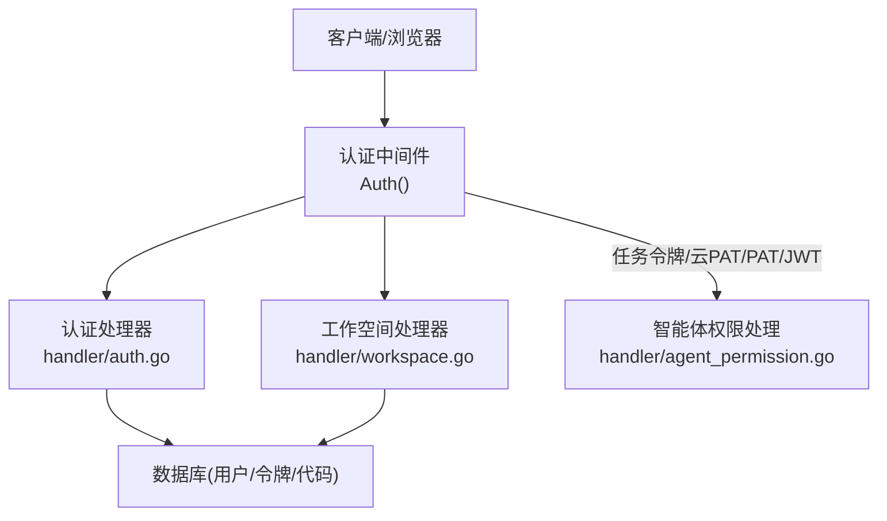
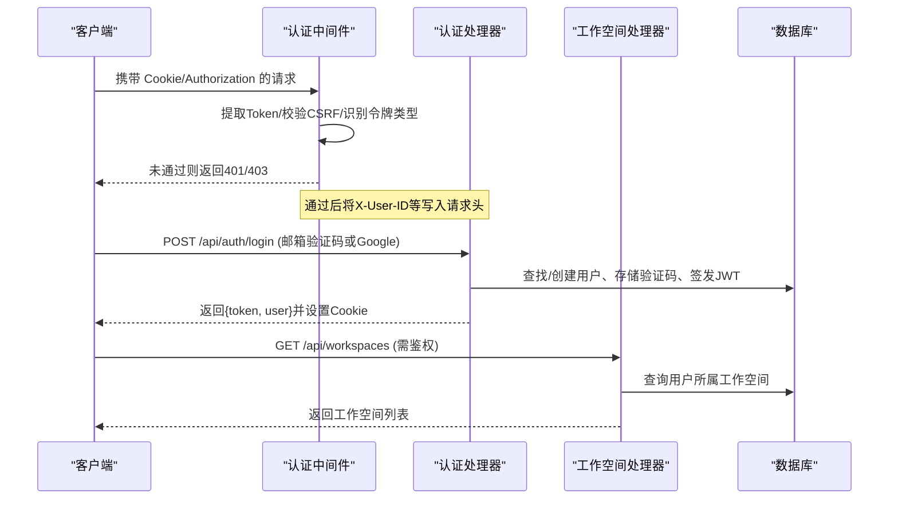
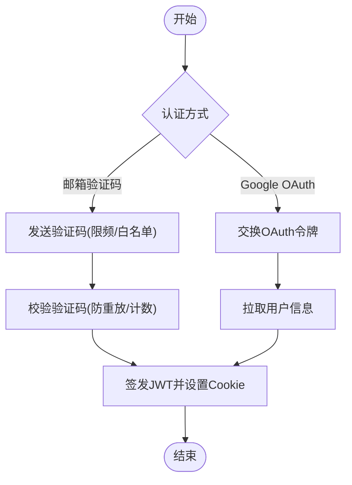
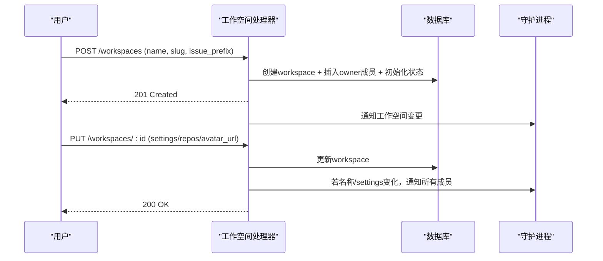
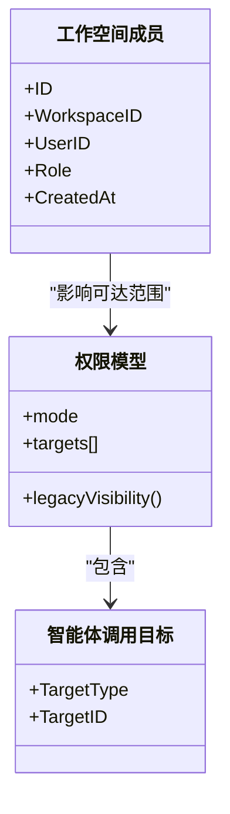
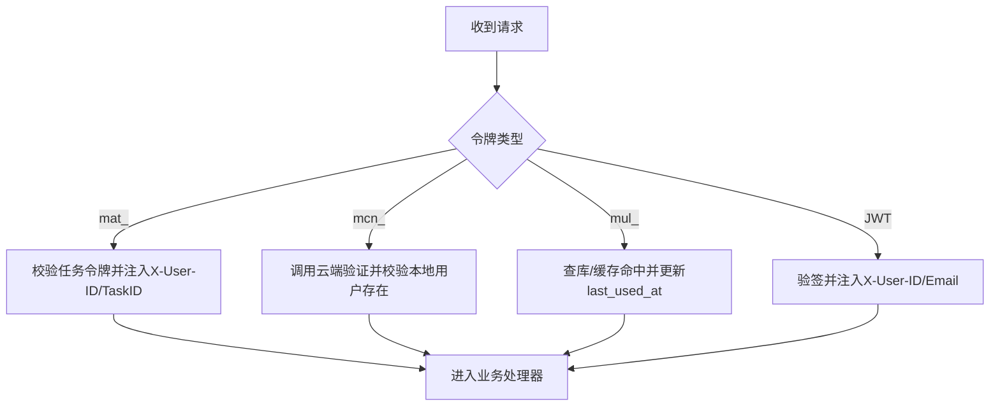
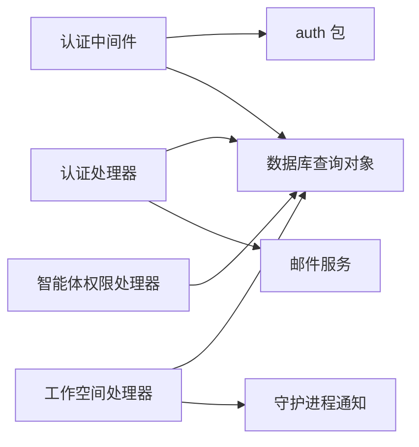

# 用户与工作空间服务

<cite>
**本文引用的文件**
- [server/internal/handler/workspace.go](file://server/internal/handler/workspace.go)
- [server/internal/handler/auth.go](file://server/internal/handler/auth.go)
- [server/internal/middleware/auth.go](file://server/internal/middleware/auth.go)
- [server/internal/auth/jwt.go](file://server/internal/auth/jwt.go)
- [server/internal/handler/agent_permission.go](file://server/internal/handler/agent_permission.go)
</cite>

## 目录
1. [简介](#简介)
2. [项目结构](#项目结构)
3. [核心组件](#核心组件)
4. [架构总览](#架构总览)
5. [详细组件分析](#详细组件分析)
6. [依赖关系分析](#依赖关系分析)
7. [性能考虑](#性能考虑)
8. [故障排查指南](#故障排查指南)
9. [结论](#结论)
10. [附录：API 参考与使用示例](#附录api-参考与使用示例)

## 简介
本文件面向“用户与工作空间服务”，覆盖以下主题：
- 用户账户管理、认证流程与会话管理
- 权限控制与角色分配（工作空间成员角色）
- 工作空间的创建、配置与成员管理
- 安全策略（JWT、PAT、CSRF、临时禁用用户、Cloud PAT）
- 工作空间级别设置、通知与集成管理（仓库、设置等）
- API 接口说明与调用示例

## 项目结构
后端采用 Go + Chi 路由，认证中间件统一鉴权；用户与工作空间相关能力集中在 handler 层，并通过数据库查询对象访问持久化数据。关键路径：
- 认证与会话：middleware/auth.go、handler/auth.go、auth/jwt.go
- 工作空间与成员：handler/workspace.go
- 智能体调用权限（与用户/工作空间关联的授权模型）：handler/agent_permission.go

**图表来源**
- [server/internal/middleware/auth.go:34-267](file://server/internal/middleware/auth.go#L34-L267)
- [server/internal/handler/auth.go:160-459](file://server/internal/handler/auth.go#L160-L459)
- [server/internal/handler/workspace.go:159-465](file://server/internal/handler/workspace.go#L159-L465)
- [server/internal/handler/agent_permission.go:88-187](file://server/internal/handler/agent_permission.go#L88-L187)

**章节来源**
- [server/internal/middleware/auth.go:34-267](file://server/internal/middleware/auth.go#L34-L267)
- [server/internal/handler/auth.go:160-459](file://server/internal/handler/auth.go#L160-L459)
- [server/internal/handler/workspace.go:159-465](file://server/internal/handler/workspace.go#L159-L465)
- [server/internal/handler/agent_permission.go:88-187](file://server/internal/handler/agent_permission.go#L88-L187)

## 核心组件
- 认证中间件：统一解析 Bearer Token、Cookie、PAT、任务令牌、云 PAT，并注入 X-User-ID/X-User-Email 等上下文头。
- 认证处理器：邮箱验证码登录、Google OAuth 登录、获取当前用户、更新个人资料、登出、CLI Token 签发。
- 工作空间处理器：工作空间 CRUD、成员列表/变更/移除、离开工作空间、删除工作空间（含锁超时保护）。
- 智能体权限：基于“模式+目标”的调用许可模型，兼容旧可见性字段。
- JWT/PAT/任务令牌工具：密钥校验、令牌生成与哈希。

**章节来源**
- [server/internal/middleware/auth.go:34-267](file://server/internal/middleware/auth.go#L34-L267)
- [server/internal/handler/auth.go:160-459](file://server/internal/handler/auth.go#L160-L459)
- [server/internal/handler/workspace.go:159-744](file://server/internal/handler/workspace.go#L159-L744)
- [server/internal/handler/agent_permission.go:88-187](file://server/internal/handler/agent_permission.go#L88-L187)
- [server/internal/auth/jwt.go:21-95](file://server/internal/auth/jwt.go#L21-L95)

## 架构总览
下图展示一次典型的用户登录到访问受保护资源的请求链路，以及工作空间操作的鉴权与数据流。

**图表来源**
- [server/internal/middleware/auth.go:34-267](file://server/internal/middleware/auth.go#L34-L267)
- [server/internal/handler/auth.go:286-459](file://server/internal/handler/auth.go#L286-L459)
- [server/internal/handler/workspace.go:159-177](file://server/internal/handler/workspace.go#L159-L177)

## 详细组件分析

### 用户认证与会话管理
- 支持两种登录方式：
  - 邮箱验证码：发送验证码、验证并签发 JWT，设置 HttpOnly Cookie 与可选 CloudFront 签名 Cookie。
  - Google OAuth：交换授权码、拉取用户信息、自动创建或复用用户、签发 JWT 并设置 Cookie。
- 会话与会话安全：
  - 中间件优先从 Authorization 头读取 Bearer，其次从 multica_auth Cookie 读取。
  - Cookie 认证对状态变更请求强制 CSRF 校验。
  - 支持“临时禁用用户”拦截，所有认证分支均会检查。
- CLI Token：已登录会话可换取短期 Bearer Token 供 CLI 使用。

**图表来源**
- [server/internal/handler/auth.go:286-459](file://server/internal/handler/auth.go#L286-L459)
- [server/internal/middleware/auth.go:70-75](file://server/internal/middleware/auth.go#L70-L75)

**章节来源**
- [server/internal/handler/auth.go:286-459](file://server/internal/handler/auth.go#L286-L459)
- [server/internal/middleware/auth.go:70-75](file://server/internal/middleware/auth.go#L70-L75)

### 工作空间创建、配置与成员管理
- 创建工作空间：
  - 校验 slug/name、保留 slug 检测、issue 前缀规范化（默认由 slug 派生）。
  - 事务内创建 workspace、将创建者设为 owner、初始化内置问题状态。
  - 记录事件并通知守护进程刷新工作空间缓存。
- 更新工作空间：
  - 支持名称、描述、上下文、settings(JSONB)、repos(JSON数组)、issue_prefix、头像 URL 更新。
  - 若名称或 settings 变更，广播给所有成员以唤醒其守护进程。
- 成员管理：
  - 列出成员、带用户信息的成员列表。
  - 新增/更新成员角色（owner/admin/member），限制至少一个 owner。
  - 删除成员/离开工作空间：撤销权限、释放容量、失效成员缓存、发布事件、通知守护进程。
- 删除工作空间：
  - 加锁与超时保护，避免长时间阻塞；区分可重试锁冲突错误。

**图表来源**
- [server/internal/handler/workspace.go:202-320](file://server/internal/handler/workspace.go#L202-L320)
- [server/internal/handler/workspace.go:373-465](file://server/internal/handler/workspace.go#L373-L465)

**章节来源**
- [server/internal/handler/workspace.go:202-465](file://server/internal/handler/workspace.go#L202-L465)

### 权限控制与角色分配机制
- 工作空间成员角色：
  - 支持 owner/admin/member，最小 owner 数量为 1。
  - 更新/删除 owner 需要当前为 owner。
  - 变更后失效成员缓存并发布事件。
- 智能体调用权限（与用户/工作空间关联）：
  - 新模式：permission_mode 与 invocation_targets（workspace/member/team）。
  - 兼容旧可见性字段 visibility，自动映射。
  - 去重与校验目标 ID，空 public_to 归一化为 workspace 目标。

**图表来源**
- [server/internal/handler/workspace.go:547-639](file://server/internal/handler/workspace.go#L547-L639)
- [server/internal/handler/agent_permission.go:88-187](file://server/internal/handler/agent_permission.go#L88-L187)

**章节来源**
- [server/internal/handler/workspace.go:547-639](file://server/internal/handler/workspace.go#L547-L639)
- [server/internal/handler/agent_permission.go:88-187](file://server/internal/handler/agent_permission.go#L88-L187)

### 安全策略与令牌体系
- 令牌类型与优先级：
  - 任务令牌 mat_：绑定 (user_id, agent_id, task_id, workspace_id)，仅用于任务场景。
  - 云 PAT mcn_：由云端 Fleet 验证，本地二次校验 owner 存在。
  - 个人访问令牌 mul_：本地缓存 last_used_at 与 TTL 优化。
  - JWT：HS256 签名，支持临时禁用用户拦截。
- 安全要点：
  - Cookie 认证必须通过 CSRF 校验。
  - 禁止伪造 X-Actor-Source，仅中间件可设置。
  - JWT_SECRET 在启动时校验，拒绝已知弱口令。
  - 验证码登录限频、尝试次数递增、过期清理。

**图表来源**
- [server/internal/middleware/auth.go:77-267](file://server/internal/middleware/auth.go#L77-L267)
- [server/internal/auth/jwt.go:21-58](file://server/internal/auth/jwt.go#L21-L58)

**章节来源**
- [server/internal/middleware/auth.go:77-267](file://server/internal/middleware/auth.go#L77-L267)
- [server/internal/auth/jwt.go:21-58](file://server/internal/auth/jwt.go#L21-L58)

### 工作空间级别的设置、通知与集成管理
- 设置与仓库：
  - settings 为 JSONB 字段，支持任意键值；repos 为仓库 URL 数组，URL 需为合法 git http(s)/ssh。
  - 更新名称或 settings 会触发对所有成员的守护进程通知，确保缓存一致。
- 通知：
  - 工作空间更新、成员变更、删除等操作会发布事件并通知守护进程，保证多端一致性。
- 集成：
  - repos 用于后续智能体执行环境中的仓库 checkout 与 worktree 管理（结合 daemon 侧实现）。

**章节来源**
- [server/internal/handler/workspace.go:337-465](file://server/internal/handler/workspace.go#L337-L465)

## 依赖关系分析
- 中间件依赖 auth 包进行令牌生成/哈希/校验，依赖数据库查询对象进行 PAT/任务令牌查询。
- 认证处理器依赖邮件服务、Google OAuth、数据库查询对象。
- 工作空间处理器依赖数据库查询对象、事件与指标上报、守护进程通知。
- 智能体权限处理器依赖数据库查询对象，维护新旧权限模型的兼容性。

**图表来源**
- [server/internal/middleware/auth.go:34-267](file://server/internal/middleware/auth.go#L34-L267)
- [server/internal/handler/auth.go:286-459](file://server/internal/handler/auth.go#L286-L459)
- [server/internal/handler/workspace.go:159-465](file://server/internal/handler/workspace.go#L159-L465)
- [server/internal/handler/agent_permission.go:88-187](file://server/internal/handler/agent_permission.go#L88-L187)

**章节来源**
- [server/internal/middleware/auth.go:34-267](file://server/internal/middleware/auth.go#L34-L267)
- [server/internal/handler/auth.go:286-459](file://server/internal/handler/auth.go#L286-L459)
- [server/internal/handler/workspace.go:159-465](file://server/internal/handler/workspace.go#L159-L465)
- [server/internal/handler/agent_permission.go:88-187](file://server/internal/handler/agent_permission.go#L88-L187)

## 性能考虑
- 认证路径：
  - PAT 使用缓存减少 DB 访问与 last_used_at 写放大。
  - 验证码登录限频（60 秒/邮箱）与过期清理。
- 工作空间操作：
  - 删除工作空间使用锁超时（10 秒）避免无限等待；区分可重试锁冲突错误。
  - 变更名称/settings 后批量通知成员守护进程，避免频繁轮询。
- 数据一致性：
  - 创建工作空间在事务中完成，确保状态目录与成员初始化的原子性。

[本节提供通用指导，不直接分析具体文件]

## 故障排查指南
- 认证失败：
  - 检查是否携带有效 Bearer/Cookie；Cookie 请求需附带正确 CSRF。
  - 确认 JWT_SECRET 非弱口令；临时禁用用户会被拒绝。
- 验证码登录：
  - 邮箱限频、验证码过期、尝试次数过多会导致失败。
- 工作空间删除卡住：
  - 可能遇到全局 advisory lock 竞争；系统会返回可重试错误，建议重试。
- 成员权限异常：
  - 更新/删除 owner 需满足至少一个 owner；变更后需刷新成员缓存。

**章节来源**
- [server/internal/middleware/auth.go:70-75](file://server/internal/middleware/auth.go#L70-L75)
- [server/internal/handler/auth.go:341-409](file://server/internal/handler/auth.go#L341-L409)
- [server/internal/handler/workspace.go:746-800](file://server/internal/handler/workspace.go#L746-L800)
- [server/internal/handler/workspace.go:599-639](file://server/internal/handler/workspace.go#L599-L639)

## 结论
本服务围绕“用户—工作空间—成员—智能体权限”的主线，提供了完整的认证、会话、权限与工作空间管理能力。通过统一的认证中间件、严格的令牌体系与事务化工作空间操作，保证了安全性与一致性。同时，通过事件与守护进程通知机制，实现了跨端状态同步。

[本节为总结，不直接分析具体文件]

## 附录：API 参考与使用示例

### 认证与会话
- 发送验证码
  - 方法：POST
  - 路径：/api/auth/send-code
  - 请求体：{ email }
  - 响应：成功消息
  - 注意：限频、白名单校验、临时禁用用户拦截
- 验证验证码并登录
  - 方法：POST
  - 路径：/api/auth/verify-code
  - 请求体：{ email, code }
  - 响应：{ token, user }
  - 行为：设置 HttpOnly Cookie 与可选 CloudFront 签名 Cookie
- Google 登录
  - 方法：POST
  - 路径：/api/auth/google-login
  - 请求体：{ code, redirect_uri }
  - 响应：{ token, user }
- 获取当前用户
  - 方法：GET
  - 路径：/api/me
  - 鉴权：Bearer/Cookie
  - 响应：用户信息
- 更新当前用户
  - 方法：PATCH
  - 路径：/api/me
  - 请求体：{ name, avatar_url, language, profile_description, timezone }
  - 鉴权：Bearer/Cookie
- 登出
  - 方法：POST
  - 路径：/api/logout
  - 行为：清除认证 Cookie
- 签发 CLI Token
  - 方法：POST
  - 路径：/api/auth/cli-token
  - 鉴权：Bearer/Cookie
  - 响应：{ token }

**章节来源**
- [server/internal/handler/auth.go:286-459](file://server/internal/handler/auth.go#L286-L459)
- [server/internal/handler/auth.go:716-748](file://server/internal/handler/auth.go#L716-L748)

### 工作空间
- 列出工作空间
  - 方法：GET
  - 路径：/api/workspaces
  - 鉴权：Bearer/Cookie
  - 响应：工作空间列表
- 获取工作空间详情
  - 方法：GET
  - 路径：/api/workspaces/:id
  - 鉴权：Bearer/Cookie
  - 响应：工作空间详情
- 创建工作空间
  - 方法：POST
  - 路径：/api/workspaces
  - 请求体：{ name, slug, description?, context?, issue_prefix? }
  - 行为：事务创建 workspace、owner、初始化状态；通知守护进程
- 更新工作空间
  - 方法：PATCH
  - 路径：/api/workspaces/:id
  - 请求体：{ name?, description?, context?, settings?, repos?, issue_prefix?, avatar_url? }
  - 行为：更新字段；必要时通知所有成员守护进程
- 列出成员
  - 方法：GET
  - 路径：/api/workspaces/:id/members
  - 鉴权：需为成员
  - 响应：成员列表
- 列出成员（含用户信息）
  - 方法：GET
  - 路径：/api/workspaces/:id/members-with-user
  - 鉴权：需为成员
  - 响应：成员+用户信息
- 更新成员角色
  - 方法：PATCH
  - 路径：/api/workspaces/:id/members/:memberId
  - 请求体：{ role }
  - 约束：至少一个 owner；owner 变更需 owner 权限
- 删除成员
  - 方法：DELETE
  - 路径：/api/workspaces/:id/members/:memberId
  - 约束：owner 不可被降权至非 owner；至少一个 owner
- 离开工作空间
  - 方法：POST
  - 路径：/api/workspaces/:id/leave
  - 约束：owner 离开需至少一个 owner 剩余

**章节来源**
- [server/internal/handler/workspace.go:159-744](file://server/internal/handler/workspace.go#L159-L744)

### 智能体调用权限（与用户/工作空间相关）
- 权限模型
  - permission_mode：private | public_to
  - invocation_targets：[{ target_type: workspace|member|team, target_id }]
  - 兼容 legacy visibility：private/workspace
- 规则要点
  - private：忽略 targets，默认不可调用
  - public_to：允许列出的目标调用；空 targets 归一化为 workspace
  - member/team 需提供有效 UUID；workspace 目标自动填充当前工作空间

**章节来源**
- [server/internal/handler/agent_permission.go:88-187](file://server/internal/handler/agent_permission.go#L88-L187)