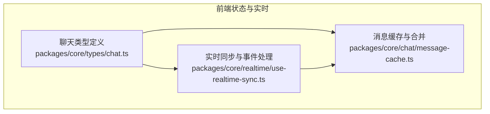
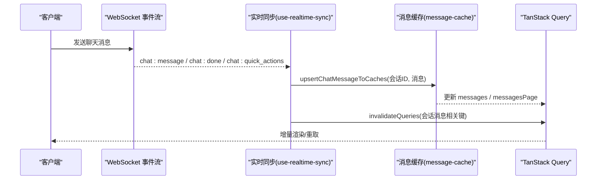
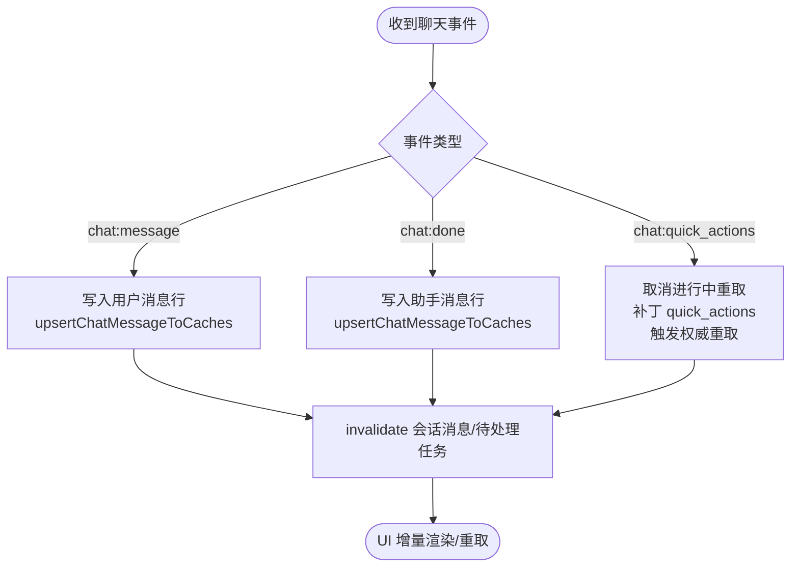
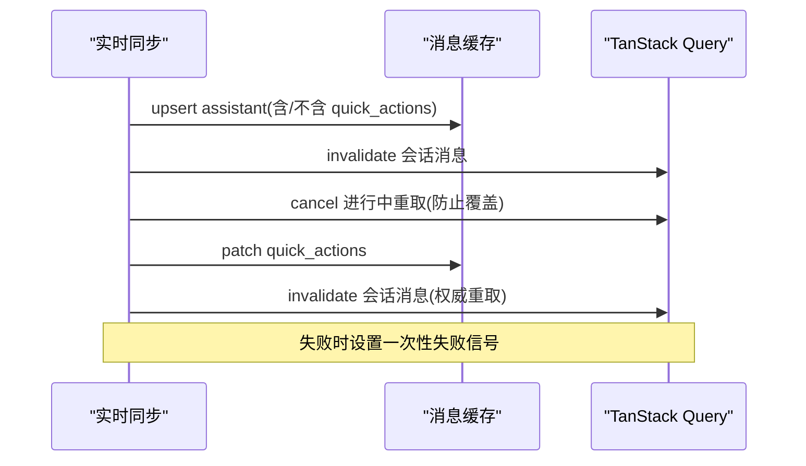
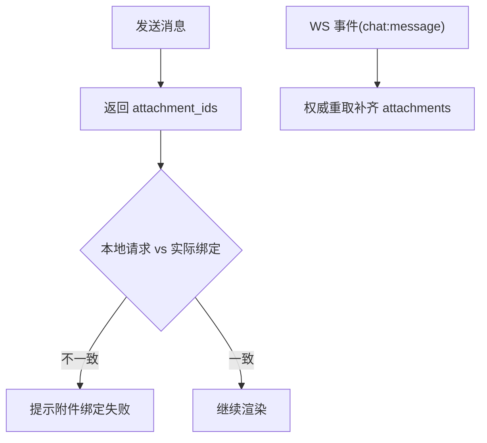
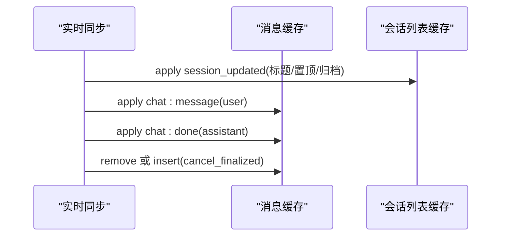
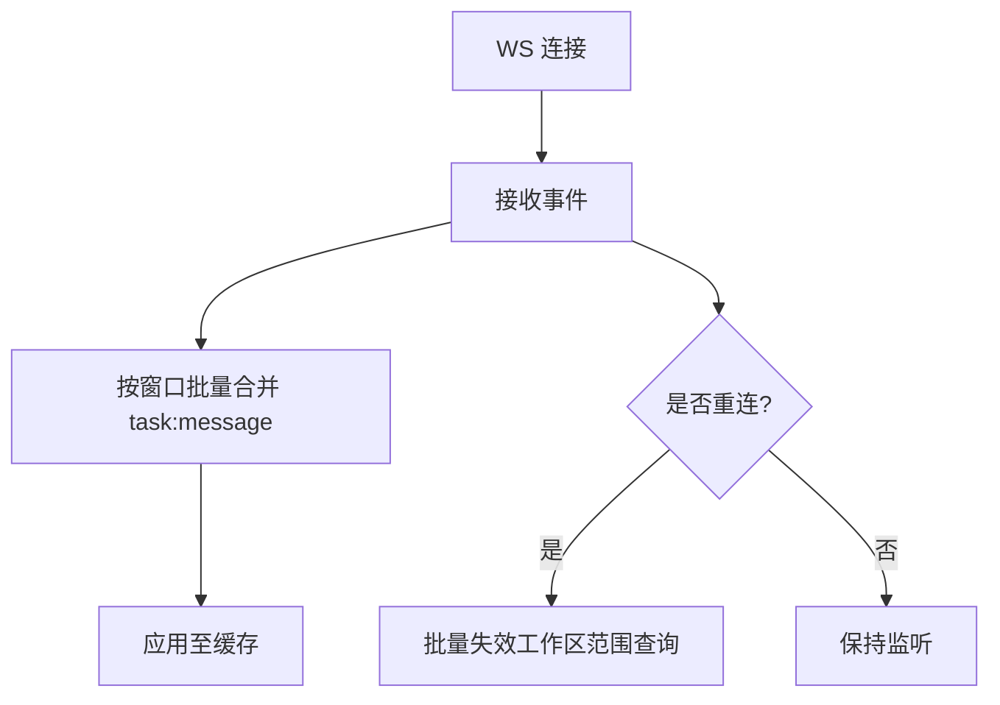
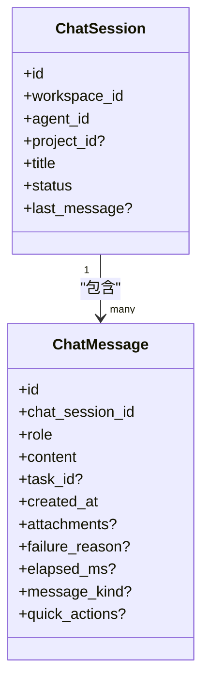
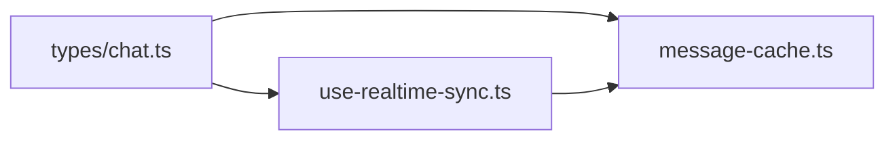

# 聊天服务

<cite>
**本文引用的文件**
- [packages/core/types/chat.ts](file://packages/core/types/chat.ts)
- [packages/core/chat/message-cache.ts](file://packages/core/chat/message-cache.ts)
- [packages/core/realtime/use-realtime-sync.ts](file://packages/core/realtime/use-realtime-sync.ts)
</cite>

## 目录
1. [简介](#简介)
2. [项目结构](#项目结构)
3. [核心组件](#核心组件)
4. [架构总览](#架构总览)
5. [详细组件分析](#详细组件分析)
6. [依赖关系分析](#依赖关系分析)
7. [性能考量](#性能考量)
8. [故障排查指南](#故障排查指南)
9. [结论](#结论)
10. [附录：API 与使用示例](#附录api-与使用示例)

## 简介
本文件面向“聊天服务”的端到端实现，覆盖消息处理流程、快速动作系统、媒体附件管理、上下文管理与路由、实时同步机制、智能体集成与对话历史管理，以及性能优化（含消息压缩与存储策略）和 API 接口与使用示例。文档以代码级事实为依据，结合可视化图示帮助不同技术背景的读者理解系统。

## 项目结构
围绕聊天能力的核心位于前端状态与实时层：
- 类型定义集中在 packages/core/types/chat.ts，描述会话、消息、快速动作、待处理任务等数据结构。
- 消息缓存与合并逻辑在 packages/core/chat/message-cache.ts，提供统一的 upsert 入口，确保多来源事件收敛到一致的缓存视图。
- 实时同步与事件分发在 packages/core/realtime/use-realtime-sync.ts，负责将 WebSocket 事件写入缓存、触发查询失效与重取、维护会话列表与待处理任务聚合等。

图表来源
- [packages/core/types/chat.ts:1-312](file://packages/core/types/chat.ts#L1-L312)
- [packages/core/chat/message-cache.ts:1-136](file://packages/core/chat/message-cache.ts#L1-L136)
- [packages/core/realtime/use-realtime-sync.ts:1-800](file://packages/core/realtime/use-realtime-sync.ts#L1-L800)

章节来源
- [packages/core/types/chat.ts:1-312](file://packages/core/types/chat.ts#L1-L312)
- [packages/core/chat/message-cache.ts:1-136](file://packages/core/chat/message-cache.ts#L1-L136)
- [packages/core/realtime/use-realtime-sync.ts:1-800](file://packages/core/realtime/use-realtime-sync.ts#L1-L800)

## 核心组件
- 聊天类型与数据模型：会话、消息、快速动作、待处理任务、草稿恢复等，定义了前后端契约与渲染语义。
- 消息缓存：统一入口 upsertChatMessageToCaches，保证同一消息按 id 幂等合并，避免重复与丢失；同时更新线性列表与分页 InfiniteData 两种缓存视图。
- 实时同步：集中处理 chat:message、chat:done、chat:quick_actions、chat:session_updated、chat:cancel_finalized 等事件，驱动缓存更新、查询失效与 UI 提示。

章节来源
- [packages/core/types/chat.ts:1-312](file://packages/core/types/chat.ts#L1-L312)
- [packages/core/chat/message-cache.ts:1-136](file://packages/core/chat/message-cache.ts#L1-L136)
- [packages/core/realtime/use-realtime-sync.ts:1-800](file://packages/core/realtime/use-realtime-sync.ts#L1-L800)

## 架构总览
聊天能力由“类型定义 + 缓存 + 实时同步”三层构成：
- 类型定义提供稳定的数据契约，包括消息种类、快速动作、会话元信息、待处理任务等。
- 缓存层通过单一入口对消息进行幂等 upsert，并维护两套视图：线性列表（用于 Agent Builder 等）与分页无限滚动（用于聊天主界面）。
- 实时层订阅 WebSocket 事件，将事件转换为缓存更新与查询失效，确保多标签页/设备间的一致性。

图表来源
- [packages/core/realtime/use-realtime-sync.ts:168-261](file://packages/core/realtime/use-realtime-sync.ts#L168-L261)
- [packages/core/chat/message-cache.ts:118-136](file://packages/core/chat/message-cache.ts#L118-L136)

## 详细组件分析

### 聊天消息处理流程
- 用户消息回显：收到 chat:message 时，仅写入 role=user 的消息行，随后触发会话消息与待处理任务的失效，确保附件等字段通过权威重取补齐。
- 助手回复完成：chat:done 携带 message_id、content、elapsed_ms、message_kind、quick_actions 等，直接 upsert 到缓存，并清理当前会话的待处理任务标记。
- 快速动作补充：chat:quick_actions 会取消可能仍在进行的旧消息重取，优先将 quick_actions 补丁写入缓存，再触发权威重取以保证一致性。

图表来源
- [packages/core/realtime/use-realtime-sync.ts:168-261](file://packages/core/realtime/use-realtime-sync.ts#L168-L261)
- [packages/core/chat/message-cache.ts:118-136](file://packages/core/chat/message-cache.ts#L118-L136)

章节来源
- [packages/core/realtime/use-realtime-sync.ts:168-261](file://packages/core/realtime/use-realtime-sync.ts#L168-L261)
- [packages/core/chat/message-cache.ts:118-136](file://packages/core/chat/message-cache.ts#L118-L136)

### 快速动作系统
- 快速动作是助手回复的后续建议，包含 label 与 prompt，最多一个 primary。
- chat:done 可携带 quick_actions；若未携带，会在后续 chat:quick_actions 中补充。
- 当刷新失败时，服务端返回 failed 标志，客户端记录一次性失败信号以便提示“无法刷新”。

图表来源
- [packages/core/realtime/use-realtime-sync.ts:263-341](file://packages/core/realtime/use-realtime-sync.ts#L263-L341)
- [packages/core/types/chat.ts:26-36](file://packages/core/types/chat.ts#L26-L36)

章节来源
- [packages/core/realtime/use-realtime-sync.ts:263-341](file://packages/core/realtime/use-realtime-sync.ts#L263-L341)
- [packages/core/types/chat.ts:26-36](file://packages/core/types/chat.ts#L26-L36)

### 媒体文件管理（附件）
- 消息可关联附件，附件元数据稳定且为下载时的权威来源；content 中的 markdown URL 可能带过期签名。
- 发送响应会返回实际绑定的 attachment ids，客户端据此与请求对比，提示静默失败的附件。
- chat:message 事件不携带 attachments，因此需通过权威重取补齐。

图表来源
- [packages/core/types/chat.ts:135-175](file://packages/core/types/chat.ts#L135-L175)
- [packages/core/types/chat.ts:189-213](file://packages/core/types/chat.ts#L189-L213)
- [packages/core/realtime/use-realtime-sync.ts:168-206](file://packages/core/realtime/use-realtime-sync.ts#L168-L206)

章节来源
- [packages/core/types/chat.ts:135-175](file://packages/core/types/chat.ts#L135-L175)
- [packages/core/types/chat.ts:189-213](file://packages/core/types/chat.ts#L189-L213)
- [packages/core/realtime/use-realtime-sync.ts:168-206](file://packages/core/realtime/use-realtime-sync.ts#L168-L206)

### 聊天上下文管理与消息路由
- 会话上下文：每个会话绑定 workspace_id、agent_id、可选 project_id，决定每轮对话的项目上下文。
- 消息路由：chat:message 仅写入用户消息；assistant 消息由 chat:done 或 cancel_finalized 的 stopped 分支写入；取消最终化 restored 分支删除被取消的用户消息。
- 会话列表更新：chat:session_updated 支持重命名、置顶、归档/解档，并在归档时清零未读数以避免徽章卡住。

图表来源
- [packages/core/realtime/use-realtime-sync.ts:343-395](file://packages/core/realtime/use-realtime-sync.ts#L343-L395)
- [packages/core/realtime/use-realtime-sync.ts:429-486](file://packages/core/realtime/use-realtime-sync.ts#L429-L486)
- [packages/core/types/chat.ts:86-114](file://packages/core/types/chat.ts#L86-L114)

章节来源
- [packages/core/realtime/use-realtime-sync.ts:343-395](file://packages/core/realtime/use-realtime-sync.ts#L343-L395)
- [packages/core/realtime/use-realtime-sync.ts:429-486](file://packages/core/realtime/use-realtime-sync.ts#L429-L486)
- [packages/core/types/chat.ts:86-114](file://packages/core/types/chat.ts#L86-L114)

### 实时同步机制
- 批量合并：task:message 流式帧按固定窗口（约 100ms）批量化写入时间线缓存，降低频繁渲染成本。
- 断线恢复：重连后批量失效工作区范围查询，包括所有会话消息、待处理任务、草稿恢复等，确保错过的事件得到补偿。
- 跨会话待处理任务聚合：通过 invalidate 而非乐观写入，避免跨成员可见性导致的 FAB 误亮。

图表来源
- [packages/core/realtime/use-realtime-sync.ts:125-136](file://packages/core/realtime/use-realtime-sync.ts#L125-L136)
- [packages/core/realtime/use-realtime-sync.ts:637-696](file://packages/core/realtime/use-realtime-sync.ts#L637-L696)

章节来源
- [packages/core/realtime/use-realtime-sync.ts:125-136](file://packages/core/realtime/use-realtime-sync.ts#L125-L136)
- [packages/core/realtime/use-realtime-sync.ts:637-696](file://packages/core/realtime/use-realtime-sync.ts#L637-L696)

### 智能体集成、上下文感知与对话历史
- 智能体与会话：会话绑定 agent_id，并可携带 project_id 作为每轮持久项目上下文；无 project_id 时使用工作区上下文。
- 对话历史：消息通过分页 InfiniteData 与线性列表双缓存呈现；新消息插入最新页末尾，已存在消息按 id 合并。
- 待处理任务：会话维度的 pendingTask 与全局 pendingTasks 聚合共同驱动 FAB 与进度指示；任务完成后从 pending 移除。

图表来源
- [packages/core/types/chat.ts:86-114](file://packages/core/types/chat.ts#L86-L114)
- [packages/core/types/chat.ts:135-175](file://packages/core/types/chat.ts#L135-L175)

章节来源
- [packages/core/types/chat.ts:86-114](file://packages/core/types/chat.ts#L86-L114)
- [packages/core/types/chat.ts:135-175](file://packages/core/types/chat.ts#L135-L175)

## 依赖关系分析
- 类型依赖：实时层与缓存层均依赖 packages/core/types/chat.ts 的类型定义，确保前后端一致。
- 缓存依赖：实时层调用 message-cache 的统一 upsert，避免各路径各自维护缓存导致的不一致。
- 查询键：实时层通过 chatKeys.* 精确失效与重取，减少不必要的全量刷新。

图表来源
- [packages/core/types/chat.ts:1-312](file://packages/core/types/chat.ts#L1-L312)
- [packages/core/chat/message-cache.ts:1-136](file://packages/core/chat/message-cache.ts#L1-L136)
- [packages/core/realtime/use-realtime-sync.ts:1-800](file://packages/core/realtime/use-realtime-sync.ts#L1-L800)

章节来源
- [packages/core/types/chat.ts:1-312](file://packages/core/types/chat.ts#L1-L312)
- [packages/core/chat/message-cache.ts:1-136](file://packages/core/chat/message-cache.ts#L1-L136)
- [packages/core/realtime/use-realtime-sync.ts:1-800](file://packages/core/realtime/use-realtime-sync.ts#L1-L800)

## 性能考量
- 流式文本批处理：task:message 事件按固定窗口（约 100ms）批量合并，显著降低渲染频率与缓存合并开销。
- 幂等合并：消息按 id 合并，避免重复与覆盖问题；新消息插入最新页末尾，已存在消息原地更新。
- 精准失效：仅对受影响的会话消息与待处理任务键执行 invalidate，避免全量刷新。
- 附件与签名：content 中的链接可能带过期签名，附件元数据作为稳定权威源，减少重复获取。
- 存储策略：遵循项目规则，数据库禁止外键与级联，迁移索引使用并发创建；工作区下每个任务独立 env root，代码通过 git worktree 复用，提升并行度与隔离性。

[本节为通用指导，不直接分析具体文件]

## 故障排查指南
- 快速动作刷新失败：检查 chat:quick_actions 的 failed 标志与一次性失败信号，确认是否触发了 toast 提示并清除了标记。
- 用户消息缺失：确认 chat:message 是否写入用户消息行；若未写入，检查是否依赖了会被取消的重取；必要时强制重取会话消息。
- 附件未显示：核对发送响应中的 attachment_ids 与实际绑定是否一致；若不一致，提示绑定失败并引导重试。
- 会话徽章卡住：归档操作应清零 unread_count 与 has_unread；如仍异常，检查会话列表缓存更新逻辑。
- 断线后状态不一致：重连后应批量失效工作区范围查询，包括会话消息、待处理任务、草稿恢复等，确保补全遗漏事件。

章节来源
- [packages/core/realtime/use-realtime-sync.ts:263-341](file://packages/core/realtime/use-realtime-sync.ts#L263-L341)
- [packages/core/realtime/use-realtime-sync.ts:168-206](file://packages/core/realtime/use-realtime-sync.ts#L168-L206)
- [packages/core/realtime/use-realtime-sync.ts:637-696](file://packages/core/realtime/use-realtime-sync.ts#L637-L696)

## 结论
聊天服务通过清晰的类型契约、统一的缓存入口与集中的实时同步，实现了高可靠的消息处理、快速动作系统与附件管理。借助批处理、幂等合并与精准失效，系统在多设备与多标签页场景下保持一致性与性能。结合项目层面的存储与工作区隔离策略，整体架构具备良好的扩展性与可维护性。

[本节为总结，不直接分析具体文件]

## 附录：API 与使用示例
以下列出与聊天相关的核心数据结构与响应，便于前端对接与测试：
- 会话与消息
  - 会话：ChatSession（包含 workspace_id、agent_id、project_id、title、status、last_message 等）
  - 消息：ChatMessage（包含 role、content、task_id、created_at、attachments、failure_reason、elapsed_ms、message_kind、quick_actions）
- 快速动作
  - ChatQuickAction（label、prompt、primary）
- 发送与任务
  - SendChatMessageResponse（message_id、task_id、supports_queue、queued、created_at、attachment_ids）
  - ChatPendingTask（task_id、status、created_at、wait_reason、supports_queue、queued_tasks）
- 草稿恢复
  - ChatDraftRestore（id、chat_session_id、task_id、content、attachments、created_at）
- 其他
  - ChatLastMessage（content、role、created_at、failure_reason、message_kind）
  - ChatMessagesPage（messages、limit、has_more、next_cursor）

使用要点
- 发送消息后，依据 SendChatMessageResponse 的 attachment_ids 校验绑定结果。
- 收到 chat:done 后，根据 elapsed_ms 与 message_kind 渲染时长与占位。
- 收到 chat:quick_actions 后，优先补丁 quick_actions，再触发权威重取以确保一致性。
- 会话归档时，确保 unread_count 与 has_unread 清零，避免徽章异常。

章节来源
- [packages/core/types/chat.ts:69-114](file://packages/core/types/chat.ts#L69-L114)
- [packages/core/types/chat.ts:135-175](file://packages/core/types/chat.ts#L135-L175)
- [packages/core/types/chat.ts:189-213](file://packages/core/types/chat.ts#L189-L213)
- [packages/core/types/chat.ts:243-267](file://packages/core/types/chat.ts#L243-L267)
- [packages/core/types/chat.ts:269-312](file://packages/core/types/chat.ts#L269-L312)