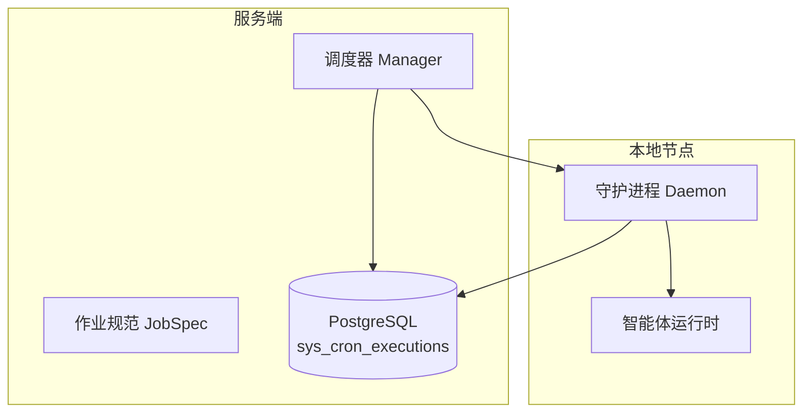
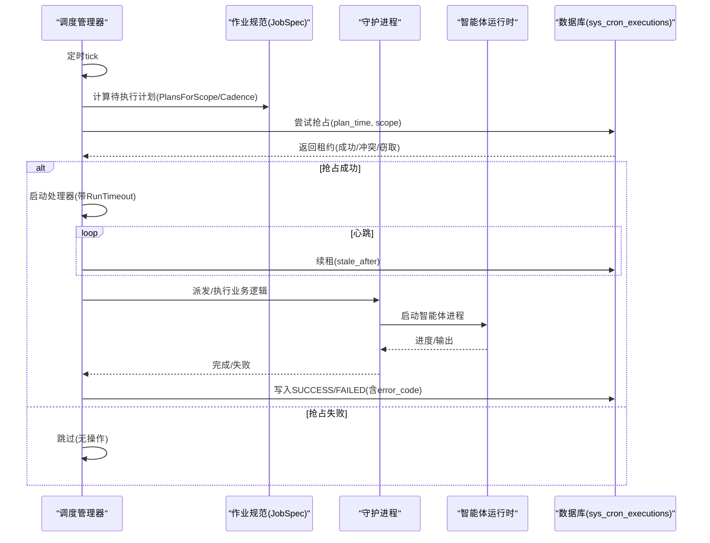
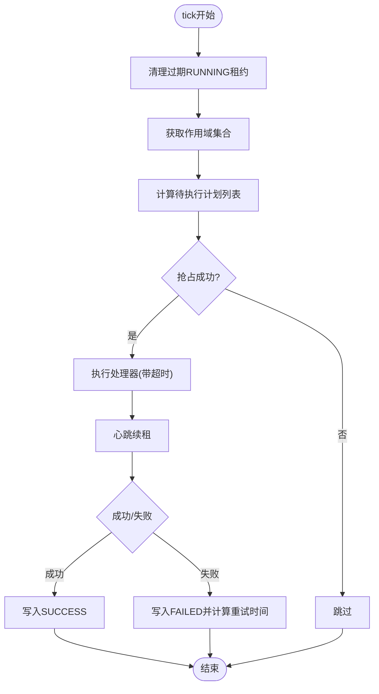
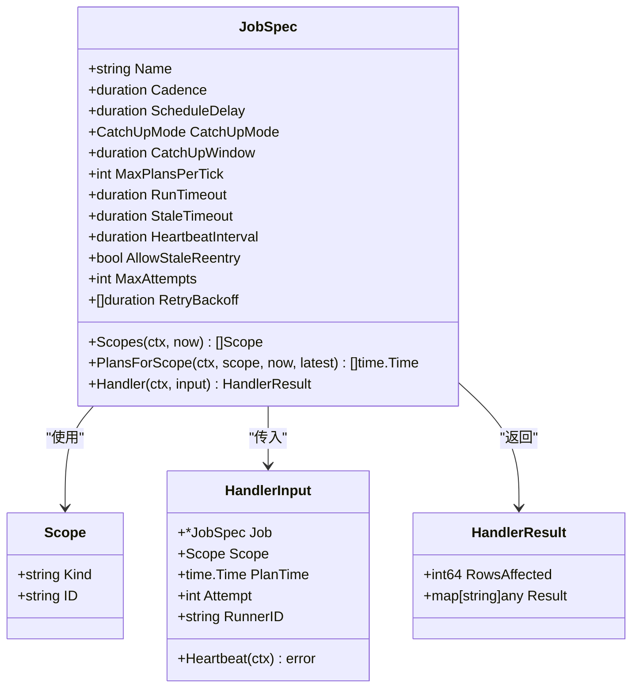
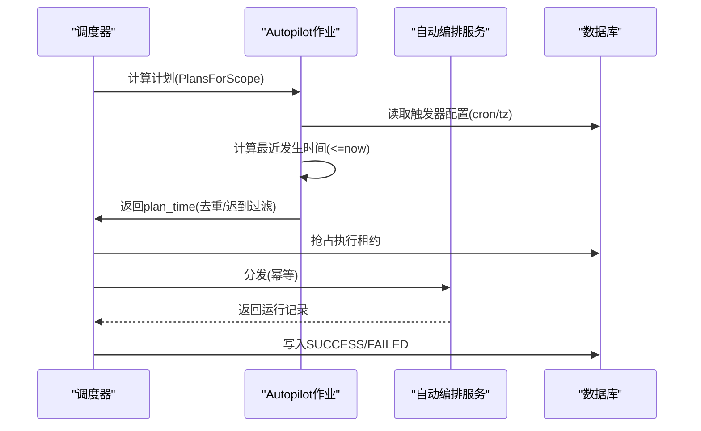
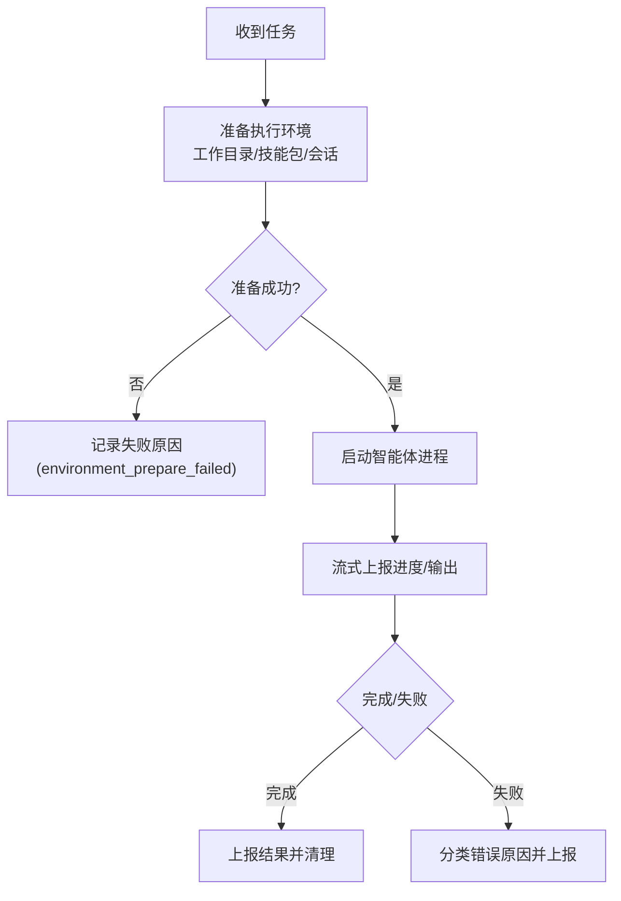
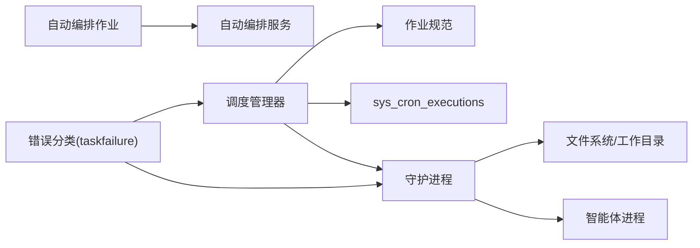
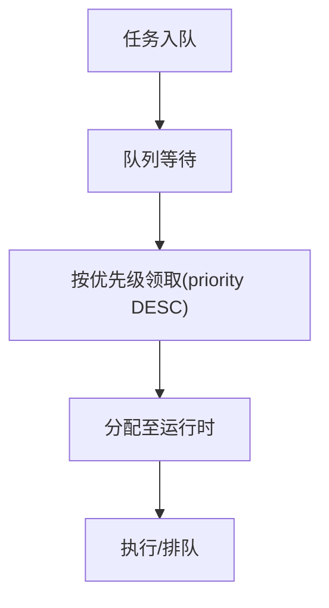
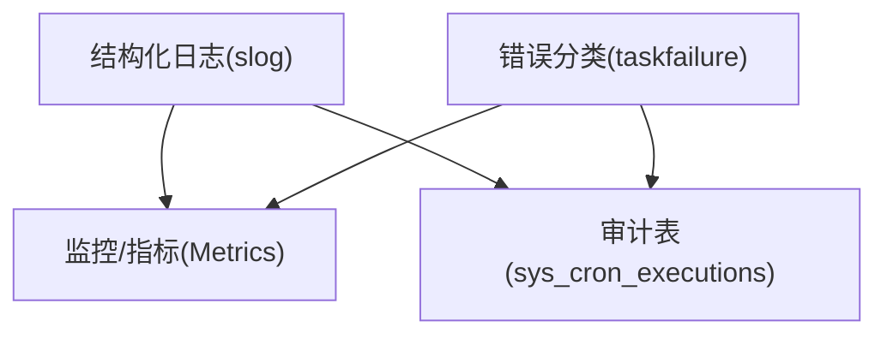

# 自动化服务

<cite>
**本文引用的文件**   
- [server/internal/scheduler/manager.go](file://server/internal/scheduler/manager.go)
- [server/internal/scheduler/spec.go](file://server/internal/scheduler/spec.go)
- [server/internal/scheduler/jobs_autopilot.go](file://server/internal/scheduler/jobs_autopilot.go)
- [server/migrations/113_sys_cron_executions.up.sql](file://server/migrations/113_sys_cron_executions.up.sql)
- [server/pkg/taskfailure/failure.go](file://server/pkg/taskfailure/failure.go)
- [server/pkg/taskfailure/classify.go](file://server/pkg/taskfailure/classify.go)
- [server/internal/daemon/daemon.go](file://server/internal/daemon/daemon.go)
- [server/internal/daemon/config.go](file://server/internal/daemon/config.go)
- [CLI_AND_DAEMON.md](file://CLI_AND_DAEMON.md)
- [apps/docs/content/docs/environment-variables.zh.mdx](file://apps/docs/content/docs/environment-variables.zh.mdx)
- [server/pkg/publicapi/v1/foundation.go](file://server/pkg/publicapi/v1/foundation.go)
- [server/pkg/db/queries/agent.sql](file://server/pkg/db/queries/agent.sql)
</cite>

## 目录
1. [简介](#简介)
2. [项目结构](#项目结构)
3. [核心组件](#核心组件)
4. [架构总览](#架构总览)
5. [详细组件分析](#详细组件分析)
6. [依赖关系分析](#依赖关系分析)
7. [性能与调度特性](#性能与调度特性)
8. [监控、日志与错误处理](#监控日志与错误处理)
9. [配置示例与最佳实践](#配置示例与最佳实践)
10. [故障排查指南](#故障排查指南)
11. [结论](#结论)

## 简介
本文件面向“自动化服务”的运维与开发者，系统性说明自动化规则的配置、触发与执行机制；解释配额管理、限流控制与资源调度策略；阐述定时任务调度、cron表达式支持与任务优先级管理；并覆盖自动化执行的监控、日志记录与错误处理。文档同时提供可操作的配置示例与最佳实践建议，帮助在多实例部署下稳定运行自动化流程。

## 项目结构
自动化系统由“服务端调度器 + 守护进程（Daemon）+ 数据库审计表”三部分构成：
- 服务端调度器：基于数据库的分布式锁与审计表驱动周期性作业，支持按范围（scope）分片、计划时间（plan_time）幂等执行、心跳保活、失败重试与过期回收。
- 守护进程：负责发现本地智能体运行时、拉取任务、准备执行环境、启动智能体进程、上报进度与结果，并提供健康检查与自动更新能力。
- 数据库审计表：以 sys_cron_executions 为核心，承载所有内部周期作业的并发控制、执行审计与重试状态。

**图示来源**
- [server/internal/scheduler/manager.go:93-136](file://server/internal/scheduler/manager.go#L93-L136)
- [server/internal/scheduler/spec.go:99-192](file://server/internal/scheduler/spec.go#L99-L192)
- [server/migrations/113_sys_cron_executions.up.sql:36-106](file://server/migrations/113_sys_cron_executions.up.sql#L36-L106)
- [server/internal/daemon/daemon.go:373-687](file://server/internal/daemon/daemon.go#L373-L687)

**章节来源**
- [server/internal/scheduler/manager.go:93-136](file://server/internal/scheduler/manager.go#L93-L136)
- [server/internal/scheduler/spec.go:99-192](file://server/internal/scheduler/spec.go#L99-L192)
- [server/migrations/113_sys_cron_executions.up.sql:36-106](file://server/migrations/113_sys_cron_executions.up.sql#L36-L106)
- [server/internal/daemon/daemon.go:373-687](file://server/internal/daemon/daemon.go#L373-L687)

## 核心组件
- 调度管理器（Manager）：按固定节拍唤醒，计算每个作业的可执行计划时间，尝试抢占执行租约，调用业务处理器，维护心跳并在结束时写入成功或失败审计行。
- 作业规范（JobSpec）：描述作业名称、计划粒度（Cadence）、延迟窗口（ScheduleDelay）、追赶模式（CatchUpMode）、最大计划数（MaxPlansPerTick）、超时与心跳、重试策略、作用域提供者（Scopes）、自定义计划钩子（PlansForScope）与处理器（Handler）。
- 自动编排调度作业（Autopilot Schedule Dispatch）：将“启用且活跃的调度触发器”作为作用域，按 cron 表达式计算最近一次应触发的 UTC 时间，去重后派发执行，保证幂等与不重复。
- 守护进程（Daemon）：注册本地运行时、轮询/WebSocket 领取任务、准备执行环境、启动智能体进程、流式上报进度与结果，并提供健康检查、自动更新与资源清理。

**章节来源**
- [server/internal/scheduler/manager.go:93-136](file://server/internal/scheduler/manager.go#L93-L136)
- [server/internal/scheduler/spec.go:99-192](file://server/internal/scheduler/spec.go#L99-L192)
- [server/internal/scheduler/jobs_autopilot.go:89-121](file://server/internal/scheduler/jobs_autopilot.go#L89-L121)
- [server/internal/daemon/daemon.go:373-687](file://server/internal/daemon/daemon.go#L373-L687)

## 架构总览
下图展示从“计划生成 → 抢占执行 → 守护进程执行 → 结果回写”的端到端流程，以及心跳保活与失败重试路径。

**图示来源**
- [server/internal/scheduler/manager.go:138-189](file://server/internal/scheduler/manager.go#L138-L189)
- [server/internal/scheduler/manager.go:287-430](file://server/internal/scheduler/manager.go#L287-L430)
- [server/internal/scheduler/jobs_autopilot.go:220-317](file://server/internal/scheduler/jobs_autopilot.go#L220-L317)
- [server/migrations/113_sys_cron_executions.up.sql:36-106](file://server/migrations/113_sys_cron_executions.up.sql#L36-L106)

## 详细组件分析

### 调度管理器（Manager）
- 职责：周期性 tick、计算计划、抢占租约、执行处理器、心跳保活、写入终态。
- 关键行为：
  - 首次立即执行一次，之后按 TickInterval 循环。
  - 每 tick 先清理过期的 RUNNING 租约（标记为 FAILED），避免僵尸任务。
  - 对每个作业的作用域集合，计算本次需要处理的 plan_time 列表。
  - 通过 tryClaim 抢占 (job_name, scope_kind, scope_id, plan_time) 唯一键对应的执行权。
  - 处理器上下文受 RunTimeout 限制；心跳在独立后台 goroutine 中续租。
  - 成功/失败均写入审计行，失败时根据 MaxAttempts 与 RetryBackoff 设置下次重试时间。

**图示来源**
- [server/internal/scheduler/manager.go:138-189](file://server/internal/scheduler/manager.go#L138-L189)
- [server/internal/scheduler/manager.go:287-430](file://server/internal/scheduler/manager.go#L287-L430)

**章节来源**
- [server/internal/scheduler/manager.go:93-136](file://server/internal/scheduler/manager.go#L93-L136)
- [server/internal/scheduler/manager.go:138-189](file://server/internal/scheduler/manager.go#L138-L189)
- [server/internal/scheduler/manager.go:287-430](file://server/internal/scheduler/manager.go#L287-L430)

### 作业规范（JobSpec）与追赶策略
- 字段要点：
  - Cadence：计划桶大小（如 5 分钟），用于对齐 plan_time。
  - ScheduleDelay：延迟窗口，避免数据未就绪导致的漏扫。
  - CatchUpMode：latest_only（仅最新）或 every_plan（回放全部）。
  - CatchUpWindow：回放窗口上限，防止长时间停机后的爆炸式回放。
  - MaxPlansPerTick：单次 tick 最多抢占的计划数。
  - RunTimeout/StaleTimeout/HeartbeatInterval：执行与租约保活边界。
  - AllowStaleReentry：是否允许抢占过期租约（非幂等作业需关闭）。
  - MaxAttempts/RetryBackoff：失败重试次数与退避间隔。
  - Scopes/PlansForScope/Handler：作用域、计划钩子与业务处理器。

**图示来源**
- [server/internal/scheduler/spec.go:99-192](file://server/internal/scheduler/spec.go#L99-L192)
- [server/internal/scheduler/spec.go:204-235](file://server/internal/scheduler/spec.go#L204-L235)

**章节来源**
- [server/internal/scheduler/spec.go:23-65](file://server/internal/scheduler/spec.go#L23-L65)
- [server/internal/scheduler/spec.go:99-192](file://server/internal/scheduler/spec.go#L99-L192)
- [server/internal/scheduler/spec.go:204-235](file://server/internal/scheduler/spec.go#L204-L235)

### 自动编排调度作业（Autopilot Schedule Dispatch）
- 作用域：每个启用的 schedule 触发器为一个 scope（kind=autopilot_trigger，id=trigger UUID）。
- 计划计算：
  - 读取触发器的 cron 表达式与时区，计算 (lastPlan, now] 内的发生时间。
  - 若存在 FAILED 且仍可重试的行，优先返回该 plan_time 以便重试分支生效。
  - 仅保留最近一次发生时间（collapse），并拒绝超出“迟到窗口”的计划。
- 处理器：
  - 校验触发器与自动编排状态，调用分发接口创建运行记录。
  - 推进 next_run_at 与 last_fired_at，确保 UI 显示一致。
- 幂等性：
  - 结合 sys_cron_executions 的唯一键与分发接口的幂等实现，避免重复执行。

**图示来源**
- [server/internal/scheduler/jobs_autopilot.go:89-121](file://server/internal/scheduler/jobs_autopilot.go#L89-L121)
- [server/internal/scheduler/jobs_autopilot.go:220-317](file://server/internal/scheduler/jobs_autopilot.go#L220-L317)
- [server/internal/scheduler/jobs_autopilot.go:323-411](file://server/internal/scheduler/jobs_autopilot.go#L323-L411)

**章节来源**
- [server/internal/scheduler/jobs_autopilot.go:89-121](file://server/internal/scheduler/jobs_autopilot.go#L89-L121)
- [server/internal/scheduler/jobs_autopilot.go:220-317](file://server/internal/scheduler/jobs_autopilot.go#L220-L317)
- [server/internal/scheduler/jobs_autopilot.go:323-411](file://server/internal/scheduler/jobs_autopilot.go#L323-L411)

### 守护进程（Daemon）与任务执行
- 生命周期：
  - 启动时探测已安装智能体 CLI，注册运行时。
  - 通过 WebSocket/HTTP 轮询领取任务，准备执行环境（工作目录、技能包、会话等）。
  - 启动智能体进程，流式上报进度与最终结果。
  - 提供健康检查端口与自动更新能力。
- 并发与隔离：
  - 每个任务拥有独立的工作目录与隔离环境，复用 PriorWorkDir 提升效率。
  - 本地目录锁定确保同一路径顺序执行，避免竞争。
- 超时与看门狗：
  - 任务准备阶段有硬超时；运行期支持空闲看门狗与工具调用看门狗，防止挂起。

**图示来源**
- [server/internal/daemon/daemon.go:373-687](file://server/internal/daemon/daemon.go#L373-L687)
- [CLI_AND_DAEMON.md:233-241](file://CLI_AND_DAEMON.md#L233-L241)

**章节来源**
- [server/internal/daemon/daemon.go:373-687](file://server/internal/daemon/daemon.go#L373-L687)
- [CLI_AND_DAEMON.md:233-241](file://CLI_AND_DAEMON.md#L233-L241)

## 依赖关系分析
- 调度器依赖数据库表 sys_cron_executions 进行分布式锁与审计；作业规范定义执行语义；自动编排作业依赖服务层 API 进行幂等分发。
- 守护进程依赖本地文件系统与工作目录隔离，并通过网络与服务端交互（任务领取、结果上报、健康检查）。
- 错误分类统一通过 taskfailure 包，区分平台侧与智能体侧错误，便于监控与告警。

**图示来源**
- [server/internal/scheduler/manager.go:93-136](file://server/internal/scheduler/manager.go#L93-L136)
- [server/internal/scheduler/jobs_autopilot.go:89-121](file://server/internal/scheduler/jobs_autopilot.go#L89-L121)
- [server/pkg/taskfailure/failure.go:1-41](file://server/pkg/taskfailure/failure.go#L1-L41)
- [server/internal/daemon/daemon.go:373-687](file://server/internal/daemon/daemon.go#L373-L687)

**章节来源**
- [server/internal/scheduler/manager.go:93-136](file://server/internal/scheduler/manager.go#L93-L136)
- [server/internal/scheduler/jobs_autopilot.go:89-121](file://server/internal/scheduler/jobs_autopilot.go#L89-L121)
- [server/pkg/taskfailure/failure.go:1-41](file://server/pkg/taskfailure/failure.go#L1-L41)
- [server/internal/daemon/daemon.go:373-687](file://server/internal/daemon/daemon.go#L373-L687)

## 性能与调度特性
- 并发与抢占：
  - 通过 (job_name, scope_kind, scope_id, plan_time) 唯一键实现分布式抢占，避免重复执行。
  - 支持 stale lease 窃取，提高鲁棒性。
- 追赶与回放：
  - latest_only：仅处理最新计划，适合自身具备水位恢复的作业。
  - every_plan：按 Cadence 回放历史计划，受 CatchUpWindow 与 MaxPlansPerTick 限制。
- 心跳与超时：
  - 心跳间隔必须小于 StaleTimeout；RunTimeout 必须小于 StaleTimeout。
  - 自动编排作业默认 RunTimeout=2min，StaleTimeout=5min，HeartbeatInterval=30s。
- 任务优先级：
  - 任务队列查询按 priority DESC 排序，保障高优先级任务优先被领取。

**图示来源**
- [server/pkg/db/queries/agent.sql:918-939](file://server/pkg/db/queries/agent.sql#L918-L939)

**章节来源**
- [server/internal/scheduler/spec.go:23-65](file://server/internal/scheduler/spec.go#L23-L65)
- [server/internal/scheduler/manager.go:138-189](file://server/internal/scheduler/manager.go#L138-L189)
- [server/pkg/db/queries/agent.sql:918-939](file://server/pkg/db/queries/agent.sql#L918-L939)

## 监控、日志与错误处理
- 审计与指标：
  - sys_cron_executions 记录每次计划的执行状态、尝试次数、耗时、影响行数、错误码与结果摘要。
  - 支持 Prometheus 指标暴露（METRICS_ADDR）与实时健康端点保护（REALTIME_METRICS_TOKEN）。
- 错误分类：
  - 平台侧错误：queued_expired、runtime_offline、timeout、iteration_limit、agent_blocked、api_invalid_request、skill_bundle_unavailable、runtime_cli_timeout、environment_prepare_failed、invalid_task_identity。
  - 智能体侧错误：provider_auth_or_access、provider_quota_limit、provider_capacity_or_rate_limit、provider_server_error、provider_network、process_failure、empty_or_unparseable_output、agent_timeout、context_overflow、missing_config、model_not_found_or_unavailable、runtime_version_unsupported、runtime_missing_executable、unknown。
- 日志与追踪：
  - 结构化日志（slog）贯穿调度器与守护进程。
  - 客户端请求携带 Request-ID，便于前后端日志关联。

**图示来源**
- [server/migrations/113_sys_cron_executions.up.sql:36-106](file://server/migrations/113_sys_cron_executions.up.sql#L36-L106)
- [server/pkg/taskfailure/failure.go:58-252](file://server/pkg/taskfailure/failure.go#L58-L252)
- [apps/docs/content/docs/environment-variables.zh.mdx:296-305](file://apps/docs/content/docs/environment-variables.zh.mdx#L296-L305)

**章节来源**
- [server/migrations/113_sys_cron_executions.up.sql:36-106](file://server/migrations/113_sys_cron_executions.up.sql#L36-L106)
- [server/pkg/taskfailure/failure.go:58-252](file://server/pkg/taskfailure/failure.go#L58-L252)
- [apps/docs/content/docs/environment-variables.zh.mdx:296-305](file://apps/docs/content/docs/environment-variables.zh.mdx#L296-L305)

## 配置示例与最佳实践
- 定时任务调度与 cron 支持：
  - 使用 Autopilot Schedule Dispatch 作业，为每个触发器配置 cron 表达式与时区，调度器会按 UTC 计算最近发生时间并派发。
  - 建议开启 AllowStaleReentry=true 与合理 MaxAttempts/RetryBackoff，以应对短暂故障。
- 任务优先级与资源调度：
  - 任务队列按 priority DESC 排序，建议在高价值任务入队时设置更高优先级。
  - 守护进程支持最大并发任务数（MaxConcurrentTasks），根据主机资源调优。
- 配额管理与限流控制：
  - 公共 API 层面支持 RateLimitProfile（如 user_default、plugin_strict），可在路由策略中绑定限流配置。
  - 智能体侧配额超限会被分类为 provider_quota_limit，需充值或调整用量。
- 观测与统计：
  - 通过环境变量启用 Metrics 与 Realtime 健康端点，配合鉴权 token 保护。
  - 关闭 PostHog 上报或接入自有 PostHog 项目以满足合规需求。

**章节来源**
- [server/internal/scheduler/jobs_autopilot.go:89-121](file://server/internal/scheduler/jobs_autopilot.go#L89-L121)
- [server/pkg/db/queries/agent.sql:918-939](file://server/pkg/db/queries/agent.sql#L918-L939)
- [server/internal/daemon/config.go:100-160](file://server/internal/daemon/config.go#L100-L160)
- [server/pkg/publicapi/v1/foundation.go:48-73](file://server/pkg/publicapi/v1/foundation.go#L48-L73)
- [apps/docs/content/docs/environment-variables.zh.mdx:296-305](file://apps/docs/content/docs/environment-variables.zh.mdx#L296-L305)

## 故障排查指南
- 常见问题定位：
  - 任务长期 queued：检查运行时是否在线、是否有足够的并发槽位、是否存在抢占冲突。
  - 任务失败频繁：查看 failure_reason 分类，区分平台侧与智能体侧错误；关注 provider_quota_limit、provider_capacity_or_rate_limit、environment_prepare_failed 等。
  - 调度器未触发：确认作业是否注册、作用域是否有效、cron 表达式与时区是否正确、是否处于迟到窗口之外。
- 恢复与重试：
  - 失败行包含 attempt 与 next_retry_at，调度器会在重试预算内重新抢占。
  - 对于非幂等作业，关闭 AllowStaleReentry，避免重复执行。
- 健康检查与诊断：
  - 使用守护进程健康端口检查本地运行时状态。
  - 通过 Prometheus 指标与审计表查询近期失败趋势与耗时分布。

**章节来源**
- [server/pkg/taskfailure/failure.go:58-252](file://server/pkg/taskfailure/failure.go#L58-L252)
- [server/internal/scheduler/manager.go:287-430](file://server/internal/scheduler/manager.go#L287-L430)
- [server/internal/daemon/daemon.go:373-687](file://server/internal/daemon/daemon.go#L373-L687)

## 结论
本自动化服务以数据库为中心，实现了可靠的分布式调度、幂等执行与完善的审计追踪；守护进程负责本地执行环境的准备与智能体进程的管控；通过错误分类、监控指标与健康检查，形成闭环的运维体系。建议在生产环境中合理配置 cron 触发器、任务优先级、并发度与重试策略，并结合监控与日志进行持续优化。