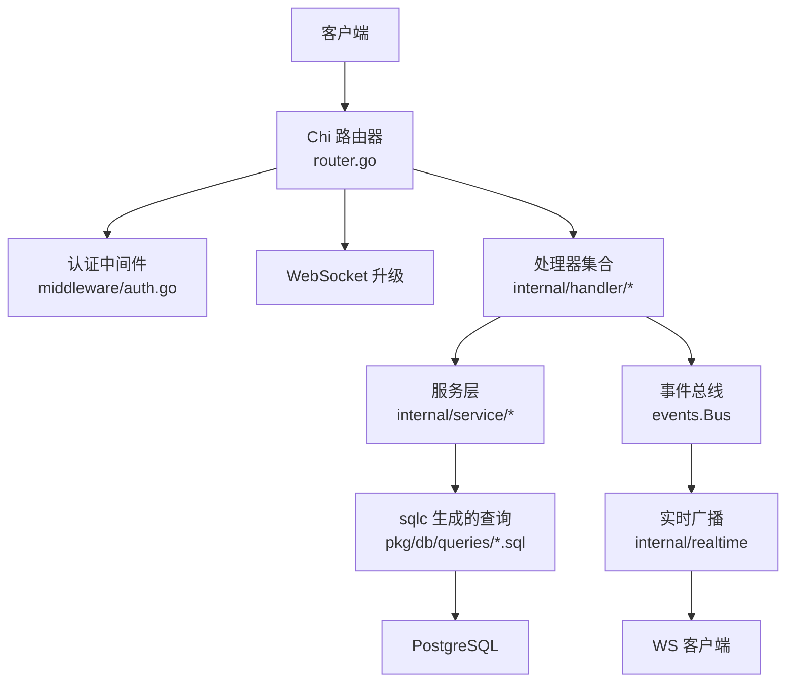
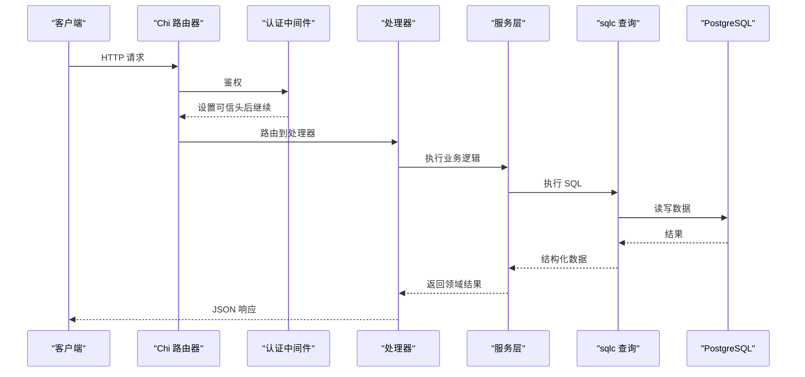
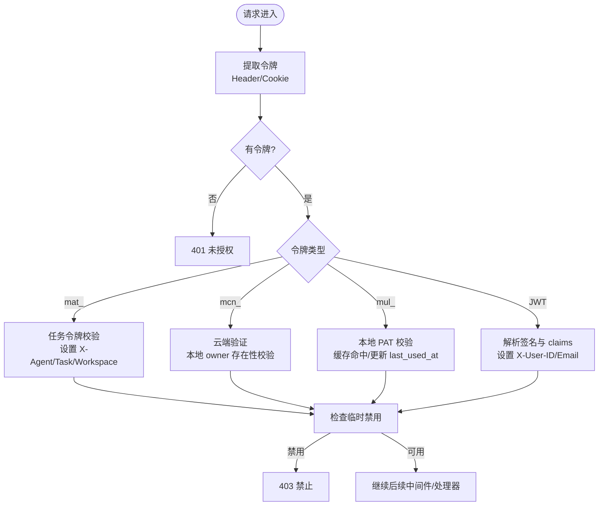
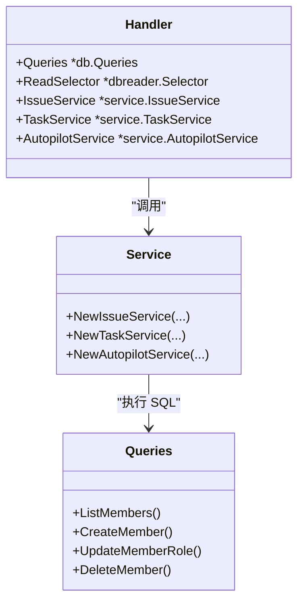
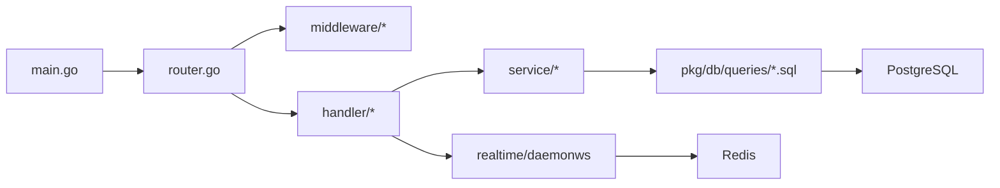

# 后端服务

<cite>
**本文引用的文件**
- [server/cmd/server/main.go](file://server/cmd/server/main.go)
- [server/cmd/server/router.go](file://server/cmd/server/router.go)
- [server/internal/handler/handler.go](file://server/internal/handler/handler.go)
- [server/internal/middleware/auth.go](file://server/internal/middleware/auth.go)
- [server/sqlc.yaml](file://server/sqlc.yaml)
- [server/pkg/publicapi/v1/problem.go](file://server/pkg/publicapi/v1/problem.go)
- [server/pkg/db/queries/member.sql](file://server/pkg/db/queries/member.sql)
</cite>

## 目录
1. [简介](#简介)
2. [项目结构](#项目结构)
3. [核心组件](#核心组件)
4. [架构总览](#架构总览)
5. [详细组件分析](#详细组件分析)
6. [依赖关系分析](#依赖关系分析)
7. [性能考量](#性能考量)
8. [故障排查指南](#故障排查指南)
9. [结论](#结论)
10. [附录：API 端点与错误码](#附录api-端点与错误码)

## 简介
本文件面向 Go 后端服务的开发者与维护者，系统性说明基于 Chi 路由器的 API 架构、中间件处理链设计、认证授权机制、错误处理策略、日志记录方案、服务层业务组织（任务管理、用户管理、工作空间管理等）、数据库访问层设计与 sqlc 使用方式，以及 API 端点文档、请求响应格式与错误码定义。同时提供代码级图示与最佳实践建议，帮助读者快速理解并高效扩展系统。

## 项目结构
后端服务位于 server 目录，采用分层组织：
- 入口与启动：cmd/server/main.go 负责配置加载、依赖装配、后台任务启动、HTTP 服务器生命周期管理。
- 路由与中间件：cmd/server/router.go 使用 go-chi/chi 构建路由树，挂载 CORS、请求 ID、鉴权、限流等中间件，并将 /api/*、/ws、/v1 等路径注册到对应处理器。
- 处理器层：internal/handler 将 HTTP 请求解析为领域操作，调用 service 层完成事务性业务逻辑，并通过 events/bus 发布事件。
- 服务层：internal/service 封装跨查询的业务流程，如任务调度、问题管理、自动化编排等。
- 数据访问层：pkg/db/queries/*.sql 通过 sqlc 生成类型安全的 Go 客户端，统一在 Handler/Service 中注入使用。
- 中间件：internal/middleware 实现认证、CSRF、工作空间上下文、速率限制、插件鉴权等横切能力。
- 实时通信：internal/realtime 与 internal/daemonws 分别面向客户端与守护进程的双向通道，支持 Redis 多节点广播。
- 存储与集成：internal/storage 与 internal/integrations 提供对象存储与第三方平台接入。

**图表来源**
- [server/cmd/server/router.go:1-200](file://server/cmd/server/router.go#L1-L200)
- [server/internal/handler/handler.go:1-120](file://server/internal/handler/handler.go#L1-L120)
- [server/sqlc.yaml:1-13](file://server/sqlc.yaml#L1-L13)

**章节来源**
- [server/cmd/server/main.go:292-370](file://server/cmd/server/main.go#L292-L370)
- [server/cmd/server/router.go:1-200](file://server/cmd/server/router.go#L1-L200)
- [server/internal/handler/handler.go:1-120](file://server/internal/handler/handler.go#L1-L120)
- [server/sqlc.yaml:1-13](file://server/sqlc.yaml#L1-L13)

## 核心组件
- 入口与生命周期：main.go 初始化日志、JWT 安全校验、数据库连接池、可选只读副本、Redis 实例、事件总线、实时 Hub、后台调度器、指标与 pprof 服务器，并启动 HTTP 服务。
- 路由与中间件：router.go 组装 CORS、请求 ID、认证、工作空间上下文、速率限制等中间件，注册 REST 与 WebSocket 路由，暴露 /metrics 与 /debug/pprof。
- 处理器与响应：handler.go 提供统一的 JSON 写入、错误写入、冲突处理、UUID 解析工具方法，集中构造 Handler 结构体，注入服务、存储、缓存、限流器等依赖。
- 认证中间件：middleware/auth.go 支持 Bearer JWT、HttpOnly Cookie + CSRF、个人访问令牌（PAT）与云节点令牌（Cloud PAT），并为下游设置 X-User-ID、X-Agent-ID、X-Task-ID、X-Workspace-ID 等可信头。
- 数据访问：sqlc.yaml 指定 PostgreSQL 引擎、SQL 查询目录与生成输出；所有 SQL 变更需执行 make sqlc 并提交生成代码。
- 错误与问题：publicapi/v1/problem.go 提供 RFC 9457 风格的问题对象，稳定 code 映射 HTTP 状态码，便于前端统一处理。

**章节来源**
- [server/cmd/server/main.go:292-370](file://server/cmd/server/main.go#L292-L370)
- [server/cmd/server/router.go:1-200](file://server/cmd/server/router.go#L1-L200)
- [server/internal/handler/handler.go:524-593](file://server/internal/handler/handler.go#L524-L593)
- [server/internal/middleware/auth.go:34-267](file://server/internal/middleware/auth.go#L34-L267)
- [server/sqlc.yaml:1-13](file://server/sqlc.yaml#L1-L13)
- [server/pkg/publicapi/v1/problem.go:36-111](file://server/pkg/publicapi/v1/problem.go#L36-L111)

## 架构总览
请求从客户端进入 Chi 路由器，依次经过 CORS、请求 ID、认证、工作空间上下文、速率限制等中间件，最终到达具体处理器。处理器解析参数、调用服务层完成事务性业务逻辑，必要时通过事件总线发布领域事件，由实时层推送给订阅客户端。数据持久化通过 sqlc 生成的查询访问 PostgreSQL，可选通过只读副本提升读取吞吐。

**图表来源**
- [server/cmd/server/router.go:1-200](file://server/cmd/server/router.go#L1-L200)
- [server/internal/middleware/auth.go:34-267](file://server/internal/middleware/auth.go#L34-L267)
- [server/internal/handler/handler.go:407-522](file://server/internal/handler/handler.go#L407-L522)
- [server/sqlc.yaml:1-13](file://server/sqlc.yaml#L1-L13)

## 详细组件分析

### 认证与授权机制
- 令牌来源优先级：Authorization: Bearer <token> > multica_auth HttpOnly Cookie（写操作需 CSRF）。
- 令牌类型：
  - 任务令牌（mat_）：由服务端在任务认领时签发，注入 X-Agent-ID、X-Task-ID、X-Workspace-ID，仅用于机器代理路径。
  - 云节点令牌（mcn_）：由云端 Fleet 验证，本地二次校验 owner_id 存在性。
  - 个人访问令牌（mul_）：本地 PAT，带 TTL 与 last_used_at 更新，命中缓存可跳过 DB。
  - JWT：解析签名与 claims，提取 sub/email，设置 X-User-ID/X-User-Email。
- 临时禁用用户拦截：任何认证分支均检查是否暂时禁用，拒绝并返回 403。
- 可信头保护：中间件开头丢弃客户端提供的 X-Actor-Source，仅允许内部设置，防止伪造身份来源。

**图表来源**
- [server/internal/middleware/auth.go:34-267](file://server/internal/middleware/auth.go#L34-L267)

**章节来源**
- [server/internal/middleware/auth.go:34-267](file://server/internal/middleware/auth.go#L34-L267)

### 错误处理策略
- 统一问题对象：publicapi/v1/problem.go 提供 RFC 9457 风格响应，包含 type/title/status/code/detail/requestID/error，便于前端统一处理。
- 状态码到稳定 code 的映射：CodeForStatus 将常见 HTTP 状态映射为稳定错误码（如 unauthorized、forbidden、not_found、conflict、rate_limited、quota_exceeded、service_unavailable、upstream_unavailable、internal_error）。
- 处理器内错误写入：handler.go 提供 writeJSON/writeError/writeErrorCode/writeRevisionConflict/writeEditConflict 等工具，确保 Content-Length 准确、错误字段一致。
- 唯一性冲突与版本冲突：revision_conflict 携带资源类型、ID、期望与实际版本，便于客户端重试或合并。

**章节来源**
- [server/pkg/publicapi/v1/problem.go:36-111](file://server/pkg/publicapi/v1/problem.go#L36-L111)
- [server/internal/handler/handler.go:524-593](file://server/internal/handler/handler.go#L524-L593)

### 日志记录方案
- 启动阶段：main.go 初始化日志，记录数据库连接、Redis 中继模式、指标服务器地址、后台任务启动等信息。
- 运行时：slog 贯穿认证失败、数据库不可用、Redis 配置无效、LLM 重试策略等关键路径，便于定位问题。
- 指标与调试：可选 metrics 与 pprof 服务器，生产环境建议限制监听地址。

**章节来源**
- [server/cmd/server/main.go:292-370](file://server/cmd/server/main.go#L292-L370)
- [server/cmd/server/main.go:573-608](file://server/cmd/server/main.go#L573-L608)
- [server/cmd/server/main.go:776-798](file://server/cmd/server/main.go#L776-L798)

### 服务层业务逻辑组织
- 任务管理：TaskService 负责任务认领、完成、取消、批量处理、心跳调度、失败恢复、工作目录复用等，结合 daemon 与事件总线驱动执行。
- 用户与工作空间：成员管理、角色、邀请、权限边界在工作空间内隔离；Handler 注入 IssueService/AutopilotService 等，按领域拆分职责。
- 自动化编排：AutopilotService 负责计划触发、配额、通知、失败监控，与 DB 内置调度器协作。
- 插件与技能：PluginService 管理插件安装、动作、事件桥接、MCP 传输、定时钩子等。

**章节来源**
- [server/internal/handler/handler.go:191-405](file://server/internal/handler/handler.go#L191-L405)
- [server/internal/handler/handler.go:407-522](file://server/internal/handler/handler.go#L407-L522)

### 数据库访问层与 sqlc
- 配置：sqlc.yaml 指定 PostgreSQL 引擎、查询目录 pkg/db/queries、生成包 db 输出至 pkg/db/generated，启用 pgx/v5、JSON tags、空切片。
- 查询示例：member.sql 展示成员列表、角色更新、创建、删除等常用操作。
- 规则：禁止外键与级联，关系清理在应用层事务中完成；索引迁移使用 CONCURRENTLY 且单语句文件；变更后必须运行 make sqlc 并提交生成代码。

**图表来源**
- [server/internal/handler/handler.go:191-405](file://server/internal/handler/handler.go#L191-L405)
- [server/sqlc.yaml:1-13](file://server/sqlc.yaml#L1-L13)
- [server/pkg/db/queries/member.sql:1-38](file://server/pkg/db/queries/member.sql#L1-L38)

**章节来源**
- [server/sqlc.yaml:1-13](file://server/sqlc.yaml#L1-L13)
- [server/pkg/db/queries/member.sql:1-38](file://server/pkg/db/queries/member.sql#L1-L38)

## 依赖关系分析
- 外部依赖：go-chi/chi 路由、pgx/v5 数据库、redis/go-redis 实时与缓存、golang-jwt/jwt 认证、prometheus 指标、gorilla/websocket 实时通道。
- 模块耦合：
  - main.go 装配 Handler、Hub、Bus、Relay、Scheduler，注入到 router 与后台任务。
  - router.go 将中间件与处理器组合，暴露 /api、/ws、/v1、/metrics、/debug/pprof。
  - handler.go 集中依赖注入，屏蔽外部细节，保持处理器简洁。
  - middleware/auth.go 与 publicapi/v1/problem.go 提供横切能力与统一错误模型。
- 潜在循环：通过接口与依赖注入避免直接循环；事件总线与实时层解耦处理器与消费者。

**图表来源**
- [server/cmd/server/main.go:292-370](file://server/cmd/server/main.go#L292-L370)
- [server/cmd/server/router.go:1-200](file://server/cmd/server/router.go#L1-L200)
- [server/internal/handler/handler.go:191-405](file://server/internal/handler/handler.go#L191-L405)

**章节来源**
- [server/cmd/server/main.go:292-370](file://server/cmd/server/main.go#L292-L370)
- [server/cmd/server/router.go:1-200](file://server/cmd/server/router.go#L1-L200)
- [server/internal/handler/handler.go:191-405](file://server/internal/handler/handler.go#L191-L405)

## 性能考量
- 数据库连接池：主库与只读副本独立配置，读取路径可选择副本以提升吞吐；连接数与环境变量控制，配合 PgBouncer/RDS Proxy 可提升并发。
- 实时广播：默认内存 Hub，启用 Redis 后可多节点广播；分片流式中继支持高吞吐与回放窗口。
- 缓存与会话：PAT 缓存减少 DB 压力；Cookie + CSRF 保障浏览器写操作安全。
- 指标与诊断：可选 metrics/pprof 服务器，生产环境限制监听地址，避免暴露敏感信息。

**章节来源**
- [server/cmd/server/main.go:372-387](file://server/cmd/server/main.go#L372-L387)
- [server/cmd/server/main.go:408-548](file://server/cmd/server/main.go#L408-L548)
- [server/cmd/server/main.go:573-608](file://server/cmd/server/main.go#L573-L608)

## 故障排查指南
- 认证失败：检查 Authorization/Cookie 是否正确；确认 JWT_SECRET 与 APP_ENV；PAT 是否过期或被撤销；临时禁用用户会被拒绝。
- 数据库不可用：启动阶段重试连接；生产环境应配置只读副本与回退策略；查看日志中的重试与错误信息。
- Redis 中继：URL 无效会降级为内存 Hub；多节点部署需正确配置 REALTIME_RELAY_REDIS_URL 与 CHANNEL_WS_LEASE_REDIS_URL。
- 错误码定位：使用 publicapi/v1/problem.go 的稳定 code 与 requestID 快速定位问题；前端根据 code 翻译提示。

**章节来源**
- [server/internal/middleware/auth.go:34-267](file://server/internal/middleware/auth.go#L34-L267)
- [server/cmd/server/main.go:340-370](file://server/cmd/server/main.go#L340-L370)
- [server/cmd/server/main.go:408-548](file://server/cmd/server/main.go#L408-L548)
- [server/pkg/publicapi/v1/problem.go:36-111](file://server/pkg/publicapi/v1/problem.go#L36-L111)

## 结论
该后端服务以 Chi 为核心路由，结合中间件链实现认证、CSRF、限流等横切能力；服务层按领域拆分，清晰组织任务、用户、工作空间等业务；数据访问层通过 sqlc 保证类型安全与一致性；错误处理采用 RFC 9457 风格，便于前端统一处理。整体架构具备良好的可扩展性与可观测性，适合团队协作与智能体驱动的复杂工作流。

## 附录：API 端点与错误码
- 路由与端点：
  - /api/*：REST API，受认证中间件保护，处理器在 internal/handler 中实现。
  - /ws：客户端实时通道，使用 gorilla/websocket。
  - /v1：公共 API 基础路径，插件桥接与公开能力在此暴露。
  - /metrics：Prometheus 指标（可选）。
  - /debug/pprof：性能剖析（可选）。
- 请求头：
  - Authorization: Bearer <token>
  - X-CSRF-Token：写操作需携带 CSRF（Cookie 认证时）
  - X-Workspace-ID / X-Workspace-Slug：工作空间范围
  - X-Request-ID：请求追踪
- 响应格式：
  - 成功：application/json，Content-Length 明确
  - 错误：RFC 9457 问题对象，包含 status/code/detail/requestID/error
- 错误码映射（部分）：
  - 400 → invalid_request
  - 401 → unauthorized
  - 403 → forbidden
  - 404 → not_found
  - 409 → conflict
  - 422 → incompatible
  - 429 → rate_limited
  - 507 → quota_exceeded
  - 503 → service_unavailable
  - 502 → upstream_unavailable
  - 其他 → internal_error

**章节来源**
- [server/cmd/server/router.go:1-200](file://server/cmd/server/router.go#L1-L200)
- [server/pkg/publicapi/v1/problem.go:36-111](file://server/pkg/publicapi/v1/problem.go#L36-L111)
- [server/internal/handler/handler.go:524-593](file://server/internal/handler/handler.go#L524-L593)