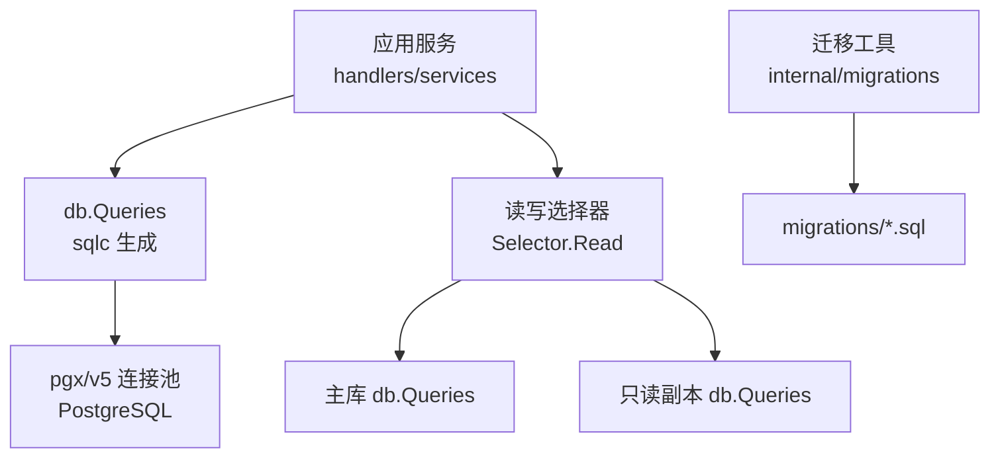
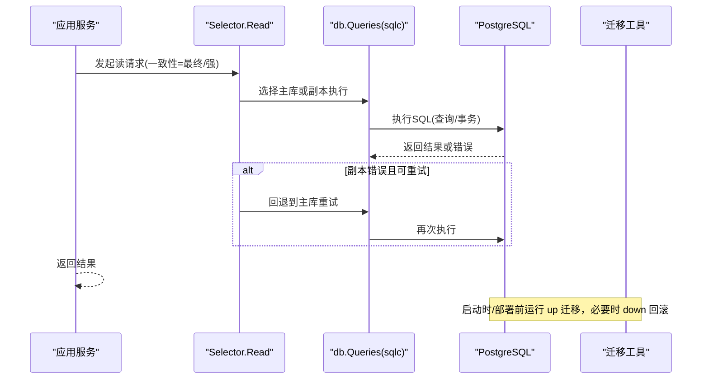
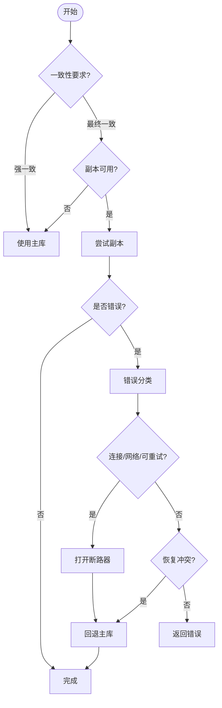
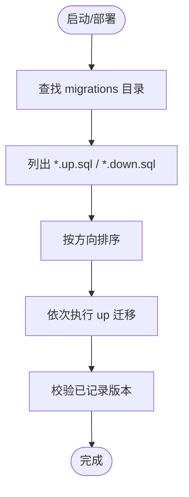
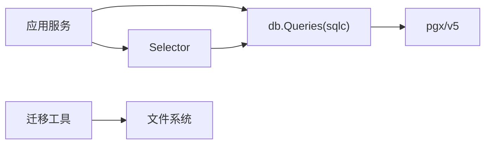

# 数据库访问层

<cite>
**本文引用的文件**
- [sqlc.yaml](file://server/sqlc.yaml)
- [selector.go](file://server/internal/dbreader/selector.go)
- [migrations.go](file://server/internal/migrations/migrations.go)
- [001_init.up.sql](file://server/migrations/001_init.up.sql)
- [activity.sql](file://server/pkg/db/queries/activity.sql)
- [agent.sql](file://server/pkg/db/queries/agent.sql)
</cite>

## 目录
1. [简介](#简介)
2. [项目结构](#项目结构)
3. [核心组件](#核心组件)
4. [架构总览](#架构总览)
5. [详细组件分析](#详细组件分析)
6. [依赖关系分析](#依赖关系分析)
7. [性能考虑](#性能考虑)
8. [故障排查指南](#故障排查指南)
9. [结论](#结论)
10. [附录](#附录)

## 简介
本章节面向数据库访问层的整体设计，围绕以下目标展开：
- 基于 sqlc 的类型安全数据库访问：SQL 查询与 Go 类型一一对应，编译期校验 SQL 正确性。
- 数据库连接管理与连接池：通过 pgx/v5 驱动、统一封装 db.Queries，配合读写分离选择器进行路由。
- 迁移管理策略：版本化迁移、回滚机制、并发迁移处理原则。
- 读写分离实现：只读副本的使用场景、断路器保护与回退策略。
- 查询优化与索引设计：结合业务查询模式设计索引，遵循并发建索引规范。
- 常见数据库操作示例：以活动日志、Agent 等典型表为例说明查询与更新范式。

## 项目结构
后端使用 Go + Chi + gorilla/websocket，数据库为 PostgreSQL 17。数据库访问层的关键位置如下：
- sqlc 配置位于 server/sqlc.yaml，指定引擎、SQL 目录、生成包与输出路径。
- 迁移脚本位于 server/migrations，按版本号命名 .up.sql/.down.sql。
- 迁移发现与排序逻辑位于 server/internal/migrations/migrations.go。
- 读写分离选择器位于 server/internal/dbreader/selector.go，提供 Read 函数对只读副本进行容错与回退。
- SQL 查询文件位于 server/pkg/db/queries，由 sqlc 生成类型安全的 Go 代码到 server/pkg/db/generated。

图表来源
- [sqlc.yaml:1-13](file://server/sqlc.yaml#L1-L13)
- [selector.go:100-164](file://server/internal/dbreader/selector.go#L100-L164)
- [migrations.go:20-72](file://server/internal/migrations/migrations.go#L20-L72)

章节来源
- [sqlc.yaml:1-13](file://server/sqlc.yaml#L1-L13)
- [selector.go:100-164](file://server/internal/dbreader/selector.go#L100-L164)
- [migrations.go:20-72](file://server/internal/migrations/migrations.go#L20-L72)

## 核心组件
- sqlc 类型安全访问
  - 通过 sqlc.yaml 配置 PostgreSQL 引擎、SQL 查询目录 migrations/ 与 queries/，生成 Go 包 db，输出至 pkg/db/generated，使用 pgx/v5 驱动并启用 JSON 标签与空切片发射。
  - 好处：SQL 变更在编译期被捕获；返回类型与字段映射由 sqlc 保证，避免运行时类型错误。
- 读写分离选择器
  - Selector 维护主库与只读副本的 *db.Queries，Read 函数根据一致性要求选择路由：强一致走主库，最终一致优先走副本，失败时按错误类型决定是否回退主库并打开/关闭断路器。
  - 支持可选指标记录器 Recorder 与日志记录，便于观测副本可用性。
- 迁移管理
  - migrations.go 提供迁移目录解析、按方向（up/down）排序、提取版本号等能力，确保迁移顺序与可回滚性。
- 数据模型与索引
  - 初始迁移 001_init.up.sql 定义了用户、工作区、成员、Agent、Issue、评论、收件箱、任务队列、守护进程连接、活动日志等核心表，并创建常用索引。

章节来源
- [sqlc.yaml:1-13](file://server/sqlc.yaml#L1-L13)
- [selector.go:67-164](file://server/internal/dbreader/selector.go#L67-L164)
- [migrations.go:20-101](file://server/internal/migrations/migrations.go#L20-L101)
- [001_init.up.sql:1-178](file://server/migrations/001_init.up.sql#L1-L178)

## 架构总览
下图展示从应用层到数据库的调用路径，以及读写分离与迁移管理的协作关系。

图表来源
- [selector.go:121-164](file://server/internal/dbreader/selector.go#L121-L164)
- [sqlc.yaml:1-13](file://server/sqlc.yaml#L1-L13)
- [migrations.go:52-72](file://server/internal/migrations/migrations.go#L52-L72)

## 详细组件分析

### 组件A：sqlc 类型安全访问
- 设计要点
  - 引擎与输入：PostgreSQL，SQL 查询位于 pkg/db/queries，schema 来自 migrations。
  - 生成产物：Go 包 db，输出到 pkg/db/generated，使用 pgx/v5 驱动，启用 JSON 标签与空切片。
  - 类型映射：每个 SQL 查询生成对应的 Go 函数与结构体，字段名与类型由 sqlc 推导，减少手写映射成本。
- 复杂度与影响
  - 编译期检查降低运行时错误概率；生成的代码具备良好可读性与可测试性。
  - 当 schema 变更时，需重新生成代码并在 CI 中纳入校验。
- 优化建议
  - 将复杂查询拆分为多个小查询，利用事务组合，保持单条 SQL 简洁。
  - 对高频查询建立合适索引，避免全表扫描。

章节来源
- [sqlc.yaml:1-13](file://server/sqlc.yaml#L1-L13)

### 组件B：读写分离与副本断路器
- 设计要点
  - Selector 维护 primary 与 replica 两个 *db.Queries。
  - Read 函数根据一致性参数选择路由：强一致直接走主库；最终一致优先副本，失败按错误分类决定是否回退主库。
  - 断路器：副本不可用时打开冷却时间，半开探测恢复，成功则关闭，失败则继续打开。
- 错误分类与回退
  - 连接类错误（ConnectError、网络错误、SafeToRetry、特定 SQLSTATE 前缀）触发回退并打开断路器。
  - 恢复冲突（如 40001）仅重试一次不全局断开副本。
  - 上下文取消/超时不视为副本问题，直接返回。
- 指标与日志
  - 可选 Recorder 记录读取路由的业务、角色与原因，便于监控副本命中率与失败原因。

图表来源
- [selector.go:121-164](file://server/internal/dbreader/selector.go#L121-L164)
- [selector.go:212-253](file://server/internal/dbreader/selector.go#L212-L253)
- [selector.go:295-361](file://server/internal/dbreader/selector.go#L295-L361)

章节来源
- [selector.go:67-164](file://server/internal/dbreader/selector.go#L67-L164)
- [selector.go:212-253](file://server/internal/dbreader/selector.go#L212-L253)
- [selector.go:295-361](file://server/internal/dbreader/selector.go#L295-L361)

### 组件C：迁移管理
- 设计要点
  - 迁移目录自动发现：从当前工作目录或可执行文件目录向上搜索 migrations 目录。
  - 文件命名：按数字序号命名，后缀 .up.sql/.down.sql，支持升序/降序执行。
  - 版本提取：ExtractVersion 去除后缀得到版本号，AllVersions 收集所有 up 迁移版本用于就绪检查。
- 并发与回滚
  - 规则要求：每个索引必须使用 CREATE [UNIQUE] INDEX CONCURRENTLY 且各自独立的单语句迁移文件，避免长事务锁表。
  - 回滚：down 文件提供反向操作，按逆序执行以安全回滚。
- 最佳实践
  - 每次变更一个独立迁移，保持幂等与可回滚。
  - 大表变更分步进行，先加列/索引，再填充数据，最后切换约束。

图表来源
- [migrations.go:20-72](file://server/internal/migrations/migrations.go#L20-L72)
- [migrations.go:74-101](file://server/internal/migrations/migrations.go#L74-L101)

章节来源
- [migrations.go:20-101](file://server/internal/migrations/migrations.go#L20-L101)

### 组件D：数据模型与索引设计
- 核心表
  - 用户、工作区、成员、Agent、Issue、评论、收件箱、任务队列、守护进程连接、活动日志等。
- 索引策略
  - 针对常见过滤条件与关联查询创建复合索引，例如 issue(workspace_id)、issue(assignee_type, assignee_id)、inbox_item(recipient_type, recipient_id, read) 等。
  - 遵循并发建索引规范：使用 CONCURRENTLY 并拆分到独立迁移文件，避免阻塞写入。
- 外键与级联
  - 项目规则禁止外键与级联，关系清理在应用层用事务处理，提升灵活性与可控性。

章节来源
- [001_init.up.sql:1-178](file://server/migrations/001_init.up.sql#L1-L178)

### 组件E：常见数据库操作示例
- 活动日志写入
  - 使用 sqlc 生成的插入函数，将 actor、action、details 等字段持久化，便于审计与分析。
- Agent 状态查询
  - 按 workspace_id、status、assignee 等维度查询 Agent 与 Issue，结合索引提高性能。
- 事务与一致性
  - 写操作建议使用事务包裹多条 SQL，保证原子性；读操作根据一致性需求选择主库或副本。

章节来源
- [activity.sql](file://server/pkg/db/queries/activity.sql)
- [agent.sql](file://server/pkg/db/queries/agent.sql)

## 依赖关系分析
- 组件耦合
  - 应用服务依赖 db.Queries（sqlc 生成），并通过 Selector 进行读写路由。
  - 迁移工具依赖文件系统与排序逻辑，确保迁移顺序与可回滚。
- 外部依赖
  - pgx/v5 作为 PostgreSQL 驱动，提供连接池与错误分类能力。
  - Prometheus 指标（可选）通过 Recorder 接口接入，不影响核心流程。
- 潜在循环依赖
  - 当前结构清晰分层，未见循环导入；如需扩展，应保持“应用→db→驱动”单向依赖。

图表来源
- [sqlc.yaml:1-13](file://server/sqlc.yaml#L1-L13)
- [selector.go:100-164](file://server/internal/dbreader/selector.go#L100-L164)
- [migrations.go:20-72](file://server/internal/migrations/migrations.go#L20-L72)

章节来源
- [sqlc.yaml:1-13](file://server/sqlc.yaml#L1-L13)
- [selector.go:100-164](file://server/internal/dbreader/selector.go#L100-L164)
- [migrations.go:20-72](file://server/internal/migrations/migrations.go#L20-L72)

## 性能考虑
- 连接池与驱动
  - 使用 pgx/v5 连接池，合理设置最大连接数、空闲连接与超时，避免连接耗尽。
- 查询优化
  - 优先使用选择性高的索引；避免 SELECT *，仅取必要字段。
  - 分页查询使用游标或基于主键的范围查询，避免深分页。
- 读写分离
  - 最终一致读优先走副本，减轻主库压力；强一致写与读走主库。
  - 副本断路器防止雪崩，快速恢复后自动闭合。
- 迁移与索引
  - 大表索引使用 CONCURRENTLY 并拆分迁移，避免长时间锁表。
  - 分批回填数据，减少事务大小与锁竞争。

[本节为通用指导，无需具体文件引用]

## 故障排查指南
- 副本不可用
  - 现象：Read 返回错误或频繁回退主库。
  - 排查：检查网络连接、认证、TLS 与副本同步状态；观察断路器是否打开。
  - 参考：错误分类与回退逻辑。
- 迁移失败
  - 现象：部署时报迁移未找到或版本不一致。
  - 排查：确认 migrations 目录存在、文件名符合约定；检查 AllVersions 与 schema_migrations 的一致性。
- 慢查询
  - 现象：响应延迟升高。
  - 排查：使用 EXPLAIN ANALYZE 分析执行计划；检查索引命中与统计信息；必要时调整查询或索引。

章节来源
- [selector.go:212-253](file://server/internal/dbreader/selector.go#L212-L253)
- [migrations.go:74-101](file://server/internal/migrations/migrations.go#L74-L101)

## 结论
本数据库访问层通过 sqlc 实现类型安全的数据访问，结合读写分离与断路器保障高可用；迁移管理采用版本化与回滚机制，确保演进安全。配合合理的索引设计与连接池调优，可在高并发场景下保持稳定与高性能。建议在持续集成中纳入 sqlc 生成校验与迁移 lint，进一步提升质量与可维护性。

## 附录
- 术语
  - 强一致：读操作必须看到最新写入。
  - 最终一致：允许短暂不一致，适合读多写少场景。
  - 断路器：在副本不可用时快速失败并回退，避免放大故障。
- 参考实践
  - 每个索引独立迁移并使用 CONCURRENTLY。
  - 禁止外键与级联，关系清理在应用层事务中处理。

[本节为概念性内容，无需具体文件引用]