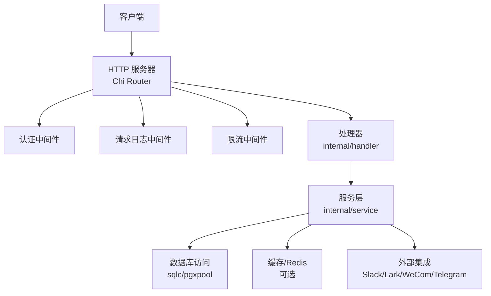
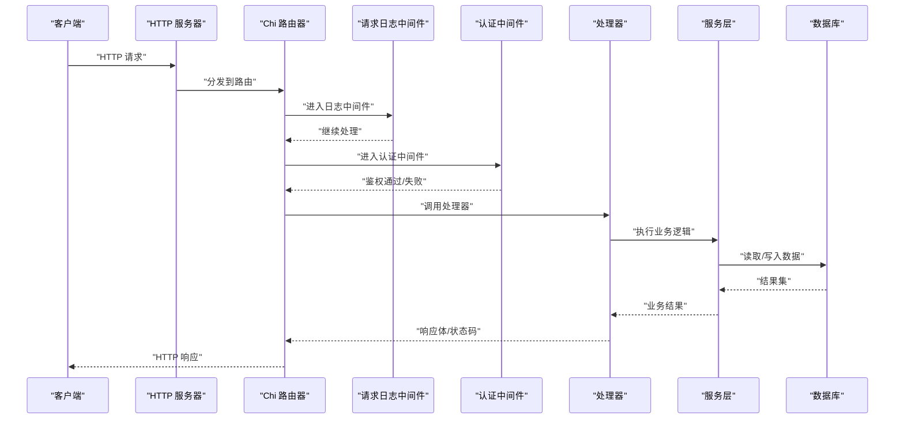
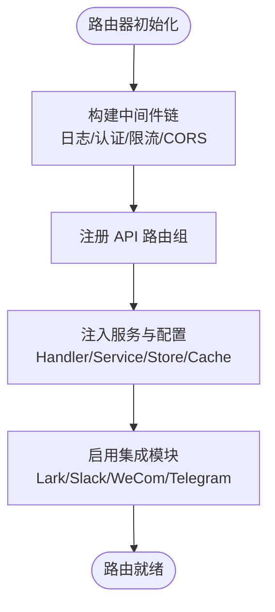
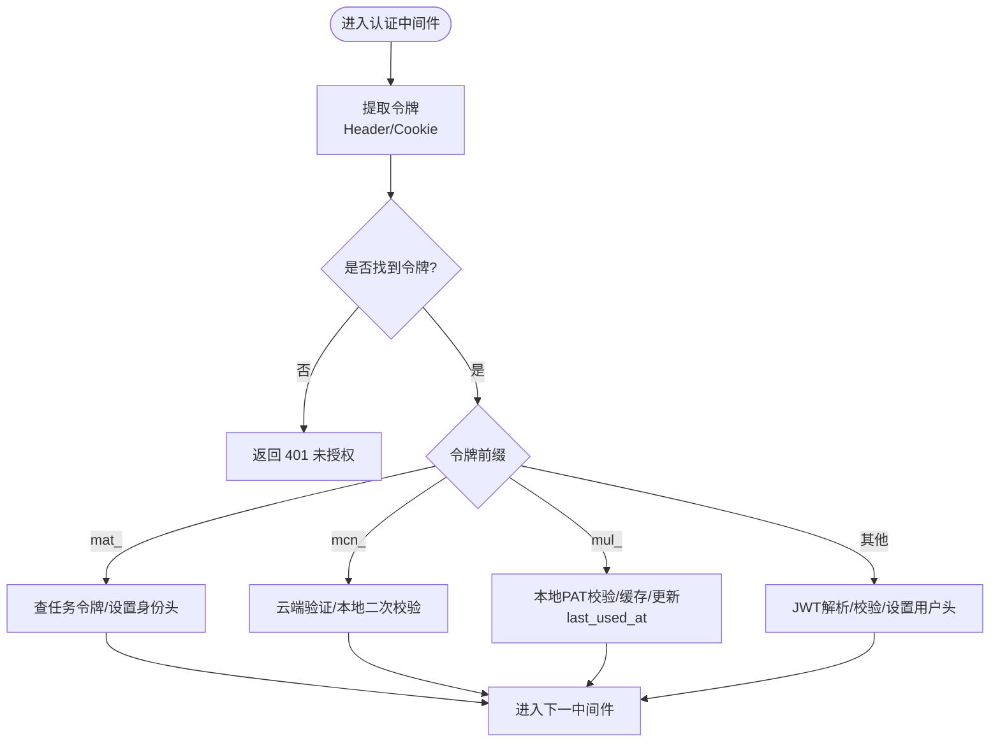
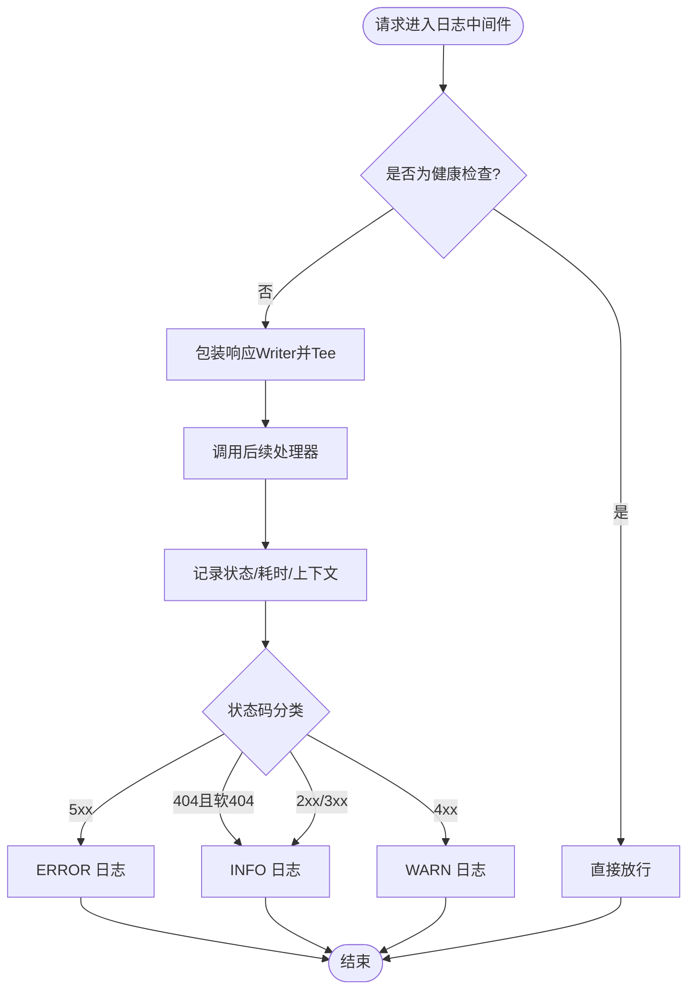
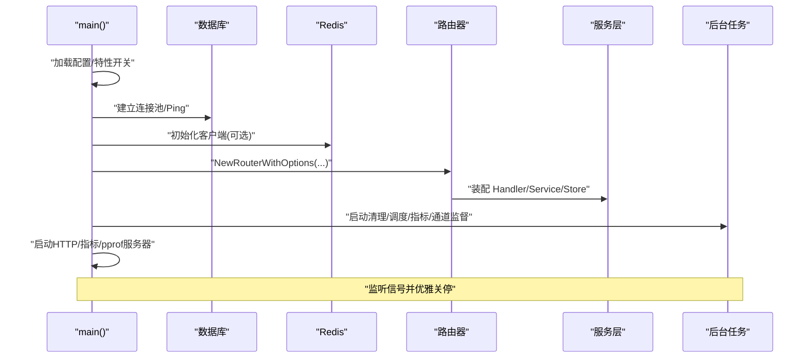
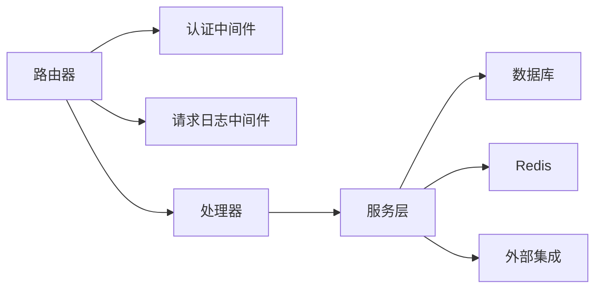

# 服务架构设计

<cite>
**本文引用的文件**
- [main.go](file://server/cmd/server/main.go)
- [router.go](file://server/cmd/server/router.go)
- [auth.go](file://server/internal/middleware/auth.go)
- [request_logger.go](file://server/internal/middleware/request_logger.go)
</cite>

## 目录
1. [简介](#简介)
2. [项目结构](#项目结构)
3. [核心组件](#核心组件)
4. [架构总览](#架构总览)
5. [详细组件分析](#详细组件分析)
6. [依赖关系分析](#依赖关系分析)
7. [性能考量](#性能考量)
8. [故障排查指南](#故障排查指南)
9. [结论](#结论)
10. [附录](#附录)

## 简介
本文件面向后端开发者，系统性阐述基于 Chi 路由器的分层架构与请求处理链路。重点包括：路由器、中间件、处理器与服务层的职责分离；从 HTTP 请求进入到底层数据访问的完整流程；认证、授权、日志、限流等横切关注点的中间件链设计；服务的启动过程、依赖注入与配置管理；以及架构图与交互时序图，帮助快速理解并扩展服务。

## 项目结构
后端采用“入口 -> 路由 -> 中间件 -> 处理器 -> 服务 -> 数据访问”的分层组织方式：
- 入口（cmd/server）：负责进程启动、配置加载、依赖装配、后台任务调度与优雅关停。
- 路由（cmd/server/router.go）：基于 Chi 构建应用级路由树，挂载 CORS、请求日志、认证、限流等中间件，并将路径分发到具体处理器。
- 中间件（internal/middleware）：实现横切关注点，如认证、CSRF、客户端元信息、请求日志、速率限制等。
- 处理器（internal/handler）：解析请求参数、调用服务层、组装响应与错误码。
- 服务（internal/service）：封装业务编排、跨域集成与领域规则。
- 数据访问（pkg/db/generated + internal/dbreader）：通过 sqlc 生成查询对象，支持主库/只读副本路由与指标记录。

图表来源
- [router.go:204-257](file://server/cmd/server/router.go#L204-L257)
- [main.go:283-290](file://server/cmd/server/main.go#L283-L290)

章节来源
- [main.go:292-350](file://server/cmd/server/main.go#L292-L350)
- [router.go:204-257](file://server/cmd/server/router.go#L204-L257)

## 核心组件
- 路由器与中间件链：在 NewRouterWithOptions 中集中装配，统一注入度量、特性开关、心跳调度、LLM 重试预算等横切能力。
- 认证中间件：支持 Bearer Token（JWT/PAT）、HttpOnly Cookie（带 CSRF 校验）、Agent Task Token、Cloud PAT，按优先级解析并设置上下文标识头。
- 请求日志：结构化输出方法、路径、状态码、耗时、用户 ID、客户端平台/版本/OS，并对敏感路径进行脱敏。
- 服务装配：Handler 聚合 Queries、Hub、Bus、存储、Email、Analytics、RateLimiters、FeatureFlags、SeatCapacity 等，供处理器调用。
- 数据访问：主库连接池 + 可选只读副本，dbreader 提供读路由与指标记录。

章节来源
- [router.go:390-509](file://server/cmd/server/router.go#L390-L509)
- [auth.go:34-267](file://server/internal/middleware/auth.go#L34-L267)
- [request_logger.go:113-179](file://server/internal/middleware/request_logger.go#L113-L179)
- [main.go:340-387](file://server/cmd/server/main.go#L340-L387)

## 架构总览
下图展示一次典型 API 请求从进入 HTTP 服务器到返回响应的完整链路，包含中间件链、处理器与服务层协作。

图表来源
- [router.go:390-509](file://server/cmd/server/router.go#L390-L509)
- [auth.go:51-267](file://server/internal/middleware/auth.go#L51-L267)
- [request_logger.go:113-179](file://server/internal/middleware/request_logger.go#L113-L179)

## 详细组件分析

### 路由器与中间件链
- 路由器构造：NewRouterWithOptions 创建 chi.Router，注入 CORS、请求日志、认证、限流等中间件，并注册各功能路由组。
- 横切能力注入：HTTP 指标、业务指标、通道租约指标、Webhook 限流、邀请限流、心跳调度器、LLM 最大重试次数等通过 RouterOptions 注入。
- 多平台集成：Lark、Slack、DingTalk、WeCom、Telegram、Composio 等按需启用，统一接入 channel engine 与事件总线。

图表来源
- [router.go:390-509](file://server/cmd/server/router.go#L390-L509)
- [router.go:511-841](file://server/cmd/server/router.go#L511-L841)
- [router.go:843-1116](file://server/cmd/server/router.go#L843-L1116)

章节来源
- [router.go:204-257](file://server/cmd/server/router.go#L204-L257)
- [router.go:390-509](file://server/cmd/server/router.go#L390-L509)

### 认证中间件
- 令牌来源优先级：Authorization Bearer > HttpOnly Cookie（需 CSRF）。
- 令牌类型与分支：
  - Agent Task Token（mat_）：服务端签发，绑定 (user_id, agent_id, task_id, workspace_id)，覆盖下游身份头，禁止人类操作端使用。
  - Cloud PAT（mcn_）：由云端 Fleet 验证，本地二次校验 owner 存在性。
  - Personal Access Token（mul_）：本地表校验，带 TTL 缓存与 last_used_at 更新。
  - JWT：HMAC 签名校验，提取 sub/email。
- 安全要点：删除不可信 X-Actor-Source；对临时禁用用户拒绝；CSRF 校验用于 Cookie 写操作。

图表来源
- [auth.go:51-267](file://server/internal/middleware/auth.go#L51-L267)

章节来源
- [auth.go:34-267](file://server/internal/middleware/auth.go#L34-L267)

### 请求日志中间件
- 结构化字段：方法、路径（对 webhook 路径脱敏）、状态码、耗时、请求 ID、用户 ID、触发器 ID、客户端平台/版本/OS。
- 404 分类：捕获响应体前缀以识别“软 404”（运行时/任务已删除），降级为 Info 级别，避免告警噪音。
- 性能保护：boundedBuffer 限制镜像响应体大小，防止大响应导致日志内存膨胀。

图表来源
- [request_logger.go:113-179](file://server/internal/middleware/request_logger.go#L113-L179)

章节来源
- [request_logger.go:113-179](file://server/internal/middleware/request_logger.go#L113-L179)

### 服务启动与依赖注入
- 配置加载：环境变量驱动（端口、数据库、Redis、CORS、LLM、特性开关等），并提供默认值与容错。
- 资源准备：数据库连接池、可选只读副本、实时 Hub、事件总线、Redis 客户端（读写分离/分片/模式选择）、特征标志服务。
- 服务装配：创建 Handler，注入 Queries、Hub、Bus、存储、Email、Analytics、限流器、特性开关、容量控制、心跳调度器等。
- 后台任务：运行时清理、自动调度、计划任务、指标/性能剖析服务器、通道入站监督、媒体对账等。
- 优雅关停：信号监听、延迟关停、等待长任务完成、关闭 Redis/数据库连接。

图表来源
- [main.go:292-350](file://server/cmd/server/main.go#L292-L350)
- [main.go:389-559](file://server/cmd/server/main.go#L389-L559)
- [main.go:628-798](file://server/cmd/server/main.go#L628-L798)

章节来源
- [main.go:292-350](file://server/cmd/server/main.go#L292-L350)
- [main.go:389-559](file://server/cmd/server/main.go#L389-L559)
- [main.go:628-798](file://server/cmd/server/main.go#L628-L798)

## 依赖关系分析
- 路由器依赖：Chi、CORS、内部中间件、处理器、服务、存储、事件总线、实时 Hub、Redis、指标、特性开关。
- 中间件依赖：认证中间件依赖 auth 包与 sqlc 生成的查询；日志中间件依赖 Chi 的 WrapResponseWriter。
- 服务依赖：处理器依赖服务层；服务层依赖数据库、缓存、外部集成（Slack/Lark/WeCom/Telegram/Composio）。
- 数据访问：主库连接池 + 可选只读副本，dbreader 提供读路由与指标记录。

图表来源
- [router.go:390-509](file://server/cmd/server/router.go#L390-L509)
- [auth.go:51-267](file://server/internal/middleware/auth.go#L51-L267)
- [request_logger.go:113-179](file://server/internal/middleware/request_logger.go#L113-L179)

章节来源
- [router.go:390-509](file://server/cmd/server/router.go#L390-L509)

## 性能考量
- 连接与超时：HTTP 服务器设置 ReadHeaderTimeout/IdleTimeout，WebSocket 升级路径不设置 WriteTimeout，避免长连接被中断。
- 缓存与限流：PAT 短期缓存减少 DB 压力；Webhook/邀请/IP 等多维度限流保护后端。
- 指标与可观测性：HTTP/业务/通道租约/WeCom/DB 路由指标，便于监控与调优。
- 后台任务隔离：清理、调度、对账等任务独立 goroutine，避免阻塞请求路径。
- 只读副本：可选 replica pool 分担读负载，配合 dbreader 记录路由指标。

[本节为通用指导，无需特定文件引用]

## 故障排查指南
- 认证失败：检查 Authorization/Cookie 是否存在与格式；确认 JWT_SECRET、PAT 有效性；查看“临时禁用用户”拦截；Cloud PAT 不可用会返回 503。
- 404 噪音：若为“软 404”（运行时/任务已删除），日志将降级为 Info；如需定位，检查响应体标记。
- 性能问题：观察指标中的慢请求、限流命中、Redis 连接池大小、DB 路由命中率；调整 LLM 重试预算与后台任务并发。
- 集成异常：Lark/Slack/WeCom/Telegram 需对应密钥与回调配置；缺失时相关端点返回 503；检查 secretbox 初始化与订阅者注册。

章节来源
- [auth.go:51-267](file://server/internal/middleware/auth.go#L51-L267)
- [request_logger.go:113-179](file://server/internal/middleware/request_logger.go#L113-L179)
- [router.go:511-841](file://server/cmd/server/router.go#L511-L841)

## 结论
本项目采用清晰的层次化架构与可插拔的中间件链，结合 Chi 路由器的简洁性与 Go 生态的成熟组件，实现了高内聚、低耦合的后端服务。通过统一的启动装配、严格的认证与日志、可扩展的服务层与数据访问策略，既满足生产环境的稳定性与可观测性需求，也为多平台集成与未来扩展提供了良好基础。

[本节为总结，无需特定文件引用]

## 附录
- 关键环境变量（示例）：PORT、DATABASE_URL、REDIS_URL、CORS_ALLOWED_ORIGINS、MULTICA_LLM_API_KEY、MULTICA_LLM_BASE_URL、MULTICA_LLM_DEFAULT_MODEL、MULTICA_LLM_MAX_RETRIES、MULTICA_PUBLIC_URL、MULTICA_APP_URL、CHANNEL_WS_LEASE_BACKEND、REALTIME_RELAY_MODE、APP_ENV、JWT_SECRET、RESEND_API_KEY、SMTP_HOST、MULTICA_DEV_VERIFICATION_CODE。
- 建议实践：
  - 生产环境务必设置强 JWT_SECRET 与合理的 LLM 重试预算。
  - 开启指标与 pprof 仅在内网暴露，严格限制访问。
  - 合理配置 Redis 分片与保留策略，确保实时消息回放与去重。
  - 使用只读副本提升读性能，并通过 dbreader 记录路由指标。
  - 对敏感路径（如 webhook）进行日志脱敏，避免凭证泄露。

[本节为补充说明，无需特定文件引用]