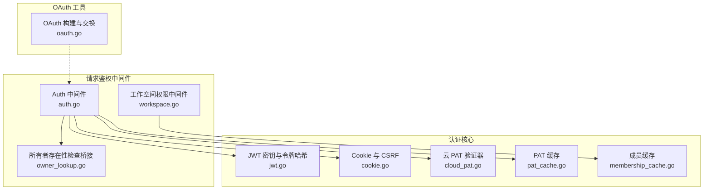
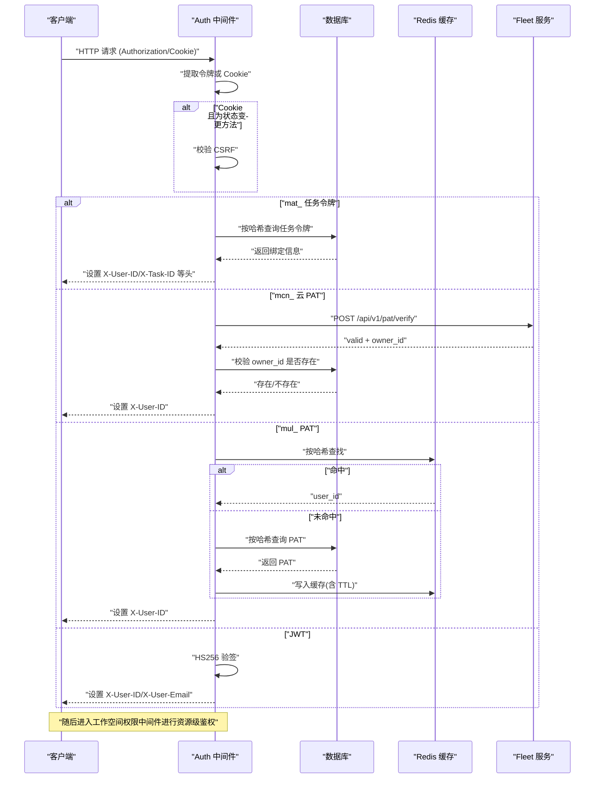
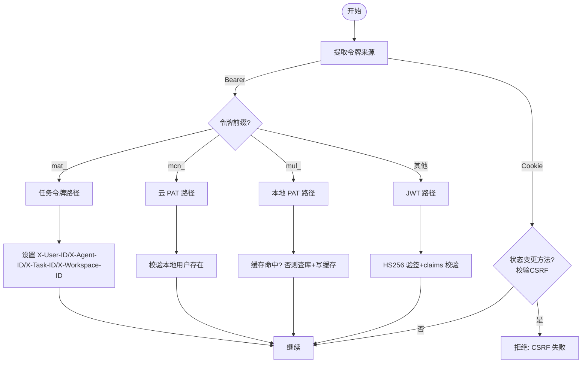
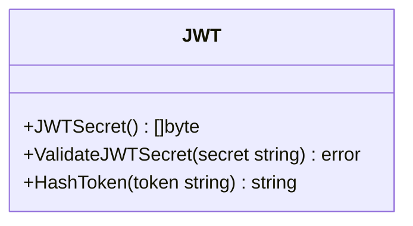
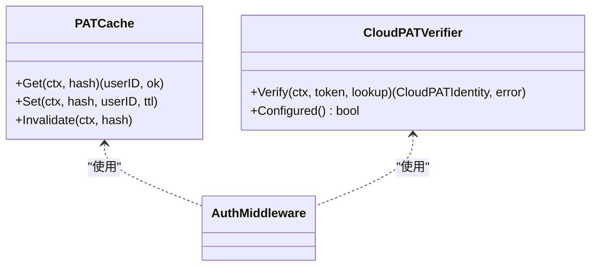
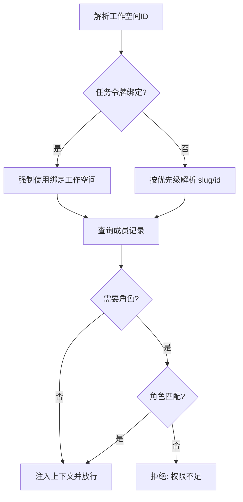
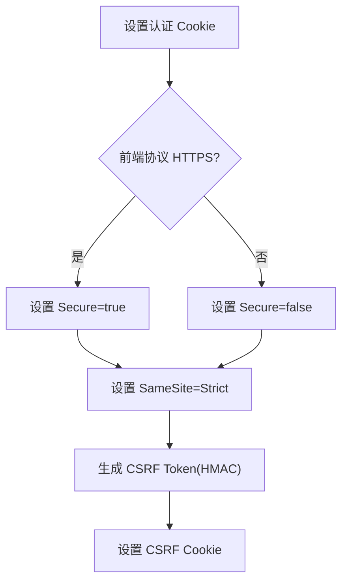
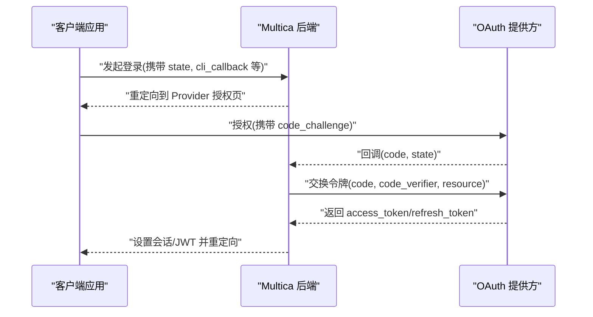
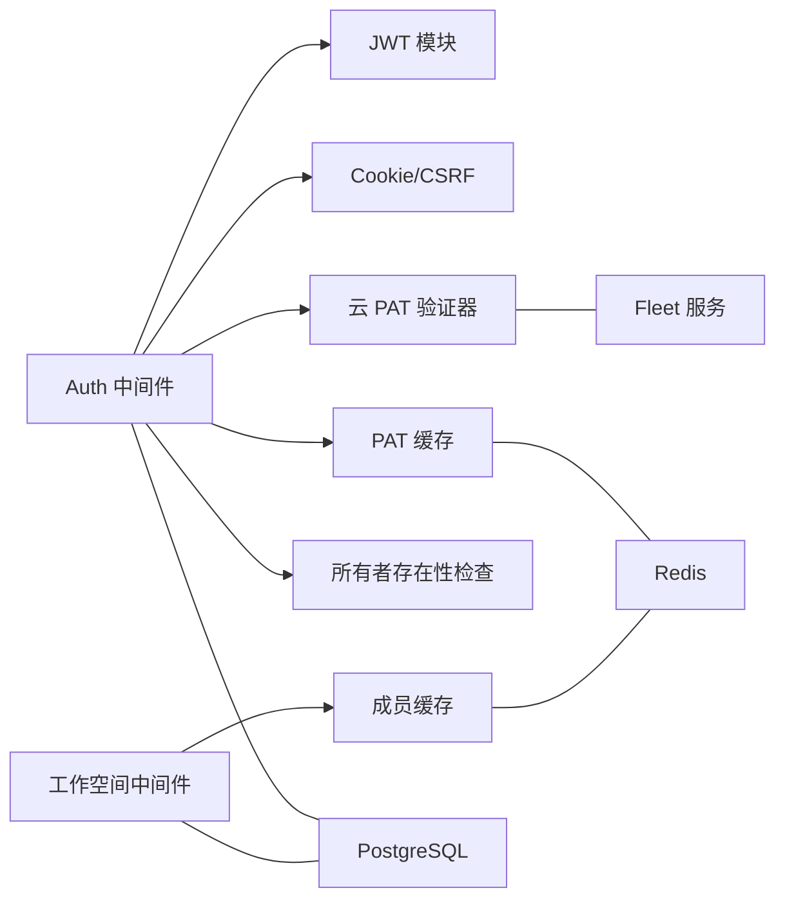

# 认证与授权系统

<cite>
**本文引用的文件**
- [jwt.go](file://server/internal/auth/jwt.go)
- [cookie.go](file://server/internal/auth/cookie.go)
- [cloud_pat.go](file://server/internal/auth/cloud_pat.go)
- [pat_cache.go](file://server/internal/auth/pat_cache.go)
- [membership_cache.go](file://server/internal/auth/membership_cache.go)
- [auth.go](file://server/internal/middleware/auth.go)
- [workspace.go](file://server/internal/middleware/workspace.go)
- [owner_lookup.go](file://server/internal/middleware/owner_lookup.go)
- [oauth.go](file://server/pkg/remotemcp/oauth.go)
</cite>

## 目录
1. [简介](#简介)
2. [项目结构](#项目结构)
3. [核心组件](#核心组件)
4. [架构总览](#架构总览)
5. [详细组件分析](#详细组件分析)
6. [依赖关系分析](#依赖关系分析)
7. [性能考虑](#性能考虑)
8. [故障排查指南](#故障排查指南)
9. [结论](#结论)
10. [附录](#附录)

## 简介
本文件系统性说明 Multica 后端的认证与授权机制，覆盖以下主题：
- 用户身份验证：JWT、个人访问令牌（PAT）、云节点 PAT（mcn_）、任务级代理令牌（mat_）
- OAuth 集成：基于 PKCE 的授权码流程（资源服务器模式）
- 权限控制模型：工作空间成员与角色校验、任务令牌的工作空间绑定
- 会话与 Cookie：安全标志、CSRF 保护、TTL 配置
- 扩展性：如何接入自定义认证提供者
- 安全最佳实践与常见问题防护

## 项目结构
认证与授权能力主要分布在 server/internal/auth（令牌生成/校验、Cookie、缓存）与 server/internal/middleware（请求级鉴权中间件），以及 server/pkg/remotemcp/oauth.go（OAuth 工具）。

图表来源
- [jwt.go:21-58](file://server/internal/auth/jwt.go#L21-L58)
- [cookie.go:148-185](file://server/internal/auth/cookie.go#L148-L185)
- [cloud_pat.go:222-294](file://server/internal/auth/cloud_pat.go#L222-L294)
- [pat_cache.go:45-73](file://server/internal/auth/pat_cache.go#L45-L73)
- [membership_cache.go:52-76](file://server/internal/auth/membership_cache.go#L52-L76)
- [auth.go:51-267](file://server/internal/middleware/auth.go#L51-L267)
- [workspace.go:158-266](file://server/internal/middleware/workspace.go#L158-L266)
- [owner_lookup.go:13-59](file://server/internal/middleware/owner_lookup.go#L13-L59)
- [oauth.go:290-331](file://server/pkg/remotemcp/oauth.go#L290-L331)

章节来源
- [auth.go:51-267](file://server/internal/middleware/auth.go#L51-L267)
- [workspace.go:158-266](file://server/internal/middleware/workspace.go#L158-L266)
- [jwt.go:21-58](file://server/internal/auth/jwt.go#L21-L58)
- [cookie.go:148-185](file://server/internal/auth/cookie.go#L148-L185)
- [cloud_pat.go:222-294](file://server/internal/auth/cloud_pat.go#L222-L294)
- [pat_cache.go:45-73](file://server/internal/auth/pat_cache.go#L45-L73)
- [membership_cache.go:52-76](file://server/internal/auth/membership_cache.go#L52-L76)
- [owner_lookup.go:13-59](file://server/internal/middleware/owner_lookup.go#L13-L59)
- [oauth.go:290-331](file://server/pkg/remotemcp/oauth.go#L290-L331)

## 核心组件
- JWT 管理：从环境变量加载 HS256 密钥，提供默认值与安全校验；支持生成各类短生命周期令牌（PAT、daemon、agent task）。
- Cookie 与会话：设置 HttpOnly 认证 Cookie、CSRF Cookie，自动根据前端协议决定 Secure 标志，支持可配置的 TTL。
- PAT 与云 PAT：本地 mul_ PAT 通过 Redis 缓存加速；mcn_ 云 PAT 调用 Fleet 服务校验并缓存结果。
- 工作空间权限：解析目标工作空间，校验成员与角色，注入上下文供后续处理器使用。
- OAuth：提供基于 PKCE 的授权码流程工具方法，用于资源服务器场景。

章节来源
- [jwt.go:21-58](file://server/internal/auth/jwt.go#L21-L58)
- [cookie.go:70-89](file://server/internal/auth/cookie.go#L70-L89)
- [cookie.go:148-185](file://server/internal/auth/cookie.go#L148-L185)
- [pat_cache.go:12-19](file://server/internal/auth/pat_cache.go#L12-L19)
- [cloud_pat.go:222-294](file://server/internal/auth/cloud_pat.go#L222-L294)
- [workspace.go:158-266](file://server/internal/middleware/workspace.go#L158-L266)
- [oauth.go:290-331](file://server/pkg/remotemcp/oauth.go#L290-L331)

## 架构总览
下图展示一次带 Cookie 登录后的受保护 API 请求在中间件链中的处理路径，包括多种令牌类型的识别与鉴权分支。

图表来源
- [auth.go:51-267](file://server/internal/middleware/auth.go#L51-L267)
- [cloud_pat.go:222-294](file://server/internal/auth/cloud_pat.go#L222-L294)
- [pat_cache.go:45-73](file://server/internal/auth/pat_cache.go#L45-L73)
- [owner_lookup.go:13-59](file://server/internal/middleware/owner_lookup.go#L13-L59)

## 详细组件分析

### 令牌类型与优先级
- 令牌来源优先级：Authorization: Bearer > multica_auth Cookie
- 令牌类型识别顺序：
  - mat_：任务级代理令牌，强绑定 (user_id, agent_id, task_id, workspace_id)，不可被客户端伪造或篡改
  - mcn_：云节点 PAT，由 Fleet 服务权威校验，再校验本地用户存在性
  - mul_：本地 PAT，优先查 Redis 缓存，未命中则查库并写缓存
  - JWT：HS256 签名，读取 sub/email 放入请求头

图表来源
- [auth.go:51-267](file://server/internal/middleware/auth.go#L51-L267)
- [cookie.go:217-255](file://server/internal/auth/cookie.go#L217-L255)

章节来源
- [auth.go:51-267](file://server/internal/middleware/auth.go#L51-L267)

### JWT 令牌管理
- 密钥来源：环境变量 JWT_SECRET，若为空则回退到内置默认值；生产环境必须替换为强随机值
- 安全校验：提供对已知弱密钥的检测函数，启动时可拒绝不安全部署
- 令牌哈希：统一使用 SHA-256 哈希作为缓存键，避免明文存储

图表来源
- [jwt.go:21-58](file://server/internal/auth/jwt.go#L21-L58)
- [jwt.go:91-96](file://server/internal/auth/jwt.go#L91-L96)

章节来源
- [jwt.go:21-58](file://server/internal/auth/jwt.go#L21-L58)
- [jwt.go:91-96](file://server/internal/auth/jwt.go#L91-L96)

### 个人访问令牌（PAT）与缓存
- 本地 PAT（mul_）：
  - 首次访问查库，命中后将 user_id 写入 Redis，TTL 不超过令牌剩余有效期
  - 后续请求在 TTL 内直接命中缓存，减少 DB 压力
  - 撤销时主动失效缓存项，确保即时生效
- 云 PAT（mcn_）：
  - 调用 Fleet 服务 /api/v1/pat/verify，成功后缓存至 Redis，TTL 固定较短（约 60s）以限制撤销延迟
  - 二次校验 owner_id 是否对应本地用户，缺失视为无效

图表来源
- [pat_cache.go:45-109](file://server/internal/auth/pat_cache.go#L45-L109)
- [cloud_pat.go:222-294](file://server/internal/auth/cloud_pat.go#L222-L294)
- [auth.go:177-227](file://server/internal/middleware/auth.go#L177-L227)

章节来源
- [pat_cache.go:45-109](file://server/internal/auth/pat_cache.go#L45-L109)
- [cloud_pat.go:222-294](file://server/internal/auth/cloud_pat.go#L222-L294)
- [auth.go:177-227](file://server/internal/middleware/auth.go#L177-L227)

### 工作空间级访问控制与资源级权限
- 工作空间解析优先级：任务令牌绑定 > 中间件上下文 > X-Workspace-Slug/查询参数 > X-Workspace-ID/查询参数
- 成员与角色校验：
  - RequireWorkspaceMember：校验用户是否为该工作空间成员
  - RequireWorkspaceRole：额外校验角色是否在允许集合中
- 任务令牌强制绑定：即使 URL 参数指定了工作空间，任务令牌也必须在其绑定的工作空间内操作

图表来源
- [workspace.go:68-150](file://server/internal/middleware/workspace.go#L68-L150)
- [workspace.go:158-266](file://server/internal/middleware/workspace.go#L158-L266)

章节来源
- [workspace.go:68-150](file://server/internal/middleware/workspace.go#L68-L150)
- [workspace.go:158-266](file://server/internal/middleware/workspace.go#L158-L266)

### 会话管理与 Cookie 安全
- 认证 Cookie：HttpOnly、SameSite=Strict、Secure（依据前端协议动态判断）
- CSRF 保护：CSRF Cookie 与认证 Cookie 通过 HMAC 绑定，仅对非安全方法校验
- TTL 配置：AUTH_TOKEN_TTL 支持 Go duration 字符串或秒数，默认 30 天；COOKIE_DOMAIN 支持子域共享但禁止 IP 字面量

图表来源
- [cookie.go:148-185](file://server/internal/auth/cookie.go#L148-L185)
- [cookie.go:217-255](file://server/internal/auth/cookie.go#L217-L255)
- [cookie.go:70-89](file://server/internal/auth/cookie.go#L70-L89)

章节来源
- [cookie.go:70-89](file://server/internal/auth/cookie.go#L70-L89)
- [cookie.go:148-185](file://server/internal/auth/cookie.go#L148-L185)
- [cookie.go:217-255](file://server/internal/auth/cookie.go#L217-L255)

### OAuth 集成（PKCE 授权码）
- 构建授权 URL：包含 response_type=code、client_id、redirect_uri、state、code_challenge(S256)、resource、scope
- 交换令牌：使用 authorization_code 流程，携带 code_verifier、resource
- 刷新令牌：使用 refresh_token 流程，携带 client_id、resource

图表来源
- [oauth.go:290-331](file://server/pkg/remotemcp/oauth.go#L290-L331)

章节来源
- [oauth.go:290-331](file://server/pkg/remotemcp/oauth.go#L290-L331)

### 自定义认证提供者扩展指南
- 扩展点建议：
  - 在 Auth 中间件中新增令牌前缀分支，复用 HashToken 与缓存策略
  - 对于外部服务校验的令牌，参考 CloudPATVerifier 实现：网络超时、响应体大小限制、错误分类（无效/不可用/未配置）
  - 将解析出的主体信息写入 X-User-ID 等请求头，保持下游一致性
- 安全要点：
  - 严格校验令牌格式与签名
  - 对外部服务的调用需具备超时与限流保护
  - 对负向结果（无效/不可用）区分处理，避免误判导致雪崩

章节来源
- [auth.go:51-267](file://server/internal/middleware/auth.go#L51-L267)
- [cloud_pat.go:222-294](file://server/internal/auth/cloud_pat.go#L222-L294)

## 依赖关系分析
- 中间件依赖：
  - Auth 中间件依赖 JWT、Cookie、PAT 缓存、云 PAT 验证器、所有者存在性检查
  - 工作空间中间件依赖成员缓存与数据库查询
- 外部依赖：
  - Redis：PAT 缓存、成员缓存、云 PAT 缓存
  - PostgreSQL：PAT、任务令牌、成员、用户表
  - 外部服务：Fleet（云 PAT 校验）、OAuth 提供方

图表来源
- [auth.go:51-267](file://server/internal/middleware/auth.go#L51-L267)
- [workspace.go:158-266](file://server/internal/middleware/workspace.go#L158-L266)
- [pat_cache.go:45-73](file://server/internal/auth/pat_cache.go#L45-L73)
- [membership_cache.go:52-76](file://server/internal/auth/membership_cache.go#L52-L76)
- [cloud_pat.go:222-294](file://server/internal/auth/cloud_pat.go#L222-L294)
- [owner_lookup.go:13-59](file://server/internal/middleware/owner_lookup.go#L13-L59)

章节来源
- [auth.go:51-267](file://server/internal/middleware/auth.go#L51-L267)
- [workspace.go:158-266](file://server/internal/middleware/workspace.go#L158-L266)
- [pat_cache.go:45-73](file://server/internal/auth/pat_cache.go#L45-L73)
- [membership_cache.go:52-76](file://server/internal/auth/membership_cache.go#L52-L76)
- [cloud_pat.go:222-294](file://server/internal/auth/cloud_pat.go#L222-L294)
- [owner_lookup.go:13-59](file://server/internal/middleware/owner_lookup.go#L13-L59)

## 性能考虑
- 缓存策略：
  - PAT 缓存 TTL 不超过令牌剩余有效期，避免过期令牌仍通过缓存
  - 云 PAT 缓存 TTL 较短（约 60s），平衡撤销延迟与上游压力
  - 成员缓存 TTL 较短（约 5min），降低删除成员后的访问窗口
- 数据库访问：
  - 缓存命中跳过 last_used_at 更新，减少写放大
  - 任务令牌路径直接设置工作空间绑定，避免重复解析
- 网络调用：
  - 云 PAT 校验设置合理超时与响应体大小限制，防止慢请求与恶意大响应

章节来源
- [pat_cache.go:75-97](file://server/internal/auth/pat_cache.go#L75-L97)
- [cloud_pat.go:32-71](file://server/internal/auth/cloud_pat.go#L32-L71)
- [membership_cache.go:14-19](file://server/internal/auth/membership_cache.go#L14-L19)
- [auth.go:177-227](file://server/internal/middleware/auth.go#L177-L227)

## 故障排查指南
- 常见错误与定位：
  - 缺少授权：检查 Authorization 头或 Cookie 是否正确传递
  - CSRF 失败：确认状态变更请求携带正确的 X-CSRF-Token
  - 令牌无效：检查令牌前缀与签名，确认 PAT 未过期或被撤销
  - 云 PAT 不可用：检查 Fleet 可达性与响应，关注 503 重试逻辑
  - 工作空间未找到：确认请求中包含有效的 workspace_slug 或 workspace_id
- 日志关键字：
  - auth: invalid token / missing authorization
  - cloud_pat: verify request failed / returned non-200
  - pat_cache: get/set failed; falling back to DB
  - membership_cache: get/set failed; falling back to DB

章节来源
- [auth.go:51-267](file://server/internal/middleware/auth.go#L51-L267)
- [cloud_pat.go:317-399](file://server/internal/auth/cloud_pat.go#L317-L399)
- [pat_cache.go:45-73](file://server/internal/auth/pat_cache.go#L45-L73)
- [membership_cache.go:52-76](file://server/internal/auth/membership_cache.go#L52-L76)

## 结论
本系统通过多令牌类型与中间件组合实现了灵活而安全的认证与授权体系：
- 支持 JWT、PAT、云 PAT、任务令牌等多种身份载体
- 通过缓存与分层校验兼顾性能与安全
- 工作空间级权限与资源级角色控制满足团队协作需求
- Cookie 与 CSRF 机制保障浏览器端会话安全
- 提供可扩展的认证提供者接入点与清晰的错误分类

## 附录
- 安全最佳实践
  - 生产环境务必替换 JWT_SECRET，避免使用默认或模板值
  - 启用 Secure Cookie（HTTPS 前端）与 Strict SameSite
  - 对云 PAT 校验设置超时与响应体大小限制
  - 定期轮换 PAT 并立即失效缓存项
- API 使用示例（概念性）
  - 登录：前端跳转至 OAuth 授权页，回调后设置会话 Cookie 或返回 JWT
  - 调用 API：在 Authorization 头携带 Bearer <token>，或在 Cookie 中携带认证令牌
  - 工作空间操作：在请求头或查询参数中指定 workspace_slug/workspace_id，并通过 RequireWorkspaceMember/RequireWorkspaceRole 校验权限