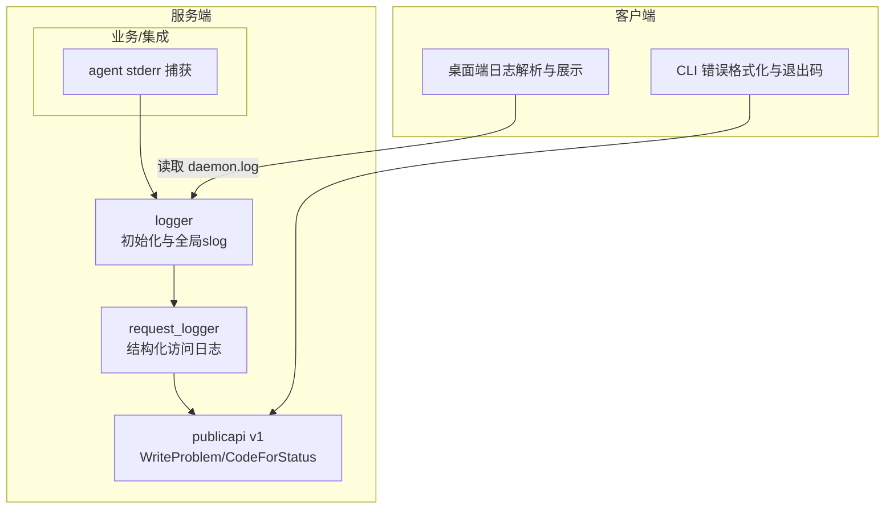
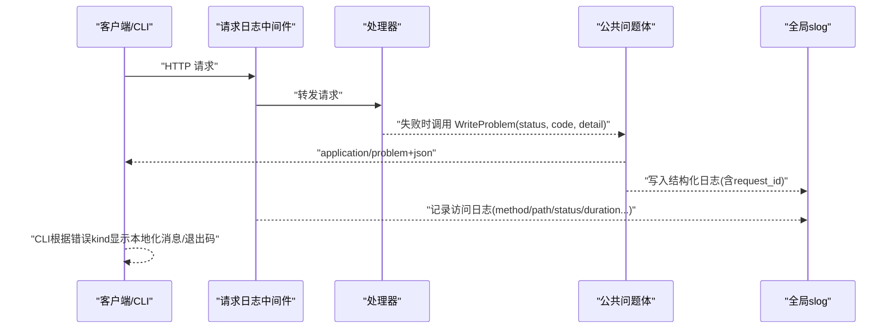
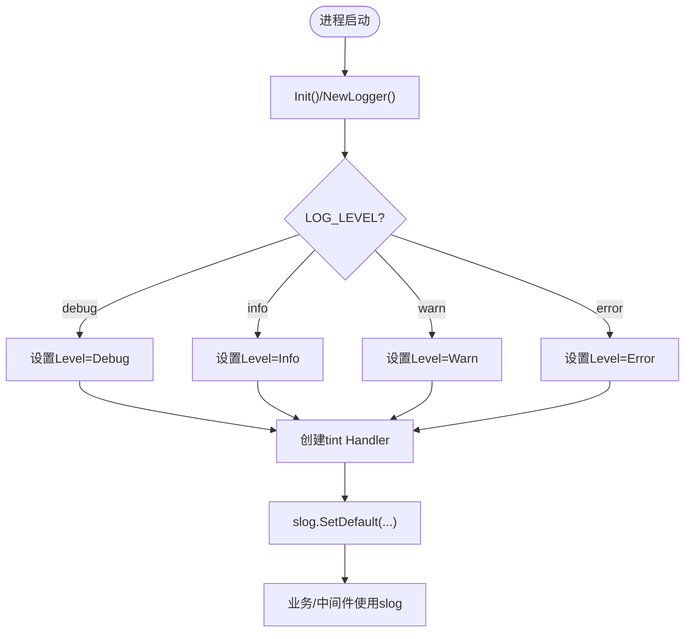
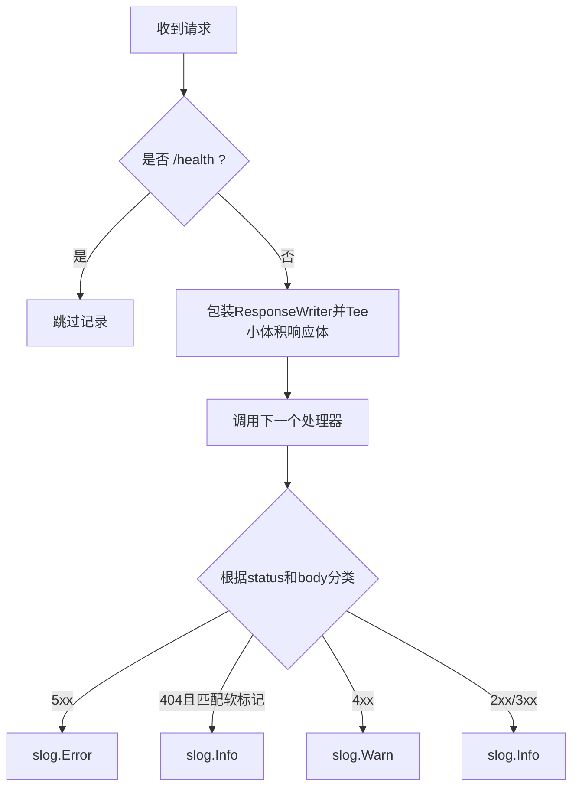
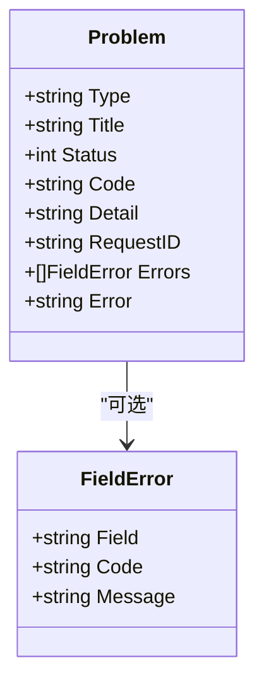
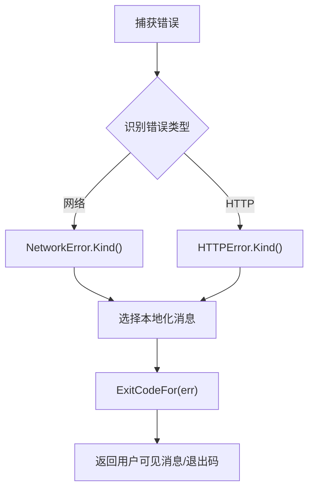
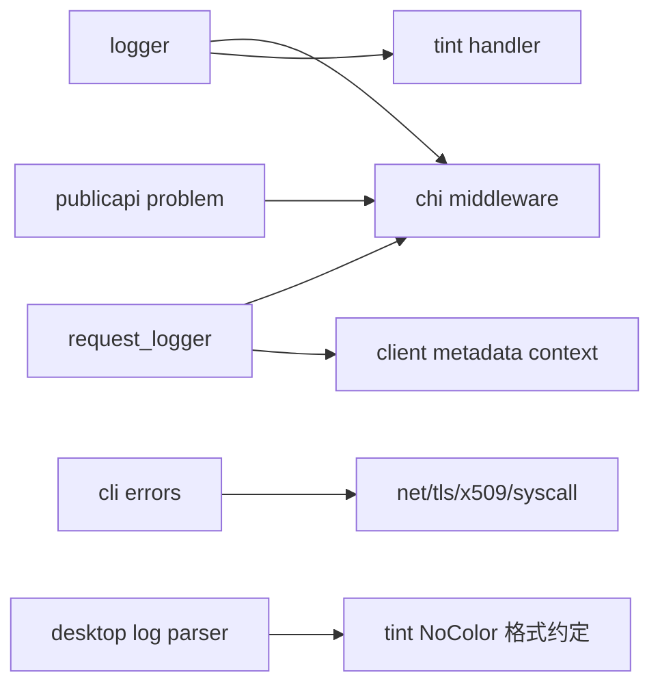

# 错误处理与日志系统

<cite>
**本文引用的文件**
- [server/internal/logger/logger.go](file://server/internal/logger/logger.go)
- [server/internal/middleware/request_logger.go](file://server/internal/middleware/request_logger.go)
- [server/pkg/publicapi/v1/problem.go](file://server/pkg/publicapi/v1/problem.go)
- [server/internal/cli/errors.go](file://server/internal/cli/errors.go)
- [CLI_AND_DAEMON.md](file://CLI_AND_DAEMON.md)
- [apps/desktop/src/renderer/src/components/parse-daemon-log.ts](file://apps/desktop/src/renderer/src/components/parse-daemon-log.ts)
- [apps/desktop/src/main/daemon-manager.ts](file://apps/desktop/src/main/daemon-manager.ts)
- [server/pkg/agent/claude.go](file://server/pkg/agent/claude.go)
</cite>

## 目录
1. [简介](#简介)
2. [项目结构](#项目结构)
3. [核心组件](#核心组件)
4. [架构总览](#架构总览)
5. [详细组件分析](#详细组件分析)
6. [依赖关系分析](#依赖关系分析)
7. [性能考虑](#性能考虑)
8. [故障排查指南](#故障排查指南)
9. [结论](#结论)
10. [附录：示例代码路径](#附录示例代码路径)

## 简介
本文件系统化阐述 Multica 后端的统一错误处理策略与结构化日志体系，覆盖错误分类、错误码定义、错误响应格式、日志级别与字段规范、日志轮转与采集、异常捕获与恢复机制，以及最佳实践、日志分析方法与故障排查流程。文档同时提供自定义错误类型与日志中间件的参考实现路径，帮助开发者在业务中保持一致的错误与可观测性体验。

## 项目结构
后端基于 Go（Chi 路由），使用 slog + tint 输出结构化日志；HTTP 层通过中间件记录请求并统一写入问题体；CLI 侧对网络与 HTTP 错误进行用户友好的本地化提示与分级退出码；桌面端负责解析与展示守护进程日志。

**图表来源**
- [server/internal/logger/logger.go:27-79](file://server/internal/logger/logger.go#L27-L79)
- [server/internal/middleware/request_logger.go:113-179](file://server/internal/middleware/request_logger.go#L113-L179)
- [server/pkg/publicapi/v1/problem.go:36-111](file://server/pkg/publicapi/v1/problem.go#L36-L111)
- [server/pkg/agent/claude.go:1239-1255](file://server/pkg/agent/claude.go#L1239-L1255)
- [apps/desktop/src/renderer/src/components/parse-daemon-log.ts:1-59](file://apps/desktop/src/renderer/src/components/parse-daemon-log.ts#L1-L59)

**章节来源**
- [server/internal/logger/logger.go:27-79](file://server/internal/logger/logger.go#L27-L79)
- [server/internal/middleware/request_logger.go:113-179](file://server/internal/middleware/request_logger.go#L113-L179)
- [server/pkg/publicapi/v1/problem.go:36-111](file://server/pkg/publicapi/v1/problem.go#L36-L111)

## 核心组件
- 结构化日志初始化与组件化日志器：支持按环境变量设置日志级别，自动检测终端以决定是否着色，并为独立进程提供带组件前缀的日志器。
- 请求级结构化访问日志：统一记录方法、路径、状态码、耗时、请求ID、用户ID、客户端元数据等，并对敏感路径进行脱敏。
- 统一问题体（RFC 9457 风格）：稳定错误码映射、包含 request_id、兼容旧字段 error，便于前后端一致消费。
- CLI 错误分类与用户消息：将网络/HTTP 错误归类为稳定 kind，输出本地化友好消息，并提供分级退出码供脚本分支。
- 桌面端日志解析与滚动跟踪：解析守护进程日志行，支持过滤、搜索，并在文件轮转时自动重置位置。

**章节来源**
- [server/internal/logger/logger.go:27-79](file://server/internal/logger/logger.go#L27-L79)
- [server/internal/middleware/request_logger.go:113-179](file://server/internal/middleware/request_logger.go#L113-L179)
- [server/pkg/publicapi/v1/problem.go:36-111](file://server/pkg/publicapi/v1/problem.go#L36-L111)
- [server/internal/cli/errors.go:18-65](file://server/internal/cli/errors.go#L18-L65)
- [apps/desktop/src/renderer/src/components/parse-daemon-log.ts:1-59](file://apps/desktop/src/renderer/src/components/parse-daemon-log.ts#L1-L59)

## 架构总览
下图展示了从请求进入、中间件记录、处理器返回到统一问题体的完整链路，以及 CLI 如何消费错误并给出用户提示。

**图表来源**
- [server/internal/middleware/request_logger.go:113-179](file://server/internal/middleware/request_logger.go#L113-L179)
- [server/pkg/publicapi/v1/problem.go:77-111](file://server/pkg/publicapi/v1/problem.go#L77-L111)
- [server/internal/logger/logger.go:27-79](file://server/internal/logger/logger.go#L27-L79)
- [server/internal/cli/errors.go:443-510](file://server/internal/cli/errors.go#L443-L510)

## 详细组件分析

### 结构化日志系统（slog + tint）
- 日志级别：通过 LOG_LEVEL 控制（debug/info/warn/error），默认 debug。
- 输出目标：默认 stderr；独立进程可通过 NewWriterLoggerDefault 将日志定向到文件（如 daemon.log），并强制关闭颜色输出。
- 组件维度：NewLogger(component) 为每个组件添加 component 字段，便于聚合检索。
- 请求上下文属性：RequestAttrs 提取 request_id、user_id、client_platform/version/os，使 handler 日志与访问日志具备相同可观测维度。

**图表来源**
- [server/internal/logger/logger.go:27-79](file://server/internal/logger/logger.go#L27-L79)

**章节来源**
- [server/internal/logger/logger.go:27-79](file://server/internal/logger/logger.go#L27-L79)

### 请求级结构化访问日志中间件
- 功能：记录 method、path、status、duration、request_id、user_id、webhook_trigger_id、client_* 等字段。
- 安全：对 webhook 入口路径中的令牌段进行脱敏，避免泄露凭证。
- 语义化告警：对“软 404”（运行时/任务已删除）降级为 Info，避免误报；其他 4xx 记 Warn，5xx 记 Error。
- 内存保护：仅截取少量响应体用于分类，防止大响应体撑爆日志缓冲。

**图表来源**
- [server/internal/middleware/request_logger.go:113-179](file://server/internal/middleware/request_logger.go#L113-L179)

**章节来源**
- [server/internal/middleware/request_logger.go:113-179](file://server/internal/middleware/request_logger.go#L113-L179)

### 统一错误响应（RFC 9457 风格）
- 稳定错误码：CodeForStatus 将 HTTP 状态码映射为稳定字符串码（如 invalid_request、unauthorized、rate_limited 等）。
- 问题体结构：包含 type、title、status、code、detail、request_id、errors（可选）、error（兼容旧字段）。
- 写入方式：WriteProblem 统一设置 Content-Type、RequestID 头并编码 JSON；提供 NotFound、MethodNotAllowed 快捷函数。

**图表来源**
- [server/pkg/publicapi/v1/problem.go:14-34](file://server/pkg/publicapi/v1/problem.go#L14-L34)

**章节来源**
- [server/pkg/publicapi/v1/problem.go:36-111](file://server/pkg/publicapi/v1/problem.go#L36-L111)

### CLI 错误分类与用户消息
- 错误分类：将网络层（超时、DNS、拒绝、TLS、离线、停滞）与 HTTP 层（认证、禁止、未找到、冲突、校验、限流、服务器错误）归为稳定 kind。
- 用户消息：根据语言环境（EN/ZH）输出友好提示；对特定 kind 优先展示服务端提供的可操作消息。
- 退出码：提供分级退出码（网络/认证/未找到/校验/通用），便于脚本分支。
- 调试模式：MULTICA_DEBUG 开启时输出完整错误链与结构化细节。

**图表来源**
- [server/internal/cli/errors.go:18-65](file://server/internal/cli/errors.go#L18-L65)
- [server/internal/cli/errors.go:169-190](file://server/internal/cli/errors.go#L169-L190)
- [server/internal/cli/errors.go:601-629](file://server/internal/cli/errors.go#L601-L629)

**章节来源**
- [server/internal/cli/errors.go:18-65](file://server/internal/cli/errors.go#L18-L65)
- [server/internal/cli/errors.go:169-190](file://server/internal/cli/errors.go#L169-L190)
- [server/internal/cli/errors.go:443-510](file://server/internal/cli/errors.go#L443-L510)
- [server/internal/cli/errors.go:601-629](file://server/internal/cli/errors.go#L601-L629)
- [CLI_AND_DAEMON.md:959-1000](file://CLI_AND_DAEMON.md#L959-L1000)

### 守护进程 stderr 捕获与日志落盘
- 将 agent 子进程的 stderr 重定向到 slog.Logger，统一纳入结构化日志流。
- 独立进程（如 daemon）通过 WriterLoggerDefault 将日志写入文件，并禁用颜色，保证日志文件整洁。

**章节来源**
- [server/pkg/agent/claude.go:1239-1255](file://server/pkg/agent/claude.go#L1239-L1255)
- [server/internal/logger/logger.go:62-79](file://server/internal/logger/logger.go#L62-L79)

### 桌面端日志解析与轮转跟踪
- 解析规则：适配 tint 的 NoColor 输出格式，提取时间戳、级别、消息与键值字段；无法解析的行回退为原始文本。
- 滚动跟踪：监听日志文件大小变化，遇到截断/轮转时重置读取位置，持续推送新行至 UI。

**章节来源**
- [apps/desktop/src/renderer/src/components/parse-daemon-log.ts:1-59](file://apps/desktop/src/renderer/src/components/parse-daemon-log.ts#L1-L59)
- [apps/desktop/src/main/daemon-manager.ts:1296-1339](file://apps/desktop/src/main/daemon-manager.ts#L1296-L1339)

## 依赖关系分析
- logger 依赖 Chi 中间件获取 request_id，依赖 tint 输出结构化日志。
- request_logger 依赖 Chi 的 WrapResponseWriter 与 RequestID 工具，依赖 client metadata 上下文。
- publicapi problem 依赖 Chi 的 RequestIDHeader 与 UUID 生成。
- CLI errors 依赖标准库 net/http/net/tls/x509/syscall 进行错误分类。
- 桌面端 parse-daemon-log 依赖守护进程日志格式约定（由 logger 与 tint 决定）。

**图表来源**
- [server/internal/logger/logger.go:27-79](file://server/internal/logger/logger.go#L27-L79)
- [server/internal/middleware/request_logger.go:113-179](file://server/internal/middleware/request_logger.go#L113-L179)
- [server/pkg/publicapi/v1/problem.go:36-111](file://server/pkg/publicapi/v1/problem.go#L36-L111)
- [server/internal/cli/errors.go:192-260](file://server/internal/cli/errors.go#L192-L260)
- [apps/desktop/src/renderer/src/components/parse-daemon-log.ts:1-59](file://apps/desktop/src/renderer/src/components/parse-daemon-log.ts#L1-L59)

**章节来源**
- [server/internal/logger/logger.go:27-79](file://server/internal/logger/logger.go#L27-L79)
- [server/internal/middleware/request_logger.go:113-179](file://server/internal/middleware/request_logger.go#L113-L179)
- [server/pkg/publicapi/v1/problem.go:36-111](file://server/pkg/publicapi/v1/problem.go#L36-L111)
- [server/internal/cli/errors.go:192-260](file://server/internal/cli/errors.go#L192-L260)
- [apps/desktop/src/renderer/src/components/parse-daemon-log.ts:1-59](file://apps/desktop/src/renderer/src/components/parse-daemon-log.ts#L1-L59)

## 性能考虑
- 访问日志仅缓存有限响应体（约 256 字节）进行分类，避免大响应体导致内存膨胀。
- 结构化日志使用 slog 高效追加，tint 在终端启用颜色、在文件中禁用颜色，减少不必要的渲染开销。
- 桌面端采用增量读取与大小比较，遇到轮转重置位置，避免重复读取与全量扫描。

[本节为通用指导，不直接分析具体文件]

## 故障排查指南
- 定位请求：通过 WriteProblem 返回的 request_id 与访问日志中的 request_id 关联一次请求的全链路日志。
- 区分正常与异常 404：中间件对“软 404”降级为 Info，若仍出现大量 Warn/ERROR 需检查业务逻辑或上游状态。
- 网络类错误：CLI 会将网络错误归类为稳定 kind，结合 MULTICA_DEBUG 查看原始错误链，快速判断 DNS/TLS/超时/连接拒绝等问题。
- 权限与配额：HTTP 401/403/429 对应 auth/forbidden/rate_limited，检查鉴权配置与限流策略；402/余额不足等属于配额限制。
- 日志轮转：桌面端会在日志文件被截断时重置读取位置；若发现日志缺失，检查轮转策略与磁盘空间。

**章节来源**
- [server/pkg/publicapi/v1/problem.go:65-103](file://server/pkg/publicapi/v1/problem.go#L65-L103)
- [server/internal/middleware/request_logger.go:164-177](file://server/internal/middleware/request_logger.go#L164-L177)
- [server/internal/cli/errors.go:443-510](file://server/internal/cli/errors.go#L443-L510)
- [apps/desktop/src/main/daemon-manager.ts:1296-1339](file://apps/desktop/src/main/daemon-manager.ts#L1296-L1339)

## 结论
Multica 在后端实现了统一的错误响应与结构化日志体系：通过中间件记录访问日志、通过公共问题体统一错误契约、通过 CLI 提供稳定的错误分类与本地化提示、通过桌面端解析与跟踪守护进程日志。该体系兼顾了可观测性、安全性与用户体验，适合在生产环境中规模化使用。建议所有新增接口遵循 RFC 9457 风格的问题体，使用中间件记录访问日志，并通过 CLI 的错误分类思路在客户端统一呈现错误信息。

## 附录：示例代码路径
- 自定义错误类型（CLI）：[server/internal/cli/errors.go:117-167](file://server/internal/cli/errors.go#L117-L167)
- 统一问题体（服务端）：[server/pkg/publicapi/v1/problem.go:77-111](file://server/pkg/publicapi/v1/problem.go#L77-L111)
- 请求日志中间件（服务端）：[server/internal/middleware/request_logger.go:113-179](file://server/internal/middleware/request_logger.go#L113-L179)
- 结构化日志初始化（服务端）：[server/internal/logger/logger.go:27-79](file://server/internal/logger/logger.go#L27-L79)
- 守护进程 stderr 捕获（服务端）：[server/pkg/agent/claude.go:1239-1255](file://server/pkg/agent/claude.go#L1239-L1255)
- 桌面端日志解析与轮转跟踪（前端）：[apps/desktop/src/renderer/src/components/parse-daemon-log.ts:1-59](file://apps/desktop/src/renderer/src/components/parse-daemon-log.ts#L1-L59), [apps/desktop/src/main/daemon-manager.ts:1296-1339](file://apps/desktop/src/main/daemon-manager.ts#L1296-L1339)
- CLI 退出码与用户消息（CLI）：[server/internal/cli/errors.go:58-65](file://server/internal/cli/errors.go#L58-L65), [server/internal/cli/errors.go:601-629](file://server/internal/cli/errors.go#L601-L629), [CLI_AND_DAEMON.md:959-1000](file://CLI_AND_DAEMON.md#L959-L1000)