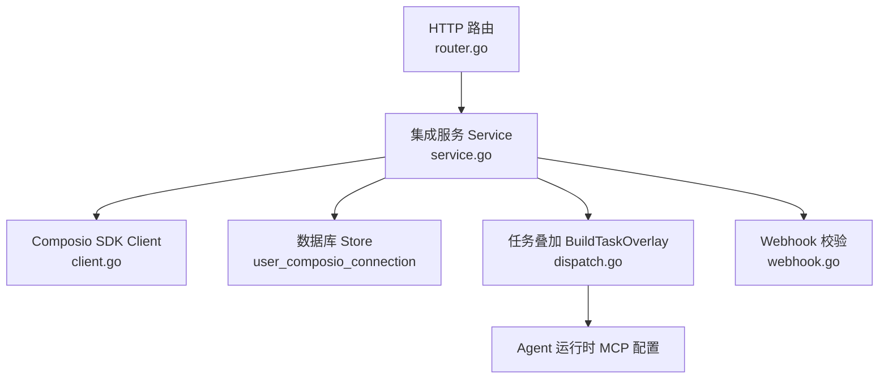
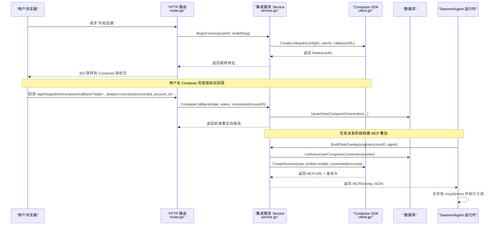
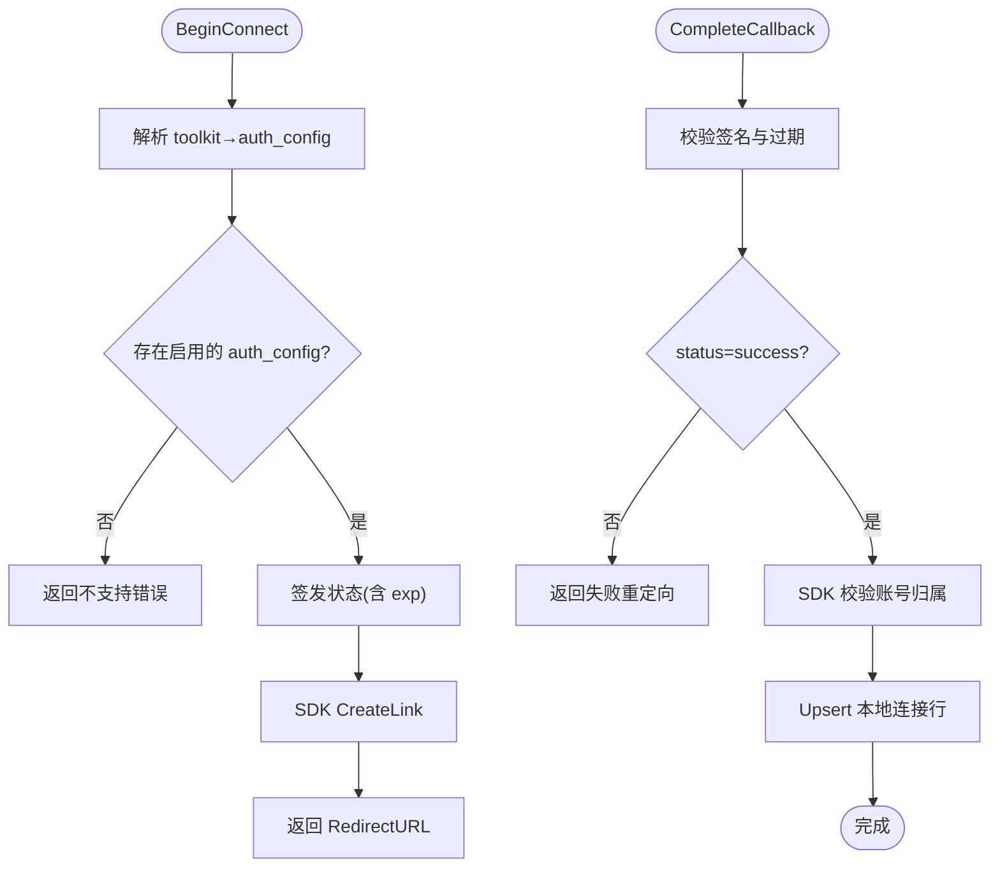
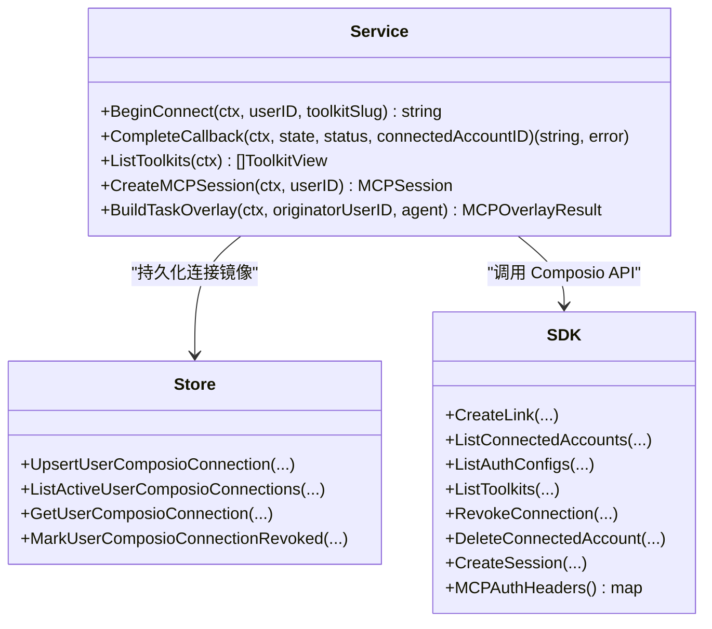
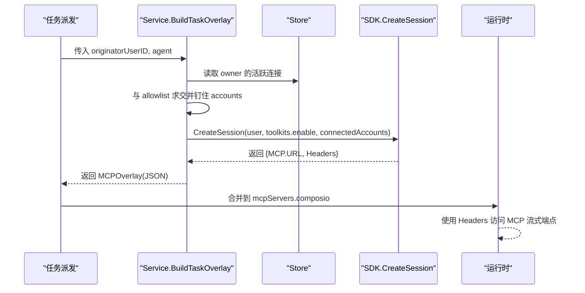
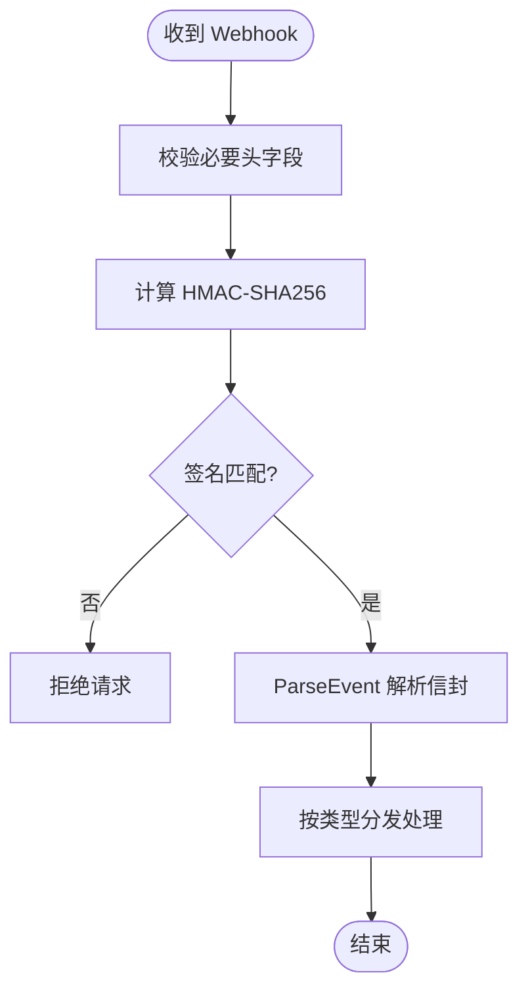
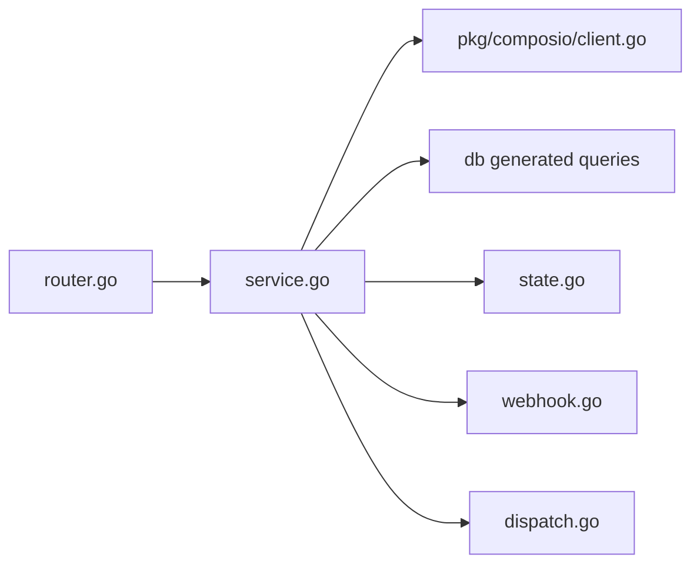

# Composio 集成

<cite>
**本文引用的文件**
- [server/pkg/composio/doc.go](file://server/pkg/composio/doc.go)
- [server/pkg/composio/README.md](file://server/pkg/composio/README.md)
- [server/pkg/composio/client.go](file://server/pkg/composio/client.go)
- [server/pkg/composio/webhook.go](file://server/pkg/composio/webhook.go)
- [server/internal/integrations/composio/service.go](file://server/internal/integrations/composio/service.go)
- [server/internal/integrations/composio/dispatch.go](file://server/internal/integrations/composio/dispatch.go)
- [server/internal/integrations/composio/state.go](file://server/internal/integrations/composio/state.go)
- [server/cmd/server/router.go](file://server/cmd/server/router.go)
</cite>

## 目录
1. [简介](#简介)
2. [项目结构](#项目结构)
3. [核心组件](#核心组件)
4. [架构总览](#架构总览)
5. [详细组件分析](#详细组件分析)
6. [依赖关系分析](#依赖关系分析)
7. [性能与可扩展性](#性能与可扩展性)
8. [故障诊断指南](#故障诊断指南)
9. [结论](#结论)
10. [附录：安装配置、可用工具与示例](#附录安装配置可用工具与示例)

## 简介
本文件系统性说明 Multica 对 Composio 第三方工具链的集成方案，覆盖架构设计、实现原理、工具发现、认证管理、调用流程、事件驱动与回调机制、安装配置、可用工具列表、使用示例以及故障诊断与性能调优。整体目标是在不侵入业务主路径的前提下，为智能体运行时提供可插拔的第三方工具能力（如 Notion、GitHub、Jira 等），并通过 MCP（Model Context Protocol）会话将工具暴露给执行环境。

## 项目结构
Composio 集成由三层组成：
- SDK 层：独立 Go 包，封装 Composio v3.1 REST API（连接链接、MCP 会话、已连接账户、工具套件、工具执行、Webhook 校验）。
- 集成服务层：业务胶水，负责签名状态握手、本地连接镜像、权限过滤、MCP 会话拼装与任务叠加。
- 路由与装配层：在服务器启动时根据环境变量与特性开关启用集成，并注入到任务调度链路中。

**图表来源**
- [server/cmd/server/router.go:1118-1173](file://server/cmd/server/router.go#L1118-L1173)
- [server/internal/integrations/composio/service.go:122-182](file://server/internal/integrations/composio/service.go#L122-L182)
- [server/pkg/composio/client.go:67-117](file://server/pkg/composio/client.go#L67-L117)
- [server/internal/integrations/composio/dispatch.go:53-160](file://server/internal/integrations/composio/dispatch.go#L53-L160)
- [server/pkg/composio/webhook.go:68-90](file://server/pkg/composio/webhook.go#L68-L90)

**章节来源**
- [server/cmd/server/router.go:1118-1173](file://server/cmd/server/router.go#L1118-L1173)
- [server/internal/integrations/composio/service.go:122-182](file://server/internal/integrations/composio/service.go#L122-L182)
- [server/pkg/composio/client.go:67-117](file://server/pkg/composio/client.go#L67-L117)
- [server/internal/integrations/composio/dispatch.go:53-160](file://server/internal/integrations/composio/dispatch.go#L53-L160)
- [server/pkg/composio/webhook.go:68-90](file://server/pkg/composio/webhook.go#L68-L90)

## 核心组件
- Composio SDK（独立包）
  - 职责：封装 REST 调用、统一鉴权头、错误解析、Webhook 签名验证、事件信封解析。
  - 关键点：仅依赖 resty；默认 x-api-key 鉴权；支持重试与自定义 http.Client；提供 MCP 鉴权头。
- 集成服务 Service
  - 职责：连接生命周期（开始/回调/断开）、工具清单发现、MCP 会话创建、任务级 MCP 叠加。
  - 关键点：动态解析 auth_config → toolkit 映射（缓存 TTL）；签名状态防重放；账号归属校验；幂等断开。
- 任务叠加 BuildTaskOverlay
  - 职责：基于 Agent 所有者的允许列表与活跃连接，生成 MCP 叠加 JSON，供 daemon 合并到运行配置。
  - 关键点：严格门控（无所有者/无允许列表/无活跃连接/无 URL）；按 slug 过滤并钉住 connected_accounts。
- Webhook 校验
  - 职责：验证 Composio 事件签名与时间戳，解析 V3 事件信封。
  - 关键点：HMAC-SHA256，容忍窗口，兼容多版本签名头。

**章节来源**
- [server/pkg/composio/doc.go:1-57](file://server/pkg/composio/doc.go#L1-L57)
- [server/pkg/composio/README.md:1-160](file://server/pkg/composio/README.md#L1-L160)
- [server/internal/integrations/composio/service.go:122-182](file://server/internal/integrations/composio/service.go#L122-L182)
- [server/internal/integrations/composio/dispatch.go:53-160](file://server/internal/integrations/composio/dispatch.go#L53-L160)
- [server/pkg/composio/webhook.go:68-90](file://server/pkg/composio/webhook.go#L68-L90)

## 架构总览
下图展示从用户发起连接到智能体调用工具的端到端流程，包括 OAuth 托管授权、回调落库、MCP 会话建立与任务叠加。

**图表来源**
- [server/cmd/server/router.go:1118-1173](file://server/cmd/server/router.go#L1118-L1173)
- [server/internal/integrations/composio/service.go:230-338](file://server/internal/integrations/composio/service.go#L230-L338)
- [server/internal/integrations/composio/dispatch.go:86-160](file://server/internal/integrations/composio/dispatch.go#L86-L160)
- [server/pkg/composio/client.go:67-117](file://server/pkg/composio/client.go#L67-L117)

## 详细组件分析

### 认证管理与连接生命周期
- 开始连接 BeginConnect
  - 动态解析 toolkit → auth_config 映射（带 TTL 缓存），若未启用则拒绝。
  - 生成签名状态（包含用户 ID、toolkit slug、auth_config id、过期时间），构造回调 URL。
  - 调用 SDK 创建托管 Connect Link，返回跳转地址。
- 回调处理 CompleteCallback
  - 校验签名状态与时效，检查 status 是否为成功。
  - 通过 SDK 查询 connected account 并校验其属于当前用户且由对应 auth_config 创建（防御跨工具绑定）。
  - 写入本地 user_composio_connection 行（幂等 upsert）。
- 断开 Disconnect
  - 先调用 SDK 撤销授权并删除记录（忽略 404 以幂等）。
  - 标记本地行为已撤销。

**图表来源**
- [server/internal/integrations/composio/service.go:230-338](file://server/internal/integrations/composio/service.go#L230-L338)
- [server/internal/integrations/composio/state.go:27-85](file://server/internal/integrations/composio/state.go#L27-L85)

**章节来源**
- [server/internal/integrations/composio/service.go:230-398](file://server/internal/integrations/composio/service.go#L230-L398)
- [server/internal/integrations/composio/state.go:27-85](file://server/internal/integrations/composio/state.go#L27-L85)

### 工具发现与权限控制
- 工具清单 ListToolkits
  - 拉取项目内所有启用的 auth_config，构建可连接工具集合（slug→auth_config_id）。
  - 分页拉取工具目录，仅保留有启用 auth_config 的工具，去重并按使用频率排序。
- 任务级权限 BuildTaskOverlay
  - 门控：Agent 必须有 owner；owner 必须设置 allowlist；allowlist 与 owner 的活跃连接交集非空；MCP URL 非空。
  - 生成 MCPOverlay：mcpServers.composio = {type:http, url, headers}，headers 携带 x-api-key。
  - 同时产出 ConnectedApps 元数据用于 UI 展示。

**图表来源**
- [server/internal/integrations/composio/service.go:72-93](file://server/internal/integrations/composio/service.go#L72-L93)
- [server/internal/integrations/composio/service.go:486-558](file://server/internal/integrations/composio/service.go#L486-L558)
- [server/internal/integrations/composio/dispatch.go:86-160](file://server/internal/integrations/composio/dispatch.go#L86-L160)

**章节来源**
- [server/internal/integrations/composio/service.go:486-558](file://server/internal/integrations/composio/service.go#L486-L558)
- [server/internal/integrations/composio/dispatch.go:86-160](file://server/internal/integrations/composio/dispatch.go#L86-L160)

### MCP 会话与会话安全
- 会话创建 CreateMCPSession
  - 读取用户活跃连接，按 toolkit 去重（最新优先），构造 connected_accounts 映射。
  - 调用 SDK 创建会话，返回 MCP URL 与鉴权头（x-api-key）。
- 任务叠加 BuildTaskOverlay
  - 将 composio 作为固定 serverName 注入 mcpServers，确保覆盖 agent 同名配置。
  - 通过 toolkits.enable 与 connected_accounts 双重限制，防止越权访问。

**图表来源**
- [server/internal/integrations/composio/dispatch.go:86-160](file://server/internal/integrations/composio/dispatch.go#L86-L160)
- [server/internal/integrations/composio/service.go:400-451](file://server/internal/integrations/composio/service.go#L400-L451)
- [server/pkg/composio/client.go:131-140](file://server/pkg/composio/client.go#L131-L140)

**章节来源**
- [server/internal/integrations/composio/dispatch.go:86-160](file://server/internal/integrations/composio/dispatch.go#L86-L160)
- [server/internal/integrations/composio/service.go:400-451](file://server/internal/integrations/composio/service.go#L400-L451)
- [server/pkg/composio/client.go:131-140](file://server/pkg/composio/client.go#L131-L140)

### 事件驱动与回调机制
- Webhook 校验
  - 使用 HMAC-SHA256 对 “id.timestamp.rawBody” 计算签名，支持多版本签名头。
  - 提供 VerifyWebhook/VerifyHTTPRequest 与 ParseEvent，便于接入触发器事件（如连接过期）。
- 回调重定向
  - 集成服务提供 CallbackRedirect，根据成功/失败返回不同前端路径参数，便于 UI 提示。

**图表来源**
- [server/pkg/composio/webhook.go:68-90](file://server/pkg/composio/webhook.go#L68-L90)
- [server/pkg/composio/webhook.go:166-191](file://server/pkg/composio/webhook.go#L166-L191)
- [server/internal/integrations/composio/service.go:453-470](file://server/internal/integrations/composio/service.go#L453-L470)

**章节来源**
- [server/pkg/composio/webhook.go:68-90](file://server/pkg/composio/webhook.go#L68-L90)
- [server/pkg/composio/webhook.go:166-191](file://server/pkg/composio/webhook.go#L166-L191)
- [server/internal/integrations/composio/service.go:453-470](file://server/internal/integrations/composio/service.go#L453-L470)

## 依赖关系分析
- 路由层仅在 COMPOSIO_API_KEY 存在且特性开关开启时启用集成，避免误配导致 503。
- 集成服务依赖 SDK 接口与 Store 接口，便于测试替换与解耦。
- 任务叠加依赖 Agent 的所有者与 allowlist，确保最小权限原则。
- Webhook 校验独立于业务逻辑，便于复用。

**图表来源**
- [server/cmd/server/router.go:1118-1173](file://server/cmd/server/router.go#L1118-L1173)
- [server/internal/integrations/composio/service.go:72-93](file://server/internal/integrations/composio/service.go#L72-L93)
- [server/internal/integrations/composio/dispatch.go:86-160](file://server/internal/integrations/composio/dispatch.go#L86-L160)
- [server/pkg/composio/webhook.go:68-90](file://server/pkg/composio/webhook.go#L68-L90)

**章节来源**
- [server/cmd/server/router.go:1118-1173](file://server/cmd/server/router.go#L1118-L1173)
- [server/internal/integrations/composio/service.go:72-93](file://server/internal/integrations/composio/service.go#L72-L93)

## 性能与可扩展性
- 缓存策略
  - auth_config 映射缓存 TTL 默认 5 分钟，降低频繁拉取 /auth_configs 的压力。
  - 工具目录分页拉取，限制最大页数，避免上游异常导致的无限循环。
- 并发与幂等
  - 断开操作对 404 做幂等处理，重复删除不会报错。
  - 回调 upsert 基于 (user_id, connected_account_id) 键，避免重复行。
- 超时与重试
  - SDK 默认每请求超时 30 秒，支持自定义 http.Client 与重试次数/间隔。
- 扩展点
  - 新增 provider 可使用不同的 mcpOverlayServerName 避免冲突。
  - 可通过特性开关与环境变量逐步灰度启用。

[本节为通用指导，无需特定文件引用]

## 故障诊断指南
- 常见问题定位
  - 集成未启用：检查 COMPOSIO_API_KEY 与特性开关；查看日志中的“composio integration disabled”。
  - 回调失败：确认回调基础 URL 配置正确；检查签名状态是否过期或篡改。
  - 无法列出工具：检查 /auth_configs 是否返回启用项；关注缓存失效与网络错误。
  - 任务无 MCP 叠加：检查 Agent 是否有 owner、allowlist 是否为空、是否存在活跃连接、MCP URL 是否为空。
- 错误类型
  - 连接相关：ErrToolkitNotSupported、ErrConnectNotSuccessful、ErrConnectionNotFound、ErrAccountVerification。
  - Webhook：缺少密钥或缺少头字段会返回相应错误。
- 建议
  - 使用离线测试与 httptest.Server 验证 SDK 行为。
  - 对敏感头（如 x-api-key）进行脱敏后再记录日志。

**章节来源**
- [server/internal/integrations/composio/service.go:32-49](file://server/internal/integrations/composio/service.go#L32-L49)
- [server/pkg/composio/webhook.go:68-90](file://server/pkg/composio/webhook.go#L68-L90)
- [server/cmd/server/router.go:1118-1173](file://server/cmd/server/router.go#L1118-L1173)

## 结论
Composio 集成通过独立的 SDK、清晰的服务边界与严格的权限门控，实现了安全的第三方工具接入。动态工具发现与 MCP 会话叠加使得工具能力可按需挂载到智能体运行时，事件驱动的回调机制保障了连接状态的可靠同步。配合缓存、幂等与超时重试，系统在可用性与性能之间取得平衡。后续可在不破坏现有类型的前提下扩展更多能力（如代理执行、触发器等）。

[本节为总结，无需特定文件引用]

## 附录：安装配置、可用工具与示例

- 安装与配置
  - 环境变量
    - COMPOSIO_API_KEY：项目级 API Key（x-api-key）。
    - COMPOSIO_CALLBACK_BASE_URL 或 MULTICA_PUBLIC_URL：回调基础 URL。
    - COMPOSIO_STATE_SECRET 或 JWT_SECRET：签名状态密钥。
  - 特性开关：composio_mcp_apps 开启后才会注册路由与服务。
  - 启动时会在满足条件后注入 Service 到 TaskService，使任务派发自动附加 MCP 叠加。

- 可用工具列表
  - 通过 ListToolkits 获取项目内已启用 auth_config 的工具，UI 仅展示可连接的工具。
  - Logo 与分类信息来自 Composio 目录，缺失时使用默认域名拼接。

- 使用示例（概念性步骤）
  - 开始连接：调用 BeginConnect 获取 RedirectURL，浏览器跳转到 Composio 授权。
  - 回调处理：CompleteCallback 校验状态并写入本地连接。
  - 列出连接：ListConnections 获取用户活跃连接。
  - 断开连接：Disconnect 幂等撤销并标记本地行。
  - 任务叠加：BuildTaskOverlay 生成 MCPOverlay，daemon 合并后执行工具。

- 错误处理
  - 捕获 SDK 的 APIError，区分速率限制与 404 等场景。
  - Webhook 校验失败直接拒绝，避免恶意事件进入系统。

**章节来源**
- [server/cmd/server/router.go:1118-1173](file://server/cmd/server/router.go#L1118-L1173)
- [server/internal/integrations/composio/service.go:486-558](file://server/internal/integrations/composio/service.go#L486-L558)
- [server/internal/integrations/composio/dispatch.go:86-160](file://server/internal/integrations/composio/dispatch.go#L86-L160)
- [server/pkg/composio/README.md:28-70](file://server/pkg/composio/README.md#L28-L70)
- [server/pkg/composio/README.md:72-120](file://server/pkg/composio/README.md#L72-L120)