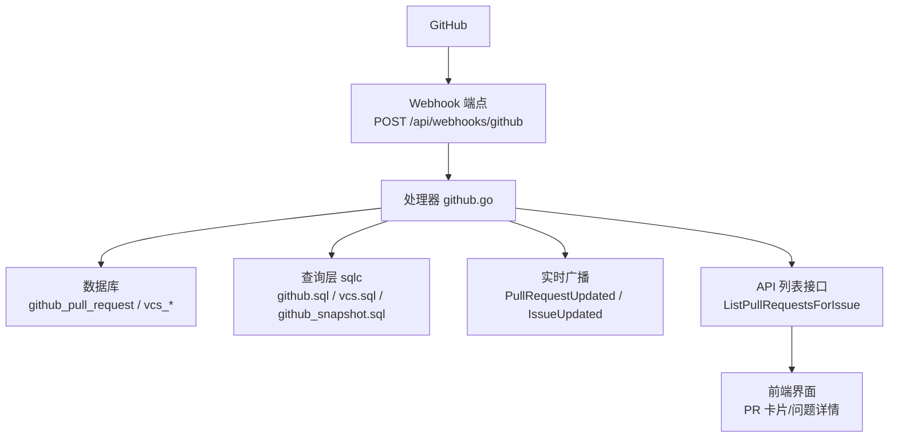
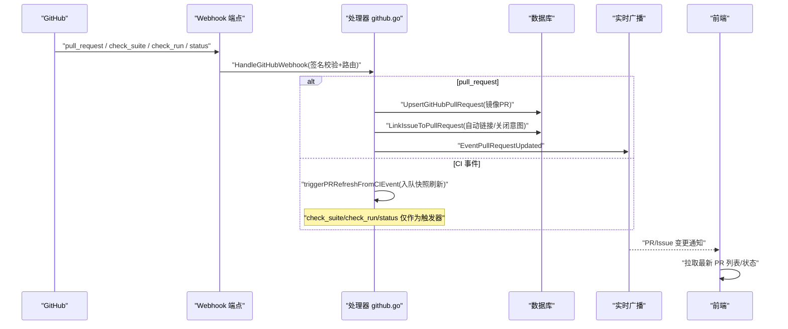
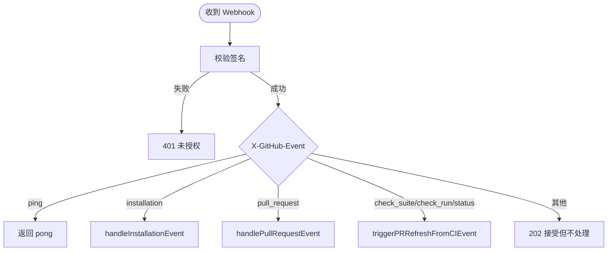
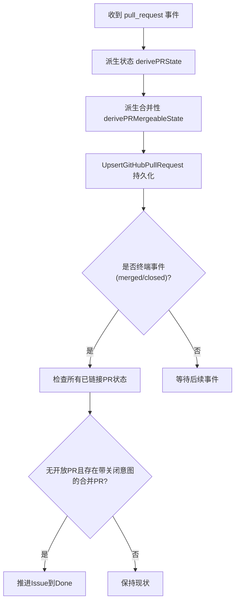
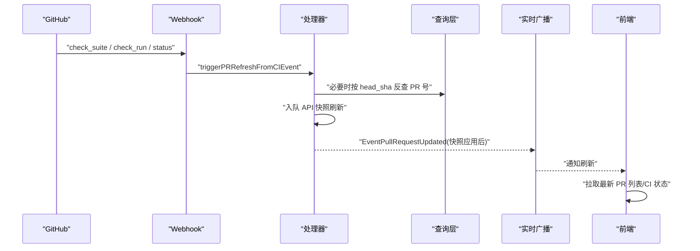
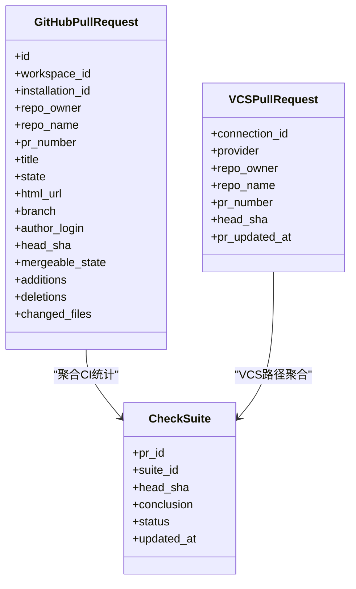
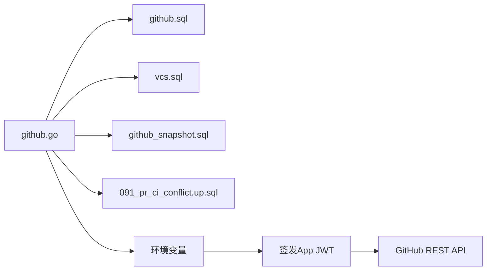

# GitHub 集成

<cite>
**本文引用的文件**
- [server/internal/handler/github.go](file://server/internal/handler/github.go)
- [apps/docs/content/docs/github-integration.mdx](file://apps/docs/content/docs/github-integration.mdx)
- [docker-compose.selfhost.yml](file://docker-compose.selfhost.yml)
- [server/pkg/db/queries/github.sql](file://server/pkg/db/queries/github.sql)
- [server/pkg/db/queries/github_snapshot.sql](file://server/pkg/db/queries/github_snapshot.sql)
- [server/pkg/db/queries/vcs.sql](file://server/pkg/db/queries/vcs.sql)
- [server/migrations/091_pr_ci_conflict.up.sql](file://server/migrations/091_pr_ci_conflict.up.sql)
</cite>

## 目录
1. [简介](#简介)
2. [项目结构](#项目结构)
3. [核心组件](#核心组件)
4. [架构总览](#架构总览)
5. [详细组件分析](#详细组件分析)
6. [依赖关系分析](#依赖关系分析)
7. [性能考虑](#性能考虑)
8. [故障排除指南](#故障排除指南)
9. [结论](#结论)
10. [附录](#附录)

## 简介
本文件面向 Multica 的 GitHub 集成，系统性说明 Pull Request（PR）监控机制、自动更新与状态同步策略，并给出配置、Webhook 设置、权限要求与故障排除。重点覆盖：
- PR 状态变化监听、分支更新检测、合并冲突识别
- 代码提交后的任务状态同步、CI 结果反馈、评论自动回复
- 本地任务与 GitHub 状态的映射、冲突解决机制、数据一致性保证
- 环境变量、Webhook 端点、GitHub App 权限与最佳实践

## 项目结构
GitHub 集成的后端实现集中在 Go 服务中，通过 HTTP Webhook 接收 GitHub 事件，持久化 PR 元数据，触发 CI/合并状态快照刷新，并通过实时广播将变更推送至前端。相关 SQL 查询与迁移位于 server/pkg/db/queries 与 server/migrations。

图表来源
- [server/internal/handler/github.go:1051-1093](file://server/internal/handler/github.go#L1051-L1093)
- [server/pkg/db/queries/github.sql:1-37](file://server/pkg/db/queries/github.sql#L1-L37)
- [server/pkg/db/queries/vcs.sql:68-88](file://server/pkg/db/queries/vcs.sql#L68-L88)
- [server/pkg/db/queries/github_snapshot.sql:85-94](file://server/pkg/db/queries/github_snapshot.sql#L85-L94)

章节来源
- [server/internal/handler/github.go:1051-1093](file://server/internal/handler/github.go#L1051-L1093)
- [apps/docs/content/docs/github-integration.mdx:106-138](file://apps/docs/content/docs/github-integration.mdx#L106-L138)

## 核心组件
- Webhook 接收与路由：验证签名、按 X-GitHub-Event 分发到安装、PR、CI 等处理逻辑。
- PR 镜像与链接：将 PR 事件写入数据库，解析 issue 标识符并建立 PR ↔ Issue 关联，支持“关闭意图”控制自动完成。
- CI/合并状态快照：基于 check_suite/check_run/status 事件触发 API 快照刷新，聚合 CI 结果与 mergeability。
- 实时广播：PR 或 Issue 变更后，向工作区广播事件，驱动前端刷新。
- 连接管理：安装回调、安装列表、仓库浏览、断开连接。

章节来源
- [server/internal/handler/github.go:1051-1093](file://server/internal/handler/github.go#L1051-L1093)
- [server/internal/handler/github.go:1257-1299](file://server/internal/handler/github.go#L1257-L1299)
- [server/internal/handler/github.go:1462-1520](file://server/internal/handler/github.go#L1462-L1520)
- [server/internal/handler/github.go:1534-1697](file://server/internal/handler/github.go#L1534-L1697)
- [server/internal/handler/github.go:458-573](file://server/internal/handler/github.go#L458-L573)

## 架构总览
下图展示从 GitHub 事件到前端展示的端到端流程，包括 PR 镜像、CI 快照刷新、Issue 自动完成与实时广播。

图表来源
- [server/internal/handler/github.go:1051-1093](file://server/internal/handler/github.go#L1051-L1093)
- [server/internal/handler/github.go:1257-1299](file://server/internal/handler/github.go#L1257-L1299)
- [server/internal/handler/github.go:1462-1520](file://server/internal/handler/github.go#L1462-L1520)
- [server/internal/handler/github.go:1534-1697](file://server/internal/handler/github.go#L1534-L1697)

## 详细组件分析

### Webhook 接收与签名校验
- 端点：POST /api/webhooks/github
- 校验：使用 HMAC-SHA256 验证 X-Hub-Signature-256，未配置密钥直接拒绝处理。
- 路由：
  - ping：返回 pong
  - installation：安装生命周期事件（创建/删除/挂起/恢复）
  - pull_request：PR 生命周期事件（打开/编辑/同步/关闭/合并）
  - check_suite / check_run / status：CI 事件，仅触发快照刷新，不用于显示

图表来源
- [server/internal/handler/github.go:1051-1093](file://server/internal/handler/github.go#L1051-L1093)
- [server/internal/handler/github.go:1095-1107](file://server/internal/handler/github.go#L1095-L1107)

章节来源
- [server/internal/handler/github.go:1051-1093](file://server/internal/handler/github.go#L1051-L1093)
- [server/internal/handler/github.go:1095-1107](file://server/internal/handler/github.go#L1095-L1107)

### PR 监控机制：状态变化监听、分支更新检测、合并冲突识别
- 状态变化监听：
  - 解析 pull_request 事件，计算 PR 状态（open/draft/closed/merged），写入 github_pull_request。
  - 根据 action 与 base 分支变更决定是否清空 mergeable_state，避免陈旧判定。
- 分支更新检测：
  - 记录 head SHA；当 CI 事件携带 commit SHA 时，通过 head_sha 反查 PR 号以触发刷新。
- 合并冲突识别：
  - 使用 GitHub GraphQL 快照中的 mergeable_state 与 merge_state_status，结合 checks_rollup 判断是否可合并、是否存在冲突或被阻止。
  - 若快照不可用或过期，前端降级为灰显“上次已知”。

图表来源
- [server/internal/handler/github.go:1534-1697](file://server/internal/handler/github.go#L1534-L1697)
- [server/internal/handler/github.go:1715-1726](file://server/internal/handler/github.go#L1715-L1726)
- [server/internal/handler/github.go:1746-1757](file://server/internal/handler/github.go#L1746-L1757)

章节来源
- [server/internal/handler/github.go:1257-1299](file://server/internal/handler/github.go#L1257-L1299)
- [server/internal/handler/github.go:1534-1697](file://server/internal/handler/github.go#L1534-L1697)
- [server/internal/handler/github.go:1715-1726](file://server/internal/handler/github.go#L1715-L1726)
- [server/internal/handler/github.go:1746-1757](file://server/internal/handler/github.go#L1746-L1757)

### 自动更新：CI 结果反馈与评论自动回复
- CI 结果反馈：
  - check_suite/check_run/status 事件仅作为触发器，调用 triggerPRRefreshFromCIEvent 入队 API 快照刷新。
  - 刷新后通过 EventPullRequestUpdated 广播，前端重新拉取 PR 列表并渲染 CI 状态。
- 评论自动回复：
  - 当前实现聚焦于 PR 镜像与 CI 状态刷新；未在 Webhook 路径中实现自动评论回复。如需评论自动化，可在外部自动化流程中调用平台 API 或通过插件扩展。

图表来源
- [server/internal/handler/github.go:1462-1520](file://server/internal/handler/github.go#L1462-L1520)
- [server/internal/handler/github.go:1006-1027](file://server/internal/handler/github.go#L1006-L1027)

章节来源
- [server/internal/handler/github.go:1462-1520](file://server/internal/handler/github.go#L1462-L1520)
- [server/internal/handler/github.go:1006-1027](file://server/internal/handler/github.go#L1006-L1027)

### 状态同步策略：本地任务与 GitHub 状态映射、冲突解决、数据一致性
- 映射关系：
  - PR 行包含 head_sha、mergeable_state、时间戳；CI 快照聚合 checks_total/passed/failed/running 与 failed_check_names。
  - VCS 提供者（Forgejo/Gitea/GitLab）通过 vcs_pull_request 与 vcs_commit_status 表聚合当前 head 的状态。
- 冲突解决：
  - 多工作空间绑定同一安装时，对“关闭意图”进行唯一性判定，避免跨工作空间误关 Issue。
  - 对于 stale 重投递，PR 行通过 pr_updated_at 守卫，只在新事件更晚时才覆盖旧值。
- 数据一致性：
  - 使用 UpsertGitHubPullRequest/UpsertVCSPullRequest 保证幂等；link 行支持 preserve_close_intent 防止终端事件后编辑改写关闭意图。
  - 快照刷新在后台进行，前端始终能拿到当前可用快照或降级显示“上次已知”。

图表来源
- [server/pkg/db/queries/github.sql:82-107](file://server/pkg/db/queries/github.sql#L82-L107)
- [server/pkg/db/queries/vcs.sql:68-88](file://server/pkg/db/queries/vcs.sql#L68-L88)
- [server/migrations/091_pr_ci_conflict.up.sql:1-22](file://server/migrations/091_pr_ci_conflict.up.sql#L1-L22)

章节来源
- [server/pkg/db/queries/github.sql:82-107](file://server/pkg/db/queries/github.sql#L82-L107)
- [server/pkg/db/queries/vcs.sql:68-88](file://server/pkg/db/queries/vcs.sql#L68-L88)
- [server/migrations/091_pr_ci_conflict.up.sql:1-22](file://server/migrations/091_pr_ci_conflict.up.sql#L1-L22)

### 配置选项与环境变量
- 必需环境变量：
  - GITHUB_APP_SLUG：GitHub App 公开 URL 的 slug
  - GITHUB_WEBHOOK_SECRET：Webhook 共享密钥（用于签名校验）
  - FRONTEND_ORIGIN：前端地址（用于回调跳转）
- 可选但推荐的环境变量（启用 CI/合并状态显示）：
  - GITHUB_APP_ID：GitHub App 数字 ID
  - GITHUB_APP_PRIVATE_KEY：PEM 私钥（用于签发 App JWT，获取安装令牌）
- 部署示例见 docker-compose.selfhost.yml 中的环境变量注入。

章节来源
- [apps/docs/content/docs/github-integration.mdx:143-162](file://apps/docs/content/docs/github-integration.mdx#L143-L162)
- [docker-compose.selfhost.yml:113-124](file://docker-compose.selfhost.yml#L113-L124)

### Webhook 设置与权限要求
- Webhook 端点：
  - Setup 回调：https://<api-host>/api/github/setup
  - Webhook 地址：https://<api-host>/api/webhooks/github
- 订阅事件：
  - Pull request
  - Check suite、Check run、Status（用于 CI 刷新）
- 权限（最小化原则）：
  - Metadata：只读
  - Contents：只读（快照需要读取 head commit）
  - Pull requests：只读
  - Checks：只读（显示 CI 状态）
  - Commit statuses：只读（聚合历史状态）

章节来源
- [apps/docs/content/docs/github-integration.mdx:110-138](file://apps/docs/content/docs/github-integration.mdx#L110-L138)

### 使用示例与最佳实践
- 自动链接：
  - 在分支名或 PR 标题中包含工作区 issue 前缀与编号（如 MUL-123）。
  - 在 PR 正文中使用关闭关键词（Closes/Fixes/Resolves MUL-123）以触发自动完成。
- 多工作空间：
  - 同一 GitHub App 安装可绑定多个工作区；每个工作区独立匹配自身前缀。
- 断开连接：
  - 断开仅移除 Multica 工作区与安装的绑定；不会卸载 GitHub App。
- 最佳实践：
  - 确保 Webhook 密钥一致，避免 401 错误。
  - 为 CI 显示开启 Contents/Checks/Commit statuses 权限并订阅对应事件。
  - 使用关闭意图明确完成语义，避免误关。

章节来源
- [apps/docs/content/docs/github-integration.mdx:44-104](file://apps/docs/content/docs/github-integration.mdx#L44-L104)
- [apps/docs/content/docs/github-integration.mdx:174-182](file://apps/docs/content/docs/github-integration.mdx#L174-L182)

## 依赖关系分析
- Webhook 处理器依赖：
  - 数据库查询层（sqlc 生成）：github.sql、vcs.sql、github_snapshot.sql
  - 迁移：091_pr_ci_conflict.up.sql（PR CI 检查与合并冲突字段）
- 运行时依赖：
  - GitHub App 凭据（ID/私钥）用于签发 JWT 与获取安装令牌
  - 环境变量（GITHUB_APP_SLUG、GITHUB_WEBHOOK_SECRET、FRONTEND_ORIGIN）

图表来源
- [server/internal/handler/github.go:1051-1093](file://server/internal/handler/github.go#L1051-L1093)
- [server/pkg/db/queries/github.sql:1-37](file://server/pkg/db/queries/github.sql#L1-L37)
- [server/pkg/db/queries/vcs.sql:68-88](file://server/pkg/db/queries/vcs.sql#L68-L88)
- [server/pkg/db/queries/github_snapshot.sql:85-94](file://server/pkg/db/queries/github_snapshot.sql#L85-L94)
- [server/migrations/091_pr_ci_conflict.up.sql:1-22](file://server/migrations/091_pr_ci_conflict.up.sql#L1-L22)

章节来源
- [server/internal/handler/github.go:1051-1093](file://server/internal/handler/github.go#L1051-L1093)
- [server/pkg/db/queries/github.sql:1-37](file://server/pkg/db/queries/github.sql#L1-L37)
- [server/pkg/db/queries/vcs.sql:68-88](file://server/pkg/db/queries/vcs.sql#L68-L88)
- [server/pkg/db/queries/github_snapshot.sql:85-94](file://server/pkg/db/queries/github_snapshot.sql#L85-L94)
- [server/migrations/091_pr_ci_conflict.up.sql:1-22](file://server/migrations/091_pr_ci_conflict.up.sql#L1-L22)

## 性能考虑
- Webhook 处理轻量：CI 事件仅入队刷新，不阻塞响应。
- 快照刷新后台执行：避免频繁拉取 GitHub API 影响主流程。
- 聚合查询优化：按 head_sha 过滤，避免旧运行污染当前视图。
- 前端降级：快照不可用时显示“上次已知”，提升用户体验。

[本节提供通用指导，无需特定文件引用]

## 故障排除指南
- 连接按钮禁用：
  - 检查 GITHUB_APP_SLUG 与 GITHUB_WEBHOOK_SECRET 是否已注入 API 进程。
- Webhook 返回 401：
  - 确认 GitHub App 与 API 使用相同密钥；可从 GitHub 最近投递中重发测试。
- PR 未链接：
  - 确认仓库在 App 授权范围内；自动链接开关开启；标识符属于当前工作区。
- 正文标识符未显示：
  - 使用 Closes/Fixes/Resolves 关键词；或将标识符放入分支名/PR 标题。
- 无 CI 状态：
  - 确认 GITHUB_APP_ID 与 GITHUB_APP_PRIVATE_KEY 已配置；App 具备 Contents/Checks/Commit statuses 只读权限并订阅对应事件。
- 合并后 Issue 未完成：
  - 确认 PR 使用了关闭意图；检查是否有其他链接 PR 仍为 Open/Draft。

章节来源
- [apps/docs/content/docs/github-integration.mdx:174-182](file://apps/docs/content/docs/github-integration.mdx#L174-L182)

## 结论
Multica 的 GitHub 集成通过 Webhook 接收 PR 与 CI 事件，持久化 PR 元数据，触发 API 快照刷新，并将状态变更实时广播至前端。其设计强调幂等、降级与一致性保障，在多工作空间场景下通过关闭意图策略避免误操作。合理配置环境变量与权限，遵循最佳实践，可获得稳定可靠的 PR 监控与自动更新体验。

[本节总结内容，无需特定文件引用]

## 附录
- 关键端点与事件：
  - Webhook：POST /api/webhooks/github
  - Setup 回调：GET /api/github/setup
  - 订阅事件：Pull request、Check suite、Check run、Status
- 关键表与字段：
  - github_pull_request：head_sha、mergeable_state、时间戳
  - vcs_pull_request：provider、head_sha、pr_updated_at
  - github_pull_request_check_suite：per-check_suite 聚合 CI 结果

[本节为补充信息，无需特定文件引用]