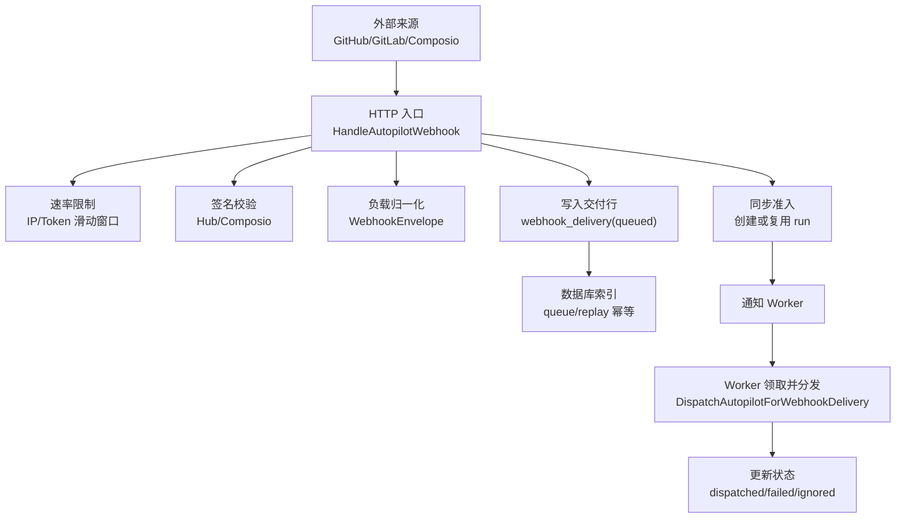
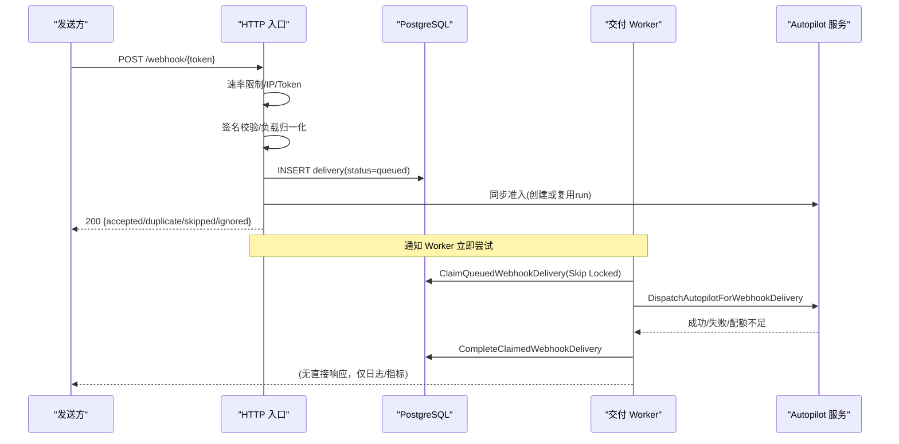
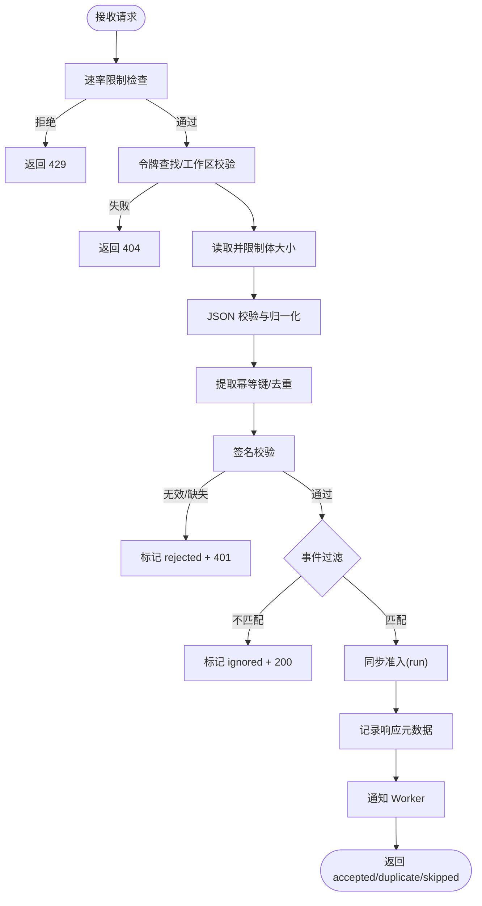
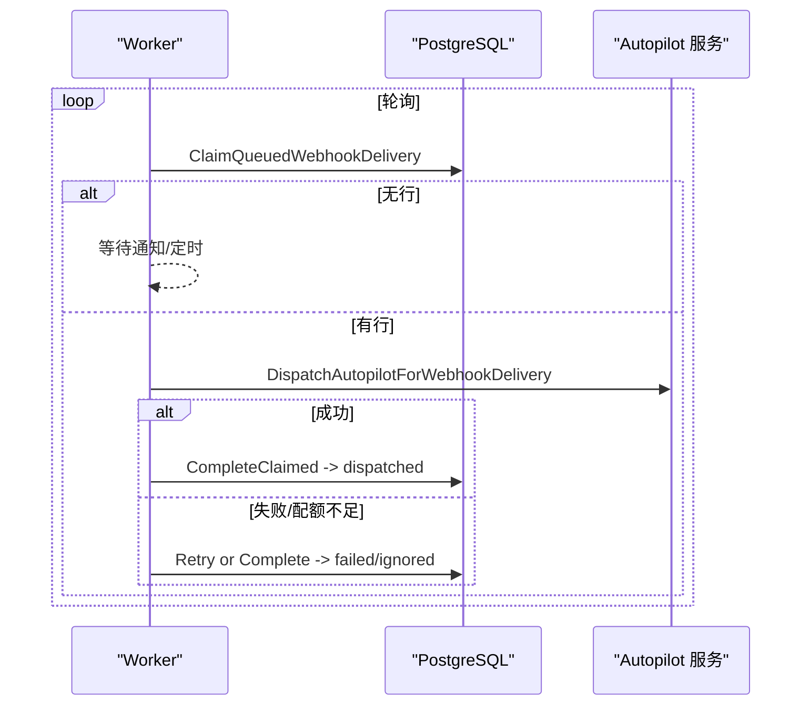
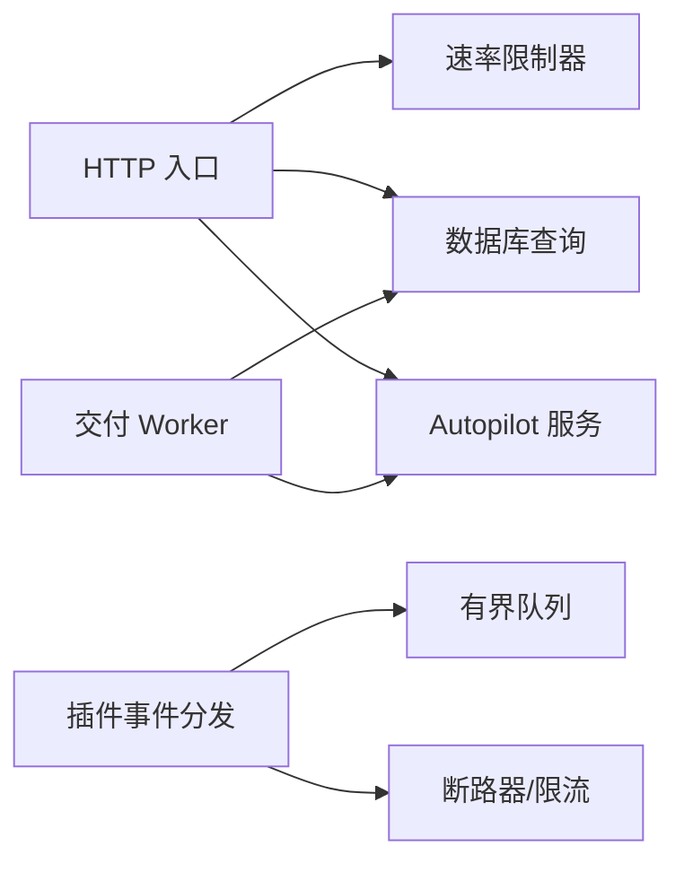

# Webhook 系统

<cite>
**本文引用的文件**
- [autopilot_webhook.go](file://server/internal/handler/autopilot_webhook.go)
- [webhook_delivery_worker.go](file://server/internal/handler/webhook_delivery_worker.go)
- [webhook_rate_limiter.go](file://server/internal/handler/webhook_rate_limiter.go)
- [webhook_delivery.go](file://server/internal/handler/webhook_delivery.go)
- [webhook_delivery.sql](file://server/pkg/db/queries/webhook_delivery.sql)
- [178_webhook_delivery_queue_index.up.sql](file://server/migrations/178_webhook_delivery_queue_index.up.sql)
- [357_webhook_delivery_replay_idempotency_index.up.sql](file://server/migrations/357_webhook_delivery_replay_idempotency_index.up.sql)
- [webhook.go](file://server/pkg/composio/webhook.go)
- [webhook_test.go](file://server/pkg/composio/webhook_test.go)
- [plugin_event_dispatch.go](file://server/internal/service/plugin_event_dispatch.go)
- [manifest.go](file://server/pkg/plugincontract/manifest.go)
- [autopilots.mdx](file://apps/docs/content/docs/autopilots.mdx)
</cite>

## 目录
1. [简介](#简介)
2. [项目结构](#项目结构)
3. [核心组件](#核心组件)
4. [架构总览](#架构总览)
5. [详细组件分析](#详细组件分析)
6. [依赖关系分析](#依赖关系分析)
7. [性能与可扩展性](#性能与可扩展性)
8. [故障排查指南](#故障排查指南)
9. [结论](#结论)
10. [附录：API、配置与调试](#附录api配置与调试)

## 简介
本文件系统性说明 Multica 的 Webhook 子系统，覆盖事件注册、签名验证、负载归一化、分发与重试、速率限制、失败处理、监控告警、安全与合规、以及管理与调试能力。Webhook 用于将外部事件（如 GitHub/GitLab/Composio 等）可靠地投递到 Autopilot 工作流中，保证幂等、可观测、可重放与可审计。

## 项目结构
Webhook 相关代码主要分布在以下位置：
- HTTP 入口与业务编排：server/internal/handler/autopilot_webhook.go
- 持久化队列与异步分发：server/internal/handler/webhook_delivery_worker.go
- 速率限制器（内存/Redis）：server/internal/handler/webhook_rate_limiter.go
- 交付记录查询与重放 API：server/internal/handler/webhook_delivery.go
- SQL 查询与索引：server/pkg/db/queries/webhook_delivery.sql、migrations/*
- 第三方来源验证（Composio）：server/pkg/composio/webhook.go
- 插件事件分发（与 Webhook 互补的事件总线）：server/internal/service/plugin_event_dispatch.go
- 订阅权限约束：server/pkg/plugincontract/manifest.go
- 用户文档与约束说明：apps/docs/content/docs/autopilots.mdx

图表来源
- [autopilot_webhook.go:309-631](file://server/internal/handler/autopilot_webhook.go#L309-L631)
- [webhook_delivery_worker.go:113-224](file://server/internal/handler/webhook_delivery_worker.go#L113-L224)
- [webhook_delivery.sql:71-148](file://server/pkg/db/queries/webhook_delivery.sql#L71-L148)
- [178_webhook_delivery_queue_index.up.sql:1-3](file://server/migrations/178_webhook_delivery_queue_index.up.sql#L1-L3)
- [357_webhook_delivery_replay_idempotency_index.up.sql:1-3](file://server/migrations/357_webhook_delivery_replay_idempotency_index.up.sql#L1-L3)

章节来源
- [autopilot_webhook.go:309-631](file://server/internal/handler/autopilot_webhook.go#L309-L631)
- [webhook_delivery_worker.go:19-224](file://server/internal/handler/webhook_delivery_worker.go#L19-L224)
- [webhook_rate_limiter.go:12-47](file://server/internal/handler/webhook_rate_limiter.go#L12-L47)
- [webhook_delivery.go:20-57](file://server/internal/handler/webhook_delivery.go#L20-L57)
- [webhook_delivery.sql:5-20](file://server/pkg/db/queries/webhook_delivery.sql#L5-L20)

## 核心组件
- 入口处理器 HandleAutopilotWebhook：负责鉴权（URL Token）、限流、签名校验、负载归一化、去重、持久化、同步准入与响应。
- 交付 Worker：从数据库队列领取待分发交付，执行触发器/工作流调度，管理重试与完成状态。
- 速率限制器：提供 per-IP、per-token、绝对 IP 上限的滑动窗口限流，支持内存与 Redis 两种实现。
- 交付记录与重放 API：列出、查看详情、重放历史交付，支持幂等重放与审计。
- 签名验证库：Composio 专用 HMAC-SHA256 验签与时钟容差；同时支持 GitHub/GitLab 兼容的 Hub 签名。
- 插件事件分发：与 Webhook 并列的事件通道，使用有界队列与断路器保护下游。

章节来源
- [autopilot_webhook.go:32-80](file://server/internal/handler/autopilot_webhook.go#L32-L80)
- [webhook_delivery_worker.go:19-224](file://server/internal/handler/webhook_delivery_worker.go#L19-L224)
- [webhook_rate_limiter.go:12-47](file://server/internal/handler/webhook_rate_limiter.go#L12-L47)
- [webhook_delivery.go:20-57](file://server/internal/handler/webhook_delivery.go#L20-L57)
- [webhook.go:17-35](file://server/pkg/composio/webhook.go#L17-L35)
- [plugin_event_dispatch.go:15-43](file://server/internal/service/plugin_event_dispatch.go#L15-L43)

## 架构总览
Webhook 采用“先落盘、后分发”的可靠模式：请求进入后立即写入 webhook_delivery（status=queued），由后台 Worker 以数据库租约方式并发领取并分发，失败按指数退避重试，最终状态回写。

图表来源
- [autopilot_webhook.go:309-631](file://server/internal/handler/autopilot_webhook.go#L309-L631)
- [webhook_delivery_worker.go:113-224](file://server/internal/handler/webhook_delivery_worker.go#L113-L224)
- [webhook_delivery.sql:71-148](file://server/pkg/db/queries/webhook_delivery.sql#L71-L148)

## 详细组件分析

### 入口处理器：注册、验证、分发与响应
- 令牌鉴权：URL 中的 token 作为公开凭证，查找触发器并校验工作区一致性。
- 速率限制：三层限流（绝对 IP、坏凭证 IP、每触发器 Token）。
- 负载归一化：统一为 WebhookEnvelope，包含 event、eventPayload、request.receivedAt/contentType。
- 去重：基于 X-GitHub-Delivery 或 Idempotency-Key 的幂等键，重复请求返回已有 delivery_id/run_id。
- 签名校验：支持 Hub 兼容签名（X-Hub-Signature-256）与可选的 Composio 签名；未配置密钥时允许仅凭 URL Token 访问。
- 事件过滤：根据触发器的 event_filters 列表匹配事件名与 action/state/conclusion/status 字段。
- 同步准入：在入站即创建或复用 Autopilot Run，确保客户端契约稳定。
- 响应语义：accepted/duplicate/skipped/ignored/rejected/4xx/5xx，附带 delivery_id/run_id 以便关联。

图表来源
- [autopilot_webhook.go:309-631](file://server/internal/handler/autopilot_webhook.go#L309-L631)
- [webhook_delivery.go:20-57](file://server/internal/handler/webhook_delivery.go#L20-L57)

章节来源
- [autopilot_webhook.go:32-80](file://server/internal/handler/autopilot_webhook.go#L32-L80)
- [autopilot_webhook.go:100-212](file://server/internal/handler/autopilot_webhook.go#L100-L212)
- [autopilot_webhook.go:214-305](file://server/internal/handler/autopilot_webhook.go#L214-L305)
- [autopilot_webhook.go:309-631](file://server/internal/handler/autopilot_webhook.go#L309-L631)
- [autopilots.mdx:72-89](file://apps/docs/content/docs/autopilots.mdx#L72-L89)

### 交付 Worker：队列、租约、重试与完成
- 并发模型：固定数量 Worker 轮询数据库队列，使用 SKIP LOCKED 避免争用。
- 租约机制：为每条交付设置短期租约，崩溃后可被其他实例回收。
- 触发器/工作区二次校验：仅在未同步准入的情况下进行，避免误杀已确认的 run。
- 重试策略：失败按指数退避延迟，达到最大尝试次数后标记 failed。
- 完成状态：成功则标记 dispatched 并更新时间戳；忽略/失败均记录原因码与错误信息。

图表来源
- [webhook_delivery_worker.go:52-97](file://server/internal/handler/webhook_delivery_worker.go#L52-L97)
- [webhook_delivery_worker.go:113-224](file://server/internal/handler/webhook_delivery_worker.go#L113-L224)
- [webhook_delivery.sql:71-148](file://server/pkg/db/queries/webhook_delivery.sql#L71-L148)

章节来源
- [webhook_delivery_worker.go:19-224](file://server/internal/handler/webhook_delivery_worker.go#L19-L224)
- [webhook_delivery_worker.go:226-302](file://server/internal/handler/webhook_delivery_worker.go#L226-L302)
- [webhook_delivery.sql:71-148](file://server/pkg/db/queries/webhook_delivery.sql#L71-L148)

### 速率限制：IP、Token 与绝对上限
- 三层限流：
  - 绝对 IP 上限：防止恶意洪泛，正常流量也消耗配额。
  - 坏凭证 IP：针对认证失败的请求快速降速。
  - 每触发器 Token：防止单个触发器被滥用。
- 实现：内存版适合单节点开发测试；生产推荐 Redis 版，Lua 脚本原子执行“裁剪-计数-插入”，跨副本一致。
- 行为：限流失败返回 429，并提供 Retry-After 提示（当后端支持时）。

章节来源
- [webhook_rate_limiter.go:12-47](file://server/internal/handler/webhook_rate_limiter.go#L12-L47)
- [webhook_rate_limiter.go:119-220](file://server/internal/handler/webhook_rate_limiter.go#L119-L220)
- [webhook_rate_limiter.go:221-401](file://server/internal/handler/webhook_rate_limiter.go#L221-L401)
- [autopilot_webhook.go:347-365](file://server/internal/handler/autopilot_webhook.go#L347-L365)

### 事件订阅模型与过滤规则
- 事件命名：规范化为 provider.event.action（如 github.workflow_run.completed），若无法推断则为 webhook.received。
- 过滤器：每个触发器可声明多个事件条目，每项含 event 与可选 actions；actions 为空表示接受该事件的所有动作。
- 动作候选：从事件后缀及 payload 的 action/state/conclusion/status 字段中提取，任一匹配即放行。
- 权限约束：插件事件订阅需具备对应读权限，防止通过订阅绕过授权。

章节来源
- [autopilot_webhook.go:115-203](file://server/internal/handler/autopilot_webhook.go#L115-L203)
- [autopilot_webhook.go:633-779](file://server/internal/handler/autopilot_webhook.go#L633-L779)
- [manifest.go:629-658](file://server/pkg/plugincontract/manifest.go#L629-L658)

### 负载格式与签名验证
- 负载格式：统一为 WebhookEnvelope，包含 event、eventPayload、request.receivedAt/contentType。
- 签名方案：
  - Hub 兼容：X-Hub-Signature-256: sha256=<hex>，对原始 body 计算 HMAC-SHA256。
  - Composio：webhook-id/webhook-timestamp/webhook-signature，签名串为 id.timestamp.rawBody，支持多版本与前向兼容。
- 时间容差：Composio 默认 300 秒，可通过选项调整或注入 Now 函数进行测试。
- 安全建议：不要将完整 URL 放入公开仓库；泄露后立即轮换 URL。

章节来源
- [autopilot_webhook.go:82-212](file://server/internal/handler/autopilot_webhook.go#L82-L212)
- [webhook.go:17-35](file://server/pkg/composio/webhook.go#L17-L35)
- [webhook.go:68-164](file://server/pkg/composio/webhook.go#L68-L164)
- [webhook_test.go:19-162](file://server/pkg/composio/webhook_test.go#L19-L162)
- [autopilots.mdx:72-89](file://apps/docs/content/docs/autopilots.mdx#L72-L89)

### 幂等性与重放
- 入站幂等：基于 X-GitHub-Delivery 或 Idempotency-Key 的去重键，重复请求返回已有 delivery_id/run_id。
- 重放幂等：重放接口支持 Idempotency-Key，并通过部分唯一索引防止重复重放。
- 重放限制：不允许重放签名失败的交付，避免再次执行攻击载荷。
- 重放流程：重建信封并插入新的 queued 交付，交由 Worker 正常分发。

章节来源
- [autopilot_webhook.go:214-236](file://server/internal/handler/autopilot_webhook.go#L214-L236)
- [webhook_delivery.go:225-348](file://server/internal/handler/webhook_delivery.go#L225-L348)
- [webhook_delivery.sql:22-25](file://server/pkg/db/queries/webhook_delivery.sql#L22-L25)
- [357_webhook_delivery_replay_idempotency_index.up.sql:1-3](file://server/migrations/357_webhook_delivery_replay_idempotency_index.up.sql#L1-L3)

### 失败处理与重试策略
- 入站失败：签名缺失/无效返回 401 并记录 rejected；负载非法返回 400；过大返回 413；未知令牌返回 404。
- 分发失败：Worker 按指数退避重试，超过最大尝试次数标记 failed，并记录错误与原因码。
- 配额不足：视为 ignored，避免阻塞上游重试风暴。
- 租约丢失：慢 Worker 的后续写操作会因租约失效被忽略，由新拥有者负责最终状态。

章节来源
- [autopilot_webhook.go:506-631](file://server/internal/handler/autopilot_webhook.go#L506-L631)
- [webhook_delivery_worker.go:258-302](file://server/internal/handler/webhook_delivery_worker.go#L258-L302)
- [webhook_delivery.sql:106-148](file://server/pkg/db/queries/webhook_delivery.sql#L106-L148)

### 监控与告警
- 指标：交付状态分布、触发器级限流命中、Worker 重试与丢弃计数。
- 日志：关键路径（令牌查找、入库、准入、分发、完成）均有结构化日志，便于定位问题。
- 可观测性：delivery 表保留 selected_headers、raw_body、response_status/body（详情接口），便于排障。

章节来源
- [webhook_delivery_worker.go:216-255](file://server/internal/handler/webhook_delivery_worker.go#L216-L255)
- [webhook_delivery.go:20-57](file://server/internal/handler/webhook_delivery.go#L20-L57)
- [plugin_event_dispatch.go:29-43](file://server/internal/service/plugin_event_dispatch.go#L29-L43)

## 依赖关系分析
- HTTP 入口依赖：速率限制器、数据库查询、Autopilot 服务、指标与日志。
- Worker 依赖：数据库查询、Autopilot 服务、指标。
- 插件事件分发：独立于 Webhook 的异步通道，使用有界队列与断路器，避免阻塞主流程。
- 权限约束：插件事件订阅需具备相应读权限，安装期即校验。

图表来源
- [autopilot_webhook.go:309-631](file://server/internal/handler/autopilot_webhook.go#L309-L631)
- [webhook_delivery_worker.go:113-224](file://server/internal/handler/webhook_delivery_worker.go#L113-L224)
- [plugin_event_dispatch.go:142-174](file://server/internal/service/plugin_event_dispatch.go#L142-L174)

章节来源
- [autopilot_webhook.go:309-631](file://server/internal/handler/autopilot_webhook.go#L309-L631)
- [webhook_delivery_worker.go:113-224](file://server/internal/handler/webhook_delivery_worker.go#L113-L224)
- [plugin_event_dispatch.go:142-174](file://server/internal/service/plugin_event_dispatch.go#L142-L174)
- [manifest.go:629-658](file://server/pkg/plugincontract/manifest.go#L629-L658)

## 性能与可扩展性
- 数据库索引：
  - 队列索引：按 available_at、created_at 过滤 status=queued，提升领取效率。
  - 重放幂等索引：对 replayed_from_delivery_id 与 replay_idempotency_key 的部分唯一索引，防止重复重放。
- 并发模型：
  - Worker 并发度固定，避免过载；通知通道非阻塞，降低抖动。
  - 插件事件分发使用有界队列与固定 worker 数，溢出直接丢弃并计数。
- 限流策略：
  - 多层限流保护后端资源；Redis 实现支持多副本共享预算。
- 存储优化：
  - 列表接口省略 raw_body/selected_headers，减少带宽与序列化开销。

章节来源
- [178_webhook_delivery_queue_index.up.sql:1-3](file://server/migrations/178_webhook_delivery_queue_index.up.sql#L1-L3)
- [357_webhook_delivery_replay_idempotency_index.up.sql:1-3](file://server/migrations/357_webhook_delivery_replay_idempotency_index.up.sql#L1-L3)
- [webhook_delivery_worker.go:19-23](file://server/internal/handler/webhook_delivery_worker.go#L19-L23)
- [plugin_event_dispatch.go:29-43](file://server/internal/service/plugin_event_dispatch.go#L29-L43)
- [webhook_delivery.go:20-57](file://server/internal/handler/webhook_delivery.go#L20-L57)

## 故障排查指南
- 常见问题定位：
  - 401 拒绝：检查签名是否配置且正确，或触发器是否要求签名。
  - 404 未找到：确认 URL Token 有效且属于当前工作区。
  - 413 过大：检查负载大小是否超过 256 KiB 限制。
  - 429 限流：检查 IP/Token 限流阈值与 Redis 连接状态。
  - ignored：触发器禁用、工作区归档或事件过滤不匹配。
  - failed：查看 delivery.error 与 reason_code，必要时重放。
- 重放步骤：
  - 调用重放接口，携带 Idempotency-Key 保证幂等。
  - 注意：签名失败的交付不可重放。
- 指标与日志：
  - 关注交付状态分布、Worker 重试次数、插件事件丢弃计数。
  - 使用详情接口获取 selected_headers/raw_body/response_body 辅助诊断。

章节来源
- [autopilot_webhook.go:309-631](file://server/internal/handler/autopilot_webhook.go#L309-L631)
- [webhook_delivery.go:225-348](file://server/internal/handler/webhook_delivery.go#L225-L348)
- [webhook_delivery_worker.go:258-302](file://server/internal/handler/webhook_delivery_worker.go#L258-L302)
- [webhook_rate_limiter.go:119-220](file://server/internal/handler/webhook_rate_limiter.go#L119-L220)

## 结论
Multica 的 Webhook 系统通过“先落盘、后分发”的可靠模式，结合严格的签名校验、事件过滤、幂等与重放、多层限流与指数退避重试，提供了高可用、可观测、安全的集成体验。配合详细的交付记录与重放能力，运维与开发者可以高效定位问题并恢复异常。

## 附录：API、配置与调试
- 公共 Webhook 入口：POST /webhook/{token}
  - 请求头：
    - X-Hub-Signature-256：GitHub/GitLab 兼容签名（可选，取决于触发器配置）
    - Idempotency-Key：幂等键（推荐）
    - X-GitHub-Delivery：GitHub 专属幂等键
  - 负载：JSON 对象或数组，最大 256 KiB
  - 响应：
    - 200 accepted/duplicate/skipped/ignored，包含 delivery_id/run_id
    - 400 无效负载
    - 401 rejected（签名失败或缺失）
    - 404 未找到
    - 413 负载过大
    - 429 限流
    - 500 内部错误
- 管理 API（需认证）：
  - 列出交付：GET /autopilots/{id}/deliveries
  - 查看详情：GET /autopilots/{id}/deliveries/{deliveryId}
  - 重放交付：POST /autopilots/{id}/deliveries/{deliveryId}/replay（支持 Idempotency-Key）
- 配置选项：
  - 速率限制：DefaultWebhookRateLimit、DefaultWebhookIPRateLimit、DefaultWebhookAbsoluteIPRateLimit
  - 签名容差：Composio 默认 300 秒，可通过 VerifyOptions 调整
  - 触发器：启用/禁用、事件过滤、签名密钥
- 调试工具：
  - 交付详情包含 selected_headers、raw_body、response_status/body
  - 日志关键字：webhook、delivery、worker、rate limit、circuit breaker
  - 指标：交付状态、限流命中、事件丢弃计数

章节来源
- [autopilot_webhook.go:309-631](file://server/internal/handler/autopilot_webhook.go#L309-L631)
- [webhook_delivery.go:156-348](file://server/internal/handler/webhook_delivery.go#L156-L348)
- [webhook_rate_limiter.go:12-47](file://server/internal/handler/webhook_rate_limiter.go#L12-L47)
- [webhook.go:68-164](file://server/pkg/composio/webhook.go#L68-L164)
- [autopilots.mdx:72-89](file://apps/docs/content/docs/autopilots.mdx#L72-L89)