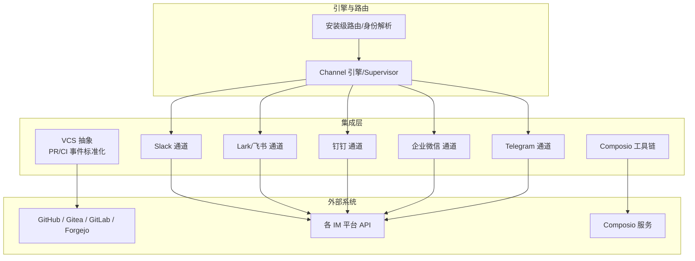
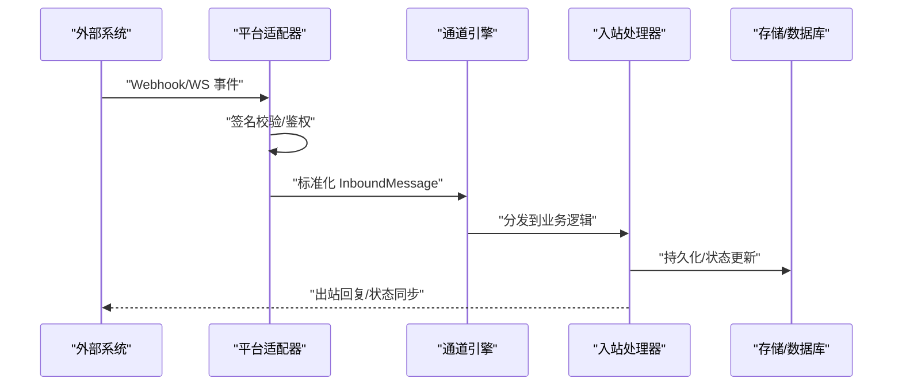
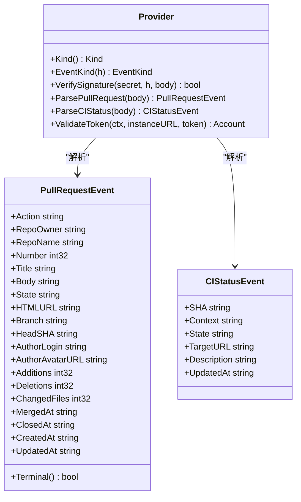
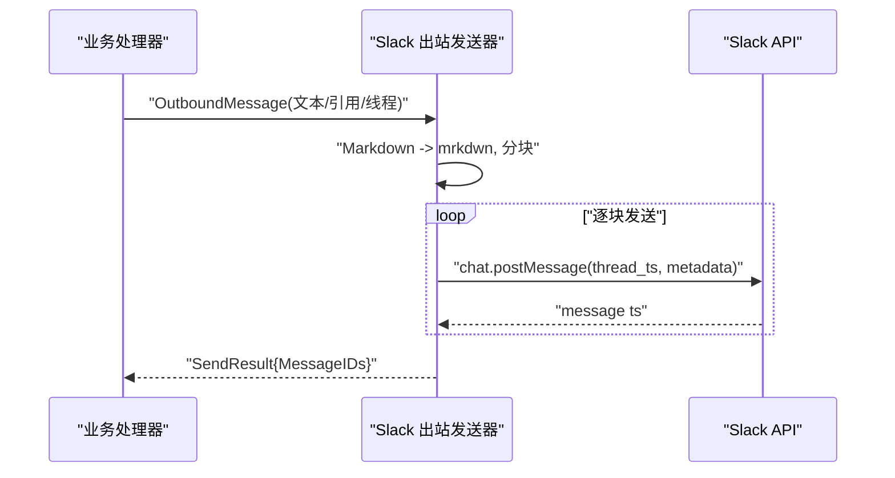
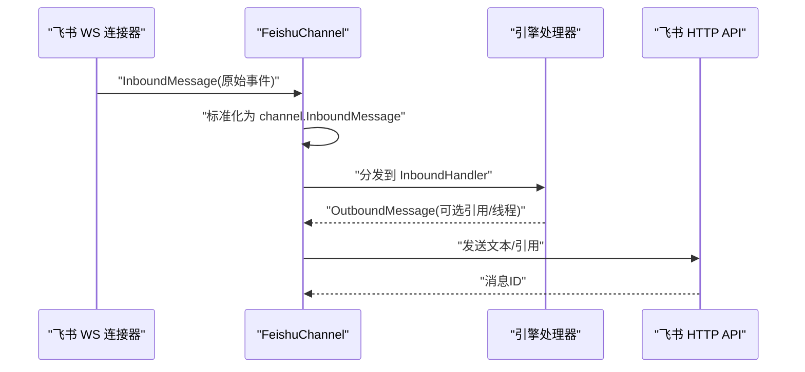
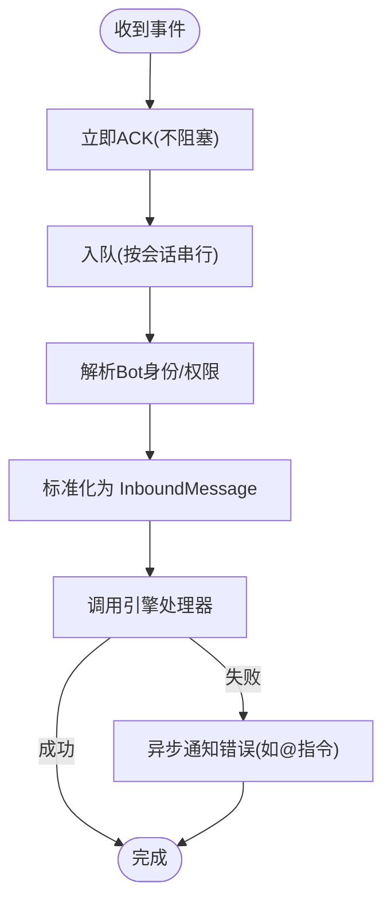
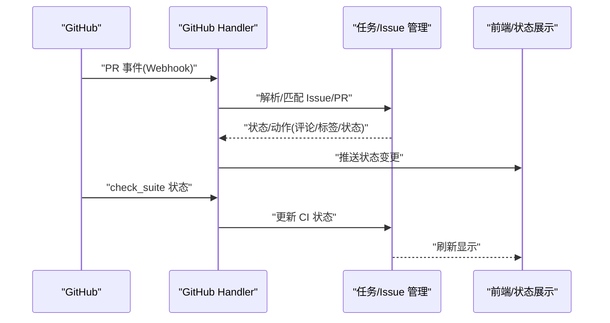
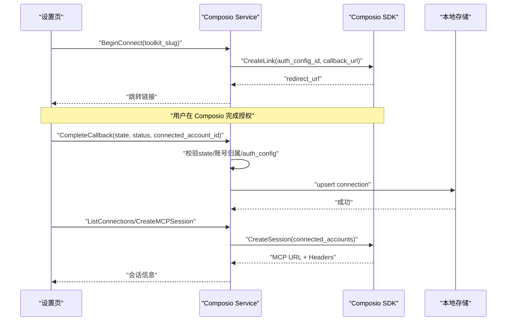
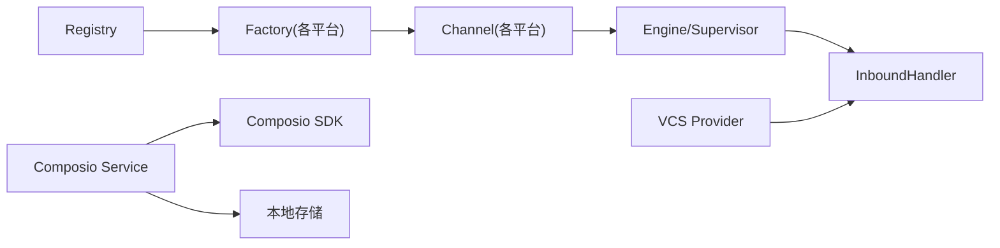

# 外部集成

<cite>
**本文引用的文件**
- [vcs.go](file://server/internal/integrations/vcs/vcs.go)
- [service.go](file://server/internal/integrations/composio/service.go)
- [channel.go](file://server/internal/integrations/slack/channel.go)
- [feishu_channel.go](file://server/internal/integrations/lark/feishu_channel.go)
- [dingtalk_channel.go](file://server/internal/integrations/dingtalk/dingtalk_channel.go)
</cite>

## 目录
1. [简介](#简介)
2. [项目结构](#项目结构)
3. [核心组件](#核心组件)
4. [架构总览](#架构总览)
5. [详细组件分析](#详细组件分析)
6. [依赖关系分析](#依赖关系分析)
7. [性能考虑](#性能考虑)
8. [故障排查指南](#故障排查指南)
9. [结论](#结论)
10. [附录](#附录)

## 简介
本文件面向“外部集成”主题，系统性说明 Multica 在后端如何对接 GitHub、聊天工具（Slack、飞书/Lark、钉钉、企业微信、Telegram）、版本控制系统（VCS）以及第三方工具链 Composio。内容覆盖：
- GitHub 集成的 PR 监控、自动更新与状态同步机制（含 VCS 抽象与 GitHub 专用处理边界）
- 聊天工具的通道抽象、入站事件解析、出站消息发送、长连接与会话管理
- VCS 的通用设计与多平台适配（Forgejo/Gitea/GitLab），以及与 GitHub 的差异
- Composio 第三方工具链的 OAuth 连接、回调校验、会话创建与 MCP 能力
- Webhook 处理、事件订阅与回调机制
- 自定义集成的开发指南与最佳实践

## 项目结构
后端集成主要位于 server/internal/integrations 下，按平台划分：
- vcs：提供跨平台的 VCS 适配器接口与标准化事件模型（PR、CI 状态）
- slack、lark、dingtalk、wecom、telegram：各聊天平台的通道实现
- composio：第三方工具链连接与 MCP 会话管理
- ghsnapshot：GitHub 快照相关能力（与本主题关联度较低）

**图表来源**
- [vcs.go:1-145](file://server/internal/integrations/vcs/vcs.go#L1-L145)
- [channel.go:1-126](file://server/internal/integrations/slack/channel.go#L1-L126)
- [feishu_channel.go:1-328](file://server/internal/integrations/lark/feishu_channel.go#L1-L328)
- [dingtalk_channel.go:1-365](file://server/internal/integrations/dingtalk/dingtalk_channel.go#L1-L365)

**章节来源**
- [vcs.go:1-145](file://server/internal/integrations/vcs/vcs.go#L1-L145)
- [channel.go:1-126](file://server/internal/integrations/slack/channel.go#L1-L126)
- [feishu_channel.go:1-328](file://server/internal/integrations/lark/feishu_channel.go#L1-L328)
- [dingtalk_channel.go:1-365](file://server/internal/integrations/dingtalk/dingtalk_channel.go#L1-L365)

## 核心组件
- VCS 抽象层：定义 Provider 接口、标准化 PR/CI 事件、签名验证与 Token 校验，屏蔽不同 VCS 差异；GitHub 不在该抽象内，使用独立处理器。
- 聊天通道抽象：统一 InboundMessage/OutboundMessage、能力声明、长连接管理与出站发送；各平台通过 Factory 注册到引擎。
- Composio 服务：负责工具包发现、OAuth 连接握手、回调安全校验、本地连接镜像、MCP 会话创建与鉴权头。

**章节来源**
- [vcs.go:1-145](file://server/internal/integrations/vcs/vcs.go#L1-L145)
- [service.go:1-710](file://server/internal/integrations/composio/service.go#L1-L710)
- [channel.go:1-126](file://server/internal/integrations/slack/channel.go#L1-L126)
- [feishu_channel.go:1-328](file://server/internal/integrations/lark/feishu_channel.go#L1-L328)
- [dingtalk_channel.go:1-365](file://server/internal/integrations/dingtalk/dingtalk_channel.go#L1-L365)

## 架构总览
Multica 的外部集成采用“通道 + 引擎 + 适配器”的分层设计：
- 引擎（Channel Engine/Supervisor）负责发现安装、维护长连接、租约与重连、分发入站事件到统一的 InboundHandler。
- 各平台适配器实现 Channel 接口，将平台事件标准化为 InboundMessage，并将 OutboundMessage 转换为平台 API 调用。
- VCS 抽象提供统一的 PR/CI 事件模型，具体平台实现仅关注签名验证、事件解析与 Token 校验。
- GitHub 因 App/installation 与 check_suite CI 差异较大，单独在 handler 层处理，不纳入 VCS 抽象。

**图表来源**
- [vcs.go:115-132](file://server/internal/integrations/vcs/vcs.go#L115-L132)
- [feishu_channel.go:44-59](file://server/internal/integrations/lark/feishu_channel.go#L44-L59)
- [dingtalk_channel.go:117-143](file://server/internal/integrations/dingtalk/dingtalk_channel.go#L117-L143)
- [channel.go:41-77](file://server/internal/integrations/slack/channel.go#L41-L77)

## 详细组件分析

### VCS 集成（通用设计与 GitHub 边界）
- 抽象目标：为支持 token 鉴权的 Git 平台（Forgejo/Gitea/GitLab）提供统一的事件与鉴权抽象，屏蔽差异。
- 关键类型：
  - Provider 接口：提供 EventKind、VerifySignature、ParsePullRequest、ParseCIStatus、ValidateToken。
  - PullRequestEvent/CIStatusEvent：标准化 PR 与 CI 状态事件字段，Terminal() 用于判定合并/关闭等终态。
- GitHub 边界：GitHub 的 App/installation 模型与 check_suite CI 与其他平台差异显著，因此不在 VCS 抽象中，而是由独立的 GitHub handler 处理。
- 扩展方式：新增平台只需实现 Provider 并在包初始化时注册，即可复用共享的存储、自动链接/关闭与广播逻辑。

**图表来源**
- [vcs.go:115-132](file://server/internal/integrations/vcs/vcs.go#L115-L132)
- [vcs.go:54-108](file://server/internal/integrations/vcs/vcs.go#L54-L108)

**章节来源**
- [vcs.go:1-145](file://server/internal/integrations/vcs/vcs.go#L1-L145)

### Slack 集成
- 通道角色：实现 channel.Channel，负责出站消息发送（chat.postMessage），并支持线程回复与元数据携带。
- 出站策略：将标准 Markdown 转为 mrkdwn，超长消息按字符上限分块发送；返回每条消息的时间戳集合。
- 线程与引用：根据 OutboundMessage.ReplyTo 或 ThreadID 决定 thread_ts，确保回复落在正确线程。
- 能力声明：文本、富卡片、线程回复、引用回复、附件、输入指示器、消息编辑等能力由引擎统一调度。

**图表来源**
- [channel.go:41-77](file://server/internal/integrations/slack/channel.go#L41-L77)
- [channel.go:97-125](file://server/internal/integrations/slack/channel.go#L97-L125)

**章节来源**
- [channel.go:1-126](file://server/internal/integrations/slack/channel.go#L1-L126)

### Lark/飞书 集成
- 通道角色：实现 channel.Channel，基于 WS 长连接接收事件，标准化为 InboundMessage 后交给引擎处理器。
- 连接管理：Connect 阻塞运行，直到上下文取消或连接断开；每安装一个实例对应一个连接，由引擎 Supervisor 管理租约与重连。
- 出站发送：通过 HTTP API 发送文本消息，支持引用回复与线程续接。
- 能力声明：文本、富卡片、线程回复、引用回复、附件、输入指示器、消息编辑。

**图表来源**
- [feishu_channel.go:44-59](file://server/internal/integrations/lark/feishu_channel.go#L44-L59)
- [feishu_channel.go:65-86](file://server/internal/integrations/lark/feishu_channel.go#L65-L86)
- [feishu_channel.go:123-182](file://server/internal/integrations/lark/feishu_channel.go#L123-L182)

**章节来源**
- [feishu_channel.go:1-328](file://server/internal/integrations/lark/feishu_channel.go#L1-L328)

### 钉钉 集成
- 通道角色：每个安装拥有独立的 Stream 连接（AppKey/AppSecret），由引擎 Supervisor 管理生命周期与重连。
- 入站处理：onMessage 快速 ACK，将事件入队至 per-conversation 队列，避免阻塞 Socket 读循环；后续异步解析与规范化。
- 出站发送：支持群聊回复，满足 Channel 接口的 Send。
- 错误反馈：当命令执行失败且已 @机器人，会异步发送内部错误提示，避免用户无响应。

**图表来源**
- [dingtalk_channel.go:117-143](file://server/internal/integrations/dingtalk/dingtalk_channel.go#L117-L143)
- [dingtalk_channel.go:145-210](file://server/internal/integrations/dingtalk/dingtalk_channel.go#L145-L210)
- [dingtalk_channel.go:212-235](file://server/internal/integrations/dingtalk/dingtalk_channel.go#L212-L235)

**章节来源**
- [dingtalk_channel.go:1-365](file://server/internal/integrations/dingtalk/dingtalk_channel.go#L1-L365)

### 企业微信与 Telegram
- 企业微信与 Telegram 同样遵循通道抽象，实现各自的入站解析、出站发送与长连接管理；可参照 Slack/Lark/钉钉的实现模式进行扩展。
- 建议优先复用引擎的 InstallationStore、LeaseStore 与 Supervisor，保证多平台一致的生命周期与可靠性。

[本节为概念性说明，不直接分析具体文件]

### GitHub 集成（PR 监控、自动更新与状态同步）
- 边界说明：GitHub 不在 VCS 抽象中，因其 App/installation 模型与 check_suite CI 与其他平台差异较大，使用独立 handler 处理。
- PR 监控：通过 GitHub Webhook 监听 PR 事件（打开、更新、合并/关闭），在 handler 层解析并映射到内部任务/Issue 的自动链接与状态同步。
- 状态同步：CI 检查套件（check_suite）结果回写至 Issue/PR 状态，保持 UI 与外部平台一致。
- 自动更新：结合 PR 分支与 Commit SHA，触发智能体任务或自动化流程，必要时回写评论或状态。

[本节为概念性说明，未直接分析具体文件]

### Composio 集成（第三方工具链对接）
- 连接流程：BeginConnect 生成带签名的 state，请求 Composio 的 Connect Link；浏览器跳转完成后回调 CompleteCallback。
- 安全校验：回调中校验 state 签名、时间窗口、connected_account_id 归属与 auth_config_id 一致性，防止跨工具绑定。
- 本地镜像：成功后 upsert 本地 user_composio_connection 行，记录 toolkit_slug、auth_config_id、connected_account_id。
- 会话创建：CreateMCPSession 基于用户活跃连接构建 MCP 会话，返回 URL 与鉴权头（x-api-key 等）。
- 工具包发现：动态从 Composio 获取 enabled auth configs，缓存短 TTL；仅暴露可连接的工具包列表。

**图表来源**
- [service.go:230-279](file://server/internal/integrations/composio/service.go#L230-L279)
- [service.go:281-338](file://server/internal/integrations/composio/service.go#L281-L338)
- [service.go:400-451](file://server/internal/integrations/composio/service.go#L400-L451)
- [service.go:486-558](file://server/internal/integrations/composio/service.go#L486-L558)
- [service.go:560-709](file://server/internal/integrations/composio/service.go#L560-L709)

**章节来源**
- [service.go:1-710](file://server/internal/integrations/composio/service.go#L1-L710)

## 依赖关系分析
- 通道与引擎：各平台适配器通过 Registry 注册，引擎根据安装配置构建 Channel 实例并管理生命周期。
- VCS 与处理器：Provider 接口解耦平台差异，handler 层消费标准化事件，实现自动链接与状态同步。
- Composio 与存储：Service 依赖 SDK 与 Store 接口，便于测试注入 fake；本地连接镜像与活跃连接查询由 Store 提供。
- 外部依赖：Slack/Lark/DingTalk/Wecom/Telegram 各自 API；GitHub/Gitea/GitLab/Forgejo 的 Webhook/Stream；Composio 的 OAuth/MCP。

**图表来源**
- [feishu_channel.go:195-231](file://server/internal/integrations/lark/feishu_channel.go#L195-L231)
- [dingtalk_channel.go:315-365](file://server/internal/integrations/dingtalk/dingtalk_channel.go#L315-L365)
- [vcs.go:134-145](file://server/internal/integrations/vcs/vcs.go#L134-L145)
- [service.go:72-93](file://server/internal/integrations/composio/service.go#L72-L93)

**章节来源**
- [feishu_channel.go:195-231](file://server/internal/integrations/lark/feishu_channel.go#L195-L231)
- [dingtalk_channel.go:315-365](file://server/internal/integrations/dingtalk/dingtalk_channel.go#L315-L365)
- [vcs.go:134-145](file://server/internal/integrations/vcs/vcs.go#L134-L145)
- [service.go:72-93](file://server/internal/integrations/composio/service.go#L72-L93)

## 性能考虑
- 长连接与重连：各通道使用 WS/Stream 长连接，引擎负责租约与重连，避免频繁建立连接开销。
- 入站队列：钉钉按会话串行队列，避免阻塞 Socket 读循环，提升吞吐与稳定性。
- 消息分块：Slack 超长消息分块发送，避免单条超限导致失败。
- 缓存策略：Composio 的 auth config 映射短 TTL 缓存，减少上游查询压力。
- 幂等与去重：回调与连接操作具备幂等设计，重复回调不会重复写入；事件去重由引擎与平台侧共同保障。

[本节提供一般性指导，无需特定文件分析]

## 故障排查指南
- 签名与鉴权失败：
  - VCS：VerifySignature 失败通常由于 secret 不匹配或头部缺失；检查连接配置的密钥与平台签名算法。
  - Composio：CompleteCallback 校验 state 签名、时间窗口与账号归属；若 ErrAccountVerification，检查回调参数与 auth_config 是否一致。
- 长连接异常：
  - 通道：Connect 返回错误或上下文取消，检查网络、证书、租户区域与权限；引擎会自动重连，关注日志中的重连次数。
- 出站失败：
  - Slack：PostMessage 失败可能因权限不足或频道不存在；检查 bot token 与频道 ID。
  - Lark/钉钉：发送文本/引用失败需检查安装凭证与对话 ID。
- 回调重复：
  - 幂等设计确保重复回调不产生副作用；若出现重复写入，检查主键约束与 Upsert 逻辑。

**章节来源**
- [vcs.go:39-42](file://server/internal/integrations/vcs/vcs.go#L39-L42)
- [service.go:32-49](file://server/internal/integrations/composio/service.go#L32-L49)
- [channel.go:49-77](file://server/internal/integrations/slack/channel.go#L49-L77)
- [feishu_channel.go:65-86](file://server/internal/integrations/lark/feishu_channel.go#L65-L86)
- [dingtalk_channel.go:117-143](file://server/internal/integrations/dingtalk/dingtalk_channel.go#L117-L143)

## 结论
Multica 的外部集成以“通道抽象 + 引擎管理 + 平台适配器”为核心，实现了聊天工具与 VCS 的统一接入；GitHub 因差异较大单独处理。Composio 提供了第三方工具链的动态发现与安全连接能力。整体设计强调幂等、安全与可扩展性，便于新增平台与工具的快速集成。

[本节为总结性内容，无需特定文件分析]

## 附录
- 自定义集成开发指南：
  - 新增聊天平台：实现 Channel 接口，注册到 Registry；遵循引擎的安装发现与租约管理。
  - 新增 VCS 平台：实现 Provider 接口，注册到 VCS 包；关注签名验证、事件解析与 Token 校验。
  - 新增第三方工具：参考 Composio 模式，实现连接握手、回调校验、本地镜像与会话创建。
- 最佳实践：
  - 严格校验签名与权限，避免越权绑定。
  - 使用幂等写入与去重机制，确保回调与重连安全。
  - 合理分块与超时控制，提升稳定性与用户体验。
  - 对敏感信息进行脱敏与最小化日志输出。

[本节为概念性说明，不直接分析具体文件]