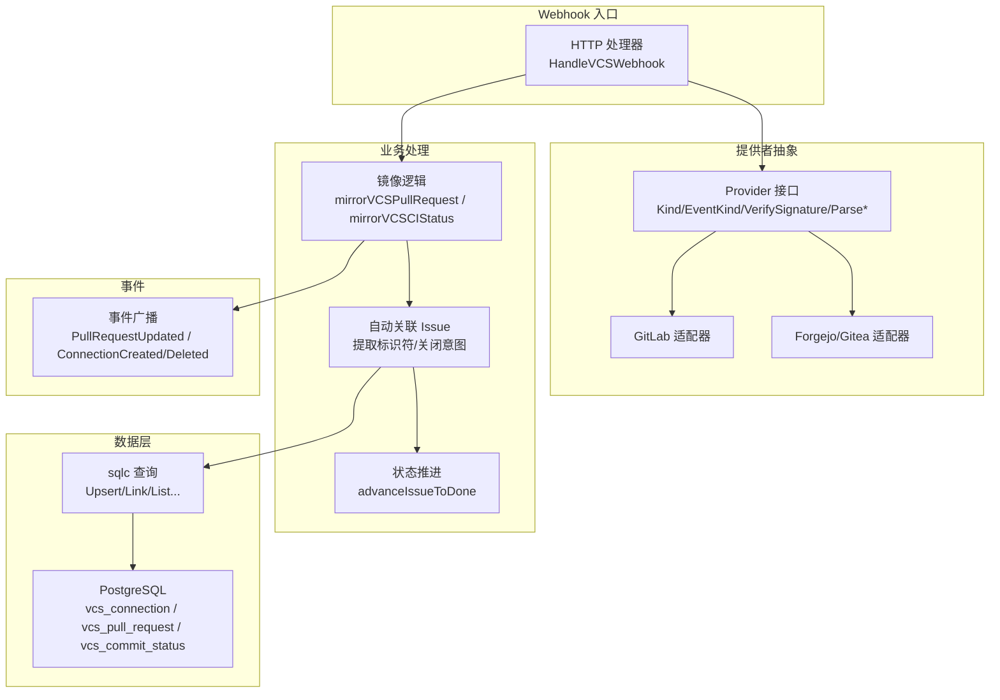
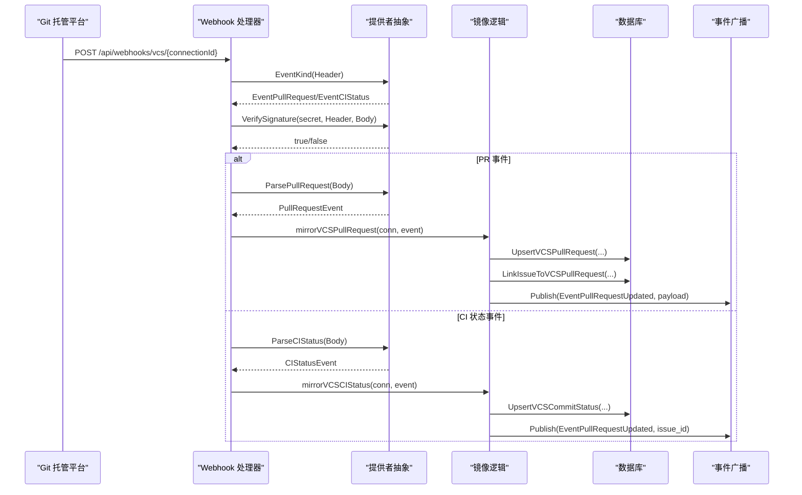
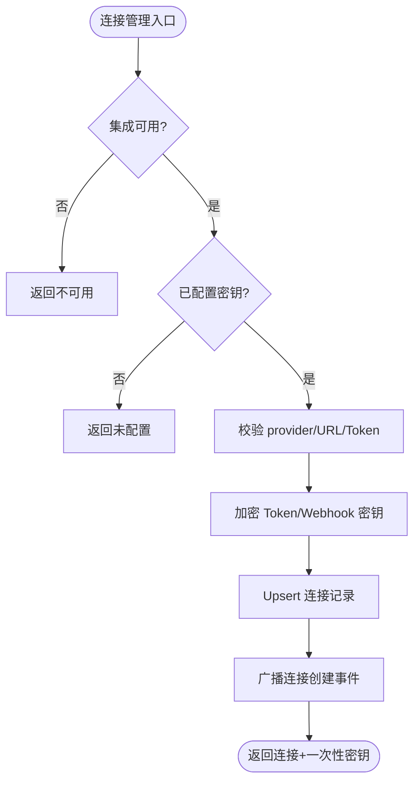
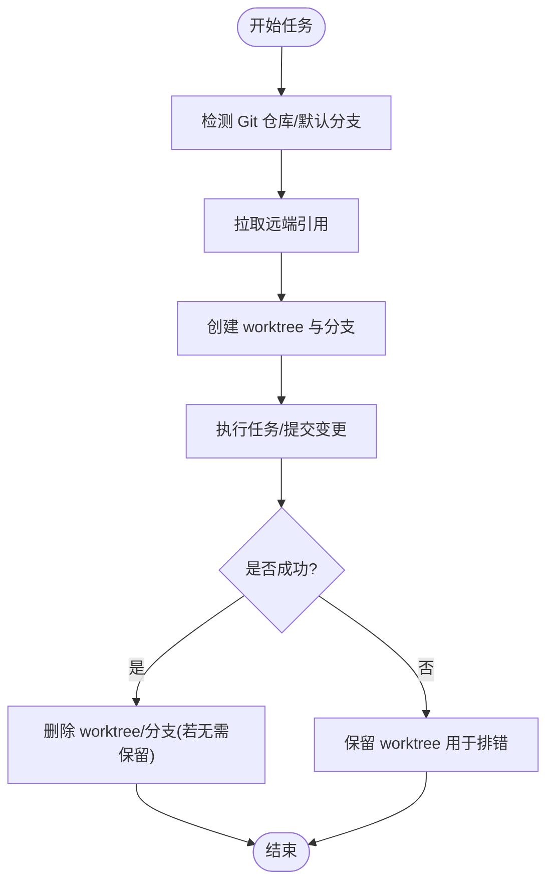
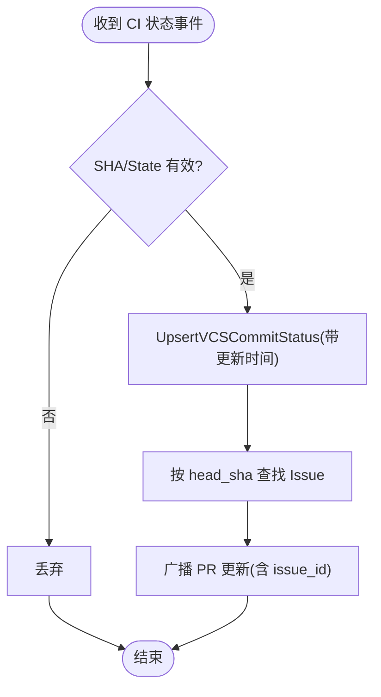
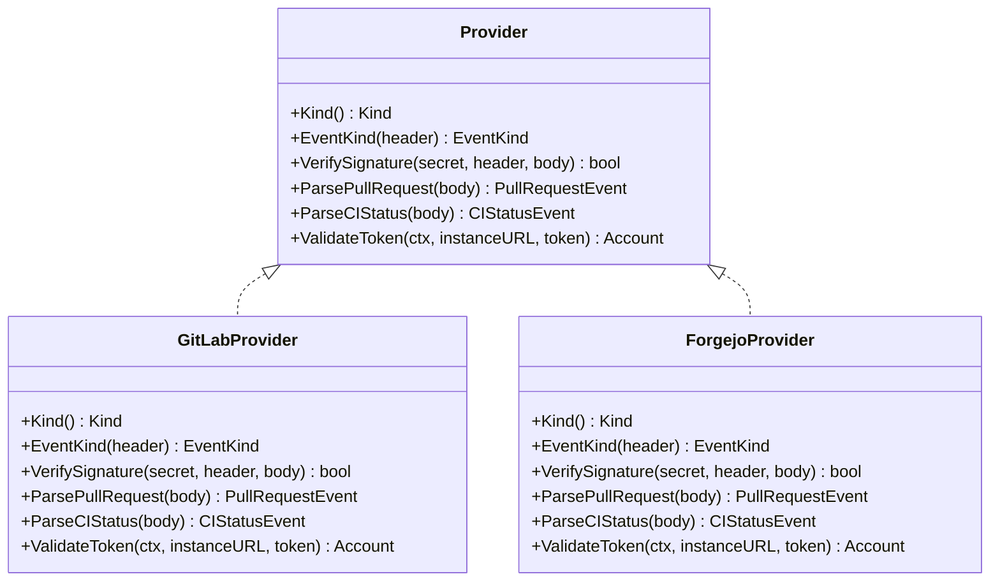
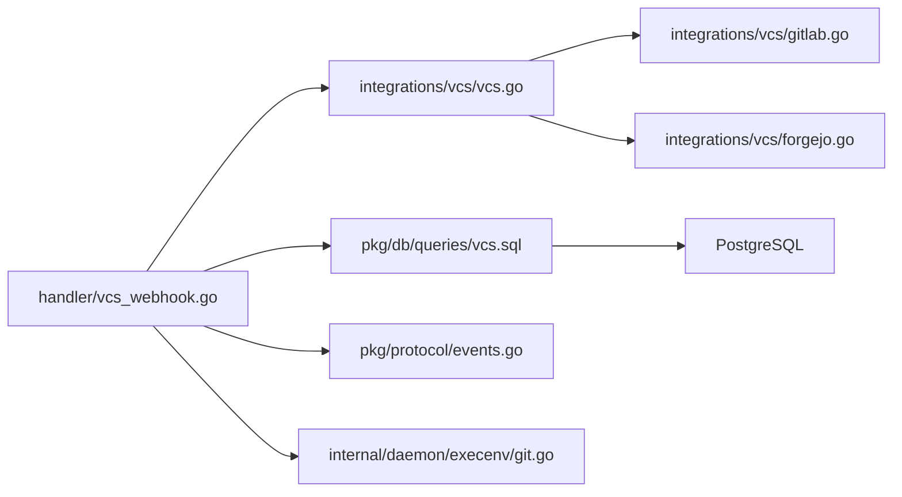

# 版本控制系统集成

<cite>
**本文引用的文件**
- [vcs.go](file://server/internal/integrations/vcs/vcs.go)
- [gitlab.go](file://server/internal/integrations/vcs/gitlab.go)
- [forgejo.go](file://server/internal/integrations/vcs/forgejo.go)
- [vcs.go](file://server/internal/handler/vcs.go)
- [vcs_webhook.go](file://server/internal/handler/vcs_webhook.go)
- [vcs.sql](file://server/pkg/db/queries/vcs.sql)
- [216_vcs_integration.up.sql](file://server/migrations/216_vcs_integration.up.sql)
- [events.go](file://server/pkg/protocol/events.go)
- [git.go](file://server/internal/daemon/execenv/git.go)
- [project-resources.mdx](file://apps/docs/content/docs/project-resources.mdx)
- [vcs-integration.zh.mdx](file://apps/docs/content/docs/vcs-integration.zh.mdx)
</cite>

## 目录
1. [简介](#简介)
2. [项目结构](#项目结构)
3. [核心组件](#核心组件)
4. [架构总览](#架构总览)
5. [详细组件分析](#详细组件分析)
6. [依赖关系分析](#依赖关系分析)
7. [性能考虑](#性能考虑)
8. [故障排查指南](#故障排查指南)
9. [结论](#结论)
10. [附录](#附录)

## 简介
本文件面向“版本控制系统（VCS）集成”的通用设计与实现，覆盖仓库连接管理、分支跟踪与提交历史同步、代码变更检测、智能提示生成、自动化工作流触发，以及与 AI 代理的协作模式（代码审查、问题定位与修复建议）。同时提供配置方法、安全考虑、性能优化建议，以及自定义 VCS 适配器的开发指南。

## 项目结构
后端采用 Go + Chi 路由，数据库为 PostgreSQL；VCS 集成以“提供者抽象 + 处理器层 + Webhook 接收 + 数据持久化 + 事件广播”的分层方式组织：
- 提供者抽象：统一 Pull Request / CI 状态等事件模型，屏蔽不同托管平台差异
- 处理器层：连接管理、Webhook 鉴权与分发、自动关联 Issue、状态推进
- Webhook 接收：按连接 ID 路由到对应提供者进行签名校验与事件解析
- 数据持久化：通过 sqlc 生成的查询，存储连接、PR、CI 状态及索引
- 事件广播：将 PR 更新、连接生命周期事件推送到前端/订阅者
- 执行环境：守护进程使用 git worktree 隔离任务工作区，负责分支创建、提交、清理

图表来源
- [vcs_webhook.go:86-156](file://server/internal/handler/vcs_webhook.go#L86-L156)
- [vcs.go:117-132](file://server/internal/integrations/vcs/vcs.go#L117-L132)
- [gitlab.go:27-47](file://server/internal/integrations/vcs/gitlab.go#L27-L47)
- [vcs.sql:14-30](file://server/pkg/db/queries/vcs.sql#L14-L30)
- [events.go:176-178](file://server/pkg/protocol/events.go#L176-L178)

章节来源
- [vcs_webhook.go:86-156](file://server/internal/handler/vcs_webhook.go#L86-L156)
- [vcs.go:117-132](file://server/internal/integrations/vcs/vcs.go#L117-L132)
- [gitlab.go:27-47](file://server/internal/integrations/vcs/gitlab.go#L27-L47)
- [vcs.sql:14-30](file://server/pkg/db/queries/vcs.sql#L14-L30)
- [events.go:176-178](file://server/pkg/protocol/events.go#L176-L178)

## 核心组件
- 提供者抽象与注册表：定义 Provider 接口、事件分类、标准化数据结构，并通过包级注册表按 Kind 获取具体实现
- Webhook 处理器：按连接 ID 查找连接、解密密钥、调用提供者进行签名验证与事件分类，再进入共享镜像逻辑
- 镜像逻辑：将 PR 与 CI 状态写入数据库，自动关联 Issue，维护 close_intent/reference_only/preserve_close_intent，并在合并/关闭时推进 Issue 状态
- 连接管理 API：列出/创建/删除连接，旋转 Webhook 密钥，加密存储访问令牌与密钥
- 数据模型与查询：vcs_connection、vcs_pull_request、vcs_commit_status 三张表，配合 sqlc 生成 Upsert/Link/List 等查询
- 事件系统：连接创建/删除、PR 更新等事件广播给前端或订阅者
- 执行环境 Git 工具：worktree 创建/删除、默认分支探测、排除规则、分支名清理等

章节来源
- [vcs.go:117-132](file://server/internal/integrations/vcs/vcs.go#L117-L132)
- [vcs_webhook.go:86-156](file://server/internal/handler/vcs_webhook.go#L86-L156)
- [vcs_webhook.go:158-283](file://server/internal/handler/vcs_webhook.go#L158-L283)
- [vcs.go:107-245](file://server/internal/handler/vcs.go#L107-L245)
- [vcs.sql:14-66](file://server/pkg/db/queries/vcs.sql#L14-L66)
- [216_vcs_integration.up.sql:23-65](file://server/migrations/216_vcs_integration.up.sql#L23-L65)
- [events.go:176-178](file://server/pkg/protocol/events.go#L176-L178)
- [git.go:76-118](file://server/internal/daemon/execenv/git.go#L76-L118)

## 架构总览
下图展示从 Webhook 到达、提供者鉴权与解析、到镜像入库、Issue 自动关联与状态推进、再到事件广播的完整流程。

图表来源
- [vcs_webhook.go:86-156](file://server/internal/handler/vcs_webhook.go#L86-L156)
- [vcs_webhook.go:158-283](file://server/internal/handler/vcs_webhook.go#L158-L283)
- [vcs_webhook.go:285-321](file://server/internal/handler/vcs_webhook.go#L285-L321)
- [vcs.go:117-132](file://server/internal/integrations/vcs/vcs.go#L117-L132)
- [gitlab.go:27-47](file://server/internal/integrations/vcs/gitlab.go#L27-L47)

## 详细组件分析

### 仓库连接管理与安全
- 支持提供者：Forgejo、Gitea、GitLab（GitHub 走独立路径）
- 连接信息：workspace_id、provider、instance_url、account_login、access_token_encrypted、webhook_secret_encrypted
- 安全存储：访问令牌与 Webhook 密钥均以 base64 编码的 secretbox 密文存储，解密由服务启动时注入的密钥完成
- 连接生命周期：
  - 列表：仅返回非敏感字段，附带可用性与配置状态
  - 连接：校验实例 URL 与令牌有效性，生成一次性明文 Webhook 密钥并加密保存，成功后广播连接创建事件
  - 删除：原子清理关联 PR、链接、CI 状态后删除连接，广播删除事件
  - 旋转密钥：重新生成并加密保存新的 Webhook 密钥，返回一次性明文密钥供用户配置到托管平台

图表来源
- [vcs.go:107-245](file://server/internal/handler/vcs.go#L107-L245)
- [216_vcs_integration.up.sql:23-36](file://server/migrations/216_vcs_integration.up.sql#L23-L36)
- [events.go:176-178](file://server/pkg/protocol/events.go#L176-L178)

章节来源
- [vcs.go:107-245](file://server/internal/handler/vcs.go#L107-L245)
- [216_vcs_integration.up.sql:23-36](file://server/migrations/216_vcs_integration.up.sql#L23-L36)
- [events.go:176-178](file://server/pkg/protocol/events.go#L176-L178)

### 分支跟踪与工作区隔离
- 每个任务在 WorkspacesRoot 下拥有独立的 env root，代码从共享裸缓存 checkout 出 git worktree
- 同一 (agent, issue) 的多轮通过 PriorWorkDir 复用同一 workdir，不同任务并行隔离
- 分支命名与冲突处理：
  - 基于任务 ID 的短键构建唯一分支名，避免 Windows MAX_PATH 限制
  - 若分支名冲突，追加时间戳重试
  - 只继续 Multica 拥有的分支（依据所有权记录），确保后续运行可续接
- 工作区清理：
  - 成功完成后删除 worktree 与分支（除非该分支承载了之前运行的工作）
  - 失败或部分失败保留 worktree，便于调试与恢复

图表来源
- [git.go:34-99](file://server/internal/daemon/execenv/git.go#L34-L99)
- [git.go:101-118](file://server/internal/daemon/execenv/git.go#L101-L118)
- [git.go:186-216](file://server/internal/daemon/execenv/git.go#L186-L216)
- [project-resources.mdx:85-87](file://apps/docs/content/docs/project-resources.mdx#L85-L87)

章节来源
- [git.go:34-99](file://server/internal/daemon/execenv/git.go#L34-L99)
- [git.go:101-118](file://server/internal/daemon/execenv/git.go#L101-L118)
- [git.go:186-216](file://server/internal/daemon/execenv/git.go#L186-L216)
- [project-resources.mdx:85-87](file://apps/docs/content/docs/project-resources.mdx#L85-L87)

### 提交历史同步与 CI 状态镜像
- PR 事件：
  - 去重与幂等：基于 connection_id/repo_owner/repo_name/pr_number 的唯一约束进行 upsert
  - 乱序保护：比较事件时间与持久化时间，避免旧事件覆盖新状态
  - 自动关联 Issue：从标题、正文、分支中提取 Issue 标识符，建立 link 并设置 reference_only/close_intent/preserve_close_intent
  - 状态推进：当 PR 合并/关闭且满足条件时，推进 Issue 至 done/cancelled
- CI 状态事件：
  - 规范化状态：passed/failed/pending
  - 单调性保护：使用事件时间戳作为单调性守卫，防止重放导致回退
  - 关联 Issue：根据 head_sha 查找关联 Issue 并广播更新

图表来源
- [vcs_webhook.go:285-321](file://server/internal/handler/vcs_webhook.go#L285-L321)
- [gitlab.go:160-203](file://server/internal/integrations/vcs/gitlab.go#L160-L203)

章节来源
- [vcs_webhook.go:158-283](file://server/internal/handler/vcs_webhook.go#L158-L283)
- [vcs_webhook.go:285-321](file://server/internal/handler/vcs_webhook.go#L285-L321)
- [gitlab.go:160-203](file://server/internal/integrations/vcs/gitlab.go#L160-L203)

### 代码变更检测、智能提示与自动化工作流
- 代码变更检测：
  - 通过 PR 事件中的 additions/deletions/changed_files 统计变更规模
  - 通过 head_sha 与 CI 状态映射到具体提交，结合 Issue 上下文进行变更追踪
- 智能提示生成：
  - 在 PR 列表与 Issue 详情中聚合检查结论（通过 SQL 聚合 counts），前端据此呈现通过/失败/进行中状态
- 自动化工作流触发：
  - PR 合并/关闭时，若满足关闭意图且无开放 PR，则推进 Issue 状态
  - 连接生命周期事件（创建/删除）广播，驱动 UI 刷新与权限/可见性调整

章节来源
- [vcs_webhook.go:158-283](file://server/internal/handler/vcs_webhook.go#L158-L283)
- [vcs_webhook.go:285-321](file://server/internal/handler/vcs_webhook.go#L285-L321)
- [events.go:176-178](file://server/pkg/protocol/events.go#L176-L178)

### 与 AI 代理的协作模式
- 代码审查：
  - PR 与 Issue 的自动关联使 AI 代理能基于 Issue 上下文理解变更目的
  - CI 状态与检查结论反馈到 PR 卡片，辅助代理判断质量门禁
- 问题定位：
  - 通过 head_sha 与 CI 状态反查失败原因，结合 Issue 描述快速定位
- 修复建议：
  - 工作区隔离与分支续接保证代理在多轮对话中基于最新基线增量修改，避免覆盖用户改动
  - 失败时保留 worktree，便于代理读取冲突与日志进行修复

章节来源
- [project-resources.mdx:85-87](file://apps/docs/content/docs/project-resources.mdx#L85-L87)
- [vcs_webhook.go:158-283](file://server/internal/handler/vcs_webhook.go#L158-L283)

### 配置方法与接入步骤
- 在托管平台创建具备读取权限的访问令牌
- 在 Multica 设置中填写实例地址与令牌，完成连接并复制一次性 Webhook 密钥
- 在托管平台注册 Webhook，指向 Multica 提供的 Webhook 地址，并启用相应事件（PR、Pipeline/MR 事件）
- 如需轮换密钥，可通过旋转接口重新生成并配置到托管平台

章节来源
- [vcs-integration.zh.mdx:44-72](file://apps/docs/content/docs/vcs-integration.zh.mdx#L44-L72)
- [vcs.go:153-245](file://server/internal/handler/vcs.go#L153-L245)

### 安全考虑
- 令牌与密钥加密存储：使用 secretbox 加密，仅在内存中解密
- Webhook 鉴权：
  - Forgejo/Gitea：HMAC-SHA256 签名校验
  - GitLab：明文 token 比对（常量时间比较）
- 部署边界：云托管默认禁用 VCS 集成，避免暴露未配置能力
- 最小权限：仅授予必要读取权限的令牌

章节来源
- [216_vcs_integration.up.sql:1-12](file://server/migrations/216_vcs_integration.up.sql#L1-L12)
- [vcs.go:80-101](file://server/internal/handler/vcs.go#L80-L101)
- [gitlab.go:38-47](file://server/internal/integrations/vcs/gitlab.go#L38-L47)
- [vcs.go:47-55](file://server/internal/handler/vcs.go#L47-L55)

### 性能优化建议
- 数据库索引：对连接、PR、CI 状态表建立二级索引，提升查询效率（迁移中单独 CREATE INDEX CONCURRENTLY）
- 事件单调性：使用事件时间戳而非 ingestion time，减少重放导致的回退与重复计算
- 批量操作：删除连接时原子清理关联数据，避免多次往返
- 资源隔离：worktree 并行执行，避免锁竞争

章节来源
- [216_vcs_integration.up.sql:14-21](file://server/migrations/216_vcs_integration.up.sql#L14-L21)
- [vcs_webhook.go:191-204](file://server/internal/handler/vcs_webhook.go#L191-L204)
- [vcs.sql:32-55](file://server/pkg/db/queries/vcs.sql#L32-L55)

### 自定义 VCS 适配器开发指南
- 实现 Provider 接口：
  - Kind：返回提供者类型字符串（如 forgejo/gitea/gitlab）
  - EventKind：根据 HTTP 头识别事件类别（PR/CI/其他）
  - VerifySignature：实现签名校验（HMAC 或明文 token）
  - ParsePullRequest/ParseCIStatus：将平台特定 JSON 映射为标准事件结构
  - ValidateToken：校验令牌并返回账户登录名
- 注册适配器：在包 init 中调用 register，使其加入全局注册表
- 注意事项：
  - 保持适配器无状态、轻量构造
  - 时间格式需转换为 RFC3339，以配合单调性守卫
  - 对未知事件应返回 EventOther 并确认接收，避免平台标记失败

图表来源
- [vcs.go:117-132](file://server/internal/integrations/vcs/vcs.go#L117-L132)
- [gitlab.go:21-47](file://server/internal/integrations/vcs/gitlab.go#L21-L47)
- [forgejo.go:1-200](file://server/internal/integrations/vcs/forgejo.go#L1-L200)

章节来源
- [vcs.go:117-132](file://server/internal/integrations/vcs/vcs.go#L117-L132)
- [gitlab.go:21-47](file://server/internal/integrations/vcs/gitlab.go#L21-L47)
- [forgejo.go:1-200](file://server/internal/integrations/vcs/forgejo.go#L1-L200)

## 依赖关系分析
- 处理器依赖提供者抽象，解耦平台差异
- 镜像逻辑依赖 sqlc 查询，直接操作数据库
- 事件系统与协议层解耦，便于扩展
- 执行环境与 Git CLI 交互，不耦合上层业务

图表来源
- [vcs_webhook.go:86-156](file://server/internal/handler/vcs_webhook.go#L86-L156)
- [vcs.go:117-132](file://server/internal/integrations/vcs/vcs.go#L117-L132)
- [gitlab.go:21-47](file://server/internal/integrations/vcs/gitlab.go#L21-L47)
- [vcs.sql:14-66](file://server/pkg/db/queries/vcs.sql#L14-L66)
- [events.go:176-178](file://server/pkg/protocol/events.go#L176-L178)
- [git.go:76-118](file://server/internal/daemon/execenv/git.go#L76-L118)

章节来源
- [vcs_webhook.go:86-156](file://server/internal/handler/vcs_webhook.go#L86-L156)
- [vcs.go:117-132](file://server/internal/integrations/vcs/vcs.go#L117-L132)
- [gitlab.go:21-47](file://server/internal/integrations/vcs/gitlab.go#L21-L47)
- [vcs.sql:14-66](file://server/pkg/db/queries/vcs.sql#L14-L66)
- [events.go:176-178](file://server/pkg/protocol/events.go#L176-L178)
- [git.go:76-118](file://server/internal/daemon/execenv/git.go#L76-L118)

## 性能考虑
- 使用并发安全的索引创建（CONCURRENTLY）避免锁表
- 事件时间戳参与单调性比较，减少重放影响
- 删除连接时原子清理子表，降低多次事务开销
- worktree 并行执行，避免任务间干扰

[本节为通用指导，不直接分析具体文件]

## 故障排查指南
- Webhook 鉴权失败：
  - 检查 Webhook 密钥是否与托管平台配置一致
  - 查看签名校验返回值与错误码
- 事件乱序或回退：
  - 确认事件时间戳是否正确传递与解析
  - 检查持久化时间与事件时间的比较逻辑
- 连接删除后数据不一致：
  - 确认原子清理语句是否执行成功
  - 检查关联表是否有遗漏清理
- 工作区残留：
  - 检查 worktree 删除与分支删除命令输出
  - 必要时手动清理 refs/multica/local-state/*

章节来源
- [vcs_webhook.go:128-136](file://server/internal/handler/vcs_webhook.go#L128-L136)
- [vcs_webhook.go:191-204](file://server/internal/handler/vcs_webhook.go#L191-L204)
- [vcs.sql:32-55](file://server/pkg/db/queries/vcs.sql#L32-L55)
- [git.go:101-118](file://server/internal/daemon/execenv/git.go#L101-L118)

## 结论
本集成通过提供者抽象与统一的镜像逻辑，实现了多 VCS 平台的 PR 与 CI 状态同步、Issue 自动关联与状态推进，并结合守护进程的 worktree 机制保障任务隔离与分支续接。安全上采用加密存储与严格鉴权，性能上利用索引与单调性守卫优化。开发者可按接口规范扩展新的 VCS 适配器，快速接入更多托管平台。

## 附录
- 配置参考：详见文档中的连接与 Webhook 注册步骤
- 数据模型：vcs_connection、vcs_pull_request、vcs_commit_status 及其索引
- 事件清单：连接创建/删除、PR 更新等

[本节为补充说明，不直接分析具体文件]