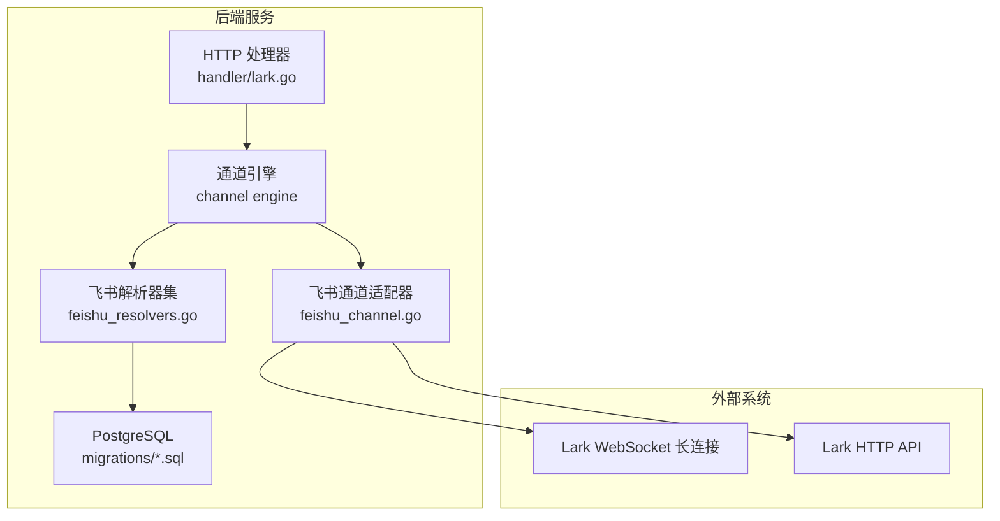
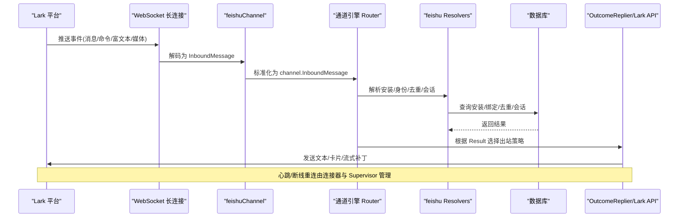
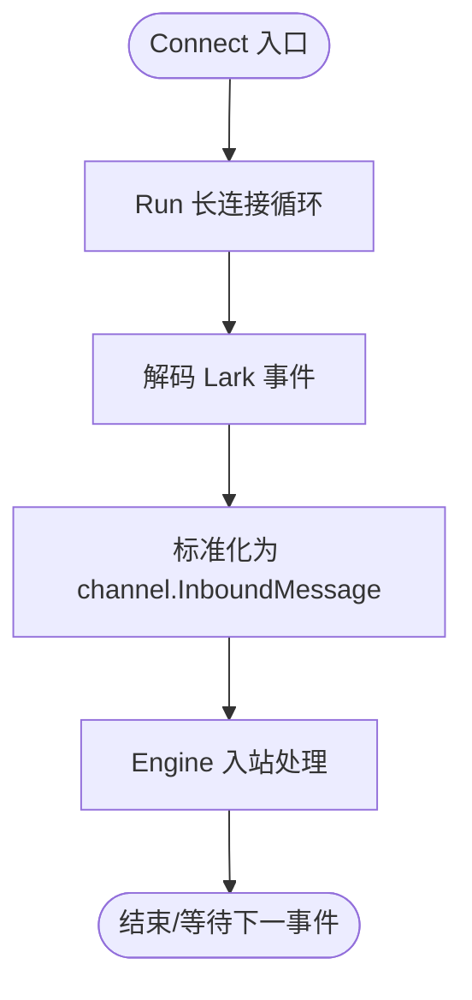
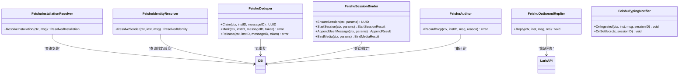
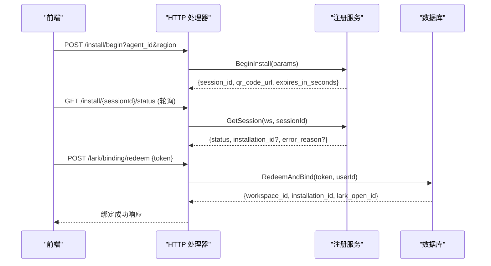
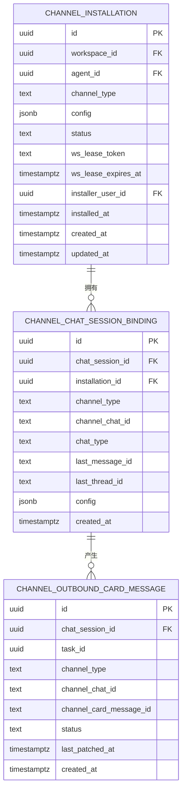
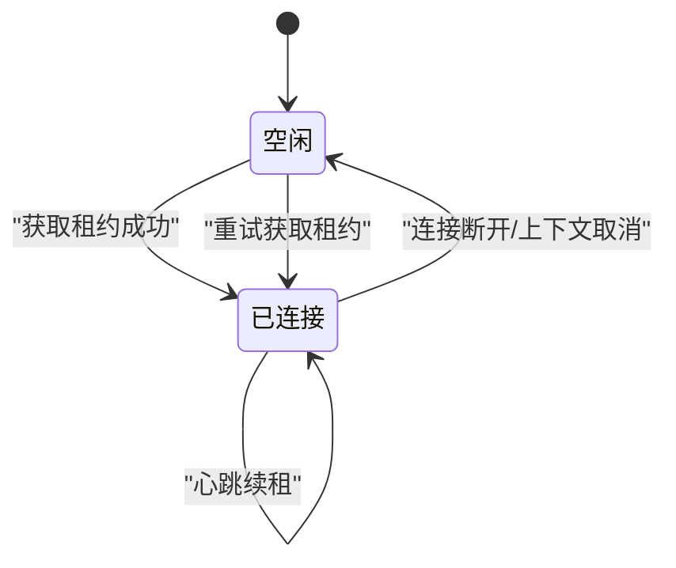
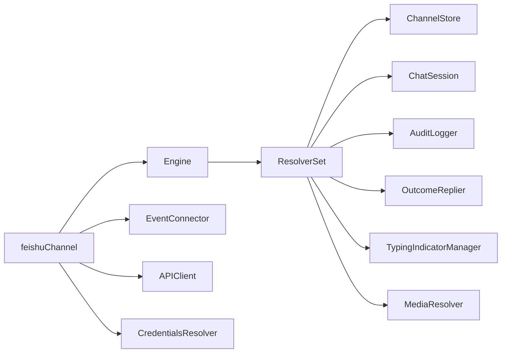

# Lark（飞书）集成

<cite>
**本文引用的文件**
- [server/internal/integrations/lark/feishu_channel.go](file://server/internal/integrations/lark/feishu_channel.go)
- [server/internal/integrations/lark/feishu_resolvers.go](file://server/internal/integrations/lark/feishu_resolvers.go)
- [server/internal/integrations/lark/feishu_types.go](file://server/internal/integrations/lark/feishu_types.go)
- [server/internal/handler/lark.go](file://server/internal/handler/lark.go)
- [packages/core/types/lark.ts](file://packages/core/types/lark.ts)
- [apps/docs/content/docs/lark-bot-integration.zh.mdx](file://apps/docs/content/docs/lark-bot-integration.zh.mdx)
- [server/migrations/109_lark_integration.up.sql](file://server/migrations/109_lark_integration.up.sql)
- [server/migrations/124_channel_generalization.up.sql](file://server/migrations/124_channel_generalization.up.sql)
- [server/pkg/db/queries/channel.sql](file://server/pkg/db/queries/channel.sql)
- [server/pkg/protocol/events.go](file://server/pkg/protocol/events.go)
</cite>

## 目录
1. [简介](#简介)
2. [项目结构](#项目结构)
3. [核心组件](#核心组件)
4. [架构总览](#架构总览)
5. [详细组件分析](#详细组件分析)
6. [依赖关系分析](#依赖关系分析)
7. [性能考量](#性能考量)
8. [故障排除指南](#故障排除指南)
9. [结论](#结论)
10. [附录](#附录)

## 简介
本文件面向需要在 Multica 中集成 Lark（飞书）的开发者与运维人员，覆盖从应用创建、权限申请、事件订阅、机器人配置到消息处理、用户身份映射、群组管理、历史同步、WebSocket 长连接、区域配置、审计日志、类型定义与测试方法等全链路内容。文档同时提供完整的集成示例与常见问题排查建议，帮助快速落地并稳定运行。

## 项目结构
Lark 集成在后端以“通道适配器 + 引擎”的方式实现：
- 通道适配器 feishuChannel 负责与 Lark 的 WebSocket 长连接和 HTTP API 交互，将平台事件标准化为跨平台 InboundMessage，并通过 Engine 路由到统一的消息处理管线。
- ResolverSet 提供安装解析、身份绑定、去重、会话绑定、审计、出站回复、输入状态指示等能力。
- Handler 暴露 REST 接口用于安装流程（设备流扫码）、绑定令牌兑换、安装列表与撤销等。
- 数据库迁移定义了安装表、聊天会话绑定、卡片消息映射、入站审计等持久化模型。
- 前端类型定义与文档页面描述了安装流程、首次使用、管理与自托管配置。

图表来源
- [server/internal/handler/lark.go:61-107](file://server/internal/handler/lark.go#L61-L107)
- [server/internal/integrations/lark/feishu_channel.go:20-32](file://server/internal/integrations/lark/feishu_channel.go#L20-L32)
- [server/internal/integrations/lark/feishu_resolvers.go:16-23](file://server/internal/integrations/lark/feishu_resolvers.go#L16-L23)
- [server/migrations/109_lark_integration.up.sql:1-16](file://server/migrations/109_lark_integration.up.sql#L1-L16)

章节来源
- [server/internal/handler/lark.go:61-107](file://server/internal/handler/lark.go#L61-L107)
- [server/internal/integrations/lark/feishu_channel.go:20-32](file://server/internal/integrations/lark/feishu_channel.go#L20-L32)
- [server/internal/integrations/lark/feishu_resolvers.go:16-23](file://server/internal/integrations/lark/feishu_resolvers.go#L16-L23)
- [server/migrations/109_lark_integration.up.sql:1-16](file://server/migrations/109_lark_integration.up.sql#L1-L16)

## 核心组件
- 飞书通道适配器（feishuChannel）
  - 职责：维护 Lark 长连接、解码事件、标准化为 channel.InboundMessage、调用 Engine 处理；通过 Lark HTTP API 发送文本回复。
  - 关键点：Connect 阻塞运行直到上下文取消或连接断开；Send 仅走文本路径，富文本/卡片/流式补丁由 Patcher/OutcomeReplier 处理；Capabilities 声明支持的能力集合。
- 飞书解析器集（ResolverSet）
  - 职责：按平台语义完成安装解析、身份绑定、去重、会话绑定、审计、出站回复、输入状态指示、媒体引用绑定。
  - 关键点：通过 Raw 字段保留平台特有信息；会话隔离键根据群聊话题（thread）组合生成；审计只记录路由/身份/丢弃原因，不记录消息体。
- HTTP 处理器（handler/lark.go）
  - 职责：安装流程（设备流扫码开始与状态轮询）、绑定令牌兑换、安装列表查询、安装撤销；发布工作区事件以驱动前端刷新。
  - 关键点：权限校验基于“智能体所有者/工作区 owner/admin”；region 参数限制为 feishu/lark；绑定令牌兑换在事务内消费并建立映射。
- 数据模型与迁移
  - 职责：安装表、聊天会话绑定、卡片消息映射、入站审计、成员绑定短令牌等。
  - 关键点：app_secret 加密存储；唯一索引按 channel_type + app_id 作用域；会话绑定区分 p2p/group 与 thread。

章节来源
- [server/internal/integrations/lark/feishu_channel.go:44-98](file://server/internal/integrations/lark/feishu_channel.go#L44-L98)
- [server/internal/integrations/lark/feishu_resolvers.go:43-66](file://server/internal/integrations/lark/feishu_resolvers.go#L43-L66)
- [server/internal/handler/lark.go:179-253](file://server/internal/handler/lark.go#L179-L253)
- [server/migrations/124_channel_generalization.up.sql:90-120](file://server/migrations/124_channel_generalization.up.sql#L90-L120)
- [server/migrations/124_channel_generalization.up.sql:158-189](file://server/migrations/124_channel_generalization.up.sql#L158-L189)
- [server/migrations/124_channel_generalization.up.sql:247-276](file://server/migrations/124_channel_generalization.up.sql#L247-L276)

## 架构总览
下图展示了从 Lark 事件到达、标准化、身份校验、会话路由、任务执行到出站回复的完整流程，以及安装/绑定管理的控制面。

图表来源
- [server/internal/integrations/lark/feishu_channel.go:46-59](file://server/internal/integrations/lark/feishu_channel.go#L46-L59)
- [server/internal/integrations/lark/feishu_resolvers.go:70-117](file://server/internal/integrations/lark/feishu_resolvers.go#L70-L117)
- [server/migrations/124_channel_generalization.up.sql:90-120](file://server/migrations/124_channel_generalization.up.sql#L90-L120)

## 详细组件分析

### 飞书通道适配器（feishuChannel）
- Connect：启动 Lark 长连接接收事件，将每个事件标准化后交给 Engine 的 InboundHandler；错误仅在连接层传播。
- Send：通过 Lark HTTP API 发送文本回复；富文本、卡片、流式更新由其他路径处理。
- Capabilities：声明支持文本、富文本卡片、线程回复、引用回复、附件、输入状态指示、消息编辑等能力。
- 凭据解析：从 per-installation config 解密 app_secret，组装 Region/TenantKey 等。

图表来源
- [server/internal/integrations/lark/feishu_channel.go:46-59](file://server/internal/integrations/lark/feishu_channel.go#L46-L59)
- [server/internal/integrations/lark/feishu_channel.go:123-172](file://server/internal/integrations/lark/feishu_channel.go#L123-L172)

章节来源
- [server/internal/integrations/lark/feishu_channel.go:44-98](file://server/internal/integrations/lark/feishu_channel.go#L44-L98)
- [server/internal/integrations/lark/feishu_channel.go:100-121](file://server/internal/integrations/lark/feishu_channel.go#L100-L121)
- [server/internal/integrations/lark/feishu_channel.go:123-182](file://server/internal/integrations/lark/feishu_channel.go#L123-L182)

### 飞书解析器集（ResolverSet）
- 安装解析：根据事件中的 app_id 定位安装行，检查是否 active。
- 身份绑定：通过 open_id 查找绑定，确认是否为工作区成员。
- 去重：Claim/Mark/Release 保证同一消息在同一安装下只被处理一次。
- 会话绑定：按 chat_id 或 chat_id:thread 作为绑定键，确保群聊话题级会话隔离。
- 审计：对丢弃事件记录安装、聊天、事件类型、消息 ID、丢弃原因和时间戳，不记录消息体。
- 出站回复：将 Engine Result 转换为 DispatchResult，交由 OutcomeReplier 决定具体回复形态。
- 输入状态指示：在入站处理后添加 typing 指示，并在无任务时清理。

图表来源
- [server/internal/integrations/lark/feishu_resolvers.go:70-117](file://server/internal/integrations/lark/feishu_resolvers.go#L70-L117)
- [server/internal/integrations/lark/feishu_resolvers.go:119-153](file://server/internal/integrations/lark/feishu_resolvers.go#L119-L153)
- [server/internal/integrations/lark/feishu_resolvers.go:155-265](file://server/internal/integrations/lark/feishu_resolvers.go#L155-L265)
- [server/internal/integrations/lark/feishu_resolvers.go:267-335](file://server/internal/integrations/lark/feishu_resolvers.go#L267-L335)

章节来源
- [server/internal/integrations/lark/feishu_resolvers.go:43-66](file://server/internal/integrations/lark/feishu_resolvers.go#L43-L66)
- [server/internal/integrations/lark/feishu_resolvers.go:70-117](file://server/internal/integrations/lark/feishu_resolvers.go#L70-L117)
- [server/internal/integrations/lark/feishu_resolvers.go:119-153](file://server/internal/integrations/lark/feishu_resolvers.go#L119-L153)
- [server/internal/integrations/lark/feishu_resolvers.go:155-265](file://server/internal/integrations/lark/feishu_resolvers.go#L155-L265)
- [server/internal/integrations/lark/feishu_resolvers.go:267-335](file://server/internal/integrations/lark/feishu_resolvers.go#L267-L335)

### HTTP 处理器与安装流程
- 列出安装：返回工作区内所有 Lark 安装，包含 region、status、时间戳等；标注 configured/install_supported 以便前端控制 UI。
- 撤销安装：将安装状态置为 revoked，后续长连接会被断开；保留行用于审计。
- 开始安装（设备流）：生成 QR 码 URL，前端轮询状态；支持 region 参数（feishu/lark）。
- 安装状态轮询：返回 pending/success/error，成功时附带 installation_id。
- 绑定令牌兑换：用户在飞书中收到绑定链接，登录后提交 token，服务端在事务内消费并建立 (open_id ↔ user) 映射。

图表来源
- [server/internal/handler/lark.go:61-107](file://server/internal/handler/lark.go#L61-L107)
- [server/internal/handler/lark.go:109-177](file://server/internal/handler/lark.go#L109-L177)
- [server/internal/handler/lark.go:255-359](file://server/internal/handler/lark.go#L255-L359)
- [server/internal/handler/lark.go:361-439](file://server/internal/handler/lark.go#L361-L439)
- [server/internal/handler/lark.go:179-253](file://server/internal/handler/lark.go#L179-L253)

章节来源
- [server/internal/handler/lark.go:61-107](file://server/internal/handler/lark.go#L61-L107)
- [server/internal/handler/lark.go:109-177](file://server/internal/handler/lark.go#L109-L177)
- [server/internal/handler/lark.go:179-253](file://server/internal/handler/lark.go#L179-L253)
- [server/internal/handler/lark.go:255-359](file://server/internal/handler/lark.go#L255-L359)
- [server/internal/handler/lark.go:361-439](file://server/internal/handler/lark.go#L361-L439)

### 数据模型与持久化
- 安装表：按 channel_type=feishu 存储 app_id、加密的 app_secret、tenant_key、bot_open_id、region 等；唯一索引按 (channel_type, app_id)。
- 聊天会话绑定：记录 chat_session_id、installation_id、channel_chat_id、chat_type、last_message_id、last_thread_id 等，用于出站路由与线程回复。
- 卡片消息映射：task/message 级别映射，避免多轮任务互相覆盖。
- 入站审计：仅记录路由/身份/丢弃原因/时间戳，不记录消息体。

图表来源
- [server/migrations/124_channel_generalization.up.sql:90-120](file://server/migrations/124_channel_generalization.up.sql#L90-L120)
- [server/migrations/124_channel_generalization.up.sql:158-189](file://server/migrations/124_channel_generalization.up.sql#L158-L189)
- [server/migrations/124_channel_generalization.up.sql:247-276](file://server/migrations/124_channel_generalization.up.sql#L247-L276)

章节来源
- [server/migrations/124_channel_generalization.up.sql:90-120](file://server/migrations/124_channel_generalization.up.sql#L90-L120)
- [server/migrations/124_channel_generalization.up.sql:158-189](file://server/migrations/124_channel_generalization.up.sql#L158-L189)
- [server/migrations/124_channel_generalization.up.sql:247-276](file://server/migrations/124_channel_generalization.up.sql#L247-L276)
- [server/migrations/109_lark_integration.up.sql:1-16](file://server/migrations/109_lark_integration.up.sql#L1-L16)

### 用户身份映射、群组管理与消息历史同步
- 身份映射：通过 open_id 查找绑定，校验工作区成员资格；非成员无法使用 Bot。
- 群组管理：会话隔离键在群聊中为 chat_id:thread，确保不同话题独立会话；出站路由通过 binding.config 中的 chat_id 回发。
- 历史同步：入站消息经去重后进入会话；任务完成后通过卡片消息映射进行流式/最终补丁；typing 指示在入站后显示，在无任务时清理。

章节来源
- [server/internal/integrations/lark/feishu_resolvers.go:96-117](file://server/internal/integrations/lark/feishu_resolvers.go#L96-L117)
- [server/internal/integrations/lark/feishu_resolvers.go:187-209](file://server/internal/integrations/lark/feishu_resolvers.go#L187-L209)
- [server/pkg/db/queries/channel.sql:458-483](file://server/pkg/db/queries/channel.sql#L458-L483)

### WebSocket 长连接：连接建立、心跳保持与断线重连
- 连接建立：feishuChannel.Connect 调用 EventConnector.Run，传入安装信息与回调函数，将事件标准化后交给 Engine 处理。
- 心跳保持：Supervisor 通过 LeaseStore 维护每安装的 WS 租约；TryAcquire/Renew/Release 由 PostgreSQL 实现，结合超时与扫描机制保证单实例持有。
- 断线重连：当连接断开或上下文取消时，Supervisor 会重新尝试获取租约并重建连接；配置变更（如密钥旋转）导致指纹变化时会强制重连。

图表来源
- [server/internal/integrations/lark/feishu_channel.go:257-310](file://server/internal/integrations/lark/feishu_channel.go#L257-L310)
- [server/internal/integrations/lark/feishu_channel.go:315-327](file://server/internal/integrations/lark/feishu_channel.go#L315-L327)

章节来源
- [server/internal/integrations/lark/feishu_channel.go:46-59](file://server/internal/integrations/lark/feishu_channel.go#L46-L59)
- [server/internal/integrations/lark/feishu_channel.go:257-310](file://server/internal/integrations/lark/feishu_channel.go#L257-L310)
- [server/internal/integrations/lark/feishu_channel.go:315-327](file://server/internal/integrations/lark/feishu_channel.go#L315-L327)

### 区域配置、审计日志、类型定义与测试方法
- 区域配置：安装时支持 region=feishu/lark；Handler 严格校验 region；前端据此渲染正确的控制台跳转与徽章。
- 审计日志：入站审计表仅记录路由/身份/丢弃原因/时间戳，不记录消息体；适合合规与排障。
- 类型定义：前端 types/lark.ts 定义了安装、安装流程、绑定令牌响应等类型，与后端响应保持一致且兼容旧版本。
- 测试方法：
  - 单元测试：feishu_channel_test.go、feishu_resolvers_test.go 验证通道适配与解析逻辑。
  - 处理器测试：lark_test.go 验证安装流程与绑定令牌兑换。
  - 文档与行为一致性：apps/docs 中的 lark-bot-integration.zh.mdx 描述用户流程，应与实现一致。

章节来源
- [server/internal/handler/lark.go:255-359](file://server/internal/handler/lark.go#L255-L359)
- [packages/core/types/lark.ts:1-77](file://packages/core/types/lark.ts#L1-L77)
- [apps/docs/content/docs/lark-bot-integration.zh.mdx:1-95](file://apps/docs/content/docs/lark-bot-integration.zh.mdx#L1-L95)

## 依赖关系分析
- 组件耦合：
  - feishuChannel 依赖 EventConnector、APIClient、CredentialsResolver 与 Engine 的 InboundHandler。
  - ResolverSet 依赖 ChannelStore、ChatSession、AuditLogger、OutcomeReplier、TypingIndicatorManager、MediaResolver。
  - Handler 依赖 LarkInstallations、LarkRegistration、LarkBindingTokens、Queries 与工作区权限。
- 外部依赖：
  - Lark WebSocket 长连接与 HTTP API。
  - PostgreSQL 用于安装、绑定、会话、卡片映射与审计。
- 潜在循环依赖：
  - 通过 Engine 抽象解耦平台差异，避免直接耦合；Adapter 与 Resolver 边界清晰。

图表来源
- [server/internal/integrations/lark/feishu_channel.go:184-231](file://server/internal/integrations/lark/feishu_channel.go#L184-L231)
- [server/internal/integrations/lark/feishu_resolvers.go:43-66](file://server/internal/integrations/lark/feishu_resolvers.go#L43-L66)

章节来源
- [server/internal/integrations/lark/feishu_channel.go:184-231](file://server/internal/integrations/lark/feishu_channel.go#L184-L231)
- [server/internal/integrations/lark/feishu_resolvers.go:43-66](file://server/internal/integrations/lark/feishu_resolvers.go#L43-L66)

## 性能考量
- 去重与并发：入站去重通过 Claim/Mark/Release 保证幂等，避免重复处理。
- 会话隔离：按 chat_id 或 chat_id:thread 隔离会话，减少上下文污染与锁竞争。
- 长连接租约：PostgreSQL 实现的租约机制避免多副本重复持有连接；指纹变化触发重连，保障凭据轮换安全。
- 出站补丁：卡片消息映射按 task/message 级别，避免多轮任务互相覆盖。
- 输入状态指示：及时清理 typing 指示，避免残留影响用户体验。

[本节为通用性能讨论，无需特定文件分析]

## 故障排除指南
- 没有绑定按钮：
  - 检查是否具备智能体所有者/工作区 owner/admin 权限。
  - 确认自托管密钥 MULTICA_LARK_SECRET_KEY 已配置；未配置时 install_supported=false，前端隐藏入口。
- 二维码失效：
  - 重新发起安装流程；设备流会话过期需重新生成。
- Bot 要求绑定账号：
  - 打开绑定链接并使用该工作区的 Multica 账号登录；绑定成功后再发消息。
- Bot 不执行：
  - 检查智能体是否归档、运行时是否在线；查看入站审计表确认消息是否被丢弃及原因。
- 长连接异常：
  - 检查租约是否被正确获取与续租；若凭据旋转，确认指纹变化后连接已重建。
- 区域问题：
  - 确认 region 参数为 feishu/lark；新连接目前仅开放中国大陆版飞书，已有国际版 Lark 连接仍可继续使用。

章节来源
- [apps/docs/content/docs/lark-bot-integration.zh.mdx:65-95](file://apps/docs/content/docs/lark-bot-integration.zh.mdx#L65-L95)
- [server/internal/handler/lark.go:61-107](file://server/internal/handler/lark.go#L61-L107)
- [server/internal/handler/lark.go:255-359](file://server/internal/handler/lark.go#L255-L359)
- [server/internal/handler/lark.go:179-253](file://server/internal/handler/lark.go#L179-L253)

## 结论
Multica 的 Lark 集成采用“通道适配器 + 引擎”的架构，实现了跨平台的统一消息处理与出站策略。通过严格的身份绑定、会话隔离、去重与审计，保障了消息处理的可靠性与可观测性。WebSocket 长连接配合租约机制确保了高可用与可扩展性。结合清晰的安装流程与前端类型定义，团队可以快速完成集成并稳定运行。

[本节为总结性内容，无需特定文件分析]

## 附录
- 事件广播：工作区事件（如安装创建/撤销）通过 protocol 事件广播，驱动前端刷新安装列表与状态。
- 参考文档：apps/docs 中的 lark-bot-integration.zh.mdx 提供了用户侧的安装与使用说明，便于产品与运营对齐。

章节来源
- [server/pkg/protocol/events.go:197-218](file://server/pkg/protocol/events.go#L197-L218)
- [apps/docs/content/docs/lark-bot-integration.zh.mdx:1-95](file://apps/docs/content/docs/lark-bot-integration.zh.mdx#L1-L95)