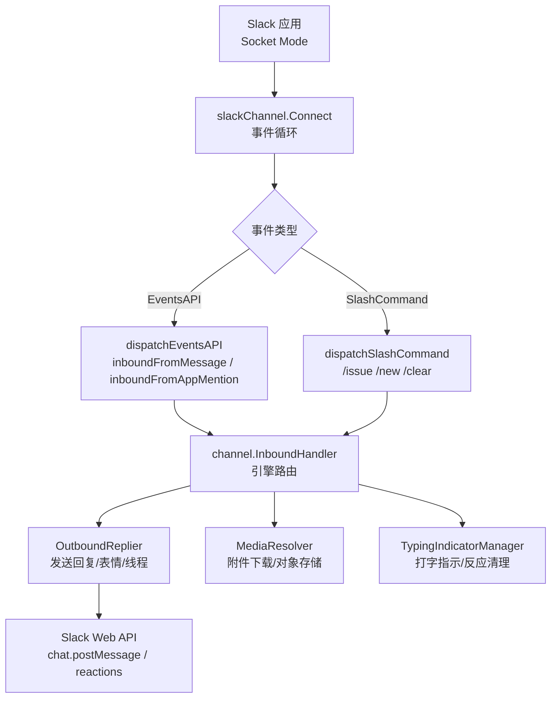
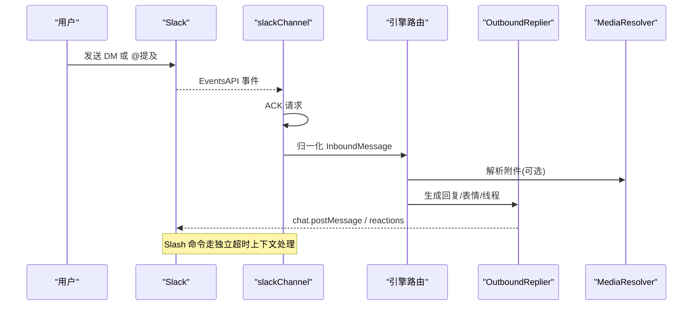
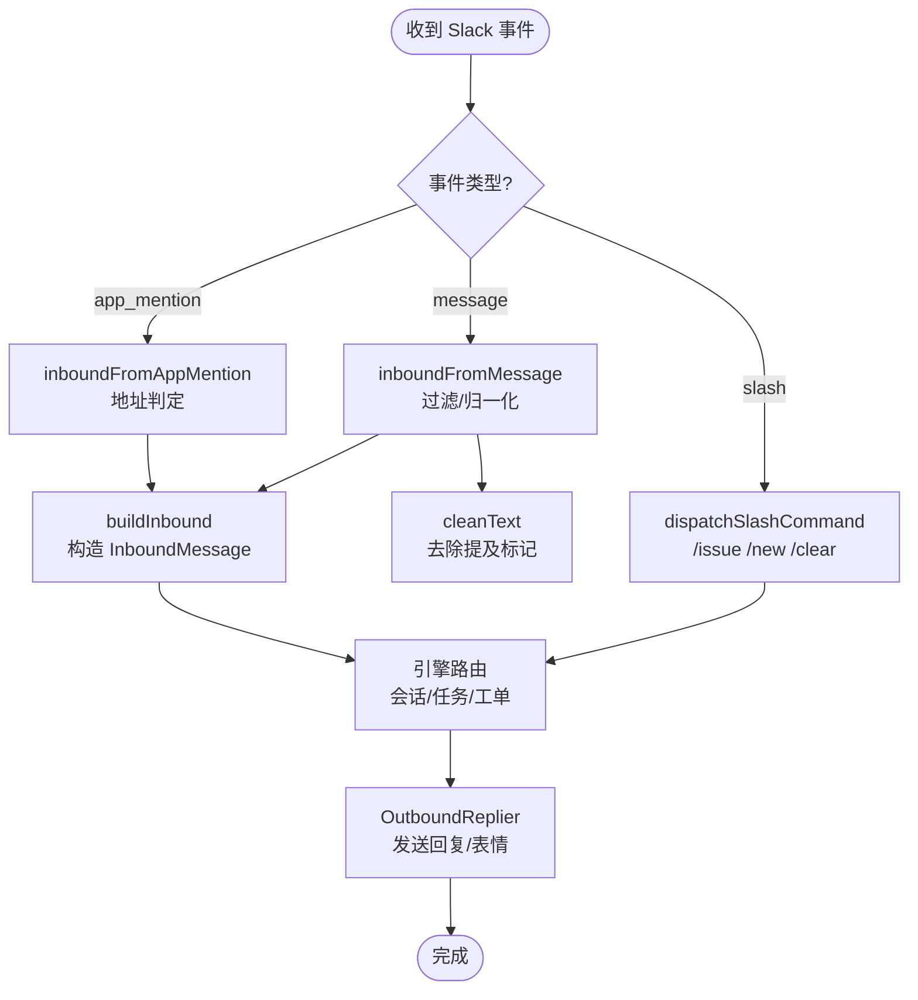
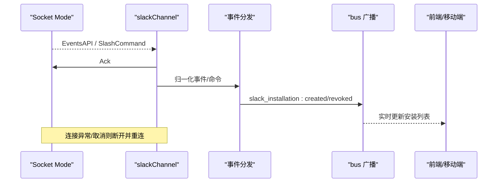
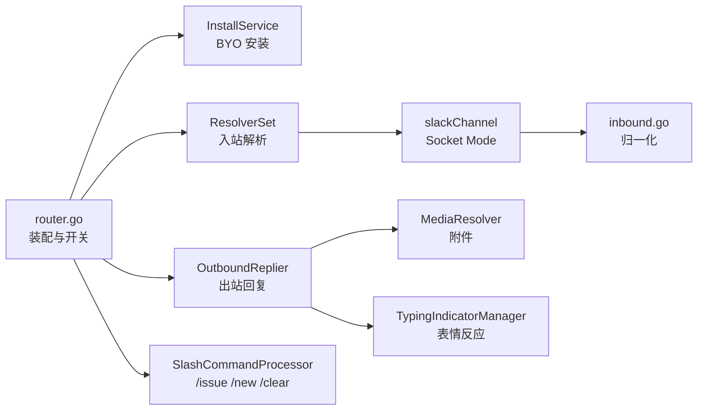

# Slack 集成

<cite>
**本文引用的文件**
- [apps/docs/content/docs/slack-bot-integration.mdx](file://apps/docs/content/docs/slack-bot-integration.mdx)
- [server/cmd/server/router.go](file://server/cmd/server/router.go)
- [server/internal/handler/slack.go](file://server/internal/handler/slack.go)
- [server/internal/integrations/slack/slack_channel.go](file://server/internal/integrations/slack/slack_channel.go)
- [server/internal/integrations/slack/inbound.go](file://server/internal/integrations/slack/inbound.go)
- [packages/core/types/slack.ts](file://packages/core/types/slack.ts)
- [server/pkg/protocol/events.go](file://server/pkg/protocol/events.go)
- [server/pkg/protocol/messages.go](file://server/pkg/protocol/messages.go)
- [apps/mobile/lib/use-ws-subscriptions.ts](file://apps/mobile/lib/use-ws-subscriptions.ts)
</cite>

## 目录
1. [简介](#简介)
2. [项目结构](#项目结构)
3. [核心组件](#核心组件)
4. [架构总览](#架构总览)
5. [详细组件分析](#详细组件分析)
6. [依赖关系分析](#依赖关系分析)
7. [性能考虑](#性能考虑)
8. [故障排查指南](#故障排查指南)
9. [结论](#结论)
10. [附录](#附录)

## 简介
本文件面向在 Multica 中接入 Slack Bot 的运维与产品人员，覆盖从安装配置、权限与 Webhook（Socket Mode）设置、工作空间绑定，到消息收发、Slash 命令、富文本渲染、文件上传、表情符号支持、用户解析、频道管理、历史同步、实时通信（WebSocket）连接管理与重连机制等全链路实现。文档同时提供安装步骤、配置示例、常见问题排查与性能优化建议，帮助快速落地并稳定运行。

## 项目结构
Slack 集成由“服务端路由与装配”“通道适配器（Socket Mode 连接）”“入站事件归一化”“出站回复与媒体处理”“前端类型与 UI 交互”“实时事件广播”等模块组成：
- 路由与装配：负责读取密钥、初始化绑定令牌服务、出站回复器、输入解析器、Slash 处理器、注册通道工厂与安装服务。
- 通道适配器：每个 Slack 安装维护一个 Socket Mode 长连接，接收 Events API 与 Slash Command，转发至引擎。
- 入站归一化：将 Slack 事件转换为平台无关的 InboundMessage，过滤机器人自发消息、系统事件，提取线程、附件与提及信息。
- 出站与媒体：通过 bot token 发送消息、表情反应、分片与线程回复；可选对象存储用于附件下载与持久化。
- 前端类型：定义安装列表、BYO 安装请求、绑定令牌兑换响应等接口契约。
- 实时事件：安装生命周期事件（创建/撤销）与工作区级广播，驱动前端刷新。

图表来源
- [server/internal/integrations/slack/slack_channel.go:66-175](file://server/internal/integrations/slack/slack_channel.go#L66-L175)
- [server/internal/integrations/slack/inbound.go:84-195](file://server/internal/integrations/slack/inbound.go#L84-L195)
- [server/cmd/server/router.go:736-837](file://server/cmd/server/router.go#L736-L837)

章节来源
- [server/cmd/server/router.go:736-837](file://server/cmd/server/router.go#L736-L837)
- [server/internal/integrations/slack/slack_channel.go:19-64](file://server/internal/integrations/slack/slack_channel.go#L19-L64)
- [server/internal/integrations/slack/inbound.go:20-70](file://server/internal/integrations/slack/inbound.go#L20-L70)

## 核心组件
- Slack 安装与 BYO 接入：管理员粘贴 Bot Token（xoxb-）与 App-level Token（xapp-），后端校验并加密存储，按安装维度建立独立 Socket Mode 连接。
- 绑定令牌与账户绑定：首次 DM 或 @mention 时下发一次性绑定链接，用户登录后将 Slack 用户 ID 绑定到当前 Multica 账户。
- 入站消息处理：过滤机器人消息与系统事件，识别 P2P/群组，提取线程上下文与可下载附件，清洗提及标记。
- Slash 命令：/issue 创建工单，/new 新建会话，/clear 重置上下文；命令在独立超时上下文中执行，避免阻塞事件循环。
- 出站回复与富文本：Markdown→mrkdwn 转换，自动分片与线程回复，支持表情反应（typing indicator）。
- 媒体与附件：仅接受 Slack 托管且可下载的附件，大小限制与数量限制由上层策略控制；未配置对象存储时回退为纯文本。
- 实时事件：安装创建/撤销事件广播，前端订阅后刷新安装列表与状态。

章节来源
- [server/internal/handler/slack.go:17-168](file://server/internal/handler/slack.go#L17-L168)
- [server/internal/integrations/slack/slack_channel.go:43-64](file://server/internal/integrations/slack/slack_channel.go#L43-L64)
- [server/internal/integrations/slack/inbound.go:84-195](file://server/internal/integrations/slack/inbound.go#L84-L195)
- [server/pkg/protocol/events.go:197-218](file://server/pkg/protocol/events.go#L197-L218)

## 架构总览
Slack 集成采用“多租户 BYO + 每安装独立 Socket Mode 连接”的模式：
- 部署层：通过环境变量启用 Slack 集成，加载密钥以解密存储的令牌。
- 通道层：每个安装持有独立的 app-level token 建立 Socket Mode 连接，接收 Events API 与 Slash Command。
- 引擎层：统一 channel 抽象，将 Slack 事件归一化为 InboundMessage，交由引擎路由到会话、任务与工单服务。
- 出站层：OutboundReplier 负责发送回复、表情反应与线程定位；MediaResolver 负责附件下载与对象存储落盘。
- 实时层：安装生命周期事件通过 bus 广播，前端通过 WebSocket 订阅并刷新 UI。

图表来源
- [server/internal/integrations/slack/slack_channel.go:130-175](file://server/internal/integrations/slack/slack_channel.go#L130-L175)
- [server/internal/integrations/slack/inbound.go:84-195](file://server/internal/integrations/slack/inbound.go#L84-L195)
- [server/cmd/server/router.go:787-802](file://server/cmd/server/router.go#L787-L802)

## 详细组件分析

### 安装与配置（OAuth 权限、Webhook、工作空间绑定）
- 权限范围：需包含 app_mentions:read、channels:history、files:read、groups:history、im:history、mpim:history、chat:write、reactions:write、users:read、commands。
- Webhook：使用 Socket Mode，无需公网回调 URL；每个安装使用其自身的 app-level token 建立连接。
- 工作空间绑定：首次交互下发一次性绑定链接，用户登录后完成 Slack 用户与 Multica 账户绑定。
- 环境变量：需要 MULTICA_SLACK_SECRET_KEY 以解密存储的令牌；绑定链接使用 MULTICA_APP_URL（回退 FRONTEND_ORIGIN）。

章节来源
- [apps/docs/content/docs/slack-bot-integration.mdx:21-82](file://apps/docs/content/docs/slack-bot-integration.mdx#L21-L82)
- [apps/docs/content/docs/slack-bot-integration.mdx:170-186](file://apps/docs/content/docs/slack-bot-integration.mdx#L170-L186)
- [server/cmd/server/router.go:736-779](file://server/cmd/server/router.go#L736-L779)

### 消息收发与 Slash 命令
- 入站消息：过滤机器人自发自收与系统事件；识别 P2P 与群组；提取线程与附件；清洗提及标记。
- Slash 命令：/issue 创建工单，/new 新建会话，/clear 重置上下文；命令在独立超时上下文中执行，确保不阻塞事件循环。
- 富文本与表情：Markdown→mrkdwn 转换，自动分片与线程回复；typing indicator 使用表情反应，完成后清理。
- 文件上传：仅接受 Slack 托管且可下载的附件，大小与数量限制由策略控制；未配置对象存储时回退为纯文本。

图表来源
- [server/internal/integrations/slack/inbound.go:84-195](file://server/internal/integrations/slack/inbound.go#L84-L195)
- [server/internal/integrations/slack/slack_channel.go:145-164](file://server/internal/integrations/slack/slack_channel.go#L145-L164)
- [server/cmd/server/router.go:809-826](file://server/cmd/server/router.go#L809-L826)

章节来源
- [server/internal/integrations/slack/inbound.go:84-195](file://server/internal/integrations/slack/inbound.go#L84-L195)
- [server/internal/integrations/slack/slack_channel.go:145-164](file://server/internal/integrations/slack/slack_channel.go#L145-L164)
- [apps/docs/content/docs/slack-bot-integration.mdx:122-163](file://apps/docs/content/docs/slack-bot-integration.mdx#L122-L163)

### 用户解析与频道管理
- 用户解析：通过绑定令牌将 Slack 用户 ID 与 Multica 账户关联；兑换端点区分无效/过期、重复绑定与非成员等错误码。
- 频道管理：DM 直接对话；群聊需邀请 Bot 并 @提及；线程内保持会话隔离；多人群组（mpim）视为群组，需显式 @提及。
- 历史同步：按需拉取会话历史（multica chat history），避免每次入站强制组装；通过安装维度的历史边界记录定位起点。

章节来源
- [server/internal/handler/slack.go:219-282](file://server/internal/handler/slack.go#L219-L282)
- [server/internal/integrations/slack/inbound.go:211-228](file://server/internal/integrations/slack/inbound.go#L211-L228)
- [server/cmd/server/router.go:804-807](file://server/cmd/server/router.go#L804-L807)

### 实时通信（WebSocket）与连接管理
- Socket Mode：每个安装使用自身 app-level token 建立 Socket Mode 连接；连接生命周期由 supervisor 管理，异常或取消即断开并重连。
- 事件处理：EventsAPI 与 Slash Command 均先 ACK，再异步处理；错误传播给 supervisor 触发重连。
- 前端实时：安装生命周期事件（创建/撤销）通过 bus 广播；前端通过 WS 订阅并刷新安装列表。
- 移动端订阅：useWSSubscriptions 封装 ws.on 与生命周期管理，按工作区与依赖数组进行订阅与清理。

图表来源
- [server/internal/integrations/slack/slack_channel.go:66-128](file://server/internal/integrations/slack/slack_channel.go#L66-L128)
- [server/internal/handler/slack.go:170-177](file://server/internal/handler/slack.go#L170-L177)
- [apps/mobile/lib/use-ws-subscriptions.ts:1-51](file://apps/mobile/lib/use-ws-subscriptions.ts#L1-L51)

章节来源
- [server/internal/integrations/slack/slack_channel.go:66-128](file://server/internal/integrations/slack/slack_channel.go#L66-L128)
- [server/internal/handler/slack.go:170-177](file://server/internal/handler/slack.go#L170-L177)
- [apps/mobile/lib/use-ws-subscriptions.ts:1-51](file://apps/mobile/lib/use-ws-subscriptions.ts#L1-L51)

## 依赖关系分析
- 路由装配依赖：secretbox 密钥、数据库查询、任务服务、对象存储、bus 事件总线。
- 通道依赖：Decrypter 解密令牌、Logger、SlashCommandProcessor（可选）、InboundHandler（引擎注入）。
- 出站依赖：OutboundReplier、MediaResolver、TypingIndicatorManager。
- 前端依赖：SlackInstallation 类型契约、WS 订阅封装。

图表来源
- [server/cmd/server/router.go:736-837](file://server/cmd/server/router.go#L736-L837)
- [server/internal/integrations/slack/slack_channel.go:217-269](file://server/internal/integrations/slack/slack_channel.go#L217-L269)
- [server/internal/integrations/slack/inbound.go:20-70](file://server/internal/integrations/slack/inbound.go#L20-L70)

章节来源
- [server/cmd/server/router.go:736-837](file://server/cmd/server/router.go#L736-L837)
- [server/internal/integrations/slack/slack_channel.go:217-269](file://server/internal/integrations/slack/slack_channel.go#L217-L269)

## 性能考虑
- 事件 ACK 优先：对 EventsAPI 与 Slash Command 立即 ACK，避免 Slack 侧丢弃；后续 DB/HTTP 操作在独立上下文执行。
- 超时保护：Slash 命令处理设置固定超时，防止慢查询或外部调用阻塞事件循环。
- 附件过滤：仅保留可下载的 Slack 托管附件，避免无效下载与意图表膨胀。
- 连接管理：每个安装独立 Socket Mode 连接，异常即断开并重连，避免泄漏 goroutine。
- 历史按需拉取：仅在需要时拉取会话历史，减少入站时的组装开销。

[本节为通用指导，不直接分析具体文件]

## 故障排查指南
- 连接失败或令牌无效：检查 Bot Token 与 App-level Token 前缀与来源是否一致；确认已安装到工作空间且具备 users:read 等必要权限。
- 无法验证应用：确认 manifest 包含 users:read 并在更新权限后重新安装应用。
- 无 DM 入口：确认 app_home.messages_tab_enabled 为 true。
- 频道无回复：确认 Bot 已被邀请到频道且消息中包含 @提及。
- Slash 命令不存在：确认 manifest 包含 /issue、/new、/clear 及 commands 作用域；若冲突，使用 @Bot 消息形式绕过。
- 附件未到达：确认 files:read 作用域已添加并重新安装；检查文件大小与数量限制。
- Bot 不运行：检查智能体是否归档以及运行时是否在线。
- 绑定令牌问题：兑换端点返回 410/409/403 分别表示令牌无效/重复绑定/非成员。

章节来源
- [apps/docs/content/docs/slack-bot-integration.mdx:188-196](file://apps/docs/content/docs/slack-bot-integration.mdx#L188-L196)
- [server/internal/handler/slack.go:240-282](file://server/internal/handler/slack.go#L240-L282)

## 结论
Multica 的 Slack 集成通过 BYO 模式与每安装独立 Socket Mode 连接，实现了高隔离、易扩展的渠道接入能力。入站事件归一化、Slash 命令处理、出站回复与媒体解析形成完整闭环；实时事件与前端订阅保证 UI 一致性。遵循本文的安装配置、权限设置与故障排查建议，可在生产环境稳定运行并高效协作。

[本节为总结性内容，不直接分析具体文件]

## 附录

### 安装步骤与配置示例
- 创建 Slack 应用：使用 manifest 创建应用，配置 OAuth scopes、事件订阅与 Socket Mode。
- 获取令牌：复制 Bot User OAuth Token（xoxb-）与 App-level Token（xapp-）。
- 连接到智能体：在 Multica 的智能体集成页面粘贴两个令牌并连接。
- 环境变量：设置 MULTICA_SLACK_SECRET_KEY 以启用加密存储；配置 MULTICA_APP_URL 用于绑定链接。

章节来源
- [apps/docs/content/docs/slack-bot-integration.mdx:19-112](file://apps/docs/content/docs/slack-bot-integration.mdx#L19-L112)
- [apps/docs/content/docs/slack-bot-integration.mdx:170-186](file://apps/docs/content/docs/slack-bot-integration.mdx#L170-L186)

### 前端类型契约
- SlackInstallation：安装元数据（团队 ID、机器人用户 ID、状态、时间戳）。
- ListSlackInstallationsResponse：安装列表与配置标志（configured、install_supported）。
- RegisterSlackBYORequest：BYO 安装请求体（bot_token、app_token）。
- RedeemSlackBindingTokenResponse：绑定兑换结果（workspace_id、installation_id、slack_user_id）。

章节来源
- [packages/core/types/slack.ts:1-51](file://packages/core/types/slack.ts#L1-L51)

### 实时事件与消息协议
- 安装生命周期事件：slack_installation:created、slack_installation:revoked。
- 会话相关消息：ChatSessionCreatedPayload、ChatSessionReadPayload、ChatSessionDeletedPayload。

章节来源
- [server/pkg/protocol/events.go:197-218](file://server/pkg/protocol/events.go#L197-L218)
- [server/pkg/protocol/messages.go:312-339](file://server/pkg/protocol/messages.go#L312-L339)