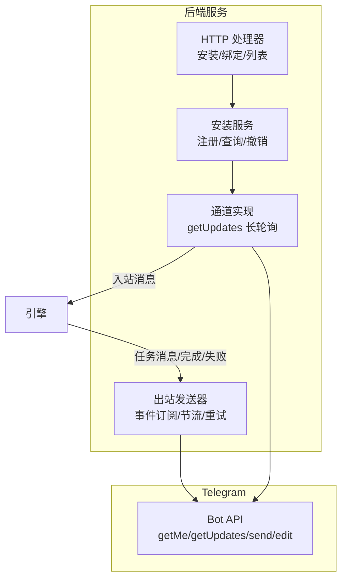
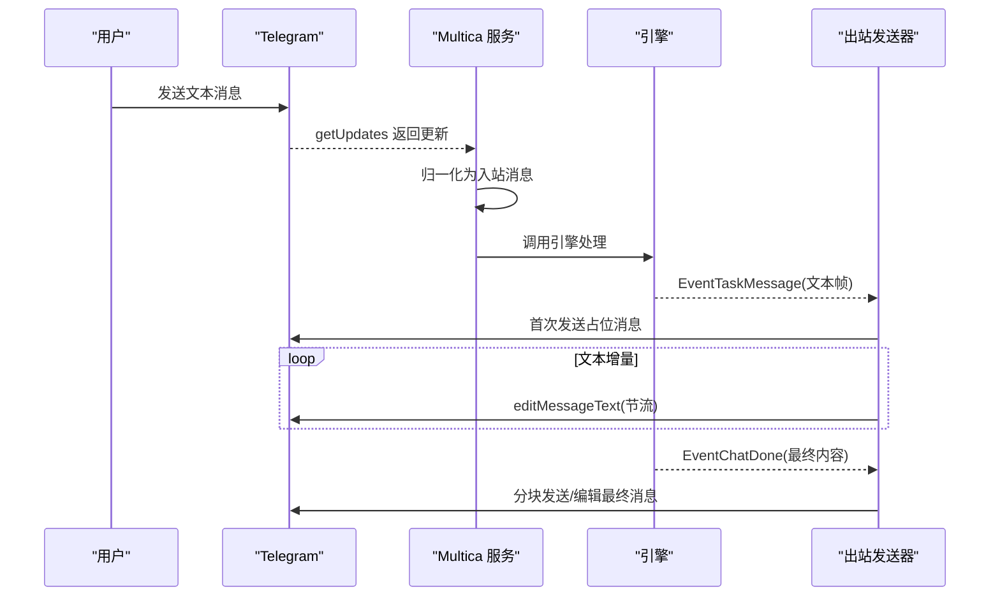
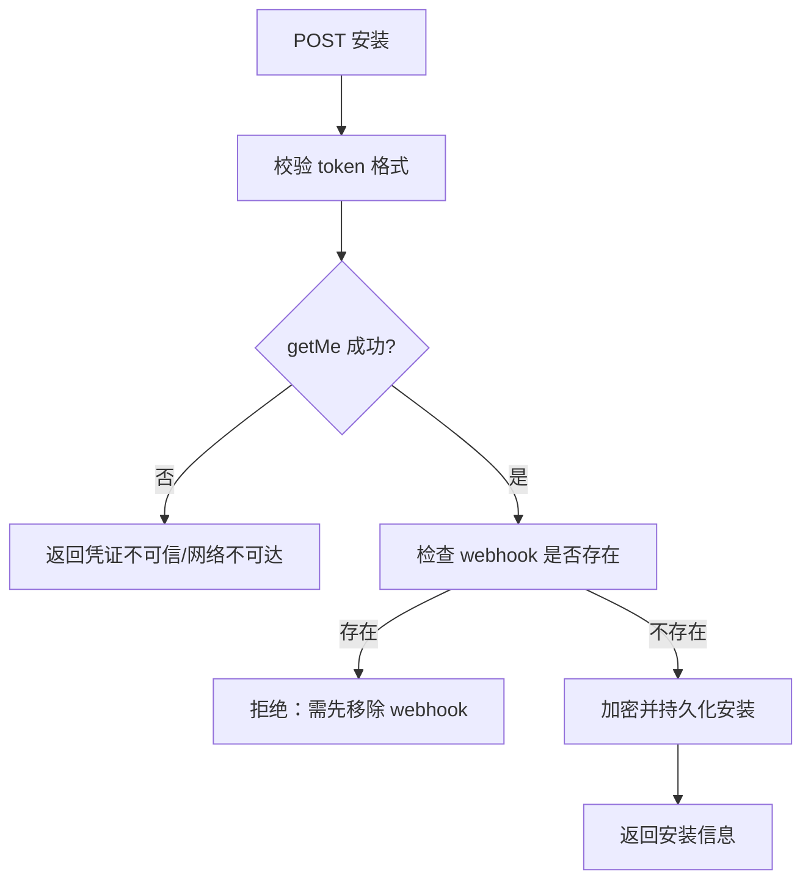
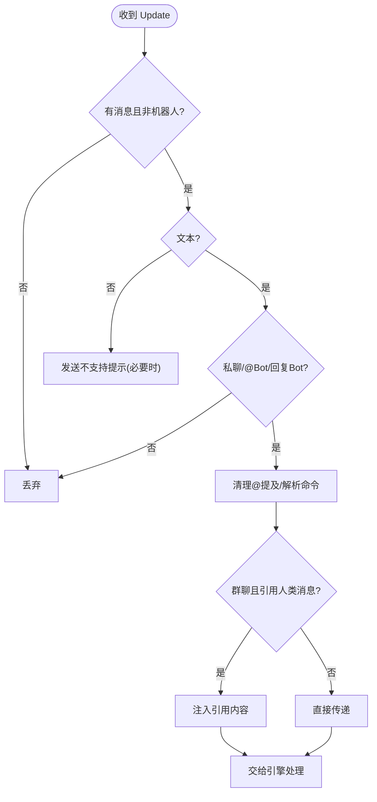
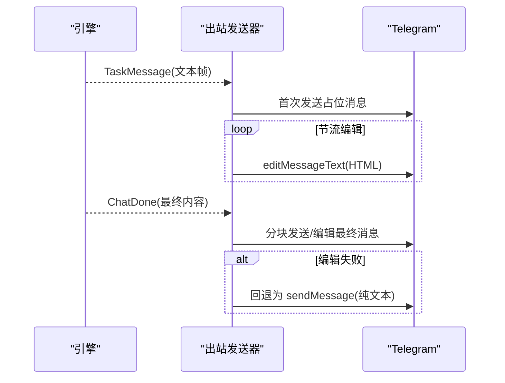
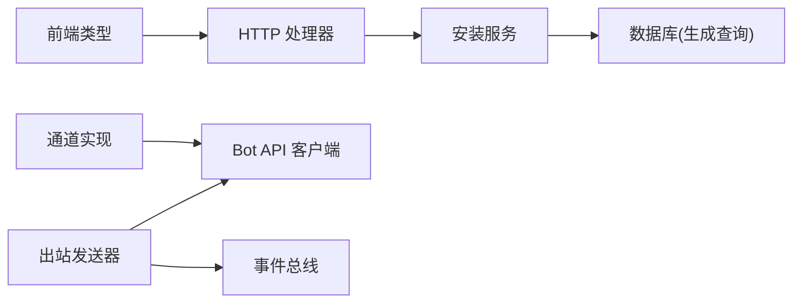

# Telegram 集成

<cite>
**本文引用的文件**
- [server/internal/handler/telegram.go](file://server/internal/handler/telegram.go)
- [server/internal/integrations/telegram/telegram_channel.go](file://server/internal/integrations/telegram/telegram_channel.go)
- [server/internal/integrations/telegram/api.go](file://server/internal/integrations/telegram/api.go)
- [server/internal/integrations/telegram/install.go](file://server/internal/integrations/telegram/install.go)
- [server/internal/integrations/telegram/inbound.go](file://server/internal/integrations/telegram/inbound.go)
- [server/internal/integrations/telegram/outbound.go](file://server/internal/integrations/telegram/outbound.go)
- [packages/core/types/telegram.ts](file://packages/core/types/telegram.ts)
- [apps/docs/content/docs/telegram-bot-integration.zh.mdx](file://apps/docs/content/docs/telegram-bot-integration.zh.mdx)
- [server/migrations/366_issue_origin_telegram_chat.up.sql](file://server/migrations/366_issue_origin_telegram_chat.up.sql)
</cite>

## 目录
1. [简介](#简介)
2. [项目结构](#项目结构)
3. [核心组件](#核心组件)
4. [架构总览](#架构总览)
5. [详细组件分析](#详细组件分析)
6. [依赖关系分析](#依赖关系分析)
7. [性能与限流](#性能与限流)
8. [部署与环境配置](#部署与环境配置)
9. [故障排查](#故障排查)
10. [结论](#结论)
11. [附录：API 与数据模型](#附录api-与数据模型)

## 简介
本文件面向希望将 Multica 智能体接入 Telegram 的开发者与运维人员，系统性说明 Bot 创建与配置、消息收发流程、用户识别与群组/频道行为、与 Telegram API 的交互方式、部署与排错要点，以及性能优化建议。当前版本支持私聊与群聊（含 forum topic）文本消息、命令（如 /issue）、Markdown/HTML 格式输出、流式编辑回复；媒体类消息暂不支持，会返回明确提示。

## 项目结构
Telegram 集成由“安装管理 + 长轮询接收 + 出站发送”三部分构成，并通过事件总线与引擎对接：
- 安装管理：负责校验 token、检查 webhook 冲突、加密存储、列出/撤销安装。
- 长轮询接收：每个安装维护一个 getUpdates 循环，将更新归一化为入站消息并交给引擎处理。
- 出站发送：订阅引擎事件，按聊天维度节流地编辑/发送消息，最终完成流式回复。

图表来源
- [server/internal/handler/telegram.go:49-163](file://server/internal/handler/telegram.go#L49-L163)
- [server/internal/integrations/telegram/install.go:130-175](file://server/internal/integrations/telegram/install.go#L130-L175)
- [server/internal/integrations/telegram/telegram_channel.go:53-107](file://server/internal/integrations/telegram/telegram_channel.go#L53-L107)
- [server/internal/integrations/telegram/outbound.go:204-225](file://server/internal/integrations/telegram/outbound.go#L204-L225)

章节来源
- [server/internal/handler/telegram.go:49-163](file://server/internal/handler/telegram.go#L49-L163)
- [server/internal/integrations/telegram/install.go:130-175](file://server/internal/integrations/telegram/install.go#L130-L175)
- [server/internal/integrations/telegram/telegram_channel.go:53-107](file://server/internal/integrations/telegram/telegram_channel.go#L53-L107)
- [server/internal/integrations/telegram/outbound.go:204-225](file://server/internal/integrations/telegram/outbound.go#L204-L225)

## 核心组件
- HTTP 处理器：提供安装列表、注册 Bot、撤销安装、绑定令牌兑换等 REST 接口，统一错误码与广播事件。
- 安装服务：对 Bot token 进行在线校验、webhook 冲突检测、加密持久化、唯一性约束与冲突分类。
- 通道实现：为每个安装启动一个 getUpdates 长轮询循环，过滤非文本与未提及消息，转发到引擎。
- 出站发送器：订阅任务消息/完成/失败事件，按聊天维度节流编辑/发送，支持 HTML、分块、回退纯文本、429 退避与队列容量控制。
- 前端类型定义：描述安装对象、请求与响应结构，保证前后端契约一致。

章节来源
- [server/internal/handler/telegram.go:49-266](file://server/internal/handler/telegram.go#L49-L266)
- [server/internal/integrations/telegram/install.go:75-175](file://server/internal/integrations/telegram/install.go#L75-L175)
- [server/internal/integrations/telegram/telegram_channel.go:16-133](file://server/internal/integrations/telegram/telegram_channel.go#L16-L133)
- [server/internal/integrations/telegram/outbound.go:25-225](file://server/internal/integrations/telegram/outbound.go#L25-L225)
- [packages/core/types/telegram.ts:1-47](file://packages/core/types/telegram.ts#L1-L47)

## 架构总览
下图展示一次完整消息往返：用户在 Telegram 私聊或群聊中向 Bot 发消息，服务端通过长轮询收到后归一化并交由引擎执行；引擎产出文本帧时，出站侧以占位消息+编辑的方式流式推送；任务完成后，最终内容分块投递。

图表来源
- [server/internal/integrations/telegram/telegram_channel.go:53-107](file://server/internal/integrations/telegram/telegram_channel.go#L53-L107)
- [server/internal/integrations/telegram/inbound.go:31-118](file://server/internal/integrations/telegram/inbound.go#L31-L118)
- [server/internal/integrations/telegram/outbound.go:243-331](file://server/internal/integrations/telegram/outbound.go#L243-L331)
- [server/internal/integrations/telegram/outbound.go:536-667](file://server/internal/integrations/telegram/outbound.go#L536-L667)

## 详细组件分析

### 安装与配置（注册/撤销/列表）
- 注册流程：解析 token -> 在线 getMe 验证 -> 检查是否已有 webhook -> 加密保存 -> upsert 安装记录（工作区+智能体维度唯一）。
- 撤销：将状态置为 revoked，停止长轮询与出站投递，保留历史与审计。
- 列表：仅暴露公开字段，不包含密钥。

图表来源
- [server/internal/integrations/telegram/install.go:130-175](file://server/internal/integrations/telegram/install.go#L130-L175)
- [server/internal/integrations/telegram/install.go:177-187](file://server/internal/integrations/telegram/install.go#L177-L187)
- [server/internal/integrations/telegram/install.go:206-267](file://server/internal/integrations/telegram/install.go#L206-L267)

章节来源
- [server/internal/handler/telegram.go:88-163](file://server/internal/handler/telegram.go#L88-L163)
- [server/internal/integrations/telegram/install.go:130-175](file://server/internal/integrations/telegram/install.go#L130-L175)
- [server/internal/integrations/telegram/install.go:206-267](file://server/internal/integrations/telegram/install.go#L206-L267)

### 长轮询接收与入站消息
- 每个安装一个 getUpdates 循环，offset 推进，去重由上层基于 (installation, message_id) 保证。
- 仅接受 text 类型；图片/文件/视频/语音/贴纸在私聊或明确 @ 时会返回“不支持”提示。
- 群组策略：仅当包含 @bot mention 或直接回复 Bot 消息时才视为“定向”，避免收集无关群聊内容。
- 命令与上下文：支持 /new、/clear、/issue；引用人类消息时会将引用内容注入上下文。

图表来源
- [server/internal/integrations/telegram/telegram_channel.go:114-133](file://server/internal/integrations/telegram/telegram_channel.go#L114-L133)
- [server/internal/integrations/telegram/inbound.go:31-118](file://server/internal/integrations/telegram/inbound.go#L31-L118)
- [server/internal/integrations/telegram/inbound.go:138-227](file://server/internal/integrations/telegram/inbound.go#L138-L227)

章节来源
- [server/internal/integrations/telegram/telegram_channel.go:53-133](file://server/internal/integrations/telegram/telegram_channel.go#L53-L133)
- [server/internal/integrations/telegram/inbound.go:31-227](file://server/internal/integrations/telegram/inbound.go#L31-L227)

### 出站发送与流式回复
- 流式：首帧发送占位消息，后续按聊天维度节流 editMessageText；遇到 429 自动退避。
- 终态：EventChatDone 将最终内容分块发送；若编辑失败则回退为重新发送新消息。
- 容量与并发：终端回复队列有固定上限与每会话限制；多 worker 并行发送；空闲调度器可回收。
- 失败与取消：任务失败发送失败提示；取消仅清理本地状态，不覆盖用户可见内容。

图表来源
- [server/internal/integrations/telegram/outbound.go:243-331](file://server/internal/integrations/telegram/outbound.go#L243-L331)
- [server/internal/integrations/telegram/outbound.go:536-667](file://server/internal/integrations/telegram/outbound.go#L536-L667)
- [server/internal/integrations/telegram/outbound.go:679-736](file://server/internal/integrations/telegram/outbound.go#L679-L736)

章节来源
- [server/internal/integrations/telegram/outbound.go:25-225](file://server/internal/integrations/telegram/outbound.go#L25-L225)
- [server/internal/integrations/telegram/outbound.go:243-331](file://server/internal/integrations/telegram/outbound.go#L243-L331)
- [server/internal/integrations/telegram/outbound.go:536-667](file://server/internal/integrations/telegram/outbound.go#L536-L667)
- [server/internal/integrations/telegram/outbound.go:679-736](file://server/internal/integrations/telegram/outbound.go#L679-L736)

### 用户识别、群组管理与频道订阅
- 用户识别：使用 Telegram 全局 user id 作为稳定标识；跨安装复用。
- 群组：仅处理 @mention 或回复 Bot 的消息；forum topic 通过 thread id 隔离对话。
- 频道：频道广播消息不被摄入（无交互发送者上下文）。
- 账号绑定：首次私聊触发一次性绑定链接，登录后将 Telegram 账户与 Multica 用户关联；群内不公开发送凭据链接。

章节来源
- [server/internal/integrations/telegram/inbound.go:31-118](file://server/internal/integrations/telegram/inbound.go#L31-L118)
- [apps/docs/content/docs/telegram-bot-integration.zh.mdx:37-43](file://apps/docs/content/docs/telegram-bot-integration.zh.mdx#L37-L43)

### 与 Telegram API 的交互
- 最小 API 集：getMe（安装验证）、getWebhookInfo（冲突检测）、getUpdates（长轮询）、sendMessage/editMessageText（出站）、sendChatAction（输入指示）。
- 错误与限流：统一封装请求错误与 API 错误；429 携带 retry_after；409 表示同一 Bot 被其他实例轮询。
- 超时与代理：默认客户端超时适配长轮询；Go 标准 HTTPS_PROXY/NO_PROXY 生效。

章节来源
- [server/internal/integrations/telegram/api.go:14-34](file://server/internal/integrations/telegram/api.go#L14-L34)
- [server/internal/integrations/telegram/api.go:204-242](file://server/internal/integrations/telegram/api.go#L204-L242)
- [server/internal/integrations/telegram/api.go:244-305](file://server/internal/integrations/telegram/api.go#L244-L305)

## 依赖关系分析
- 处理器依赖安装服务与数据库生成查询；安装服务依赖 secretbox 加密、HTTP 客户端与事务启动器。
- 通道实现依赖 botAPI 与入站处理器；出站发送器订阅事件总线并依赖 botAPI。
- 前端类型与后端响应结构保持一致，便于 UI 渲染与管理面板。

图表来源
- [server/internal/handler/telegram.go:49-163](file://server/internal/handler/telegram.go#L49-L163)
- [server/internal/integrations/telegram/install.go:75-119](file://server/internal/integrations/telegram/install.go#L75-L119)
- [server/internal/integrations/telegram/telegram_channel.go:204-254](file://server/internal/integrations/telegram/telegram_channel.go#L204-L254)
- [server/internal/integrations/telegram/outbound.go:180-225](file://server/internal/integrations/telegram/outbound.go#L180-L225)
- [packages/core/types/telegram.ts:1-47](file://packages/core/types/telegram.ts#L1-L47)

章节来源
- [server/internal/handler/telegram.go:49-163](file://server/internal/handler/telegram.go#L49-L163)
- [server/internal/integrations/telegram/install.go:75-119](file://server/internal/integrations/telegram/install.go#L75-L119)
- [server/internal/integrations/telegram/telegram_channel.go:204-254](file://server/internal/integrations/telegram/telegram_channel.go#L204-L254)
- [server/internal/integrations/telegram/outbound.go:180-225](file://server/internal/integrations/telegram/outbound.go#L180-L225)
- [packages/core/types/telegram.ts:1-47](file://packages/core/types/telegram.ts#L1-L47)

## 性能与限流
- 长轮询超时：getUpdates 服务端保持约 50 秒，降低请求频率并兼容常见代理/负载均衡空闲超时。
- 出站节流：editMessageText 间隔约 2.5 秒/聊天，避免超过 Telegram 编辑预算；429 严格遵循 retry_after。
- 队列与并发：终端回复队列有限制（总数与每会话），多 worker 并行发送；空闲调度器定期回收。
- 资源保护：当缓存达到容量并压缩退避状态时，同安装下其他聊天可能保守延迟，确保整体稳定性。

章节来源
- [server/internal/integrations/telegram/api.go:20-27](file://server/internal/integrations/telegram/api.go#L20-L27)
- [server/internal/integrations/telegram/outbound.go:154-172](file://server/internal/integrations/telegram/outbound.go#L154-L172)
- [server/internal/integrations/telegram/outbound.go:344-400](file://server/internal/integrations/telegram/outbound.go#L344-L400)

## 部署与环境配置
- 启用条件：设置长期稳定的 32 字节加密密钥（base64 编码），用于加密存储 Bot token。
- 绑定链接：使用应用 URL 环境变量，未设置时回退到前端源地址；必须可被成员访问。
- 网络要求：服务器需能 HTTPS 访问 api.telegram.org；Go 读取标准 HTTPS_PROXY/NO_PROXY。
- 权限与角色：连接操作需要工作区 owner/admin；只有工作区成员可使用 Bot。

章节来源
- [apps/docs/content/docs/telegram-bot-integration.zh.mdx:72-82](file://apps/docs/content/docs/telegram-bot-integration.zh.mdx#L72-L82)
- [apps/docs/content/docs/telegram-bot-integration.zh.mdx:12-16](file://apps/docs/content/docs/telegram-bot-integration.zh.mdx#L12-L16)

## 故障排查
- 无法验证 Bot：优先检查网络与代理；仅在 Telegram 明确拒绝 token 时重新生成。
- Webhook 冲突：连接前移除该 Bot 已配置的 webhook；Telegram 不允许同时使用 webhook 与 getUpdates。
- 409 轮询冲突：另一实例或进程正在轮询同一 Bot；停止另一个消费者或为不同环境使用不同 Bot。
- 群里不回复：确认 Bot 已在群内，且消息 @ 了它或回复了它的消息。
- 绑定链接过期：重新私聊 Bot 获取最新链接。
- Bot 不执行：检查智能体是否归档及运行时是否在线。

章节来源
- [apps/docs/content/docs/telegram-bot-integration.zh.mdx:84-91](file://apps/docs/content/docs/telegram-bot-integration.zh.mdx#L84-L91)

## 结论
本集成通过“安装管理 + 长轮询 + 出站节流”的组合，实现了安全、稳定、可扩展的 Telegram 接入。其设计充分考虑了 Telegram 平台限制（webhook 互斥、编辑速率、429/409 错误），并提供清晰的错误信息与排障指引。对于媒体类消息，当前版本给出明确的不支持提示，未来可按需扩展。

## 附录：API 与数据模型
- 安装对象字段：id、workspace_id、agent_id、bot_id、bot_username、installer_user_id、status、时间戳。
- 注册请求：包含 bot_token。
- 绑定兑换响应：返回 workspace_id、installation_id、telegram_user_id。
- 任务来源扩展：新增 telegram_chat 来源类型，用于 /issue 创建的任务溯源。

章节来源
- [packages/core/types/telegram.ts:1-47](file://packages/core/types/telegram.ts#L1-L47)
- [server/migrations/366_issue_origin_telegram_chat.up.sql:1-12](file://server/migrations/366_issue_origin_telegram_chat.up.sql#L1-L12)