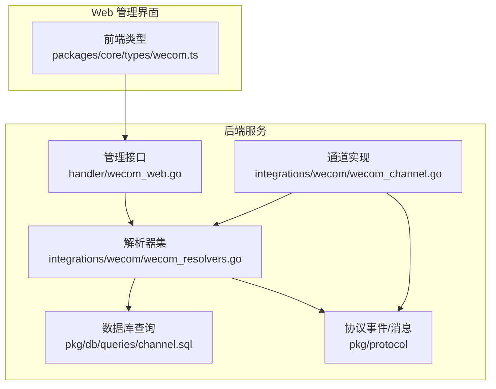
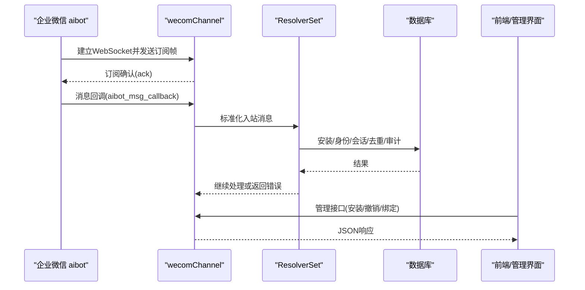
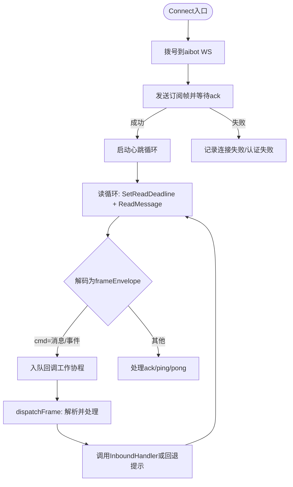
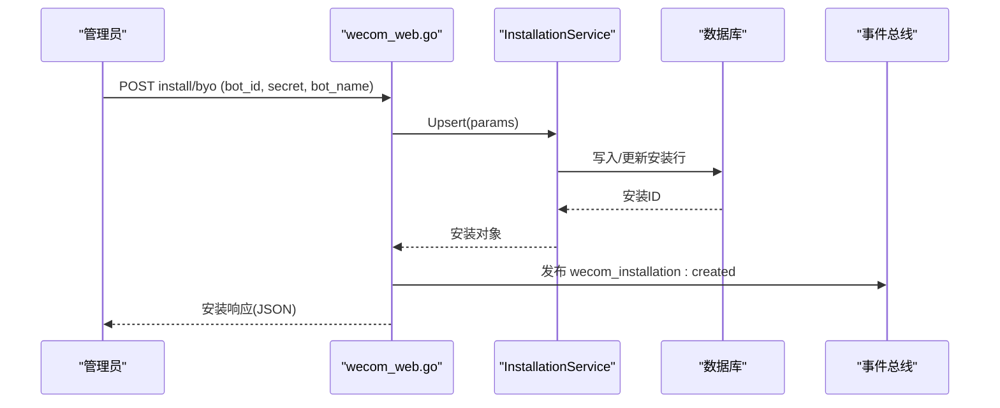
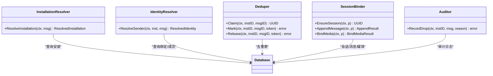
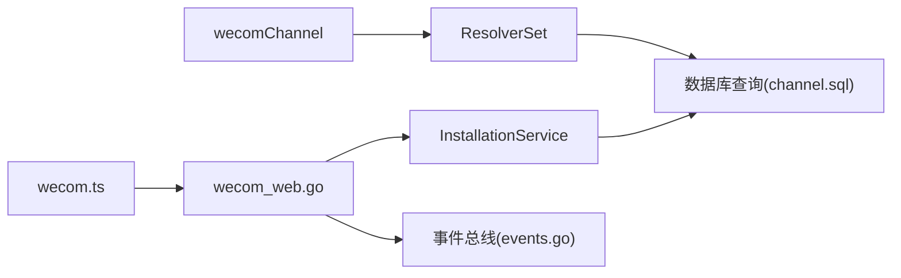

# 企业微信集成

<cite>
**本文引用的文件**
- [wecom_channel.go](file://server/internal/integrations/wecom/wecom_channel.go)
- [wecom_web.go](file://server/internal/handler/wecom_web.go)
- [wecom_resolvers.go](file://server/internal/integrations/wecom/wecom_resolvers.go)
- [wecom.ts](file://packages/core/types/wecom.ts)
- [channels.zh.mdx](file://apps/docs/content/docs/channels.zh.mdx)
- [events.go](file://server/pkg/protocol/events.go)
- [messages.go](file://server/pkg/protocol/messages.go)
- [channel.sql](file://server/pkg/db/queries/channel.sql)
- [SELF_HOSTING_ADVANCED.md](file://SELF_HOSTING_ADVANCED.md)
- [SELF_HOSTING.md](file://SELF_HOSTING.md)
</cite>

## 目录
1. [简介](#简介)
2. [项目结构](#项目结构)
3. [核心组件](#核心组件)
4. [架构总览](#架构总览)
5. [详细组件分析](#详细组件分析)
6. [依赖关系分析](#依赖关系分析)
7. [性能与可靠性](#性能与可靠性)
8. [故障诊断指南](#故障诊断指南)
9. [结论](#结论)
10. [附录：配置与API参考](#附录配置与api参考)

## 简介
本文件面向需要在 Multica 中接入企业微信“智能机器人（aibot）”的运维与开发者，覆盖以下目标：
- 应用创建、回调与安全设置
- 消息处理能力（文本、图片上传、文件传输、富文本格式）
- 用户体系对接、组织架构同步与权限控制
- 实时通信实现（消息推送、状态同步、连接管理）
- Web 端集成、移动端适配与企业微信特有功能支持
- 完整配置示例、API 调用方法与故障诊断

企业微信通过长连接 WebSocket 与 Multica 后端建立唯一连接；每个安装（Bot）在同一时刻仅允许一个活跃连接。出站回复由持有连接的副本投递，多副本部署需启用实时中继（Redis）。

**章节来源**
- [channels.zh.mdx:14-30](file://apps/docs/content/docs/channels.zh.mdx#L14-L30)
- [SELF_HOSTING.md:381-386](file://SELF_HOSTING.md#L381-L386)

## 项目结构
Multica 的企业微信集成主要分布在服务端与前端类型定义中：
- 服务端通道实现：`server/internal/integrations/wecom`
- Web UI 管理接口：`server/internal/handler/wecom_web.go`
- 协议事件与消息：`server/pkg/protocol`
- 数据库查询：`server/pkg/db/queries/channel.sql`
- 前端类型契约：`packages/core/types/wecom.ts`
- 文档与自托管说明：`apps/docs/content/docs/channels.zh.mdx`、`SELF_HOSTING*.md`

**图表来源**
- [wecom_web.go:1-402](file://server/internal/handler/wecom_web.go#L1-L402)
- [wecom_channel.go:1-673](file://server/internal/integrations/wecom/wecom_channel.go#L1-L673)
- [wecom_resolvers.go:1-341](file://server/internal/integrations/wecom/wecom_resolvers.go#L1-L341)
- [events.go:53-218](file://server/pkg/protocol/events.go#L53-L218)
- [messages.go:312-339](file://server/pkg/protocol/messages.go#L312-L339)
- [channel.sql:817-850](file://server/pkg/db/queries/channel.sql#L817-L850)
- [wecom.ts:1-54](file://packages/core/types/wecom.ts#L1-L54)

**章节来源**
- [wecom_web.go:1-402](file://server/internal/handler/wecom_web.go#L1-L402)
- [wecom_channel.go:1-673](file://server/internal/integrations/wecom/wecom_channel.go#L1-L673)
- [wecom_resolvers.go:1-341](file://server/internal/integrations/wecom/wecom_resolvers.go#L1-L341)
- [wecom.ts:1-54](file://packages/core/types/wecom.ts#L1-L54)

## 核心组件
- 通道连接与生命周期：`wecomChannel` 负责拨号、订阅、心跳、读循环、回调分发与指标上报。
- 管理接口：提供安装列表、BYO 安装、撤销绑定、绑定令牌兑换等 REST API。
- 解析器集：完成安装路由、身份识别、去重、会话绑定、审计与媒体绑定。
- 协议事件：定义 WeCom 安装生命周期事件（创建/撤销），供前端刷新。
- 数据模型：通道任务投递、出站消息等 SQL 查询。

**章节来源**
- [wecom_channel.go:71-124](file://server/internal/integrations/wecom/wecom_channel.go#L71-L124)
- [wecom_web.go:71-187](file://server/internal/handler/wecom_web.go#L71-L187)
- [wecom_resolvers.go:46-79](file://server/internal/integrations/wecom/wecom_resolvers.go#L46-L79)
- [events.go:205-213](file://server/pkg/protocol/events.go#L205-L213)
- [channel.sql:817-850](file://server/pkg/db/queries/channel.sql#L817-L850)

## 架构总览
企业微信集成采用“通道 + 解析器 + 管理接口”的分层设计：
- 通道层维护 aibot 长连接，处理入站消息与心跳，将消息标准化后交给引擎。
- 解析器层完成安装查找、身份绑定、会话隔离、去重、审计与媒体绑定。
- 管理接口暴露安装管理与绑定流程，驱动安装服务的 Upsert/Revoke。
- 协议事件用于通知前端刷新安装列表与状态。

**图表来源**
- [wecom_channel.go:132-347](file://server/internal/integrations/wecom/wecom_channel.go#L132-L347)
- [wecom_resolvers.go:111-187](file://server/internal/integrations/wecom/wecom_resolvers.go#L111-L187)
- [wecom_web.go:71-187](file://server/internal/handler/wecom_web.go#L71-L187)

## 详细组件分析

### 通道连接与消息处理（wecomChannel）
- 连接参数与超时：默认 WS URL、ping 间隔、读/写超时、握手超时。
- 订阅流程：发送 aibot_subscribe，等待 ack，区分凭据拒绝与不可验证错误。
- 读循环与回调队列：消息进入工作协程处理，队列满时阻塞以触发重连。
- 心跳与保活：定时 ping，防止连接被平台回收。
- 能力声明：支持文本与附件（入站），当前未声明出站媒体发送能力。
- 出站路径：通用 Channel.Send 不支持，出站通过 OutboundReplier/Outbound 走同一 socket。

**图表来源**
- [wecom_channel.go:132-347](file://server/internal/integrations/wecom/wecom_channel.go#L132-L347)
- [wecom_channel.go:356-441](file://server/internal/integrations/wecom/wecom_channel.go#L356-L441)
- [wecom_channel.go:531-550](file://server/internal/integrations/wecom/wecom_channel.go#L531-L550)
- [wecom_channel.go:552-583](file://server/internal/integrations/wecom/wecom_channel.go#L552-L583)

**章节来源**
- [wecom_channel.go:35-69](file://server/internal/integrations/wecom/wecom_channel.go#L35-L69)
- [wecom_channel.go:112-124](file://server/internal/integrations/wecom/wecom_channel.go#L112-L124)
- [wecom_channel.go:132-347](file://server/internal/integrations/wecom/wecom_channel.go#L132-L347)
- [wecom_channel.go:356-441](file://server/internal/integrations/wecom/wecom_channel.go#L356-L441)
- [wecom_channel.go:531-583](file://server/internal/integrations/wecom/wecom_channel.go#L531-L583)

### 管理接口与安装流程（wecom_web.go）
- 列出安装：GET /api/workspaces/{id}/wecom/installations
- BYO 安装：POST /api/workspaces/{id}/wecom/install/byo?agent_id=...
- 撤销安装：DELETE /api/workspaces/{id}/wecom/installations/{installationId}
- 绑定令牌兑换：POST /api/wecom/binding/redeem
- 错误矩阵：按业务语义返回冲突、参数无效、凭据拒绝、不可验证、内部错误等稳定代码。

**图表来源**
- [wecom_web.go:124-187](file://server/internal/handler/wecom_web.go#L124-L187)
- [events.go:205-213](file://server/pkg/protocol/events.go#L205-L213)

**章节来源**
- [wecom_web.go:71-187](file://server/internal/handler/wecom_web.go#L71-L187)
- [wecom_web.go:189-260](file://server/internal/handler/wecom_web.go#L189-L260)
- [wecom_web.go:262-303](file://server/internal/handler/wecom_web.go#L262-L303)
- [wecom_web.go:350-401](file://server/internal/handler/wecom_web.go#L350-L401)

### 解析器集与会话绑定（wecom_resolvers.go）
- 安装路由：根据 BotID 查找安装，判断是否激活。
- 身份识别：通过 channel_user_binding 表映射 WeCom userid 到 Multica 用户，并校验成员资格。
- 会话绑定：单聊按 ChatID，群聊按 chatid 隔离会话。
- 去重：使用共享的去重表保证幂等。
- 审计：记录丢弃原因与渠道信息。
- 媒体绑定：将下载/解密后的附件与消息关联。

**图表来源**
- [wecom_resolvers.go:111-187](file://server/internal/integrations/wecom/wecom_resolvers.go#L111-L187)
- [wecom_resolvers.go:189-227](file://server/internal/integrations/wecom/wecom_resolvers.go#L189-L227)
- [wecom_resolvers.go:228-305](file://server/internal/integrations/wecom/wecom_resolvers.go#L228-L305)
- [wecom_resolvers.go:307-341](file://server/internal/integrations/wecom/wecom_resolvers.go#L307-L341)

**章节来源**
- [wecom_resolvers.go:46-79](file://server/internal/integrations/wecom/wecom_resolvers.go#L46-L79)
- [wecom_resolvers.go:111-187](file://server/internal/integrations/wecom/wecom_resolvers.go#L111-L187)
- [wecom_resolvers.go:189-305](file://server/internal/integrations/wecom/wecom_resolvers.go#L189-L305)
- [wecom_resolvers.go:307-341](file://server/internal/integrations/wecom/wecom_resolvers.go#L307-L341)

### 协议事件与消息
- 安装生命周期事件：`wecom_installation:created`、`wecom_installation:revoked`
- 聊天会话相关消息：创建、已读、删除等广播负载，用于多设备同步。

**章节来源**
- [events.go:205-213](file://server/pkg/protocol/events.go#L205-L213)
- [messages.go:312-339](file://server/pkg/protocol/messages.go#L312-L339)

### 数据模型与持久化
- 通道任务投递：从会话绑定复制投递上下文，便于跨渠道追踪。
- 出站消息：记录出站消息以便审计与重试。

**章节来源**
- [channel.sql:817-850](file://server/pkg/db/queries/channel.sql#L817-L850)

## 依赖关系分析
- 通道与解析器：通道将标准化消息交给解析器集，解析器依赖 Store/Queries 进行安装、身份、会话、去重与审计。
- 管理接口与安装服务：管理接口调用 InstallationService 完成 Upsert/Revoke，并通过事件总线通知前端。
- 前端类型契约：前端类型与后端响应保持一致，新增字段需保持向后兼容。

**图表来源**
- [wecom_channel.go:1-673](file://server/internal/integrations/wecom/wecom_channel.go#L1-L673)
- [wecom_resolvers.go:1-341](file://server/internal/integrations/wecom/wecom_resolvers.go#L1-L341)
- [wecom_web.go:1-402](file://server/internal/handler/wecom_web.go#L1-L402)
- [events.go:53-218](file://server/pkg/protocol/events.go#L53-L218)
- [channel.sql:817-850](file://server/pkg/db/queries/channel.sql#L817-L850)
- [wecom.ts:1-54](file://packages/core/types/wecom.ts#L1-L54)

**章节来源**
- [wecom_channel.go:1-673](file://server/internal/integrations/wecom/wecom_channel.go#L1-L673)
- [wecom_resolvers.go:1-341](file://server/internal/integrations/wecom/wecom_resolvers.go#L1-L341)
- [wecom_web.go:1-402](file://server/internal/handler/wecom_web.go#L1-L402)
- [events.go:53-218](file://server/pkg/protocol/events.go#L53-L218)
- [channel.sql:817-850](file://server/pkg/db/queries/channel.sql#L817-L850)
- [wecom.ts:1-54](file://packages/core/types/wecom.ts#L1-L54)

## 性能与可靠性
- 连接与心跳：每 30 秒发送 ping，读超时 90 秒，写超时 10 秒，握手超时 15 秒，保障连接健康。
- 背压与重连：回调队列深度 64，满时阻塞读循环，促使平台替换连接，避免静默丢消息。
- 多副本出站：企业微信出站仅能通过持有 WS 的副本；启用 Redis 分片/双写中继可转发到其他副本，否则建议单副本运行。
- 指标与追踪：连接失败、认证失败、回调队列阻塞等指标；可选开启 frame 追踪（注意日志敏感信息）。

**章节来源**
- [wecom_channel.go:35-69](file://server/internal/integrations/wecom/wecom_channel.go#L35-L69)
- [wecom_channel.go:349-354](file://server/internal/integrations/wecom/wecom_channel.go#L349-L354)
- [SELF_HOSTING.md:381-386](file://SELF_HOSTING.md#L381-L386)
- [SELF_HOSTING_ADVANCED.md:180-199](file://SELF_HOSTING_ADVANCED.md#L180-L199)

## 故障诊断指南
- 安装失败：
  - 冲突：Bot 已被同一工作区/归档智能体/其他工作区占用，需先断开再连接。
  - 参数无效：缺少必填字段或平台限制。
  - 凭据拒绝：WeCom 拒绝该 Bot ID 与 Secret，检查控制台与长连接开关。
  - 不可验证：无法连通 WeCom，稍后重试。
  - 内部错误：数据库、加密密钥或程序异常。
- 连接问题：
  - 认证失败：凭据错误或 Bot 被删除。
  - 连接失败：网络或平台侧异常。
  - 回调队列阻塞：后端过载，观察指标并重连。
- 出站丢失：
  - 无活连接窗口：所有副本均重连时产生的回复不会送达，但会被计数统计。
- 日志与追踪：
  - 开启 `MULTICA_WECOM_TRACE` 可记录进出帧（含前 120 字符正文），注意隐私与合规。

**章节来源**
- [wecom_web.go:189-260](file://server/internal/handler/wecom_web.go#L189-L260)
- [wecom_channel.go:356-441](file://server/internal/integrations/wecom/wecom_channel.go#L356-L441)
- [SELF_HOSTING.md:381-386](file://SELF_HOSTING.md#L381-L386)
- [SELF_HOSTING_ADVANCED.md:180-199](file://SELF_HOSTING_ADVANCED.md#L180-L199)

## 结论
Multica 的企业微信集成通过稳定的长连接与清晰的通道/解析器分层，实现了可靠的消息收发、安装管理与身份绑定。结合实时中继与指标追踪，可在多副本环境下稳健运行。当前对媒体能力的支持集中在入站附件处理，出站媒体发送尚未声明；如需扩展，应遵循现有通道与解析器契约。

## 附录：配置与API参考

### 环境变量与密钥
- 自托管需设置平台加密密钥以开放连接入口，其中包含企业微信密钥项。
- 生产环境建议使用 Redis 以支持多副本出站转发。

**章节来源**
- [channels.zh.mdx:87-106](file://apps/docs/content/docs/channels.zh.mdx#L87-L106)

### 管理接口
- 列出安装：GET /api/workspaces/{id}/wecom/installations
- BYO 安装：POST /api/workspaces/{id}/wecom/install/byo?agent_id=...
- 撤销安装：DELETE /api/workspaces/{id}/wecom/installations/{installationId}
- 绑定令牌兑换：POST /api/wecom/binding/redeem

**章节来源**
- [wecom_web.go:71-187](file://server/internal/handler/wecom_web.go#L71-L187)
- [wecom_web.go:262-303](file://server/internal/handler/wecom_web.go#L262-L303)
- [wecom_web.go:350-401](file://server/internal/handler/wecom_web.go#L350-L401)

### 前端类型契约
- 安装对象、列表响应、注册请求、兑换响应等类型定义，确保前后端一致。

**章节来源**
- [wecom.ts:1-54](file://packages/core/types/wecom.ts#L1-L54)

### 消息能力与限制
- 文本消息：支持。
- 图片/文件：入站附件可下载、解密与绑定；当前未声明出站媒体发送能力。
- 富文本：企业微信侧图文混排等暂不直接支持，会收到简短说明。

**章节来源**
- [wecom_channel.go:112-119](file://server/internal/integrations/wecom/wecom_channel.go#L112-L119)
- [channels.zh.mdx:30-33](file://apps/docs/content/docs/channels.zh.mdx#L30-L33)

### 实时通信与多副本
- 出站路径：仅持有 WS 的副本可发送；启用 Redis 中继可转发到其他副本。
- 无活连接窗口：全部重连期间产生的回复不会送达，但会被计数。

**章节来源**
- [SELF_HOSTING.md:381-386](file://SELF_HOSTING.md#L381-L386)