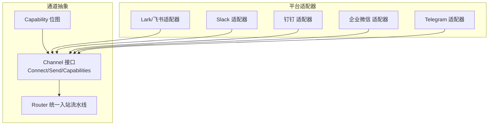
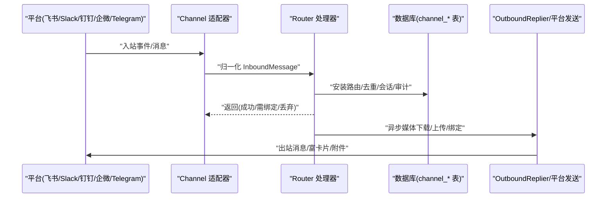
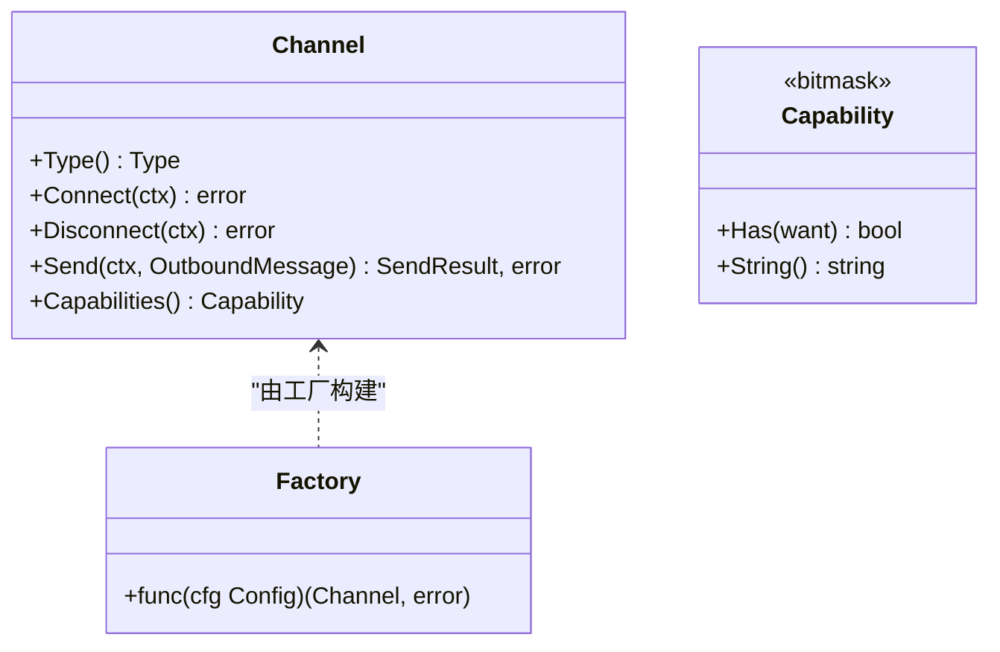
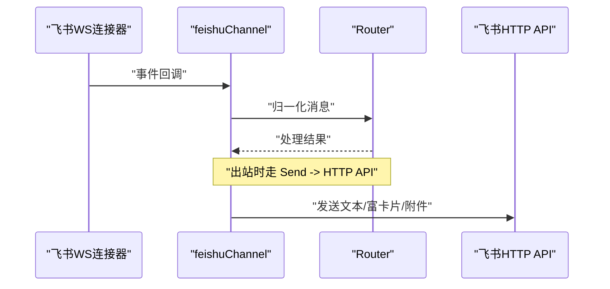
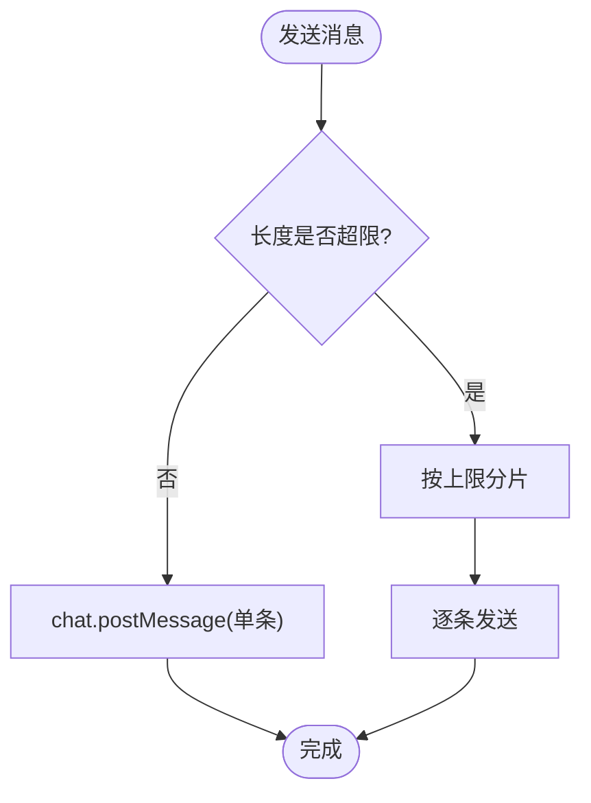
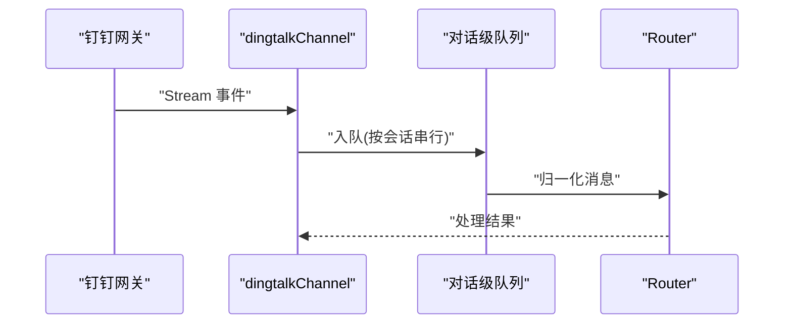
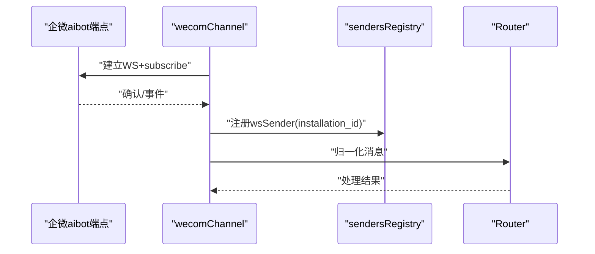
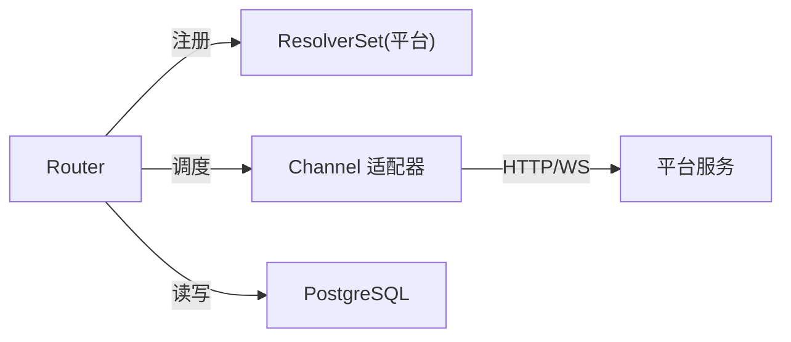

# 聊天工具集成

<cite>
**本文引用的文件**
- [channel.go](file://server/internal/integrations/channel/channel.go)
- [capability.go](file://server/internal/integrations/channel/capability.go)
- [router.go](file://server/internal/integrations/channel/engine/router.go)
- [feishu_channel.go](file://server/internal/integrations/lark/feishu_channel.go)
- [channel.go](file://server/internal/integrations/slack/channel.go)
- [dingtalk_channel.go](file://server/internal/integrations/dingtalk/dingtalk_channel.go)
- [wecom_channel.go](file://server/internal/integrations/wecom/wecom_channel.go)
- [events.go](file://server/pkg/protocol/events.go)
- [124_channel_generalization.up.sql](file://server/migrations/124_channel_generalization.up.sql)
- [channels.mdx](file://apps/docs/content/docs/channels.mdx)
</cite>

## 目录
1. [简介](#简介)
2. [项目结构](#项目结构)
3. [核心组件](#核心组件)
4. [架构总览](#架构总览)
5. [详细组件分析](#详细组件分析)
6. [依赖关系分析](#依赖关系分析)
7. [性能与限制](#性能与限制)
8. [安装与配置](#安装与配置)
9. [故障排查](#故障排查)
10. [结论与建议](#结论与建议)

## 简介
本文件面向在 Multica 中接入主流聊天平台（Slack、Lark/飞书、钉钉、企业微信、Telegram）的工程师与运维人员，系统阐述统一的通道抽象设计、消息收发流程、用户解析、媒体处理与实时通信协议，并说明各平台的认证方式、API 限制与适配层实现。文档同时覆盖消息格式转换、富文本支持、文件上传处理、Webhook/长连接设置、权限配置以及常见问题定位方法，最后给出多平台对比与使用建议。

## 项目结构
Multica 的后端将“聊天通道”抽象为平台无关的 Channel 接口与能力位图，并通过统一的 Router 编排入站消息流水线；每个平台以适配器形式注册到引擎，负责：
- 建立与平台的连接（WebSocket/HTTP Webhook）
- 将平台事件归一化为 channel.InboundMessage
- 通过 Channel.Send 发送出站消息
- 声明 Capabilities 供上层渲染降级

图表来源
- [channel.go:24-76](file://server/internal/integrations/channel/channel.go#L24-L76)
- [capability.go:5-33](file://server/internal/integrations/channel/capability.go#L5-L33)
- [router.go:20-34](file://server/internal/integrations/channel/engine/router.go#L20-L34)

章节来源
- [channel.go:10-109](file://server/internal/integrations/channel/channel.go#L10-L109)
- [capability.go:5-95](file://server/internal/integrations/channel/capability.go#L5-L95)
- [router.go:20-114](file://server/internal/integrations/channel/engine/router.go#L20-L114)

## 核心组件
- 通道接口与工厂
  - Channel 定义 Connect/Disconnect/Send/Capabilities，屏蔽平台差异；Factory 按安装配置构建 Channel 实例。
  - Config 包含 Type、Raw（平台凭据 JSONB）、ID、InboundHandler。
- 能力位图 Capability
  - 用位标志声明是否支持文本、富卡片、线程回复、引用回复、附件、语音、输入指示、消息编辑等。
- 路由与流水线 Router
  - 统一入口 Handle 执行：安装路由 → 去重 → 群 @机器人过滤 → 身份与成员校验 → 会话确保 → 追加与标记 → /issue 命令 → 持久化 + 防抖触发 → 异步媒体绑定与出站回复。
  - 提供 ReplyTimeout/MediaTimeout/MediaConcurrency 等可配参数。

章节来源
- [channel.go:24-109](file://server/internal/integrations/channel/channel.go#L24-L109)
- [capability.go:5-95](file://server/internal/integrations/channel/capability.go#L5-L95)
- [router.go:20-114](file://server/internal/integrations/channel/engine/router.go#L20-L114)

## 架构总览
下图展示从平台事件到引擎处理的端到端流程，以及出站消息回写路径。

图表来源
- [router.go:189-200](file://server/internal/integrations/channel/engine/router.go#L189-L200)
- [feishu_channel.go:46-86](file://server/internal/integrations/lark/feishu_channel.go#L46-L86)
- [channel.go:65-76](file://server/internal/integrations/channel/channel.go#L65-L76)

## 详细组件分析

### 统一通道抽象与能力声明
- Channel 接口保证所有适配器具备一致的 Connect/Send/Capabilities 行为；工厂按安装配置创建实例，注入共享 InboundHandler。
- Capability 位图用于声明能力，调用方据此选择渲染策略（如富卡片降级为纯文本）。

图表来源
- [channel.go:24-109](file://server/internal/integrations/channel/channel.go#L24-L109)
- [capability.go:5-95](file://server/internal/integrations/channel/capability.go#L5-L95)

章节来源
- [channel.go:24-109](file://server/internal/integrations/channel/channel.go#L24-L109)
- [capability.go:5-95](file://server/internal/integrations/channel/capability.go#L5-L95)

### 飞书/Lark 适配器
- 连接模式：基于共享 EventConnector 运行 WebSocket 长连接，解码事件后归一化为 channel.InboundMessage 交给 Router。
- 出站消息：通过 HTTP API 发送文本回复；富卡片、媒体与流式卡片补丁走既有 Patcher/OutcomeReplier 路径。
- 能力声明：文本、富卡片、线程回复、引用回复、附件、输入指示、消息编辑。

图表来源
- [feishu_channel.go:20-98](file://server/internal/integrations/lark/feishu_channel.go#L20-L98)

章节来源
- [feishu_channel.go:20-200](file://server/internal/integrations/lark/feishu_channel.go#L20-L200)

### Slack 适配器
- 出站消息：通过 chat.postMessage 发送，自动将 Markdown 转为 mrkdwn；超长消息按字符上限分片发送；支持 thread_ts 保持线程上下文。
- 元数据：出站消息携带自定义 metadata，便于追踪与关联。

图表来源
- [channel.go:21-126](file://server/internal/integrations/slack/channel.go#L21-L126)

章节来源
- [channel.go:16-126](file://server/internal/integrations/slack/channel.go#L16-L126)

### 钉钉 适配器
- 连接模式：每安装独立 Stream 连接，Connect 阻塞直到上下文取消或链路断开；入站事件进入 per-conversation 队列，避免阻塞 Socket 读循环。
- 能力声明：文本、附件。
- 出站：支持群内回复；主要回复路径通过事件订阅与 OutboundReplier。

图表来源
- [dingtalk_channel.go:16-143](file://server/internal/integrations/dingtalk/dingtalk_channel.go#L16-L143)

章节来源
- [dingtalk_channel.go:16-200](file://server/internal/integrations/dingtalk/dingtalk_channel.go#L16-L200)

### 企业微信 适配器
- 连接模式：aibot 智能机器人仅允许一个活跃连接；通过全局 WS 端点建立长连接，心跳保活，超时保护。
- 能力声明：文本、附件（入站附件会下载解密并绑定；出站到 aibot 的媒体上传握手尚未在此声明）。
- 出站：通过包级 sendersRegistry 将当前连接的 wsSender 暴露给 OutboundReplier，跨进程/副本转发由实时中继协调。

图表来源
- [wecom_channel.go:35-200](file://server/internal/integrations/wecom/wecom_channel.go#L35-L200)

章节来源
- [wecom_channel.go:1-200](file://server/internal/integrations/wecom/wecom_channel.go#L1-L200)

### Telegram 适配器
- 生命周期事件：与 Slack/飞书一致的安装创建/撤销事件，前端据此失效查询缓存。
- 适配器细节位于 telegram 包，遵循相同的 Channel 契约与 Router 流水线。

章节来源
- [events.go:197-218](file://server/pkg/protocol/events.go#L197-L218)

### 通用数据模型与路由
- 通道会话绑定：channel_chat_session_binding 表记录会话与通道的映射、最近消息/线程、配置等，支持历史绑定保留与当前路由切换。
- 出站消息索引：对 binding_id/route_revision 建索引以提升路由匹配与投递效率。

章节来源
- [124_channel_generalization.up.sql:158-190](file://server/migrations/124_channel_generalization.up.sql#L158-L190)

## 依赖关系分析
- 适配器与引擎耦合度低：适配器只关心 Connect/Send/能力声明与归一化；Router 通过 ResolverSet 解耦平台差异。
- 外部依赖：
  - 飞书：EventConnector + HTTP API
  - Slack：slack-go 客户端
  - 钉钉：Stream 长连接
  - 企业微信：aibot WebSocket
  - Telegram：官方 Bot API（适配器内部）
- 数据库：PostgreSQL，通道相关表与索引支撑会话绑定与出站路由。

图表来源
- [router.go:20-34](file://server/internal/integrations/channel/engine/router.go#L20-L34)
- [channel.go:24-76](file://server/internal/integrations/channel/channel.go#L24-L76)

章节来源
- [router.go:20-114](file://server/internal/integrations/channel/engine/router.go#L20-L114)
- [channel.go:24-109](file://server/internal/integrations/channel/channel.go#L24-L109)

## 性能与限制
- 消息分片：Slack 单条消息有字符上限，适配器自动分片发送，避免截断。
- 并发控制：Router 提供 MediaConcurrency 限制媒体处理并发，防止内存与平台限流压力。
- 超时控制：ReplyTimeout 约束出站回复/输入指示耗时；MediaTimeout 约束媒体下载/上传/绑定时长。
- 连接健康：企业微信适配器内置心跳与读/写超时，保障连接健壮性；钉钉适配器通过 per-conversation 队列隔离慢任务。
- 幂等与去重：Router 在入站阶段进行两阶段去重，避免重复处理。

章节来源
- [channel.go:21-126](file://server/internal/integrations/slack/channel.go#L21-L126)
- [router.go:61-114](file://server/internal/integrations/channel/engine/router.go#L61-L114)
- [wecom_channel.go:35-62](file://server/internal/integrations/wecom/wecom_channel.go#L35-L62)
- [dingtalk_channel.go:38-52](file://server/internal/integrations/dingtalk/dingtalk_channel.go#L38-L52)

## 安装与配置
- 自托管密钥：为各平台配置加密密钥（32字节 base64），用于加密存储 Bot 凭据。
- 环境变量示例：MULTICA_LARK_SECRET_KEY、MULTICA_SLACK_SECRET_KEY、MULTICA_DINGTALK_SECRET_KEY、MULTICA_WECOM_SECRET_KEY、MULTICA_TELEGRAM_SECRET_KEY。
- 企业微信多副本：若启用 Redis（默认），不同副本间可通过实时中继转发回复；否则需单副本部署。

章节来源
- [channels.mdx:85-104](file://apps/docs/content/docs/channels.mdx#L85-L104)

## 故障排查
- 常见错误提示
  - 未配置入站处理器：适配器在 Connect 前检查 handler 是否为空，为空则报错。
  - 凭据缺失：如钉钉缺少 app secret、企业微信缺少 bot_id/secret，会在连接阶段失败。
  - 无 ResolverSet：Router 收到未知 channel_type 时返回基础设施错误，需检查启动注册。
- 诊断要点
  - 查看适配器日志中的 installation_id、bot_id、app_id 等上下文字段。
  - 关注 Router 的 ReplyTimeout/MediaTimeout 是否过短导致超时。
  - 检查数据库 channel_chat_session_binding 是否正确绑定会话与通道。

章节来源
- [feishu_channel.go:52-71](file://server/internal/integrations/lark/feishu_channel.go#L52-L71)
- [dingtalk_channel.go:128-133](file://server/internal/integrations/dingtalk/dingtalk_channel.go#L128-L133)
- [wecom_channel.go:133-138](file://server/internal/integrations/wecom/wecom_channel.go#L133-L138)
- [router.go:183-187](file://server/internal/integrations/channel/engine/router.go#L183-L187)

## 结论与建议
- 统一抽象优势：新增平台只需实现 Channel 与 ResolverSet，无需改动 Router；能力位图驱动渲染降级，降低耦合。
- 平台选择建议
  - 飞书/Lark：功能最完整（富卡片、线程、附件、输入指示、消息编辑），适合需要强交互的团队。
  - Slack：生态成熟，Markdown→mrkdwn 自动转换，适合国际化团队。
  - 钉钉：Stream 长连接稳定，适合企业内部协作。
  - 企业微信：aibot 单连接模型简单，注意多副本场景下的实时中继配置。
  - Telegram：轻量灵活，适合开放型社区与个人场景。
- 最佳实践
  - 合理设置 ReplyTimeout/MediaTimeout 与 MediaConcurrency，平衡体验与资源占用。
  - 严格管理各平台权限（如群管理、消息读取/发送、媒体访问），最小权限原则。
  - 使用 channel_chat_session_binding 维护会话路由，避免误发至错误通道。
  - 监控安装生命周期事件（created/revoked/binding_updated），及时刷新前端缓存。