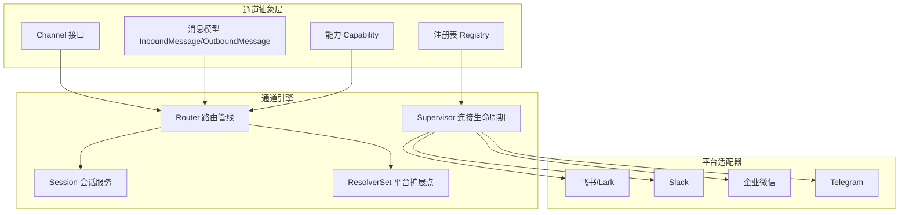
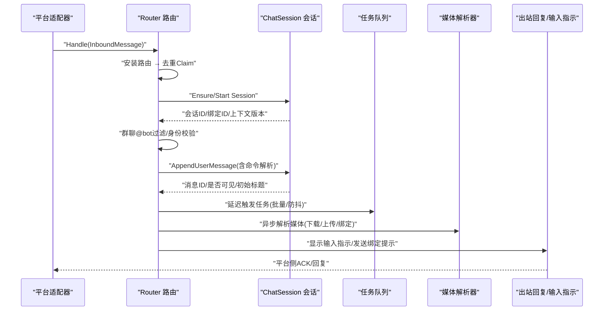
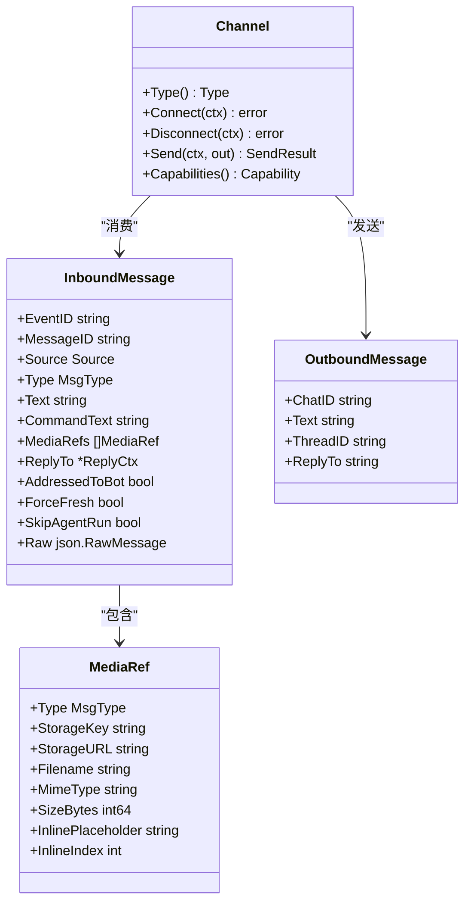
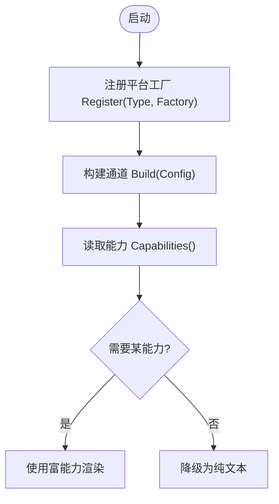
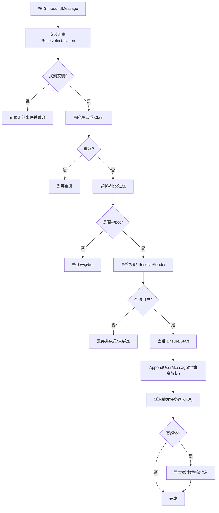
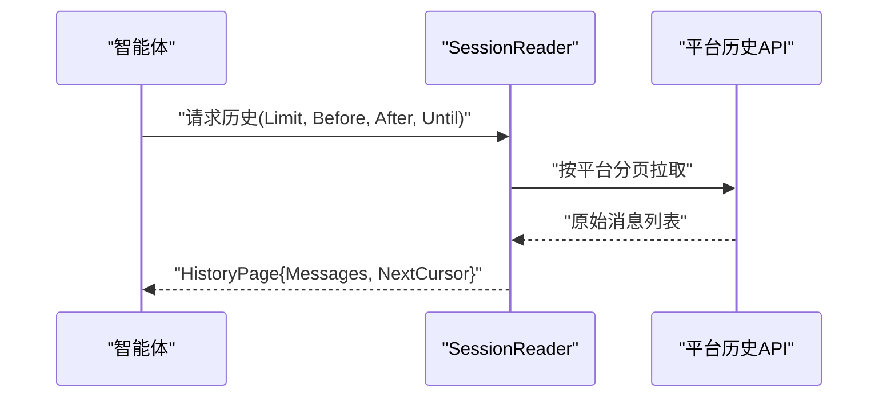
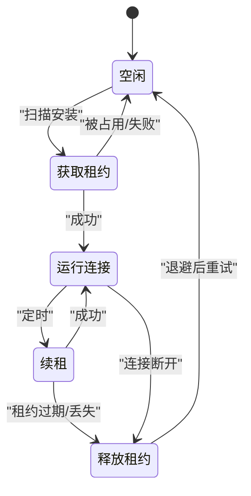
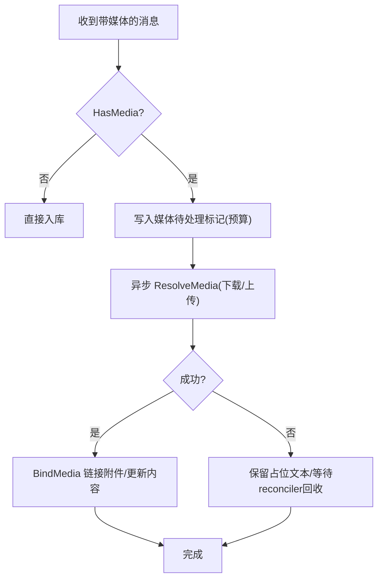
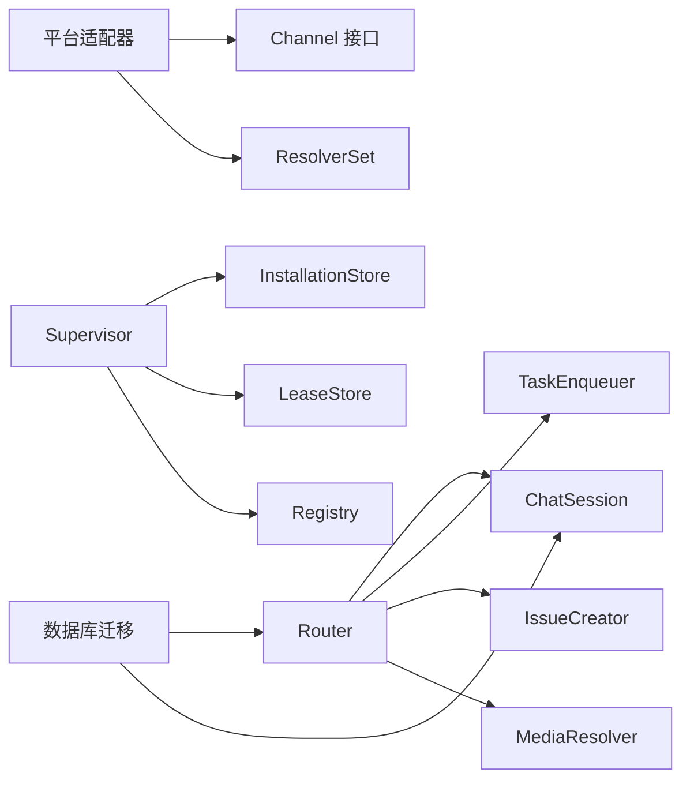

# 通道架构设计

<cite>
**本文引用的文件**
- [channel.go](file://server/internal/integrations/channel/channel.go)
- [registry.go](file://server/internal/integrations/channel/registry.go)
- [capability.go](file://server/internal/integrations/channel/capability.go)
- [message.go](file://server/internal/integrations/channel/message.go)
- [handler.go](file://server/internal/integrations/channel/handler.go)
- [history.go](file://server/internal/integrations/channel/history.go)
- [router.go](file://server/internal/integrations/channel/engine/router.go)
- [supervisor.go](file://server/internal/integrations/channel/engine/supervisor.go)
- [session.go](file://server/internal/integrations/channel/engine/session.go)
- [resolvers.go](file://server/internal/integrations/channel/engine/resolvers.go)
- [228_channel_media_pending_object_key_index.up.sql](file://server/migrations/228_channel_media_pending_object_key_index.up.sql)
- [425_channel_outbound_message.up.sql](file://server/migrations/425_channel_outbound_message.up.sql)
- [430_channel_outbound_message_binding_index.up.sql](file://server/migrations/430_channel_outbound_message_binding_index.up.sql)
- [421_channel_chat_active_route_index.up.sql](file://server/migrations/421_channel_chat_active_route_index.up.sql)
</cite>

## 目录
1. [简介](#简介)
2. [项目结构](#项目结构)
3. [核心组件](#核心组件)
4. [架构总览](#架构总览)
5. [详细组件分析](#详细组件分析)
6. [依赖关系分析](#依赖关系分析)
7. [性能考量](#性能考量)
8. [故障排查指南](#故障排查指南)
9. [结论](#结论)
10. [附录：通道开发指南](#附录通道开发指南)

## 简介
本文件系统性阐述 Multica 的“统一聊天通道抽象层”与“通道引擎”的设计与实现。内容覆盖：
- 统一的通道接口、消息格式标准化、用户解析机制与媒体处理流程
- 通道注册表、能力检测与扩展点
- 通道引擎的核心组件：消息路由、历史同步、成员管理、实时通信协议
- 新平台集成指南：如何实现新的聊天平台、消息转换规则与错误处理策略
- 架构图与关键交互流程图，帮助读者快速理解并落地扩展

## 项目结构
通道系统位于 server/internal/integrations/channel 及其 engine 子包中，采用“平台无关核心 + 平台适配”的分层组织：
- channel 包：定义跨平台的 Channel 接口、消息模型、能力位、注册表、历史数据模型等
- engine 包：实现跨平台的入站路由、会话绑定、去重、任务调度、媒体异步处理、Supervisor 连接生命周期管理
- 各平台适配器（如 lark、slack、wecom、telegram）通过实现 channel 接口与 engine 的 ResolverSet 接入

**图表来源**
- [channel.go:24-76](file://server/internal/integrations/channel/channel.go#L24-L76)
- [message.go:119-217](file://server/internal/integrations/channel/message.go#L119-L217)
- [capability.go:5-33](file://server/internal/integrations/channel/capability.go#L5-L33)
- [registry.go:14-63](file://server/internal/integrations/channel/registry.go#L14-L63)
- [router.go:20-34](file://server/internal/integrations/channel/engine/router.go#L20-L34)
- [session.go:22-30](file://server/internal/integrations/channel/engine/session.go#L22-L30)
- [resolvers.go:393-407](file://server/internal/integrations/channel/engine/resolvers.go#L393-L407)
- [supervisor.go:271-280](file://server/internal/integrations/channel/engine/supervisor.go#L271-L280)

**章节来源**
- [channel.go:1-110](file://server/internal/integrations/channel/channel.go#L1-L110)
- [registry.go:1-78](file://server/internal/integrations/channel/registry.go#L1-L78)
- [capability.go:1-95](file://server/internal/integrations/channel/capability.go#L1-L95)
- [message.go:1-217](file://server/internal/integrations/channel/message.go#L1-L217)
- [router.go:1-115](file://server/internal/integrations/channel/engine/router.go#L1-L115)
- [session.go:1-250](file://server/internal/integrations/channel/engine/session.go#L1-L250)
- [resolvers.go:1-433](file://server/internal/integrations/channel/engine/resolvers.go#L1-L433)
- [supervisor.go:1-370](file://server/internal/integrations/channel/engine/supervisor.go#L1-L370)

## 核心组件
- 通道接口 Channel：定义 Type、Connect/Disconnect、Send、Capabilities，屏蔽平台差异
- 消息模型：InboundMessage/OutboundMessage/MediaRef/Source/ReplyCtx，统一跨平台消息语义
- 能力位 Capability：声明式能力集合（文本、富卡片、引用回复、附件、语音、输入指示、编辑消息）
- 注册表 Registry：按 Type 注册 Factory，Build 实例化 Channel，支持覆盖式注册
- 入站处理器 InboundHandler：平台适配器将归一化的 InboundMessage 投递给引擎统一处理
- 历史数据模型 HistoryMessage/HistoryPage/HistoryOptions：统一的历史拉取视图
- 引擎 Router：统一入站管线（安装路由→两阶段去重→群聊@bot过滤→身份校验→会话绑定→追加消息→/issue→任务调度→媒体异步）
- 会话服务 ChatSession：跨平台会话创建/绑定、消息追加、上下文版本推进、标题初始化
- 平台扩展点 ResolverSet：Installation/Identity/Dedup/Session/Media/Audit/Replier/Typing 等可插拔能力
- Supervisor：多副本安全地维护每安装实例的连接生命周期，基于租约与指数退避重连

**章节来源**
- [channel.go:24-110](file://server/internal/integrations/channel/channel.go#L24-L110)
- [message.go:5-217](file://server/internal/integrations/channel/message.go#L5-L217)
- [capability.go:5-95](file://server/internal/integrations/channel/capability.go#L5-L95)
- [registry.go:14-78](file://server/internal/integrations/channel/registry.go#L14-L78)
- [handler.go:5-31](file://server/internal/integrations/channel/handler.go#L5-L31)
- [history.go:1-93](file://server/internal/integrations/channel/history.go#L1-L93)
- [router.go:20-115](file://server/internal/integrations/channel/engine/router.go#L20-L115)
- [session.go:22-250](file://server/internal/integrations/channel/engine/session.go#L22-L250)
- [resolvers.go:20-433](file://server/internal/integrations/channel/engine/resolvers.go#L20-L433)
- [supervisor.go:271-370](file://server/internal/integrations/channel/engine/supervisor.go#L271-L370)

## 架构总览
下图展示从平台事件到引擎处理的端到端路径，以及出站回复与媒体异步处理。

**图表来源**
- [router.go:189-269](file://server/internal/integrations/channel/engine/router.go#L189-L269)
- [session.go:602-771](file://server/internal/integrations/channel/engine/session.go#L602-L771)
- [resolvers.go:280-312](file://server/internal/integrations/channel/engine/resolvers.go#L280-L312)

## 详细组件分析

### 通道接口与消息标准化
- Channel 接口：Type() 标识平台；Connect/Disconnect 管理长连接；Send 发送出站消息；Capabilities 声明能力
- InboundMessage：包含 Source（渠道类型、会话ID、对话类型、发送者ID、线程ID）、Type（text/image/file/audio/video/unknown）、Text/CommandText、MediaRefs、ReplyTo、AddressedToBot、ForceFresh/SkipAgentRun、Raw
- OutboundMessage：最小出站信封（ChatID、Text、ThreadID、ReplyTo），复杂能力由平台扩展
- MediaRef：指向对象存储的附件元信息（类型、键、URL、文件名、MIME、大小、内联占位符）

**图表来源**
- [channel.go:24-76](file://server/internal/integrations/channel/channel.go#L24-L76)
- [message.go:119-217](file://server/internal/integrations/channel/message.go#L119-L217)

**章节来源**
- [channel.go:24-110](file://server/internal/integrations/channel/channel.go#L24-L110)
- [message.go:5-217](file://server/internal/integrations/channel/message.go#L5-L217)

### 通道注册表与能力检测
- 注册表 Registry：以 Type 为键注册 Factory，Build 时查找工厂并构造 Channel；支持覆盖式注册；提供 Types() 枚举已注册类型
- 能力 Capability：位掩码声明（文本、富卡片、线程回复、引用回复、附件、语音、输入指示、消息编辑），调用方根据 Has(want) 决定渲染降级

**图表来源**
- [registry.go:33-63](file://server/internal/integrations/channel/registry.go#L33-L63)
- [capability.go:5-57](file://server/internal/integrations/channel/capability.go#L5-L57)

**章节来源**
- [registry.go:14-78](file://server/internal/integrations/channel/registry.go#L14-L78)
- [capability.go:5-95](file://server/internal/integrations/channel/capability.go#L5-L95)

### 通道引擎：消息路由与处理管线
Router 是统一的入站管线，对每个 InboundMessage 执行：
1) 安装路由（ResolveInstallation）
2) 两阶段去重（Claim/Mark/Release）
3) 群聊@bot过滤（AddressedToBot）
4) 身份校验（ResolveSender）
5) 会话绑定（Ensure/Start Session）
6) 追加消息（AppendUserMessage），解析 /issue 命令
7) 延迟触发任务（批处理/防抖）
8) 异步媒体解析与绑定（ResolveMedia + BindMedia）
9) 出站回复与输入指示（Replier/Typing）

**图表来源**
- [router.go:271-670](file://server/internal/integrations/channel/engine/router.go#L271-L670)
- [resolvers.go:256-312](file://server/internal/integrations/channel/engine/resolvers.go#L256-L312)

**章节来源**
- [router.go:189-670](file://server/internal/integrations/channel/engine/router.go#L189-L670)
- [resolvers.go:20-433](file://server/internal/integrations/channel/engine/resolvers.go#L20-L433)

### 历史同步与成员管理
- 历史同步：HistoryMessage/HistoryPage/HistoryOptions 提供跨平台统一的历史拉取视图，支持分页与上下文边界（After/Until/BoundaryPending）
- 成员管理：身份解析在 IdentityResolver 中实现，结合工作区成员校验，确保仅允许有效成员参与会话

**图表来源**
- [history.go:12-93](file://server/internal/integrations/channel/history.go#L12-L93)

**章节来源**
- [history.go:1-93](file://server/internal/integrations/channel/history.go#L1-L93)

### 实时通信协议与会话生命周期
- Supervisor 负责每安装实例的连接生命周期：获取租约→构建 Channel→运行 Connect→续租→退出释放→指数退避重连
- 多副本安全：基于 LeaseStore 的 CAS 租约，保证同一安装实例全局最多一个活跃连接
- 连接旋转：当配置指纹变化时，取消旧连接并重建，避免使用过期凭据

**图表来源**
- [supervisor.go:638-746](file://server/internal/integrations/channel/engine/supervisor.go#L638-L746)

**章节来源**
- [supervisor.go:271-800](file://server/internal/integrations/channel/engine/supervisor.go#L271-L800)

### 媒体处理流程
- 入站媒体：Adapter 先持久化到对象存储，再在 InboundMessage 中以 MediaRef 引用传递
- 异步解析：Router 在 ACK 路径外异步调用 MediaResolver.ResolveMedia，限制并发与超时
- 意图账本：上传前记录 MediaIntentLedger，失败或超时时由 reconciler 清理/回收
- 绑定：BindMedia 将附件链接到聊天消息或 /issue 描述，支持内联占位替换

**图表来源**
- [router.go:689-800](file://server/internal/integrations/channel/engine/router.go#L689-L800)
- [resolvers.go:291-363](file://server/internal/integrations/channel/engine/resolvers.go#L291-L363)
- [228_channel_media_pending_object_key_index.up.sql:1-6](file://server/migrations/228_channel_media_pending_object_key_index.up.sql#L1-L6)

**章节来源**
- [router.go:689-800](file://server/internal/integrations/channel/engine/router.go#L689-L800)
- [resolvers.go:291-363](file://server/internal/integrations/channel/engine/resolvers.go#L291-L363)
- [228_channel_media_pending_object_key_index.up.sql:1-6](file://server/migrations/228_channel_media_pending_object_key_index.up.sql#L1-L6)

## 依赖关系分析
- 平台适配器依赖 channel 接口与 engine 的 ResolverSet 扩展点
- Router 依赖 Session、TaskEnqueuer、IssueCreator、MediaResolver、Auditor、Replier、Typing
- Supervisor 依赖 InstallationStore、LeaseStore、Registry、Channel 接口
- 数据库迁移提供通道相关索引与表结构（如 outbound message、active route 索引、media pending object 唯一索引）

**图表来源**
- [resolvers.go:393-433](file://server/internal/integrations/channel/engine/resolvers.go#L393-L433)
- [supervisor.go:77-104](file://server/internal/integrations/channel/engine/supervisor.go#L77-L104)
- [421_channel_chat_active_route_index.up.sql:1-2](file://server/migrations/421_channel_chat_active_route_index.up.sql#L1-L2)
- [425_channel_outbound_message.up.sql:1-11](file://server/migrations/425_channel_outbound_message.up.sql#L1-L11)
- [430_channel_outbound_message_binding_index.up.sql:1-2](file://server/migrations/430_channel_outbound_message_binding_index.up.sql#L1-L2)

**章节来源**
- [resolvers.go:393-433](file://server/internal/integrations/channel/engine/resolvers.go#L393-L433)
- [supervisor.go:77-104](file://server/internal/integrations/channel/engine/supervisor.go#L77-L104)
- [421_channel_chat_active_route_index.up.sql:1-2](file://server/migrations/421_channel_chat_active_route_index.up.sql#L1-L2)
- [425_channel_outbound_message.up.sql:1-11](file://server/migrations/425_channel_outbound_message.up.sql#L1-L11)
- [430_channel_outbound_message_binding_index.up.sql:1-2](file://server/migrations/430_channel_outbound_message_binding_index.up.sql#L1-L2)

## 性能考量
- 媒体处理并发控制：Router 使用信号量限制并发解析，防止内存与平台下载压力
- 超时与预算：ReplyTimeout 与 MediaTimeout 保障 ACK 路径与媒体处理的时效性
- 批处理与防抖：任务触发支持窗口合并，减少频繁任务创建
- 租约与退避：Supervisor 使用指数退避与租约续期，降低抖动与重复消费风险
- 数据库索引：active route、outbound message 索引提升查询效率

[本节为通用性能讨论，不直接分析具体文件]

## 故障排查指南
常见错误与定位要点：
- 未知通道类型：Registry.Build 返回 ErrUnknownType，检查是否注册了对应 Factory
- 无解析器集：Router.Handle 返回 ErrNoResolverSet，检查是否在启动时注册了 ResolverSet
- 租约冲突：Supervisor 遇到 ErrLeaseNotAcquired，确认多副本竞争与 TTL/轮询间隔配置
- 路由变更：处理过程中出现 ErrRouteChanged，Router 会重试直至稳定或达到最大重试次数
- 去重丢失：ErrClaimLost 表示并发 reclaim 导致 claim 失效，视为重复消息处理
- 媒体失败：ResolveMedia 失败不会删除已上传对象，交由 reconciler 回收；检查意图账本与存储 URL

**章节来源**
- [registry.go:9-12](file://server/internal/integrations/channel/registry.go#L9-L12)
- [router.go:183-187](file://server/internal/integrations/channel/engine/router.go#L183-L187)
- [supervisor.go:70-75](file://server/internal/integrations/channel/engine/supervisor.go#L70-L75)
- [resolvers.go:234-254](file://server/internal/integrations/channel/engine/resolvers.go#L234-L254)
- [resolvers.go:291-363](file://server/internal/integrations/channel/engine/resolvers.go#L291-L363)

## 结论
Multica 的通道架构通过严格的抽象层与可扩展的引擎设计，实现了跨平台聊天能力的统一接入与治理。Channel 接口与消息模型屏蔽平台差异，ResolverSet 提供细粒度扩展点，Router 与 Supervisor 保障高可用与一致性。借助能力检测、媒体异步处理与历史同步，系统既能满足当前多平台需求，也为未来新增平台提供了清晰的集成路径。

[本节为总结性内容，不直接分析具体文件]

## 附录：通道开发指南
- 实现新的聊天平台集成步骤
  - 实现 Channel 接口：Type、Connect/Disconnect、Send、Capabilities
  - 实现 ResolverSet：Installation/Identity/Dedup/Session/Media/Audit/Replier/Typing
  - 在启动时向 Registry 注册 Factory，并向 Router 注册 ResolverSet
  - 将平台事件转换为 InboundMessage，并通过 Config.Handler 投递给 Router
- 消息转换规则
  - 将平台消息映射为 MsgType（text/image/file/audio/video/unknown）
  - 填充 Source（ChannelType、ChatID、ChatType、SenderID、ThreadID）
  - 对于群聊，正确设置 AddressedToBot（@提及或回复机器人）
  - 媒体先上传至对象存储，再以 MediaRef 引用传入
- 错误处理策略
  - 区分基础设施错误与产品结果：InboundHandler 的非 nil 错误视为基础设施问题，适配器应触发重连/告警
  - 去重与路由变更：遵循 ErrDuplicate/ErrRouteChanged/ErrClaimLost 的处理约定
  - 媒体失败：保持占位文本，交由 reconciler 回收；避免删除已上传对象
- 调试与观测
  - 使用 Router 日志输出 outcome/drop_reason/event_id 等关键字段
  - 关注 Supervisor 的租约状态与退避行为
  - 检查数据库迁移与索引是否正确应用（active route、outbound message、media pending object）

**章节来源**
- [channel.go:24-110](file://server/internal/integrations/channel/channel.go#L24-L110)
- [handler.go:5-31](file://server/internal/integrations/channel/handler.go#L5-L31)
- [message.go:5-217](file://server/internal/integrations/channel/message.go#L5-L217)
- [resolvers.go:256-433](file://server/internal/integrations/channel/engine/resolvers.go#L256-L433)
- [421_channel_chat_active_route_index.up.sql:1-2](file://server/migrations/421_channel_chat_active_route_index.up.sql#L1-L2)
- [425_channel_outbound_message.up.sql:1-11](file://server/migrations/425_channel_outbound_message.up.sql#L1-L11)
- [430_channel_outbound_message_binding_index.up.sql:1-2](file://server/migrations/430_channel_outbound_message_binding_index.up.sql#L1-L2)
- [228_channel_media_pending_object_key_index.up.sql:1-6](file://server/migrations/228_channel_media_pending_object_key_index.up.sql#L1-L6)