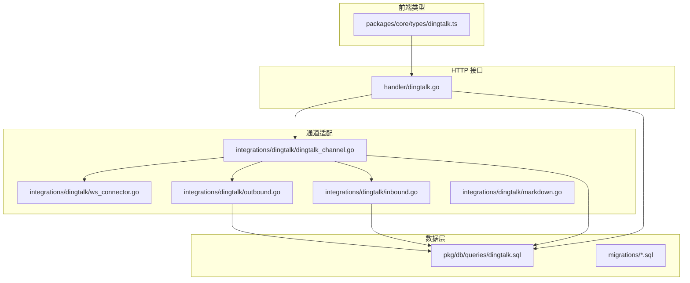
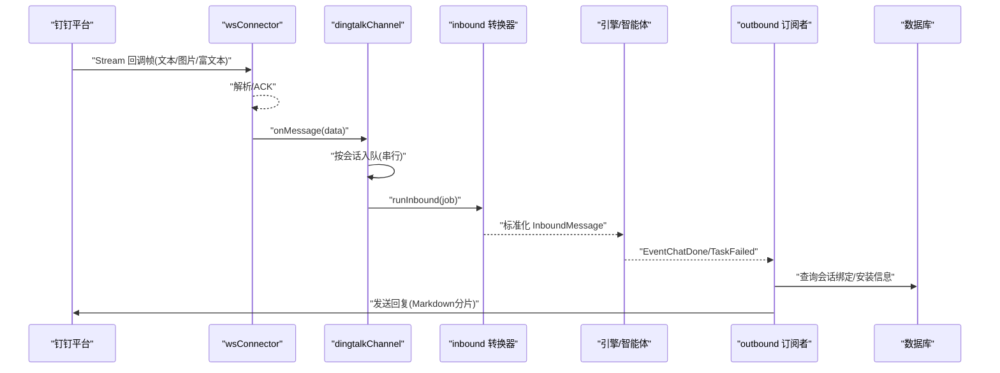
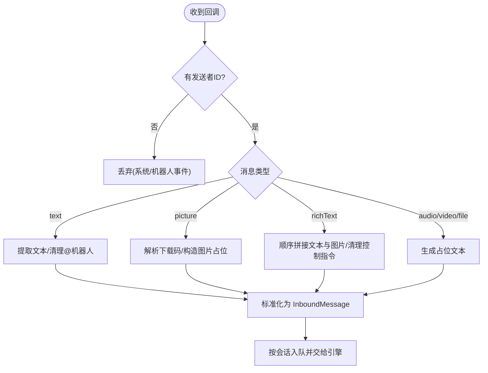
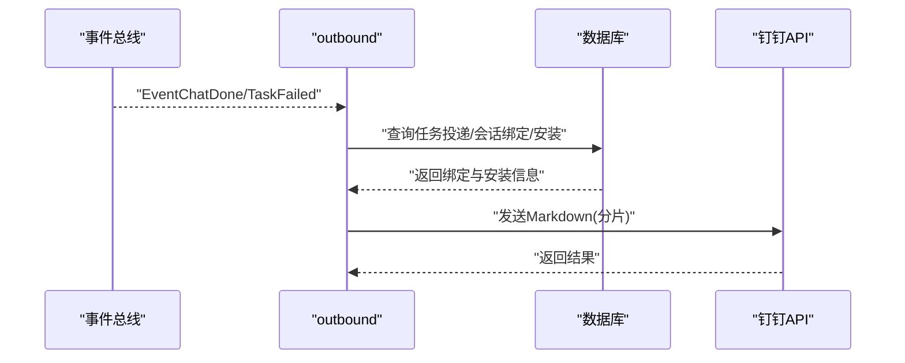
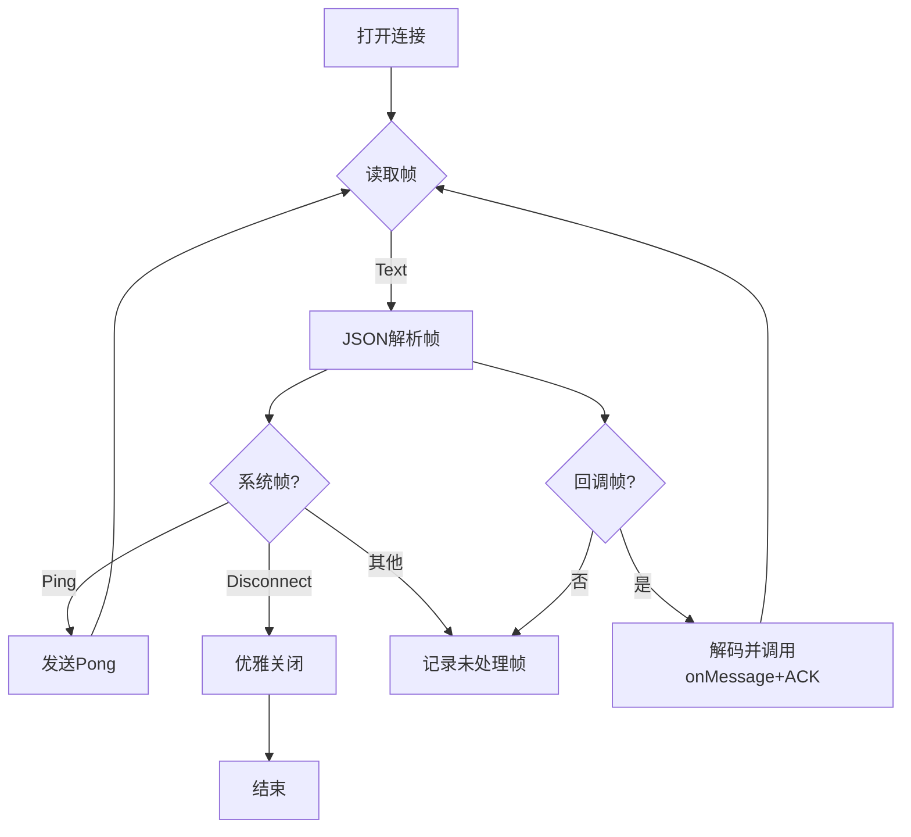
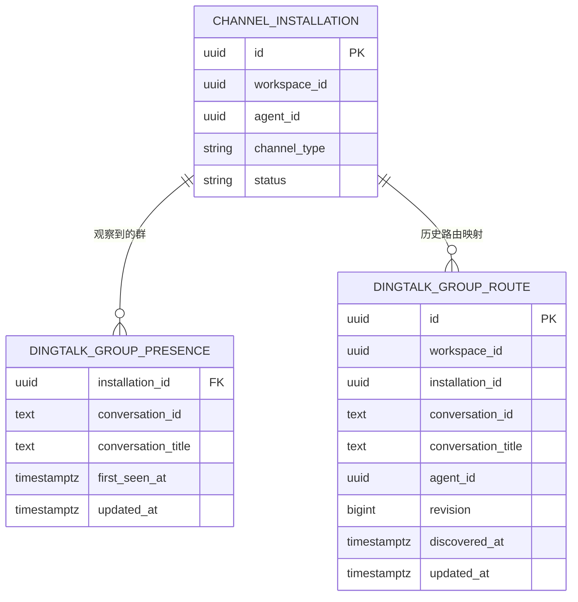
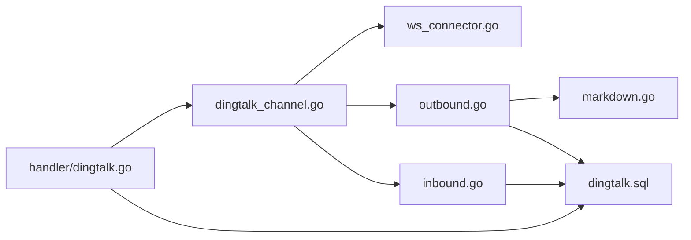

# 钉钉集成

<cite>
**本文引用的文件**
- [dingtalk_channel.go](file://server/internal/integrations/dingtalk/dingtalk_channel.go)
- [ws_connector.go](file://server/internal/integrations/dingtalk/ws_connector.go)
- [inbound.go](file://server/internal/integrations/dingtalk/inbound.go)
- [outbound.go](file://server/internal/integrations/dingtalk/outbound.go)
- [markdown.go](file://server/internal/integrations/dingtalk/markdown.go)
- [dingtalk.go](file://server/internal/handler/dingtalk.go)
- [dingtalk.sql](file://server/pkg/db/queries/dingtalk.sql)
- [304_dingtalk_group_route.up.sql](file://server/migrations/304_dingtalk_group_route.up.sql)
- [386_backfill_dingtalk_group_presence.up.sql](file://server/migrations/386_backfill_dingtalk_group_presence.up.sql)
- [dingtalk-bot-integration.mdx](file://apps/docs/content/docs/dingtalk-bot-integration.mdx)
- [channels.mdx](file://apps/docs/content/docs/channels.mdx)
- [SELF_HOSTING.md](file://SELF_HOSTING.md)
- [dingtalk.ts](file://packages/core/types/dingtalk.ts)
</cite>

## 目录
1. [简介](#简介)
2. [项目结构](#项目结构)
3. [核心组件](#核心组件)
4. [架构总览](#架构总览)
5. [详细组件分析](#详细组件分析)
6. [依赖关系分析](#依赖关系分析)
7. [性能与容量规划](#性能与容量规划)
8. [安装部署与配置](#安装部署与配置)
9. [安全考虑](#安全考虑)
10. [常见问题与调试](#常见问题与调试)
11. [结论](#结论)

## 简介
本文件面向需要在 Multica 中集成“钉钉企业内部应用”的工程师与运维人员，覆盖从应用创建、权限配置、回调地址设置到机器人消息收发、用户身份绑定、群聊路由、WebSocket 连接维护、Markdown 分片发送、安装部署与安全加固等全链路内容。文档以代码级事实为依据，提供可操作的步骤、架构图与排障指引。

## 项目结构
钉钉集成主要位于后端 Go 服务中，围绕 Channel 抽象实现：
- 接入层：HTTP API 用于管理安装、分组发现、账号绑定等（handler）
- 通道适配层：钉钉 Stream WebSocket 长连接、入站/出站消息转换、Markdown 分片
- 数据层：群组存在性、机器人身份、安装记录等 SQL 查询与迁移
- 前端类型定义：供桌面/Web 端消费的安装与分组数据结构

**图示来源**
- [dingtalk_channel.go:16-52](file://server/internal/integrations/dingtalk/dingtalk_channel.go#L16-L52)
- [ws_connector.go:15-26](file://server/internal/integrations/dingtalk/ws_connector.go#L15-L26)
- [inbound.go:13-23](file://server/internal/integrations/dingtalk/inbound.go#L13-L23)
- [outbound.go:28-59](file://server/internal/integrations/dingtalk/outbound.go#L28-L59)
- [markdown.go:8-31](file://server/internal/integrations/dingtalk/markdown.go#L8-L31)
- [dingtalk.go:23-66](file://server/internal/handler/dingtalk.go#L23-L66)
- [dingtalk.sql:87-117](file://server/pkg/db/queries/dingtalk.sql#L87-L117)

**章节来源**
- [dingtalk_channel.go:16-52](file://server/internal/integrations/dingtalk/dingtalk_channel.go#L16-L52)
- [dingtalk.go:23-66](file://server/internal/handler/dingtalk.go#L23-L66)

## 核心组件
- dingtalkChannel：每个安装对应一个 Stream 连接，负责连接生命周期、入站事件分发、出站发送、按会话串行化队列（避免重连时乱序）。
- wsConnector：自建 WebSocket 客户端，处理 Ping/Pong、系统帧、回调帧、ACK、断线重连（由上层 Supervisor 控制）。
- inbound 转换器：将钉钉回调标准化为引擎 InboundMessage，支持文本、图片、富文本、音视频/文件占位，并清理 @机器人 提及。
- outbound 订阅者：监听任务完成/失败事件，查找原始会话绑定并回发消息到钉钉。
- Markdown 分片：按 UTF-8 字节预算切分，保持代码块围栏完整，避免钉钉服务端丢弃超长消息。
- HTTP Handler：安装管理、分组发现、账号绑定令牌兑换、撤销安装等。
- 数据模型：群组存在性、机器人身份、安装表、迁移脚本。

**章节来源**
- [dingtalk_channel.go:62-143](file://server/internal/integrations/dingtalk/dingtalk_channel.go#L62-L143)
- [ws_connector.go:95-209](file://server/internal/integrations/dingtalk/ws_connector.go#L95-L209)
- [inbound.go:109-235](file://server/internal/integrations/dingtalk/inbound.go#L109-L235)
- [outbound.go:57-124](file://server/internal/integrations/dingtalk/outbound.go#L57-L124)
- [markdown.go:52-126](file://server/internal/integrations/dingtalk/markdown.go#L52-L126)
- [dingtalk.go:127-245](file://server/internal/handler/dingtalk.go#L127-L245)

## 架构总览
钉钉集成的端到端流程如下：
- 入站：钉钉通过 Stream 推送消息 → wsConnector 接收并 ACK → dingtalkChannel 按会话入队 → inbound 转换为标准消息 → 引擎处理 → 任务执行。
- 出站：任务完成后触发事件 → outbound 订阅者根据会话绑定找到目标 → 调用钉钉 API 发送回复（Markdown 分片）。
- 管理：Web 控制台通过 HTTP API 管理安装、查看活跃/不活跃群组、撤销安装、绑定账号等。

**图示来源**
- [ws_connector.go:171-209](file://server/internal/integrations/dingtalk/ws_connector.go#L171-L209)
- [dingtalk_channel.go:145-210](file://server/internal/integrations/dingtalk/dingtalk_channel.go#L145-L210)
- [inbound.go:109-235](file://server/internal/integrations/dingtalk/inbound.go#L109-L235)
- [outbound.go:57-124](file://server/internal/integrations/dingtalk/outbound.go#L57-L124)

## 详细组件分析

### 入站消息处理与群聊场景
- 仅当消息来自真实用户且满足“被@”或私聊条件才进入引擎；群聊必须包含对机器人的 @。
- 支持文本、图片、富文本；音视频/文件以占位形式透传，便于后续能力扩展。
- 自动清理 @机器人 提及，保证命令与正文不被污染。
- 对超大/不可读媒体降级为“不可用图片”，让引擎能给出身份门控反馈。

**图示来源**
- [inbound.go:109-235](file://server/internal/integrations/dingtalk/inbound.go#L109-L235)
- [inbound.go:237-283](file://server/internal/integrations/dingtalk/inbound.go#L237-L283)
- [inbound.go:285-381](file://server/internal/integrations/dingtalk/inbound.go#L285-L381)

**章节来源**
- [inbound.go:109-235](file://server/internal/integrations/dingtalk/inbound.go#L109-L235)
- [inbound.go:237-381](file://server/internal/integrations/dingtalk/inbound.go#L237-L381)

### 出站消息与 Markdown 分片
- 任务完成/失败事件触发后，outbound 根据任务投递记录定位会话绑定与安装，校验状态后发送回复。
- Markdown 按 UTF-8 字节预算切分，确保代码块围栏闭合/续接，避免钉钉服务端拒绝超长消息。
- 标题取自首行 ATX 标题，否则使用默认通知预览标题。

**图示来源**
- [outbound.go:57-124](file://server/internal/integrations/dingtalk/outbound.go#L57-L124)
- [markdown.go:8-31](file://server/internal/integrations/dingtalk/markdown.go#L8-L31)
- [markdown.go:52-126](file://server/internal/integrations/dingtalk/markdown.go#L52-L126)

**章节来源**
- [outbound.go:57-124](file://server/internal/integrations/dingtalk/outbound.go#L57-L124)
- [markdown.go:8-31](file://server/internal/integrations/dingtalk/markdown.go#L8-L31)
- [markdown.go:52-126](file://server/internal/integrations/dingtalk/markdown.go#L52-L126)

### WebSocket 连接与帧处理
- 单安装单连接，内置 Ping 保活、读取超时、写超时、Pong 重置读超时。
- 系统帧：Ping→Pong；Disconnect→优雅关闭并由上层重连。
- 回调帧：解码为 botCallbackData，调用 onMessage 并始终 ACK。
- 错误路径：网络/解码异常记录日志，不阻断整体流程；由 Supervisor 负责退避重连。

**图示来源**
- [ws_connector.go:95-209](file://server/internal/integrations/dingtalk/ws_connector.go#L95-L209)
- [ws_connector.go:211-227](file://server/internal/integrations/dingtalk/ws_connector.go#L211-L227)

**章节来源**
- [ws_connector.go:95-209](file://server/internal/integrations/dingtalk/ws_connector.go#L95-L209)
- [ws_connector.go:211-227](file://server/internal/integrations/dingtalk/ws_connector.go#L211-L227)

### 群组路由与会话隔离
- 每个安装对应一个机器人，同一机器人可参与多个群；每个群独立会话，互不影响。
- 群组存在性与活跃度持久化，支持列出活跃/不活跃群组及机器人身份。
- 旧路由表与新存在性表并存迁移，保障历史数据平滑过渡。

**图示来源**
- [304_dingtalk_group_route.up.sql:1-15](file://server/migrations/304_dingtalk_group_route.up.sql#L1-L15)
- [dingtalk.sql:87-117](file://server/pkg/db/queries/dingtalk.sql#L87-L117)
- [386_backfill_dingtalk_group_presence.up.sql:90-132](file://server/migrations/386_backfill_dingtalk_group_presence.up.sql#L90-L132)

**章节来源**
- [304_dingtalk_group_route.up.sql:1-15](file://server/migrations/304_dingtalk_group_route.up.sql#L1-L15)
- [dingtalk.sql:87-117](file://server/pkg/db/queries/dingtalk.sql#L87-L117)
- [386_backfill_dingtalk_group_presence.up.sql:90-132](file://server/migrations/386_backfill_dingtalk_group_presence.up.sql#L90-L132)

### 用户身份绑定与可见性
- 通过“绑定令牌”将钉钉用户与 Multica 用户关联，令牌有效期短，防止泄露滥用。
- 安装列表与分组发现接口按角色与可见性过滤，普通成员仅能看到其可访问的智能体相关数据。
- 前端类型定义保证前后端契约稳定，新增字段需兼容旧版本客户端。

**章节来源**
- [dingtalk.go:729-782](file://server/internal/handler/dingtalk.go#L729-L782)
- [dingtalk.go:127-245](file://server/internal/handler/dingtalk.go#L127-L245)
- [dingtalk.ts:1-100](file://packages/core/types/dingtalk.ts#L1-L100)

## 依赖关系分析
- dingtalkChannel 依赖 wsConnector 建立连接，依赖 inbound/outbound 进行消息转换与投递，依赖数据库查询安装与会话绑定。
- handler 暴露 REST 接口，依赖安装服务与数据库查询，同时发布实时事件刷新前端。
- markdown 模块被出站发送器使用，确保消息长度合规。

**图示来源**
- [dingtalk_channel.go:16-52](file://server/internal/integrations/dingtalk/dingtalk_channel.go#L16-L52)
- [dingtalk.go:23-66](file://server/internal/handler/dingtalk.go#L23-L66)
- [outbound.go:28-59](file://server/internal/integrations/dingtalk/outbound.go#L28-L59)
- [markdown.go:8-31](file://server/internal/integrations/dingtalk/markdown.go#L8-L31)

**章节来源**
- [dingtalk_channel.go:16-52](file://server/internal/integrations/dingtalk/dingtalk_channel.go#L16-L52)
- [dingtalk.go:23-66](file://server/internal/handler/dingtalk.go#L23-L66)
- [outbound.go:28-59](file://server/internal/integrations/dingtalk/outbound.go#L28-L59)
- [markdown.go:8-31](file://server/internal/integrations/dingtalk/markdown.go#L8-L31)

## 性能与容量规划
- 连接与并发：每安装单连接，按会话串行化队列，避免重连导致的乱序；读超时与写超时保护资源占用。
- 消息体积：Markdown 按 UTF-8 字节预算切分，避免服务端拒绝；代码块围栏在分片边界正确闭合/续接。
- 存储与索引：群组存在性表无外键约束，关系由应用层维护；迁移中使用并发索引创建，减少锁竞争。
- 多副本：若部署多副本，需关注长连接归属与转发机制（参考企业微信说明中的多副本注意事项，作为类比）。

[本节为通用指导，无需具体文件引用]

## 安装部署与配置
- 在钉钉开放平台创建企业内部应用，启用机器人能力并将消息接收模式设置为“流式模式”。
- 授予机器人所需权限（如消息发送、群基本信息管理等），以便显示机器人名称与正常收发。
- 获取 AppKey 与 AppSecret，并在 Multica 中“智能体 → 能力 → 集成”处连接。
- 自托管需设置加密密钥以安全存储 AppSecret，并确保前端 URL 可达。
- 首次交互可通过 DM 或群内 @机器人 触发账号绑定流程，链接短期有效。

**章节来源**
- [dingtalk-bot-integration.mdx:15-41](file://apps/docs/content/docs/dingtalk-bot-integration.mdx#L15-L41)
- [dingtalk-bot-integration.mdx:75-91](file://apps/docs/content/docs/dingtalk-bot-integration.mdx#L75-L91)
- [channels.mdx:94-94](file://apps/docs/content/docs/channels.mdx#L94-L94)

## 安全考虑
- 凭据安全：AppSecret 以密文存储，仅在需要时解密；禁止在日志或响应中泄露。
- 令牌安全：账号绑定令牌短期有效，防止重放与泄露。
- 最小权限：仅授予机器人必要权限，降低风险面。
- 传输安全：WebSocket 与 HTTP 均应在受信任网络或 TLS 环境下运行。
- 多副本注意：长连接持有者决定出站路径，需确保跨副本转发可靠（参考企业微信说明中的多副本行为）。

**章节来源**
- [dingtalk-bot-integration.mdx:75-91](file://apps/docs/content/docs/dingtalk-bot-integration.mdx#L75-L91)
- [SELF_HOSTING.md:380-386](file://SELF_HOSTING.md#L380-L386)

## 常见问题与调试
- 无法看到机器人名称：检查是否授予群基本信息管理权限；若无权限，名称解析会失败但功能不受影响。
- 群消息未被处理：确认消息中包含对机器人的 @；私聊则直接处理。
- 图片无法下载：可能因配额限制或格式不支持，适配器会降级为“不可用图片”，引擎可据此提示。
- 消息过长被拒：Markdown 已自动分片；若仍失败，检查是否包含异常长的行或特殊字符。
- 连接频繁断开：关注网关 Disconnect 帧与网络异常；由 Supervisor 负责重连与退避。
- 安装撤销后仍收到消息：确认安装状态已变为“已撤销”，并等待上游回调过期。

**章节来源**
- [dingtalk_channel.go:177-210](file://server/internal/integrations/dingtalk/dingtalk_channel.go#L177-L210)
- [inbound.go:109-235](file://server/internal/integrations/dingtalk/inbound.go#L109-L235)
- [markdown.go:8-31](file://server/internal/integrations/dingtalk/markdown.go#L8-L31)
- [ws_connector.go:191-209](file://server/internal/integrations/dingtalk/ws_connector.go#L191-L209)

## 结论
本集成以 Channel 抽象为核心，通过 Stream 长连接实现高吞吐、低延迟的消息收发；按会话串行化与 Markdown 分片保障了稳定性与兼容性；结合安装管理、群组发现与账号绑定，形成完整的钉钉机器人工作流。建议在生产环境严格遵循最小权限、凭据加密与多副本转发策略，以获得最佳的安全性与可靠性。