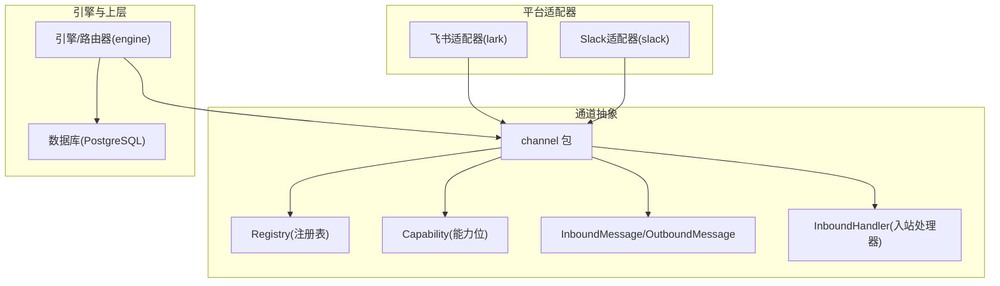
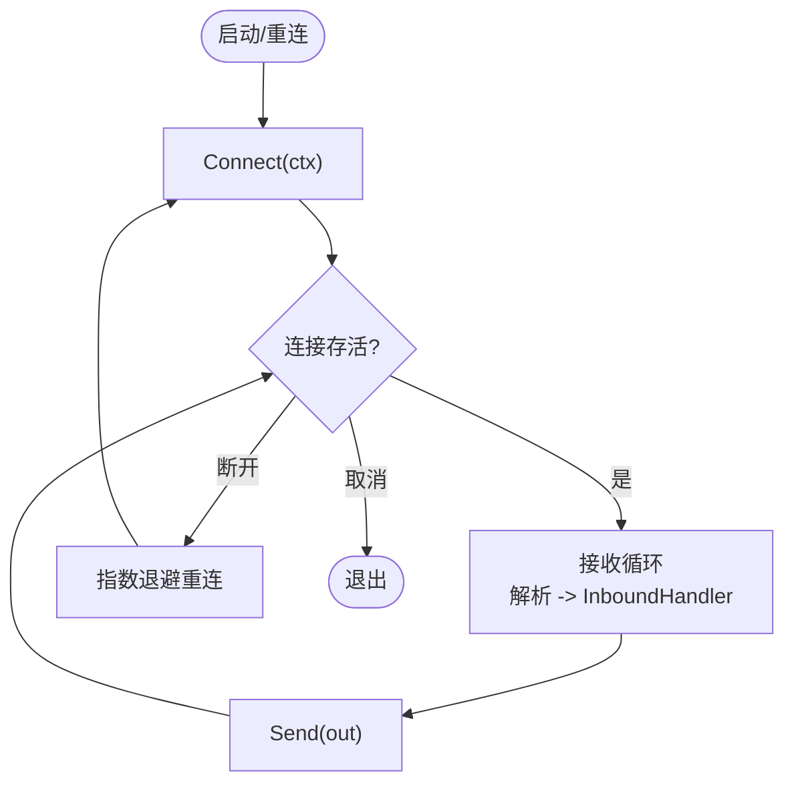
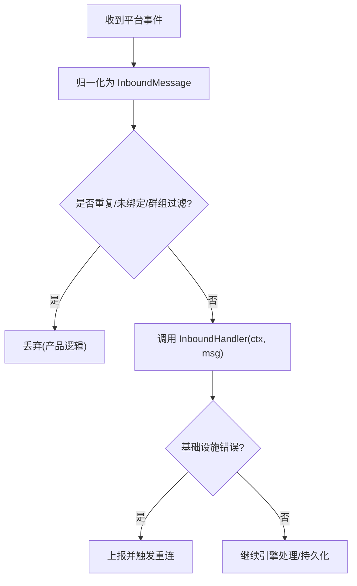
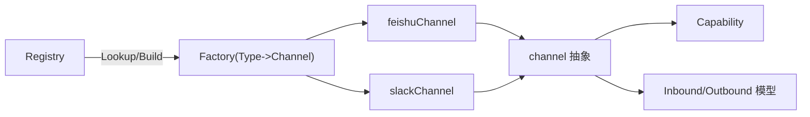

# 自定义集成开发指南

<cite>
**本文引用的文件**
- [channel.go](file://server/internal/integrations/channel/channel.go)
- [handler.go](file://server/internal/integrations/channel/handler.go)
- [registry.go](file://server/internal/integrations/channel/registry.go)
- [capability.go](file://server/internal/integrations/channel/capability.go)
- [message.go](file://server/internal/integrations/channel/message.go)
- [feishu_channel.go](file://server/internal/integrations/lark/feishu_channel.go)
- [slack_channel.go](file://server/internal/integrations/slack/slack_channel.go)
- [multica.plugin.json](file://examples/plugins/hello-panel/multica.plugin.json)
</cite>

## 目录
1. [简介](#简介)
2. [项目结构](#项目结构)
3. [核心组件](#核心组件)
4. [架构总览](#架构总览)
5. [详细组件分析](#详细组件分析)
6. [依赖关系分析](#依赖关系分析)
7. [性能考虑](#性能考虑)
8. [故障排查指南](#故障排查指南)
9. [结论](#结论)
10. [附录](#附录)

## 简介
本指南面向希望为 Multica 后端新增外部 IM/协作平台集成的开发者。Multica 通过统一的“通道抽象”将不同平台（如飞书、Slack、企业微信等）的消息收发、能力声明与生命周期管理标准化，使新增集成只需实现最小接口并注册到全局注册表即可接入引擎。本文覆盖：
- 统一通道抽象与工厂模式
- 消息处理流程与认证机制
- 错误处理策略与幂等设计
- 测试方法与调试技巧
- 完整开发示例、部署流程与发布规范
- 性能优化建议与最佳实践
- 如何贡献新的集成到项目中

## 项目结构
后端集成位于 server/internal/integrations 下，其中 channel 包提供跨平台的统一抽象；lark、slack、wecom、dingtalk、telegram 等子目录是具体平台适配器；engine 子包负责编排与调度。插件系统位于 examples/plugins，用于前端/服务端扩展。



图表来源
- [channel.go:24-76](file://server/internal/integrations/channel/channel.go#L24-L76)
- [registry.go:14-63](file://server/internal/integrations/channel/registry.go#L14-L63)
- [capability.go:5-33](file://server/internal/integrations/channel/capability.go#L5-L33)
- [message.go:119-217](file://server/internal/integrations/channel/message.go#L119-L217)
- [feishu_channel.go:20-98](file://server/internal/integrations/lark/feishu_channel.go#L20-L98)
- [slack_channel.go:19-64](file://server/internal/integrations/slack/slack_channel.go#L19-L64)

章节来源
- [channel.go:24-110](file://server/internal/integrations/channel/channel.go#L24-L110)
- [registry.go:14-78](file://server/internal/integrations/channel/registry.go#L14-L78)
- [capability.go:5-95](file://server/internal/integrations/channel/capability.go#L5-L95)
- [message.go:5-217](file://server/internal/integrations/channel/message.go#L5-L217)
- [feishu_channel.go:20-200](file://server/internal/integrations/lark/feishu_channel.go#L20-L200)
- [slack_channel.go:19-200](file://server/internal/integrations/slack/slack_channel.go#L19-L200)

## 核心组件
- Channel 接口：定义 Type、Connect、Disconnect、Send、Capabilities，屏蔽平台差异。
- InboundHandler：通道收到的每条消息统一回调的入口，适配器负责接收循环并将消息投递给该处理器。
- Registry：按 Type 注册/查找 Factory，支持并发安全与“最后写入者胜”的覆盖策略。
- Capability：位掩码声明通道能力（文本、富卡片、引用回复、附件、语音、输入指示、消息编辑等）。
- 消息模型：InboundMessage/OutboundMessage/Source/MediaRef/ReplyCtx 等，保证跨平台一致的数据形态。

章节来源
- [channel.go:24-110](file://server/internal/integrations/channel/channel.go#L24-L110)
- [handler.go:5-31](file://server/internal/integrations/channel/handler.go#L5-L31)
- [registry.go:14-78](file://server/internal/integrations/channel/registry.go#L14-L78)
- [capability.go:5-95](file://server/internal/integrations/channel/capability.go#L5-L95)
- [message.go:5-217](file://server/internal/integrations/channel/message.go#L5-L217)

## 架构总览
下图展示从平台事件到引擎处理的端到端流程，以及出站消息的发送路径。

```mermaid
sequenceDiagram
participant P as "平台(飞书/Slack)"
participant C as "Channel(适配器)"
participant H as "InboundHandler(引擎路由)"
participant E as "引擎/调度器"
participant D as "数据库"
P->>C : "入站事件/消息"
C->>C : "解析与归一化(InboundMessage)"
C->>H : "调用 InboundHandler(ctx, msg)"
H->>E : "分类/去重/身份绑定/持久化"
E->>D : "写入会话/消息/附件索引"
E-->>H : "返回(产品丢弃或继续处理)"
Note over C,H : "产品级丢弃不视为错误; 基础设施错误才触发重连"
E-->>C : "需要回复时调用 Send(out)"
C->>P : "发送出站消息"
```

图表来源
- [channel.go:24-76](file://server/internal/integrations/channel/channel.go#L24-L76)
- [handler.go:5-31](file://server/internal/integrations/channel/handler.go#L5-L31)
- [message.go:119-217](file://server/internal/integrations/channel/message.go#L119-L217)
- [feishu_channel.go:46-98](file://server/internal/integrations/lark/feishu_channel.go#L46-L98)
- [slack_channel.go:66-128](file://server/internal/integrations/slack/slack_channel.go#L66-L128)

## 详细组件分析

### 通道接口与生命周期
- Connect：建立长连接或监听，阻塞运行接收循环；上下文取消即优雅退出；返回 nil 表示被取消，非 nil 表示不可恢复的连接失败，由上层指数退避重连。
- Disconnect：释放资源，幂等安全。
- Send：发送单条出站消息，返回平台消息 ID；网络/鉴权/限流等真实失败需可重试。
- Capabilities：纯声明，无副作用，供上层决定渲染降级策略。



图表来源
- [channel.go:40-76](file://server/internal/integrations/channel/channel.go#L40-L76)
- [slack_channel.go:66-128](file://server/internal/integrations/slack/slack_channel.go#L66-L128)
- [feishu_channel.go:46-63](file://server/internal/integrations/lark/feishu_channel.go#L46-L63)

章节来源
- [channel.go:40-76](file://server/internal/integrations/channel/channel.go#L40-L76)

### 入站消息处理与幂等
- InboundHandler 是单一入口，适配器负责接收循环并调用；非 nil 错误代表基础设施失败，应触发重连；nil 可能包含产品层面的丢弃（重复、未绑定、群组过滤），不应视为错误。
- InboundMessage 使用 EventID + MessageID 做幂等键；Source 携带跨平台路由标识；MediaRef 指向对象存储中的附件；ReplyCtx 描述引用/线程上下文。



图表来源
- [handler.go:5-31](file://server/internal/integrations/channel/handler.go#L5-L31)
- [message.go:119-188](file://server/internal/integrations/channel/message.go#L119-L188)

章节来源
- [handler.go:5-31](file://server/internal/integrations/channel/handler.go#L5-L31)
- [message.go:119-188](file://server/internal/integrations/channel/message.go#L119-L188)

### 能力声明与渲染决策
- Capability 以位掩码声明支持的能力（文本、富卡片、线程回复、引用回复、附件、语音、输入指示、消息编辑）。
- 上层根据 Capabilities() 决定是否使用富卡片、是否显示输入指示、是否允许编辑已发消息等。

章节来源
- [capability.go:5-95](file://server/internal/integrations/channel/capability.go#L5-L95)

### 注册表与工厂模式
- Registry 维护 Type -> Factory 映射，支持并发读写；Build(cfg) 根据 cfg.Type 构建对应 Channel。
- 新增平台仅需注册一个 Factory，无需修改核心逻辑。

章节来源
- [registry.go:14-63](file://server/internal/integrations/channel/registry.go#L14-L63)

### 飞书适配器实现要点
- feishuChannel 实现 Channel 接口，Connect 运行共享 WS 连接器，将事件归一化为 channel.InboundMessage 后交给引擎处理器。
- Send 通过 HTTP API 发送文本回复；Capabilities 声明了富卡片、线程/引用、附件、输入指示、消息编辑等能力。
- 安装凭据通过 CredentialsResolver 解密 app_secret，并按 region/tenant_key 组装。

章节来源
- [feishu_channel.go:20-200](file://server/internal/integrations/lark/feishu_channel.go#L20-L200)

### Slack 适配器实现要点
- slackChannel 基于 Socket Mode 建立连接，按安装维度持有独立 app-level token；接收 Events API 与 Slash Command 事件。
- 对 Events API/Slash Command 先 ACK 再处理，避免超时；dispatch 后将事件归一化为 InboundMessage 并调用 InboundHandler。
- Send 通过 bot token 发送出站消息。

章节来源
- [slack_channel.go:19-200](file://server/internal/integrations/slack/slack_channel.go#L19-L200)

### 插件系统与扩展点
- 插件清单 multica.plugin.json 声明作用域、表面（surfaces）、入口脚本等，用于在前端/服务端扩展功能。
- 对于集成而言，插件可作为 UI/服务侧补充，而通道层仍遵循统一抽象。

章节来源
- [multica.plugin.json:1-21](file://examples/plugins/hello-panel/multica.plugin.json#L1-L21)

## 依赖关系分析
- 适配器依赖 channel 抽象，不直接耦合引擎内部类型；引擎通过 Registry.Build 获取 Channel 实例。
- 飞书/Slack 适配器各自封装平台 SDK，仅暴露 Channel 接口所需方法。
- 能力位与消息模型解耦平台细节，便于上层统一处理。



图表来源
- [registry.go:14-63](file://server/internal/integrations/channel/registry.go#L14-L63)
- [channel.go:24-110](file://server/internal/integrations/channel/channel.go#L24-L110)
- [capability.go:5-95](file://server/internal/integrations/channel/capability.go#L5-L95)
- [message.go:5-217](file://server/internal/integrations/channel/message.go#L5-L217)
- [feishu_channel.go:20-200](file://server/internal/integrations/lark/feishu_channel.go#L20-L200)
- [slack_channel.go:19-200](file://server/internal/integrations/slack/slack_channel.go#L19-L200)

章节来源
- [registry.go:14-78](file://server/internal/integrations/channel/registry.go#L14-L78)
- [channel.go:24-110](file://server/internal/integrations/channel/channel.go#L24-L110)

## 性能考虑
- 连接复用与隔离：每个安装维度的连接独立，避免跨租户干扰；WS 长连接在 Connect 中阻塞运行，断开后由上层指数退避重连。
- 快速 ACK：Slack 的 Events API 与 Slash Command 先 ACK 再处理，避免平台侧超时丢弃。
- 小信封传输：InboundMessage 仅保留必要字段，媒体走对象存储，减少消息体积。
- 幂等与去重：EventID + MessageID 作为幂等键，避免重复处理。
- 能力声明驱动降级：上层依据 Capabilities 选择合适渲染，避免不必要的复杂请求。

[本节为通用指导，不直接分析具体文件]

## 故障排查指南
- 连接问题：Connect 返回非 nil 错误且非上下文取消时，视为连接失败，应由上层重连；检查平台令牌、网络与限流。
- 入站处理错误：InboundHandler 返回非 nil 错误为基础设施错误（DB/调度配置异常），需上报并触发重连；产品丢弃返回 nil。
- 出站失败：Send 返回网络/鉴权/限流错误时应重试；确认 ChatID/ThreadID/ReplyTo 是否正确。
- 幂等重复：若出现重复消息，检查 EventID/MessageID 是否被正确记录与比对。
- 能力不足：当上层期望富卡片但 Capabilities 未声明时，应回退到文本。

章节来源
- [handler.go:5-31](file://server/internal/integrations/channel/handler.go#L5-L31)
- [channel.go:40-76](file://server/internal/integrations/channel/channel.go#L40-L76)
- [slack_channel.go:130-175](file://server/internal/integrations/slack/slack_channel.go#L130-L175)
- [feishu_channel.go:65-98](file://server/internal/integrations/lark/feishu_channel.go#L65-L98)

## 结论
通过统一的通道抽象、清晰的入站/出站模型与注册表机制，新增外部系统集成只需实现最小接口并完成注册。结合幂等、能力声明与快速 ACK 等设计，可在保证稳定性的同时提升可扩展性与可维护性。

[本节为总结性内容，不直接分析具体文件]

## 附录

### 新增集成开发步骤（从零到上线）
1. 定义适配器类型与常量（Type）
   - 参考现有 Type 命名约定，保持稳定且小写。
   - 章节来源
     - [channel.go:10-22](file://server/internal/integrations/channel/channel.go#L10-L22)

2. 实现 Channel 接口
   - Connect：建立长连接/监听，阻塞运行接收循环，上下文取消即退出。
   - Disconnect：幂等释放资源。
   - Send：发送文本/富卡片/附件等（富卡片可通过适配器自有类型扩展）。
   - Capabilities：声明支持的能力位。
   - 章节来源
     - [channel.go:24-76](file://server/internal/integrations/channel/channel.go#L24-L76)
     - [capability.go:5-33](file://server/internal/integrations/channel/capability.go#L5-L33)

3. 归一化入站消息
   - 将平台事件转换为 InboundMessage，填充 Source、Type、Text、MediaRefs、ReplyCtx 等。
   - 将平台特有字段存入 Raw，供适配器内部读取。
   - 章节来源
     - [message.go:119-188](file://server/internal/integrations/channel/message.go#L119-L188)

4. 注册工厂
   - 在应用初始化阶段向 Registry 注册 Type -> Factory 映射。
   - 章节来源
     - [registry.go:14-63](file://server/internal/integrations/channel/registry.go#L14-L63)

5. 认证与凭据
   - 从 per-installation 配置中读取并解密凭据（如 app_secret、bot token）。
   - 章节来源
     - [feishu_channel.go:100-121](file://server/internal/integrations/lark/feishu_channel.go#L100-L121)
     - [slack_channel.go:19-38](file://server/internal/integrations/slack/slack_channel.go#L19-L38)

6. 错误处理与幂等
   - 区分基础设施错误与产品丢弃；使用 EventID/MessageID 做幂等。
   - 章节来源
     - [handler.go:5-31](file://server/internal/integrations/channel/handler.go#L5-L31)
     - [message.go:125-130](file://server/internal/integrations/channel/message.go#L125-L130)

7. 测试与调试
   - 单元测试：模拟平台事件与 InboundHandler 行为，验证归一化与能力判断。
   - 集成测试：构造本地 WebSocket/HTTP 回调，验证 Connect/Disconnect/Send 流程。
   - 日志与指标：记录连接状态、错误类型、重试次数、吞吐与延迟。
   - 章节来源
     - [slack_channel.go:130-175](file://server/internal/integrations/slack/slack_channel.go#L130-L175)
     - [feishu_channel.go:46-98](file://server/internal/integrations/lark/feishu_channel.go#L46-L98)

8. 部署与发布
   - 在部署时确保 Registry 已注册新 Type；配置 per-installation 凭据。
   - 如需前端面板或服务端扩展，配合插件清单进行声明。
   - 章节来源
     - [multica.plugin.json:1-21](file://examples/plugins/hello-panel/multica.plugin.json#L1-L21)

### 最佳实践
- 严格遵循通道边界：适配器只关心平台协议与归一化，业务逻辑交由引擎。
- 优先使用能力位进行降级：不要硬编码分支到核心。
- 快速 ACK 与异步处理分离：避免阻塞平台回调。
- 幂等与去重：利用 EventID/MessageID 保障可靠性。
- 小消息与大附件分离：文本走 InboundMessage，媒体走对象存储。
- 可观测性：记录关键路径的错误与耗时，便于定位问题。

[本节为通用指导，不直接分析具体文件]